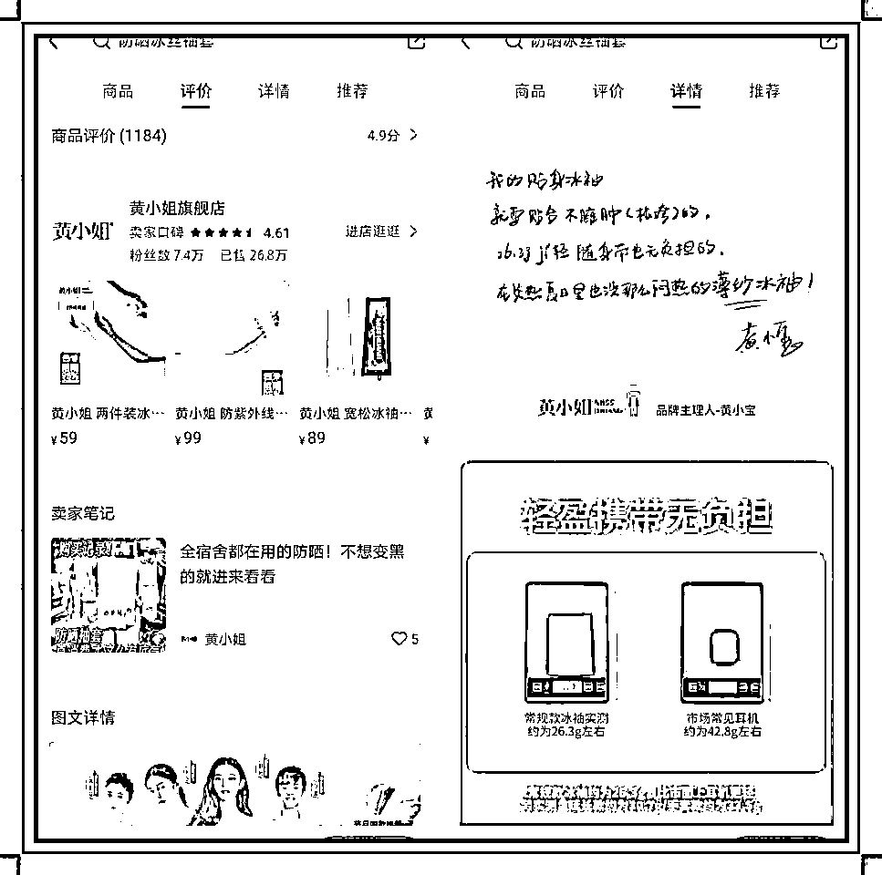
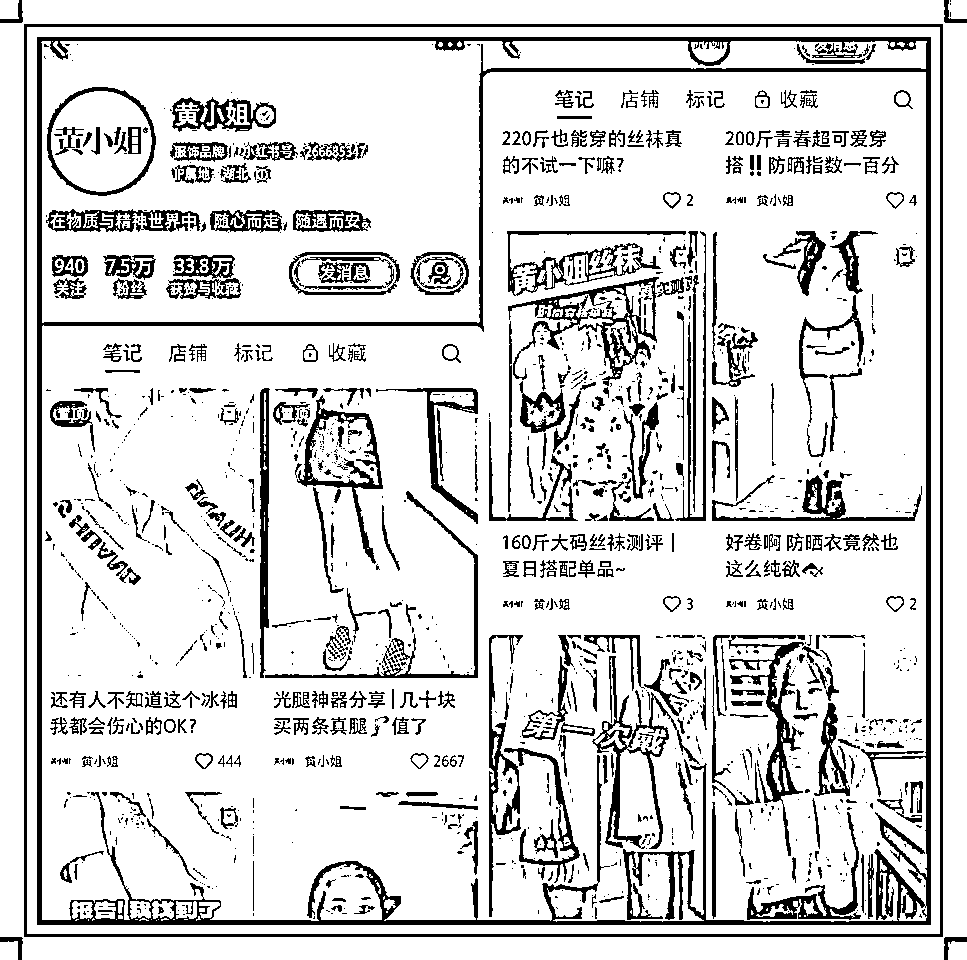

# (146赞)小红书定位功能性女生用品的账号，2年左右，累计卖了26.8万单

作者：  陆哲超

日期：2023-05-23

今天小红书店铺航海起航了，刷到一个小红书帐号，我觉得是小红书电商天花板级的帐号，帐号应该做了2年左右，累计卖了26.8万单，单小红书累计的营业额2000万应该是有的，产品定价都在50-100元，定位是类功能性的女生用品，以光腿神器，丝袜，冰袖，内衣，安全裤，抹胸，吊带，打底裤这类产品，成本都低，大部分都不超过10元，而售价都是50+以上，这个选品非常好，我觉得这些选品可以参考。

笔记内容目前以视频为主，帐号的拍摄内容，不管是视频还是图片，都是围绕产品实用来，不是展示女生好不好看，脸不重要，围绕能不能穿，好不好用，视频内容女生出境，用男生配音，很多视频都是不同的女生出境，不同的场景拍的，我感觉像实拍的，但是里面场景和人都不一样，好多视频都不一样，这个不知道有没有圈友知道怎么实 

 

现。

 

 

评论区：

陆哲超 : 这个帐号案例我觉得非常经典，不管是选品，选品，还是带货成绩，有没有有刷到过这个帐号，或者做过这类的，包括帐号的选品，笔记的内容，一起交流一下[奸笑]

亦仁 : 中标，术值+1。

在上方专栏点击 #中标，可查看所有中标风向标。

lydia : 这是个品牌店

lydia : 最开始做倒流淘宝的

陆哲超 : 对的  是品牌店  选的品很好

 

 

陆哲超 : 我看淘宝确实也有店

章果老 : 这家店在淘宝小而美时期就是比较有名的代表之一
