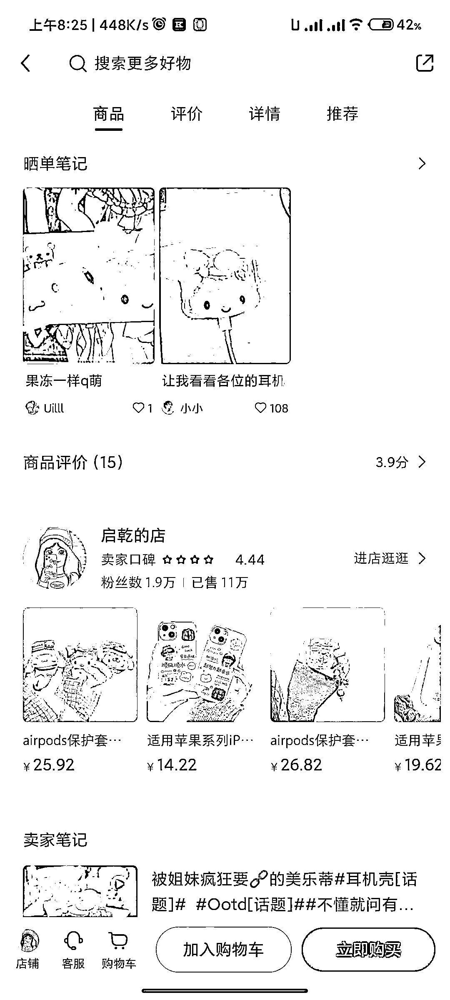
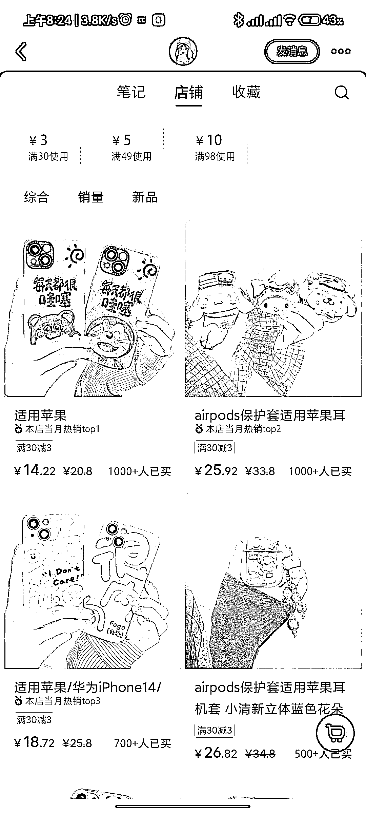
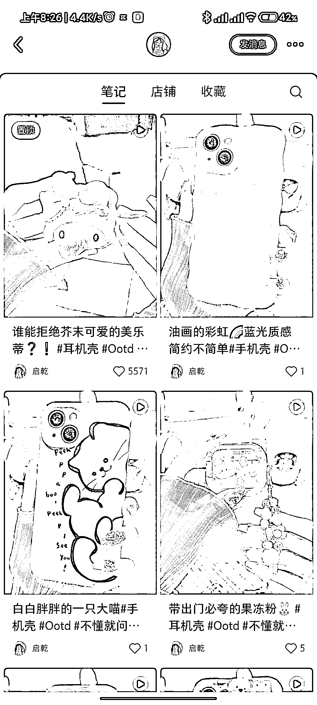

# (113 赞)挖掘小红书小而美店铺（4）爆单的小清新手机壳店铺藏都藏不住

作者：  落落

日期：2023-05-10

挖掘小红书小而美店铺（4）- 爆单的小清新手机壳店铺藏都藏不住

入选标准：粉不多但销量超高，选品优秀，无带货技巧，无需露脸。

带货表现：不到 2w 粉丝，销量有 10 几万，让我惊叹❗  店铺客单价 15- 30 元之间。

pdd 上零售价可低到 5-10 元。

选品特点：  主打 iphone 手机壳和 airpod 硅胶立体保护壳，清新可爱时尚的风格，客单价比安卓手机要高不少，毕竟花得了买手机和耳机的钱，值得配一个品质好点的保护壳。

带货方式：

视频，一只装饰好看的手来动态显示产品，提高质感。精致的视频封面，看一眼就会被吸引。

特点：  氛围感营造的很好，店铺风格，视频风格和布景很统一，心思藏在细节里。

标题文案：标准的适用机型+风格描述，全靠视频封面。

 

 

 

 

 

 

 

 

 

 

 

 

评论区：

亦仁 : 中标，术值+1。

在上方专栏点击 #中标，可查看所有中标风向标。

落落 : 感谢

groot : 有没有可能是补单呢

SOHO 佳文 : 下午刚和一个朋友聊天，他们手机壳厂家做抖音直播，每天也有几千出货量**# ****(107**赞**)**小红书无货源电商选品参考案例

作者：  曜文

日期：2023-02-13

大家好，我是曜文

上周分享了小红书无货源实战流程

 

 

发现很多人对选品感兴趣所以就花了一天的时间整理了部分案例加选品参考和输出内容的方式，希望能对大家有所帮助。

小红书能卖的品实在是太多了但目前基本是以女性小孩为主的产品

目前在小红书做电商，你不需要很多的粉丝

你可能 0 粉就能出单

更不需要去花大量的心思装修店铺

只需要选好产品，上架产品，布局好关键词，每天输出内容就可以出单

由于内容涉及多图片加视频，所以整理到飞书分享：

https://t.zsxq.com/0bfVshrgs https://go6xq64elg.feishu.cn/docx/JmfRdTyKZouw6nx3xI7cL4hUnpb

评论区：

卢志敏 : 哈哈，看完思路开阔了许多！！！

Liu : 怎么联系

水深无形 : 大佬朋友圈方便围观吗？  最近在操作小红书

曜文 : 欢迎！

Yummy : 想围观朋友圈可以吗？怎么联系你呀~

莫等闲 : 大佬  怎么联系您

斐娜 : 可以加 VX 交流吗大佬？

顽石上的温度 : 大佬可以加 V 吗？
