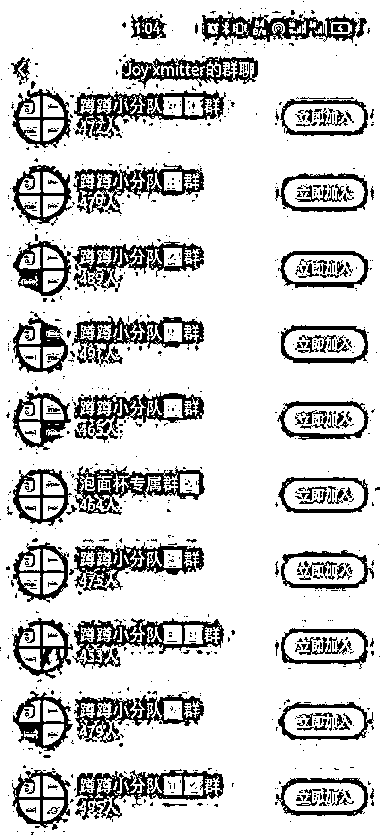
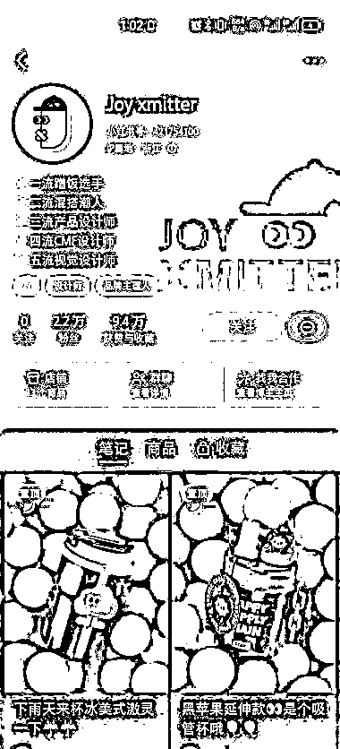

# (75赞)巧妙选品的水杯设计账号，成功转化客户并大量销售

作者：  凌州

日期：2023-07-05

 

 

这是一个水杯设计账号，

选品非常巧妙

二月份可能对水的需求不大

用设计内容来预热积累客户

六七月份正好夏天大量需要水杯

此时将之前积累的客户迅速转化

杯子主色调以撞色为主

从起号就一直在提醒“蹲蹲”

二月起号到现在五个月时间

更新了30+条笔记，涨粉2.2万

评论下方都是好看、怎么买等优质评论

十个粉丝群拉满

已售出一万余件

 

 

有相应设计能力的朋友可以考虑一下这个套路

 

 

评论区：

 

 

那又如何 : 这种是不是发现这个设计火了就得迅速开模做，万一你一直在积累客户等量够了再开模，但是别人看你的设计好直接开模做现成品开卖那就坑了😂

凌州 : 他这个已经申请专利了

亦仁 : 中标，术值+1。

在上方专栏点击 #中标，可查看所有中标风向标

团哥 : 水杯的模具很贵，大几十万，有一定门槛。

团哥 : 国内外观专利也不太好用。

Brewnut : 这个去问了下，是厂家自己的号，有工厂有设计师

菲菲 : 所以的有工厂，由设计师能订做才可以～

Alex : 恭喜中标[呲牙]
