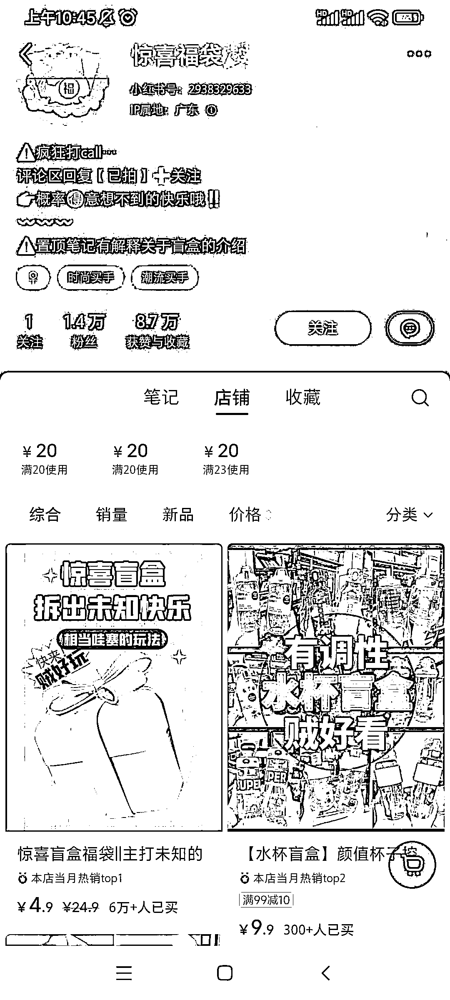
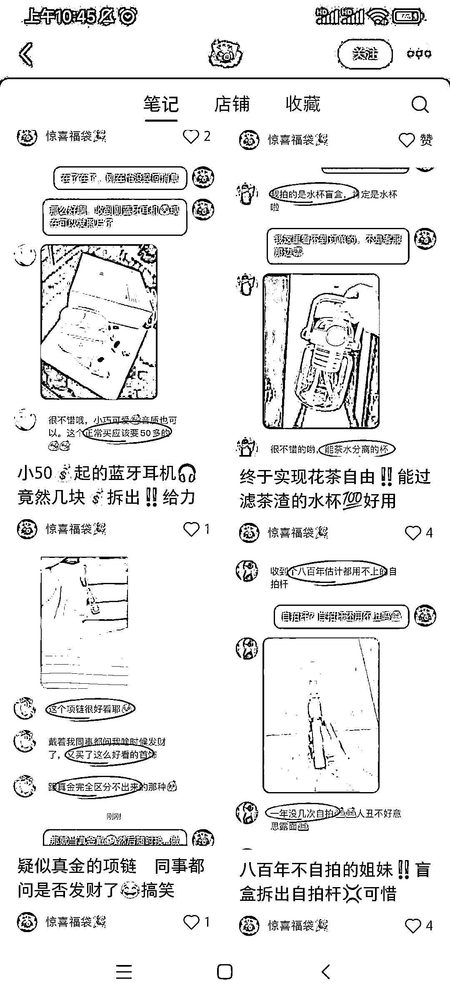

# (81赞)博主通过惊喜福袋创造了高销量和粉丝数量

 

 

作者：  转下脖子

日期：2023-07-25

博主：惊喜福袋  销量：6w+ 粉丝：1.4w 销售额：30w+

商品：惊喜盲盒福袋|主打未知的

账号今年3月份开始发笔记，每天发布的笔记数量10篇左右，每一篇的形式都是与客户的聊天记录，记录客户的盲盒商品以及顾客的反应。主打一个销售未知的惊喜，可以把这套玩法用在其他商品领域，笔记内容介绍售卖的商品类型，唯一售品就是盲盒。

 

 

 

 

 

 

评论区：

豆豆 : 哈哈哈，这个可以，前期没客源的话还可以自己找人伪装下

亦仁 : 中标，术值+1。

在上方专栏点击 #中标，可查看所有中标风向标
