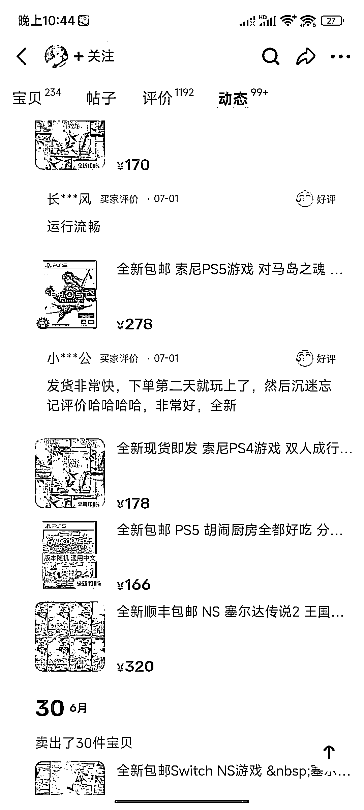
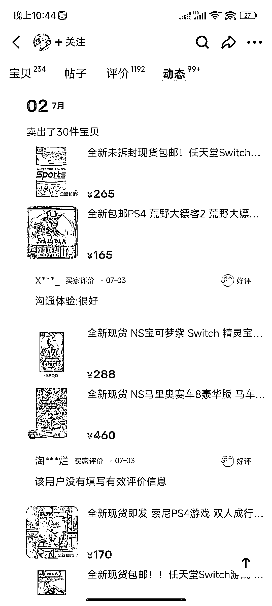
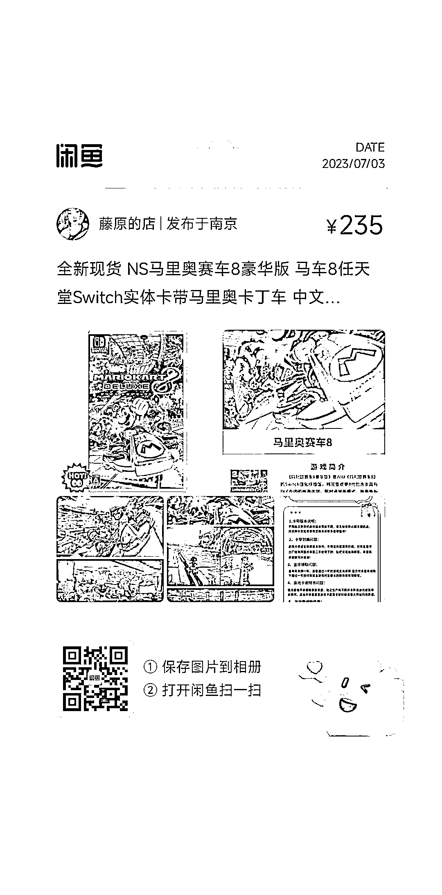

# (60赞)闲鱼热销游戏卡带，每天 20-30 单，利润可观

作者：  远方

日期：2023-07-03

编号 02

分享一个闲鱼挺火的产品，游戏卡带，

在闲鱼卖的挺火的，每天20～30单

 

 

有些门槛，但很好做，竞争少

把门槛研究透，就是赚钱

【简单分析下】

商品是挂着卖，同时也是挂着寻回收

我认为大概率

有玩家出售找到他，他会说帮忙挂着卖

由买家找到他之后，直接让玩家发货过去

同时

有人买了

把这游戏要通关之后

可能会再卖给商家

名称:switch游戏卡带

价格:235-280

想要数:394

总销量:1832

近3天销量:65

利润:9-20左右

店铺名称:藤原的店

点评:卡带利润不等  这个类目可持续发展前景不错

 

 

 

 

 

 

 

 

 

 

 

 

评论区：

大圣大老师 : 哪里能拿到货，我找很久也没找到

Irene : 求货源

闰土 : 小红书抖音起号  收  或者拼多多  淘宝  找商家谈

还是得自己收  但是这玩意  前期学  得教不少学费  说道挺多  我从来不敢买二手卡带  都是买新的  怕出问题  小红书这玩意流量挺大的

小橘子 : 我买过，顾客也是他的货源，就他也负责回收

远方 : 商品是挂着卖，同时也是挂着寻回收

我认为大概率

有玩家出售找到他，他会说帮忙挂着卖

由买家找到他之后，直接让玩家发货过去

同时

有人买了

把这游戏要通关之后

可能会再卖给商家

远方 : 二手的，卡带，都是玩家流通

售后不大，几乎0

不会像手机翻新扩容门道太多

亦仁 : 中标，术值+1。

 

 

在上方专栏点击 #中标，可查看所有中标风向标

首页作者 : 这种一般都是去闲鱼淘宝自己收自己卖，卡带二手交易
