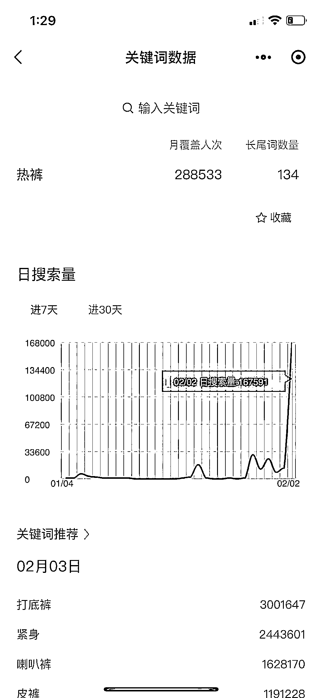
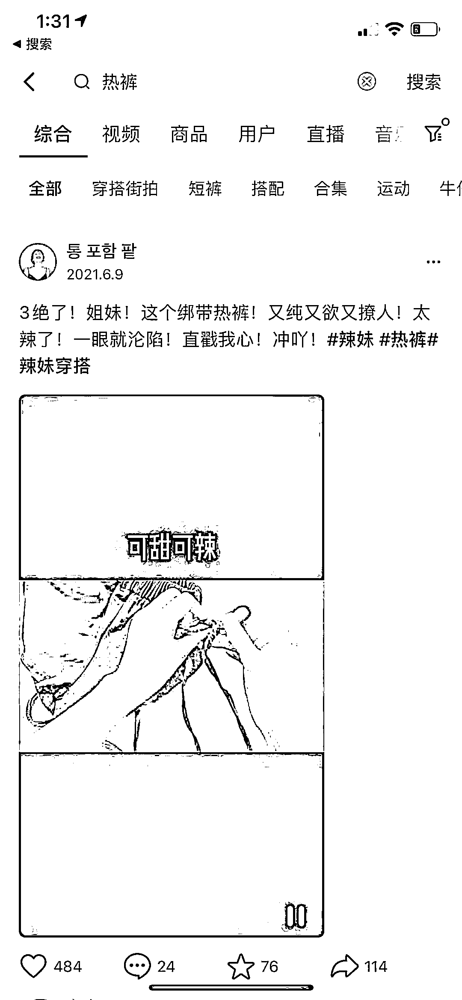

# (39赞)电商选品，热裤搜索量飙升

作者：  令狐峰

日期：2023-02-03

异常值，「热裤」这个关键词，移动端从几乎0搜索量，突然飙升到16万。

 

 

 

 

 

 

评论区：

亦仁 : 中标，术值+1。

在上方 #星球栏目  专栏中，点击 #中标，可查看所有中标风向标。

一登 : 请问这个异常值，是用软件随时监控的吗！

令狐峰 : 是的，用软件监控出来的

一登 : 老师用的什么软件，可否推荐个软件，我也用用

令狐峰 : 自己研发的，还在内测中

封伟-自动化变现 : 测试过一些关键词，微信指数彪升同时排名靠前，搜索关注差异不大。

所以现在都结合微信广告的搜索数据同步参考

易博 : 请问看关键词数据是哪个小程序？

封伟-自动化变现 : 微信指数
