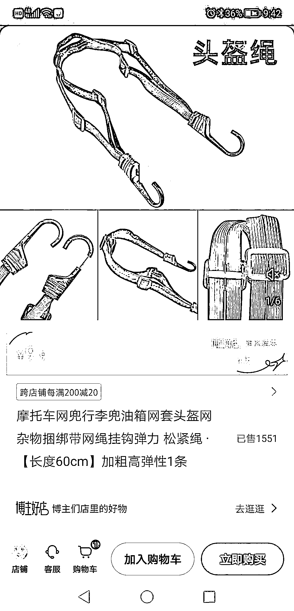
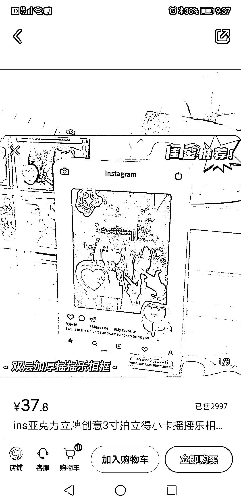
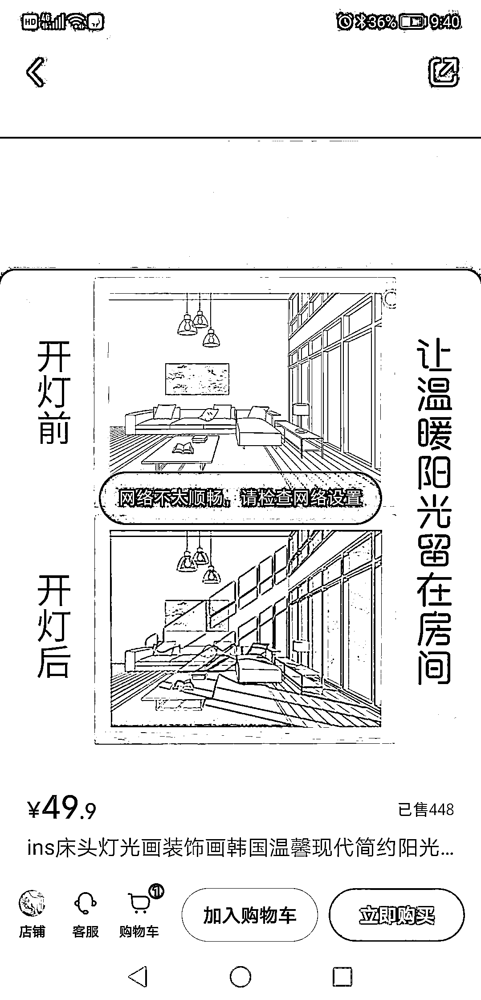
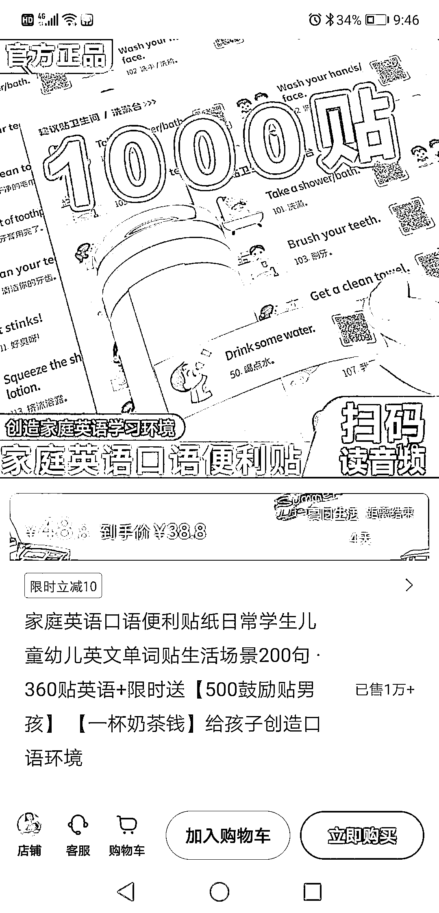
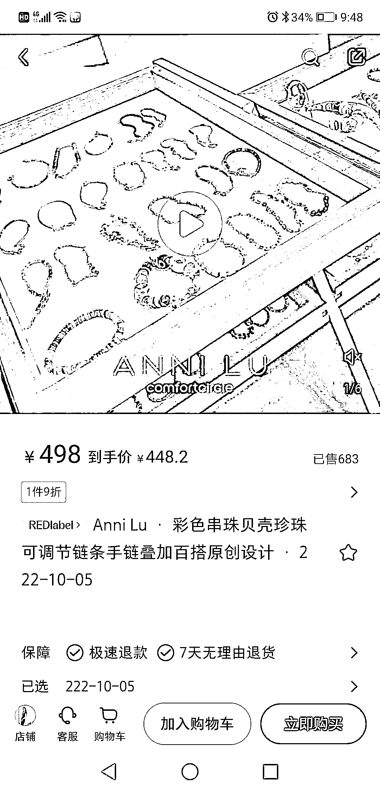
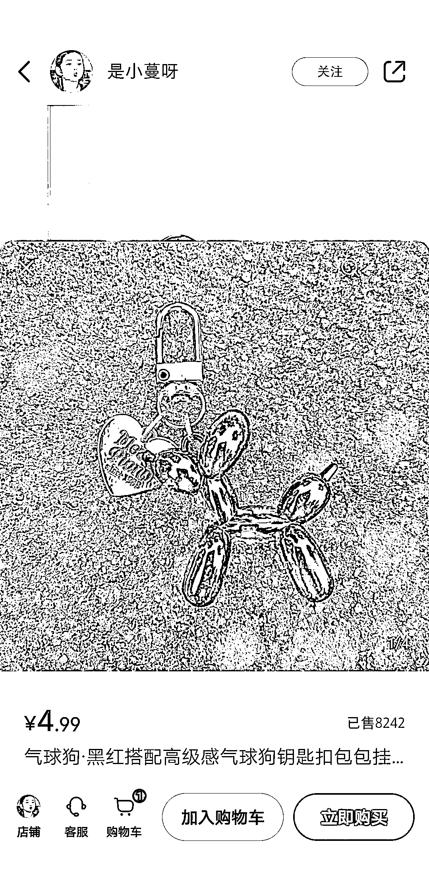
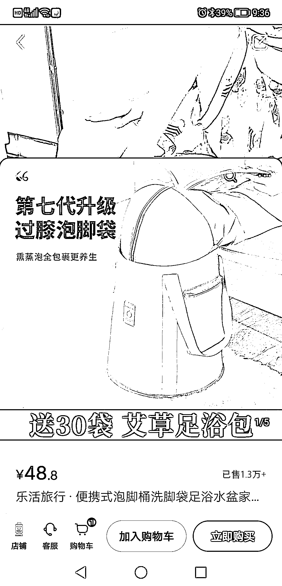

# (86 赞)小红书电商的单品思维：选择热门或小众产品

 

 

作者： GS

日期：2023-07-26

做小红书电商，可以试试单品思维，筛选电商平台热门或小众销量还可以的产品，产品能解决用户某一个小需求。在小红书一个账号就做一个产品，持续输出视频或笔记（视频更容易转化），用量来提高爆款概率，一个视频爆了，就不断重复该视频模板。

原创产品更容易做爆，小红书用户对原创产品更愿意付费，产品利润空间也大，红利周期也长，别人模仿也要时间。如：小众挂件，饰品，手链手串。纯原创产品有点难度，伪原创也可以，主要是好看，可爱，特别。

 

 

 

 

 

 

 

 

 

 

 

 

 

 

 

 

 

 

 

 

 

 

 

 

 

 

评论区：

亦仁 : 中标，术值+1。

在上方专栏点击 #中标，可查看所有中标风向标

FF_23531 : 这个卖洗脚袋的我关了的，是那个小学老师吧？2 万粉了，她其他养生用品都是几万销量。但是她是做珍珠饰品的😂也卖的很好

GS : 不少闷声赚钱的，销量也夸张

安俊 : 不懂就问，什么叫原创产品[发呆]

草木青（勇猛精进版） : 说的应该是发的小红书帖子，或者视频，做二创，去重。

哆米科技 : 应该是 diy 之类的，自己设计出来的原创产品

哆米科技 : 应该是 diy 之类的，自己设计出来的原创产品

草木青（勇猛精进版） : 也许是的，哈哈哈哈哈
