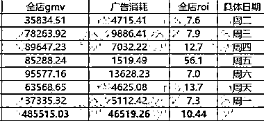
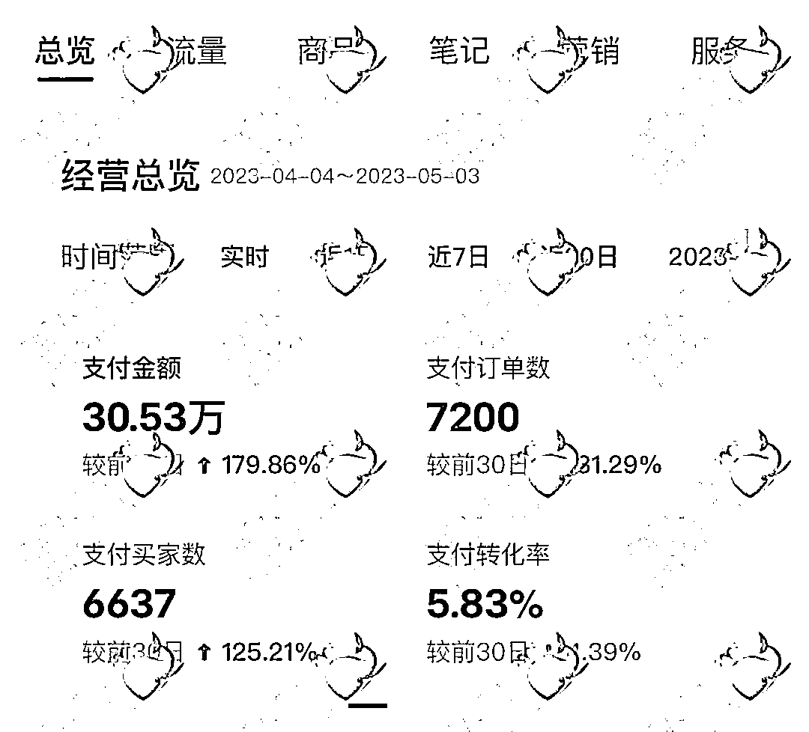
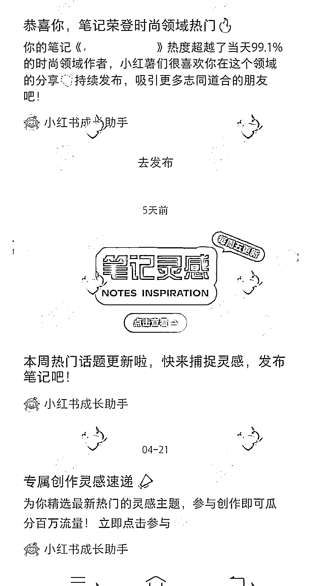

# (精华帖)(1111赞)从小红书电商小白到两周单店变现 78W GMV，付费流打法实战 单周投放 Roi 10+

作者：  鲸鱼🐳

日期：2023-05-12

《从小红书电商小白到两周单店变现78w gmv，付费流打法实战  单周投放roi 10+ 》大家好，我是鲸鱼，前大厂广告算法产品经理，一个商业流量操盘手，擅长抖音、小红书等平台投流带货、投流精准获客及SEO。

在2月份受生财小航海启发，小红书电商零基础小白，我觉得小红书电商是个机会，提前进行内卷，在2月22号2小时内出单。

在出单后，结合生财给我带来的认知，决定研究自然流+付费流打法，进行整整2个月的实战。两周内一店变现78w gmv，二店变现14w gmv，单周投放roi10以上，最高roi 56。

在这里感谢生财有术给我带来认知的改变，还有感谢我的贵人  老师。

 

 

同时，为保证分享输出玩法的可行性，已协助学员进行自然流实战，并实现单店突破30w gmv，目前在协助付费放大。

本篇实战帖会对小红书电商带货项目进行自然流和付费流两个不同维度拆解，自然流玩法包含目前主流搬运混剪玩法，无论是新手小白还是想玩付费的玩家，均可放心食用。

为方便排版，具体文档请移步飞书：

https://ra0vtgukn5c.feishu.cn/docx/F3BjdXRJFoPmE3xPsxgcZGLDnZb

 

 

  

 

 

 

 

 

 

 

评论区：

云珞YunL : 太厉害了，先赞后看

鲸鱼🐳 : [呲牙]一起搞钱

星尘丶 : 太强了哥

林深 : 鲸鱼YYDS

浅笑 : 先赞后看，养成习惯

鲸鱼🐳 : [呲牙]过奖啦，一起搞钱

鲸鱼🐳 : [呲牙]一起冲

鲸鱼🐳 : 一起搞钱
