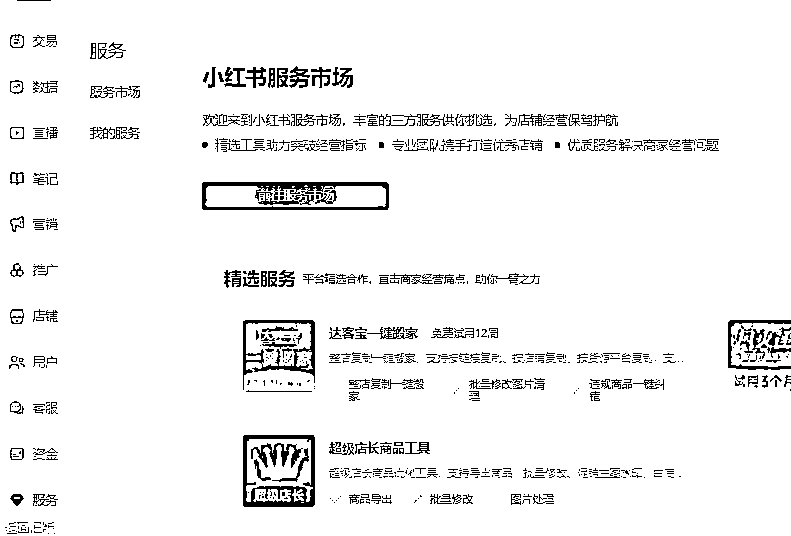
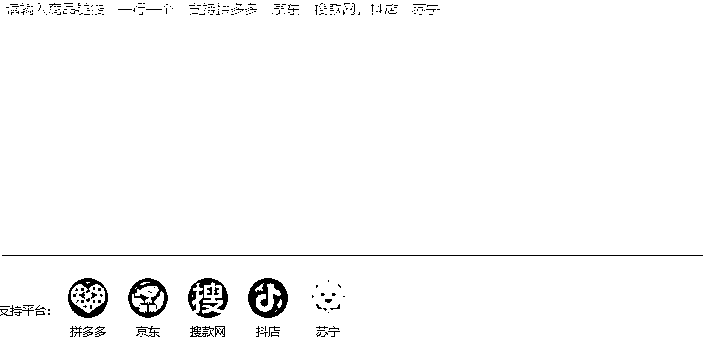
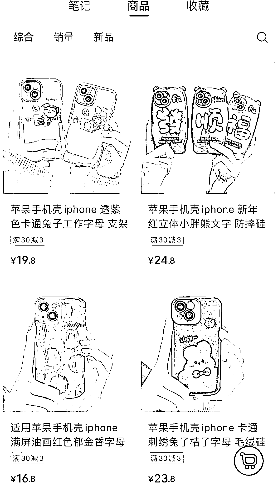
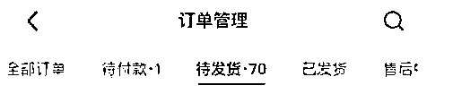
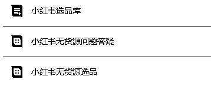

# (精华帖)(325 赞)小红书无货源电商实战分享

作者：  曜文

日期：2023-02-09

大家好，我是曜文

最近实操了小红书电商取得了不错的成绩所以就马上来和大家分享小红书电商无货源的实操流程

目前来讲小红书电商还在发展中，但在发展中提前入局往往能够得到平台的扶持和流量的激励

 

 

我在上个月底开始每天实测小红书电商的数据和内容，近期也开始每个店铺都持续的在出单，所以，把我的经验来分享给大家让大家少掉坑，让想要做小红书的宝子能够通过这篇内容减少时间成本和试错成本。

如果有做过闲鱼无货源电商的你那么你看完这篇内容你会觉得我得赶紧入局

如果你对于无货源电商还不是那么理解相信看完这篇内容你会有所启发

先和大家聊聊无货源是什么

无货源指的是：

你可以这么理解为无货源从 A 平台的产品拿到 B 平台卖赚个差价。

你不需要发货你只需要找到靠谱的商家帮你代发产品，最为显著的供货平台就是拼夕夕，因为最具有价格优势，所以在这几年非常多的无货源商家基本都是从拼夕夕下单找供应链，当然如果有好的供应链的老板也欢迎和我对接。

当然如果你本身就具有货源的源头拥有价格优势那也是非常适合小红书电商的，就比如我有学生他是做滋补产品的在本地有档口价格有优势，他直接在小红书上架产品，就能直接出单。

接下来方便大家阅读我分为几个板块详细和大家聊聊实操

 

 

**一、小红书开店实操**

小红书店铺一个身份证可以开通一个个人店，一个营业执照可以认证 3 个专业号，一个身份证能开通 3 家店铺。

个人店不需要认证费，个体店需要 600 元的专业号认证再开店铺

如果刚接触小红书店铺建议先从个人店开始，因为目前个人店不用交保证金，你需要提现的时候才需要交保证金，也就是你能通过小红书店铺变现之后你再去交这个保证金，如果你变现不了就不用交，以前是先交保证金才能顺利开店，所以现在平台也是很扶持电商这块业务。

值得注意的是：

个人店开通时昵称不能和其他已经开过个人店的用户重复，如果重复后改名还重复那只能等七天在申请

想要做好小红书那必须得了解商品的流量从哪里来

1.笔记流量

笔记流量最大的曝光来源于首页的推荐，和用户通过关键词的搜索

所以想要做好小红书曝光需要做好吸引人的图片和标题关键词的布局以及文案的引导如图：

 

 

 

 

如果是做垂直产品可以布局长尾关键词来让自己的笔记和店铺都有源源不断的流量这个在小红书的实战手册中有讲到，对于小红书不规则不了解的宝子可以深入阅读 2.商城曝光

产品链接通过后台上架之后会出现在商城中，用户通过关键词搜索会进入到商品页面，关键词被用户搜到

主图吸引用户点击就会有购买的行为，小红书根据用户习惯来跳转入口，如果一个用户喜欢经常在小红书购物

则搜索关键词就会跳转到商品页面，如果不是经常看商城的产品则会跳转到笔记页面。

如图：

 

 

通过后台小红书参与活动提升排名

注：小红书新店铺本身就有 4.5 分的店铺分能直接参加活动

3.薯条曝光

 

 

通过参与新店成长任务来获得商品流量卡，获得之后可直接用于薯条的营销推广投放

了解了流量来源之后就可以上架产品了，如果做的无货源可以直接从电商平台直接搬运过来很多工具都有免费的试用

 

 

小红书的后台有着电商的工具可以使用，同步过来然后去后台改价

 

 

 

具体步骤：

1.注册小红书店铺

2.选择要做的垂直产品找对标账号挖掘爆款笔记

3.上架产品，通过货源平台找高清图片链接

4.参与小红书营销活动

5.开始输出笔记，建议一天 2-3 篇

**二、小红书选品实操**

目前小红书平台还处于高溢价阶段拼夕夕几块钱的产品能在小红书卖十几二十几块有一定的价格差所以操作空间很大

例如：

 

 

 

 

那如何选品呢？

1.其他平台火过的产品

如果在其他平台有选品经验并且已经能够跑通销售，那么拿来小红书开店一定也是适合的，比如我们在操作闲鱼无货源的时候把以往的产品拿来小红书销售也照样能出单。

2.热点周边及时选品

比如，近期热门的电视剧就带动了很多周边，比如同款的穿搭，同款的饰品同款的鞋子等等..一系列的产品。

3.细分垂直领域选品

比如，我卖母婴产品这个范围很大，要输出内容的范围很广，如果做合集推荐不容易出单，我换成婴儿推车这个就是细分领域出单就容易了。

4.小红书用户属性热门赛道

小红书目前热门的赛道有：饰品、服装、家居、美妆、护肤、食品...

女性喜欢什么只要研究一下就可以了，如果还不知道就打开 5118 数据平台搜索一下吧！

而且做女性赛道产品基本利润都会比较高可以选择一单 50 以上一天出个几单偶尔还会爆单美滋滋

 

 

**三、小红书店铺运营**

小红书开店账号垂直度很重要

不要当天注册就开始直接发笔记建议养号 2-3 天先把产品选好的产品上架之后在开始发笔记

顺序是这样的：开店-上架-发内容

小红书输出形式很重要

如果选择视频尽量自己拍视频，目前也是视频展示的流量会比较大，如果是混剪的话过不了薯条

只能靠系统自动去推流，最好是原创，一般商家也很愿意提供样品你提供运费就可以了有了实物你可以拍几十上百个视频这样内容输出就不会断了

小红书上架后台的成长任务一定要做的因为会送推广券相当于可以不花钱就投薯条获得更大的流量和爆文的几率

我推广都是只花 1 薯币

 

 

这也是平台送了流量不要白不要，而且前期用的好能爆单，可以这样找到爆款内容参考，找到超越爆款内容的细节或者结合热点细节，一直用免费的薯条券推这个笔记（爆款内容就是那种评论区都是问怎么买的）

一般我的推广会选择 12-24 小时，选择垂直类目选择女性根据店铺产品属性选择人群，如果选择只能投放的话没 2 小时就消耗光了，这时候没出单推广基本白给。

我每天会花上 1 个小时的时间选品找近期爆款笔记然后建立素材库

会花半个小时时间比价改价优化标题上架产品

再花半个小时查看其他平台的商品和近期热点

花 1-2 个小时写笔记优化内容

现在已经开了五家店给助理在运营

有几个赛道：服装、潮玩、家居、数码配件、鞋子

 

 

**四、小红书批量引流**

我把我做私域的思路搬过来做小红书店铺

找兼职来发笔记然后往店铺导流实现店铺的曝光和关键词的优化

只要用户搜索某个关键词看到的都是在推荐我的店铺

每天文案兼职产出文案通过助理分发给代发兼职并在笔记当中推荐店铺评论引导另外在成交之后会做一个动作就是往自己的私域去导流做售后，因为平台的流量如果不做到私域

复购的几率很低，所以这也是我做小红书店铺的原因通过更大的曝光来壮大我的私域流量池

至于，如何找兼职如何找代发，我之前有说过这里就不再详细描述。

还可以建立选品库与合伙人批量开店

 

 

**五、小红书建议思考**

小红书电商目前来讲很多电商头部都还没大量的进入，所以竞争不是太激烈，可以参考 2 年前的闲鱼无货源

上架一个产品根本不需要维护就能出单，小红书目前的情况也是如此，门槛相对比较低，能够提升自己对于图片的网感和文案的能力。

如果能在平台给到扶持的时候入局实战，一定会得到不错的反馈。

如今电商平台都在往内容种草的方式发展，而小红书本身就是一个内容种草平台，用户的信任度会更高质量也会更高。

但是我认为一个动作始终要做，就是往自己的私域流量池来积累客户，我发现很多人做电商做了 2-3 年可能店铺是红利过了也可能是竞争更激烈了，店铺不出单就断了自己收入来源了，那如果把客户做到私域用心的去维护客户能够裂变不说还能一直获得收入，所以我也一直坚持在私域这个领域一做就是 8 年。

以上，就是关于小红书无货源的实操分享，有问题欢迎在评论留言

欢迎交流，一起进步！

 

 

评论区：

重楼 : 看后面提到的批量玩法，有点像以前的拼夕夕店群玩法。

郑经 : 感谢分享

亦仁 : 感谢分享，已加精华。

亦仁 : 建议再补充一些具体的看见到的案例。

曜文 : 就是类似店群

曜文 : 感谢亦仁哥

曜文 : 这就整理

招财喵 : 微信号能发下吗？交流学习
