# (精华帖)(140赞)从女鞋企业号矩阵开始，我如何规模化地在小红书选品、引流并变现？

作者： Ben

日期：2022-08-19

大家好，我是Ben，去年加入生财，今年5月份起，做了6个小红书企业号，通过低成本可复用的内容分发，单日最多引流300+微信好友。

今天给大家分享如何通过小红书实现低成本私域引流，此方法适合知识付费，卖货，招商加盟，微商，实体店引流等领域，希望能对大家有所帮助。

这个玩法的核心：

 

 

小红书私域获客的核心，是企业号矩阵低成本生产优质内容，同时缩短私域后端的转化路径，实现高效获客和转化闭环。

前端获客和后端转化可以拆开，新人建议先从前端获客玩法入手，只负责引流，找后端CPS合作。

企业号矩阵目的：

① 可复制，可规模化

② 发布营销内容不易违规

③ 离钱近，更容易变现

④ 增强信任，提高专业度背书

内容框架：

① 选择：经历了传统电商到抖音电商，发现小红书做为流量渠道更香

② 执行：  具体运营(从个人号-单个企业号-企业号矩阵，从0-1，到放大)③ 复盘优化：玩法经验分享和新人建议

整体框架按照以下逻辑来梳理：

第一部分

 

 

我以前做的都是很重的模式，不论是淘宝女装，还是抖音直播卖货，都对供应链和团队有很大的要求。

之所以选择了从小红书重新出发，一是小红书竞争相比其他平台要小，二是平台流量也足够大，三是商业化气氛好，用户对产品和服务需求强。

其他平台打不过，来一个虽然看起来比淘宝抖音要小的平台，但竞争也小，一样能做大。

第二部分

执行层面，先从定位开始，怎样选好变现的赛道至关重要，再到怎样执行能出结果，分享的是术。

从前端获客到后端变现，如何设计好流程更高效，个人或小团队也能运转起来。

第三部分

对想做的新人一些建议，总的投入很低，天花板也够高，不用太犹豫，方法论也不复杂，拼的是执行力，还有链接资源的能力。

一、自我介绍** **

**1. **十年电商人，重新出发 ** **

 

 

2010年大学期间接触淘宝，开始了电商之路。

毕业后去了一家女装淘品牌公司，主要负责运营，年投放过千万。

16年初以运营合伙人身份加入朋友的淘宝女装团队，三年时间实现了营业额从百万到亿的突破，

 

 

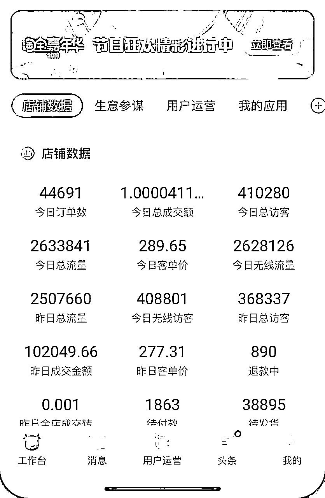

 

 

20年初YQ原因停摆，没撑到618，团队解散，自己不死心，又一头扎进去做女装，开了一家淘宝店，从此噩梦开始，中间不表，懂的都懂，21年前后创业做女装的等于找死。

折腾了半年又在618前夕遇到广州yq，全公司被隔离一个月，解封后就把公司关了，前后亏了70w。

这之后又看好直播卖货，那时候流行凌晨起号，组建了小团队租了新场地，每天凌晨1点直播2小时，下播再复盘，回到家4点多，洗漱一下5点躺床上，第二天白天搞货、策划活动、对话术、拍剪视频，到了凌晨再播。

折腾了3个月，销量起伏很大，加上供应链的不可控（发货效率），在年前忍痛解散团队，小亏20w。

 

 

 

 

 

 

 

 

这个时候遇到了木易那篇神贴，进了生财，也是跟很多圈友一样，一整个愣住了，原来有这么多小项目能赚钱，每天就是浏览精华帖，开始了我的生财之路。

**2. **生财之路，不断试错

去年12月进的生财，开始从精华帖里面找项目，年后报了抖音IP大航海2.0，开船后按着要求开始打卡直播。对于那时的我，没项目没产品，直播讲什么内容其实也是困扰了一段时间。

从卖专注力工具书拿佣金到直播生财日历，虽然没成绩，还是顺利下了船。

 

 

 

 

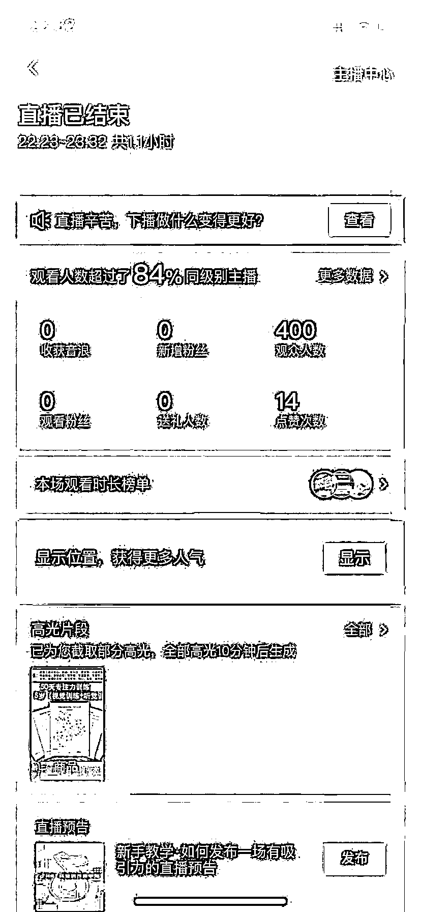

 

 

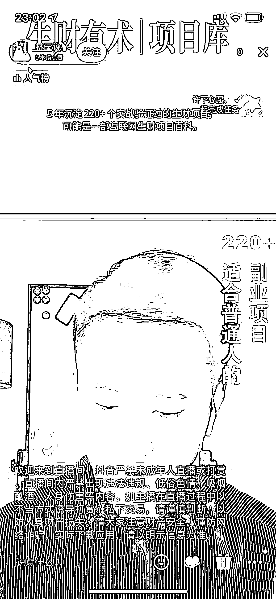

 

 

在大航海期间留意到一篇介绍小红书的生财帖子，同期刚好有小红书的小航海，就把小航海和生财的所有文章都看了一遍，开始每天研究小红书。

**3. **抓住机会，专注放大

开始做了一个小红书个人号，分享如何复盘的内容，做了半个月涨粉1千+，觉得小红书对新人还是很友好的。

因为复盘号没产品变现，就想试试用女鞋做一个带货号。

发现女鞋同行都是用企业号矩阵在做，我也注册了一个企业账号，发了一个星期，阅读量只有几十一百，对比我做知识分享的个人号，数据差了很多，经过不断的测试，一周后女鞋终于有起色，每天私信有几百人。

 

 

 

 

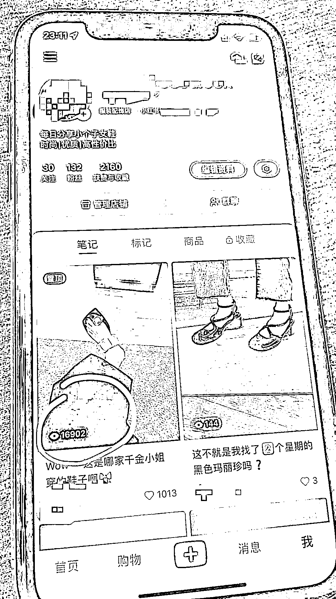

 

 

 

 

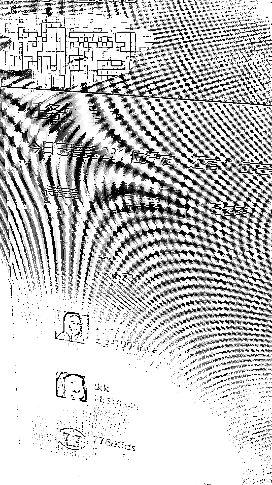

女鞋企业号每天发最少5篇，一天四五百的私信，加到私域3百人。因为私信流量太猛，收到警告限流7天。终于有机会静下来思考，狂奔了一个月，私域加了1500+。

限流期间，通过链接生财圈友，尝试知识付费的引流。我负责前端引流，圈友负责后端承接，买了6部手机就开干。

 

 

 

 

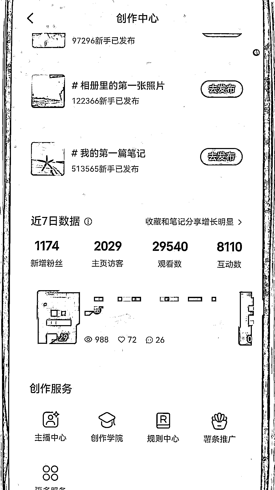 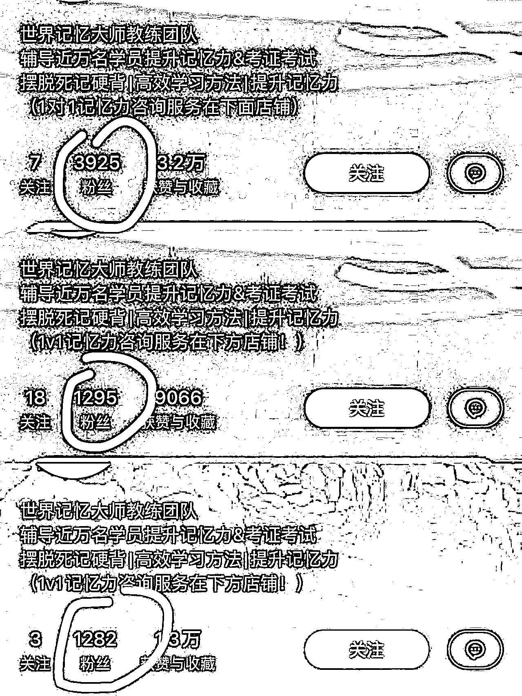

 

 

通过低成本生产内容，快速复制，配以轻度投放，算是跑通了小红书私域引流闭环，最高单日加微信好友300+，反复验证了一个月左右，引流效率稳定，方法可复用，今天就把完整的路径分享出来，还请各位老师指点。

二、怎么选择能变现的内容，如果不会这个业务就没办法做吗？

想通过为知识付费业务引流变现，你只要学会下面几招也能轻松上手，不需要对业务太了解。

**1. **判断行业的流量规模

当我们在选择业务的时候，先看这个行业在小红书的流量规模：

第一步：确定行业关键词，如果不确认行业的主要关键词，可以搜多几个；

第二步：在小红书上搜索这些行业关键词，看有多少条笔记，基本在1万+条的都是可以做的；

第三步：借助第三方软件(千瓜，新红，蝉小红)，确定行业关键词热度和单月笔记发布量，查看最近一个月是否有爆文，爆文点赞数。如果有几千赞以上的爆文，基本上这个关键词的流量不会太差。

**2. **寻找高评论的内容

 

 

小红书有很多高赞藏的爆文，会发现很多爆文都是高赞藏但是低评论，甚至出现几千赞的笔记0评论的。

这个说明了什么呢?

就是这条笔记大家觉得有意思，有帮助，但只停留在这个层面，但不能解决痛点或满足需求。

那什么才是带货型的笔记评论区呢?

是那种在评论区齐刷刷"求链接"、"求分享"、"想了解"、"求带"，看出来了吧，这些都是需求型的评论，这种的笔记就是带货型笔记，这个"货"可以指代一切付费产品和服务。

那应该怎么找高评论的笔记内容呢**?**

查找高评论数的笔记，可以用小红书下载助手软件。

导出类目关键词的笔记Excel表格，然后按点赞数和时间排序。

我们把导出表格的近期高赞笔记都打开，看有没有高评论数的笔记，登记起来。一般高评论数的笔记评论区，评论都是需求型内容。

所以这种笔记内容的引流效果就非常不错，内容选题和类型方向就值得你去研究学习。

 

 

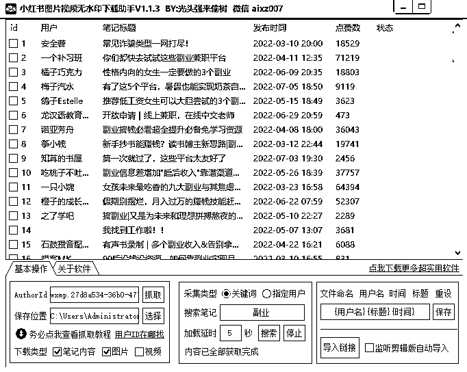

查找高评论数的爆文，还可以用第三方的新红数据。

需要开通豪华商务版，新注册账号可以试用一天，淘宝闲鱼上卖大概2百/月。

激活后，在软件左边栏的流量分析-趋势查询，输入类目词，查看到最近每天评论数top3的笔记，再点开笔记链接，看看内容形式和评论类型，符合条件的就记录起来。

 

 

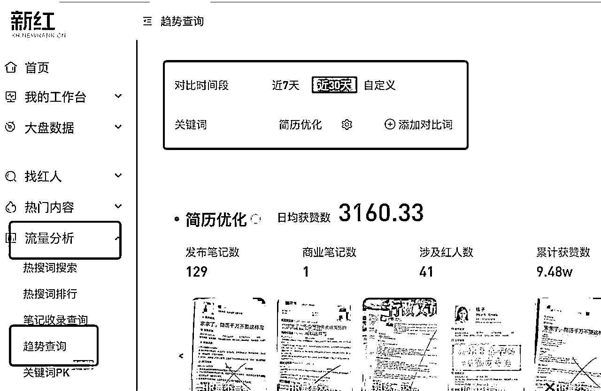 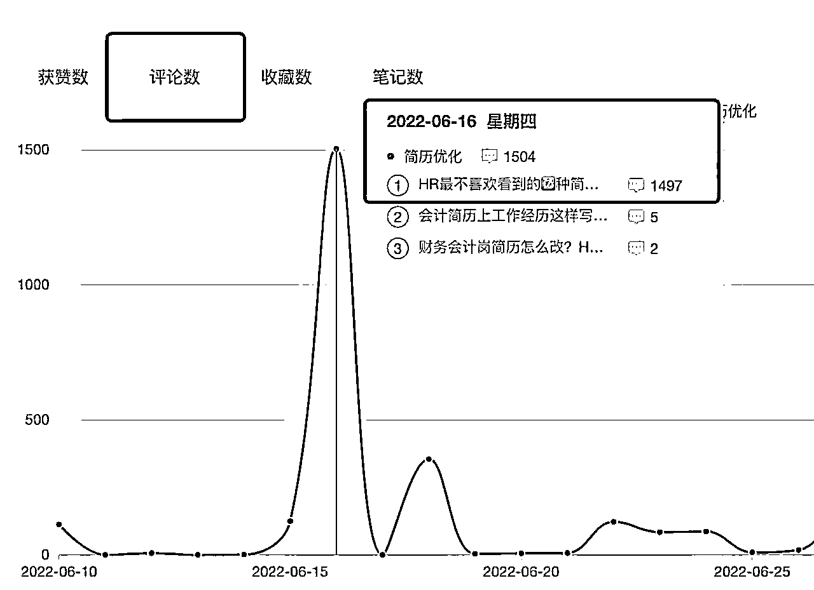

 

 

**3. **用交付外包的形式找后端合作

如果目前手上没有产品没有业务的，可以用交付外包的形式找后端合作，那应该怎么入手呢**?**

先从身边的资源入手，看下身边有没有在卖货或做知识付费的朋友，跟他说你帮他引流，他负责转化和交付，谈好分润比例就行。

前期双方多沟通，在互相信任的基础上再展开合作。

建议和生财的圈友合作，现在不论卖货还是卖课，都需要引流获客，可以先找你感兴趣的类目，再去生财的资源区发帖求合作。

先看下他的类目在小红书上的数据，再试下谈合作。

你的投入其实就是前期的硬件投入，比如手机、个体户执照、手机卡、企业认证费，大概一个号的成本在1千左右。

三、怎么用矩阵号批量获取流量

**1. **低成本生产优质内容

低成本生产优质内容的关键是要找到对标**,**模仿封面形式**,**收集爆文选题和标题**,**形成一个选题标题库

 

 

第一步：找爆文图片模板

方法一：在小红书搜你这个类目的关键词，可以多搜几个，点最热，再点图文，浏览点赞量高的笔记。

收集几个你能模仿的封面模板，看下笔记的发布时间，尽量选最近的，再点开主页，看下是不是整个账号都是同一类封面模板。

如果是就保存下来，算做一个对标模板，分配给一个企业号测试。接着用同样的方法给其他几个企业号找封面模板。

如果你的类目词很小，最热tab那里的笔记数据都不太好，可以试下其他类似行业的词去找，这里卡的不是很严，类似行业下面的爆文封面，都有参考价值，同样选一个数据优秀的你又能模仿的，把它当做你的封面模板去测试。

 

 

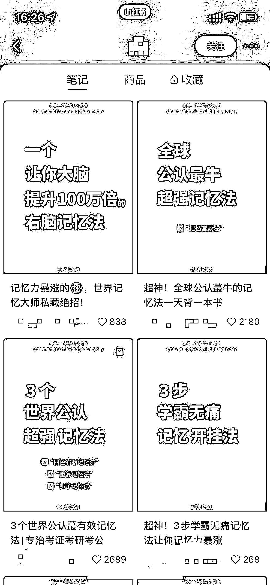

 

 

方法二：用小红书下载助手软件(上文提过)，导出类目关键词的笔记Excel表格，按点赞数和时间排序，选近期点赞高的笔记，打开链接收集封面，用前面的方法找对标模板。

方法三：  在小红书搜类目词，点开用户tab，只看那些粉丝高的企业号。

点开主页浏览，看下有没有规律性封面模板，没有也没关系，看高赞笔记，如果有好几篇高赞笔记都是类似的封面，那这个封面模板也是可以借鉴的。

 

 

 

 

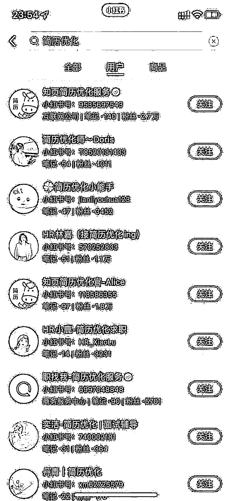

 

 

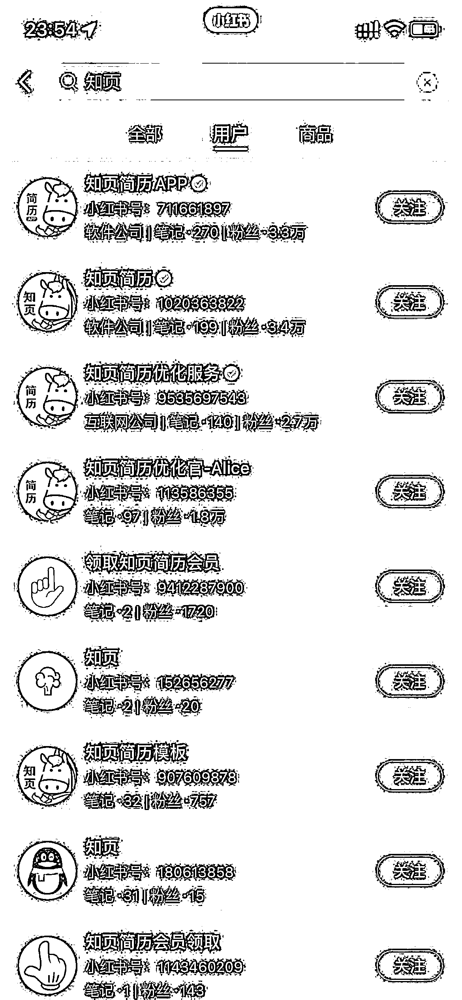

 

 

第二步：收集爆文选题和标题

这里就用我在上面介绍的"寻找高评论的内容"的方法，找到爆文选题和标题，形成一个自己随时调用的选题和标题库。

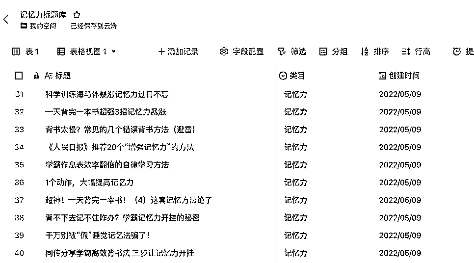

 

 

(标题库)

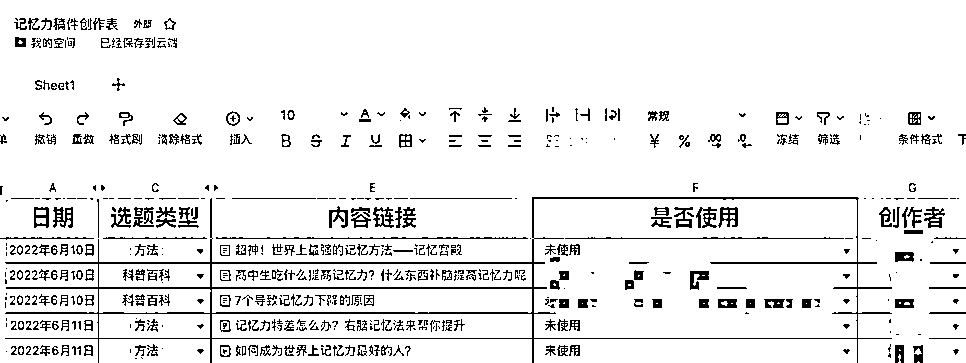

(选题创作表)

**2. **矩阵式复制内容提高爆文概率

建议一开始就注册3个企业号。

当选好一个账号的封面模板之后，用同样方法选另外2个号的封面模板，这样一来同选题可以给3个号共用。

每个号单独做封面和选标题，平台对图片内容的查重审核没那么严格。只要标题和正文稍微调整一下，一般都不会有没什么问题。

这样就等于一个内容复制3个号，做到低成本复制的矩阵操作，提高爆文概率。

这里提醒一下，务必坚持一机一卡一网络原则，避免账号关联，导致一个号违规，全军覆没。

 

 

矩阵号之间也不要互相点赞，尽量做好隔离。

**3. **怼量，大力出奇迹

等所有企业号都选用了各自的爆文封面模板，用近期的爆文选题制作封面，再用标题库里的参考写标题。这条笔记的基础数据就不会太差,有爆文的潜力。

只要坚持发笔记，一天2-3条，不出几天大概率有一个账号会出爆文，引流数据应该也会不错。

所以，这个阶段就是做好前面2个步骤后，坚持每天铺量不断更，不断根据每天每篇笔记的数据反馈，调整优化笔记封面和内容。

还可以在原封面的基础上吸取其他优秀封面的优点进行改进，再根据数据的反馈和近期平台热门内容去调整跟进选题。

企业号起号也是有成功率的，同行经验在50%，供参考。

所以不必追求每个号的数据都好，3个号有1个数据不错的号就算不错了。

数据好的账号就可以放多点精力去优化，每天发布的笔记数量也可以增加，其他数据较差的账号，就保持更新，持续优化就好。

如果1-2个月数据还是起不来，就注销再来，重新注册新的企业号，继续上面的操作。

 

 

所以，一个运作良好的企业号矩阵，就是在不断起号，测试新号，注销再来，不断循环的过程，不断的积累成功的账号。

只要起号流程顺畅，不断有新号跑出来，也就不怕违规封号和数据不稳定了。

四、怎么从小红书上引流私域

**1. **笔记学会留钩子

方法一：图文留钩子

用小红书下载助手软件找出高评论的笔记，分析同行都用什么做钩子。

针对目标人群的痛点，设置诱饵，让他主动联系你的就是有效钩子。

钩子解决的问题是让用户找你，能不能转化，更多的是看私域能力。

所以，确定好钩子就是帮你带人的作用，那我们就要想好用什么钩子才，能最大化的吸引目标用户的注意，让他忍不住要主动联系你。

举例：

我是做记忆力培训的老师，产品是记忆力课程，需要吸引对提升记忆力感兴趣的用户。

 

 

那我可以分享记忆法的干货，在笔记中留下记忆法资料作为钩子，加v无偿分享资料，是不是想提高记忆力的用户就会加我领取。

同样，你有一个免费资料，整理的行业干货电子版，免费咨询服务，这些都可以作为钩子。

 

 

 

 

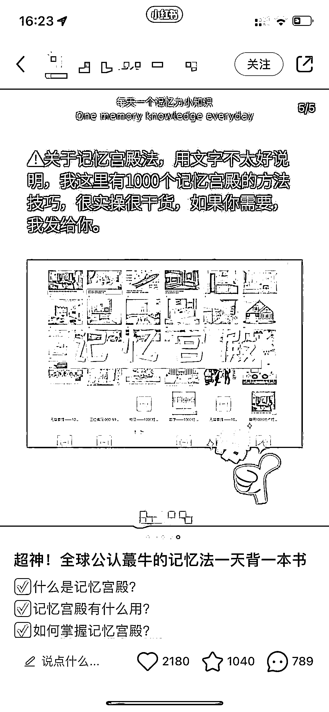

方法二：评论区留钩子

除了可以在图片和正文里留钩子，还可以在评论区留钩子。

当你分享了行业干货，可以在评论区置顶一条钩子评论，这样做不但可以引流，还能增加笔记和账号权重，提升笔记的阅读量。

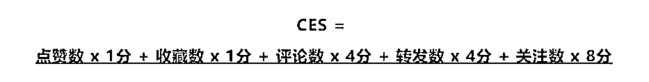

了解一下小红书算法的评分体系，简称CES。

简单理解就是，笔记的点赞收藏都是打1分，评论和转发是打4分，关注打8分。

 

 

要提高我们的笔记权重，就是要更多的去引导评论和关注，点赞收藏的权重是很低的。

所以我们可以在评论区引导(点赞+评论+关注)，这样就可以做到权重最大化。

结合我们引流的需求，可以让用户点赞关注后在评论区扣关键词，关键词可以设置成有引导作用的词，比如求带、想了、求分享等等。

还可以用水军评论几个，做领头羊带节奏，后面来的人就知道发生了什么事，也会跟风评论。

当评论区越来越热闹的时候，笔记的热度也会越来越高。

例如: "👍+关㊗  ，底下扣"1"，發记忆法资料给你呀~"

 

 

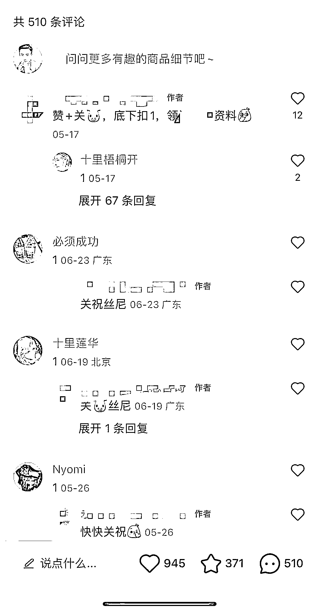

 

 

**2. **总结几个安全有效的私域引流方式

① 主页简介@小号，小号的主页发带有微信信息的笔记；

② 评论区@小号，或小号评论，大号去置顶；

③ 评论区发群聊口令，或引导去主页进群聊，在群聊用小号发微信信息；

④ 私信用乱码图片，不要直接发账号，不要用微信字母缩写；

 

 

五、从意向用户怎么变成成交用户的私域转化流程

**1. **私域转化流程设计

总结一个适合个人 or 小团队的公域引流、私域转化流程：

 

 

公域-微信-直播快闪群-视频号直播-私聊催单跟进-朋友圈内容运营-视频号直播① 小红书公域引流、通过私信、群聊、主页简介、小号等引流方式引导加微信。

② 用 WeTool 之类的群控软件，自动通过好友申请，再自动发送欢迎语，询问一些基本情况方便打标签做人群筛选。

③ 机器人客服引导进直播群拿钩子资料，进群后再用群公告引导预约视频号直播，点明直播主题和福利。

④ 开播前，一般当天再群发一次通知直播内容和时间，提高直播预约数。

⑤ 视频号直播卖课 or 卖服务转化。视频号直播类似于私域直播，更适合用会销的模式来设计 sop 流程，例如:

(线上会销=锁客+谈判+气氛+流程+嘉宾+案例+数据+成交+福利)，有会销经验的圈友可以交流。

⑥ 下播后再针对直播群的粉丝群发催单内容，询问观看直播的情况，如果是没时间看直播的，会引导预约下一次直播，催单群发后看回复情况再一对一跟进。

⑦ 日常朋友圈发案例，发金句，发人设内容，再做直播的预告通知，引导预约直播进新一期的快闪群。这里如果你是每天直播的话，可以不用快闪群这种模式，直接引导预约视频号直播就行。

经过一轮的流程优化后，前端引流到后端接待转化就很顺畅了，没转化的私域用户再不断的做触达。

 

 

只要他不拉黑删掉你，就可以一直触达他，注意测试好频率就行。

提醒一下，不要频繁对同一用户做群发，容易被举报骚扰或系统提示违规，导致账号封禁。

**2. **微信接待，询问需求，打标签

如果你做的是高客单的知识付费，一般转化周期会比较长。

所以除了做多次的触达之外，我会用群控软件在加好友时，就给每个用户打标签改昵称。

一般会标记加好友时间，再通过聊天记录给他再打上年龄性别、意向程度(A，B，C)等，在后期的群发或沟通时，方便发送对应话术。

**3. **引导直播快闪群提高直播预约量

视频号直播，很注重开播前的预约引导，预约数据做的好，开播在线人数会比较好。

所以要在各个环节优化预约动作，你为用户想得更多，提供更多方便，你的点击率才会高。

① 朋友圈 or 群聊话术都加上#视频号: xxxx，方便点击视频号主页预约；

 

 

② 群发预约话术时加上图片引导。

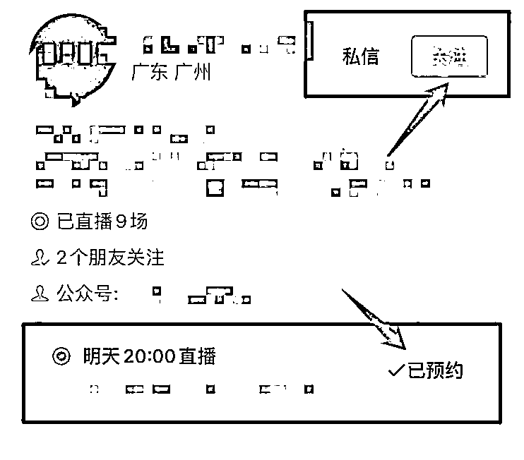

**4. **对变现产品的建议

① 高客单产品，可以准备一个低客单的引流产品，做好超预期交付，再做低转高。例如：99元的短期训练营，加盟产品可以设置低客单的短时咨询服务，等等；

② 逐步提高价格档位，测试转化率，达到利润最大化的平衡点；

 

 

③ 宣传物料很重要，课程海报要准备一个朋友圈转发的版本，一个详细介绍版本，多参考优秀同行，取长补短，还可以把学员或老顾客发展成分销员，为他们设计佣金玩法，准备专门的物料文案，让他们为你引流。

**5. **关于虚拟类产品**(**知识付费，招商加盟**)**视频号直播

关于视频号直播，理论上我们的这套玩法是通过私域引流，用视频号直播来承接转化，做的是私域直播。

但这个过程是能撬动公域流量的，所以我们要做的是扩大私域流量池，再通过私域流量做好视频号直播的初始数据，再来撬动视频号推流，完成私域直播到公域直播的跨越。

我用到跨越这个词，因为视频号近来的商业化速度加快，视频号流量背靠微信是不亚于抖音的，所以视频号直播的潜力很大，能拿到系统推流，可能给你的数据带来跨越式增长，所以我们是始于私域引流，终于公域放大。

六、新人想做的一些门槛和建议

**1. **不要死磕一个号，营销内容直接用企业号

个人号在引流上更容易违规的，而且需要养号，起号的成功率也只有大概30%，所以小红书私域引流建议直接用企业号。

建议先干一组企业号小矩阵，用一张营业执照认证3个企业号，3个号同时输出内容，提高营销笔记的总流量，不断测选题和封面，直到第一篇爆文出现。

 

 

**2. **从第一个粉丝开始变现

很多朋友在做个人号的时候，往往会陷入一个误区，就是先涨粉，想着等粉丝多一点再引流变现。

往往的结果是涨了很多粉，每篇笔记的赞藏都很漂亮，但没人私信，评论可能也很少，更别说引流私域变现了。

我们以变现为目的的做账号，就应该从第一个粉丝就开始变现。

小红书的粉丝不值钱，私域粉丝才值钱。

从开始注册账号，发布第一篇笔记，你就要想好怎么吸引目标用户，怎么把目标用户引导到私域，到了私域才有变现的可能。

**3. **矩阵思维做流量，该放大就放大

当一个账号的内容数据不错的时候，就应该想办法复制到其他账号上面。

方法是通用的，形式是多样的。

这个账号爆的选题方向，换一个图片表现形式，换一个标题，是不是也有很大概率爆。

 

 

所以，好的内容形式要学会复制，矩阵式铺开，批量铺优质的笔记内容获取流量，这样的效率才高。

**4. **多链接，多交流，会引流，不怕没产品，生财就是一个资源库

项目业务的选择固然重要，但方法思维更能让你在变化的市场中找到机会和突破口。

所以，不要陷于没有项目没有产品的思维里面。

你有能力引流，或者说有掌握新技能的能力，就能找到很多为你所用的资源。

生财有来自各行各业优秀的创业者和实干家，你还怕找不到资源合作吗?

只要你真诚的表达你能提供的服务和技能，自然有会需要的人联系你。

利他思维，不论在哪个地方都是适用的，你先真诚利他付出，然会链接上好运气。

七、写在最后

关于小红书企业号矩阵，还想过其他玩法，例如：

① RPA操作内容生产到网页端自动发布笔记；

② 最近也在测试小红书投流玩法。

 

 

感谢一路过来的贵人

首先感谢生财有术，提供了这个利他氛围的平台，让我在这里尽情吸收养分。

另外感谢@星城，@涛神，@建议哥，@杉木，@无敌，@良辰美，还有其他帮助过我的大佬们。

涛神的魅力我不用多说了，我坚信涛哥说过的"凸性探索"，只要不下牌桌，就不算输，也送给正在探索路上的各位。

还有一句名言，"想不明白，就干明白"，希望明白老师不要生气~

感谢其他大佬也同样在我疑惑，自我怀疑，探索的过程中，给予我很大的帮助。

最后的最后

我没想到我能写这么长，自从毕业后就没写过长文了，也是时候倒逼自己输出了。

回顾这2年的经历，更多是前面几年太舒服了，呆在舒适圈久了，就失去了向上生长的动力。

就像有位大佬说的，如果在小地方，几百万就能让你废了。

 

 

人还是要有更远大的目标，感谢生活给予的打击，让我在低谷中强化自己，向上攀爬。

最后，再借一句话送给大家。

有目的的学习，针对性总结，跟优秀的人，干正确的事，咱们顶峰见。

欢迎交流~

评论区：

高有才 : 优秀

小花 : 向不断突破、无私分享的楼主致敬[玫瑰]

老黄牛 : 保姆级干货[强]

mk : 向优秀的大佬学习

自行车108◌ོ : [玫瑰]

水水 : 很有帮助，感谢！能给个联系方式吗

仙贝 : 对我很有帮助，之前做过内容也取得了一定的粉丝。但是并没有引流到私域，感谢提供思路。

银行edc : 想加个联系方式，兄弟
