# (精华帖)(182赞)小红书自动引流系统淘客月佣 9W

作者：  老严干货CPS

日期：2023-01-31

生财有术的圈友好，我是老严。

我群有位朋友，他这边一直是在做返利、社群这两块业务。这两块业务目前已经运营2，3年了，最多佣金的月份有100多万。这块相对稳定，但跟大部分人一样也有很大的下滑。

由于以前的引流方式比较杂，也没有太固定的套路，更多的是吃老本和东搞搞西搞搞，另外感觉社群比较费人力，业务量波动时不好管理。

所以2022年他就想着另起炉灶，打造一个从引流到变现的闭环流程的固定流程和套路。

我把他的分享共享出来。

说到这里先说个小故事。

一、机会无处不在

 

 

前几天听了一下罗胖的跨年演讲，罗胖有讲到一个人的故事与我想表达的意思正好契合，所以这里先简单说一下这个故事。

里面讲到一个龙华哥的故事，这个龙华哥是深圳一个工厂老板，工厂倒闭破产了，他陷入了自己的人生低谷。

有一天，他发现深圳很多电动单车的座椅上面都会破一个洞。于是他带一点胶水和皮革材料，路上遇到有破洞电动单车就给人修好。

然后留个二维码和一句话：座椅已帮你修好，扫码支付，金额随意。回到家以后，真的开始有人给他付钱了。

第一天收到了31笔，收了184块钱。第二天收款562元，刨去皮革和地铁日票25元，挣了大概有500元。

一个新的生计就这么诞生了。

龙华哥擅于在线下寻找机会，而线上其实一样的有大把的机会。只要愿意多尝试，找到一样的一个生计机会并不太难。

再聚焦淘客业务，也在这一年里发生了相当大的变化，淘客业务呈现越来越多的全域化、多样化、复杂化。不断的有新人闻讯加入淘客这个行业，也有人悄然退场，或者变换赛道。

听惯了很多月佣100万，日进万粉的故事。可能会给很多人产生一个错觉，感觉周边的人都很厉害，个个都是日进斗金。

 

 

不得不承认，确实山外有山，楼外有楼。但每个人自己有能力可以掌控的事情其实并不多。大部分人从年头到年尾做的还是相同事。

绝大部分的人不是听故事就是传故事的人，注定了自己只是普普通通的一个人。

我知道对大部分人来说不走弯路就是快，很多“大手笔”的玩法也不适合自己。所以任凭外面潮起潮落，我自巍然不动，从2022年6月份开始，我用了半年的时间打造一套半自动淘客业务引流落地流程。目前这块业务一个月佣金8-10W，扣除返利和兼职成本，最后利润40%左右。

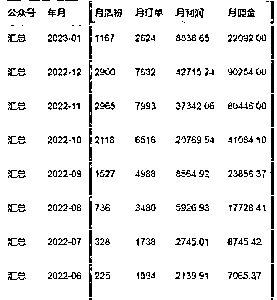

**6**月到**12**月业务变化

当然这个数据其实并不算太好，我对这块业务最终结果并不算非常满意。只是感觉这个模式是可以放大的，流程理顺以后，完全可以交付给公司有一定的经验的人主导或者全员分头负责。

 

 

这个过程对于来自己来说是最真实的，所以借今天这个机会在老严群里分享一下，多聚焦一些同频或有兴趣的朋友一起进步提升。

回头来看，之前做得过于谨慎、投入太小，总想着迭代前进，不要投入太大。导致前面摸索了很长时间，半年的时间里有2/3的时间进展都是比较慢的，甚至在10月份的佣金还只有4万，后面11和12两月每月增长2，3万。

2022年年底有了9、10W这个基础，我相信这块业务明年的增长才是真正值得自己期待的。

由于这个业务本来就是从0开始的，虽然目前总体佣金并没有几十、上百万。但由于每个月都维持了50-100%的增长，而后续放大和增长主要取决于更多的商品和更多的兼职即可。所以虽然基数不大，但是这个增长率给了自己很大的信心鼓舞着自己从一开始就坚持了下来。

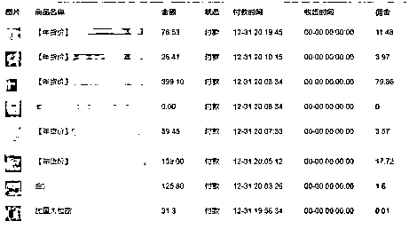 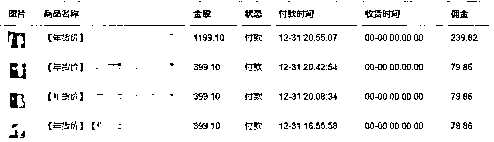

 

 

前面说了那么多，下面就来简单说一下这个业务流程吧。

二、核心业务流程

找兼职，发笔记，引导到公众号查返利下单。

说起来很简单是不是？！确实也就是这么简单。简单到可能有些人一看是这么玩的都没兴趣往下看了。

发布后笔记的样子：

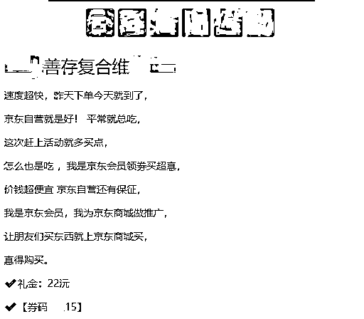

兼职取笔记的样子：

 

 

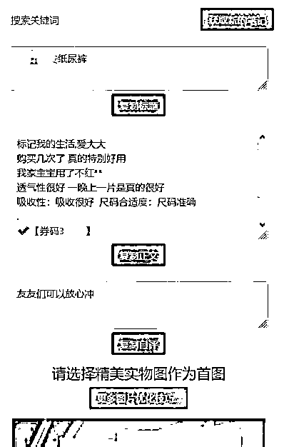

三、每天要做的事

从各大渠道挑选10-20款商品加入到待发清单中。等系统自动导入些评语和图片，检查是不是有瑕疵。

其实基本上也不用怎么管了，有自动AI打分和评语过滤功能，人工检查只是例行看看。

 

 

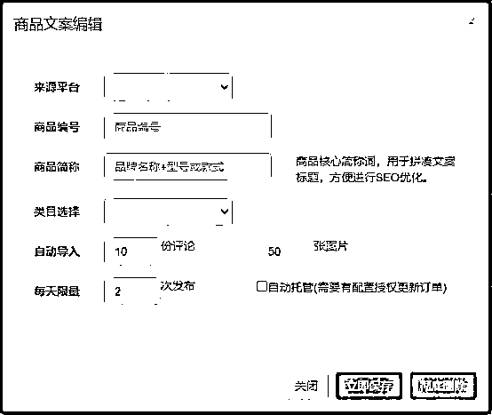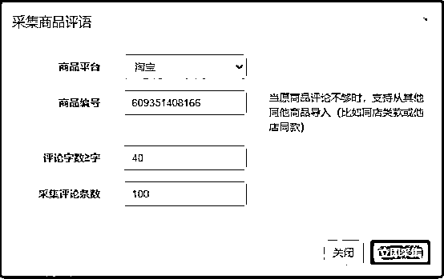

 

 

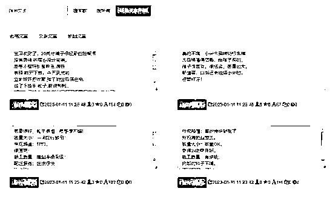 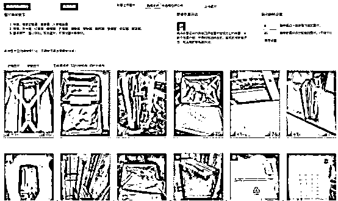

 

 

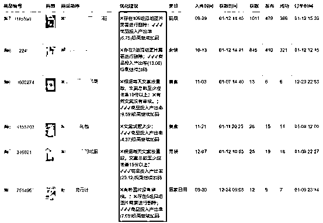 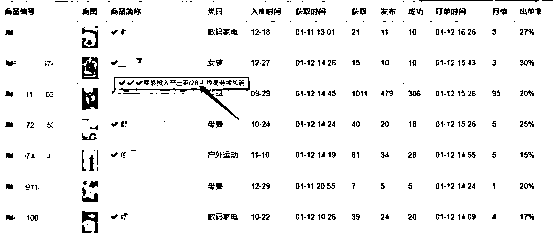

看看哪些款有品出单，该加码的加码，该控量控量。

看看兼职们在群里都聊些啥，有没有需要回复的给他们回复一下。

 

 

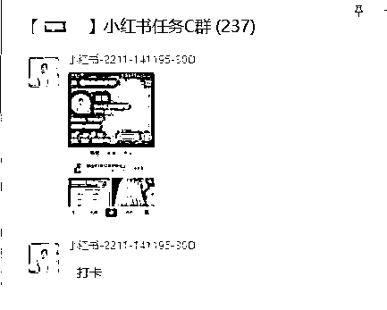

基本上就这么些事，每天真正在引流上面花的时间只有2、3小时左右。所以我前面说是半自动引流变现。实际上这些工作经过自己的摸索优化形成流程和规范以后，后期我已经把这些工作移交给同事负责了，每天投入30%左右的时间处理上面的一些提示。

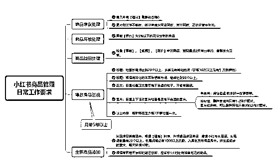

四、哪些主要成本

 

 

兼职的笔记费用是最主要的直接费用，但这一块投放可以自由决定，根据引流效果及时的调整即可。

因为做到了精准的转化反馈，所以这方面的控制也可以做到非常精细化。这半年多以来，最多的一天投入800多元，最少的一天投入只有几十元。

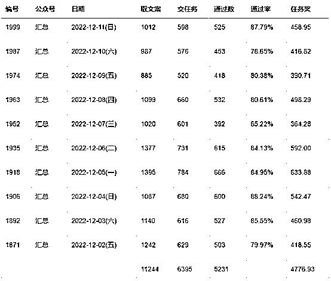

五、选款经验

小红书引流选款是最后的重中之重，很多人在小红书上面引流失败或者效果不佳的原因主要出在选款上面。这方面我们也是从0开始，没有积累，慢慢摸索的，所以这方面前期有一些投入，现在基本上理顺了一些。

 

 

这个优化的过程其实有个好几个版本

**5.1**大淘客版

直接采集和大淘客的商品图片和文案。发现有很多营销文案，比如买三送一，券后78元，一次拍3份到手22元。这些内容与低价引流的价格不匹配，处理起来有点麻烦，这是一方面原因。

最主要的原因是大淘客上面的优惠价格变化太频繁，今天一个优惠价格，明天可能就没有券了，而笔记有很长的长尾流量。

我统计到半年前的笔记还有引流效果（顺便说一下，有些人要求笔记发完7天就可以删除，说没有流量了，我不知道他们有没有数据支撑。反正不留白不留，我要求都留着，不能删除。）

 

 

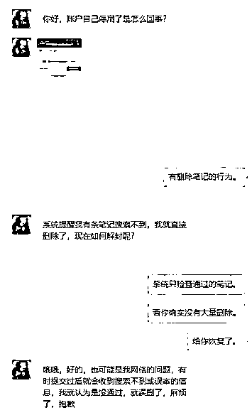

虽然正常我们标价本身也是比正常价低一些，但如果再加上优惠券失效双重因素，会导致价格严重不符，影响用户的感受和下单积极性。

**5.2**商品库管理

初期的版本是为了省事，直接配置一个从大淘客获取文案的模板就可以不用管了，系统会每天更新大淘客商品。可以省掉很多人力。

 

 

后面发现有些款根本不能出单，比如A货，而有一些款开始出单以后，想大量的发布笔记进一步提升效果，比如某个商品一天想发100篇笔记，大淘客每个商品只有一份介绍文案，会造成大量的内容重复，效果显然不后。那么大淘客的文案，这样显然就不够用了。

所以后面就基于商品库来维护，将评语和晒图作为文案内容。为了减少文案的审核工作量，这些基本上是全自动导入和打分过滤。比如评论中的差评会去掉，图片长宽不成比例、图片模糊等。

其实大淘客之外，还有很多长期高佣、品牌的商品可以去推广。

**5.3**采集爆文笔记

比如用某款扫地机器人引流，发现有很多关于这个品牌这个型号的其他爆文文案。别人可能是真正的分享者，或者商家的营销团队发的，也有可能是别的原因发的，总之爆了，点赞留言几百上千。

象这种文案，我们只需要采集并稍作修改，加入引流元素就可以使用了。并作不同的伪原创修改，弄出几份类似的文案出来。

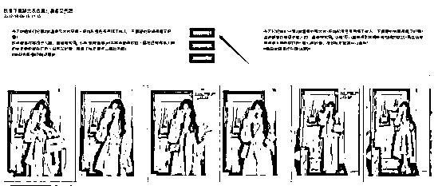

 

 

这个模式也一直在使用。

我们用来引流变现的商品并不是固定的，每一月商品都在以往的基础上增加和删除一些，但总体上商品根据赢利状一直呈现这样的分布：

60%不能出单，测试10笔左右就放弃了。

40%能出单但不一定赚钱，其中又8%赢亏平衡，其中又1%的能赚钱。真好像一堆沙子里面挑金子。

以半年时间我们一共发过的2550款商品为例：出过单的为1036款，210款赢亏平衡，30款可以赚钱。

而这30款商品才是我们最后终于需要关注的。有的款一个月能达到1万多的佣金、有的7000、有的1000、2000元。

 

 

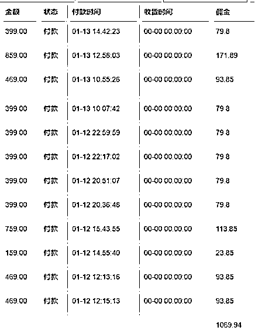

每个月只要有10个这样款，就基本上可以维持住几W的佣金收入，确保投入产出的平衡，甚至在引流的过程中赚钱。

如果有选款经验丰富，我感觉还可以节省50%以上的选款、测款成本。没有经验的话也可以慢慢积累好款，比如2022年5月开始的款我们明年就可以继续翻出来再推广。

 

 

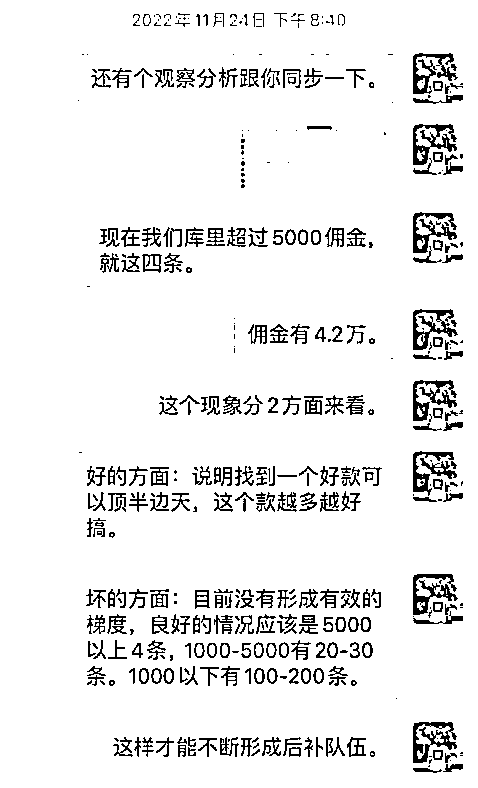

说到这里，还需要强调一点的是，其实我们最初只是为了引流的，图的是用户的留存和后续变现，并没有想着马上赚钱，而实际情况是我们在引流的过程中新粉就已经赢利了。

 

 

我们在10月份就观察这个现象，并在内部调整选款和引流的侧重点。即：在确保任务足够多，养着大量兼职的情况下，还要着重商品选款和优化引爆商品的操作。

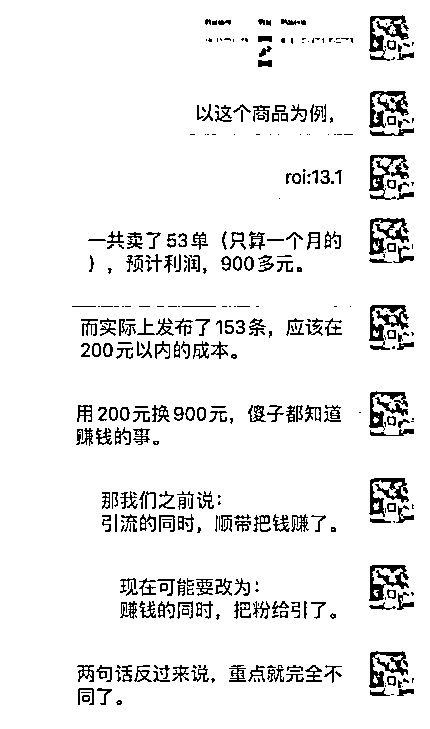

整个引流模式的ROI能否跑正，主要取决于尽早发现和测试出这1%的好款款。

 

 

5.4、选款要求：

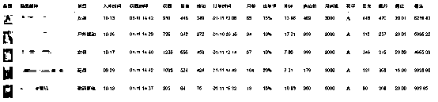 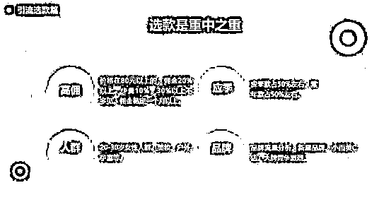

高佣：价格有80元以上，500元以内均可，佣金10%以上，佣金稳定在一个月以上。

应季：应季款和常年款各占50%左右。

人群：20-35岁女性人群。美妆、户名、孕童。

品牌：品牌词自带流量，一定要含有品牌词，且小红书笔记在100笔以上的。

**5.5**、选款举例：

 

 

6月开始操作，1-5月暂时没有经验。

6、7月的泳裤、防晒衣/帽、渔夫帽、墨镜、冰袖、一次性内裤、脱毛仪

8、9月的月饼、学生行李箱、书包、学习桌、娇姿带

10、11月的露营装备、卫衣、靴子

12、1月保温杯、婴儿睡袋

常年款：项链、手链、破壁机、空气炸锅、电动牙刷、筋膜枪、女包、网络摄像头、蓝牙耳机、手表、待产包。

这些都是大致的类目，但是品牌与品牌之间差别依然很大。最好是借商家宣传之势，在直播间、大淘客、联盟首页寻找一些正在大力宣传和推广的商家。有时候我甚至可以电梯间也可以发现一些好的品牌机会，总之寻找一些有可能流量的机会。比如泰兰尼斯这个名牌不知大家听过没有，反正我之前是没有听说过的。

 

 

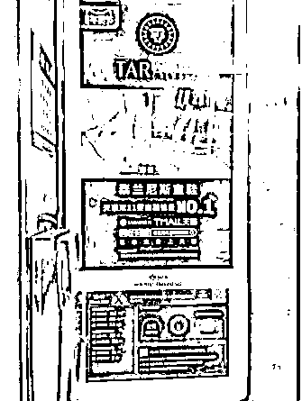

这样的品牌有线下推广，厂家自己在投入推广，这个时候流量肯定会比平时要多。而笔记数量的“供需”相对会稀缺一点。

 

 

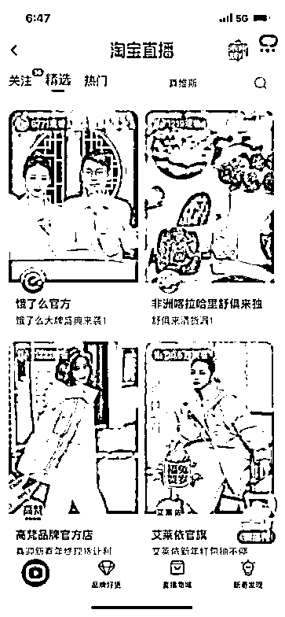

最后可以用5118等工具查看搜索流量

 

 

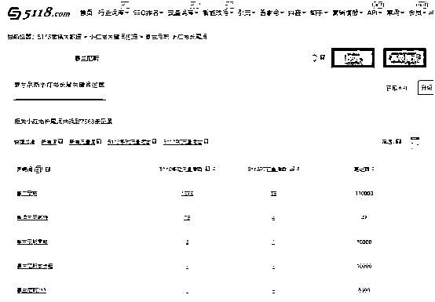

六、细节是魔鬼

有些人一听说发笔记引流，可能就会有完全不同的两种结论。我知道有少部分人做得很不错，通过小红书每天引流几百、上千粉丝。有些人每天发上万条笔记。

 

 

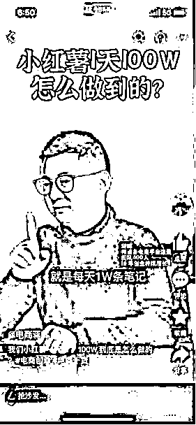 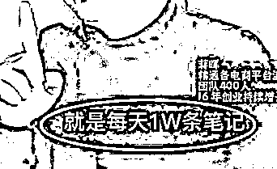

 

 

而且他们各种业务都玩，什么粉都尝试。比如外卖、电影。最近蒋晖也有介绍过每天1万条笔记的玩法。不论他的效果是不是真实的，但是也可以说明确实有人通过大量的发笔记引流。

而另一部分人的结论都是：太难搞了，没有效果。

但是仔细一沟通细节，发现他们的做法注定是很难搞。

**6.1**、删除笔记现象

比如：有人反馈说兼职今天发的笔记，领完钱，明天就删除了，哪里会有流量，难搞！！！

解决办法：系统自动抽查的，每人每周自动抽2条笔记，删除了就禁号，想继续再做，先免费把删除笔记的补上相同数量再说。

**6.2**、招不到人？

有人反馈说招不到人发笔记，做了一个月了，每天就10个人发20-30条笔记，从哪里招那么多人哦，难搞！！！

解决办法：有钱能使鬼推磨，我一条笔记给1.5元，徒弟每做一笔师傅得1块，人来得超快，最多的时候每天400，500人在提交笔记任务。随便怎么挑来挑来去的用。再通过设置奖励上限额度，最后算下来，其实并不会花那么多钱。

**6.3**、兼职拉自己小号？

 

 

有人说自己的兼职大号拉小号，撸奖励，一条笔记成本太高了，真难搞！！！我说：我的笔记发现有填支付宝相同或 IP相同的人，自动断开关系。

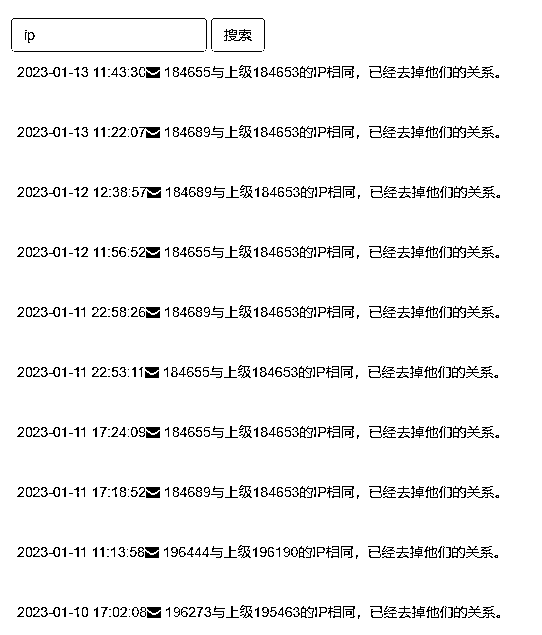

6.4、 我知道我有一半的广告费浪费了 ，但我不知道是哪一半。

这句话来自百货业之父约翰·沃纳梅克(John Wanamaker)。

 

 

有同行说，有些人的笔记有效果，有些人笔记没效果，都给1.5元吗？有些人每条笔记都只有十几个浏览，感觉好多钱浪费了，没有效果，真难搞！

解决办法：是按效果付费的浮动报酬。

浮动报酬是指根据小红书笔记的周报数据，或者引流下单数据调整报酬。

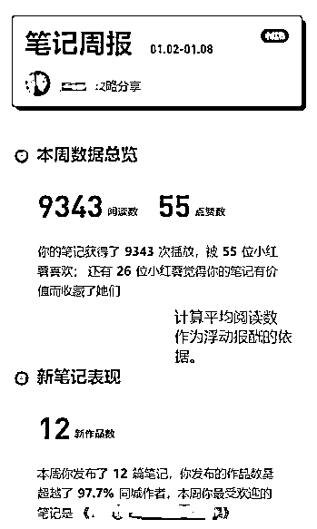

 

 

开局1.5元，效果不好的浮动到0.5元，0.2元。效果好的涨到2.0元，3.0元，并天天在群里拿这一二个3.0元的当榜样，不停的截他的奖励图，鼓励那些报酬少的坚持下去。综合算下来，其实平均一条笔记才几毛钱。

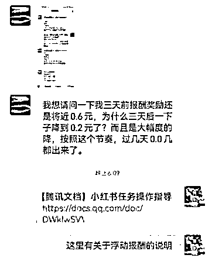

太多细节，就不一一说得那么具体了，有些规则我自己都忘记了。。。。

七、关于风号

做公众号的返利的都担心一个问题--就是风号，确实这个问题一直困扰着大家。

其实2022年情况还算比较宽松，很多人反馈以前发模板消息动不动就处罚，2022年好像没有管这一块了。也确实发现很多模板消息又开始多起来了。

 

 

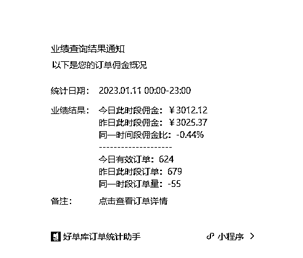

我们也没有什么办法彻底避免这个问题，只能发挥主观能动性，积极的想办法就应付。

目前能处理的措施主要有以下几种办法：

**1. **多公众号操作

当你只有1个公众号的时候会比较焦虑，当你有2个公众号时感觉有个备份焦虑会少一些，当你有5个公众号每个公众号只占20%的业务量时，基本上这种焦虑就不存在了。

**2. **引导进群备份。

公众号留粉丝进群二维码，引导进群查看最新爆款、享受粉丝福利等。

**3. **引导加好友备份。

 

 

通过菜单提示加客服有福利，并及时给用户打标签。如果再在5单以上的用户提现时，偶尔设置一些莫名奇妙的“故障”，让联系客服处理后，基本上80%的用户可以得到多重备份。以往有风号时也基本上能挽回80%。

备注格式：

【公众号简称+最新订单年月+会员编号+多少订单+原昵称】

比如：有券-2212-187279-100D-胖妞，

表示：公众号“XX有券”(举例,实际不存在)的会员，22年12月最后下单，会员编号187279，累计下过100单(D)，原昵称为胖妞。

 

 

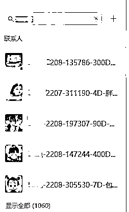

今天要分享的内容主要就这些了，希望对大家有用！

另外，附上提问环节：

提问：笔记内容是兼职自己去获取，还是你获取好了发给兼职？

回答：兼职获取内容和提交链接都是从公众号获取的，我再补充一个图。

 

 

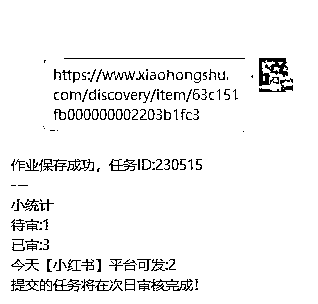

提问：系统是如何确定这个单子已经完成的？是不是根据给兼职的文案**  **和兼职发出去的文案之间的内容对比？

回答：兼职提交笔记链接以后，系统会抓取笔记的详情，有图片、标题等内容。可以用来判断是不是咱们的内容。甚至图片是不是漏发了，有没有加话题。都会检查。

提问：太厉害了，连漏发都查得出来。

提问：具体是如何引导到公众号查返利呢？是客户留言后，私聊发公众号的名字给客户吗？客户关注了公众号后，客户是如何下单笔记发的那个商品呢？

回答：兼职的方式，不太适合留言或者回复。他们很懒的，根本不管你这些。所以直接在文案中用水印图片。

提问：每天这么多一笔一笔的钱要转，你是如何提升效率的，使用商户转账到微信么？

回答：系统可以抓取笔记的详情，然后给笔记打分。自动入帐。用户自己提现。除了准备文案的前期工作，后续，整个过程几乎不用人工干预。

 

 

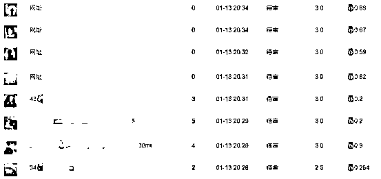

提问：对兼职的小红书账号有什么要求吗

回答：没有要求，提了要求也不好操作。所以看效果说话。先给1-1.5，让他们发几条再看。

提问**:**这套工具太牛了，既能生产不错的文案，又能兼顾效率，还能自动检查笔记是否正确，是否漏发，我想问下工具是自己开发的，还是找人开发 的？

回答：这个系统是我自己开发的，也是5，6月份的的时候，听到这个这么发笔记。但是每天跟兼职对帐，检查笔记，很费事，经常打错钱，少算多少。说，根本不是人干的。

自己懂开发，所以就慢慢迭代着完善了。

提问：赚钱的时候把引流给解决了，牛逼，那你接下来准备如何放大，如果放大**10**倍，你整个**SOP **需要调整什么？

回答：目前已经实现0-1，确实已经在考虑1-10的事情。主要就两个因素，1是兼职，2是商品。兼职的问题，好解决，给钱就行。钱多不怕没人。主要是roi是正的，还有涨价空间。

另一个就是选款，测款。需要大量的测款。只要扩大这方面的投入和经验就可以了。

 

 

提问：你说的系统自动抽查，那看来也不需要人工干预了，直接系统来抓取链接，看链接是否正常访问，是吧？

回答：嗯，每人每天抽查一次。老人就抽查少一点。不能删除，删除就要求补回来。

提问：查询**IP**然后解除上下级关系** **那个功能也是你自己开发的了，也是自动的？

回答：嗯，除了ip相当，还有填相当支付宝的。也取消关系，但是前台不作任何提示。

找过来才告诉他为什么没有下级奖励了。一般都知趣，不会找你麻烦了。

提问：浮动薪酬制度太厉害，估计也是系统自动完成的，如果全部用系统自动化，那一切都解释的通了

回答：是的，浮动报酬也是自动的。刚开始也手动的，后面感觉麻烦。就弄成自动的了。按一定的出单率，或者笔记的平均流量给钱。比如1.5元一条，要求每条笔记有200个流量。否则相比降价，或者涨价。

提问：这那个【莫名其妙的故障】简直了，佩服，几乎可以备份所有头部客户

回答：是的，就比如说提现时说：公司余额不足，您可通知客服充值。及时帮您处理。

提问：之所以你这整套自动化走得通，就是这套经验转化而成的系统，就像飞轮效应一样。接下来搞定一位超级选品官，然后不停地对接兼职，能爆发很强的力量回答：是的，边搞边改改。想偷懒的时候就加点功能。就慢慢这样走了半年。

评论区：

翊鸿 : 太干了，太厉害了[强][强]

我要打印下来仔细研读[玫瑰][玫瑰]

老严干货CPS : 谢谢，最核心的是思路，再加上开发能力，不断优化

阿星 : 厉害

 

 

老严干货CPS : 谢谢，越分享，越成长

詹伟平 : 老严厉害

老严干货CPS : 谢谢

极客深蓝 : 求教，小红书笔记可以直接留公众号吗？

三林 : 文章逻辑写的够乱的  。。
