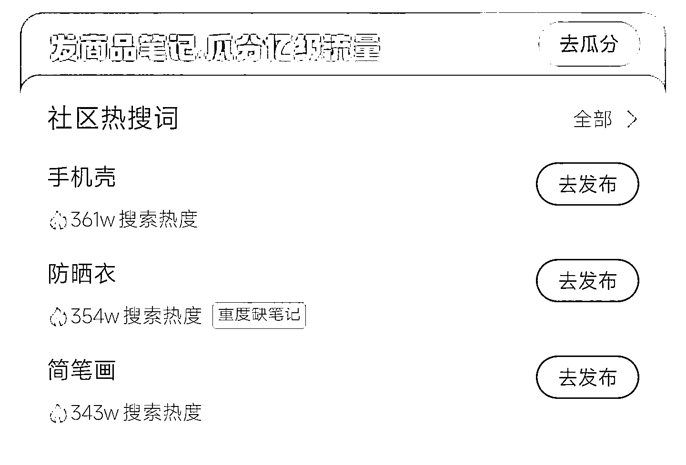
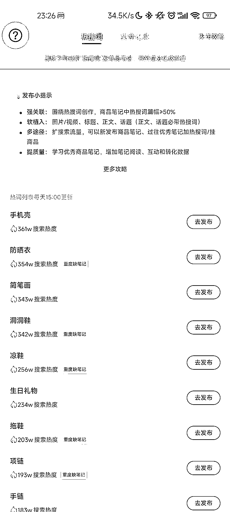
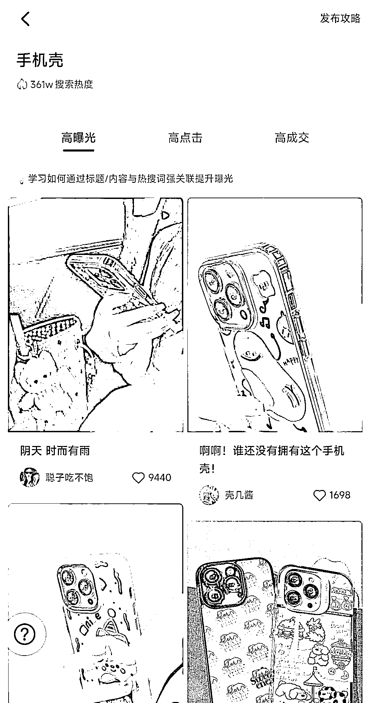
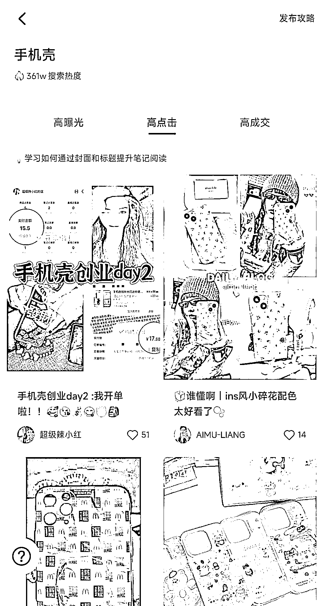
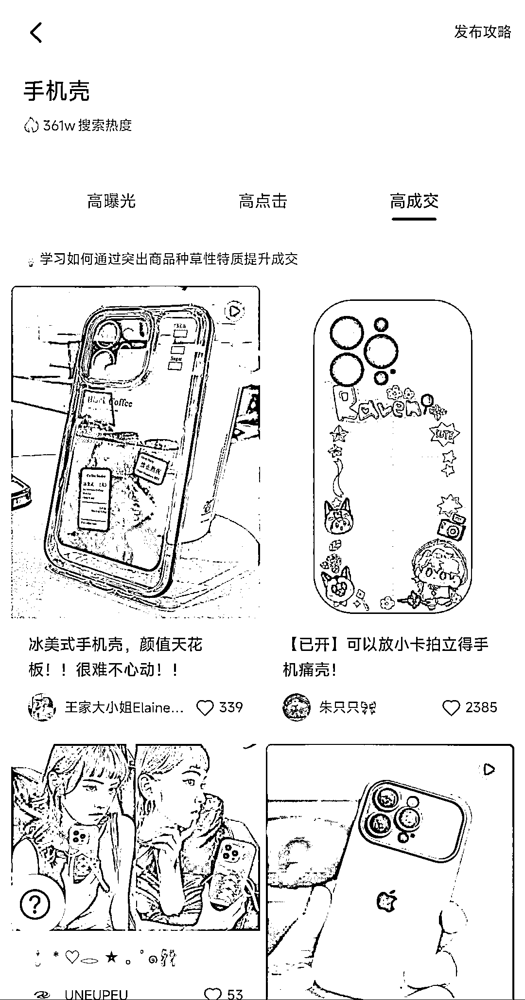

# (14 赞)小红书店铺选品技巧：社区热搜词揭示高曝光、高点击、高成交笔记

作者： MD

日期：2023-06-28

关于小红书店铺选品

除了使用蝉小红等付费工具找灵感外，

可以使用商家版 APP 的社区热搜词功能，

查看热搜词排行以及高曝光、高点击、高成交笔记，

 

 

 

 

 

 

 

 

 

 

 

 

 

 

 

 

 

 

评论区：

暂无评论
