# (精华帖)(373赞)如何从小红书千条带货笔记深度挖掘，找到适合普通人的蓝海爆品

作者：  梨云

日期：2023-06-09

生财圈友们好，我是梨云。

小红书电商，是这几个月，甚至是这一年的热点风口。

无货源被圈友们玩的风生水起，同时，小红书站内商业化也在稳步推进，逐渐开放选品带货功能，有不少知乎玩家惊呼：这莫非是知乎好物2.0！

看了 @家蒙  的风向标直播，我深受启发，于是，也向亦仁大大申请，发起风向标小红书专场领读。

 

 

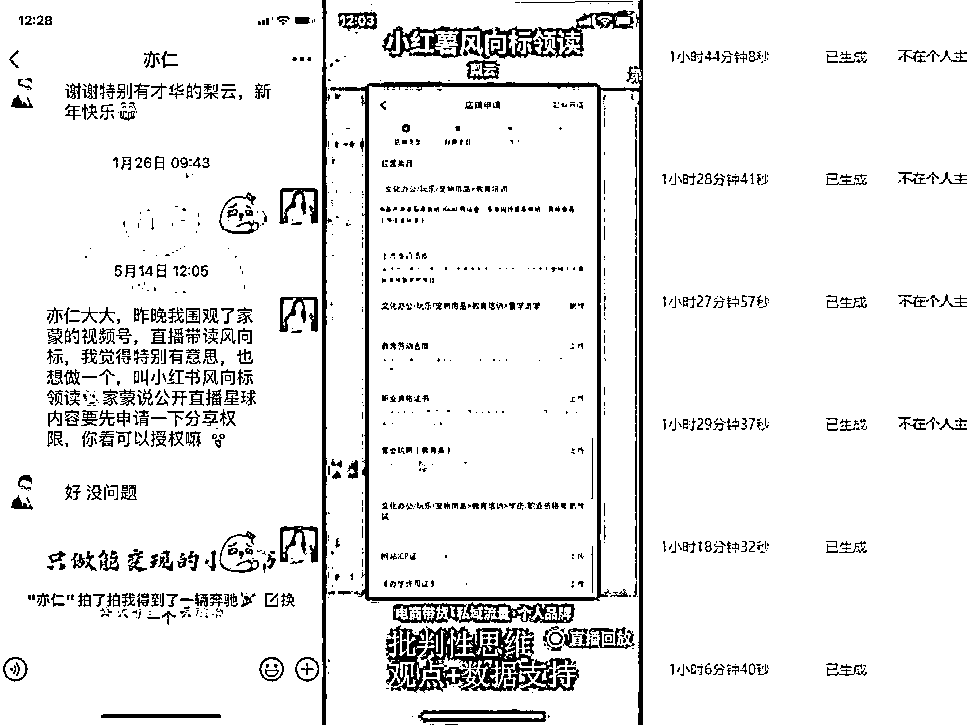

在做了近10小时的直播，拆解了几十个产品后，我发现，小红书电商的红利期，是真的有太多机会了。

首先，它没有形成品牌垄断，其次，没有形成固定打法，正处于玩法的百花齐放状态，最后，没有进入规范期，稽查也比较宽松。这三个点加起来，意味着普通人现在入场，有大把的肉可以吃。

虽有风口加持，但依然有大量玩家发出相同的问题：卖什么好？

是的，选品定生死，而且，当大家都知道这个品好卖的时候，它的红利已经被吃掉一大半了。

 

 

就像我挖掘到的内衣品，当时2月1号入局，真的特别好做，新号发了2篇笔记，别看个位数点赞，但它就是当天开始出单了，再看别人5月底入局，就难受了。

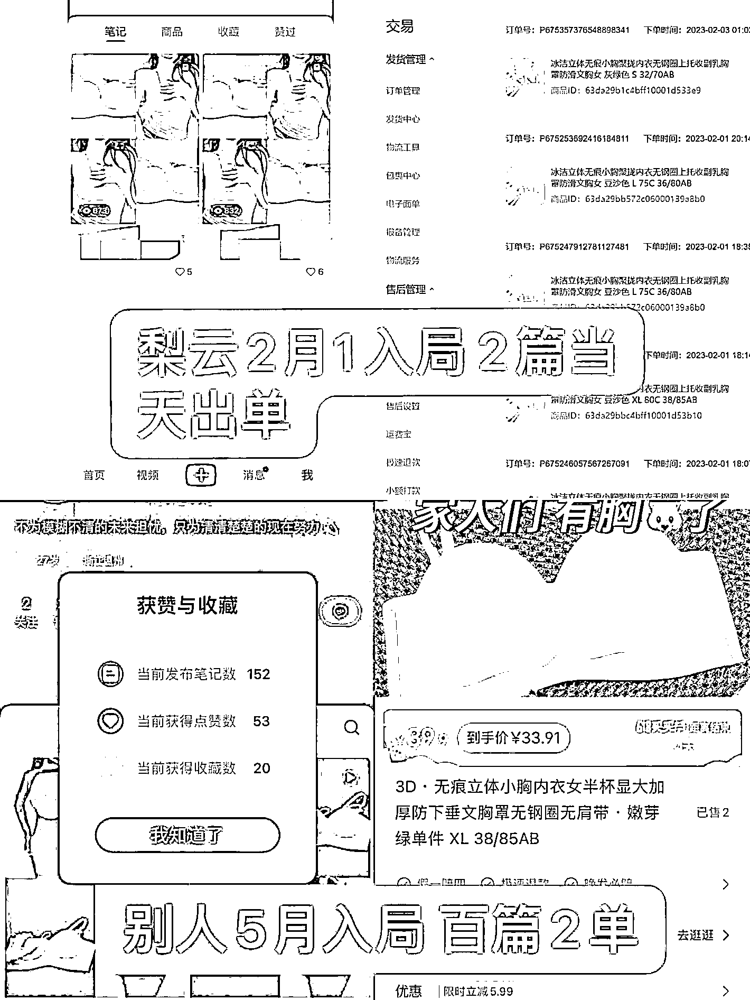

 

 

这就是选品的红利优势，随着时间推移，没有足够的矩阵号，或者内容创作的时间投入，后期是很难竞争赢别人的。

所以，这就需要我们拥有提前挖掘爆品抢占先机的方法。

是的，在没有资源加持的情况下，普通人的选品策略就是：先下手为强。

上一次，告诉了你在小红书上，如何挖掘出1000个适合普通人的赚钱项目。

这一次，我和你分享，怎么让小红书电商里的爆品先机，把握在自己手上。

蛮荒领域的批量搜集

小红书电商，相对于其他平台的电商项目来说，依然是一个新事物。

在这样的蛮荒领域，刚入场，谁也不知道哪个才是正确方向，只有足够多的成功案例，才能帮助你在小红书上快速获取选品灵感。

所以，按照从无数案例中精拆的思路，第一步，我们需要搜集大量小红书商品笔记。

 

 

刚开始，我是在小红书上输入关键词，手动收集案例，做着做着，突然发现，这有问题！它存在信息茧房！

我只能检索自己认知内的品类关键词，系统也只会做我可能感兴趣的相关推荐，那些我认知外的品类，岂不是直接被筛选掉了？

而商机、蓝海产品，往往就在那些你想不到的地方呀！

怎么办呢，这时候，想到了万能的数据平台，它上面就有商品笔记的筛选。

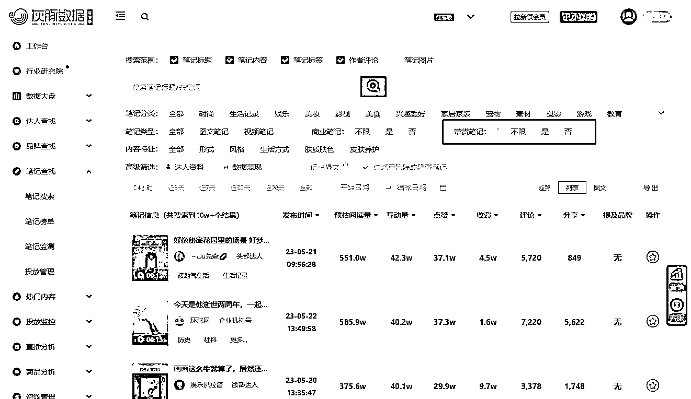

于是，我把4月的2000条带货笔记导了出来，打开表格，连商品链接这一列都没有！

我需要它，因为可以更直观的获取价格、销量等数据，只有这样，才能支撑我做更深度的分析。

 

 

我便用八爪鱼采集器，爬取灰豚的数据，过程涉及太多细节，和消磨耐心的调整，就不占用太多篇幅展开了，一问程序员朋友，他用python + selenium 20分钟就搞定了……

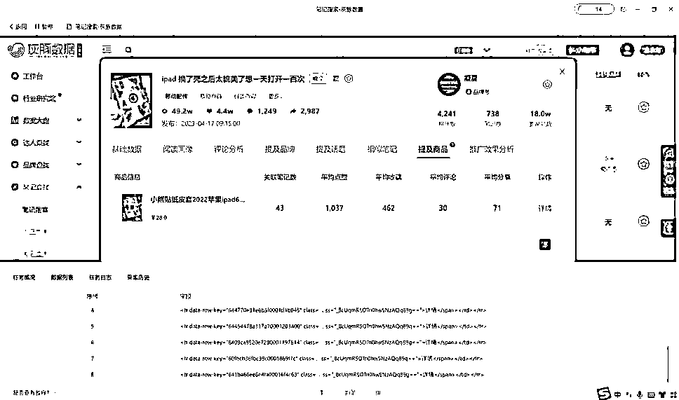

拿到商品链接，顺势批量爬下了对应产品的【销量】【价格】，然后用表格计算出它们的【GMV】。

小红书4月带货数据源

 

 

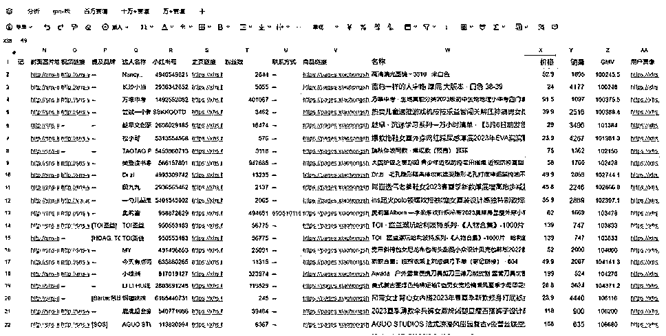

ok，后宫佳丽三千，已经在你面前了，接下来，就是刺激的选品环节了。

正所谓选品一时爽，选错火葬场。这么多品，我咋知道哪个好做，哪个不好做，这时候，就要有分析筛选能力，等着别人告诉你，汤都要没了！

先于选品的赛道选择

拿到如此详细的表格，想必你的问题终于更明确了，从“卖啥好”到“做女装咋样”这个问题问得好，下次不许再问了，我们选品最后是具体到某一个产品，不是一个大类，这种宽泛的问题，是得不到可执行的答案的。

 

 

所以我们去思考、做分析，要从宏观出发，到微观落脚。

宏观，就是开启上帝视角，从GMV窥探赛道天花板，可以分为三档：百万赛道（100w+）、十万赛道（10w-99w），和万级赛道（1w-9w）。

先来看看这些赛道的粉丝量分布，这是成本和门槛的一个判断维度，如果粉丝5000以上居多，那么对新手就不友好了。

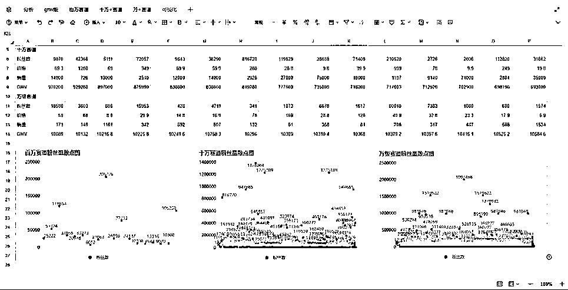

散点图看了个寂寞，数据太多，点连成一团浆糊，那换一个方式。

按照小红书对博主的分类，把三档赛道的粉丝比例做了出来，这样就很清晰了。

 

 

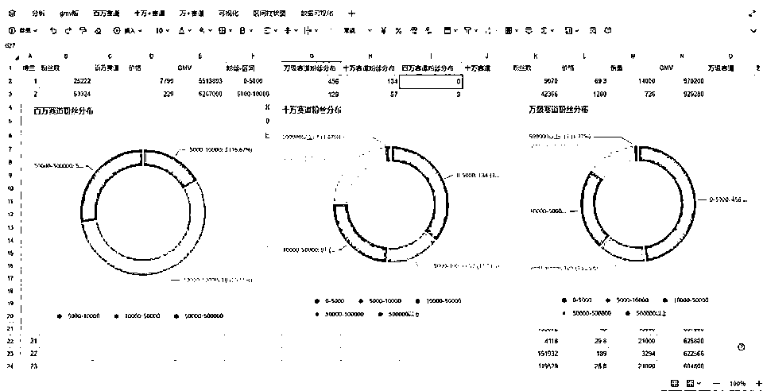

百万赛道：5000粉以下的博主没有，其中有一半的博主集中在1w-5w粉，不做IP，没有粉丝量积累，你做这个品，可能会带不动。

十万赛道：5000粉以下占了三成多，和万粉以下共同占据半壁江山，门槛大大降低了。

万级赛道：5000粉以下占了快一半，刚入场不要眼高手低，可以来这个赛道做选品，相比前面，难度就是新手村。

粉丝量本质上，反映的是一个账号内容吸粉能力，能倒推出内容质量，进而初略判断笔记制作成本。

同时，粉丝量越大，账号权重越大，初始流量推的也越高，就比如我18w粉的梨云绿，在用户画像同行比例飙升，扰乱了推荐人群，导致没什么点赞的情况下，基础曝光随便都能进入千级流量池。

 

 

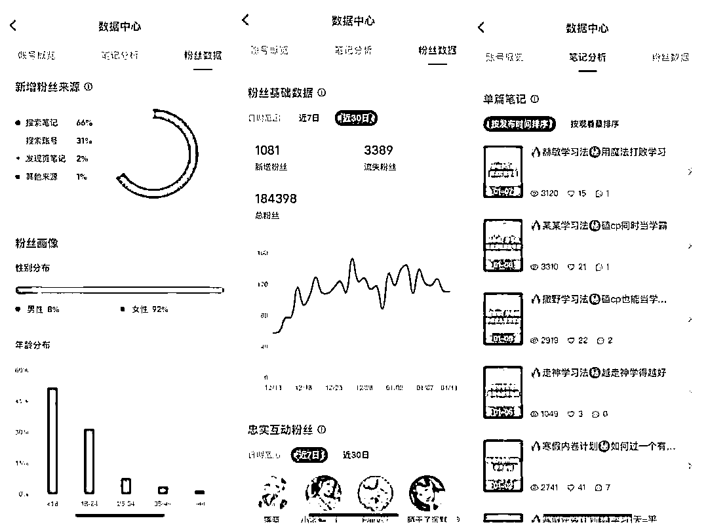

如此，对标大博主的带货，开新号来说，难度也是直线上涨的。

答应梨云，你的目标，要和你的能力匹配，不然又要喊怀才不遇了。

接着，分析三档赛道的价格分布，看赛道消费力，有利于圈定选品的价格区间。

 

 

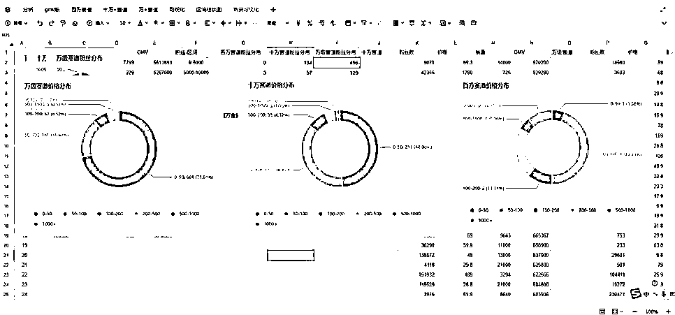

百万赛道：50-100占了4成，200-500占了2成，50块以下只占了0.5成（这得多大的销量才能拉到百万GMV）

十万赛道：50块以下占了一半，50-100块占了3成。

万级赛道：50块以下占了7成！50-100块占了1成多。

发现趋势没，想要突破十几万、上百万，客单价必须往高里走，但是与此相对的，就是带货难度更大。

不管你是选品中心，还是做无货源，选品的价格区间，控制到0-100块，尤其是50块以下，对新人新号会友好一些。

俯瞰三档赛道，最后还是选择进入相对简单的万级赛道，来看看它分布着哪些大品类赛道，有没有你喜欢的，或者，刚好你和朋友，有货源。

 

 

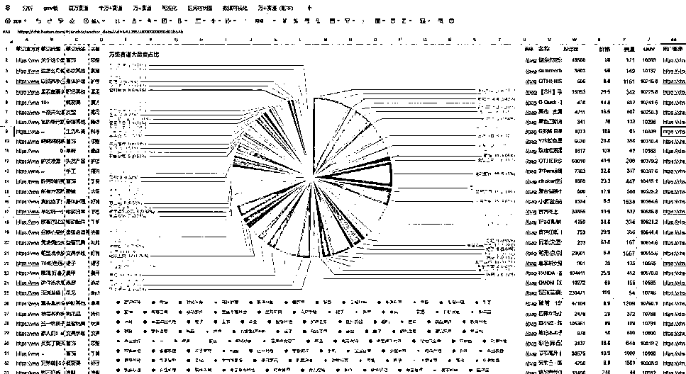

密集恐惧症……就不费你眼了，直接上结论，占比前十的大品类：

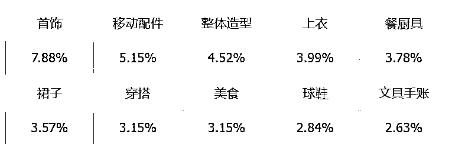

到这里就结束了吗？不是的，首饰有很多种啊，比如戒指、吊坠等等。

所以，我们取前5名，来看具体是什么品类。

 

 

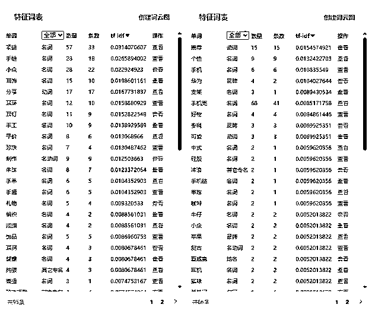

取笔记关键词放词云，知道为什么不取标题吗？因为取了分类失败……原因是带货笔记某个特点，后面告诉你。

分类后，整理得到这个表，因为整体造型，和上衣重合度极高，所以我整合在了一起。

 

 

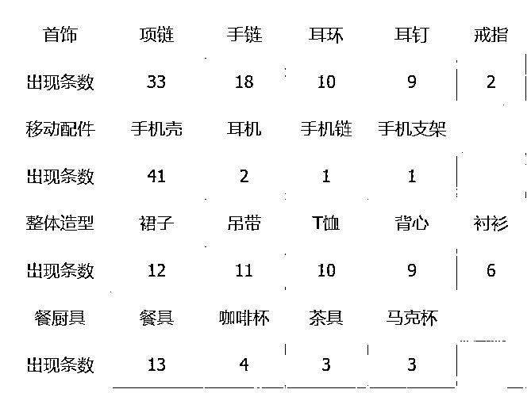

通过这个表格，就发现，手机壳的笔记也很多呀，款式花里胡哨的，咋整，不慌，那就再进一步以价格区间来缩小范围。

用一个透视表，揭示价格、GMV、销量，和互动量之间的内在联系。

 

 

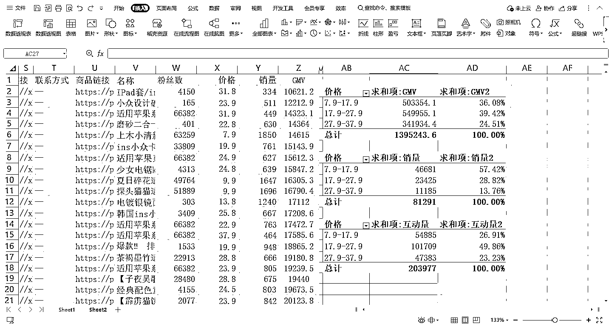

在手机壳这一块，按照10元为间隔，分为了三档：7.9-17.9的1档，17.9-27.9的2档，27.9-37.9的3档。

打分规则一出，高下立判：GMV、互动量越大，得分越高；销量越大，得分越低。

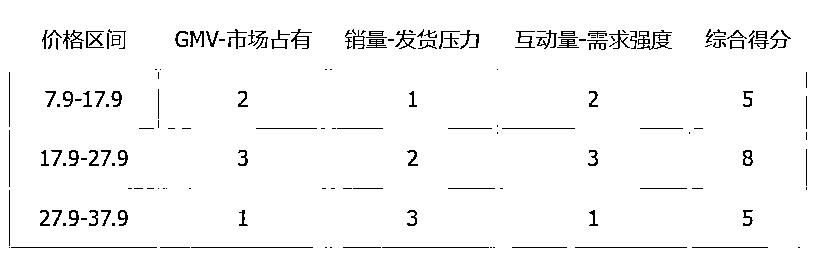

恭喜2档以2分的差距脱颖而出，那么，接下来，就直接在里面选笔记的品了，选了就可以上货开干了！

且慢！

 

 

刚刚完成的，是宏观分析，帮助我们快速锁定一个小区间，方便做选择。

但是！即便是层层筛选，也会有我们做不来的产品，所以，需要进一步，对选中笔记的品，在进一步分析。

只有把微观分析也整明白了，才能彻底确定，这个品，适不适合自己做。

做商品笔记微观分析的宗旨：一切回归到成本计算上来。

带货笔记的成本分析

在上面筛选的区间里，挑了一个粉丝量只有100多，却带出了1.2wGMV的手机壳来分析。

 

 

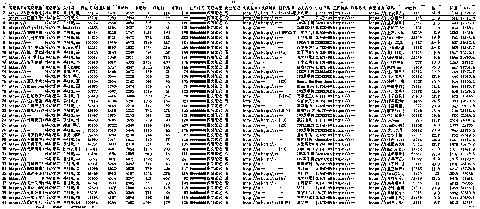

当我们拿到一个商品笔记链接，该怎么计算投入产出比呢？

首先，点开链接，你会怎么分析？白色牛仔也很酷💭☁  🤍⚪  ⬜

 

 

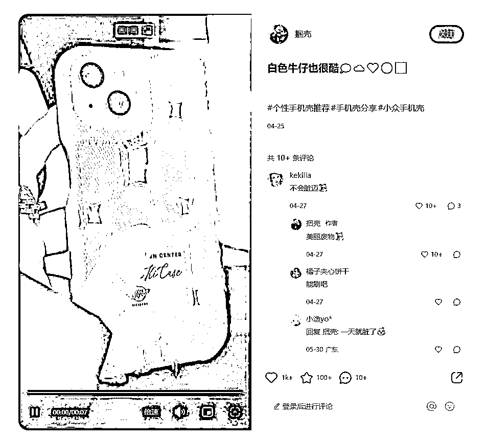

你看到的，不应该是：啥玩意啊，一个破手机壳，就千赞，这么多人看。

你必须透过笔记看到它整个呈现形式，这是第一个：笔记制作成本

 

 

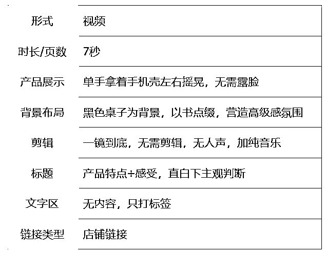

这个制作成本，还是可以接受的吧，用手机拍摄，还不用剪辑不露面，从链接类型看，它极大可能是无货源素人号，极小可能是自有厂家企业号，绝不可能是选品中心带货。

你要是不能做，那就pass，能做，就会顺势点开主页，来到第二个：账号运营成本 

 

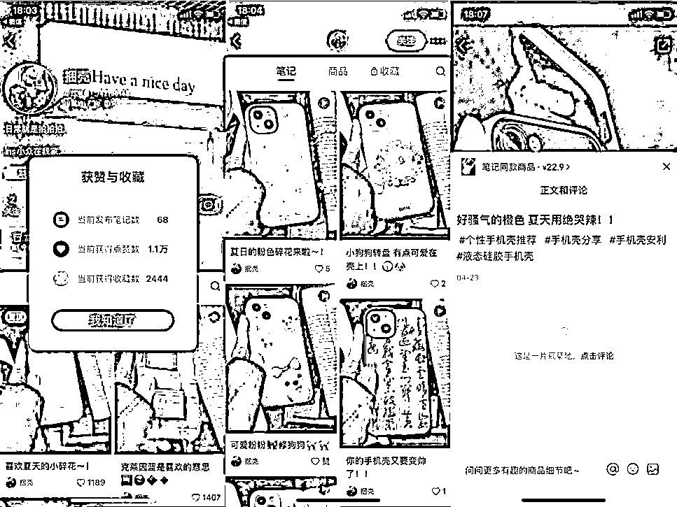

来到主页，就要看简介、看基础数据、刷笔记，逛店铺。

 

 

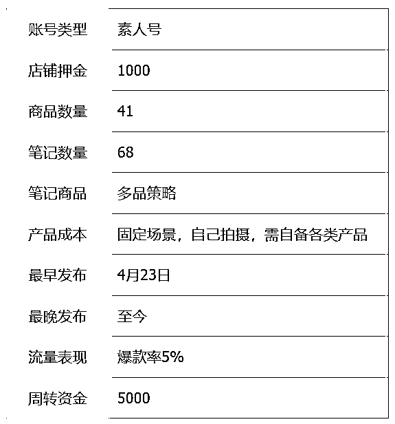

从上面数据反馈来看，可以知道，启动资金，起码准备6000+，其中的5000是有备无患，因为是无货源，爆单了，是需要你先垫付的。

这个店铺，有41个品，主要是手机壳不同花纹，走的是单品类打爆，而不是单款打爆。

单款，就是一个产品一直发，她是不同的款都发笔记，并且是固定场景，这就意味着，她是自己买产品来拍的，好处是完全避开查重，毕竟是原创，要注意的是，每个款你都要自己买回来，又多了一笔投入。

 

 

翻到最早笔记，可以看到她入场时间，做了多久，45天发了68篇笔记，平均每天发1-2篇，发布量压力不大。

从流量表现来看，笔记大多数就几个赞，靠一两个千赞大爆款拉起来的销量。

你可能会问这个怎么快速分析，简单，数据平台直接导出这个博主全部笔记，然后上表格。

以上分析，你看起来很多、很复杂，其实，一边看一边分析一边学习，2分钟就能完成，主要是熟悉，起码练习10遍以上。

在小红书上分析完，付出成本能接受，然后才是跨app，来到拼多多，看利润。

 

 

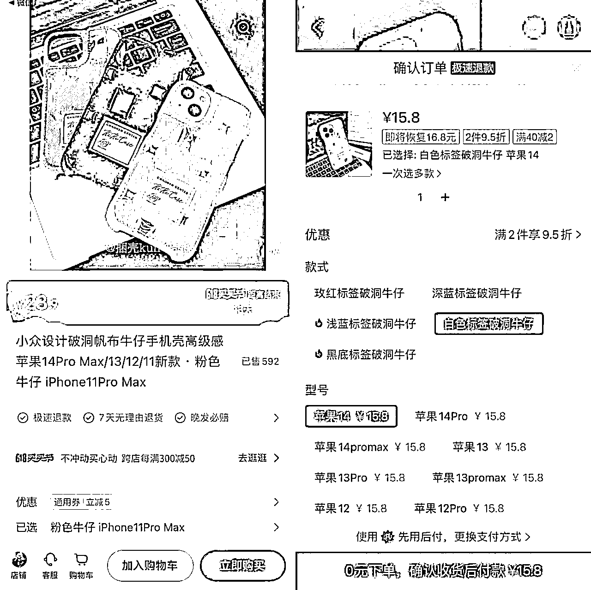

一个半月4700，赚的多不多，每个人心里都有一把称，这个自己去判断。

接下来，分析成功概率，它是一个账号跑出4700，还是矩阵跑，搏概率，一将功成万骨枯。

直接检索产品关键词，点店铺，看IP地址是否一致，看这些账号主页的内容是否有批量化痕迹。

 

 

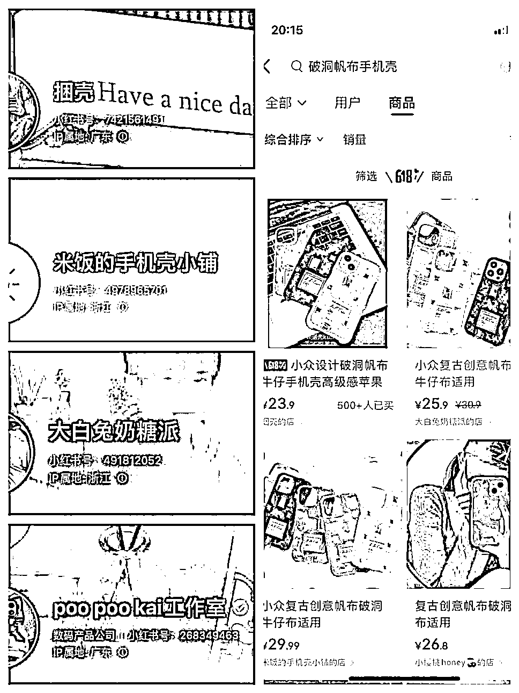

可以看出，不是矩阵，对个人玩家友好。

 

 

最后，结合上面的店铺分析，和关键词检索笔记，看这个款的竞争激烈程度，同款笔记数量极少。

这就是正在赚钱，并且同行少的一个手机壳款式了。

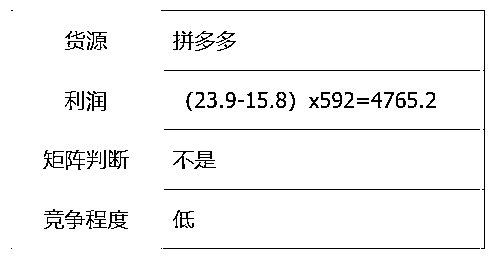

这么分析下来，你只需要对这个问题，给我一个字的回答：

有这么一个品，不混剪自己卖产品拍，要会拍视频剪视频、不用露脸，日更1-2个月，等一个爆款拉爆单，利润三四千，流动资金6000+，无货源。

你做不做？

为了方便大家对带货笔记进行分析，我把这个表格整理好了：

 

 

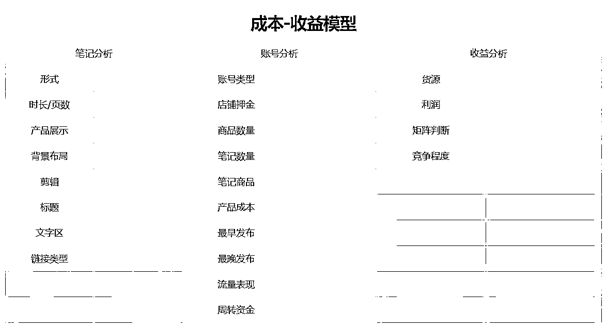

你可能会说，宏观的赛道分析，光是收集数据就已经太费劲了，能不能通过一条笔记，就把宏微观结合起来分析。

哈哈，当然可以，宏观分析让我们对三个档位有了具体的认知，拿到前面的结论，结合微观分析即可。

我们直接跳过赛道分析，随便选个品，来感受一下这个拆解过程。

比如，你找了这个商品笔记：没了没啦！没想到把脏东西都挖走了？？

建议先点开把视频看完，再看分析。

 

 

 

 

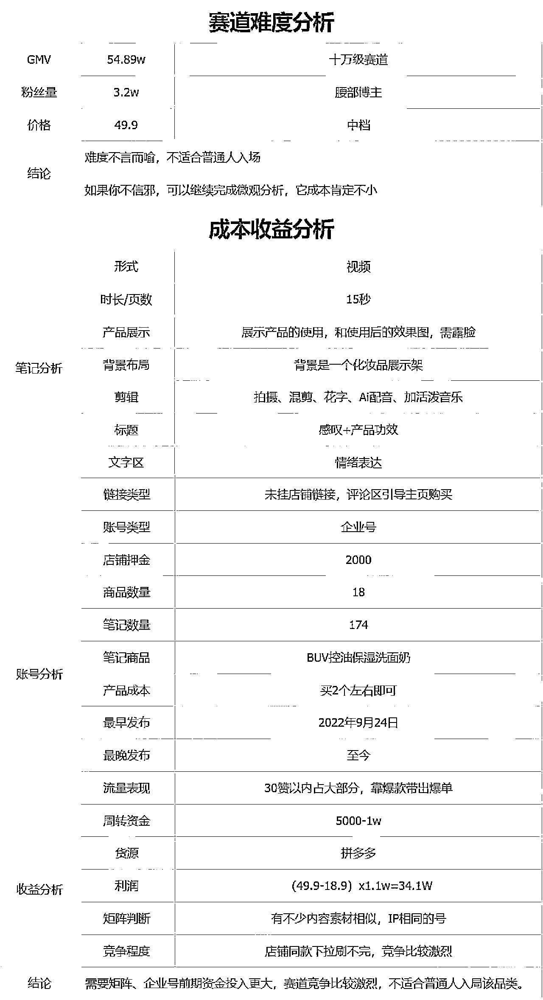

发现没，直接抓笔记分析，遇到普通人可做的品的概率，突然就大大降低了，那怎么提高这个概率呢？

用常识！比如现在是6月，衣食住行方面，有哪些是6月特有的？夏天的女装，是不是切这个赛道，去找款了？

夏天的水果，盲选成功概率，是不是也更大，有荔枝、桃子、杨梅、樱桃……

那我就挑个不喜欢的桃子来分析一下，直接小红书检索桃子，往下翻，找一个数据比较好的笔记，点进去。

卖出十几单  我妈让我跟大家说谢谢

 

 

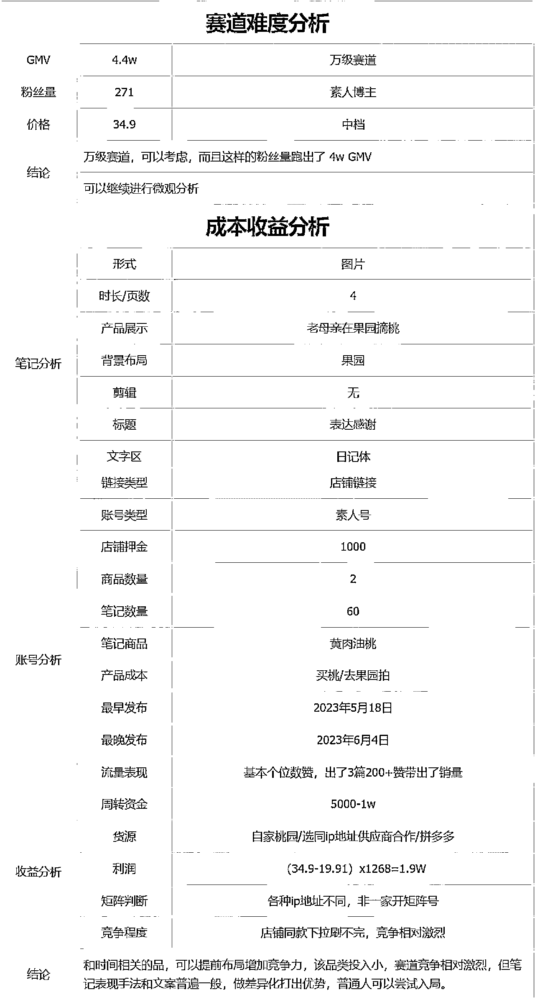

 

 

那么，根据自己的情况，就可以判断，这个桃子，适不适合自己搞了。

结合前面的宏观+微观，从赛道到产品，这一套操作下来，我把它叫做：漏斗式选品法。

 

 

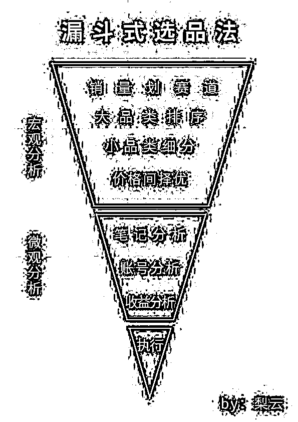

 

 

这是梨云第二篇小红书挖掘拆解类文章，前期主要分享小红书实操玩法，尤其经过风向标拆解直播后，我发现，与之相比，这种文章能带给大家更多商业启发。

很多人不知道自己要做什么项目，其实还是挖掘得太少，每日挖5个案例试试，一个月就蜕变了。

只要一直深挖，思路就会被打开。

今天的小红书分享就到这里，内容很干，希望能给到大家一些启发和帮助，坚持下去，你一定会有所收获。有帮助的话，记得点个赞哦~也欢迎交流+v：lyy520061更多小红书干货，可以关注公众号：梨云读书

往期精华文章推荐：

《小红书三个月涨粉17w，变现10w+，我做对什么？》

https://t.zsxq.com/07Fqr3jQ7

《小红书60天用原创拿下20多篇10w+，如何流程化创作爆款内容？》

https://t.zsxq.com/09ev8Jjgj

《在小红书上，如何挖掘出1000个适合普通人的赚钱项目》

https://t.zsxq.com/0eRD32jY6

评论区：

 

 

晴朗☀  : 梨云出品，必属精品[强][强][强]

跨境老兵聊电商 : 感谢分享

Jia : 爬虫软件能分享吗

蛋蛋。 : 梨云老师yyds[色]

陈小溪 : 云云出品，全是精品！！！！！

阿釘。 : 很赞 

小小博士申泰白 : 讲的太透彻清晰了，实操性强👍

梨云 : [玫瑰][玫瑰][玫瑰]
