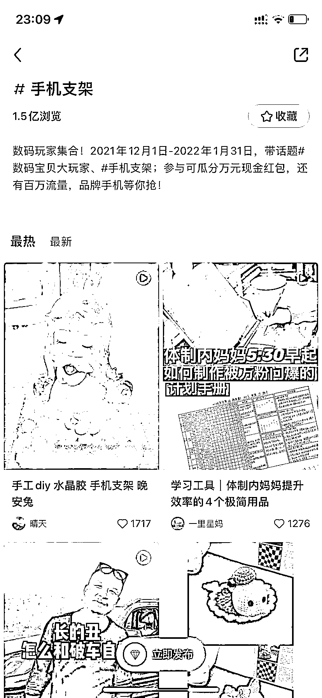
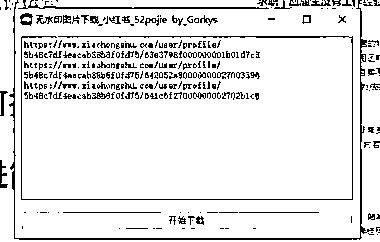
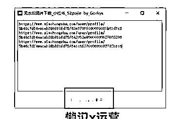
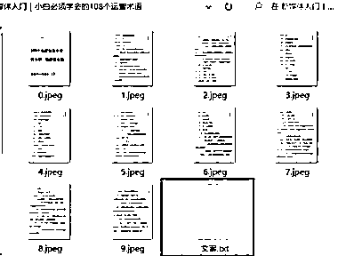
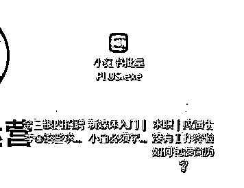

# (20赞)批量提取小红书笔记，可以提高选品效率

作者：  西哥

日期：2023-04-11

哈哈哈，乐于分享生财精神，最近一直研究小红书，选品学文案，我比较喜欢提高效率，分享一个

批量提取笔记的方法

1.比如手机支架你想要抓取这个相关笔记的话可以点开比较热门的笔记话题比如手机支架，那边有个分享按钮就可以复制链接了

2然后可以用后奕抓取工具打开智能模式就可以抓取

3如果软件使用不明白的哈，我分享一个插件给大家，就是需要手动去滑就可以获取了  4.如果大家需要去提取笔记内容我这边有找到一个提取软件，你们把链接复制进去就可以批量提取笔记图片和文件了用的时候呢尽量去把杀毒软件关掉哈

链接放在下面了

【超级会员V5】通过百度网盘分享的文件：小红书批量PLU....exe 链接：

提取码：c6c9

复制这段内容打开「百度网盘APP 即可获取」

【超级会员V5】通过百度网盘分享的文件：链接批量提取插件

链接：

提取码：1629

复制这段内容打开「百度网盘APP 即可获取」

https://pan.baidu.com/s/1eaVgq1yK597asjo4pBMPtA?pwd=c6c9 https://pan.baidu.com/s/1omxGuQx5k_Sdah5LNngnyQ?pwd=1629

 

 

 

 

   

 

 

评论区：

西哥 : 有做小红书的可以一起交流，正在学习阶段嘻嘻DUM321➕备注生财哈  亿安 : 两个链接内容是一样的，都是plus

西哥 : 【超级会员V5】通过百度网盘分享的文件：链接批量提取插件

链接：

提取码：7BW9

复制这段内容打开「百度网盘APP 即可获取」

https://pan.baidu.com/s/1k3bO7YhbGpPHas5JAfoMLQ?pwd=7BW9  SayNothing : 这个链接失效了欸

boarding : 链接失效了
