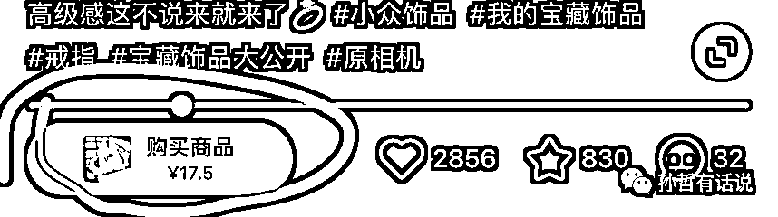

# 2.2 项目门槛 @孙哲

小红书现在笔记有商品带货标识，已经逐渐走向内容电商，也是在打造自己生态下的闭环体系。

在小红书开通薯店，自己卖产品，品牌或有产品的做自营，没产品的做无货源，就是卖拼多多、淘宝、阿里巴巴、京东等产品，小红书出单了到其他电商平台去发货，这种需要垫付资金，你卖的越多垫的越多。

这里特别说一下，很多刚进入社会没有资金的话，真的不建议做电商，大多数都有账期，少则 7 天多则 15 天，而且前期时间以及资金投入绝对不低，不赚钱的话搭时间经历，真爆单了你都没有资金拿去垫付，别看很多电商大佬赚钱，他们要么有供应链资源，直接供货商出货可以压货款，要么就是有资金可以周转。

普通人一定要考虑好资金这一点，如果你手里能拿出一点钱的话，那你可以试试这一种，目前小红书薯店属于蓝海阶段，急需商品进入。

内容来源：《小红书 10 种赚钱方式，6 种引流技巧，详细指南》

