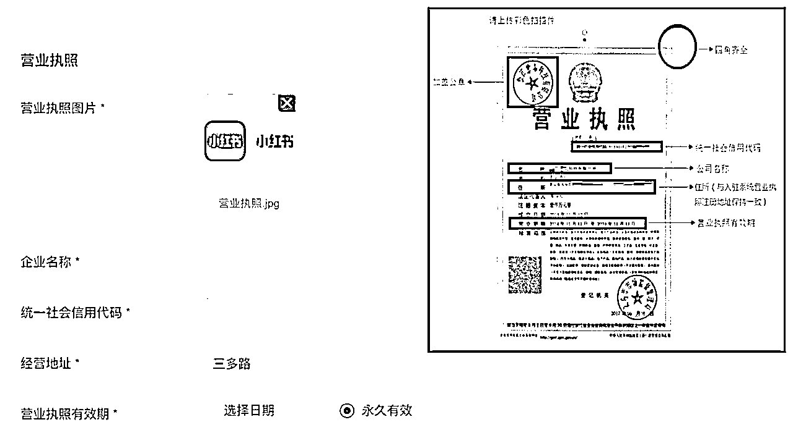
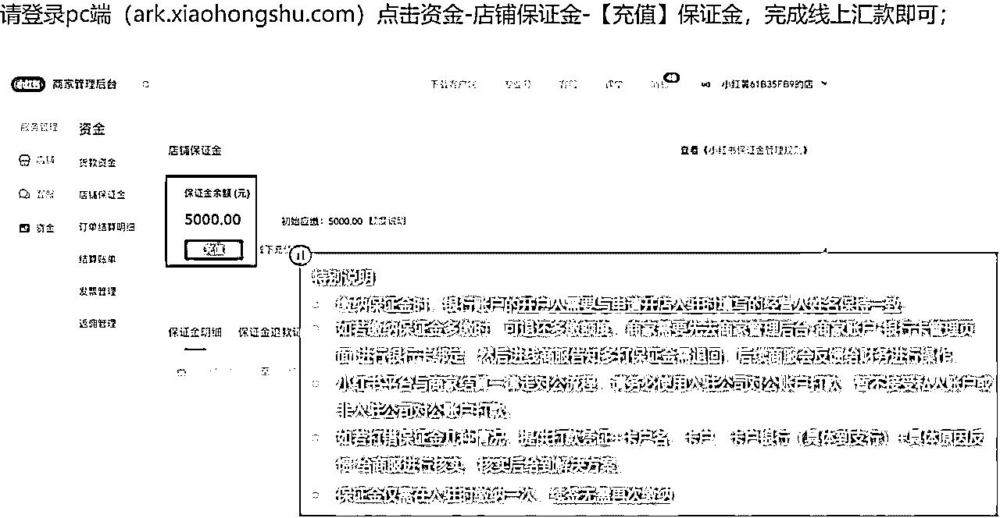
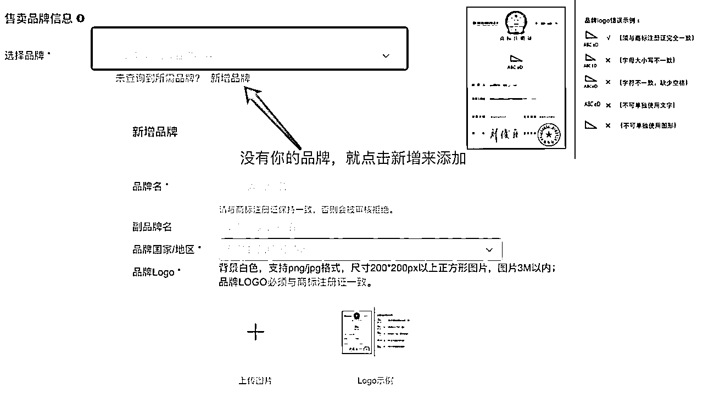
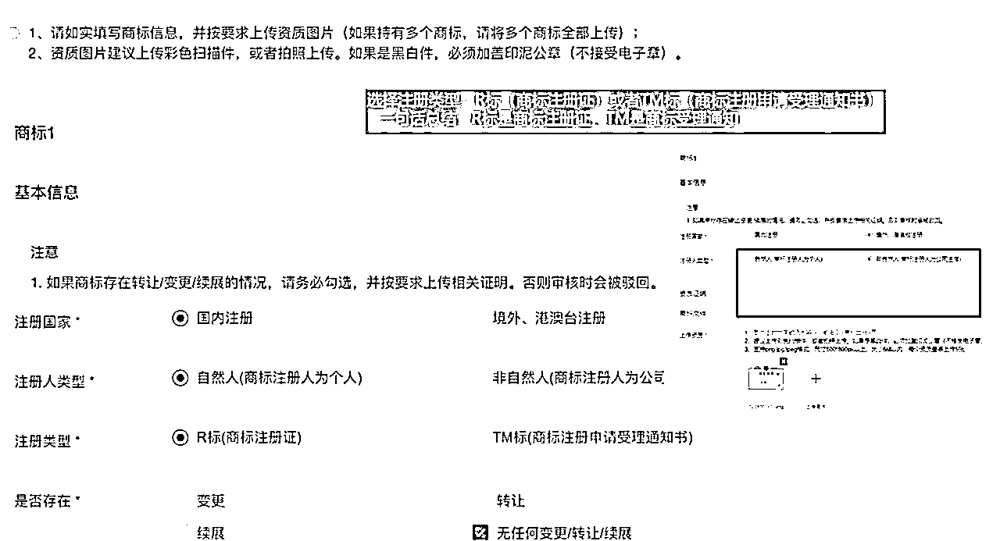
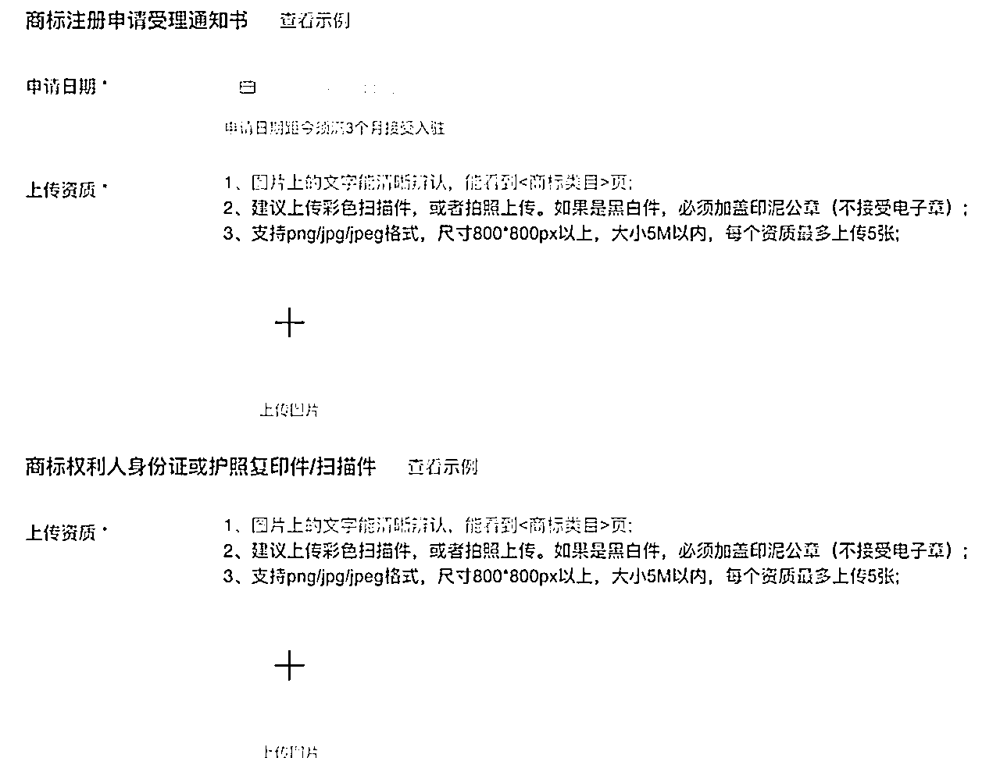
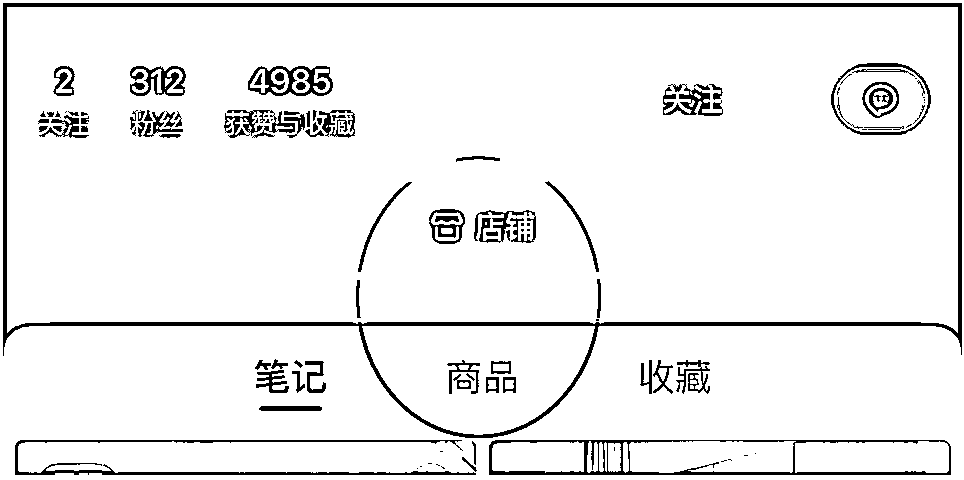

# 3.3.2 企业型

企业型店铺需要准备的材料比较多，建议在电脑端小红书入驻系统操作，网址为：[gaia.xiaohongshu.com](http://gaia.xiaohongshu.com/)

我们先来说普通企业店的入驻流程，登陆后，大致需要 6 步。

第一步，首先选择店铺类型为：普通企业店。

第二步，填写公司信息，上传营业执照，营业执照要拍得清晰、完整，避免扫描错误。

然后，填写法人或店铺运营人信息，注意，联系人要与营业执照上的法人一致。

第三步，店铺名称填写，但这个是系统自动抓取的。店铺命名形式就是“昵称+的店”，所以直接跟你的昵称挂钩，需要修改的话得去专业号中心修改昵称。

第四步，选择经营类目，注意类目必须在商标注册证上的类目范围内。

第五步，就是等待审核，一般审核时间为 3 个工作日内，审核失败会有电话或邮件告知，期间有任何问题也可以联系在线客服咨询。

审核通过后，最后一步就是缴纳店铺保证金了，注意开卡账户是对公账户，而且开户人需与入驻时填写的经营人姓名一致。

其次，我们再来说旗舰店和专卖店的申请步骤，大体上和普通企业店差不多，需要注意四点：

一是填写品牌相关信息。

如果系统内没有你的品牌名称，就点击“新增品牌”添加，注意上传 logo 图片时，要与商标注册证上的完全一致。

二是要区分自有品牌和代理品牌。

如果是代理品牌，要确保有完整的授权链路，公司名称选择营业执照上的名称即可。

如果是自有品牌，就是说，商标持有者是自己公司或公司法人，注册类型可分为 R 标和 TM 标两种，R 标就是注册商标，TM 标就是商标这册申请受理通知书。

其中，如果你的商标注册类型为个人型 R 标，就需要上传商标注册证，以及商标权利人的身份证或护照复印件/扫描件。

同样，如果是个人型的 TM 标，需要上传商标注册申请受理通知书，以及权利人的身份证或护照复印件/扫描件。

而如果你申请的是企业型的 R 标或 TM 标，就只需要商标注册证或商标受理通知书就可以了。

三是选择售卖品类时，注意谨慎选择“定制”品类。

四是审核通过后，还需要签署合同，合同会以线上邮件形式，通过电话或验证码确认签署。

接下来也是缴纳保证金，注意事项同上面的普通企业型店铺。

最后再来说集合店，集合店只有平台邀约才能够入驻。收到邀约后，入驻流程跟旗舰店和专卖店步骤相同。

全部申请通过之后，就可以上传商品开店啦，在你的账号首页可以直接显示店铺和商品入口。

总的来说，企业型店铺的商业权益会比个人店铺更多一些，但维护费用也更高，大家可以根据自身情况选择。

另外关于入驻类目、审核等不懂的地方，建议大家第一时间联系“人工服务”进行咨询，商家客服回复的都比较及时，能够快速解决大家问题。

更多店铺入驻信息，大家可以前往（ [`school.xiaohongshu.com/helper/list?ctg=238&jumpFrom=cn`](https://school.xiaohongshu.com/helper/list?ctg=238&jumpFrom=cn) ）自行查询：

