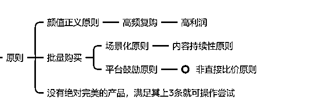

# 4.2 如何选择热门产品 @杉木

每个电商人都知道，选品是很重要的一环，什么样的产品适合在小红书做带货呢？

先说明，没有十全十美的产品，不要在选品这一环节犹豫太久，选品不在多，在精。优先选择自己现有的靠谱供应资源，很多产品只有你试了才知道行不行.

大家可以从以下几个方向选品，比较容易快速得到反馈：

1）功能性半标品：代表有瑜伽服（我带的产品就是），防晒服，这一类一般满足人某一需求，防晒，减肥，都是真实强需求。

2）红海市场中的蓝海：一般是只满足于特定人群的红海产品，例如专注于大罩杯 or 小胸的内衣，专注于小个子的女鞋。

3）美妆护肤品：护肤产品大家有货源且资质齐全，非常建议在小红书上带货

4）自带流量的产品：例如，情侣内衣，JK 服，汉服等

5）大牌平替：帮用户省钱，但又能买到质量差不多的产品

6）新奇特且有真实需求的产品：光新奇特支撑不了转化率，有真实需求才行

7）知识付费类：具体到一个明确的项目，但又不是其他平台培训的（你在小红书写抖音赚钱肯定官方不给你流量的），或咨询服务类。

除此之外，产品尽量满足其下几个原则：

除了常规的选品思路外，再提供一个方向：蓝海产品，这点@陈铭老师文章在之前的文章中讲到过，蓝海思维@盗坤老师多次提及，我受益颇多。

蓝海也就是竞争相对没有那么激烈的市场，比如开头我说到：小红书男生比例少。这也是一机会，太多品牌争夺女生的市场，对于男生市场忽略。但比例再少基数也在这摆着，也有千万流量的级别，一些男生用品反而没有那么多的竞争，可以考虑一下。

再比如一些小众领域但又客单高的产品，定位于高端客户的服务也属于蓝海，像前几天我刷到过一个产品叫焚火台，属于户外露营用的，这个产品做的人也很少，得益于露营的热度近期流量不错。也是一个不错的选品。

还有一条大原则是不管做啥类目，我建议产品在小红书上都要走中高端路线，要敢于给你的产品开高价（当然高价前提是有比较突出的卖点，不能无缘无故的贵，这个需要精准挖掘到用户痛点）

内容来源：《我是如何通过小红书，两个月带货营收 30 万＋》 《小红书选品方法论》

