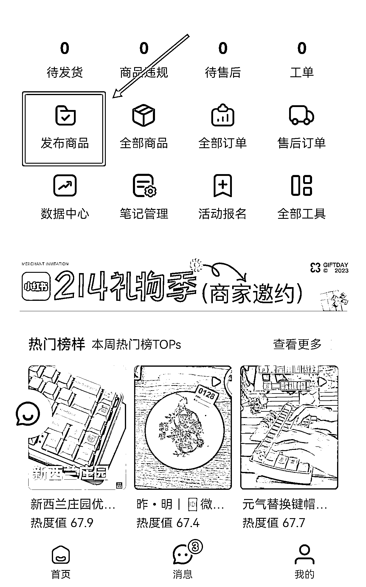
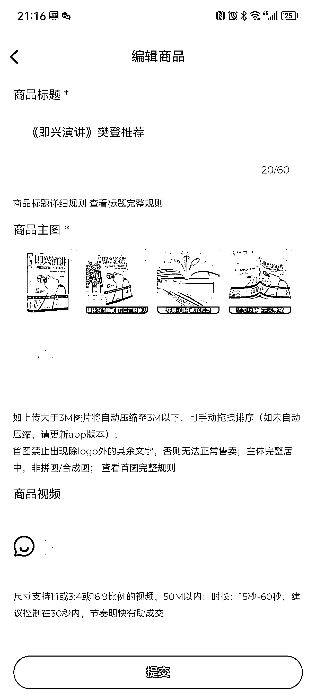
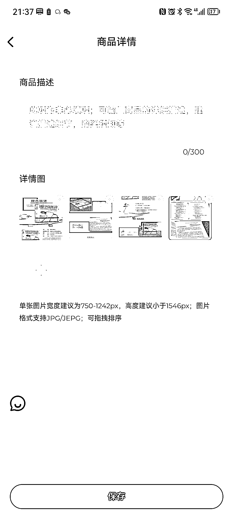
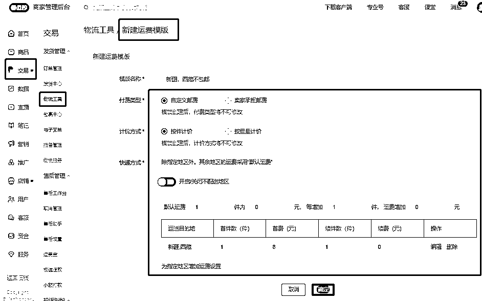

# 6.1 手机端发布商品

小红书 APP 和小红书商家版 APP 发布流程差不多，都是比较简单的，按操作流程来就可以。

下面是商品上架流程：

1）编辑商品

注意：

•商品标题和商品主图是必选的。

•商品主图官方有对规格做了限制，图片以清爽为主，不要加太多标注文字。

•如果商品首图不符合规格将上架失败，如果不符合首页推荐规则，不会在商场首页推荐。

2）设置商品类目

里面显示的就是个人店铺可以上架的类目，也可以用搜索框直接搜索，但是有些类目需要企业才能上，还要有相关资质。每个店铺类型，对应的可经营类目不同，具体可在小红书学习中心﹣规则中心﹣经营总览中查阅。

3）填写商品规格

商品规格是，如果一个商品里面有多种型号需要进行设置，如果只有一个不用管。

4）设置商品售价

根据你上架的商品进行设置。

5）设置库存数量

根据你上架的商品进行设置。

6）填写商品属性

根据你上架的商品进行设置。

7）填写商品详情

上传商品详情页的图片。

8）选择是否包邮

根据你上架的商品进行设置，可以选择是否包邮，系统目前默认两种：

•全国包邮；•偏远地区不包邮（偏远地区：新疆维吾尔自治区/西藏自治区/宁夏回族自治区/青海省/海南省/内蒙古自治区/甘肃省）

自己设置运费模板，可以选择运费的价格，可以设置不同地区（只能在电脑端商家后台设置）。

先选默认的运费价格，然后再设置特殊地区的价格，可以根据件数，也可以根据重量。

9）设置发货时间

发货时间可以自己进行设置，可以设置当天发货，24h 发货，48h 发货和预售发货。

上架完成后点立即发货就可以了。

小红书的审核是机器审核，速度非常快，如果没什么大问题，发布以后立马就上架上去了。

