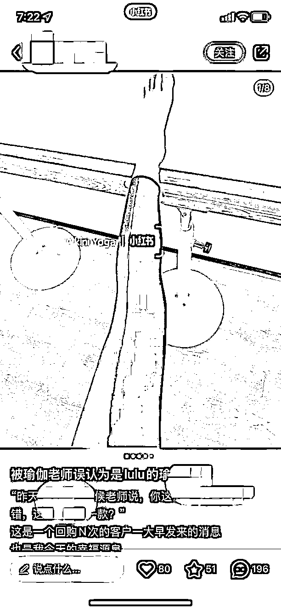
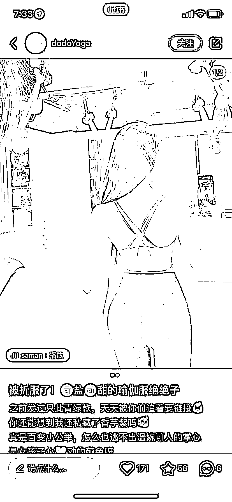

# 7.1.1 带货笔记展现形式 @杉木

内容展现形式非常重要，带货的关键在于如何找到真正能赚钱的笔记，再强调一遍，是能赚钱的笔记，而不是数据好的笔记。

我很喜欢马斯克的第一性原理模型：回溯事物本质，重新思考该怎么做。而找到真正能赚钱的笔记，并做对标，这就是我们做小红书的核心。

再例如电商的核心就是选品，做自媒体的核心就是内容。核心只占系统的 20%，但是解决了它就是解决了 80% 的问题。

在大家认知里出爆文＝能赚钱，这是错误的，比如我下面这篇笔记，数据上看只有 80 个点赞，绝对算不上数据好，但看评论区有快 200 多个直接问“怎么买？”“有链接么”的精准客户。

这一篇笔记可以带来至少 500 多精准流量，转化掉一半不成问题.

再强调一遍，我们做内容带货，终极目标不是为了出爆款，而是为了精准客户，不要把两者划等号。那些爆款如果带来不了精准流量，是完全没有任何意义的数字。

我们再来看一个下图的反例，同样是瑜伽服，这个也是企业账号，这篇笔记单看主图好像比上面举例的好，模特身材很棒，数据看起来也不错，点赞 171，但评论区只有 8 个评论，而且这 8 个都不是冲着产品来的。我注意了下这 8 个评论全是男的，冲啥大家应该也明白。。。

为什么会产生如此大的差距？

内容中，用户需求与痛点是否能准确把握是关键

拿上面举的两个例子说，瑜伽服的购买群体主要是女性。她们更关注的是瑜伽服的上身效果，包裹性如何？弹性如何？面料怎么样？等等内容；而不是你的模特白不白，屁股大不大，性感不性感，这是 LSP 关注的东西，所以做带货内容不要内容上用力过度。你只需要把你的产品卖点在内容中兼顾到就可以了，不要你觉得，要让用户觉得，这样才能吸引最精准的流量。

如何找到真正有价值的笔记作为对标？我们最应该关注的点在于：评论区，这是真正能反馈出用户对内容的态度的

用户点赞和收藏的动作只能说明：我认可，我喜欢，对我有用。而评论是带有明确目的性的，尤其是直接带货的内容，一般评论都是有强烈购买倾向的：我要买

来看下真正带货，能引流带货的笔记评论区长什么样：

如果是引流，知识付费咨询类，评论一半长这样：

