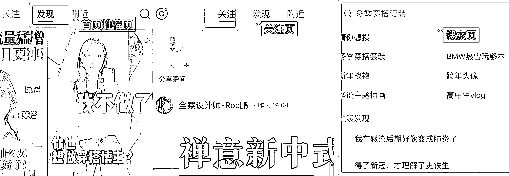
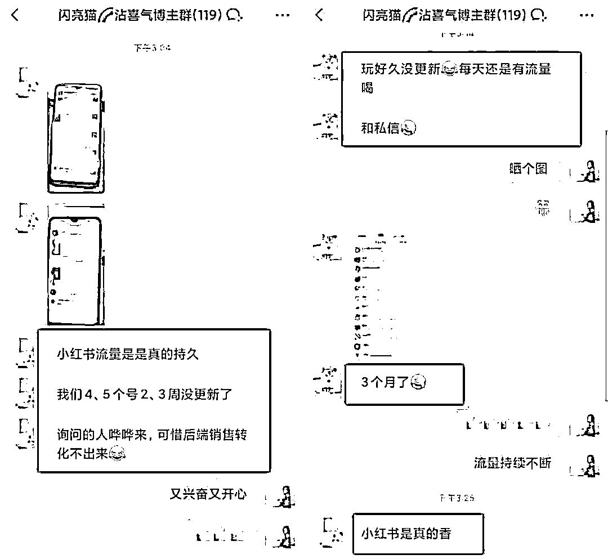

# 7.3.2 小红书 SEO 流量介绍

明白了底层逻辑，我们再来说说做小红书 SEO 的三个好处。

1）流量精准，用户转化率高

无论你是纯博主还是商家博主，关注的焦点不外乎两个：一是流量，二是变现。

流量又是变现的必要条件，所以如何拿捏流量，是每个博主的重要课题。

小红书最主要的流量入口有三个，首页推荐页、关注页和搜索页。

首页推荐页是默认打开的页面，所以这里的流量最大，同时竞争也最激烈，普通人上这个页面比较有难度，需要你内容足够优质。

还有一个是关注页，大家打开这个页面的频率普遍不高，尤其是关注的人数比较多时，你可能早就被挤没影了。

剩下还有一个搜索页，更适合普通人突围，因为只要你有一篇笔记靠前，就能给你整个账号带来持续不断的流量。

而且前面的底层逻辑我们也讲了，搜索流量来的用户属于主动种草型，大都带着明确目的来的，所以流量更精准，转化率也更高。

我们的很多账号，搜索端的粉丝来源都占了一半以上。

2）免费流量，不拿白不拿

通常来说，一篇笔记的自然推荐周期为 3-7 天左右，即使是爆款，随着时间的推移，系统给你在首页推荐页流量也会逐渐减少。

因为平台要留住用户，需要不断地补充新鲜的内容，如果你想在首页继续占位，只能通过广告投放去维持。

但是搜索流量不同，只要你的关键词铺对，而且笔记没有违规，你的笔记就可以一直被用户搜索到。

两三个月前，甚至一年前的笔记仍然能够给你带来用户。

这就相当于在平台放了一个个长期有效的广告，关键是还不收费，这么香的流量，不拿白不拿！

3）矩阵运营，占领赛道流量

我经常跟学员说，建议大家做矩阵号运营，尤其是商家博主。

原因有两点：

第一，降低账号风险，因为商家博主很多都有引流需求，而平台为了生态环境和自身利益考量，禁止一切导流。

那对有引流需求的博主来说，常在河边走，难免会湿鞋。违规还是小事，最怕的是账号被封，如果 all in 在一个账号上，风险系数太大了。

第二，多一个号就是多一个流量入口，同时也满足了用户的“比价”心理。

如果账号铺得够多，用户“货比三家”之后其实进的还是你的账号。

当然，前提是你要铺对关键词，如果用户搜不到你的笔记，那你有再多的账号也没有用。

所以，做小红书 SEO 很有必要。

