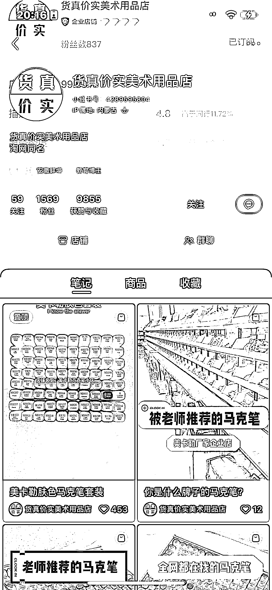
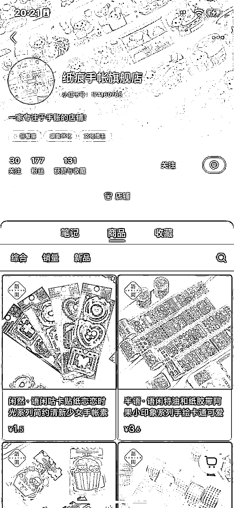

# 赛道九：文化办公

1） 案例信息

•账号名称：货真价实美术用品店

•店铺名称：货真价实美术用品的店

•案例链接：[`www.xiaohongshu.com/user/profile/606433f60000000001007f66?xhsshare=CopyLink&appuid=639a89460000000026012bb6&apptime=1676722581`](https://www.xiaohongshu.com/user/profile/606433f60000000001007f66?xhsshare=CopyLink&appuid=639a89460000000026012bb6&apptime=1676722581)

•案例选择原因：类似的兴趣班工具都可以采用多个笔或者文具合集的方式发视频或者图文

2） 流量来源

•内容形式•内容载体：图文+视频•内容分析：中央美院推荐的笔、全网都在找的笔、老师推荐的笔，都是非常有效的背书，拍摄形式简单，任何文具都可以复制和模仿

•流量渠道：搜索+发现页流量

•获取方法：美卡勒关键词，马克笔关键词，获得垂直流量

3） 变现产品

•形式：实物+视频为主

•品类：文具文创

•货源/渠道：自营或者代理商

•价格/销量：最高价格 700+，销售额在 10W 左右

4） 相似案例

