# **23**年**5**月小红书电商合集

整理日期：230530

 

生财周报来自某年费3000多的付费社群资源帖。

 

生财风向标系列单独用在线文档分享，地址见专属群q群消息。

一些帖子跳转飞书查阅，如需破解复制权限，见这篇文章：

解除复制限制！

往期的生财周报合集（含在线版和离线版），见专属群Q群文件和群公告。

希望大家有收获~

标题加了(精华)的表示精华贴，前面为截至今日的点赞数。

以下是目录，内容有些多。大家可以挑兴趣的内容阅读。

 

# 【目录】

**23**年**5**月小红书电商合集

【目录】

(精华帖)(337赞)6 天 12W+ 营业额的小红书店铺操作手册分享【详细教程**2**篇】

(295赞)我是如何通过小红书无货源电商三个月营收 50w 的？

【实操分享**7**篇】

(179赞)新手做小红书电商，1个月净利润 6W

(精华帖)(633赞)小红书电商单人月入 6k 实战分享

(精华帖)(1134赞)如何从0到1，做到月纯利30W+，玩转小红书店铺无货源？

(108赞)小红书电商起号实战分享

(精华帖)(438赞)地表最强的小红书无货源电商-保姆级教程

(精华帖)(179赞)小红书 25 条无货源电商玩法细节分享

(精华帖)(307赞)小红书无货源电商实战分享

【专项进阶**5**篇】

(精华帖)(505赞)0基础新手，用ChatGPT创作90分高质量小红书笔记，提高30倍神仙效率

(240赞)小红书店铺如何 1 个月做到月流水破 50W

(精华帖)(94赞)如何利用数据分析进行小红书电商选品？

(124赞)ChatGPT 带你玩转小红书，博主必备使用指南

(93赞)小红书无货源电商选品参考案例

【玩法进阶**5**篇】

(精华帖)(364赞)通过爆款笔记数据分析，我在 7 天内把一个账号做到了 60% 的爆文率

(精华帖)(1065赞)从小红书电商小白到两周单店变现 78W GMV，付费流打法实战单周投放 Roi 10+

(117赞)小红书电商两种实操玩法分享

(精华帖)(194赞)电商人用什么方法在小红书赚钱

(精华帖)(207赞)小红书店铺运营——有货源模式的玩法

【机会探讨**2**篇】

(73赞)聊聊小红书电商、IP，一起探讨未来的机会

(81赞)小红书电商机会

# **# ****(**精华帖**)(337**赞**)6 **天** 12W+ **营业额的小红书

# 店铺操作手册分享

作者：  阿成

日期：2023-05-24

前言

感谢亦仁老大，感谢生财有术！感谢各位圈友无私分享的宝贵经验和信息，加入生财几个月来，我仿佛获得了一股热血沸腾的力量！巨大的信息量让我的眼界不断扩展，各个领域的案例和经验。我的认知仿佛被点燃，以飞速的势头提升！更重要的是，有幸结识了一些大佬，毫不吝啬地分享给我关于项目和创业过程中的宝贵的建议。你们的帮助，我深表感激！

自我介绍一下，我叫阿成，目前聚焦在小红书电商领域，团队在去年11月份进入小红书电商赛道，团队目前运营着14家店铺，还在放大中。

简单的介绍一下操作手册：

手册的制作分为4个阶段，每一篇以及每一个阶段都是有关联性的，如未接触过小红书电商，按照流程从第一阶段开始即可，内容的详细程度是我带线下员工总结出来的，为了高效的带团队，所以做的比较细，基本团队里的小白过来边看边操作上手很快，如有您有看不懂的可以评论区问我，图片和文字较多，我拆分成了单独的文档，有一些文档里还有文档，使用过程中你可以点击你目前阶段遇到的问题，哪里不会点哪里即可，推荐电脑打开阅读

后续会单独更新一些玩法，可以先按照这四个阶段开个账号跑个流程先，这些步骤属于入门小红书的基本功！

希望此手册可以成为你起步小红书电商项目有力的助手！

具体文档请移步飞书：

https://q6m0ulsetk.feishu.cn/docx/E4f8dpgABo5BXzxK6RRcDFZSn5z评论区：

篮子🍀 : 链接灰了，可以重新编辑一下

阿成 : 不好意思，已经好了

谬误剑士 : 先收藏今晚学习

浅浅 : 感谢，超级详细的干货

至繁归于至简 : [抱拳]太感谢了，正在开始航海。顺便说下有两个链接好像不行了。

明天 : 感谢

黄柏宁 : 感谢分享啊

陆哲超 : 预测又是一篇精华帖

# 【详细教程**2**篇】

# **# ****(295**赞**)**我是如何通过小红书无货源电商三个

# 月营收** 50w **的？

作者：  卧龙先生

日期：2023-05-09

《我是如何通过小红书无货源电商三个月营收 50w 的？》

各位圈友大家好，我是卧龙，一个 00 后网创博主，今天就来拆解我是如何在三个月时间里通过小红书店铺变现 50w+。

本文将从基础-选品-货源-内容-流量-私域，这几个维度全方位的拆解小红书无货源电商这个项目，全程只讲实操，没有废话！！！

请移步飞书：（推荐电脑阅读）

本文目录：

一、基础篇

1.1 资金门槛：

1.1.1 保证金：

1.1.2 垫付资金：

1.1.3 工具费用：

1.2 开店：

1.2.1 个人店开通流程：

1.2.2 五种店铺的区别：

1.3 后台配置：

1.3.1 信息公示：

1.3.2 运费宝：

1.3.3 物流配置：

1.3.4 资金配置：

1.3.5 客服配置：

1.4 商品上架：

二、选品篇

2.1 赛道选择：

2.2 产品选择：

2.2.1 同行选品法：

2.2.2 电商爆款洗品法：

2.2.3 热度词选品法：

2.3 货源选择：

三、内容篇

3.1 素材：

3.1.1 素材要求：

3.1.2 素材处理：

3.2 文案：

3.2.1 如何收集优质笔记？

3.3 标题：

3.4 封面：

3.4.1 第一招：放大

3.4.2 第二招：制造视觉冲击力

3.4.3 第三招：色彩对比

3.4.4 第四招：色彩饱和度

3.4.5 第五招：增加色块

3.4.6 第六招：重复排列

3.5 笔记发布注意事项：

四、流量篇

4.1商城诚推荐流量：

4.2商城诚搜索流量：

4.3笔记推荐流量：

4.4笔记搜索流量：

4.4.1关建词选择：

4.4.2排名因素解析：

五、补充篇

5.1私域：

5.2笔记维护：

六、避坑篇

6.1.1笔记：

6.1.2客服：

6.1.2开店：

6.1.3发货：

6.1.4数据平台：

七、完结https://retjc9p6wl.feishu.cn/docx/AVx7dEXmpoRJazx3nH8cceBOnhd评论区：

老胡 : 怎么联系您？

Yoga : 三个月利润 50 万？

卧龙先生 : 营业额

卧龙先生 : 主页有哈

崔立明 : 牛逼

苓枫 : 容我喝口水先，太干了，收藏下来慢慢看[强]

Jok : [色]

贝影 : 请教个问题，想重新起号，原先已经开的号直接注销，然后店铺的定金会直接退吗

# 【实操分享**7**篇】

# **# ****(179**赞**)**新手做小红书电商，**1**个月净利润** 6W**

作者：  发条橙

日期：2023-05-23

《新手做小红书电商，1个月净利润6W》

大家好，我是发条

生财两年专业潜水员，一直旁观生财优秀大佬圈友的各种搞钱姿势和人生感悟。总觉得相比之下自惭形秽，没什么值得分享。直到今年终于在想和做之间突破了一些桎梏。

在开始之前例举一下自己最开始的一些困境

没有太专精的技能且只有业余时间可以利用

能听到很多平台的利好，判断不了哪个平台是风口

资金不足，不想做太大投入的事

详细的内容飞书见

https://zjvd064plw.feishu.cn/docx/VdVPdhexUooxK3xkTbMciwZenLg评论区：

清和 : 请问下单量爆了之后，是人工手动填单吗？还是有软件的呀，谢谢~ 王皛 : 也在做小红书店铺，能加您个微信请教下嘛？[愉快][抱拳]

发条橙 : ftc00000001

刘成 : 冲冲冲

朱较瘦 : 厉害，学习了

Jia : 昨天不是发了

农技师～茜妞 : 赞

星辰 : 中等认知陷阱，哈哈哈，这个词语用的好，有意思😂

# **# ****(**精华帖**)(633**赞**)**小红书电商单人月入** 6k **实战

# 分享

作者：  行一

日期：2023-05-19

大家好，我是行一，一个在路上的终身学习者，定位小红书引流私域教练，小红书电商两个月团队利**10w**＋，是珠宝私域直营团队背后的操盘手。

目前自己有两个团队，一个是流量直营团队，一个是电商直营团队，流量直营团队只要做高客单价的流量，命理和珠宝，命理最近停了，最近搞高端珠宝。电商直营团队搭建两个月，五个人团队纯利干到10w＋，目前还有很多号稳定出单，平均下来单人一个账号月入6k没问题。

电商2月中旬知晓，做第一个号爆单的周期就第五天，立马开始搭建团队，按流量团队来，扒素材剪辑一个部分，管理账号的客服一部分，建议一个人五个号以上，发货售后一部分，成功搭建属于自己直营团队。

接下来分享我的实战分享，为了方便大家阅读，请移步飞书直达：

https://wxm1taza3m.feishu.cn/docx/MZdRdgP8ToYBJ3xH2eacRtzgnrh?from=from_copylink

上面分享真诚利他无保留分享，希望对生财的圈友有帮助。

这里也告诉一下大家，我最早爆单的产品是内衣，内衣的同行号基本在我对标数据库里，我自己观察了一个月，做了很多数据对比。但内衣现在很内卷，可恶的同行还举报。

这里内衣的素材真的是自带流量，之前发视频就可以出单，现在同质化严重，需要找素材和测新的爆款封面。

现在我主要主攻女装，童装，女裤，女鞋，一些产品有自己的供应链资源，也从搬运开始向实拍出发，最近开始研究直播，投流。

看到生财的越分享越幸运，感谢生财这个平台，感谢@亦仁  大大，之前我的互联网创业史被加了精华

文章链接直达https://t.zsxq.com/0ejLRhZkc

这次分享迟了，因为最近赶上了考试，我目前还是本科大三在读，平时可以不听课搞钱但考试还要冲冲，还有最近几个账号爆单了，售后忙不过来，到现在才分享。

我的成长路径拆解可知，离不开生财，离不开生财的大佬哥哥姐姐们，感谢@梁靠谱  我谱姐姐带我进入生财，还给我规划了一下接下来的路线。感谢@拱卒  我人生第一位知遇的贵人，认知就是跟拱卒后面破的，永远记得拱卒说的那句话，有的人25岁就死了，我就不想25岁就死了，一直在努力的路上。

最近一直在刷大佬们的精华帖，收获很大，真的感谢大佬们的无私分享，特别昨天看了@付一  的帖子，我还在想我大一在干啥，就是这样，自己就是个学生，还要在生财的校园里多多学习。

真诚利他，无保留分享，希望能找到搭建小红书电商直营团队的大佬交流，能有可爱系，古风系童装女装的供应链，也欢迎有高客单价私域产品的资源对接，我愿意去搞流量合作。

让我们一起破认知，破信息，破圈层，一起生财有术！

评论区：

理白 : 牛！

任平生 : [强][强][强]

戴智慧 : 冲冲冲行一哥牛逼

陈小溪 : 行一哥🐮  🍺  ！！！

白小雾 : 学长牛批

张可粒 : 弟弟，牛！

1.为什么选择在小红书平台做店铺无货源？

2.为什么我们会深耕小红书店铺无货源？

3.操作小红书店铺无货源运营流程是怎样？

4.如何进行多平台，多技巧去定位？选品？定品？测品？优品？

5.以“内衣”为例，如何找对标，分析爆款，找到适合品类?

6.店铺商品爆了之后，如何批量发货？

7.当出现售后纠纷时，如何妥善解决，将损失最小化?

8.常见的小红书店铺无货源问题及解决方法。

坏脾气的小可爱 : 行一太强了吧！

行一 : 见帖者暴富

# **# ****(**精华帖**)(1134**赞**)**如何从**0**到**1**，做到月纯利

# **30W+**，玩转小红书店铺无货源？

作者：  宅男，（周恩俊）

日期：2023-05-11

哈喽，大家好~

平时在生财有术这里也收获到很多的认识，今天在这里，给大家分享一下，如何从0到1，做到月纯利30W+，玩转小红书店铺无货源，希望我的分享，对想做小红书店铺无货源的伙伴有所帮助；

主要围绕这几点内容去分享：

一个流量风口的出现，往往意味着赚钱商机，毕竟站在风口上，猪也能飞起来。

互联网赚钱的本质就是搞流量，有流量的地方就能搞定钱。

但如今淘宝不好做，短视频市场饱和，那么2023年的新流量风口究竟在哪里？

从目前的数据来看，毋庸置疑是月活跃2.6亿的小红书平台，这个平台目前正处于流量红利期。

而今年最火的风口项目，则是小红书店铺无货源，相信你也通过朋友圈，抖音，视频号，知乎，等多个平台，也看到了这个项目，那么这是一个怎样的项目，应该如何去做呢？

作为比较早一批入局小红书店铺无货源的我们，给大家分享一下我们的操作经验。

小红书是从去年年中开始，开始上线小红书店铺的，而我们是10月份左右就开始做这个小红书店铺无货源项目，并且在11月，12月就有了一定的结果，然后其中一个店铺，单店做了近100万的业绩。

给大家看看我们的实操数据，这是小红书商家版，这样的店铺，我们差不多有15个，这个不算最好的，算是前三。

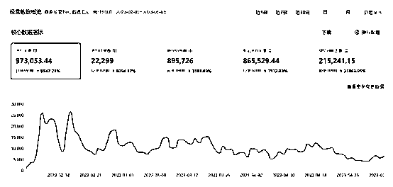 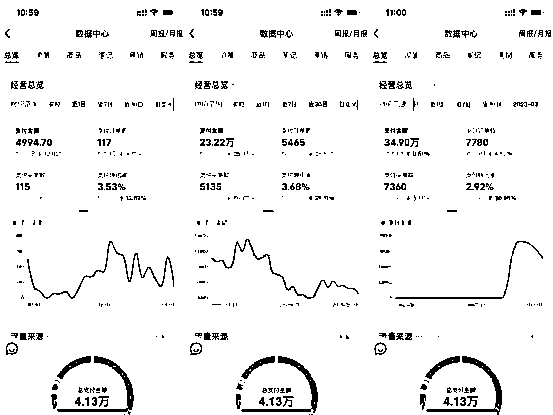

想要做好小红书店铺无货源，一定要先了解小红书的平台，以及了解它的底层运营逻辑，这样才能够让你更快上手。

**1.**为什么选择在小红书平台做店铺无货源？

**01.**小红书的月活跃用户达到**2.6**亿人，这就是一个巨大的流量池；

根据相关数据分析，小红书这2.6亿的用户，其中以90后，00后作为小红书主力军，女性用户占了70%以上，男性占了30%，以1到2线城市占了50%以上，这说明全国最具有消费潜力的人群都在上面，这也是为什么，在小红书上去种草，能出单的原因，本身人群质量比较高。

而且小红书是一个消费决策平台，像你去哪里玩，你会习惯看小红书攻略，看了攻略，去了那里，然后感觉还不错，无形中，就会更加信任小红书这个平台；

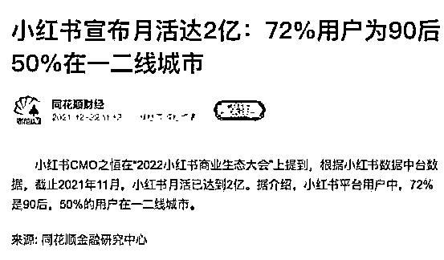

**02.**小红书店铺无货源是今年才火爆起来，今年也是平台重点扶持小红书的一年。

2023年是小红书店铺无货源项目的风口红利期，今年入场，绝对能够斩获先机，越往后入场，竞争越多，平台规则越完善，这就意味着，今年的红利会越来越缩水，想要深耕小红书店铺的个人，或者团队，都建议越早入场越好，现在入场小红书就犹如10年做淘宝电商一样，大部分的人能赚钱，基本上都是赚风口的钱，当风口来临时，一定要学会抓住风口，才能更好的分的一杯羹。

**03.**把握时机，玩转小红书店铺无货源？

** **

当你开了店铺之后，只需上架好产品，去批量铺种草笔记，不用投付费，就能够出单，这对比京东，淘宝这些老平台来说，无疑是最具有潜力和优势，淘宝店铺已经很饱和了，拼多多的店铺模式，一度受到平台的冲击，很多无货源商家都被冻结了款项，所以这一个平台也不轻松。

我们的小红书店铺无货源模式，则是1688发货的模式，也是一件代发的，前期平台规则还不完善，根据没有打击无货源这一种说法，我们从1688批发进货，完全合法合规，不需要有任何的顾虑。

**2.**为什么我们会深耕小红书店铺无货源？

目前，小红书也非常重视电商板块，这也是平台营收来源的板块之一。

以前，我们可能感觉没有那么明显，但是在今年，我们刷到商品的笔记比例明显增加，尤其是你关注或者在某个店铺购物之后，接下来刷小红书，基本都会优先把这个商品的内容推荐给你，说明小红书也是很重视电商这一块，有平台的支持，我们铺起来，就能够如鱼得水了。

关于小红书无货源店铺，我认为我也是有小小的发言权，最初从去年11月份开始测试，一直到现在，数据还在持续不断地往上走，就拿前面的单个店铺来举例子，冲了100W的业绩，这个业绩的利润接近40W，后续店铺会随着时间的推移，权重会越来越高，并且我们布局种草的关键词也会慢慢被系统收录，稳定排名，后续即使我们暂停去铺笔记，店铺还是会出单，这些订单是通过在小红书关键词搜索进来的人群购买的，或者是小红书商城推荐，也会有一些复购的用户。

所以小红书店铺无货源项目绝对是一个正规，长期并且有积累性的好项目。

在2023年，这也是最新的一个风口红利项目，这也是我们决定深耕小红书店铺无货源项目的原因之一。

**3.**操作小红书店铺无货源运营流程是怎样？

** **

**01.**这个小红书项目的运营流程是怎么样的呢？

** **

接下来，一步步给大家讲解；

小红书店铺无货源模式，简单来说就是我们先选定一个自己想做的类目，比如水果，萌宠，女性用品，女装，时尚用品，美妆，家居，生活百货，儿童玩具，母婴用品，鞋帽箱包，饰品，奢侈品，运动类目等，选定好了领域，就可以尝试去布局。

假设，你选择的类目是内衣，那么从我们可以直接在小红书搜索内衣二字，找一些销量高的同行，或者参考一些爆款笔记的类型，去选品上架到自己的店铺，上架好产品之后，就可以尝试去铺笔记了，铺了笔记出单之后，我们就可以去1688下单给客户发货，大概的流程就是这样。

**02.**小红书的店铺类型有哪些，怎么进行开店？

** **

目前，小红书的店铺类型有个人店，个体店，普通企业店，专卖店，旗舰店和跨境店铺。

开个人店是最简单的，不需要资质，只需要一张身份证就可以轻松开店，开个体店，需要一张营业执照辅助才能够开店，此外一张个体营业执照可以开三个小红书店铺，但是对应三个不同的小红书账号，其他的店铺，像普通企业店铺，专卖店，旗舰店这些都需要相应的营业资质才能够开店。

我们的小红书店铺无货源项目，目前主要做的店铺类型，就是个人店和个体店。这两个类型的店铺，目前来讲是成本最低，运营性价比最高的类型。普通企业店铺不是说不好，而是不适合批量铺，为什么呢，因为它的保证金比个体店和个人店要翻一倍，有些类目甚至更高，所以不适合批量，也不适合我们的模式。

**03.**小红书开店的具体流程是怎么样的？

** **

首先，用注册好的小红书账号，在我的界面，点击左上角的三条横杠，进入创作中心，在创作服务那里选择更多服务，在内容变现板块，选择开通店铺，然后按照提示去开通就可以了。

小红书开店无论是手机端，还是电脑端，都可以开店，如果选择电脑端开店，可以直接点击复制链接去电脑端开店然后就可以了。开店前，有个非常重要的细节，一定不能忽略了，那就是养号。

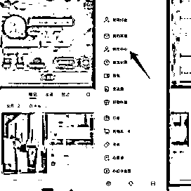 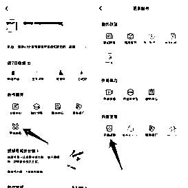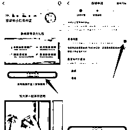 

**04.**小红书开店之前的养号流程？

** **

小红书账号开店前，我们一般建议先养2-3天，刷同领域的内容，或者模拟真实的用户去刷小红书，当然，我们不能单纯地刷，并且还要有点赞，评论和关注的动作，养了之后，第3天，我们就可以尝试发一篇笔记去测试流量了，这种笔记是纯干货分享，不带有任何广告的那种，发了笔记，如果浏览量在50左右，说明这个小红书账号是正常的，就可以马上开店了。

这里也给大家总结一下养号的具体流程：我们可以早中晚刷小红书，每天刷2-3个小时，同行账号，图文/视频都可以；

除此之外，还可以每天关注3-5个权威账号或对标账号都可以，对于喜欢的内容点赞+收藏+评论，养成一个真人操作状态。

小红书官方设置有自己的账号等级制度，可以依照官方的等级任务，依次完成来提升账号级别，这也是养号的步骤之一，建议是一机一卡一号，同一个设备不要频繁切换账号，不然会被系统检测到有问题。

我们之所以这样做，是为了避免账号异常带来的开店时间成本，通常情况下，你不测试就直接去开店了，如果这个账号本身是异常的，怎么发都没效果，后面想要注销重新开店，需要等上30天，那就不划算了，所以需要提前测试，这也是一个比较重要的细节。

**4.**如何进行多平台，多技巧去定位？选品？定品？测品？优品？

注册好店铺之后，那么怎么进行运营呢？

小红书店铺无货源模式的运营流程是怎么样的，首先第一步是选品上架测试，测试的阶段，我们又可以分为5个步骤。

定位：可以先根据自己的擅长或兴趣进行定品，看你有没有什么资源，资源是否符合小红书用户属性，如果符合，就可以去做，如果自有货源，也符合小红书用户属性，当然更可以去操作，在操作时，可以在小红书去看一下，有没有同行在卖，同行的店铺单品累计销量在1000以上，可以考虑去尝试，如果你没有这些资源，也没关系，就可以在拼多多这些平台进行选品，做无货源的模式。

** **

选品：我们主要是在拼多多，阿里巴巴，淘宝这些平台上面进行选择，以拼多多为例子，我们首先查看大类，比如大类有：内衣，食品，百货，水果，女装，母婴，电器，鞋包，手机，男装，家纺，美妆，饰品，家居，家装等一系列分类，假如我们选择了饰品这一个分类，那么看饰品分类前面那些高销量的产品，就拿某一个销量10W+的发圈来举例子，我们选中这一款发圈之后，就可以去小红书去看一下这一款品。

定品：通过搜索小红书搜索发圈，查看销量以及爆帖，如果这款产品，它在小红书的销量不错，那就是受众面还不错的产品，可以直接上架测试，上完架之后，我们可以模仿对标的同行去铺笔记，单个品，一天建议至少2条以上的笔记，也可以去通过找到小红书同行，看他的店铺有没有其它的延伸品，也可以去测试，一般我们的参考标准是这个品，累计出1000单以上或是他的种草帖子里面带的品，如：最近15天，笔记100以上点

赞，最近30天，500点赞，也可以通过小红书首页发现页去看，这些都可以作为我们定品的参考。

测品：上完产品之后，可以铺笔记，查看这个笔记的浏览量，商品访问量，甚至加购数，已经选择饰品作为主要的大类，那么针对饰品这一块，还有很多销量高并且不错的产品，我们就可以一天5-8款商品地去上架，上完架之后，每款商品一天铺2条以上的笔记，再观察后续的数据。

优品：前面测品上架完商品之后，一步步对商品和铺的笔记进行优化，商品的优化主要是看封面主图，次图和详情页的细节有没有做好，对商品的展示详不详细，笔记的优化指标主要是封面，文案（文案又分为标题和详情页），标签这三个大类。如果你的笔记内容主要是通过视频的形式去铺，那么就要多留意一下视频的封面吸不吸引，视频的BGM有没有节奏感，动感，卡点，符不符合我们要展示的场景，这些综合因素都要去考虑的，尤其是在你精心选好品上架之后，铺了笔记也没有效果的情况下，一定要多花时间去对比同行，看看同行的细节是怎么样的，然后一步步进行修改优化，特别是我们铺的种草笔记，一定要分析用户的痛点，如果是一个袜子的品类，是否透气，面料，弹力，舒服度等，把用户最关心的问题，在种草笔记中展现出来。

综合前面所讲的几个步骤，我们再拓展一下选品思路，选品这里，除了跨平台去参考淘宝、京东、拼多多和抖店的高销量产品之外，小红书平台本身也是可以参考。

小红书的人群分析中，女性用户占了70%以上，并且以90后，00后这些消费主力军为主，这些都是精准的消费人群，舍得花钱，有一定的经济基础，并且购买率也高，所以在小红书选品非常有必要的方法之一，由于小红书的女粉众多，所以在女性用品类目这一块，我们是可以进行深耕。

目前，我们测试有效果的店铺，大多数都是跟女性用品或者女性时尚用品相关的。比如，现在比较火的品类，内衣，内裤，美背，饰品（发圈，发夹，耳环，项链和手链等），美妆，防晒用品，厨房用品，家居好物等，大多数的购买人群，基本都是女性，几乎无一例外。

还有一个重要的选品细节，我们一定要学会去筛选年龄段，有个朋友上架了一款某个男明星爱豆的同款商品，笔记爆得多，但是转化率跟不上，这是什么原因呢，经过分析发现，过来看的都是这个男明星的迷妹，但是他们的年纪很小，18岁以下，没啥购买力，导致转化率低，后面我们又测试了厨房用品，因为小红书女性用户多，以90后，00后作为主力军，所以爆单得也快，我们选品也得考虑一下年龄段，不然辛辛苦苦铺的笔记都没有效果，那就太惋惜了；

**5.**以**“**内衣**”**为例，如何找对标，分析爆款，找到适合品类**?**

接下来，我们以内衣为例子，仔细讲解一下如何找对标同行，分析爆款，快速出单。首先，我们可以直接在小红书上面搜索内衣。

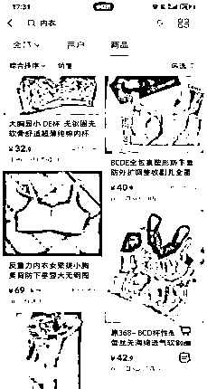

小红书搜索内衣，有三大栏目：全部，用户和商品，我们选择定到商品栏目，查看普通店铺（旗舰店不作为参考对标，参考旗舰店没有意义）的内衣销量，一般能够排得比较靠前的，都是销量高的商品，我们选择一款月销量10000+的产品，作为选品，先把款式截图下来，然后到拼多多或者淘宝选择图片识别，找到同一品类的产品，然后从这些渠道把商品的图片素材保存下来，淘宝和拼多多的商品图片可以直接保存，没有任何的水印，有了商品图片之后，我们就要准备商品详情页的素材了。

那么，商品的详情页怎么制作呢？

有两种方法，第一种我们可以截图其他店铺的然后搬运拼凑在一起，第二种方法就是我们自己花时间去制作，可以在稿定设计，图怪兽这些作图网站进行搜索模板，然后自己模仿这些商家进行简改，套用上面的模板修改，这种方法好是好，就是比较浪费时间，不如直接搬运来得快。

我们找好品除了自己编辑上架之外，我们还可以用蚂蚁搬家这一个工具去搬运，比如，我们选定了一款内衣作为选品，可以去淘宝和拼多多复制这一款产品的链接，然后用蚂蚁搬家一键复制上架，蚂蚁搬家目前支持很多渠道的平台进行铺货，像阿里巴巴，淘宝，拼多多，京东等等，都支持批量铺货，这种就适合前期想要简单粗暴，批量上货的玩法。

这款工作可以在小红书电脑端，商家后台服务市场就可以找到，前期可以先试用一下，后面觉得效果不错的话，再购买会员，费用也不多，单月费用29元，需要铺货可以尝试购买。不过，我们使用这个软件工具搬运上架的时候，一定要花时间去检查，不要一大堆搬运过来就直接违规了，要检查图片敏不敏感，详情页有没有上家的信息，有的话，会违规，上架不了的，尽量多花时间去检查和修改。

上架后，我们选定的这一款内衣之后，就需要开始铺笔记了，我们先在小红书搜索内衣这个词语，找到全部栏目，查看爆款笔记，是视频还是图文素材，如果是视频素材，我们也需要发布视频素材，视频素材可以多渠道获取2-3个进行混剪。

混剪的步骤也是很讲究的，不能简单改个滤镜，做一下分割，换个背景音乐就完事了，这种处理很有可能会违规，我们一般建议视频混剪。

正确的步骤是：首先进行分割，然后打乱顺序，打乱顺序之后，再进行转场特效处理，处理完转场之后，再加画中画，透明度可以设置为1左右，这就是一个比较完整的处理步骤。

经过这个步骤的处理，一般视频不会被系统检测出来是抄袭或者伪原创，这就是一个全新完整的视频。当然，别忘了检查视频是不是带了别人的水印，如果视频带了水印，一定要弄个贴纸挡住水印，或者想办法去除水印，否则带有水印也是会导致违规的。

切记，一定不能粗心大意，小红书视频的比例，官方最佳参考为16比9，或者9比16，支持MP4，MOV，MPV这三种格式。

说完视频素材的处理方法，我们接下来说一下图片的处理方法，图片在搬运过来时，一定要检查有没有水印，没有水印并且高清的图片，这种就是比较优质的素材。

在对图片伪原创时，我们的步骤参考是，先对图片加一层滤镜，简单调一下色彩的明艳度，别小看这个操作，改完之后，这就是一张全新的图片，改完之后，图片中假如带有一些没必要的元素，比如一些英文字符，或者一些中文描述，又或者是一些多余的元素，我们可以尝试用小红书消除笔这个功能消除掉，或者加一些符合图片境界的贴纸挡住，就可以了。

小红书图片的尺寸建议统一为1比1，3比4，4比3，其中3比4为最佳观感。

我们在小红书发笔记的时候，除了图片和视频素材，还有一个不可或缺的步骤，那就是写文案，文案分为标题，正文内容，还有笔记标签这3个部分。

以内衣为例子，文案我们也是参考爆款同行的去简改重组，标题建议控制在25个字以内，正文内容不限，但是不建议过长，只需简洁到位地进行描述，毕竟现在的人心太浮躁了，太长的文章内容估计会划走，没有耐心看完，所以只需简明扼要就可以了，标签这里的话，建议一定要重视，标签是获取关键词以及系统推送的流量分流的一个重要的指标，标签不能草草了事，打标签一定要认真，并且把关键词提炼到位。

**01.**笔记标题：

同行1：这内衣太会了!聚拢显大!还可以露背!!

同行2：九敏!!一穿上就有料!小胸的显大神器。

同行3：直接封神!小胸get到了圆润胸型。

重新组合标题：

这内衣太会了!一穿上就有料，小胸get到了圆润胸型

这个就是一个完整的标题，我们可以多参考同行的标题，然后杂糅重新组合成自己的标题。

**02.**笔记文案：

同行文案提取1：

这内衣太会了!聚拢显大!还可以露背!!

这件无痕内衣肉眼可见的高级!!

杯型炒鸡聚拢  轻轻松松就能穿出沟!

同行文案提取2：

九敏!!一穿上就有料!小胸的显大神器

我也不想一直夸啊!!

可是这内衣无痕又聚拢

这肉眼可见的圆圆胸  狠狠地爱住了

是上薄下厚1.8cm硬核升杯埃

轻松get蜜桃波波胸

加高的侧比集中聚拢更显胸

同行文案提取3：

直接封神!小胸get到了圆润胸型

最近买到的宝藏内衣，睡觉都可以穿，真的真的很舒服

再夸一次这个面料，软糯舒适，真正的云朵感，太爱啦

重新组合文案：

这内衣太会了!聚拢显大!还可以露背!!

这件无痕内衣肉眼可见的高级!!

我也不想一直夸啊!!

可是这内衣无痕又聚拢

这肉眼可见的圆圆胸  狠狠地爱住了

直接封神!小胸get到了圆润胸型

最近买到的宝藏内衣，睡觉都可以穿，真的真的很舒服

标签就不一一列举了，但是也要学会提取关键字眼，以及多花时间打标签，选择热门的标签话题，例如：

**03.**标签：

#小胸聚拢内衣 #舒服内衣推荐 #大胸显小 #小胸显大 #大胸显小内衣 #大胸内衣#聚拢内衣 #无痕内衣 #高级感内衣#舒适内衣推荐 #小胸聚拢内衣 #内衣 #舒适内衣

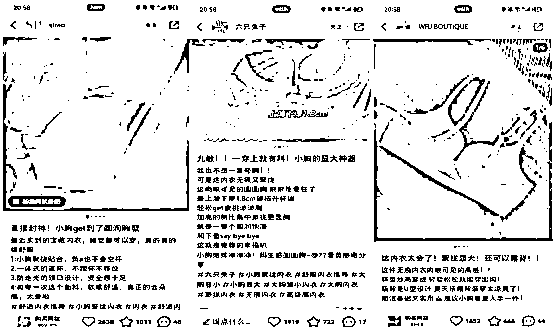

这就是文案内容和标签的杂糅，融汇了同行的亮点，组成新的又可圈可点，最重要的是这个方法节约了大量的时间，可以快速量产，如果都是自己原创去写，一个店铺假设上架了50款商品，一款商品铺2条笔记，那得铺100条笔记，那真的要到猴年马月才能够铺完，太浪费时间。在铺的过程中，就浪费了大量的时间成本，这样只会让同行更领先你一步。

前面以内衣为例子，讲解了视频素材，图片素材的获取和处理方法，同时也列举了文案标题，正文内容和标签的写法，这就是一个完整的笔记创作过程了。在举例子的时候，可能列举得比较详细，有些人可能会觉得复杂，但这其实一点也不复杂，最主要的是，我们在实操中，能省略的步骤就尽量省略，并不一定要每一条都这么细致，只要在这个基础上能够快速做出来，就足够了。

其实，在实操上架铺货中，除了举例子的这一款内衣，其他的款式，也是需要铺起来的，因为我们的店铺不可能只上架一款产品，这是很难做出效果的。前期一个人操作，建议至少都3-5个店铺，并且每个店铺上满50款以上的商品，每个品，一天起码2个以上的笔记去铺，对于测试出单的商品，更要花时间去重点铺，我们在执行的过程中，一定要多研究同行，学习举一反三，边做边优化，只有这样才能够快速地出单。

出单之后，我们做小红书店铺无货源这个项目才会更有信心，有了信心之后，干劲满满，才能轻松跨过后面的坎，真正通过小红书店铺无货源这个风口爆单，赚到属于自己的一笔营收。

**6.**店铺商品爆了之后，如何批量发货？

小红书店铺无货源运营的底层逻辑已经介绍完了，那么出单后的运营维护是怎么样的呢？举个例子，比如，你刚刚上架完一款商品，铺了2条笔记，第一天的效果不明显，第二天零零散散出了2单，你轻轻松松地在1688下单发货了，第三天笔记一下子就突然爆了150单，这个时候，你一定会手忙脚乱地发货，以及客服对接。超过48小时不发货，平台又会进行处罚，那么怎么办呢，我们可以用逸淘这个软件工具去批量下单。逸淘可以轻松实现一键下单，方便快捷，相关的使用教程，可以去淘宝，拼多多，小红书甚至闲鱼找找。这里我们就不展开讲解了，毕竟下单的步骤并不复杂，简单摸索一下，便可实现批量下单。

笔记爆了之后，来问的人也会增加，这个时候会加大我们的客服工作量，哪怕打字速度再快，当客户问的多，问的问题复杂的时候，也是回复不过来的，客服响应速度，系统也会对我们的店铺进行考核评分，所以这一块，我们也需要注意，工作时间能够快速响应的，就尽快去处理。当然，一些电商常用的话术，我们也是可以进行设置的，比如欢迎语和关键词自动回复。

**01.**欢迎语：

001.工作时间欢迎语：“亲，您好！在的哦，请问您看中本店的哪个宝贝了呢?我可以为您介绍的呢？”

002.非工作时间欢迎语：亲，您好！在售的宝贝都有货,喜欢它就赶紧下单带回家吧~客服离线中,若有疑问欢迎留言咨询，上线后会第一时间为您解答。

**02.**关键词自动回复：

001.发货时间：

“亲，24-48个小时左右发货的哦，这边亲放心，我们会尽快的给您安排发货的。”002.质量问题：

“亲，您好！请您放心，本店的产品在发货之前都是有做检查的，保证质量是没有问题的哦，如果您还是不放心的话，可以看看评价里面都是买家对我们家的肯定的。如果之后我们的宝贝还是出现了质量问题的话，本店是支持7天内无理由退货的哦。”

003.结束语：“非常感谢亲的惠顾，我们尽快为您安排发货，请您注意查收，不要忘记给我们好评哦！

设置好了欢迎语预计关键词自动回复，将会极大地方便我们的客服工作，提高工作效率，这样哪怕是客户深夜过来咨询，关键词自动回复解决了问题，一样不影响他们下单。

**7.**当出现售后纠纷时，如何妥善解决，将损失最小化**?**

过来人都知道，电商本身就是一个不容易的行业，有出单，有爆单，就有退货退款，商品不可能每一件都是完美无缺的，当出现售后问题，怎么处理，才能够将损失降到最小呢？一般有售后的情况，我们要按照承诺给买家售后，同时也要及时跟上家沟通，了解上家的退货退款流程，跟上家说明了缘由之后，上家提供退货地址，我们这边再发给客户，客户按照地址退回之后，有了退货单号，我们再补充填到上家那边，这样两边都退，我们也没有什么损失。如果上家有运费险，那就更加方便了。

小红书的商品也是可以开通运费险的，不过，它的名字在平台叫运费宝，在物流工具那里可以开通。一般像有尺寸的商品，比如女装，鞋子这些商品都建议开通，因为不开通的话，如果客户因为尺寸不合适要退货，但是他们那边又不想出运费的话，就比较麻烦了。开通了运费宝，其实在一定的程度上也是可以提高转化率的，或许别人就是看有运费险才放心大胆购买的。

顺便提一下这个7天无理由退货，可以在上架的时候，就进行选择是否支持支持七天无理由退货，一般像水果生鲜类或者农产品可以不选择7天无理由退货，但是像女装这种退货率本身就很高的，可以选择支持7天无理由退货，这种也是可以提高店铺转化率。

**8.**常见的小红书店铺无货源问题及解决方法。

我们讲解了小红书店铺无货源项目的运营流程以及售后流程之后，接下来再给大家讲解一下在实操中遇到的常见的几类问题，以及解决方法。

**01.**用个体营业执照注册店铺，显示实名被占用的情况，怎么解决？

一个个体营业执照可以注册3个小红书店铺，这3个小红书店铺分别对应3个不同的小红书账号，如果你已经用个体成功注册了第一个店铺，在注册第二和第三个店铺的时候，我们要先把这两个小红书账号升级成蓝V，缴纳600元的认证费用才可以继续开店，这样才不会显示实名被占用，那么怎么认证升级成蓝V呢？百度搜索小红书专业平台，用小红书账号登录进去，在右边专业号认证那边升级，升级完成之后，就可以继续开店了，不会显示实名被占用，第三个店铺也是这么操作。

**02.**淘宝和阿里巴巴的视频怎么无痕扒下来？

淘宝和阿里巴巴的视频可以用哈士奇这个插件扒下来，这个插件扒下来的素材是没有水印的，处理好了就可以使用。

**03.**小红书店铺一天建议上架几个商品，铺几条笔记？

如果你是个人操作的话，我们建议前期可以准备3-5个店铺，每个店铺可以测试不同的类目，单个店铺一天可以上架5-8款商品，一个商品一天可以铺2条以上的笔记，出单商品可以铺更多，一天至少铺20条以上的笔记，坚持一个月左右，一定会有不错的效果。

**04.**小红书平台扣税比例是多少？

小红书销售额过万以上，平台会扣除5%的佣金+0.7%的渠道费用。

**05.**小红书店铺没有流量，可以注销重新开店吗？

不建议轻易注销了小红书店铺，因为开了店铺之后，假设有订单这些，注销了，需要30天才能够重新开店，时间成本太高了，等上30天，太漫长了，等到花儿都谢了。那么没有流量，又不注销，这个时候我们要怎么办呢？建议直接换品类去重新测试，选定一个要做的类目，重新养号，重新上架铺笔记就可以了。

**06.**小红书的上家多，发货地址怎么填，退货地址怎么设置？

小红书店铺发货地址设置成自己的真实地址，退货地址可以设置成国外的地址，例如设置成美国纽约州，这样买家有售后退不了货，会主动联系我们要地址的，我们再针对不同的上家，把对应的上家地址发给他们就可以了。

**07.**小红书的运费模板怎么设置？

全国包邮，除了新疆，西藏，青海，内蒙古，甘肃，海南这些偏远地区，可以设置成一件运费30元，依次叠加。

**08.1688**批量拍单不会被限制或者封号吗？

肯定不会的，1688本身就是专业源头的批发渠道，下单越多，权重越高，不会被限制或者封号的。

这是我们运营小红书店铺无货源项目中，最常见的8个问题以及解决方法，再给大家分享一个小技巧，如果在实操中，我们再遇到一些自己没法解决的问题，可以直接咨询官方，小红书有商家版APP，还有小红书网页商家版，如果真的有些问题比较棘手，可以适当请教一下官方客服，官方客服还有人工在线的，之后转人工，就会有专人答复你。

小红书店铺无货源项目确实是2023年趋势最好的项目之一。

因为今年也是平台大力扶持电商的一年，如果你还在找合适的项目，或者是想找长期的项目，又或者是遇到团队工作室转型，那么小红书店铺无货源绝对是你的最佳选择。

只要你脚踏实地，认真执行，用心对标同行，并且参考模仿他们的爆品，不停地优化笔记，相信你也可以迅速出单。

在选品这一块，再悄悄给大家分享几个热门的品类，像目前大火的类目有：水果，防晒帽，墨镜，内衣，美背，饰品，以及厨房用品，我们这几个爆单的店铺，几乎都是这几个领域的，想做可以对标优秀同行花时间测试，希望我的分享能够给你带来帮助，谢谢。

写在最后，我想说的是~

这个世界能轻而易举、毫不费劲做到的，只有贫穷和衰老，其它的都需要努力。

任何项目都不容易，不只是小红书店铺无货源电商，其他项目亦是如此，我们一定要深入了解，摸透它的底层运营逻辑，才有可能把这个项目做好。

人生没有等出来的辉煌，只有闯出来的美丽。

敢于迈出去，其实你就已经成功了一半，共勉！

评论区：

周彦充 : 哈哈，男哥出品，必属精品

宅男，（周恩俊） : 感谢！

Ronronner : 太详细了吧[玫瑰]

宅男，（周恩俊） : 谢谢  对大家有帮助就好！

蔡晓华 : 感谢  男哥分享，有个问题请教一下，一个账号一天20条笔记，不会限流判定为营销号吗？有了解到说前期一天一条，后面稳定小眼睛一天最好不要超过3条。

Pu : 感谢分享[强]

宅男，（周恩俊） : 不会的  前提是你的笔记一定要伪原创或原创  而且小红书平台也比较扶持商家  毕竟是双方互利  如果一天发1到3条太慢了  时间成本太高了  红利项目  就要抓紧去做

宅男，（周恩俊） : 谢谢

# **# ****(108**赞**)**小红书电商起号实战分享

作者：  曜文

日期：2023-05-19

大家好我是曜文

本期内容结合众多圈友的反馈和问题写下起号实操内容

希望能够帮助到大家在实操中解决问题理解起号原理平台规则，在做小红书电商的过程中更容易上手

可以说目前小红书电商平台官网给了更大的扶持和流量的激励只要做用心操作运营在一周内出单找到爆款一点也不难！

本期内容围绕着几个内容来展开讲解

一、账号的搭建

二、款式的选择

三、店铺的运营

四、内容的输出

1.账号的搭建

经过我们几十家店铺的测试有的账号会存在一定的账号权重

权重低账号起号非常慢，发出去的数据都非常低，在几十以内，很多人发了上百篇笔记小眼睛不过百，明明是找的爆款内容一直发却看不到效果的主要原因就是这个，所以在刚开始的时候可以提升一下账号权重发一下互动笔记或者垂直领域热门的选题，不挂车来检测整体的账号权重情况。

一般，正常的账号都会在200+

权重高的账号互动笔记都会在1000+（如果是1000+的数据挂车出爆款的几率会特别高）那么如何解决这个问题呢？

01.发了3-4篇笔记浏览量都在几十直接注销掉重新注册

02.数据200+权重还不错可以再发送互动笔记来增加账号数据提升权重

03.不要多部手机连接一个WIFI会导致账号不垂直，很难刷出同类内容

检测账号权重后可以直接开通店铺选择类目，所以我们在开通店铺店铺的时候一定要重视这个情况关系着起号的周期。

另外，有很多人一上来就开始怼量不在乎账号权重的高低我们测了很多个账号店铺，出百单以上的几率几乎没有，倒是能出个十几单，但这不是我们做小红书电商的目的，也赚取不到多少收益。

2.款式的选择

要知道现在几乎非常多的账号都是靠几个爆款来实现日出百单

一条笔记带动千单的销量，然后在通过持续的输出笔记来实现持续的出单。

（我们近期很多店铺都是一篇笔记起号一周左右就实现1000+销量）

那么我们如何去选款呢？

小红书目前有一个定律：爆过的笔记他依然还会再爆

所以，能日出百单的店铺一定也是离不开选款，而不是你觉得不错的款式你就上架怼量发笔记

有几个维度：

01.找到小红书同类目爆款产品进行分析

02.找到同类目商城销量持续上涨产品分析

03.找到对标账号爆款笔记进行数据分析

04.同类目产品全网搜集数据其他平台爆小红书没有及时占位

还有一种方式就是看同行爆款笔记的评论区，也会发现很多用户需求，同行还没上架的产品我们抓住机会上架并且产出笔记来挂车。

一般，我们找到一款爆款在账号权重还可以的时候不会选择一天发10篇以上，而是会去测试选题，近期热门选题输出形式来测数据，数据好我们在根据选题去输出内容，这样才能捕捉爆款被平台推流。

三、店铺运营

有的人找到爆款了就拼命的怼量一天几十条，然而数据平平

主要原因是没有设置好店铺优惠券和做好输出风格和去重，我发现很多人及时找到爆款他的去重方式很一般直接拿图来通过剪映一键成片，这种方式在两个月前确实是可行，但是随着入场的人越来越多，这种方式的去重效果基本行不通了

所以，我们会进行添加画中画+滤镜+调整画面参数+镜像+抽帧+挡脸表情特效这样过原创的几率会很高，因为同爆款同行每天笔记产出的量是非常大的，需要精细化运营。

也有的一上来就要做高客单价，明明产品拿货9.9非要一上来就挂59.9，这样即使数据好出单的量也会非常低

我们的做法是：

设置单品优惠券来吸引用户下单

例如一款产品拿货是18元我们会定价58元然后设置单品优惠券35元，前期利润不高一旦被平台推流成为爆款日出百单后，取消优惠券，来获取更多利润

当然，  也可以设置新店开业福利设置很低的价格，几乎就2-3元的利润，后期再根据平台推流来取消优惠券

要知道，一篇爆款笔记会有很多互动，这都有助于我们账号的提升让平台继续推流，一旦数据持续上涨我们还会采取评论区互动的方式来提升转化率

例如：

发一张买家秀说自己入的好评感受，多个号互评

留一些有争议的话题让用户在评论区讨论

留店铺福利时间让用户抓紧下单以免错过

....

四、内容的输出

我之前有写过用GPT来批量生产文案

能够节省很多时间，这里可以再分享一个公式给大家帮助大家生产出更多优质的问题首先，我们需要搜集爆款标题

然后，搜集行业关键词

再找到产卖点和用户需求

通过以上方式可以得出公式：

产品卖点+爆款标题+关键词+小红书风格的表达方式

这样，不论是写标题或者是写内容都能写出不错的文案出来

总结：

通过以上方式来运营小红书起店的成功率非常高，也是我们近期起新店的一个操作方式当然，运营好店铺肯定是离不开每天花时间花精力的选款和做好内容输出，并且提升账号权重，只有用心的运营才能抓住爆款，让店铺能够起量。

1.提升权重

2.筛选爆款

3.产出内容

4.店铺福利

看到这里，如果对你有帮助，赶紧行动起来抓住这波红利吧~

有关于小红书店铺运营的方法也可以和我交流，知无不言，有问必答。

评论区：

麦S〰 : 感谢分享.

有个小问题想请教一下:2个月前开通的小红书账号,没有发过内容,但是有正常的浏览,点赞,评论.

现在直接开店铺会不会有影响?

曜文 : 一般不会，可以发一条笔记看看基础播放

饼干 : 新人觉得帮助很大！手动点赞~另外想请教一下，去重是指笔记的素材去重，还是指店铺的商品素材也需要去重呢？

二帮主 : 笔记

理想三旬 : 怎么加你

Penny : 你好，请问公司是开个人店还是企业店利弊在哪里?减肥减脂类商品一般挂什么类目需要什么资质?

曜文 : 这个类目我们没做，可以参考一下咱们的小红书航海手册或商家管理后台有详细的说明。

曜文 : 公司可以开企业店矩阵操作。

# **# ****(**精华帖**)(438**赞**)**地表最强的小红书无货源电

# 商**-**保姆级教程

作者：  蓝狐

日期：2023-03-30

大家好，我是蓝狐，感谢能在生财上分享。

小红书无货源电商项目，目前属于蓝海中的蓝海，小红书跟抖音不一样，本身是种草平台，种草行为本身就附带电商属性。

另外小红书的算法机制极为优质，它的去中心化算法，可以说是互联网平台里的翘楚，一篇笔记爆了之后，可以吃长尾流量。

最关键的是全程不用刷单，也不需要开车，全部都是自然免费流量。

可以说是除了保证金外和发货的成本，其他全部都是不用花钱，总的来说开店成本不高，投入低。

其次，小红书平台的人群较为优质，付费意识强，转化高。

平台90%用户是女性，30岁左右人群占比高达83%，都市女白领和职场女精英是主要群体。

从蓝狐第一次接触小红薯平台，就一直认为小红书平台，绝对是最适合普通人操作的。

它对新手非常友好，适合学生党，宝妈，所有的互联网小白，简单可复制，收益无上限！

今天蓝狐就对项目的实操步骤进行详细的拆解，干货满满，即便你是互联网小白，没有任何无货源经验，也能够看得懂。那我们开始吧！（长文警告）

下面是目录。

1、小红书无货源电商优势

2、开店准备

3、开店流程

4、店铺基础设置

5、选品（重点）

6、养号

7、找货源

8、店铺上品

9、笔记发布

10、产品优化

具体请查看飞书云：

https://n28vbku1px.feishu.cn/docx/JJQ0dfe6ho2qh7xalBXc3AG6nAb评论区：

北斗 : 请问下，女装退货率高嘛

小小羊 : 我看到退货地址的内容后下面就空白了，请问大家有这个情况吗

Yuti : 好全面，谢谢，我是个体户，可是开了第一家店后，第二家的法人认证那里说我的证件已经被认证过了。

华龙 : 我是小白，我只要2w+即可

钢哲 : 感谢大佬无私分享

雯雯 : 我一个号只上产品，不发笔记，几乎每天能出单，一个号天天发十几篇笔记，选品，连续发了一个月，只出了一单。选到爆款，没那么容易。同样的笔记，有些能爆，有些爆不了。

蓝狐 : 不是啊，刷新一下

蓝狐 : 具体情况具体分析呗

# **# ****(**精华帖**)(179**赞**)**小红书** 25 **条无货源电商玩法

# 细节分享

作者：  曜文

日期：2023-03-27

本月的实操细节分享又来了，直接看干货，避免少掉坑。

1.产品下单前期代发还是pdd有优势，而且风险比较低，不会亏钱，拿样基本也是免费因为有退货包运费，直接后台让快递来退，不花钱，前期可以鉴别质量的好坏而且你看了货去发会更有信心。

2.做退换率比较高的产品也不用慌，因为pdd退货包运费一单补贴7-10元，你完全不会亏，后台即使开运费险也是有的赚，即使退货率很高你也能赚点辛苦费，产品质量稳定就不走平台直接和商家对接一单能少10-15元，具体看品类。

3.选款一般是先看电商款在从小红书看种草不挂车笔记，如果不挂车笔记数据很棒这款一定要上，爆的几率会提高，而且长尾流量很久。

4.输出形式内容图文的长尾流量是比视频长的，视频的曝光会比较高，但是转化没有图文高，图文可能这个月发的内容到下个月还有人通过本月发的链接去下单。

5.完全可以先制作图文，再把图文生成内容，这样下来能多出10个左右的素材，可以开新号发视频，获取更多流量。

6.账号垂直度非常重要，账号不垂直，流量是很低的，具体可以看看自己主页推荐的都是什么，换位思考一下，你的主页推荐的是不是有很多新内容，那你的账号发也一样会精准的推送给经常看到用户。

7.出单之后客户收货之后，可以准备10-20条话术，通过私信发给对方，把对方沉淀到私域来，即使你以后不开店了你会发现你的私域也有很多人要找你买东西，可以说是一笔巨大的财富。

8.小红书的女性喜欢内容精致图片精致店铺精致，所以多花点心思在每一条内容上，不要疯狂怼量，拿样就相当于是在拼几率，可以在自己的商品标题上加上你的IP或者店铺名。

9.淘宝的店铺会比较精致，可以考虑从淘宝搬家在去加入自己制作的店铺介绍在第一张图提升转化率，淘宝一般都是加利润的即使不改价也能有利润。

10.想要利润高还是得有自己的一个原创品牌，这里不是让你去申请品牌，而是你要想一个IP或者人设，经常出现在粉丝的视野里，他们会觉得你和其他店铺不一样从而提升转化率。

11.本月更新了个人店不交1000保证金无法开通微信支付，总有人说不想交保证金什么的，你不交后期是提不了现的，想要玩玩的话也可以先不交，个人后台显示还是zfb支付的多。

12.真人出镜加口播加展示后面会成为带货的主流，目前还在野蛮生长阶段，所以混剪拼图还是能拿到流量，还处于红利期不用担心。

13.长期看好平台电商的可以布局蓝海细分产品了，虽然前期销量不高，但是你可以占领关键词把细分垂直的店铺都给占领了。

14.店铺销量和粉丝数没有关系，即使你只有5个粉丝照样也能卖出百单，长久的运营账号可以适当发干货植入产品，发教程植入产品，可以IP人设带货。

15.账号垂直了会推送很多近期正在火的内容或者垂直内容数据较为好的内容，可以参考选品，抓住爆点。

16.如果非要推荐几个类目，我的建议是细分领域的女装，精致生活的女鞋，国风的饰品，提升生活质量的产品。

17.不用太纠结货源，直接在电商平台多比较多找几个商家大胆问就行了，非要找到高质量的好货黄花菜都凉了，要么别人看不上你，要么别人不给你代发。

18.兼职代发还是能提高品牌知名度和店铺曝光度，兼职可以直接在小红书这个领域里面的评论找，做长尾关键词优化非常有帮助。

19.个人开店做量还是做精，我建议还是做精，  把领域里面的产品都做到排名搞钱，每天出单会比较香，因为目前大多数还是靠笔记出单，还没有店铺标题优化意识。

20.刚开始开店设置电偶优惠券自动全网投放对比新店出单帮助会比较大。

21.要把商家的微信加来私域即使不合作也能从对方的朋友圈了解到当季的新品和爆款对于选品有比较大的帮助

22.少研究什么爆款起店什么日出百单踏踏实实的每天选款找素材发内容是最实在的也能积累更多实战经验研究旁门左道反而会浪费无数的精力。

23.每天复盘记录数据优化文案和选款是一个非常好的习惯随缘无上进心不容易做起来。

24.直播带货目前流量虽然不大但是平台内容电商扶持起来之后下一个肯定是直播带货，所以真人带货还是未来的趋势。

25.GPT目前依然是一个节省时间和精力的工具，努力的训练让它成为一个好帮手吧。

总结：

内容电商的重点还是在于内容，不断的提升自己的文案能力和创作能力不管你在做哪个平台都是加分项，然后流程化矩阵化才能在自己积累财富的同时增长技能见识。

好了，以上就是本篇的内容

如果对你有帮助记得点赞收藏

评论区：

梁潆月 : 先赞后看~

二帮主 : 一般什么话术引流到v比较好？手动发还是软件

三千里 : 兼职代发是什么意思？

重楼 : 兼职代发是怎么个形式？大佬求分享下

重楼 : 我把问题具体点：

1、兼职代发，是让他们以“好物分享”的形式发笔记，最后通过@的形式导流到我的店铺吗？

2、兼职代发在评论区找人，是指也对相应产品感兴趣（比如那些求链接）的人吗？一般

是怎么个价格？

希望能和大佬交流下，最近在研究小红书无货源店铺，感谢zhs199504 Mason : 大佬，给个联系方式，向您请教[抱拳]

亦仁 : 感谢分享，已加精华。

Zcy : 关于货源+选品+运营的很不错的总结

# **# ****(**精华帖**)(307**赞**)**小红书无货源电商实战分享

作者：  曜文

日期：2023-02-09

大家好，我是曜文

最近实操了小红书电商取得了不错的成绩所以就马上来和大家分享小红书电商无货源的实操流程

目前来讲小红书电商还在发展中，但在发展中提前入局往往能够得到平台的扶持和流量的激励

我在上个月底开始每天实测小红书电商的数据和内容，近期也开始每个店铺都持续的在出单，所以，把我的经验来分享给大家让大家少掉坑，让想要做小红书的宝子能够通过这篇内容减少时间成本和试错成本。

如果有做过闲鱼无货源电商的你那么你看完这篇内容你会觉得我得赶紧入局

如果你对于无货源电商还不是那么理解相信看完这篇内容你会有所启发

先和大家聊聊无货源是什么

无货源指的是：

你可以这么理解为无货源从A平台的产品拿到B平台卖赚个差价。

你不需要发货你只需要找到靠谱的商家帮你代发产品，最为显著的供货平台就是拼夕夕，因为最具有价格优势，所以在这几年非常多的无货源商家基本都是从拼夕夕下单找供应链，当然如果有好的供应链的老板也欢迎和我对接。

当然如果你本身就具有货源的源头拥有价格优势那也是非常适合小红书电商的，就比如我有学生他是做滋补产品的在本地有档口价格有优势，他直接在小红书上架产品，就能直接出单。

接下来方便大家阅读我分为几个板块详细和大家聊聊实操

# 一、小红书开店实操

小红书店铺一个身份证可以开通一个个人店，一个营业执照可以认证3个专业号，一个身份证能开通3家店铺。

个人店不需要认证费，个体店需要600元的专业号认证再开店铺

如果刚接触小红书店铺建议先从个人店开始，因为目前个人店不用交保证金，你需要提现的时候才需要交保证金，也就是你能通过小红书店铺变现之后你再去交这个保证金，如果你变现不了就不用交，以前是先交保证金才能顺利开店，所以现在平台也是很扶持电商这块业务。

值得注意的是：

个人店开通时昵称不能和其他已经开过个人店的用户重复，如果重复后改名还重复那只能等七天在申请

想要做好小红书那必须得了解商品的流量从哪里来

1.笔记流量

笔记流量最大的曝光来源于首页的推荐，和用户通过关键词的搜索

所以想要做好小红书曝光需要做好吸引人的图片和标题关键词的布局以及文案的引导如图：

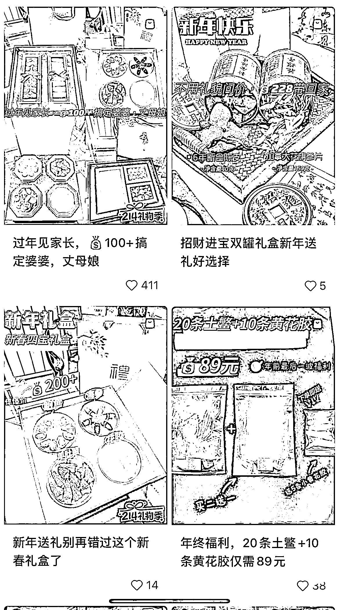

如果是做垂直产品可以布局长尾关键词来让自己的笔记和店铺都有源源不断的流量这个在小红书的实战手册中有讲到，对于小红书不规则不了解的宝子可以深入阅读2.商城曝光

产品链接通过后台上架之后会出现在商城中，用户通过关键词搜索会进入到商品页面，关键词被用户搜到

主图吸引用户点击就会有购买的行为，小红书根据用户习惯来跳转入口，如果一个用户喜欢经常在小红书购物

则搜索关键词就会跳转到商品页面，如果不是经常看商城的产品则会跳转到笔记页面。

如图：

通过后台小红书参与活动提升排名

注：小红书新店铺本身就有4.5分的店铺分能直接参加活动

3.薯条曝光

通过参与新店成长任务来获得商品流量卡，获得之后可直接用于薯条的营销推广投放

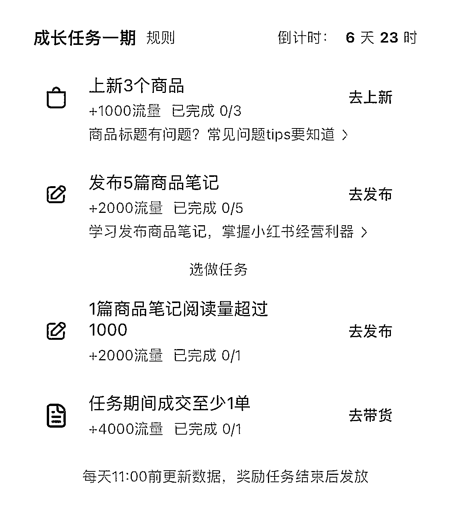

了解了流量来源之后就可以上架产品了，如果做的无货源可以直接从电商平台直接搬运过来很多工具都有免费的试用

小红书的后台有着电商的工具可以使用，同步过来然后去后台改价

 

具体步骤：

1.注册小红书店铺

2.选择要做的垂直产品找对标账号挖掘爆款笔记

3.上架产品，通过货源平台找高清图片链接

4.参与小红书营销活动

5.开始输出笔记，建议一天2-3篇

# 二、小红书选品实操

目前小红书平台还处于高溢价阶段拼夕夕几块钱的产品能在小红书卖十几二十几块有一定的价格差所以操作空间很大

例如：

那如何选品呢？

1.其他平台火过的产品

如果在其他平台有选品经验并且已经能够跑通销售，那么拿来小红书开店一定也是适合的，比如我们在操作闲鱼无货源的时候把以往的产品拿来小红书销售也照样能出单。

2.热点周边及时选品

比如，近期热门的电视剧就带动了很多周边，比如同款的穿搭，同款的饰品同款的鞋子等等..一系列的产品。

3.细分垂直领域选品

比如，我卖母婴产品这个范围很大，要输出内容的范围很广，如果做合集推荐不容易出单，我换成婴儿推车这个就是细分领域出单就容易了。

4.小红书用户属性热门赛道

小红书目前热门的赛道有：饰品、服装、家居、美妆、护肤、食品...

女性喜欢什么只要研究一下就可以了，如果还不知道就打开5118数据平台搜索一下吧！

而且做女性赛道产品基本利润都会比较高可以选择一单50以上一天出个几单偶尔还会爆单美滋滋

# 三、小红书店铺运营

小红书开店账号垂直度很重要

不要当天注册就开始直接发笔记建议养号2-3天先把产品选好的产品上架之后在开始发笔记

顺序是这样的：开店-上架-发内容

小红书输出形式很重要

如果选择视频尽量自己拍视频，目前也是视频展示的流量会比较大，如果是混剪的话过不了薯条

只能靠系统自动去推流，最好是原创，一般商家也很愿意提供样品你提供运费就可以了有了实物你可以拍几十上百个视频这样内容输出就不会断了

小红书上架后台的成长任务一定要做的因为会送推广券相当于可以不花钱就投薯条获得更大的流量和爆文的几率

我推广都是只花1薯币

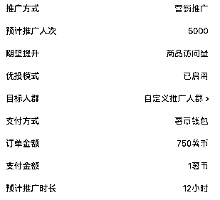

这也是平台送了流量不要白不要，而且前期用的好能爆单，可以这样找到爆款内容参考，找到超越爆款内容的细节或者结合热点细节，一直用免费的薯条券推这个笔记（爆款内容就是那种评论区都是问怎么买的）

一般我的推广会选择12-24小时，选择垂直类目选择女性根据店铺产品属性选择人群，如果选择只能投放的话没2小时就消耗光了，这时候没出单推广基本白给。

我每天会花上1个小时的时间选品找近期爆款笔记然后建立素材库

会花半个小时时间比价改价优化标题上架产品

再花半个小时查看其他平台的商品和近期热点

花1-2个小时写笔记优化内容

现在已经开了五家店给助理在运营

有几个赛道：服装、潮玩、家居、数码配件、鞋子

# 四、小红书批量引流

我把我做私域的思路搬过来做小红书店铺

找兼职来发笔记然后往店铺导流实现店铺的曝光和关键词的优化

只要用户搜索某个关键词看到的都是在推荐我的店铺

每天文案兼职产出文案通过助理分发给代发兼职并在笔记当中推荐店铺评论引导另外在成交之后会做一个动作就是往自己的私域去导流做售后，因为平台的流量如果不做到私域

复购的几率很低，所以这也是我做小红书店铺的原因通过更大的曝光来壮大我的私域流量池

至于，如何找兼职如何找代发，我之前有说过这里就不再详细描述。

还可以建立选品库与合伙人批量开店

# 五、小红书建议思考

小红书电商目前来讲很多电商头部都还没大量的进入，所以竞争不是太激烈，可以参考2年前的闲鱼无货源

上架一个产品根本不需要维护就能出单，小红书目前的情况也是如此，门槛相对比较低，能够提升自己对于图片的网感和文案的能力。

如果能在平台给到扶持的时候入局实战，一定会得到不错的反馈。

如今电商平台都在往内容种草的方式发展，而小红书本身就是一个内容种草平台，用户的信任度会更高质量也会更高。

但是我认为一个动作始终要做，就是往自己的私域流量池来积累客户，我发现很多人做电商做了2-3年可能店铺是红利过了也可能是竞争更激烈了，店铺不出单就断了自己收入来源了，那如果把客户做到私域用心的去维护客户能够裂变不说还能一直获得收入，所以我也一直坚持在私域这个领域一做就是8年。

以上，就是关于小红书无货源的实操分享，有问题欢迎在评论留言

欢迎交流，一起进步！

评论区：

重楼 : 看后面提到的批量玩法，有点像以前的拼夕夕店群玩法。

郑经 : 感谢分享

亦仁 : 感谢分享，已加精华。

亦仁 : 建议再补充一些具体的看见到的案例。

曜文 : 就是类似店群

曜文 : 感谢亦仁哥

曜文 : 这就整理

招财喵 : 微信号能发下吗？交流学习

# 【专项进阶**5**篇】

# **# ****(**精华帖**)(505**赞**)0**基础新手，用**ChatGPT**创作

# **90**分高质量小红书笔记，提高**30**倍神仙效率

作者：  比比先森°

日期：2023-05-19

《0基础新手，用ChatGPT创作90分高质量小红书笔记，提高30倍神仙效率！》大家好，见贴欢喜，我是生财圈友比比先森，专注小红书IP孵化和高客单引流变现，也是五月份小红书航海教练一员。

很多新手在做小红书时遇到的第一个痛点，不是变现，而是创作的时间成本。为此我结合小红书运营逻辑，提炼出一套新手用ChatGPT写笔记的引导模板思路，尤其适合0基础新手进行小红书内容创作，翻倍提高创作效率。

为方便大家阅读，请移步飞书直达：

最后，要先感谢  大大，生财有术给我们提供一个很棒的氛围环境，作为新圈友的我，真的受到很大的积极影响和强烈鼓舞，以至于下场实践ChatGPT后的第一想法居然是：到时要好好写一篇长文帖和生财圈友们完整分享！而且我做到了。

还要感谢一直陪伴我成长，帮我设计优化商业模式的宝  ，是你给了我莫大的信心和勇气，让我坚定地走在这条赛道上；感谢手把手帮我改帖子，带领我加入生财的贵人  ，是你不断告诉我，我的内容和专业是有价值的，是值得被更多人看见的；感谢给了我许多引领性思路的  ，让我把高客单价引流这个生态位，做深做透。也要感谢我的每一名学员和同行者们，对我的信任，比比必不辜负。

越分享，越收获，越感恩，越看见，让我们一起日拱一卒，功不唐捐，一起生财有术！

https://qdrlbziuml.feishu.cn/docx/E28CdvbzAoulmxxLpoZcchBinhm评论区：

草木青 : 棒的，

度 : 太棒了

AI训练师小凡 : 比老师[强][强][强]

清一 : 先码住再阅读！！

理白 : 我只看向他眼底，而千万人欢呼什么我不在意。

戴智慧 : 哈哈哈哈哈今天一直在吃糖

珊瑚 : 收藏拜读

AI洁妈 : 比比好棒👍

# **# ****(240**赞**)**小红书店铺如何** 1 **个月做到月流水破** **

# **50W**

作者： Jessy👾

日期：2023-05-04

大家好，我是佳希Jessy，从2020年开始做电商，淘宝、抖音、视频号都有开店，专注在女装和饰品类目。

去年10月开始在小红书开店，不到一个月时间，2个员工把店铺月流水做到破50w。目前公司主要精力都转移到了做小红书电商上。

不同于淘宝/拼多多大部分来自精准的搜索流量，或是抖音/视频号的庞大的直播兴趣流量，小红书绝大部分的流量都来自于笔记。

可以看到我们后台数据，“笔记支付金额”占到了总支付金额的85%，相当于用户仅仅只是花了不到1分钟时间看了一篇笔记就直接付款了，转化率非常高！

详细内容可以下方文档查看哦：

3月8日《小红书店铺如何1个月做到月流水破50w+》 - 飞书云文档 ( feishu.cn )评论区：

帮主 : 1）符合小红书的真实风格。2）水军运营好笔记、评论。3）限时折扣。。。阿妈，我要发达了！

国昌 : 圈友们太棒了，看完一篇马上就有圈友给续上新的一篇。[拥抱][拥抱][拥抱] 万青 : 您好！大学生水群资源怎么联系呀

dxy : 准备试水，lz可以介绍一下水军群资源吗！

雄 : 水军群能否进一下

张武 : 厉害，学习了

明光 : 同问水菌群怎么认识一下

biubiu六月 : 想问一下你的女装退货率现在多少

# **# ****(**精华帖**)(94**赞**)**如何利用数据分析进行小红书

# 电商选品？

作者：  沐风

日期：2023-04-12

《如何利用数据分析进行小红书电商选品？》

大家好，我是沐风，最近应该有很多同学在尝试做小红书电商项目，对于大多数自身没有货源，而且是刚开始接触电商的同学来讲，可能一开始都会面临一个问题：面临这么多行业类目和品类，到底该如何进行选择呢？

这个时候，稍微有点经验的同学可能都会想到借助一些类似蝉小红、新红这样的小红书三方数据平台来辅助自己选品，而不是全凭自己的感觉，毕竟感觉可能会有偏差，但是数据不会骗人。不过，获取数据只是第一步，更重要的是，我们该如何对这些数据进行分析，并利用它们来辅助我们选择行业类目和品类呢？这里，我就给大家分享一下我的一些思路和探索。

为了提升阅读体验，请大家移步飞书阅读：

https://rlp3cigezs.feishu.cn/docx/IwUDdGvHhojaL2xwtUzc6YyZnHh评论区：

witon : 很赞  不过有个点没看太懂：综合评分中  为什么是 30-需求排名和电商价值排名  沐风 : 30就是一个常数值，其实设置成多少都可以，总的行业类目是29，所以我就取了个30，减去需求排名和电商价值排名是为了评分，排名越靠前，得分就越高，例如，排名第1，（30-排名）之后，分值就越高，大概这个逻辑。

witon : 学习了  方便加VX链接嘛

沐风 : 这里不能发微信，私信吧

若昧平生 : 会编程、懂经营、文章写得还好[强]

沐风 : 圈友过奖了  😄，我也在不断学习摸索中

财女小马达 : 全能

沐风 : 过奖过奖

# **# ****(124**赞**)ChatGPT **带你玩转小红书，博主必备

# 使用指南

作者：  孙哲

日期：2023-04-04

如何利用chatGPT做小红书，有哪些模板可以套用，整理了一份关于小红书各类型博主使用chatGPT指南。

其他领域暂且不谈，就光在小红书做内容来说，使用chatGPT绝对会让我们的工作效率提高很多，也会让我们通过chatGPT提高自己的搞钱速度。

这篇内容，是我利用chatGPT一起完成的，做出这样一篇内容，仅仅用了半天时间，如果没有chatGPT，这篇内容可能需要几天甚至几个月时间才能够完成，但是用了chatGPT之后，时间缩短了N倍，这样的工作效率你喜欢吗？

总的来说，利用ChatGPT写文案是一种创新的方式，如果能够善加利用，ChatGPT将成为生活方式博主的得力助手，但是需要注意的是，生成的文案有时候可能不够准确，需要经过人工筛选和修改，保证文案的质量和可读性。

https://pii2q77orm.feishu.cn/docx/PU9Id4IPMoZ3QdxLzZUcEPBRnWO评论区：

暂无评论

# **# ****(93**赞**)**小红书无货源电商选品参考案例

作者：  曜文

日期：2023-02-13

大家好，我是曜文

上周分享了小红书无货源实战流程

发现很多人对选品感兴趣所以就花了一天的时间整理了部分案例加选品参考和输出内容的方式，希望能对大家有所帮助。

小红书能卖的品实在是太多了但目前基本是以女性小孩为主的产品

目前在小红书做电商，你不需要很多的粉丝

你可能0粉就能出单

更不需要去花大量的心思装修店铺

只需要选好产品，上架产品，布局好关键词，每天输出内容就可以出单

由于内容涉及多图片加视频，所以整理到飞书分享：

https://t.zsxq.com/0bfVshrgs https://go6xq64elg.feishu.cn/docx/JmfRdTyKZouw6nx3xI7cL4hUnpb

评论区：

卢志敏 : 哈哈，看完思路开阔了许多！！！

Liu : 怎么联系

水深无形 : 大佬朋友圈方便围观吗？  最近在操作小红书

曜文 : 欢迎！

Yummy : 想围观朋友圈可以吗？怎么联系你呀~

莫等闲 : 大佬  怎么联系您

斐娜 : 可以加VX交流吗大佬？

顽石上的温度 : 大佬可以加V吗？

# 【玩法进阶**5**篇】

# **# ****(**精华帖**)(364**赞**)**通过爆款笔记数据分析，我

# 在** 7 **天内把一个账号做到了** 60% **的爆文率

作者：  韩北樱

日期：2023-03-30

做小红书不知道怎么产出爆款？花了很多精力拆解对标模仿却没有任何效果？好不容易小爆一篇流量却不稳定？面对这种情况我们应该怎么办？

其实想要做到更好的爆文效果很简单，就是利用内容数据工具找到对标爆款账号，分析爆文笔记的标题、内容、数据，找出能够爆文的共性然后进行模仿创作。

我在小红书做过护肤、教育等多个赛道的账号运营，其中最成功的教育赛道在 7 天内发布 5 篇笔记，就有 3 篇达到千赞的爆款，这个过程一直都是借助工具进行爆款数据分析产出爆文的，下面我给大家讲讲我具体是怎么做的。

目录如下：

一、我是谁？

二、如何寻找爆款？

三、如何提高效率？

四、如何使用灰豚数据？

五、我的起号过程复盘

六、反思与进一步优化

接下来的分享，对小红书来说，无论是涨粉、引流或者是打造个人 IP 都有一定的参考价值，希望能够帮助到大家。

一、我是谁？

大家好，我是北樱，在小红书做过情感、护肤、教育、资料引流赛道的各个账号的运营。

其中最成功的就是教育赛道，最高达到了 60% 的爆文率，也就是说，最好的时候，发布  5 篇笔记，其中 3 篇都是千赞以上的爆款。

二、如何寻找爆款？

这里推荐一个采集标题的工具：后羿采集器

以#大学生  话题下的笔记标题为例，利用后羿采集器采集了 101 个#大学生  话题下的高赞笔记标题，通过对标题和赞数的归纳整理，我发现了很多相似点：

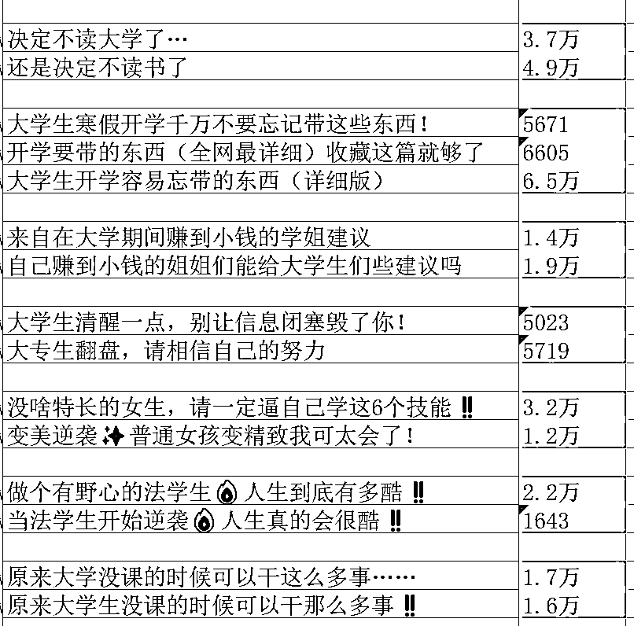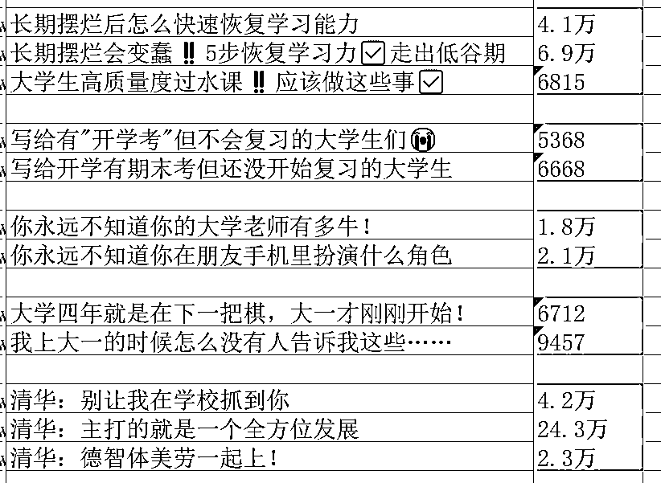

如上图，很多爆款标题，换一种说法，甚至是换一个标点符号，都有可能继续成为下一个爆款。

所以，对标爆款笔记是普通人做出成绩最好的捷径。

而我也对这些标题进行了拆解，在这里举两个例子方便大家理解：

① 大学生寒假开学千万不要忘记带这些东西！

主体：大学生

事件：开学

强调点：开学所需物资——换成常用说法：开学要准备的东西

（这个“东西”怎么样？形容词：详细、贴心、必备、容易忘记、不能忘记、必须）所以这个标题我们可以改写成：

大学生开学容易忘记的东西（贴心版）都在这里了

即将开学的大学生要带到学校的东西（全网最详细版）

大学生开学要带哪些东西收藏这篇就够了

② 来自大学期间赚到小钱的学姐建议

主体：大学生（建议是给大学生、学弟学妹的，而不是标题里的学姐）

事件：大学期间赚钱

强调点：

小钱（大多数大学生只是需要赚点零花钱，这里的“小钱”可以替换为“零花钱”、“奶茶钱”、“经济独立”、“副业”）

学姐建议（过来人的建议，这里的“建议”还可以替换为“忠告”、“劝告”、“超全方法”、“肺腑之言 ”等等）

所以这个标题我们可以改写成：

来自大学期间赚到小钱的学姐忠告（内附超全方法）

大学空余时间学姐教你如何轻松赚奶茶钱

建议你没课的时候这样赚零花钱（再也不用向父母伸手要了）

在这里就不举例子了，大家可以根据自己的需要对一个标题进行拆解和重组。总结如下：

主体：能够精准的获取流量，主体是大学生，那么点开笔记的 99% 都是大学生，受众精准用户就更容易对笔记做出点赞、评论、收藏的行为，有利于笔记数据提升并进入更大的流量池以及获得平台的推荐。

在心理学上，有一个“自我参照效应”，意思是人们往往只会关注与自己有关的事情，把握住这一点其实选题大有可为。

比如学生从横向上看，还有其他职业  老师、医生等，从纵向上看小学生可以分为中学生、大学生、大专生、研究生，从大学生中还可以分为大一、大二不同年级，其中还可以细分到某个专业的学生。

所以想要获取精准流量，就一定要对自己的受众有清晰的判断。

事件：事件可以有很多种类型，比如周期型的开学放暑假放寒假，节日、热点、季节，写“周一优秀的女大学生都在干什么”，周一写到周天，总而言之，事情那么多，总有我们可以写的。

强调点：在事件里抓住一个关键点去写，并用形容词去修饰，这个形容词要能共情用户痛点、痒点、难点，比如图上的。

那么如何使用后羿采集器呢？

文字版：后羿采集器（免费）下载地址：https://www.houyicaiji.com/  ① 将收集的链接复制到采集器网址框中，然后点击智能采集。

② 采集器会自动识别话题网页端，采集内容生成下列的表格。

③ 我们点击标题链接列的任一链接（这里标题链接其实是用户主页链接，自动生成有时出现名称错误）。

④ 点击后会自动跳转到二级主页页面采集，首先我们先点击清空所有，最后一步添加字段，按个添加需要采集用户的简介名称、标签、介绍、地址。

⑤ 重点：采集导出 excel 表格形式后，对数据进行清晰，无关杂乱信息删掉可以整理到飞书表格，方便自己同步对标分析。

图片版：

① 找到对标笔记

② 点击笔记正文末尾的话题

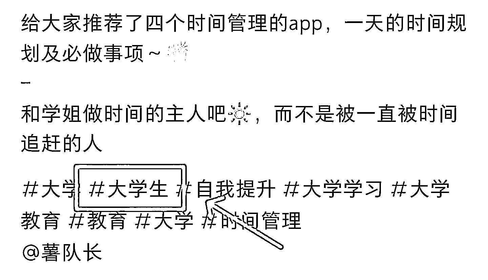

③ 点击右上角的分享按钮，复制链接

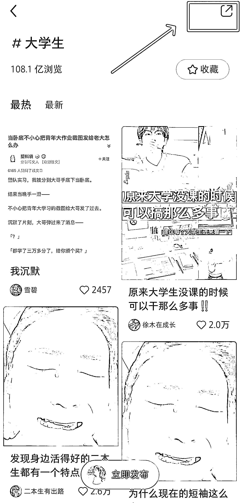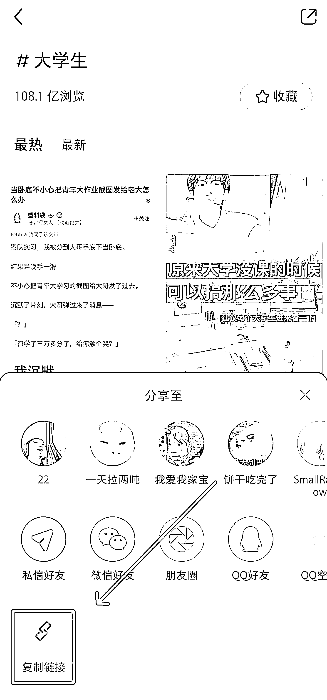

④ 将链接复制到后羿采集器进行数据采集并导出

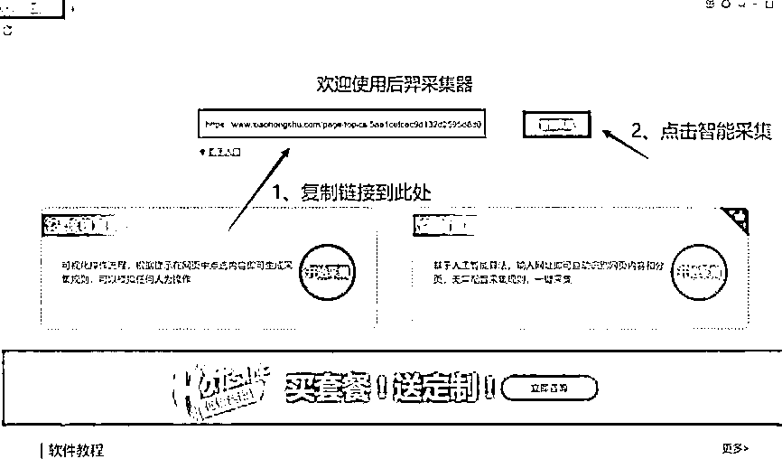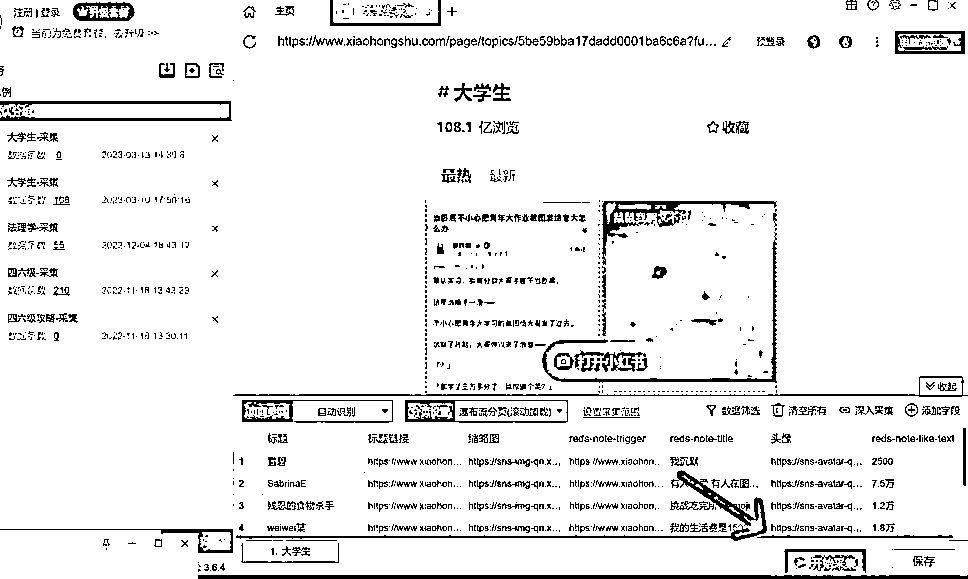 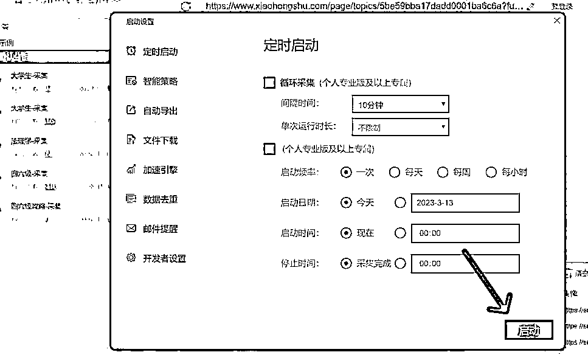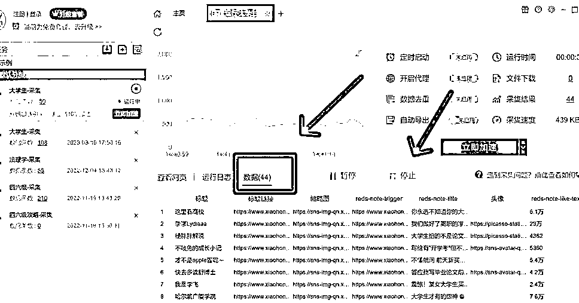 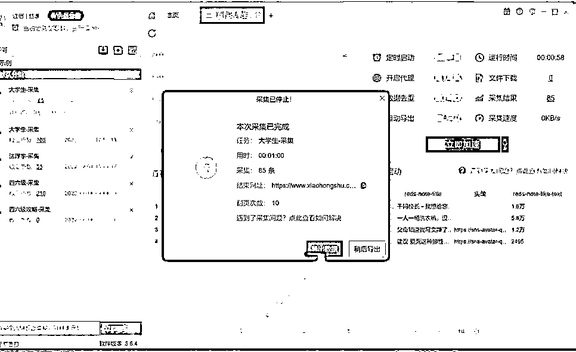

后羿采集器的最终目的就是找爆款对标然后输出标题，对新手来说非常友好，可以直接快速上手，不用再去分析爆款，找爆款，研究爆款。

三、如何提高效率？

这样的方式一开始是可以的，毕竟对于小白来说，培养网感是很有必要的，只有多看、多去感受这些爆款选题，才能慢慢养成对于爆款的敏感性。

后羿采集器就是在为新手小白打基础，接下来要做的就是提高生产力，我们就可以用灰豚数据、蝉妈妈这样的工具来更加精准的做出爆款，增加爆款更大的概率。在这里我就灰豚数据作为工具来分享。

四、如何使用灰豚数据？

灰豚数据更像是进阶版的后羿采集器，从数据中获取关键信息，能让我们的效率提升很多。

以前我做情感号、护肤号的时候，其实并不知道怎样选题，因为选题并不难，像所熟知的有生命周期选题法、竞品选题法、细分、标签、痛点、热点这些选题法都可以参考，这些是对于每个平台都通用的选题。

但每个平台都有自己的用户偏好，所以还要考虑到不同平台的调性，这里我们就可以借助灰豚数据来获取。

先来看一下灰豚数据：

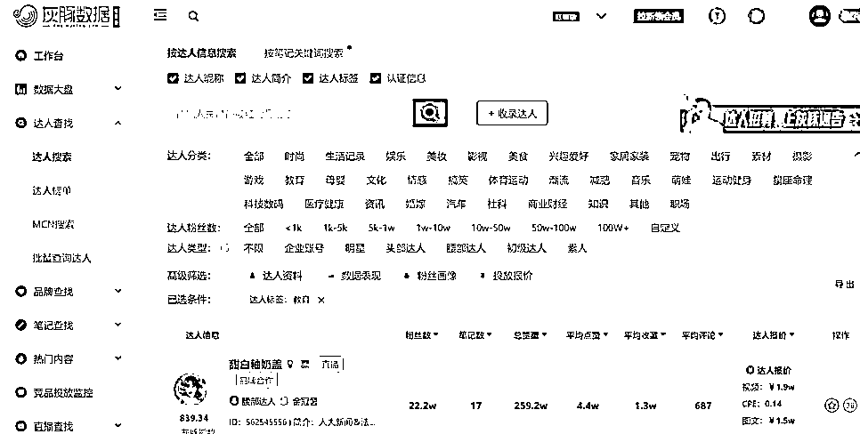

灰豚数据里面的达人分类顺序，是按照小红书的流量和热度来分的，前面的时尚  生活记录  娱乐这些，是小红书主要的领域，内容和达人最多，单从小红书的内容构成来看，前面赛道竞争激烈且门槛高，不适合普通人来做。

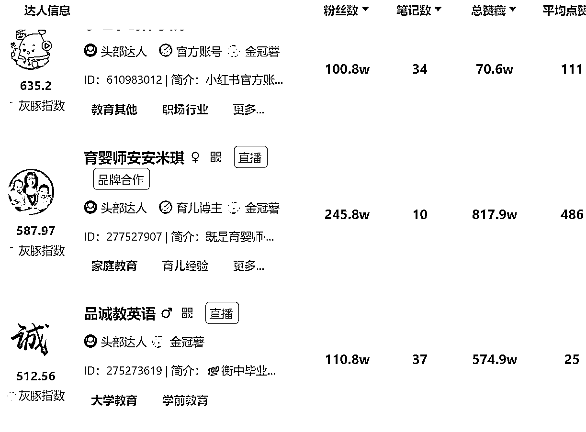

教育类的头部达人  目前我能看到的粉丝数在 245.8w，但时尚类就在 600w，大 V 效应也会更加明显。

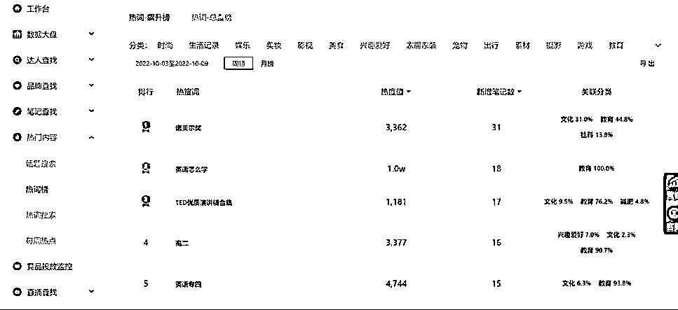

**1. ** 热词榜的周榜里可以查到最近一周的热词

**2. ** 飙升榜是最近一周用户最关注的内容

**3. ** 总量榜就是长期关注的热词

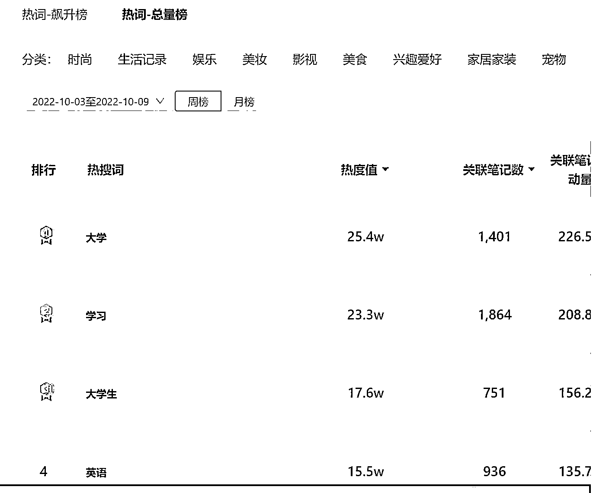

热词总榜这里的热词，可以添加到的文案里，也就是小红书里一项项的标签：#大学#学习。

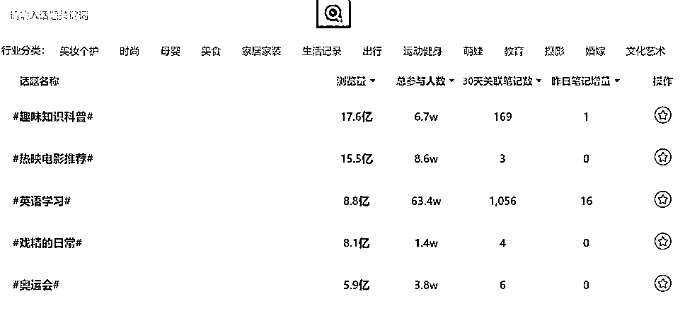

英语学习的参与人数在这张图里是最多的，但浏览量并没有前两个高，是不是可以说明英语学习的流量更精准

（如果打算做精准流量，就可以通过这样的数据进行分析，内容创作的方向也会更加明确）

这时我们点进这个“英语学习”，我们就可以看到数据概览、相应的笔记、每篇笔记涵盖的热词。

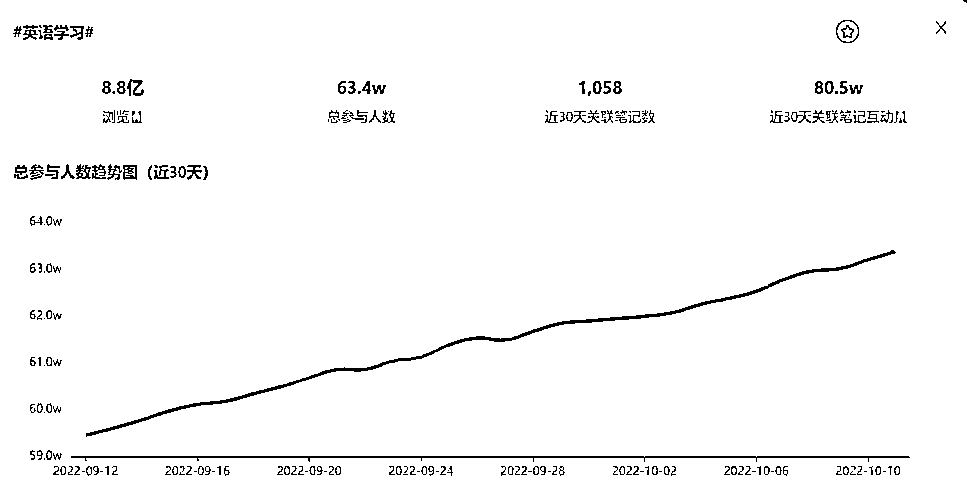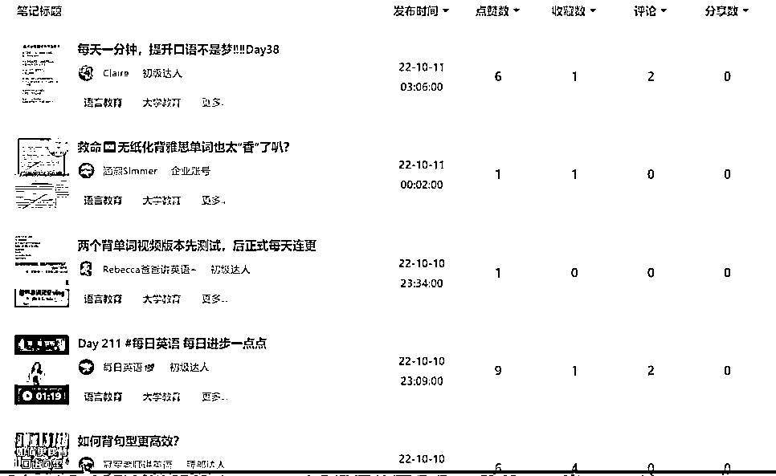

可以点击笔记标题，阅读相关笔记，在电脑上可能会不太方便，每篇笔记都可以扫描二维码在小红书 app 上查看以及对标。

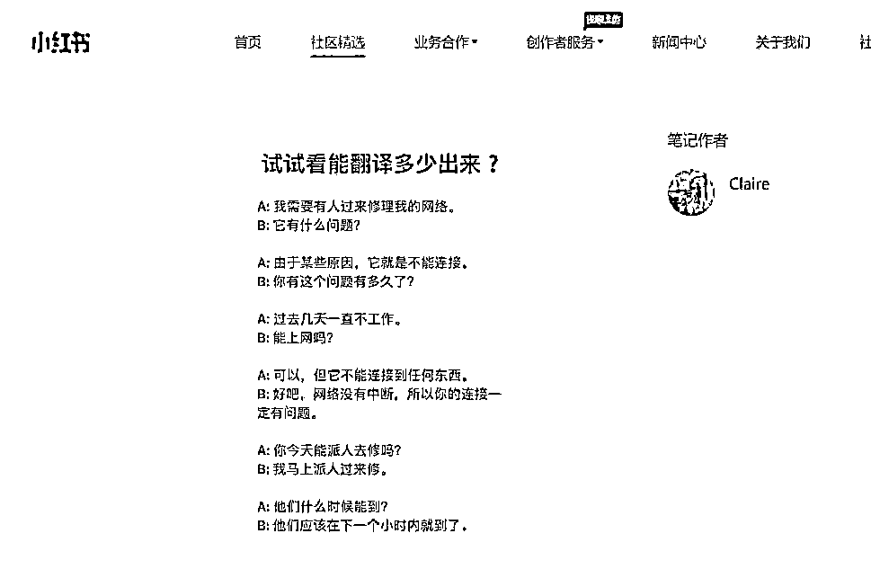

五、我的起号过程复盘

研究完灰豚数据，接下来就是去尝试了。于是我就在灰豚数据上找了一篇选题：

找到“热门内容-热词榜-热词总榜”：

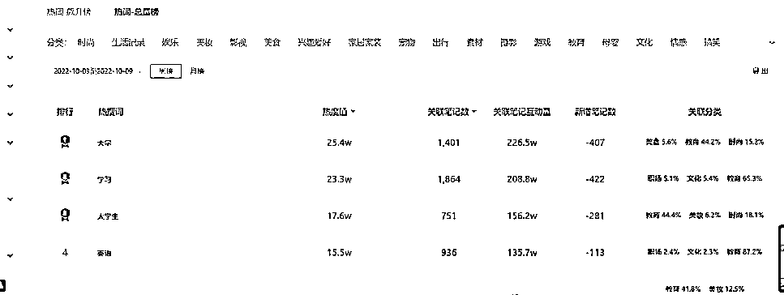

点击“大学”，查看数据概览

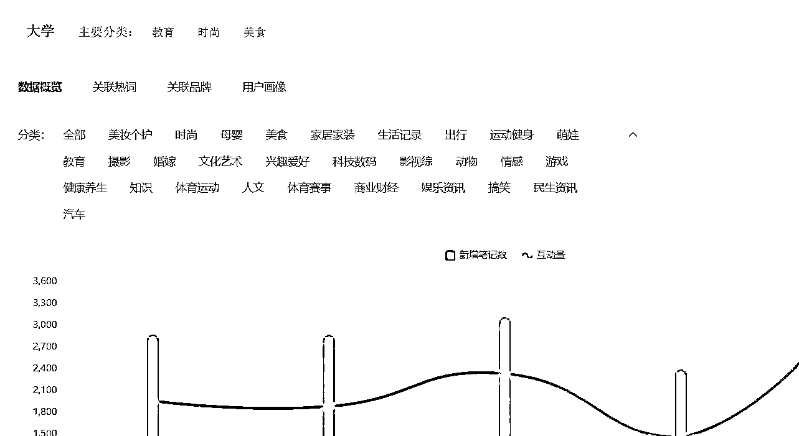

笔记类型选择“非商业、图文”。

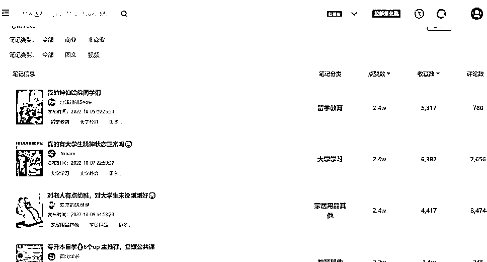

点击某篇笔记标题就可以查看笔记涵盖热词。

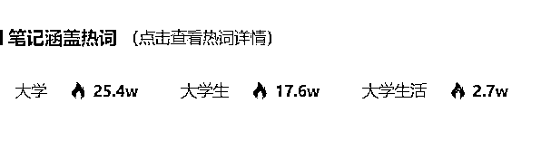

笔记覆盖热词也就是标签问题，都已经被完美解决。

但第一篇笔记发布后，数据很不理想，只有个位数的赞。

由于我当时是中途接手的一个 5k 粉的账号，有一定的粉丝基础，我就进行了反思：

该账号之前发的内容，高赞集中在  英语四级、大学忠告、建议、残酷真相  这几篇笔记，粉丝大多数由高赞笔记转化而来，他们更关注这些，粉丝画像可能更偏重这方面。

因此，如果发这方面的内容，粉丝作为首个传播量，会最先点赞、收藏这些，就会有更多的曝光。

但第一次找的选题以及内容，明显不符合该账号粉丝的阅读习惯。

可能是还有些因素没有考虑到，需要继续摸索：时间线、事件线、对标线都需要考虑到。按照这个逻辑，我找了一个对标账号，继续进行了测试。

在第二篇测试当中，把文案部分也进行了优化，把笔记涵盖热词在文案中提上3遍，这样做主要是为了获得搜索流量。

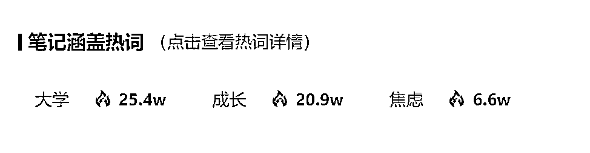

第二天笔记发布后，隔了一天已经有 689 赞了，赞比藏 2:1。

从小眼睛和点赞来看，普通的高赞回答，小眼睛和点赞比例在 10：1，但是超级爆款比例 6-8:1。

从赞藏来看，一篇笔记能够到 2：1.4 以上，万赞就会很稳定，会有持续不断的推荐。

对于教育学习领域来说，赞和藏，更像是一个情绪价值和一个实用价值的区分。

按照小红书的权重来算，评论＞收藏＞赞，因此还要做的一件事就是：一定要在文案和内容中，引导读者评论，同时号主，也要在评论区多评论，多互动。

后来顺利了上了万赞

但是爆了一篇也有可能是巧合，于是就用这个方法继续测试。

后来好几篇用这样的方法，都成爆款了，可以说只玩过千赞，从选题的角度上看，这样的判断还是正确的。

  

六、反思与进一步优化

(1) 选题方面：

用灰豚数据筛选出来近期和总榜小红书的热度话题，然后再话题里找到的  图文笔记  点赞量高且都属于素人账号的爆文

时间线都是近一个月新发布的笔记，有热度，同时筛选符合账号人设的内容，符合时间线、事件线、对标线的要求。

即标题和关键词在灰豚数据上查找，近** 30 **天、近** 7 **天按照赞数由高到低排序，最好参考低粉爆文笔记，进行对标模仿，关键词在内容、标题、小文案三部分加起来至少提及三次。

**(2)**内容方面：

可以参考爆款——被验证过的好内容。

有了选题想要提升数据，就得获得源源不断的搜索流量。

这两篇笔记是之前发布的，搜索流量只有 1%，数据可以说是非常差。

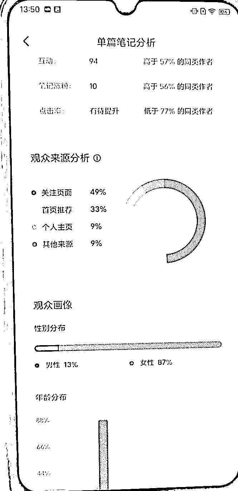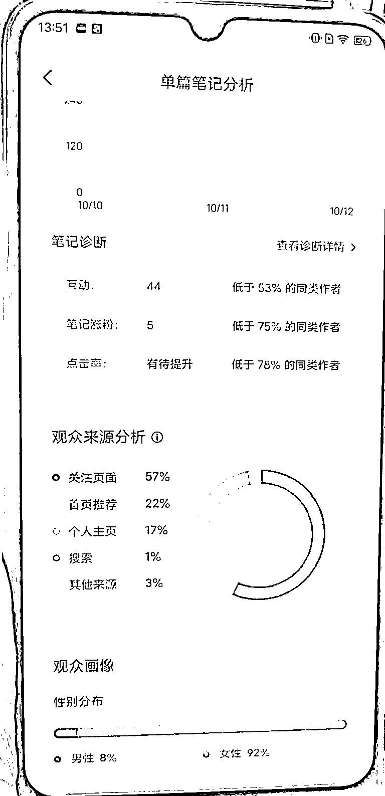

其中有一篇关于过英语四级的万赞笔记，搜索流量在 61%，并且也被提示了“在笔记标题及正文中，提炼笔记重要信息，有机会提升笔记的曝光量”。

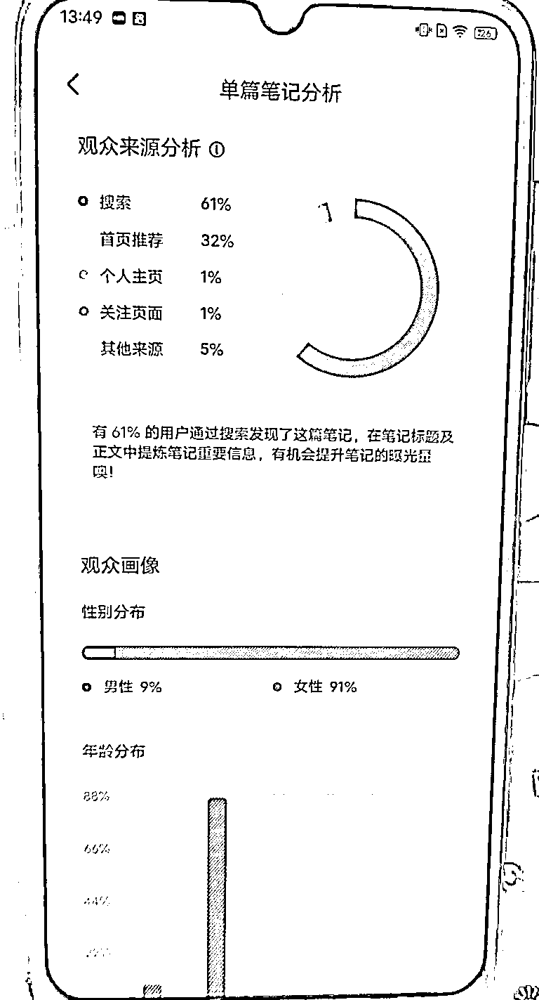

笔记涵盖的热词在标题、文案、图片内容中，提到不少于三次，更能获得搜索流量，同时根据用户端的点赞收藏的行为来推送笔记.

如果笔记的关键词系统能准确判断，那么推送给的用户也就更精准，触发三连就能返推笔记到更大的流量池。

后来再遇到数据差的问题，考虑到是标题关键词以及关键词的频率问题，导致没有推荐和搜索流量。

于是就继续改文案、标题，重新发布，数据一下子就提升上来了。

毕竟搜索来的才更容易点赞，点赞会加大推送，搜索越多，推送越精准，量起的越快。

热词的搜索量高，既是标签也是热词关键词。

通过这个方法，做到了一个账号 7 天内 60% 的爆文率。

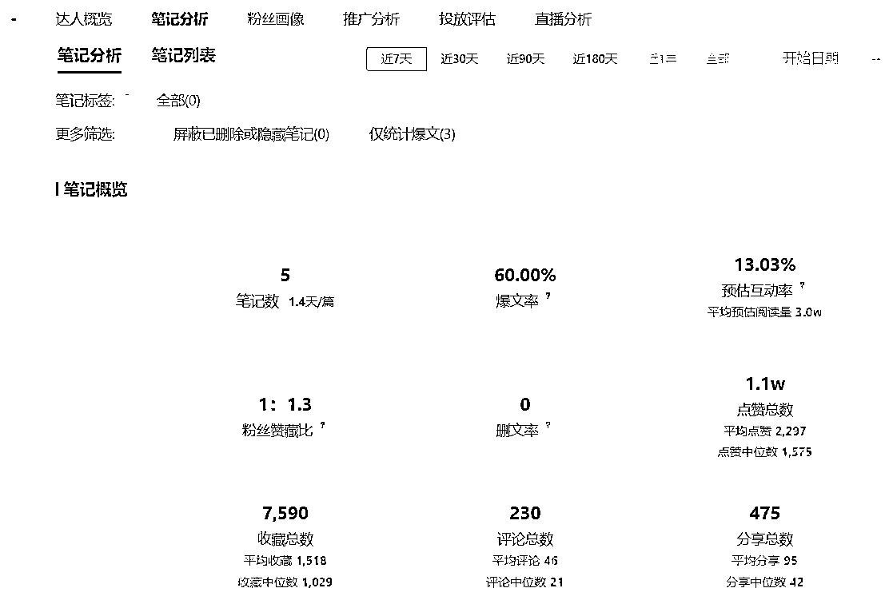

关于笔记的标签，在后面做小红书资料引流项目时，还有一个小的突破：

**(3) **如何让流量更加稳定？

**——**只要被标签收录，流量就会更加稳定一些。

标签的作用就是可以让系统识别出笔记的分类，越垂直越好，比如你要发布的是大学高数的资料，标签就可以是#高数#高等数学#大学高数#高数期末复习#高数笔记#高数复习资料等

当一篇笔记被收录到对应的标签后，就会获得源源不断的搜索流量，所以笔记的标签还是可以好好利用起来的。

但并不是每篇笔记都会被收录，如何被收录就成了问题。通过我的不断发笔记不断地实践，就产生了一个新的想法：

原先发笔记带的标签都是看  在相关的情况下，哪个标签关注人数最多就选哪个，因为关注人数多就意味着流量池大，就能够被更多的人所看到的，但没想到可以反着来。

由此联想到了知乎，在知乎写回答如果是一个新号，就不建议回答关注人数上万的问题，因为关注人数虽然多，但小号权重低，这篇回答爆了的可能性就很小，浏览量也很低，回答就会被沉。

小红书亦是如此，新号权重低，笔记不容易被大的标签收录。

但小红书不同的是，新号有流量扶持，以及根据它独特的算法，新号爆的可能性大大增加，即使是素人也有可能出千赞万赞。

但我们可以把它做的更好：如果选择小标签，就更容易被收录，收录后就会推荐给关注该标签的人以及获取到搜索流量，那么就会把这篇笔记推荐给更大的流量池，流量也就慢慢起来了。

当然，全选择小标签不如大小标签结合，大标签定垂直领域，小标签更加精准易被收录，再加上好的选题和内容，就能够获得到更多的流量。

七、一些碎碎念

我在做小红书之前，还做过其他平台的运营，早期是做知乎账号，积累了3.5w的粉丝，后来知乎经过上市、改版内容等等，慢慢地过了红利期，我作为创作者也就转移到了其他平台。

但知乎毕竟是我做自媒体的第一个平台，两年前新手小白的我，对于自媒体的概念是粉丝越多、挣的钱越多。

所以我就给自己定目标就是成为一个大 V，一周涨多少粉丝、平均一天涨多少，再具体到一天要写几篇回答才能完成涨粉目标，并没有途径知道那么多帮助创作者做内容分析的工具，走了不少的弯路，但也最终做成功了。

在做公众号之初，我的老师告诉我，无论好坏，所有的经历都是财富。

在知乎上走的那些弯路，最终也成为我宝贵的运营经验，后来带了很多知乎学员做出了一些成绩，同时还学会了用户运营、社群运营。

而关于运营的底层逻辑，虽然每个平台都有一些细微的差别，但本质上是不变的——要有用户思维，为用户着想。

现在每个平台都出了创作者平台，也有了很多数据分析平台，我们就应该去发掘这些工具，更好地为自己的内容创作进行服务。

全依靠工具是行不通的，没有船时我们也要能够游到河对面去，“不会用人的领导不是好领导”

领导要学会权利下放，但并不是说没有了员工工作就无法进行。

chatGPT 也是一样的道理，因此利用工具写爆款笔记，你就把所有的工具都想象成你的员工

你作为老板，是永远无法被替代的存在。

评论区：

花无忌 : 这篇文章看得我有点口渴了

一颗幸运小星星 : 这篇写的真的很好！👍  我最近也在做小红书一个星期爆量，但是正发愁选题如何找以及流量如何稳定下来。你的思路真的非常棒，干货，感谢分享～可以的话，可以加个微信么  我在做内容电商

lydia : 一个星期爆量，纯新号吗？那很厉害了👍

韩北樱 : 对你有帮助就好～

一颗幸运小星星 : 对的  没有花很大心思😂  以前起号也是  两个星期一篇视频，1万多粉丝

一颗幸运小星星 : 好嘞

陈真 : 先赞后看，然后回来再赞

碧凝 : 太厉害了这篇

# **# ****(**精华帖**)(1065**赞**)**从小红书电商小白到两周单

# 店变现** 78W GMV**，付费流打法实战** **单周投放** **

# **Roi 10+**

作者：  鲸鱼🐳

日期：2023-05-12

《从小红书电商小白到两周单店变现78w gmv，付费流打法实战  单周投放roi 10+ 》大家好，我是鲸鱼，前大厂广告算法产品经理，一个商业流量操盘手，擅长抖音、小红书等平台投流带货、投流精准获客及SEO。

在2月份受生财小航海启发，小红书电商零基础小白，我觉得小红书电商是个机会，提前进行内卷，在2月22号2小时内出单。

在出单后，结合生财给我带来的认知，决定研究自然流+付费流打法，进行整整2个月的实战。两周内一店变现78w gmv，二店变现14w gmv，单周投放roi10以上，最高roi 56。

在这里感谢生财有术给我带来认知的改变，还有感谢我的贵人  老师。

同时，为保证分享输出玩法的可行性，已协助学员进行自然流实战，并实现单店突破30w gmv，目前在协助付费放大。

本篇实战帖会对小红书电商带货项目进行自然流和付费流两个不同维度拆解，自然流玩法包含目前主流搬运混剪玩法，无论是新手小白还是想玩付费的玩家，均可放心食用。

为方便排版，具体文档请移步飞书：

https://ra0vtgukn5c.feishu.cn/docx/F3BjdXRJFoPmE3xPsxgcZGLDnZb

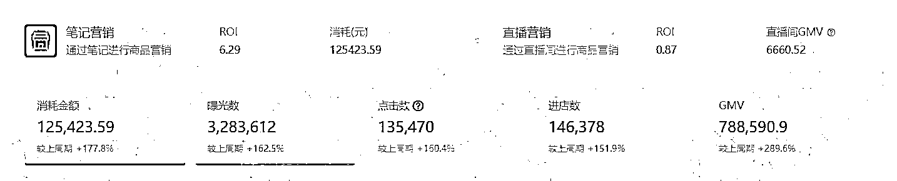 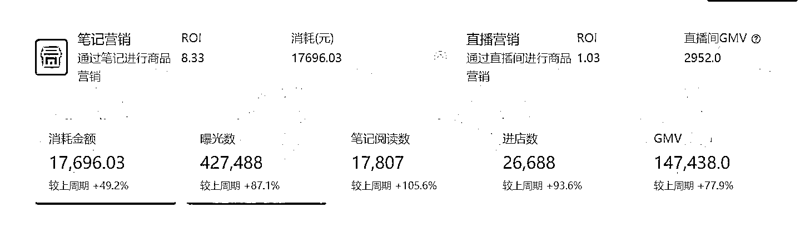 

评论区：

云珞YunL : 太厉害了，先赞后看

鲸鱼🐳 : [呲牙]一起搞钱

星尘丶 : 太强了哥

林深 : 鲸鱼YYDS

浅笑 : 先赞后看，养成习惯

鲸鱼🐳 : [呲牙]过奖啦，一起搞钱

鲸鱼🐳 : [呲牙]一起冲

鲸鱼🐳 : 一起搞钱

# **# ****(117**赞**)**小红书电商两种实操玩法分享

作者：  曜文

日期：2023-05-04

通过两个多月的实战目前对小红书电商的玩法流程逐渐清晰、

所以在五月份开始来和大家分享一下我近期的一个玩法方向和近期实操的经验。

首先，小红书对于电商的扶持依旧在继续

已经更进一步的在扶持上架，选款，赠送流量，帮助商家找到热门的选题

（注：每个人的推荐可能都不一样，因为系统会跟随账号的标签和垂直度推送相关的热门话题）

通过这种图已经有很多同学选中爆款实现店铺日出百单

因为，只要参与话题就送笔记流量，那目前小红书出单基本也来源于笔记的曝光，所以，平台有流量扶持，赶紧冲！是个机会！

接下来，我们来聊聊我的两种实操操作，来带你玩转小红书电商

# **# ****1.**好物爆款玩法

好像各个平台都离不开爆款好物的玩法，小红书当然也不例外了，就是利润不高，但是爆单起量数据好看

比如我之前做手机壳一天能卖100单以上，但是一单利润也就2-3元，但是对于新手可以尝试入局再不断的调整价格拉高账号数据和权重来实现更高的盈利。

目前，家居好物，装修好物，日用好物，出行好物，....太多了

打开抖音打开考古加数据看看近期热门爆款或往期爆款就能找到超多好物

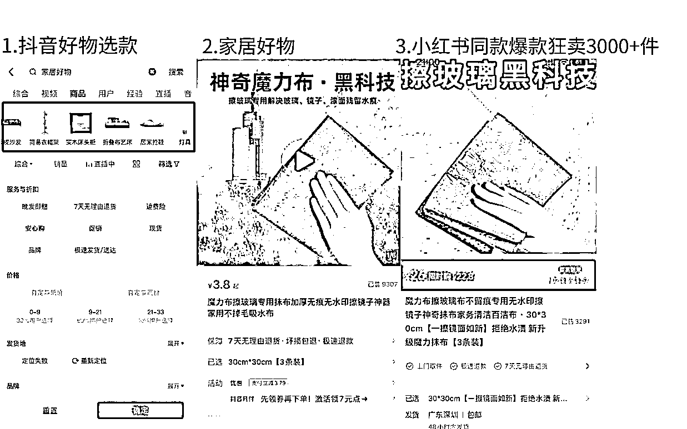

例如

一款夏天精致吸管杯子

一幅装修装饰画

一个精致的花瓶

.... 实在是太多了，找找年龄段18-35会用到的好物产品

为什么好物能做呢？

因为这类素材多，之前在其他平台已经被验证过是用户需求

而且，拿来做小红书电商素材足够能混剪，爆款内容也多，能够顺利的找到非常多的素材混剪去堆爆款。

优势：

素材容易找，起号快，各种垂直的好物多，每天能不断的测款，出爆款。

也能在较短的时间内提升账号权重，和账号垂直类目的垂直度以便于后期提升利润获得更多的流量。

# **# ****2.**垂直精细化玩法

意思是，垂直于某个行业类目在这个类目下运营店铺

比如，做饰品，那么可以做耳饰，手镯，戒指，项链....等等一系列的产品目前，可以根据小红书女性画像来确定想要深耕的赛道，确定了赛道之后就可以开始选品选品之后，就可以开始做店铺运营

1.拆解用户需求

2.找到产品卖点

3.锁定关键词

4.寻找对标

5.拆解对标

6.持续输出

还可以做自己的原创店，或者个体IP店，什么意思呢？

就是在输出内容的时候加入自己的风格IP，人设，让自己的店铺转化率更高，而不是仅仅停留在混剪上面。

前期可以用百元内的产品来激活店铺权重和笔记流量，后面可以提升客单价来做利润品。

此类店铺，不容易被同行举报能比较长久，但是前期店铺起量是需要一定的时间的，需要打造账号和做好内容运营，当然后期也能获取到较高的利润。

能够锻炼提升自己的运营能力和剪辑文案能力。

总结：

好物账号出单比较快，素材比较多，如果选品困难不知道做什么可以从这个入手去找到感觉然后再精细化运营，但是前期利润比较低，单量高，利润确实不高，甚至有很多人能做到当天发笔记就出单。

精细化运营能比较长久，而且后期的利润品只要上了基本也能出，如果你有留意的话你会在小红书发现很多账号前期是靠价格低的产品出了上千单，后续每个月上的品都能出个几十单，这就是利润品。

精细化运营之后，还可以把垂直客户做到自己的私域来多次的成交流量，电商的流量客户始终都是平台的

唯有私域才是自己的

讲完，有所帮助，记得点赞！

评论区：

巧巧 : 分享的太棒了

祁磊 : 很好，有收获，谢谢分享

晴子 : 很棒的分享

仁然先生 : 写的非常好！

# **# ****(**精华帖**)(194**赞**)**电商人用什么方法在小红书

# 赚钱

作者：  云端行走

日期：2023-04-07

小红书店铺可以说是这一两个月讨论最火的话题之一，有人晒出一天成交几千甚至10w➕成绩，很多人问现在入局还算晚吗？作为去年在小红店铺的第一波掘金人，我谈谈自己对小红书店铺理解：

1.小红书电商目前仍然出去前期红利，但纯搬运和软件混剪的时期已过。

2.今年进来很多做无货源的新人，对单号的二次处理，以及如何有效规避处罚很多都不懂。平台早晚会出相应政策（其他平台是罚款几千上万）

3.不管是用Ai还是ChatGPT来创作内容，这只是过原创的一种方式和提高内容质量的手段，做小红书店铺就是做内容电商，那么你赛道和品一定要选好。

4.不要看到别人晒的销售额就热血沸腾，也不要因为自己长时间没出单而气馁。找对方向，用对方法，结果自然就有。

分享下我们电商团队常用的几种方法，思维打开，你就能举一反N了啦[呲牙] https://i.shengcaiyoushu.com/docx/QYVPd9OE3oWpmBxcxgbcEedRnSb评论区：

肖一 : 您好，请问这边说的三个号起步，是指同一大类下的不同小类，还是三个不同大类，还是说做相同类目不同方法。

大颖哥哥 : 太干货了  牛牛  对于我们新手来说起店帮助很大

yyds

两千一 : 太干了[强]感谢老师分享

华龙 : 多开店，实名也是个问题。小红书可以分销别人的产品吗？

Apple : 无私奉献  ，  都是最新打法，长见识了

涅槃 : 成交是一方面  利润会有多少啊

金九渊 : [强]

林希 : 博主应该说的是同类产品的不同笔记玩法

# **# ****(**精华帖**)(207**赞**)**小红书店铺运营**——**有货源

# 模式的玩法

作者： Jing

日期：2023-03-29

大家好，我是jing 。一个因带娃不具备就业条件却为自己创造工作机会的妈妈。

我是结合个人 IP 卖货的，人设是玩具设计（为自己的孩子做一件玩具）~去年11月开通小红书店铺并结合快团团第一个月做到10w+的流水  。

现在差不多半年时间，营业额已经翻倍~

请大家查看全文。

https://i.shengcaiyoushu.com/docx/IMb4dEpbzoGojMx8nMNcS0sjnzb评论区：

志豪 : 太厉害了👍

林希 : 谢谢jing，我也是一个全职妈妈，感谢您分享的详细的小红书店铺运营方法，向优秀的你靠齐[爱心]

假行僧 : 厉害/:strong

月起星九 : 超棒哒

shijinzhan : 真厉害

热爱 : 厉害

lydia : 亲爱的，咱们是先把IP做起来才开店的吗？

潮州痞子蔡 : 不用

# 【机会探讨**2**篇】

# **# ****(73**赞**)**聊聊小红书电商、**IP**，一起探讨未来的

# 机会

作者：  木格

日期：2023-02-28

生财的好朋友们早上好，我是木格，**98**年，当然，**”**不小了**”**！我发过好多文章，也分享了好多关于创业和项目的观点，这篇文章，专门奉献给生财的朋友们

昨天呢，我刚被拉进了生财的航海群，加入生财几年了，这也是我第一次参加小航海，有点激动，同时也带点彷徨和焦虑，在生财呢，我认识了很多优秀的一起创业的好朋友，也学到了很多知识，想着，我应该在生财输出什么样有价值一些的内容呢？

gpt很火，我们普通人如果接地气的使用呢？小红书很火我们应该怎么做呢？关于个人ip呢，我也做了非常久了，今天呢，我想帮这些串联起来，分享给生财的小伙伴儿们！希望我们在这次航海中能够并肩前行。互相成为大家脚前的灯，路上的光！

现在是凌晨5点，就睡了两三个小时，似乎起的太早好像也不是啥好事，戴着耳机，听着熟悉的音乐，我又开始写文章了，时至今日，刚好半年，去年呢，在好朋友的鼓励下，我接受了他们的意见，毅然决然的踏上ip这条路，说实话，ip抗风险抗周期能力很强，这对我来说，的确是难而正确的事情，很多人夸我文采好，有才华，会说话等等，在我认为，并不是从小学到高中，我的作文一直只处于及格水平，我也好奇为啥我现在不管是发朋友圈还是写文章，文采确实还不错，认真思考我觉得有两个因素，第一，创业类的各种视频，或者说鸡汤呢，我看多了，平时呢也会去刷刷知乎，看看其他创业类的博主在写什么文章，里面有些什么金句，我觉得很有道理的呢，我就会给它记录下来，第二呢，就是我发长文的时候，习惯听音乐，不要劲爆的，我只听能让我心情变得低落，偏伤感类型的音乐，比如，The rain，梦中的

婚礼，雨的印记，天空之城，这些钢琴曲，这些音乐直冲我的心灵，似乎有一种魔力，当我一听到这些歌曲的时候，我仿佛变了一个人，我的头脑变得冷静，变得清晰，思绪顿开。于我而言，听歌可以让我最快进入到工作状态，其次我工作时喜欢安静，所以一般写文章做规划布局等等都是在凌晨之后，这时候连个微信消息都没有，不会被任何人打扰。通过写文章这个事呢，我也可以认真的反省反省自己！

大概在一周前呢，我写了一些关于美团的观点和看法，我说过，我劝退了很多学员，这些呢，是真实的，是可信的，当然呢，这也不是特别重要，如果单纯的只是为了赚钱而赚钱，那在长久的战略上，我会变得很被动，很容易站不稳脚跟，当然，这只是我现在，这几年呢，我可是吃了大亏的

第一次呢，我背了几十万的官司，并且项目从巅峰进入低谷，当时只觉得平台不好，却没有思考自己并没有一个长期的规划，好在呢，当时公司钱足够，足够我们支撑一两年时间第二次呢，同样的事情，又在我身上发生了，还是认知不足，这次呢，和钱没关系，追求短暂的利益，导致呢，公司解散，好朋友之间不和睦，虽然直接原因不是因为我自己，但是间接是我造成，我的战略有误，我的方向错了。好在事不过三，我还足够清醒。

我说这些更是想告诉大家，有些项目呢，确实是要赚快钱，在0到1这个阶段呢，有些钱就是跪着也要捡走，我现在还记得，大概我刚创业那会儿吧，老大哥对我说，木格呀，你将来一定会有所成就，你很聪明，情商也高，对身边朋友也都特别好，而且你还有我，大哥我当时可没这么好的圈子，这么多的资源，虽然你现在没啥资金，但是不重要呀，我喜欢的是你这个人，大哥有一天会老去，再干十几年可能就移民出国了，以后可得靠着你扶着大哥走路，当下，你最

重要的事情”先赚它个一百万”这就是你的底气。你出门看项目，去交朋友，你都会有底气，至少不用担心因为没有钱而做不了。

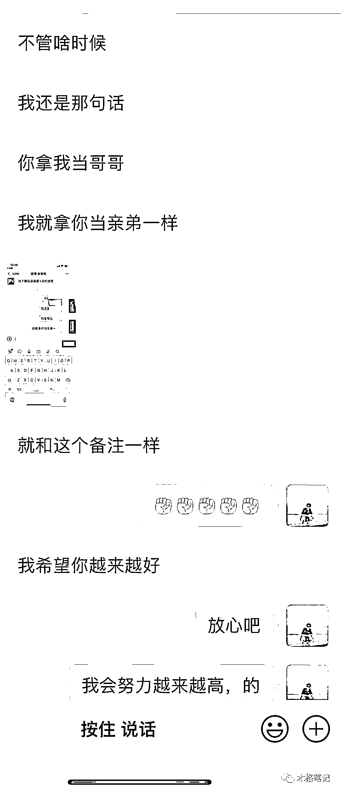

嗯，我们把这个阶段当作积累吧，我还是想再告诉大家，有时候真的是时代的红利再加上点运气，千万不要自满，过了这个阶段后，我希望大家可以和好友相约出门旅游个一周？一个月？

都可以，我不是在说教大家浪费时间，而是好好玩，玩舒服一点，在这个过程中，你更应该认真的思考，商业旅程中，你的第一个阶段已经过了，你要想想，接下来如何做一些稍微长线一些的事情。至少这钱呢，赚的心安理得，不用担心因为平台变动莫名其妙的直接从高空跌入谷底，说真的，好好思考思考

美团电商呢，其实也是一个例子吧，去年，只要铺货就可以实现躺赚，谈不上大红利，算个小红利吧，今年呢，就变了，任何依附在平台下的产品，都有一定风险，今天和好朋友聊天呢，他做的抖音团长，很多人也许听过它的名字，我就不细说了，去年大概做了两三个亿Gmv，那外表确实是光鲜亮丽，实际退款超过百分之50，除去员工工资，医社保等等成本，实际的利润

到手也就几百万，今年要比去年更差一些，我太能理解了，不过这里我还是想强调一下，依托于平台性的产品，就是会有很多不可控因素。正所谓，"花无百日红"

所以今年呢，我们公司的产品以及各类的服务，最终都还是要慢慢走回到私域上。形成一个闭环，该怎么说呢？三天捕鱼，两天晒网的日子，我过够了，我想在海中一直航行，再也不想呆在我那冰冷的小竹筏上了，这一次，我想做游轮，想做航母，想稳定前行。一个项目，一个产品要是稳了呀，就很容易形成正循环，你的团队，你的规划，也很容易在不确定的环节中找到确定的因素，只不过这个环节已经帮平台剔除了，我就是我，做最真实的自己！

德鲁克先生曾讲，企业，只有两个功能，第一，创新，创造差异化的产品和服务，以及是否能提供附加价值。这个可以参考豪车毒老纪，第二呢，通过日常营销，成为顾客心智中的首选，这个大家应该参考大多数细分赛道的品牌。当然也包括私域，好比我们常说**”**流量的红利会枯竭，人心的红利才刚刚开始**”**

这段时间呢，小红书电商很火，Chatgpt很火，当然，我都有去了解，比起小红书呢，我在Gpt上花的时间会更多一些，毕竟不能被时代淘汰了嘛，下次有机会，我一定好好给大家分享分享我们普通人在chatgpt的应用场景，那今天呢，我主要讲讲小红书，这个操作流程呢，思维导图，好朋友好早就发给我了，很细，很细，细到变成了一套标准化流程，连每个员工做几个号，每个时间段做什么，我都了解的好详细，可是这一次呢，我并没有马上执行，我思考了好几天，得出了一个结论，我认为小红书电商是个机会，但是这种操作方式不是，大概的玩法呢，就是不断去发笔记，靠概率，靠运气，靠多号来赚钱，差点呢，人均月产出两三千，好点呢，产出两三万，当然也有个例，这种更小概率的事情咋就不多说了。

没马上去做小红书的理由有三：

**1**、成本，是个人都能做，内卷会超级快！

**2**、概率，假设现在的概率是发**100**篇爆**5**篇，按这种操作手法下去，随着入局者蜂拥而至，这个概率会越来越小，越来越小。

**3**、未来，小红书电商粉的价值虽然很高，但是无脑铺货发笔记并不能占领消费者心智，这更像是冲动消费

既然讲到了这里，我不禁感叹几句，可能也有机会，抖音达人带货，在竞争这么激烈的情况下，你看，乔乔好物是怎么冲出来的，除了垂直领域，量大出奇迹外，它还做对了什么呢？这个留给大家好好思考思考，希望能够对屏幕前的你有所帮助

我们再回到刚刚的话题，好的产品，创新和差异化的服务，我们接下来打算怎么做呢？我想大家可以参考参考，结合我说的，深思熟虑几天，再好好想想小红书这个事儿吧！

**1**、只做蓝海赛道

**2**、必须引流到私域

**3**、要提供好的服务创造附加价值

**4**、要能形成裂变的复购

大家能听明白了，做私域呗，很多人包括我自己也会想，不知道该去做什么，或者说  不了解某个行业，我简单给大家说两句，看看大家能不能get到我说的点，我讲的尽量通透，简单明了

**1**、知乎可以解决某个行业百分之**50**的问题

**2**、熟练掌握**chatgpt**➕**newbing**➕小红书数据分析软件➕抖音热门选题至于图片呢？要么用固定热门模板，当然，我也建议你去用ai绘画，为此呢，这次我也参加了生财的小航海，同时很有幸，能成为16151人次其中的一员。咋们虽渺小，但，自带光芒。

说到这里，我相信能懂的朋友自然就很好理解了。我们的操作手法，就是通过ai去实现标准化，解决可复制性

这也是为什么我迟迟没有去做小红书的原因，当然，我们在3月初就要开始付出行动了，我相信可以做，更可以行。我和小伙伴们说，做不做成没关系，我们可以学会很多，至少，我们看得到未来，所以说呀，别太迷恋技术，别太迷恋市场上的玩法，这些东西都不重要，核心还是你自己的认知和思考，这对未来的结果，会产生天翻地覆的改变。正如我之前的文章所说现在我变聪明了，  做一个项目，我不会太着急了，我更愿意花几天时间去认真思考，什么才是真正对的事情，什么才是对未来真正有帮助的事情，慢一点无所谓，方向对了，尽量选择难而正确的事情。

还是老规矩，送大家一句话

落叶归根，从群众中来，到群众中去，渔夫出海前，并不知道鱼在哪，但还是会选择出海，因为相信会满载而归，很多时候，选择了才有机会，相信了才有可能，最后，祝大家本次航海顺利！**2023**，一起扬帆起航！

评论区：

大常 : 太真诚了，不求快真的难做到，不过才可贵

傅超人 : 木格写得真好[强]，同龄人加你个微信，链接一下哈哈

木格 : 幸会，欢迎哈

傅超人 : 微信号呢[旺柴]

毅 : 睡眠还是很重要的，尊重自然规律

蛋  总 : 落叶归根，从群众中来，到群众中去，渔夫出海前，并不知道鱼在哪，但还是会选择出海，因为相信会满载而归，很多时候，选择了才有机会，相信了才有可能，最后，祝大家本次航海顺利！2023，一起扬帆起航！

# **# ****(81**赞**)**小红书电商机会

作者：  胡桃

日期：2023-02-15

今天讲个小红书电商机会，也许很多人听过，了解过，但是没有真正做过。也有许多人说这个项目难做，但是你愿意的话，我觉得你可以听我讲讲。

# 一、** **为什么是小红书电商

1\. 小红书目前的电商环境不够完善，还处于一个高速发展和增量的阶段，这是一个乘风而起的机会，有做过视频号带货的朋友可以类比去年4月份开始的视频号。

2\. 小红书目前整体的流量增量还处于一个不断增长的阶段，所以，只要你想做，这个项目有机会去赚到钱，并且赚到不小的钱。

3\. 小红书目前的电商环境没有大团队大资金入住，所以小红书必须让普通的小个体看到希望，赚到第一桶金子，这也是我们的机会。

4\. 小红书的电商服务体系几乎为零，所有的发货和交付都是属于人工，所以这个时候就是个体时间成本最低，所以也最适合做的时候。

5\. 小红书的带货环境很好，种草、女性，加上图文带货的环境都是非常有优势和机会的。

# 二、** **小红书电商是什么？

小红书电商，说直白点，就是我们去小红书开店，销售自己的产品，之所以有红利期，是因为这个项目目前流量扶持，加上进驻的人不多，所以整体的效果也很强，但是目测这种效果应该会在半年左右的时间消失，后面也会进入一个大量竞争，然后必须触及蓝海产品的阶段，时效性是肯定存在的，但是不变的一定是这个项目正规长久，且有机会做大。

三、  我们怎么做小红书电商？

1\. 开个人店铺，不需要保证金，不需要作品，不需要粉丝

2\. 找到你想要推广的产品，通过电商平台的买家秀，买家秀，以及小红书自身平台带货的爆款笔记去做，即可带货。

3\. 爆单以后，我们要解决供应链端的问题，这样才能持续赚到更多的收益，我们这边也有一些供应链可以提供，确保发货问题，和货款的信任度。

四、  我们怎么解决发货问题？

1\. 爆单的店铺批量导出订单，你直接给我们这边进行打款，我们负责发货

2\. 回传订单发货单号给你，由你负责上传单号，这个比较费人工，也是目前小红书的一个比较重的部分，基本上爆单都是几百单，填一次数据也很累。

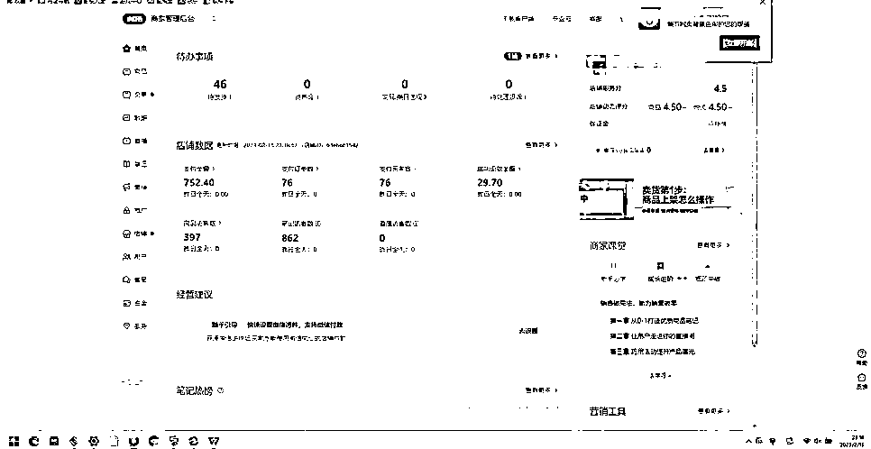 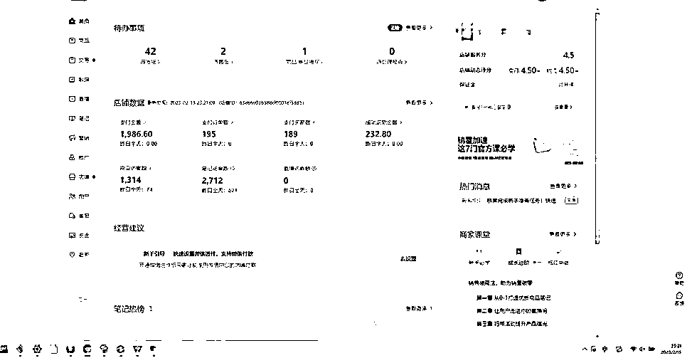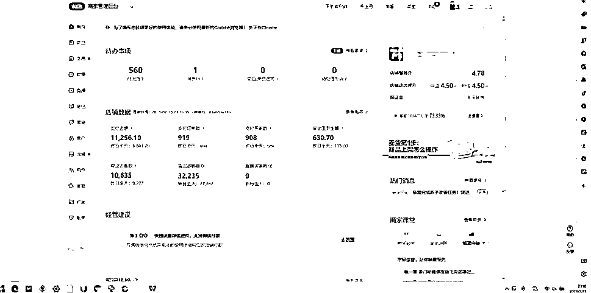 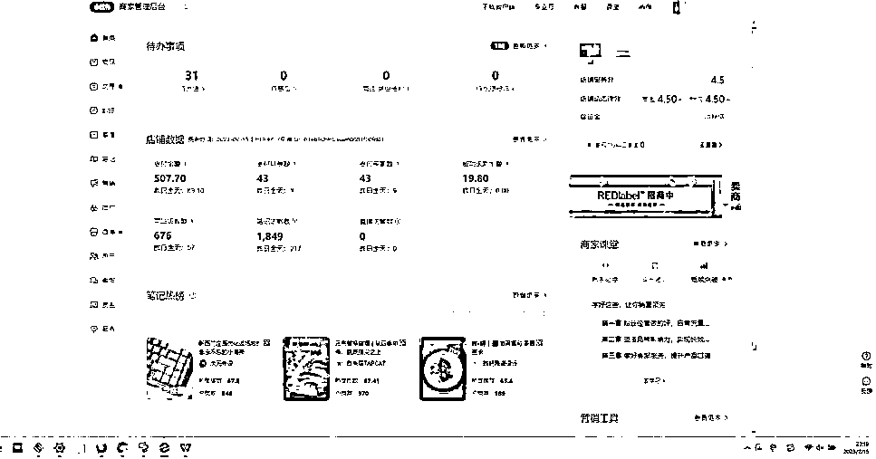

评论区：

📌小攀师兄 : 不是都需要教保证金的嘛！

梁潆月 : 个人店提现的时候需要交1000保证金

疯子军 : 供应链产品可合作不

追风少年O2 : 昨天听了直播分享小红书电商红利，十分看好，准备跑步进场，先测通2-3家流程，跑通后矩阵批量账户操作~

苹果哥跑产地 : 上产品对资质要求挺高

胡桃 : 不需要，不信你试试

胡桃 : 加油，真的很快

胡桃 : 你卖啥的？