# 小红书运营 202312

> 来源：[`remhu1p2pr.feishu.cn/docx/JyeIdDl2JoswDfxGpSjct8m4nTc`](https://remhu1p2pr.feishu.cn/docx/JyeIdDl2JoswDfxGpSjct8m4nTc)

# 12 月航海 | 小红书运营 | 实战手册

出品时间：2023 年 12 月 10 日

建议：如果需要快速定位到精确内容，可以使用快捷键 Ctrl + F/command + F 的形式，搜索「关键字/词」，查找你想要的内容

写在前面

💡引言

欢迎大家来到 12 月航海 | 小红书运营 | 实战手册，相信在接下来的日子里，我们将在这里见面很多次。

在开始做小红书运营项目之前，让我们先来解决几个问题：

1）现在开始做小红书，还有多大机会？

根据 QuestMobile 2020 年的数据，小红书平均带货转化率为 21.4%，而抖音、快手和微博的转化率分别为 8.1%、2.7% 和 9.1%。正是基于平台里有一群喜欢“买买买”的用户，以及天然的“种草”社区属性，小红书的带货转化率比很多公域平台都要强。

同时，小红书平台集合了：客户优质、鼓励种草、转化率高、离赚钱很近等特点，非常适合在小红书搭建 IP 并建立私域闭环。

而这些特点意味着：商家爱在这里引流、投放，吸引精准客户；博主（即便是素人博主）也有更多机会变现。

2）什么样的人适合做小红书？

最理想的状态肯定是自身有产品或服务 IP 的人，可以通过在小红书上建立自己的 IP 来扩大自身生意。

但如果你不是这样的人，你可能会问：

我还没有自己的产品，可以入局小红书吗？

如果你有某个专业技能，或者在某方面有自己的特长，可以尝试做一个纯博主 IP，通过积累账号粉丝量以及打磨笔记内容，通过接广告来变现。

如果我本身没有什么专业技能或特长，该怎么办呢？

对于这种情况，可以找一个自己感兴趣的、愿意深耕的领域，在小红书上分享自己精进的过程和经验感受，这类的内容也是比较受欢迎的。

最后，希望大家可以在这次航行里收获成果外，结识一群战友。

以下内容由生财有术联合圈友制作而成，仅供航海船员以及生财有术星球圈友学习使用。

同时也欢迎圈友们在实践过程中持续反馈，和我们共同完善，可以联系鱼丸（yuwan387）提供修改建议～

【更新提示】新手册使用方式

在开始前，我们来简单了解一下这个手册的正确打开方式，方便你根据自己的情况来灵活使用。

在这里，手册整体的步骤顺序是按照从 0 - 1 跑通一个小红书运营账号进行的，你可以参考航线图，按顺序开始实操。也可以根据自己的实际需求选择性阅读。

需要注意的是：本次手册相较于过往航海，进行了较大的改版。之前的手册尽可能的展示更多可能的玩法供大家自由选择，本次改版后的手册，分为必修和选修两个大的章节：

必修篇内容：为该项目从 0 到 1 跑通一个最小 MVP 的所有步骤，即航线图对应行动路径。如果你还在前期摸索中，想先完成一次整体的项目流程，那么建议从必修篇开始认真阅读和实操，不在玩法选择上做过多的纠结。

选修篇内容：则为该项目的更多玩法、案例和项目放大等相关内容。如果你已经跑通了项目的最小 MVP，想进一步了解该项目的更多可能，获得灵感，那么选修篇一定不要错过。

📌如果你还未接触过小红书运营项目：

建议在正式实操前，先初步了解下项目全貌👇

✅【项目概述】了解小红书

📌如果你对项目整体已有大致的了解：

请开始完成航线图第一阶段的步骤，这个阶段你可以从手册的第二章开始阅读👇

✅【项目实操 1/3】明确个人定位，搭建小红书账号完成前期的准备后，即可开始完成航线图第二阶段，正式创作&发布笔记👇

完成前期的准备后，即可开始完成航线图第二阶段，正式创作&发布笔记👇

✅【项目实操 2/3】创作小红书笔记

经过上一个环节，你已经熟悉了这个项目的流程，那么接下来即可完成航线图第三阶段，学习如何做出更好的成绩👇

✅【项目实操 3/3】持续优化迭代，搭建内容体系

📌如果你已跑通 MVP ，想放大项目：

可以重点阅读以下章节，扩展更多玩法👇

✅持续优化账号和内容

✅探索小红书的变现方式

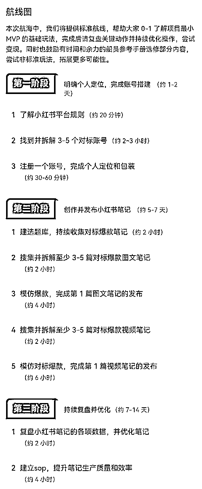

航线图和手册是高度关联的，因此你可以根据自己所在的环节，进行相关步骤的学习。

以上阶段中，所有的航线图步骤建议大家在航海前两周完成，完成航线图的所有动作后，建议以实践为主，持续发布笔记、总结爆款经验、提高笔记质量，扩大自己涨粉变现的概率。

必修篇：搭建小红书账号和内容

💡

章节概要在这一章节，我们将从认识小红书平台开始，一步步带你完成小红书运营的学习。你可以根据本章的步骤内容进行实操，一步步跑通小红书运营的最小 MVP，即完成小红书账号搭建、发布内容并建立内容体系。

在这一章节，我们将从认识小红书平台开始，一步步带你完成小红书运营的学习。你可以根据本章的步骤内容进行实操，一步步跑通小红书运营的最小 MVP，即完成小红书账号搭建、发布内容并建立内容体系。

如果你是本项目新手，建议在正式实操前，先初步了解下项目全貌：

✅【项目概述】了解小红书项目

如果你对项目整体有了大致了解，就可以按照项目核心步骤，开始学习实操：

✅【项目实操 1/3】明确个人定位，完成小红书账号搭建

✅【项目实操 2/3】创作小红书笔记

✅【复盘和优化 3/3】持续优化迭代，搭建内容体系

在必修篇，航线图和手册顺序相对应，你可以按照手册的顺序进行学习，即可逐一完成航线图的每一个任务。

在后续的每个关键步骤的章节概要中，我们也将提到相关航线图，提醒你完成相关步骤。

接下来就正式开始吧！

# 一、【项目概述】了解小红书

💡章节纲要

章节纲要

本次航海的重点，就是告诉大家如何从 0-1 做出一个小红书账号。

想做出一个成功的账号，了解平台是基础。

谈起小红书，很多人的传统印象基本都是：“搞美妆穿搭的”、“只有女生才会看才会用”、“都是 00 后”。而实际上，小红书早已不是单一的美妆穿搭社区了，如今的它非常多元。

本版块中，我们从用户画像、热门类目、社区属性、流量机制 4 个方面，为大家对小红书的平台进行了介绍，希望能帮助大家更好地了解小红书平台。

## 1.1 用户画像

截止 2021 年下旬，小红书用户年龄集中在 18-34 岁，以女性用户为主，占比 70% 左右。多数都是分布在一线和新一线城市的都市白领、职场精英。“年轻”、“女性化”、“有钱”依然是该平台用户的三大标签。

值得关注的是，现在越来越多男性也开始加入这里分享生活。相对于 2020 年，2021 年男性用户占比从 20% 上升到 30% 左从用户需求来看，关注焦点排在前三的依然是彩妆、护肤、穿搭。但追求品质生活的都市精英们，正在衍生越来越多的需求。除了美妆穿搭，不做黄脸婆做辣妈，追求生活仪式感，培养多个兴趣爱好，打造自律又治愈的人生......其实也是他们的日常。

从用户需求来看，关注焦点排在前三的依然是彩妆、护肤、穿搭。但追求品质生活的都市精英们，正在衍生越来越多的需求。除了美妆穿搭，不做黄脸婆做辣妈，追求生活仪式感，培养多个兴趣爱好，打造自律又治愈的人生......其实也是他们的日常。

小红书的内容板块也随着用户需求迭代，越来越多元，覆盖到衣食住行玩学习等多个方面。如今，家居家装、母婴、美食、运动健身、知识学习、旅游出行、绘画摄影手工、萌宠.....这些都是新兴热门板块，流量并不少。

## 1.2 热门类目

从用户需求来看，关注焦点排在前三的依然是彩妆、护肤、穿搭。但追求品质生活的都市精英们，正在衍生越来越多的需求。除了美妆穿搭，不做黄脸婆做辣妈，追求生活仪式感，培养多个兴趣爱好，打造自律又治愈的人生......其实也是他们的日常。

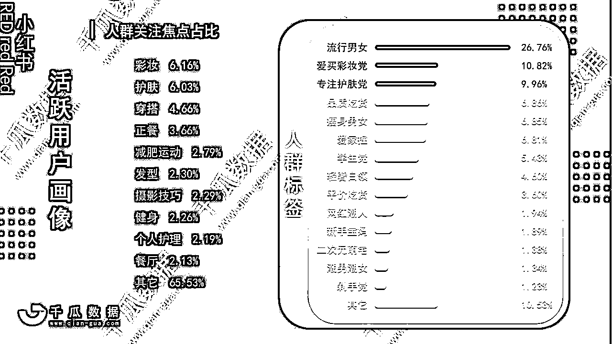

小红书的内容板块也随着用户需求迭代，越来越多元，覆盖到衣食住行玩学习等多个方面。如今，家居家装、母婴、美食、运动健身、知识学习、旅游出行、绘画摄影手工、萌宠.....这些都是新兴热门板块，流量并不少。

## 1.3 社区属性

小红书的定位和属性从口号中就可以体现出来——“标记我的生活/你的生活指南”。它是一个生活方式内容社区。同时，它也是一个内容种草平台。用户一边在小红书分享自己的生活方式，一边“给别人种草”，或者“被别人种草”。

无论哪种属性，都离不开“内容”。你可以分享真实的自己，越接地气越好，但它不是微博也不是朋友圈。即便分享真实生活，它对内容也是会筛选的，同时被平台和用户认可的内容才有出圈机会。

## 1.4 流量机制

小红书平台有两个最核心的流量来源：【推荐流量】+ 【搜索流量】

### 1.4.1 推荐流量

跟很多公域平台一样，小红书也有算法推荐机制，系统会根据你笔记的初始点赞、收藏、评论、转发分享、转粉数据来打分，评论、转发和转粉这三个的分数占比较高。

CES 评分 = 点赞数 x 1 分 + 收藏数 x 1 分 + 评论数 x 4 分 + 转发数 x 4 分 + 关注数 x 8 分

PS：CES 为小红书的内部评分体系。

当你的笔记分数越来越高，就会一级一级被系统推荐到更大的流量池，成为爆文（小爆款互动量 1000+，大爆款 10000+，不同类目有所不同）。而这篇爆文还会带动其他笔记的整体数据增长。当然要先满足这些前提：

① 你的笔记经过系统审核，没违规，没被系统删除或者没被你删除/隐藏。

② 你的笔记有关键词（比如香水、家具），能对应垂直标签，能被系统识别收录，推荐给喜欢看相应标签下的目标人群。

③ 你的内容质量本身不错，能吸引用户来进行赞藏评等互动。

特别提醒下：

一般 0 基础新手很难发第一篇就能获得大爆款；在运营的第一个月，新手笔记的小眼睛（即阅读量）停留在 100-200 都很正常，基础好的出效果会快一些。

80% 新手都在第二或第三个月开始才迎来爆发，有酝酿期，所以不用太心焦，耐心打磨好内容。

### 1.4.2 搜索流量

小红书平台的用户除了来主页逛逛，还会通过搜索找到自己想要的内容。比如想买口红，会搜口红攻略；想去哪儿旅游，会搜旅游攻略。

搜索结果排名靠前的笔记，会获得更多曝光和关注。这部分流量近乎占据总流量的 50% 以上，不容忽视。

要想获得搜索流量，首先你的笔记要包含有效关键词，且被系统成功收录；要想搜索结果排名靠前，你的账号权重和笔记权重要持续提升。

要想搜索结果排名靠前，你的账号权重和笔记权重要持续提升。

内容来源：《初阶 | 小红书-爆款笔记｜航海实战手册》

# 二、【项目实操 1/3】明确个人定位，搭建小红书账号

💡

章节纲要

对于刚开始做小红书的圈友，定位就是我们要解决的第一个问题，这也是之后整个小红书账号的主线，后续的内容围绕这个展开。

在小红书上，你可以分享各种各样的好物和知识，也可以给别人种草某种“生活方式”。但种草不等于像淘宝一样发硬广，除非你是企业号。用户普遍更喜欢真实感强、接地气的 IP 和内容。

所以，如果想在小红书上建立 IP ，一个良好的人设定位是必不可少的。建议给自己 2-3 天的时间，认真完成自己的人设定位。

💡本章航线图

本章航线图

完成本章节的学习和实操，即可完成航线图的第一阶段：明确个人定位，完成账号搭建（约 2-3 天）

1.

了解小红书平台规则（约 20 分钟）

2.

找到并拆解 3-5 个对标账号（约 2~3 小时）

3.

注册一个账号，完成个人定位和包装（约 30~60 分钟）

现在就开始吧！

## 2.1 如何进行账号定位

### 2.1.1 IP 定位的重要性 @梨云

小红书里很讨用户喜欢的 IP 人设都是有人情味的。除了找到细分领域，还要挖掘身上的各种标签，这些标签也必不可少。大家可以参考一下圈友 @梨云 的经历，来看看她对于人设重要性的思考：

就在我每天以千粉增速一路狂奔的时候，我遇到了一个抄袭狂魔。

连名字都和我一样叫学习方法，而且每篇都原图搬运，搬了 30 篇，涨了 3 千粉。

我本来觉得无所谓，但我的粉丝看不惯，拉着其他人组队去刷屏他的评论区，逼得他关闭评论区，后面直接举报到账号限流。

通过这件事，我突然意识到，我不能像一个营销号，只是分享干货，我得注入自己的人设，粉丝喜欢的不是内容，而是我这个人！内容谁都可以写，但我独一无二！

于是，我做了两件事，加入人设、强化人设。

加入人设，具体怎么做？比如把账号名字改成云云讲学习方法，图片中不写“我”而说“云云”，为了提高搬运成本，我还把封面上小标题的英文打上了自己的文字水印。

强化人设，其实就是做粉丝运营，比如每条评论区必回复，而且无论粉丝留言好坏，我都给予最正面的反馈，只有鼓励，没有批判，在评论区提供情绪价值，粉丝粘度就会非常高。

写内容的时候，要做最懂粉丝的人，你理解他们的痛，那种痛不是挠痒痒的痛，是痛到不能再痛，是会呼吸的痛，是长期的痛，是中华上下五千年的痛。

方法就是多泡评论区，看粉丝说的话，尤其是抱怨。

于是，在那些高频出现的词汇中，我深深地理解了他们，学习很无聊、上课老走神、背书记不住……

只要绕着这些点，写解决方法，提供价值干货，绝对能够深受粉丝喜爱。

没有站在粉丝的立场去思考，只是为了博取粉丝的流量而去写，是无法创作出打动人心的内容，也没有办法赢得人心的。

我现在，越来越觉得这句话真的太牛逼了：从群众中来，到群众中去。

内容来源：《小红书三个月涨粉 17w，变现 10w+，我做对什么？》

### 2.1.3 从自身优势出发，完成定位 @吴一村 @许义

做任何平台的 IP ，做号前都得先想好自己的目的，是纯兴趣分享为爱发电，还是为了搞钱？搞钱是想搞短期的还是长期，小钱还是大钱？副业还是终生事业？这些都会影响你的方向选择。

先想好目的，定好大方向和赛道，然后再从自身出发优势出发，做出差异化定位。

注意：“优势"未必就一定是专家学者，普遍看来，小红书对普通人更友好，用户也更喜欢接地气的博主。

“差异化”也未必就是指一定要别人没有的、全世界独一无二的。在别人的基础上做出优化，比如：图片比别人家美，或者内容比别人有趣，对很多用户来说就是差异化了。

可以考虑这几个维度：你是谁？你干什么的？为什么关注你？对我有什么用？再展开一下，就是：

我很独特 eg：去过 80 个国家

很厉害（有背书、我很专业）eg： 携程签约摄影师

我是谁，做什么的，我能提供什么 eg：90 后川西旅拍领队

我和别人有什么不一样 eg：90 后的年轻组织 纯玩小团旅行

为什么关注我 需要一目了然+定位+内容垂直且专一不发散+关注理由

为了更深度挖掘自己的优势，做出差异化，可以从以下几个方面出发：

1.自身具备的、符合用户需求的兴趣、技能 @吴一村

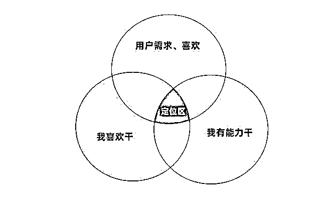

喜欢是好事，并这不代表你能胜任内容输出，所以还要在自己在有能力干和用户需求中找到一个聚焦点，这个点才是好的定位。

很多新人定位都是直接找自己喜欢做的事，觉得别人做这事能成功，自己肯定也能成功。但是做完之后发现数据反馈很差，这是因为用户只关心她自己，你喜欢的不代表别人也喜欢。所以我们一定不能自嗨，一定要关注用户的需求。

除了挖掘自己喜欢、有能力干、用户需求的事情外，最重要的是要以此来定技能。

什么叫定技能？就是你会的，你擅长的一项东西，你可以很轻松容易地分享给他人。

比如：摄影技能、美食营养技能、健身、赚钱技能等等。

内容来源：《14 天从零变现 1000+，适合新人的小红书赚钱定位攻略分享及避坑指南》《小红书 3 天新号粉丝破千的运营方法论》

2.自身的外观优势 @子渝

你长得好看，你身材很棒，你成功减脂后特别美&瘦，你很会穿搭等等，都是你的优势点。

内容来源：《中年宝妈“996”下班后当职场博主 聊聊我小红书从 0-1 到变现的过程》

3.自身的资源优势 @子渝

资源优势可以是物品、货源渠道，也可以虚拟的、信息差；还可以是身边的环境。

比如：你的家里特别好看，囤了特别好好物，这是一种资源，家居博主就能用到。

比如：你本身就是踢脚线厂家，可以提供家装材料的批发、零售，这是一种优势。

比如：你很懂得如何布置学习桌面，还研究过超多桌面好物，那你可以当个桌面好物学习博主。

比如：你能找到别的学生党都好不到的信息渠道、学习资料、靠谱的教程等等。

内容来源：《中年宝妈“996”下班后当职场博主 聊聊我小红书从 0-1 到变现的过程》

4.自身的特色优势 @子渝

什么是特色优势呢？独特口音、地域优势、奇特的发型、想被别人借走的一双巧手，这都可以成为特色优势点。

建议优先考虑能提供价值，且用户有需求的点（擅长点+用户需求），再去考虑兴趣爱好和其他方面。

做小红书是一个不断发现自己优势的过程。不论是在职工作还是全职宝妈，都能找到一些自己有特点的地方深挖。可以通过列出自己热爱的、自己擅长的和用户需要的。找到交集大概率就能找到自己的亮点所在了。

内容来源：《中年宝妈“996”下班后当职场博主 聊聊我小红书从 0-1 到变现的过程》

## 2.2 寻找&拆解对标账号

### 2.2.2 如何判断对标是否合适你

我们在寻找对标时要注意筛选，不要看到明星、KOL 就盲目拿来对标，不是每个博主都适合你模仿参考。你们可以根据以下维度来衡量筛选：

1）类目定位

该博主的领域细分类目是否跟你相同或相似，比如，穿搭博主去对标美食博主就不太适合。另外，小众领域比较难找到完全一样的对标，一般可以参考领域相似的类目博主。

2）变现模式（变现效率、变现空间、你是否有能力或潜力做到）

纯博主和精准引流博主的内容规划和倾向是不一样的，因此找对标时要研究下这个博主的变现模式是什么：接广告，自己引流到私域带货或卖课程？是否跟自己目前或未来的变现模型相似？

3）粉丝级别（近期涨粉快的；或者本身粉丝不少，腰部比头部更值得对标）

看对标要留意粉丝级别，不要太少也不要太多，尽量选近期涨粉快的，或者起号迅速的。

对于小红书新手来说，腰部博主（粉丝 10 万+）往往比头部大博主（粉丝 50 万+）、明星博主更值得参考对标。头部的多数都被签到 MCN 旗下，有团队一起包装的，个人很难达到这种高度。

被签到 MCN 旗下，有团队一起包装的，个人很难达到这种高度。

4）IP 内容调性

筛选对标博主要快速浏览他的主页内容，看下它的内容调性跟你的 IP 吻不吻合，你有无能力模仿输出相似的内容。难度太高、难以模仿的可以考虑放弃对标。

5）点赞比例 @星月

单篇点赞比总粉丝数多的笔记更值得借鉴，并不是点赞越高，代表笔记越好。还是上面说的，粉丝量高的账号会拉高笔记数据。

在刷对标的时候要多留意一些点赞数据看起来不是那么火的笔记（100-1000），一定要点进去看看他的账号粉丝量，而不是只看到那些点赞 5k、1w 的笔记才进去看。很多笔记 5000、1w 点赞，粉丝数 10w 、8w 的，这种数据参考意义不大。

把这些低粉高赞的笔记收藏起来 或者专门建立自己的选题库，这些都是自己源源不断的爆款素材

6）一个账号有多篇爆款 @星月

大家都知道 爆款具有偶然性。

一个账号出现一个爆款可能是因为运气成分，还不足以判断是否值得对标。但是持续出现爆款的话一定是有爆款基因的，可能是封面，也可能是选题。

7）时间距离 @星月

借鉴最近一个月做起来的笔记/账号会更有意义。

这个就要说到热度这个词了，在自媒体平台，热度比什么都重要。你会发现冬天搜羽绒服的多，情人节搜礼物的多，最近甲流、感冒药热度高。

你会发现不同时间段的热度词都是不一样的，所以要找最近、最热的账号或者笔记来做对标。值得一提的是，不同的关键词，除了市场反应，平台在给热度这方面也会随机宠粉。我们需要关注的是最近火起来的内容，尽量迎合平台的推流 。

1 个月是大概时间，也不是那么绝对，原则就是最好是近期爆发起来的。一周内是最好的，如果是 3 天内的那就更好了，还热乎呢！哈哈～

内容来源：《初阶 | 小红书-爆款笔记｜航海实战手册》《爆款对标账号 6 要素》

1.名字：云云【名字】+讲学习方法【账号提供的内容方向】

2.简介：

核心标签是：学霸&卷王|研究学习方法 3 年|幽默风趣

提供的内容是：学习干货|提分技巧|四六级|好物分享

更新频率是：1 天 1 个

第二步，看内容选题。

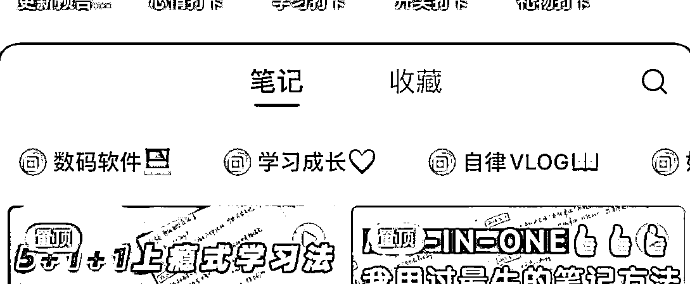

可以看账号的笔记分类文件夹，做的好的博主会像运营杂志一样运营自己的账号，

文件夹分类就像杂志的专栏一样。一般一个专栏是一类主题，会持续更新。

卖货：在主页点击【店铺】或者【专栏】，也可以蹲博主的直播，可以直接判断博主是否有带货变现。

二看文字区，有没有明说或者暗示，如图是一个明钩：我有电子版，你们拿了可以打印。

二看文字区，有没有明说或者暗示，如图是一个明钩：我有电子版，你们拿了可以打印。

三看评论区，有没有清一色的评论，很明显。你甚至可以去体验同行，充当粉丝领取资料，看他下一步的动作。

内容来源：《定位一换涨粉过万，如何利用数据分析在小红书精准定位》

## 2.3 如何包装账号

💡

小节纲要

拿到对标账号的信息后，我们就可以参考来做自己的账号啦！

一个有吸引力的小红书账号，往往会在头像、昵称、简介、背景图等方面进行账号包装。磨刀不误砍柴工，用户能从你的包装中看出账号风格、定位、功能与基础价值，这也在一定程度上决定，你是否值得 ta 关注。

如果不知道从哪些角度进行包装，不妨检查一下这些方面：

✅头像

✅昵称

✅简介

✅背景图/瞬间

✅主页风格

快开始你的小红书账号变身之旅吧。

### 2.3.1 头像

跟你的人设形象吻合即可，长得不错的建议用真人头像，容易建立信任感。

如果不想用真人头像，用虚拟 IP 形象也可以。

制作方式：可以使用图怪兽等网站来进行图片的制作，将满意的图片作为头像。又或者找些无版权的图片：

图怪兽：https://818ps.com/可画：https://canva.com/

可画：https://canva.com/

创客贴：https://www.chuangkit.com/

注意事项：注意避免使用容易侵权的商标类图片。

### 2.3.2 昵称

有辨析度、好记、有趣的名字，专业属性标签最好能加，更有辨析度和真实可信。不要用复杂的符号或特殊语言。

有以下 4 种公式可作参考：

昵称 + 个性：大鹅的七七八八

昵称 + 地区：姚老板在北京

昵称 + 专业：跟着拆哥看房

昵称 + 价值观：阿鱼爱学习

### 2.3.3 简介 @蓝子鱼

一个写简介的公式：

你是谁

你做过什么牛逼的事

关注你有什么好处，或者分享哪些领域的内容

有的账号出了上万点赞的爆款，但是粉丝只有 100 个，主要是账号内容不垂直，且个人简介没有写好，没有给粉丝关注的理由。

所以，写简介的时候千万不要谦虚，如果你不能展现出可以给粉丝提供的价值，那他们凭什么关注你呢？

内容来源：《新手做小红书打卡，一周涨粉 5.2 万，变现 6000+，引流私域 1500 人，简单可复制》

### 2.3.4 背景图 / 瞬间举例：

举例：

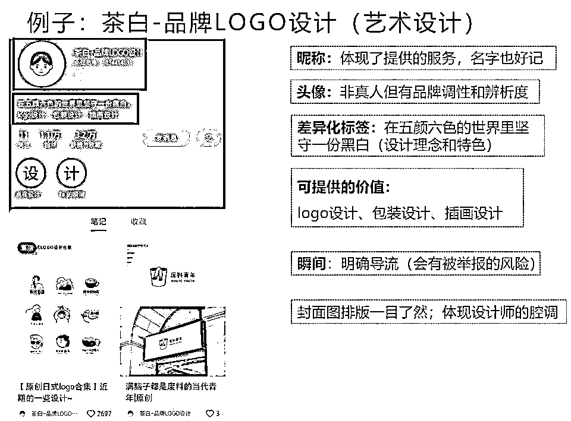

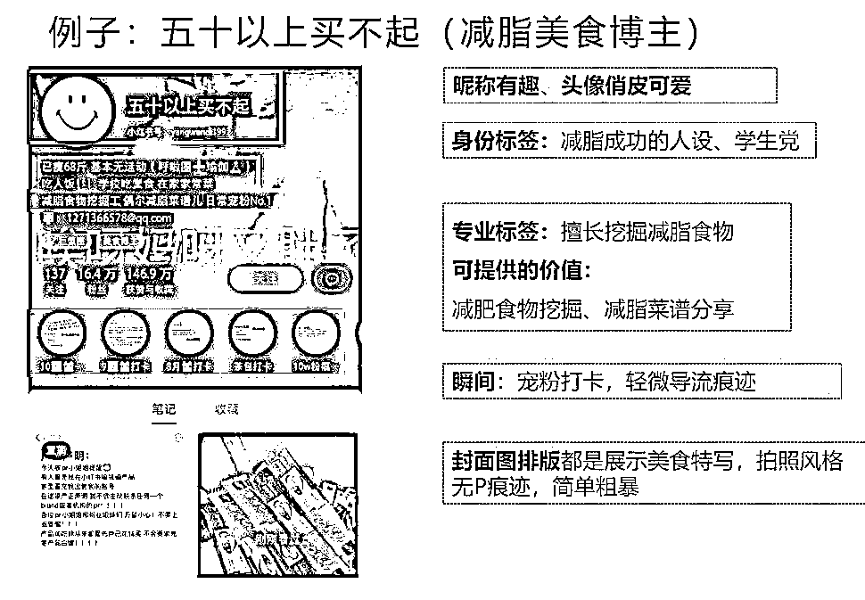

# 三、【项目实操 2/3】创作小红书笔记

💡

章节纲要

想要创作出优质的、数据好的小红书笔记。

1.需要知道用户喜欢什么样的内容，投其所好是高质量笔记的必备条件。

2.知道如何根据用户需求挖掘选题，并建立选题库。

3.制作并发布自己的图文 or 视频笔记。

这一章，我们也将从这几点，手把手教大家如何从 0 开始创作小红书笔记。

💡

本章航线图

完成本章节的学习和实操，即可完成航线图的第二阶段 创作并发布小红书笔记 （约 5-7 天）

1.

建选题库，持续收集对标爆款笔记（约 2 小时）

2.

搜集并拆解至少 3-5 篇对标爆款图文笔记（约 2 小时）

3.

模仿爆款，完成第 1 篇图文笔记的发布（约 4 小时）

4.

搜集并拆解至少 3-5 篇对标爆款视频笔记（约 2 小时）

5.

模仿对标爆款，完成第 1 篇视频笔记的发布（约 6 小时）

那么现在，就请开始完成这几个步骤的筹备吧。

## 3.1 小红书的用户喜欢什么样的内容

小红书本质上是个内容种草平台，而种草不是指跟淘宝一样发硬广、发产品图，或者发一些泛娱乐的内容。想要获得用户喜欢，让他们为你的笔记买单，你得先理解他们的需求想法和行为逻辑。

目前的小红书用户主要有两种需求：

一种是购买物品或服务的需求；

一种是获得免费或付费知识的需求。

而他们的行为逻辑一般也分为两种：

一种是有目的搜索——看分享和攻略——被种草——去下单。

比如突然想买品牌口红，来搜别人的体验分享评价和攻略，看准后去下单。这种多数就是有很强消费需求的精准用户。

还有一种是闲逛的，随便看看。如果系统推荐给他们的内容分享刚好不错，他们也会被种草，然后去下单。

而无论哪种，他们都是先有目的或兴趣驱动，然后通过有价值的内容被种草，再做出下单等消费决策。

那什么是有价值的内容呢？一般用户喜欢阅读并点赞/收藏某个笔记，甚至直接去买单消费，是因为这个笔记给他们传递了两种价值之一：情绪价值或者实用价值。

### 3.1.1 满足用户情绪价值的内容

情绪价值很简单，也就是情绪共鸣、沉浸式五官感受。

比如你看了独居生活 vlog，会觉得内心治愈放松，向往这种生活甚至采取行动模仿；

比如你看了艺术体验类的视频，会觉得作品很美、过程很享受，你可能也会跟风去店里体验一下；

比如你看了某个博主的 room tour（带你逛逛我的家），欣赏了整洁又美美的家，会忍不住想复刻别人家的装修，或者被里面的家居好物种草。

这些年 vlog、room tour 这么火的原因也跟它传递的情绪价值有关系，场景沉浸式“种草”显得很自然，带货效果都特别好，不过这类内容对视频输出能力要求较高。

优质案例参考：

《30 岁前 拥有了自己的理想小家🏠》

roomtour 笔记代表，作者用 vlog 形式给带大家云参观自己的家，装修很好看。评论区大波用户被种草她家的家具、软装饰品等，很方便植入软广。

《梦想中的家 | 擦窗机与日落时光 欢迎来我家》

这也是 room tour 笔记，这位作者几乎大部分视频都是带大家云参观每个角落，氛围感很绝。这篇还是偏硬广一些的笔记，但大家依然被种草了，评论区有不少问擦窗机链接。

大家依然被种草了，评论区有不少问擦窗机链接。

《vlog 日常｜30 元也可以做仪式感一日三餐》

这篇是日常做菜美食 vlog，很有沉浸感，让人向往这样的美好生活。评论区很多用户被作者的餐具、厨具种草。

《Tufting 初体验丨做一个超可爱大汉堡🍔》

这是线下艺术手工体验的过程记录视频，非常可爱有趣，很多用户都在评论区相约一起去体验～

### 3.1.2 满足用户实用价值的内容

什么是满足使用价值的内容呢？简单来说就是用户看了笔记后，觉得有用、有帮助、带来收获感。

要么是给用户推荐了好物或好玩有趣的地方，帮他省时省钱省力；要么是给用户提供了知识，让他涨见识、有收获、有成长。

在小红书平台，少部分用户是为了娱乐放松，大部分都是为了寻找对自己有用的内容，消费意向很强烈。

比如你想买口红，你会去找口红种草、测评、选购避坑指南等内容；

比如你想学做菜，你会去搜美食菜谱、食材厨具选购指南等内容；

比如你想知道如何升职加薪，你会去搜职场加薪攻略来参考学习；

比如你准备装修自己的家，你会去搜家居好店推荐合集、装修攻略、装修避坑；比如你本身是从事法律、心理等咨询类工作，也可以尝试在小红书发布咨询类笔记，参考：风向标-小红书法律号

比如你本身是从事法律、心理等咨询类工作，也可以尝试在小红书发布咨询类笔记，参考：风向标-小红书法律号

比如你熟悉职业教育赛道，可以尝试做职业教育号，参考： 风向标-小红书职业教育赛道

比如你熟悉运营、熟悉知识付费方向，可以尝试小红书电商运营课，参考：风向标-小红书电商运营课

比如你是位宝妈，科普育儿知识，信息差育儿号可以尝试，参考：风向标-小红书信息差育儿

比如你喜欢整合闲置 ，或许可以尝试做同城闲置资源号，参考：风向标-小红书同城闲置资源

新手起号阶段可优先做实用性的内容，比较好上手也更容易出爆款笔记，有利于提升账号权重。

内容来源：《初阶 | 小红书-爆款笔记｜航海实战手册》

## 3.2 如何挖掘选题

了解小红书用户的喜好之后，我们进入到选题阶段。

选题是内容创作的第一步，也是非常有意思的一步，在寻找选题的过程中，你会发现很多新奇反常识的内容，也会发现很多真知灼见怎么没早点看到的内容，不用羡慕，在大家熟练掌握选题技巧后，也可以和这些博主一样，策划出特别的选题，创作出非常好的内容。

这里，我们将会给出适合新手快速上手，且比较好用的一种挖掘选题方式——关键词搜索法。

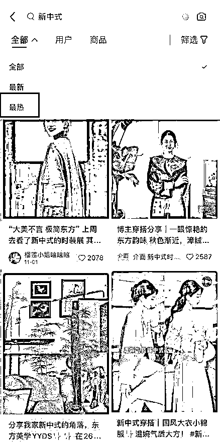

想限定笔记类型，还可以点击【筛选】，选【视频】或者【图文】。

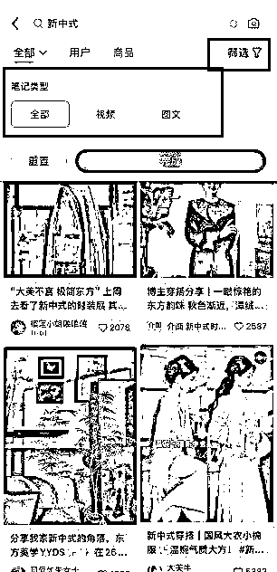

在筛出的笔记中，我们优先找低粉爆款。看到数据好，点进达人主页，看她的粉丝量，万粉以下最好。其他也可以参考。

当我们能想到的关键词有限时，还可以借助搜索栏的关键词推荐。

搜索栏下拉关键词

比如，搜“新中式”，搜索栏会自动下拉很多个关联词，比如新中式别墅、新中式卧室等等。

这些下拉关联词的排序不仅仅是根据笔记数量来排序的哦， 还会根据用户主动搜索频率和系统推荐热度来进行综合排序。

你搜索过后，重新打开搜索栏会有三个地方出现关键词

搜索栏：比如之前搜索“新中式装修”，再点一下搜索栏会出现一个默认的关键词“新中式轻奢装修”

猜你想搜：这里会展示你经常搜索或关注的关键词以及关联词

搜索发现：最近平台搜索次数最多的热词，有时候可以通过这些词蹭热点

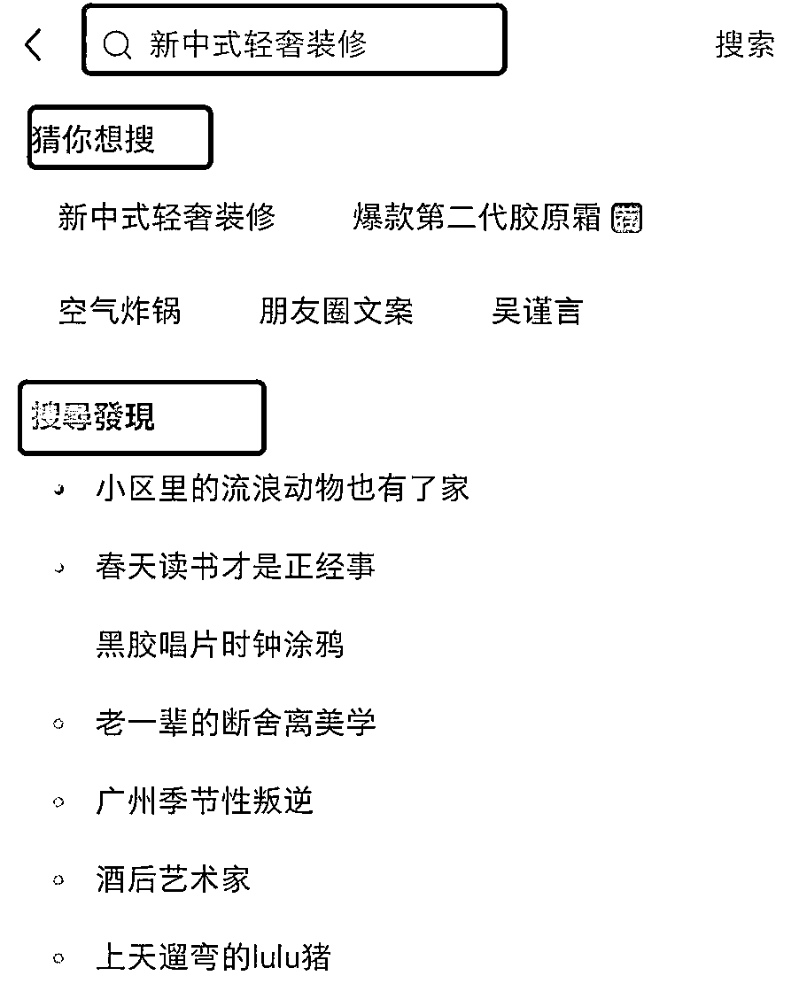

3.

搜索结果中的关键词标签和相关搜索

当你搜索某个关键词，搜索结果页面会出现一行关联标签来对搜索结果进行分类。 此外，下拉还会发现一个“相关搜索”，会出现 4-5 个搜索词的关联词。你可以从中选几个前排词语组合来做选题切入点。

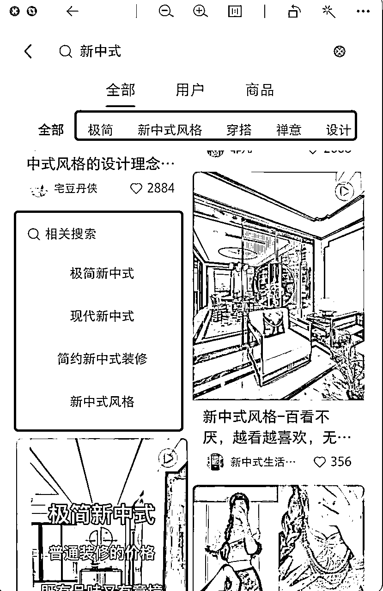

通过这三种方式看到的任意关键词，都可以点击它进入主页，再次选【最热】，搜出来的就都是热门笔记啦。

这种方式挖掘到的选题足够我们用了。你入门之后，如果还想了解更多选题挖掘方法，可以看选修篇——【5.2 更多挖掘选题方法】

## 3.3 如何制作小红书笔记

### 3.3.1 确定小红书笔记类型

💡

小节纲要

要创作笔记，首先需要选择笔记类型。主要包括图文笔记和视频笔记。

图文笔记是小红书上最常见的、数量最多的，只需要写内容、制作图片，对新手来说比较友好；

视频笔记的曝光率和涨粉率比图文笔记高，也是目前官方扶持的，对打造 IP 来说效果更为突出。但需要写内容、录制、剪辑，需要的技能更多，制作难度更高。

剪辑，需要的技能更多，制作难度更高。

如果你刚开始创作内容，建议可以先从比较简单的图文笔记开始，打磨文案能力，快速获得正反馈。再逐渐尝试录制视频、剪辑。

### 3.3.1 图文笔记

图文笔记，就是图片和文字类笔记。

它们的优点是直观清晰，可以快速提炼出重点，也比较带有总结性，很适合新人上手操作。缺点是同质化很严重，不够真实，对打造个人 IP 的帮助不如视频笔记，流量也不如视频笔记。

### 3.3.2 视频笔记 @Zora。 卓然

视频笔记，目前在小红书上也算是比较常见的了。对比图文笔记，视频笔记存在的几个优势：

1）让用户更有交流感

用户因为某个疑问或兴趣点开了你的笔记，然后你分享着自己的经历和观点，有画面、有声音，相比图文表达上也更加口语化，让用户感觉你们就是在面对面交流，缩短了距离感

化，让用户感觉你们就是在面对面交流，缩短了距离感

2）更容易形成个人 IP

因为有具体的音画，用户通过一个个场景来了解你这个人，会让用户更有真实感，形象更立体，容易形成个人风格，因此这个建立人设的过程更加容易，根植在用户心里的你的形象也更深刻

3）流量扶持

随着短视频的发展，小红书平台对视频笔记也会有一定的流量支持，所以短视频内容会获得更多的曝光量，对比之前发图文，几十篇才有那么几篇是上千的，航海期间我发布了 6 个视频，其中 5 个曝光量都是 500 以上，并不是说这个数据多漂亮，而是对比图文，起码我小眼睛上来了。

4）同质化情况少，不容易被搬运

比起图文容易被“像素级模仿”，视频因为制作成本相对较高，因为同质化情况更少，不容易被模仿，因此带来的粉丝粘性也更强。

视频笔记的门槛比起图文，视频需要写脚本、拍摄素材、配音、剪辑，因此花费的时间、成本肯定是更多的，但接下来我也会分享一些我的方法，来解决这些问题

比起图文，视频需要写脚本、拍摄素材、配音、剪辑，因此花费的时间、成本肯定是更多的，但接下来我也会分享一些我的方法，来解决这些问题

2）5 秒定律

最初的 5 秒没有抓住用户的眼球，可能就会被划走，影响完播率。因此刚开始的脚本如何策划就显得尤为重要。这里可以参考前几天大芝的分享：走差异化的路线

3）内心有卡点

很多小伙伴觉得自己不好看，或者声音不好听，对拍视频有渴望的同时也有抗拒。这里想给大家说，完全不用担心，因为并不是一定要拍露脸视频，以下几类视频给大家参考⬇️

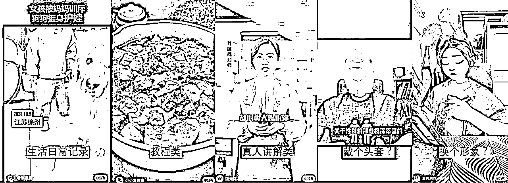

大家可以发现，拍视频并不直接等于真人出镜，不想出镜的方法千千万万，一样也可以做出自己的风格。

大家可以发现，拍视频并不直接等于真人出镜，不想出镜的方法千千万万，一样也可以做出自己的风格。

对新手来说，最好的方式是先用图文笔记训练选题和内容创作，等有了比较多的运营经验和时间之后，再慢慢尝试做视频笔记。

总的来说，图文更适合种草，视频更适合立人设。做视频还是做图文，归根结底还是看你自己的需求。

内容来源：《新手起号也能做的视频笔记》

### 3.3.2 四步制作发布笔记

💡

小节纲要

下面，我们将正式进入笔记制作环节。包括这四个步骤：

✅制作内容

✅取标题

✅制作笔记封面

✅发布内容

新伙伴们建议从模仿对标的爆款开始，尽快下场制作第一条内容，等积累一定的制作经验后，再开始完成自己的原创内容。

刚开始围绕着对标的爆款笔记来做，会比较麻烦，在 2～ 3 个小时左右。大概 1，2 周后，会逐渐熟练起来，1 个小时左右就可以生产 1 条图文笔记。

#### 3.3.2.1 第一步 制作内容 @杨星城

💡

小节纲要

内容框架主要针对笔记的正文内容而言，拥有爆款笔记常用的内容框架，可以极大的提升发布笔记的效率，节省时间，从而流出更多精力放在内容的创作上。

本小节，我们主要从开头、中间、结尾和评论区四个部分，给大家详细讲述了不同位置爆款笔记的创作方法。

本小节的案例都以图文为主，但视频文案是一样的道理，方法论和思路都是一样的。

如果你刚开始创作内容，建议可以先从比较简单的图文笔记开始，打磨文案能力，快速获得正反馈。再逐渐尝试视频笔记。

很多人喜欢把文字放到图中进行排版，但其实， 1 个封面+正文内容 构成的笔记也是可以获得很好的数据的。

当然，如果有一个思维导图汇总来作为第二张图会更好，不过没也没关系，不影响做出一篇爆款内容。

先通过两篇小红书来感受一下画风：

94 学会学习再学习发布了一篇小红书笔记，快来看吧！ 😆 8QcjFIYtVIZC0bJ 😆 http://xhslink.com/LEF0tg，复制本条信息，打开【小红书】App 查看精彩内容！

50 学习方法社发布了一篇小红书笔记，快来看吧！ 😆 BE1GMFb1Izi0O1F 😆 http://xhslink.com/R5U0tg，复制本条信息，打开【小红书】App 查看精彩内容！

接着来说一下内容框架的结构：

开头

中间

结尾

评论

开头格式

痛点引入+情景描述+人设+方法介绍+点赞诱导一定要记住这个格式，其实，小红书上 80%的笔记都是这个套路：

一定要记住这个格式，其实，小红书上 80%的笔记都是这个套路：

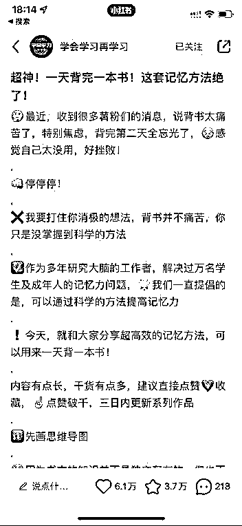

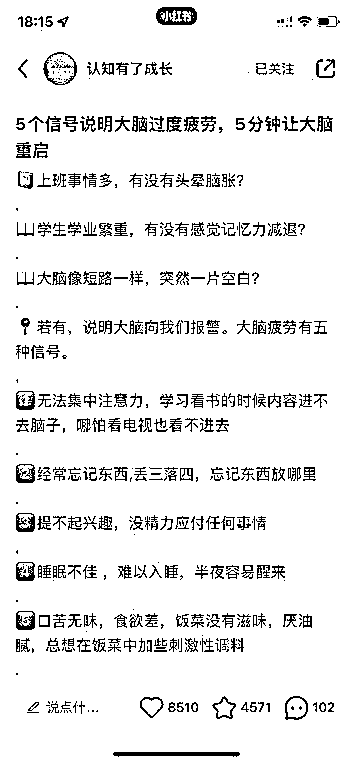

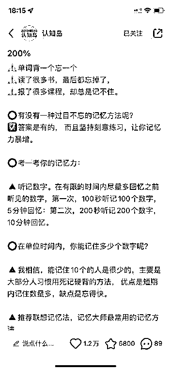

举个例子，如：记忆力差

很多同学花了 1 个小时去背书，但就总是背不下来，而且越背越没自信（痛点引入）

明明自己很想努力，但书本堆得像山那么高，都快背哭了还是记不住（情景描述最好能引起共鸣，你的案例相当是用户的案例）

作为多年研究学习方法的教育工作者（人设辅助），今天就和大家分享 xxx 方法，超级干货有效（方法介绍），建议直接点赞加收藏，方便后续反复查阅（引导点赞）

中间格式

中间其实就是讲知识点，最少 3 个以上，范围控制在 1～5 个左右。如果是汇总合集那种，就越多越好。

如果 3 个知识点当中，其中有 1 个知识点是重点讲，效果会更好。

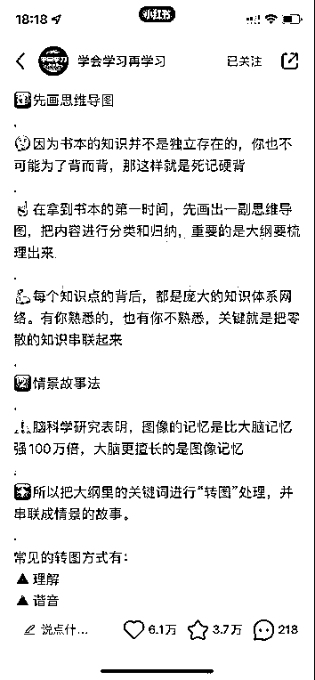

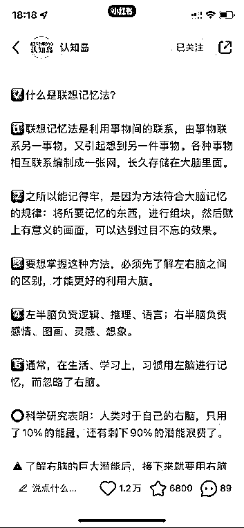

格式如下：

主题：背书特别慢怎么办？

方法：

1、xxx

2、xxx

3、xxxx

## 3.1 、xxxx

## 3.2 、xxx

## 3.3 、xxxx

结尾提高关注率

最后一个段落的结尾不要草草了事，要向用户透露两个信息：

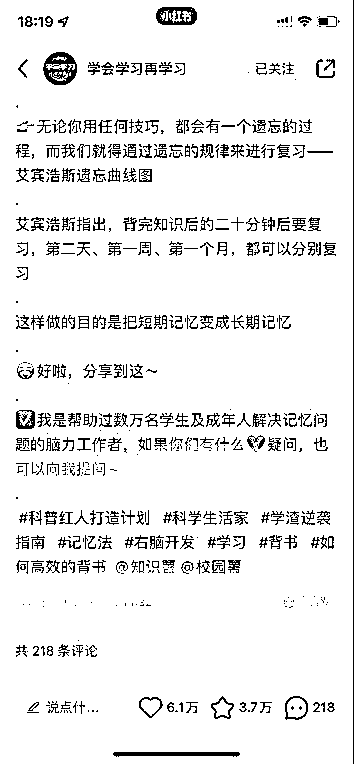

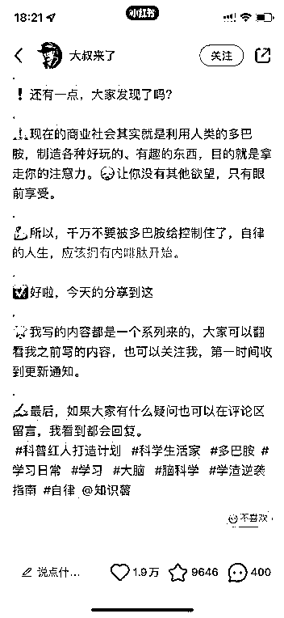

评论区

评论区置顶一段内容，话术可以为：

我写的内容都是一个系列来的，收藏夹已经准备好内容给大家（引导去主页）

可以从我第一篇笔记看起，你会学习到更多（因为用户从第一篇开始翻笔记，系统会出现“关注”功能）

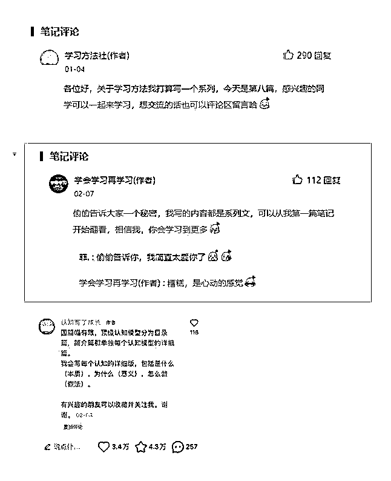

内容来源：《零投放从 0 开始，小红书 2 个月 8 万粉丝的实操经验分享》

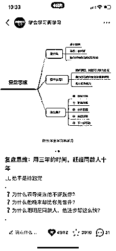

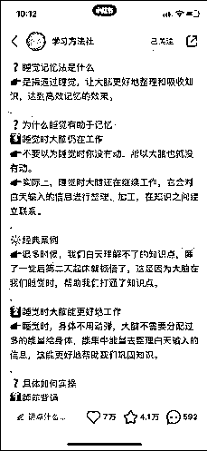

黄金圈三点法则：

why：为什么？是什么？

what：有什么用？（有什么好处）：

how：应该如何做？

举个例子：

主题：拖延症

why：为什么你做事总是拖拖拉拉？

痛点描述：明明有个很重要的任务要做，但总想最后一刻才去做。感觉自己很颓，很没用

what：拖延症是什么？

现象表述：拖延症的表现有 1...2...3....

心理学解释：“延迟折扣”：对于未来的奖励，人们更倾向于现在想要获取到的。

how：如何戒掉呢？

方法论：

1、xxxx

2、xxxxx

3、xxxx

注意：

正文的内容分段要用「。」来分段，不能用空格，用空格会被隐藏

正文多用表情包，让格式看起来有小红书风

正文字数最好写满，扣除标题和标签，其实也就 800 个字左右企业号是不可以用第一人称“我”的口吻去写产品使用感受的，否则平台会给笔记限流。

企业号是不可以用第一人称“我”的口吻去写产品使用感受的，否则平台会给笔记限流。

下面是我总结的一些图文制作小 tips：

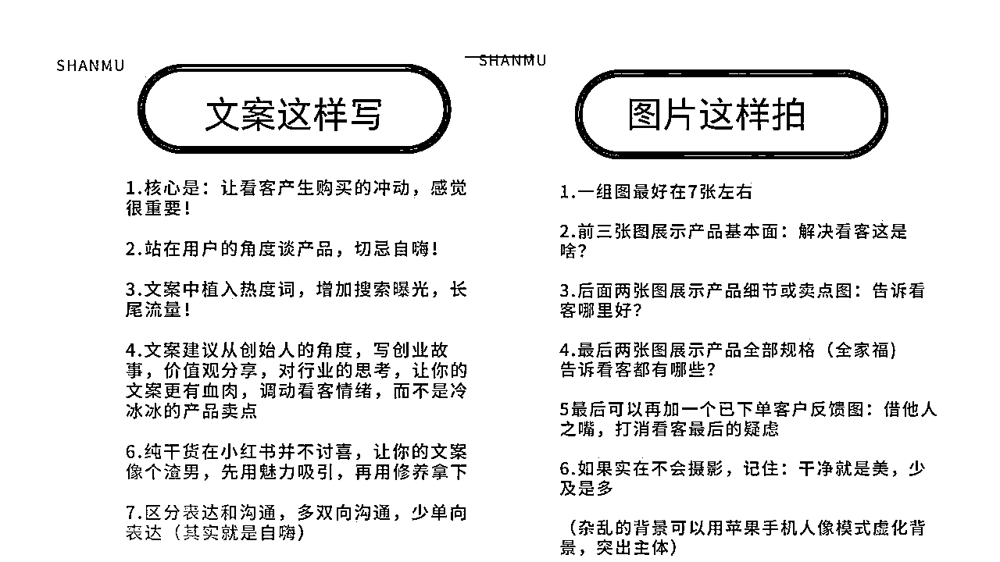

内容这块核心还是对标赚钱笔记写，这也是为啥我在找对标赚钱笔记花了如此多笔墨，因为这真的很重要。

这里分享一个我认为最能调动人情绪的，最容易产生询单的：故事体文案。

爱听故事是人的天性，尤其是在女性用户比例如此高的小红书平台，故事是调动你文案情绪的催化剂，一个好的故事可以既能比如：

比如：

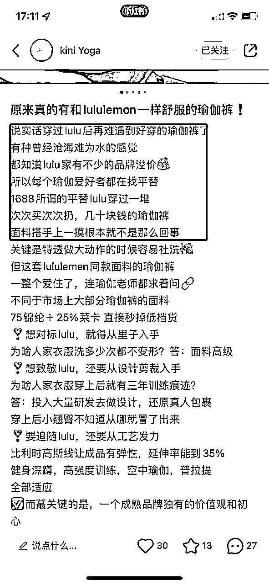

并在不同内容中反复提及（注意 slogan 别整的跟大牌一样喊口号，像什么 just do it ，来点实际的）

并在不同内容中反复提及（注意 slogan 别整的跟大牌一样喊口号，像什么 just do it ，来点实际的）

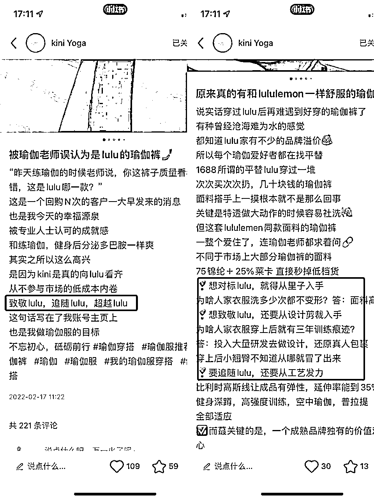

4）写销量。

利⽤⼈们的从众⼼理，明示或暗示产品「畅销」，不但能激发购买欲望，还能赢得读者信任。

举例：

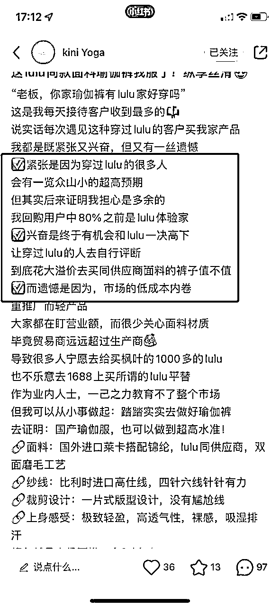

6）用沟通的口吻而不是你自说自话，单向表达

情绪得让读者感受到，才是成功的，别把自己写嗨了别人看完一脸懵逼，哪来的感觉？

虽然不能用第一人称（消费者角度）直接描写产品，但是在写这类内容的时候，还是要以一个具体的人，比如公司客服，创始人的角度去写。

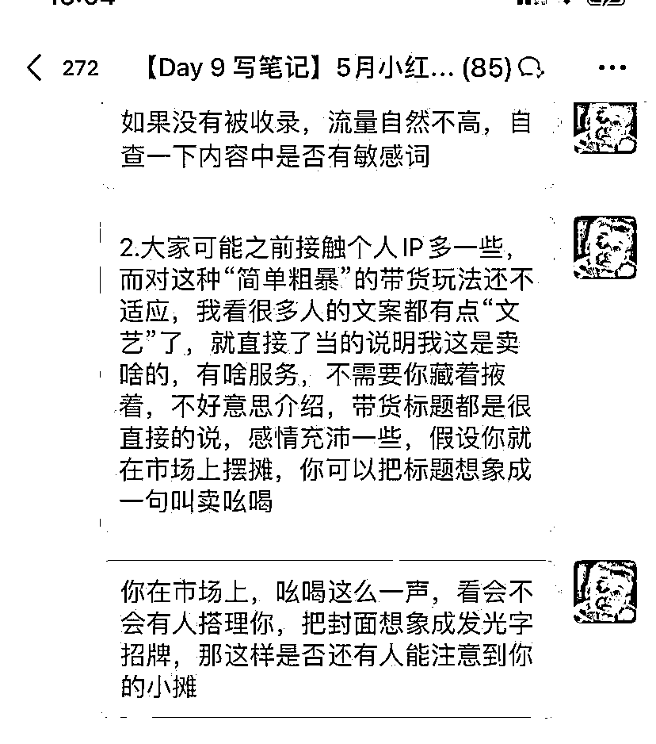

再来说下排版，这也很重要。再好的内容阅读体验差，别人都读不下去，效果肯定不好。

排版要干净利索，善用小表情符号，多用短句代替长句，整个文案写完后自己再读一遍。

逻辑要顺，阅读体验流畅。切忌大量文字堆砌，我一般都是一个句子一行，文案字数不宜过长。

展现类笔记可以无文案，或 100 字左右的短文案介绍产品卖点。

故事类笔记文案字数建议控制在 600 字左右。

内容来源：《我是如何通过小红书，两个月带货营收 30 万＋》

## 3\. 结构化内容 @梨云

我采用大标题、导语、小标题、内容、底部标题的排版。

大标题：可以是对本页内容的大概括，给读者预判信息，知道这一页讲什么，也可以每一页都统一，目的是埋关键词，提高检索权重，它也是重要的广告位，写品牌名字的地方。

导语：铺垫作用，写下出这篇笔记的原因，承担一部分共鸣作用，同时也可以利用导语进行行为设计，比如我会说“宝子投稿”来暗示大家积极在评论区投稿，用留言数拉动曝光增长。

小标题：是对内容的概括，用四个字压缩一句话，减轻读者阅读负担。

内容：一般不差过 3 行，要做轻内容，提升阅读愉悦感，在行文表达时，我会用上小红书平台女生们都喜欢的爆款流行语、最近火热的梗，让内容显得灵动活泼，大家都爱看。

底部标题：这是一个非常重要的细节，也是我实践中摸索出来的，很多人模仿我，就忽略了这一点。它的作用是以游戏化口吻引导对方翻页，减少读者因为对本页不感兴趣而退出阅读。

形式是借鉴游戏中的指令性表达，句式为：开始+动词、马上+动词。

这个技巧特别好用，给人一种想要不停往下翻的冲动，只要内容没问题，阅读时长有了，赞藏评的概率也会大大提升。

这一顿操作之后，我就开始发笔记，结果第一篇，就是破千的爆款。

除了上述标题形式外，也可以参考一下「反差」标题形式：风向标-小红书反差标题

内容来源：《小红书三个月涨粉 17w，变现 10w+，我做对什么？》

#### 3.3.2.2 第二步 取标题

1.常见的爆款标题类型 @许义

小红书账号标题是 20 个字，最好的方法是结合大关键词+小关键词，或者罗列出所在领域中，关键词排名前 10 的爆款标题记录提取，然后组合成新的标题。

这一步很重要，由于小红书的流量主要靠搜索，而搜索结果里要想出现我们的笔记，就需要内容和搜索词关联，标题对搜索词的权重占比很大。

再或者，可以将「推荐、知识、分享、如何、搭配、新手、怎么做、必备、教程、技巧、步骤」等关键词灵活组合使用。

又或者数字型标题：善于用数字，如「 2 个方法、10 大、4 个要点」，比如：来新疆旅游必打卡的 3 个地方，取标题的讨论和公众号、知乎方法差不多。

结合以上方法，以旅游攻略类笔记为例，标题可以取成：

新疆必玩景点

新疆旅行人均 5K 12 日游的游玩攻略

去了趟新疆回来朋友圈被拉黑了

刚从新疆回来总结的 33 个闭坑建议

来新疆旅游，这 20 件事千万不能做这里再给出一些负面的案例看一下，都是内容很好，标题没有打开理由，也就是内容的好用户看不到：

这里再给出一些负面的案例看一下，都是内容很好，标题没有打开理由，也就是内容的好用户看不到：

内容来源：《小红书 3 天新号粉丝破千的运营方法论》

2.起标题简单粗暴好用的方式 @杉木直接套用数据比较高的带货标题，比如在小红书随便找一个标题：

直接套用数据比较高的带货标题，比如在小红书随便找一个标题：

“挖到宝了！！这颜值实用双在线的婴儿车真香”

我们可以套用这个模板，填充上自己产品的关键词和卖点关键词

所以我要用这个标题就是：“挖到宝了！！这 lulu（热度词）同面料（需求词）瑜伽服（产品词）真香”

内容来源：《我是如何通过小红书，两个月带货营收 30 万＋》

#### 3.3.2.3 第三步 制作笔记封面

💡

小节纲要

本小节，我们为你准备了三种制作笔记封面的模板，希望可以帮助你第一时间提高笔记打开率：

模板一：「图标 + 关键词 + 金句」模板二：“梨云绿”封面

模板二：“梨云绿”封面

模板三：真人出镜、实拍封面

## 1\. 笔记封面的重要性 @许义

小红书的页面以「图片信息流」为布局，第一眼主要看到的还是封面。一张好的封面，会直接影响笔记的点击率。如果 笔记内容很好，但封面没做好，点击的人少了，也会影响笔记的互动数据转化。

封面价值：吸引打开，同类笔记在搜索排列页更吸引、在关键词的搜索结果中显示差异化 脱颖而出，封面承担一部分标题的作用，图片标题+文字标题搭配增加打开。

封面要点：提供打开理由（好看 吸引人 提示内容 提供预期 阅读回报）。

通常来说，封面需要具备以下 3 种特质：

差异性：要和相同的封面区别开来，更吸引目光

内容提示：提供打开理由 有点兼顾标题的作用兼具美感：旅行本身需要兼具设计和美感，提高吸引力

兼具美感：旅行本身需要兼具设计和美感，提高吸引力

内容来源：《小红书 3 天新号粉丝破千的运营方法论》

2.一张优质封面的共性

在大多数时候，笔记的封面要么得特别好看，要么能清晰传达主题或吸引人的点。

优质封面的共性如下：

主题明确、突出重点（真人、真实场景比纯产品抠图效果要好）

画面清晰、明亮、简洁，避免杂乱

配色保持和谐统一，不要花里胡哨

标题文案简单明了，不要过长、字体字号尽量统一如何提高效率：简单来说就是拥有一个模板，后面不停的套模板。简单的就是美的，推荐大字报模式（梨云绿这种）

如何提高效率：简单来说就是拥有一个模板，后面不停的套模板。简单的就是美的，推荐大字报模式（梨云绿这种）

这种封面做起来真的简单，我是先用 PPT 存好一个模板，然后每次改一下标题或者图标就好了，效率杠杠的。

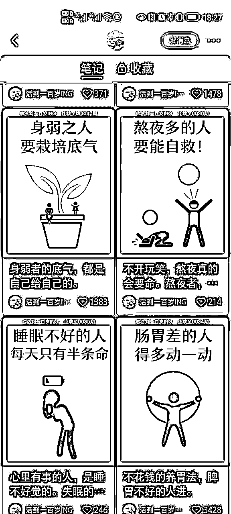

模板一：「图标 + 关键词 + 金句」 @杨星城

模板一：「图标 + 关键词 + 金句」 @杨星城

有一种封面风格是利用「图标 + 关键词 + 金句」的形式展现。这种不需要怎么排版技巧，非常简单。

比如这几个账号，大家感受一下：

封面=图标+图标题+金句+作者

图片就只有一张封面，内容都写在正文里。

针对上图，我们一个个来拆解：

「图标」：这个很简单，直接网上去搜“图标网”可以找出一大堆：

https://www.aigei.com/s?type=design_icon

但很多图标网每天只能免费下载一个，或者大小格式不一，又要注册又要啥的找来找去很麻烦。因此，也可以直接在淘宝买一个全网多个图标网站的会员，几十块就解决这个问题了。

「图中标题」：虽然是图片，但图片里的标题也会被系统收录的。值得注意，标题尽量选热门笔记的关键词，不要选一些小众题，也就是小众关键词。

在需要制作图中的标题时，先小红书“搜索栏”搜一下准备用到的标题，看是否有万赞笔记，如果没有，大概率这个标题并不适合。当然，这只是出于爆款逻辑的角度，如果所在类目本身就比较小众，那可以降低点赞标准。

「金句」：可以理解成副标题，也可以理解成全文的一个核心关键句。这点需要花时间多多琢磨，里面的字也是会被系统收录「作者」：就是自己小红书的名字，基本不用变

「作者」：就是自己小红书的名字，基本不用变

「总结」：制作简单，排版清晰，特别适合做图能力和审美能力差的同学。固定要这样的格式，排版 3 分钟就搞定了。

内容来源：《零投放从 0 开始，小红书 2 个月 8 万粉丝的实操经验分享》

模板二：“梨云绿”封面 @梨云

模板构成的要素无非就几个，每一个都进行迭代即可。

①配色：选择了森系绿，搭配阳光的暖黄和纯白色，给人一种温馨而岁月静好的感觉。

模板三：真人出镜、实拍封面 @赵承纬

实拍、真人出镜的封面图相较于前两种的真实感更强，对人设的传达也更直接，根据笔记进行灵活调整的空间更大。

一般常见的实拍封面格式为：笔记内关键图展示 + 主题关键词，有些也会用上对比或者合集的方式，进行前后展示或者不同的产品展示。

真人出镜的封面图，除了可以直接从内容中截取展示，也可以专门拍摄一张封面图，有固定的角度和动作，加深人设印象。比如下面这个博主，每次的出镜手势就是她给自己制造的视觉符号，还有自己的口头禅。

内容来源：《小红书内容底层逻辑：从底层情绪、4 大内容构成、关键词出发，打造爆款内容》

#### 3.3.3.4 第四步 发布内容 @杨星城

1.推荐的发布时间一般是什么时候？

经过多次测试，目前发现的最佳发布时间是在晚上 9 点～ 9 点 40 分之间。容易出千赞的爆款比较多。

2.一般需要保持什么样的更新频率？

最好能日更，如果做不到日更就每周 3～5 篇。

## 3.5 如何创作视频笔记 @一颗幸运小星星

💡

小节纲要

诚如前面所述，视频笔记的流量比图文笔记更高，也更容易和粉丝建立信任，是值得大家关注的 IP 笔记创作方向。

本小节从账号分析及爆款视频打造逻辑、小红书爆款视频打造心得、爆款笔记的实操建议三个方面，为大家展示了小红书爆款视频笔记打造方法。

或许大家所选择的赛道和方向不同，但底层的创作方法是共通的，如果大家有视频制作基础或者有足够的学习时间，可以参考该圈友的方法，尝试制作自己的第一个视频笔记吧！

### 3.5.1 分析账号及爆款打造的逻辑

关于打造爆款视频的逻辑，可以总结如下：

账号粉丝量级提升 = 保持频繁的更新视频次数 + 靠小爆款及大爆款迅速带粉丝量级。这里起到杠杆点作用的是爆款视频。

核心第一，明确爆款视频的底层逻辑。第二，在实操中需要不断去尝试，近距离感受平台用户的特征和喜好，进而不断调整选题和视频的形式。

爆款视频 = 真实，个性鲜明，有记忆点的个人 IP + 内容价值（干货） + 内容吸引力（猎奇，段子，共鸣）+ 内容变现力。其中的杠杆点因素是内容吸引力，选择共鸣这个点，比较能打动女性群体。共鸣可以继续落地在拆分，找到内容选题方面的杠杆点，克服自卑，赚钱，明星，两性都是在普通选题中最带有杠杆作用的点。

### 3.5.2 小红书爆款视频打造心得

定位：从账号名字、签名、背景等信息做好备注，目的是更加真实。选题：可以基于某个领域搭建选题库，并对选题进行优先级排序及数据统计，迭代更新，以提高对内容的敏感度。自带吸引力的选题一般为自带流量的热词，明星，钱，性，影视剧，猎奇，戳中痛点，夸张的选题。脚本：刚开始的几秒就需要把用户带入场景，但因为小红书中长视频也有大市场，因此没有像短视频要求那么极端，但视频文案还是要一句话说一个要点，尽量简短。视频：封面的核心标题一定要引发别人好奇心。由于一篇内容是否能引爆，很重要是标题+封面/封面标题 + 引语。

对于视频而言，占最大比例的是封面，我一开始用的是自己的人像封面，但是 PK 不过小红书一票好看的小姐姐，所以采取了结合小红书用户最容易打动他们的路线，一些台词封面，但又切合每篇内容的主题。发布：尽量保持日更，发布语要引发用户好奇心，尽量多加一些标签，艾特官方，这一步是为了让算法识别你是个啥账号，给你推到适合的人群去扩大流量，以及给予账号更多权重流量倾斜。互动：视频下的评论尽量互动，目的是为了保证自己是一个真实可信的账号，只有真实，粉丝粘性才会高。其他：一个账号一定要做到真实，才算是成功的。

结合小红书用户最容易打动他们的路线，一些台词封面，但又切合每篇内容的主题。发布：尽量保持日更，发布语要引发用户好奇心，尽量多加一些标签，艾特官方，这一步是为了让算法识别你是个啥账号，给你推到适合的人群去扩大流量，以及给予账号更多权重流量倾斜。互动：视频下的评论尽量互动，目的是为了保证自己是一个真实可信的账号，只有真实，粉丝粘性才会高。其他：一个账号一定要做到真实，才算是成功的。

内容来源：《如何在快速在小红书打造 50 万的视频爆款，以及快速增粉》

### 3.5.3 视频笔记的实操建议 @Zora。 卓然

1）能搭框架就不要弄逐字稿

人的语言表达系统里，口语习惯和书面习惯是不一样的，一旦写了逐字稿，录视频的过程中你就会拼命回忆自己写好的内容，过程会变得很生硬，像在背书。

我的经验是最好不要写逐字稿，简单梳理出你要讲的内容，会有些什么例子，得出什么结论，然后再根据框架输出，效果会更好。

2）一镜到底，不要 NG

我的第一个视频，光是第一段就录了二三十次，因为面对镜头，开始会不自在有各种各样的状况，但后来发现真的没有必要。

如果一直从头再来，就会像背单词一样：abandon abandon，最后发现录不下去，就真的 abandon 了

更好的方式是，强迫自己一镜到底，说错了镜头不 NG，但你可以自己再讲一遍，这个过程你会渐入佳境。

摒弃反复点录制按钮带来的压力，开头那关过了其实就讲顺了，中间讲错了也无伤大雅，就跟我们平时对话一样，说错了就改口就好。

可能有小伙伴会说，那我剪辑的时候不就很累？ 要一直反复听，听自己到底哪里开始讲错了。

剪映现在也有智能口播的功能，可以直接识别出视频当中的停顿、语气词，一键完成粗剪，效率很高。

3）多找多拆解对标博主的视频

我在没有开始做视频之前，也觉得视频很难。但真正去拆解一些博主的早期的视频之后会发现，大家都是从上面几种简单的开始做起的。

4）保留一个制作封面的视频草稿

为了能够在每次剪完视频后，快速产出同类风格的视频封面，我的剪映中保留了一个视频草稿是专门用来做封面的，相当于封面模板。

具体的实操步骤，就是每次剪完视频之后，把成品视频导入到制作封面的草稿中，然后点击制作封面的【编辑】图标——选择【重选封面】——任意选择一帧画面——会保留你原来模板中的字体、排版、icon，只需要修改标题即可得到一个风格统一的封面——最后【完成设置】

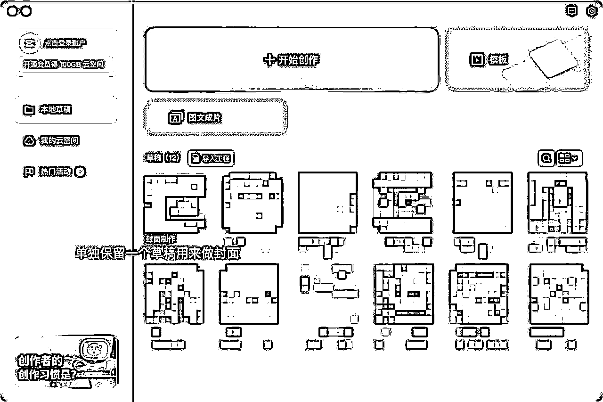

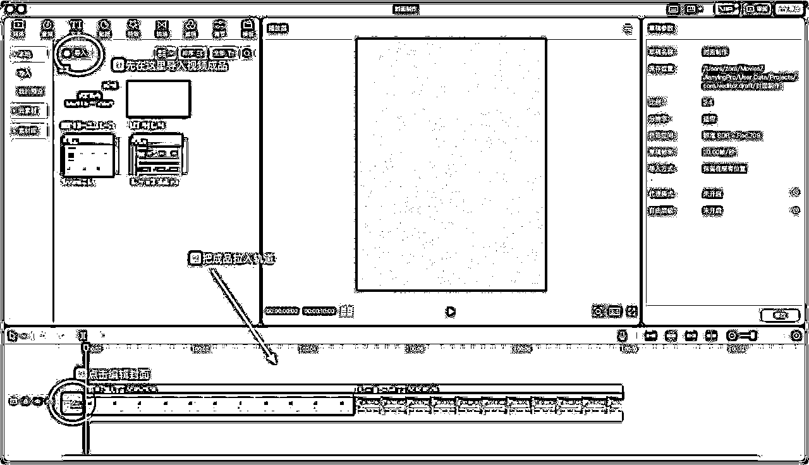

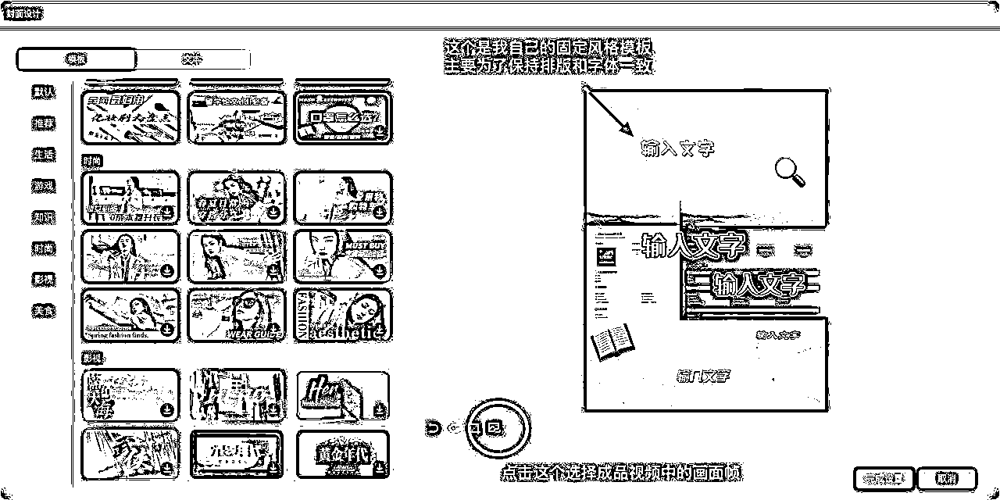

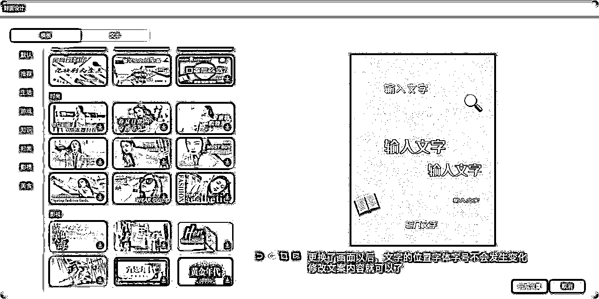

这个小技巧不是说非做不可，只是我自己觉得用户点进主页看到统一的模板，会觉得更舒服。

这个小技巧不是说非做不可，只是我自己觉得用户点进主页看到统一的模板，会觉得更舒服。

而且保留这个习惯我就不用额外去记不同字体的参数，能提高我做视频的效率。

内容来源：《如何在快速在小红书打造 50 万的视频爆款，以及快速增粉》《新手起号也能做的视频笔记》

# 四、【项目实操 3/3】持续优化迭代 搭建内容体系

💡

章节纲要

做任何平台的账号，根据数据反馈对行动进行优化、迭代、纠偏在都是必不可少的。通过对数据和平台的深入分析，也往往能够使我们更加接近事物的本质。

在完成了对小红书笔记的内容创作后，我们就要开始着手于笔记的优化了。对于新手来说，刚开始发布的几篇笔记可能并不会有太好的数据。不过也不用着急，大 V 也是从新手开始成长起来的。

这一章，我们就从以下几个问题着手，不断复盘、调整、优化，相信大家都会迎来自己的爆款笔记。

✅1.数据不好，如何优化？

✅2.如何提高爆文概率？

✅3.如何提升内容创作效率

💡

本章航线图

完成本章节的学习和实操，即可完成航线图的第三阶段 持续复盘并优化 （约 7-14 天）

1.

复盘小红书笔记的各项数据，并优化笔记（约 2 小时）

2.

建立 sop，提升笔记生产质量和效率（约 4 小时）

那么现在，就请开始完成这几个步骤的筹备吧。

## 4.1 持续复盘优化笔记

每一个小红书账号，基本上都会存在逐渐优化的过程。

所谓的逐渐优化，比如说在初期，我可能只是单纯地发布，或者说不停地发布。那么在第二个阶段，就需要针对发布的内容做一定要求。

比如，之前的标题可能不够醒目，那么就可以尝试将标题变得更加醒目一点，色彩更加突出一些，在字体与字体的排版过程中，我会排得更加舒服。

中，我会排得更加舒服。

所谓的舒服，更多的是根据数据反馈，依据对标账号的做法进行优化。

这是一个不断迭代的过程，不断去优化自己，向内求。

### 4.1.1 笔记数据不佳，如何优化？

有人问，我的一个浏览量在 100 到 300 ，300 到 500 这样的一个区间，是不是正常的？

很明确地告诉大家：这是正常的。

自己的浏览量不低于 50 ，在 50 到 500 这样一个区间，作为一个新号，发布内容的时候看的人偏少，是一个很正常、也很普遍的情况。

因为你不是一些很有名气博主，比如说别人有十万粉或者说甚至十万以上的粉丝基数，那么他一发笔记，有自己的固定粉丝作为受众，浏览高很正常的对吧？

所以心态很重要，一定要稳定好自己的心态。

其次，我们在做数据对比的时候，可以和正常的内容数据进行对比。

比如，你发了很多篇笔记，它都会存在一个数据对不对？那么你看自己发的一些笔记里，哪一些数据比较好，然后去尝试分析一下好的原因在哪里。

再次，你可以和自己同等级的博主进行内容数据上的对比。

所谓的同等级比，比如他的一个粉丝基数是 500 左右，你也是 500 粉左右，就能进行对比了。

你不可能自己只有 500 粉，硬要和 10000 粉的博主进行对比。这样的对比往往是没有参考意义的。

和别人对比的一个过程当中，你可以看自己的点赞收藏数，然后再看自己的评论区。

为什么别人的笔记里会有比较多的评论，或者说别人的笔记收藏会比较多？你可以看看他们的内容，然后看他引导互动的一些方式，尽可能地去模仿和学习。

如果确认数据不佳，我们可以从以下几个方面去反思和优化：

一般发布后 2 - 3 小时内阅读量差，或者阅读量长期只有 100 - 200 甚至低于 100，可对照以下问题检查：

运营初期的正常现象，账号权重还太低；

笔记违规、触及敏感词、或者发布了平台本身就不会大力推荐的内容（比如医美、保险、社会负面、中国负面）

选题、标题文案或者首图不吸引，尤其要重点检查选题角度和首图。

## 2\. 点赞、收藏、评论等互动数据不佳

用户会收藏这篇笔记，说明笔记内容有实用价值，现在或未来可以用上；

用户点赞或评论这篇笔记，说明笔记内容获得用户认可、引起情绪共鸣；

用户会因为笔记转粉，说明不仅认可你的笔记，还认可你本人，期待你未来产出更多优质内容。

互动数据不好的，排除违规和玄学问题，十有八九还是因为笔记内容质量不够好。

可对照以下问题检查：

完全文不对题，选题标题吸引，但点击来内容完全与主题无关

内容文字营销感太强，全部都是硬广、打广告（备注：企业号可适当硬广）

内容提供给用户的收获感不强，对用户来说实用性不够强

内容很像无意义的朋友圈，没提供情绪价值也没有提供实用价值

内容全是干巴巴的学术句子或者百度科普，难以引起阅读欲望

视频拍摄质量或者信息图片质感太差，用户阅读体验感差

## 3\. 发布后修改笔记的注意事项

经常会有人问：修改已发布的笔记是否会影响曝光量？

从观察的数据来看，修改后，阅读率确实会重新计算。但只要不频繁修改，是不影响这条笔记的。

但修改了笔记可能会重新审核，审核了没问题才会放出来。有时候笔记里有敏感词，改过后重新发，或者优化了标题等，数据会更好。

也有一些情况，本来审核过了，正常给流量了，修改后可能工作人员觉得有问题，反而开始限流，数据就不好。

如果有笔记爆了但是想修改，克制住，别动笔记，可以在置顶评论补充。

图文笔记全部都可以替换修改；视频笔记只能修改文本和首图，视频本身无法替换。

修改提交后平台审核系统会进行二次审核，没违规的都会照常通过。

若已经是爆款笔记，且热度仍在持续上升的阶段，不建议轻易修改，可能影响数据增长。

不要短时间内频繁改或者修改次数太多，否则笔记数据可能会不如之前。一般修改 2-3 次是 ok 的。

### 4.1.2 笔记违规怎么处理？@吴小二

两个一起申诉渠道需要一起申诉，可能不是同一批人处理的，标准不一样。

目前我的违规笔记，只有一条没申诉回复，其余都恢复了。

包括评论超过 5000 的帖子也都恢复了。

补充一点：账号如果发现数据明显低的异常，一周后依然没有恢复。注销吧，重新来。

1544_1692583964.mp4【在线播放】

#### 4.2.1.1 爆款图文账号特点 @比比先森

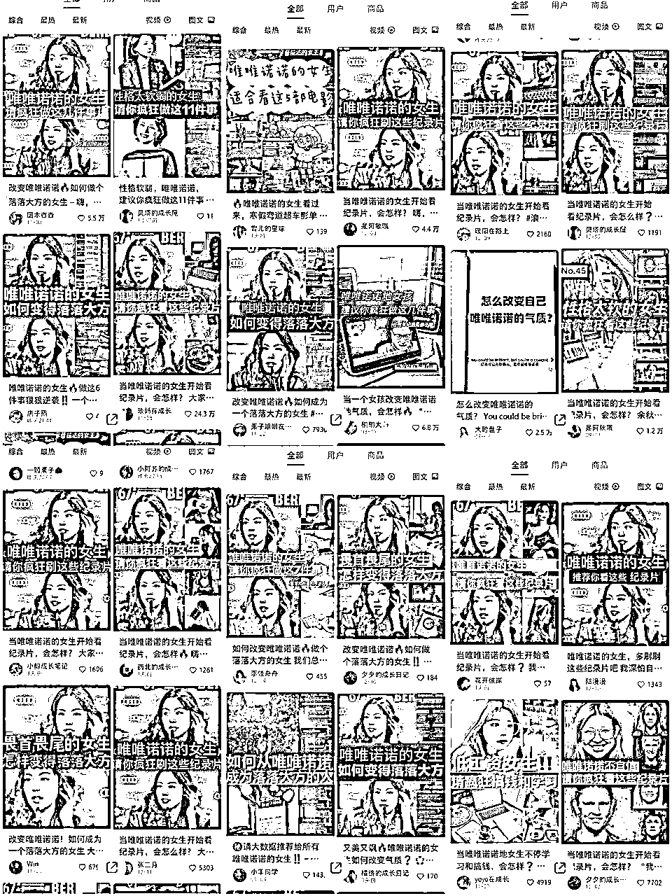

图文爆款特点：

图文爆款特点：

选题维度：选题，封面配图，排版，标题非常一致，高度重复

数据维度：数据非常好，几乎都是几千几万赞的爆款

时间维度：发布时间较近，几乎都在一年之内

对于已经在小红书上有一些经验的同学来说，可能会遇到这样的情况感到困惑：我已经尽力模仿得很好了，也认真制作了图片，但为什么别人的笔记能够引起轰动，而我的却只有很少的点赞数呢？

这里其实有一个核心的关键点，我们都说照猫画虎，猫找对了，虎可能压根没画好。

新手模仿爆款时，往往意外加入个人想法，导致最终作品大不相同。建议不擅长作图的同学先确认对标对象，尽量 1:1 复刻，提升审美和制图能力。模仿学习能体验细节，比单纯观察更有效。

#### 4.2.1.2 如何按对标帐号创作爆款笔记

方法一：提升敏感度，寻精准对标选题维度：笔记选题非常火爆，已经有大量案例验证

选题维度：笔记选题非常火爆，已经有大量案例验证

拆解维度：封面，关键词，标题，主体，非常神似，有利于对标模仿

数据维度：数据都是至少千赞，且已经出现万赞爆款

时间维度：发布时间都是在一年之内，1-2 个月内最好

方法二：像素级模仿，精准绘对标

于是开始加字，一开始是按照自己的想法，做了这样一张图。

于是开始加字，一开始是按照自己的想法，做了这样一张图。

大家经常刷小红书的话可能会发现，爆款封面的花字，大多数都看起来非常清晰，凸出，而且黑白简洁有力，但是上面这个封面中，黑白的描边显得太过冗余。

于是找到黄油相机里一模一样的花字，并且着重省略了主标题，让主体更加放大，居于左半侧，且故意把“不愧是央视推荐的纪录片”调整为“不愧是”+“央视推荐的”

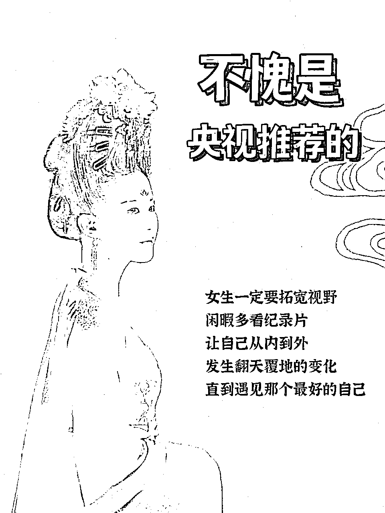

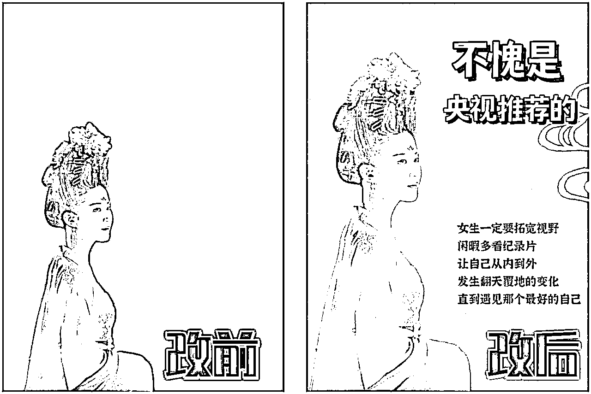

从最初封面到最终爆款封面的优化，总结为三点：

用户视角：明确用户的观看顺序，引导鲜明主体和爆款关键词，吸引用户点击！

氛围营造：整体配色，背景，选角，要与选题主题强相关，凸显「氛围感」，满足用户好感

标题指引：标题字体不予太长，要做到精准吸引且放大突出，有“一眼万年”之感

快速判断封面是否合适方法推荐：

发图片到微信聊天框，只给自己 1-2s 的观看停留时间，确认是否可以快速 GET 到封面的主体和标题关键词

如果可以，就说明封面内容是合适的

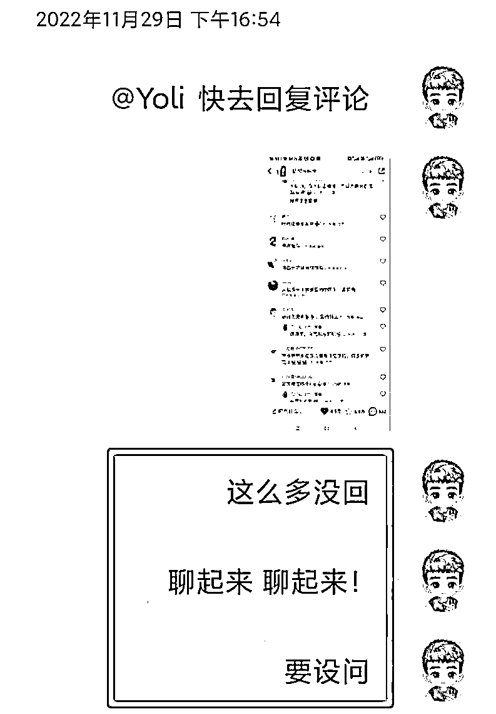

先简单和大家说一下小红书的算法：

重点结论：用户的动作效果对于爆款笔记的积极影响：关注>评论＞收藏=点赞；互动量增加，整体数据会增长很快参考回复方法：

参考回复方法：

你说的是观看纪录片的影视平台吗？

这个纪录片讲什么的呀？

哇，你也喜欢刘亦菲吗？

推拉式评论表格形式展示

正文一定要埋互动理由，就是触发互动行为的要素，一篇笔记的互动指数高，才可以打开流量开关，有源源不断的流量进来。

正文一定要埋互动理由，就是触发互动行为的要素，一篇笔记的互动指数高，才可以打开流量开关，有源源不断的流量进来。

比如说文章结尾一定要留出用户互动的钩子，如：

大家关于新疆旅游有什么问题都可以问我哦

需要这份旅游攻略的可以评论区告诉我，我私发一下

如果一篇笔记只是流量很大，不加到微信有些可惜，我们做引流最终的目的还是需要加到微信。不过需要说明的是，这种方式有一定的违规可能性，大家根据自己的需求进行使用。

内容来源：《小红书 3 天新号粉丝破千的运营方法论》

#### 4.2.2.2 要素二：挖掘用户需求与痛点 @杉木

内容中，用户需求与痛点是否能准确把握是关键。

举个例子：

瑜伽服的购买群体主要是女性，他们更关注的是瑜伽服上身效果，包裹性如何？弹性如何？面料怎么样？而不是模特白不白，屁股大不大，性感不性感，这是 LSP 关注的东西，所以做带货内容不要内容上用力过度，你只需要把你的产品卖点在内容中兼顾到就可以了，不要你觉得，要让用户觉得，这样才能吸引最精准的流量。

如何找到击中用户痛点的笔记作为对标？

我们最应该关注的点在于：评论区，这是真正能反馈出用户对内容的态度的。

用户点赞，收藏你的动作只能说明：我认可，我喜欢，对我有用。

而评论是带有明确目的性的，尤其是直接带货的内容，一般评论都是有强烈购买倾向的：我要买。

在寻找过程中，除了要把这些笔记搜集下来外，也最好点开主页看下账号的其他内容，一般一个账号不会只有一篇笔记数据好，通常都还会有别的类似内容。

而在寻找过程中，如果发现某个账号中，几乎篇篇笔记的数据都非常好，那么恭喜你发现了宝藏。后续可以把这个账号的全部内容认真搜集下来，这个可以借助工具或者第三方平台来进行操作，如：蝉妈妈，新红。

以新红举例：说白了就是蹭热度，主动搜索的用户会高频次地使用小红书的搜索功能，特别是在品牌集中增加营销、投放或是有新产品发布等较大事件时，小红书内关于该品牌的搜索量会明显上升。

说白了就是蹭热度，主动搜索的用户会高频次地使用小红书的搜索功能，特别是在品牌集中增加营销、投放或是有新产品发布等较大事件时，小红书内关于该品牌的搜索量会明显上升。

“大家在把小红书当搜索引擎用”，这是众多小红书用户的心声。

我们要做的就是借力，比如之前瑜伽服品牌 lululemon 热度很高，甚至于 lululemon 这个关键词的热度，要高于瑜伽服这个品类词，那就可以在文案中多次植入。

也可以把这个当成一个选品标准，比如这个 T 恤这个品类，属于红海市场，竞争很激烈了，但是我们看到这篇笔记有 4000 多个精准询单，完美符合我们要找的高质内容笔记：

也可以把这个当成一个选品标准，比如这个 T 恤这个品类，属于红海市场，竞争很激烈了，但是我们看到这篇笔记有 4000 多个精准询单，完美符合我们要找的高质内容笔记：

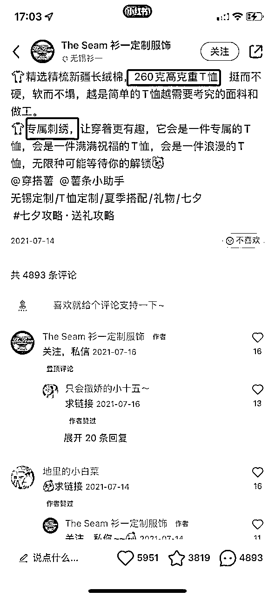

通过分析他的文案和产品，可以得到结论：之所以有如此大的询单量，就是因为这个衣服——高克重、专属定制的卖点。

说明市场急切渴望一款这样的 T 恤，所以也可以在找这类笔记的时候，发现一些值得做的产品。

除此之外，也要考虑内容制作成本，矩阵做号的要量化好每篇内容的生产成本，对成本有个清晰的概念，其实我们在找赚钱笔记的时候，也是在对比成本。

专业的布景、玩味的文案、讲究的图片构图，一定对应高成本。

但高成本一定对应高询单么？未必！刚才我举的瑜伽裤就是鲜明案例（我的内容成本是不到 20 块钱一篇）。

我们不论在小红书还是抖音，都能看到很多低成本高产出的经典案例，内容营销的魅力就在于此。

内容来源：《我是如何通过小红书，两个月带货营收 30 万＋》

#### 4.2.2.3 要素三：强化代入感 @梨云

我刷小红书的时候，看到了十万赞大爆款《公主学习法》，虽然觉得很 low，但敏锐的觉察力告诉我，这篇笔记不简单。

于是，我看完内容之后，真的好像体验了一把当公主的感觉，再看评论区，一片好评，目测这是一个爆款选题。

我立马以此为选题写了一篇，爆了，将近 10w 点赞。

学习娱乐化，知识趣味化，如果我的假设是正确的，那么我会开辟一条新的细分赛道，成为唯一。

说干就干，我从评论区分析粉丝感兴趣的角色，然后进行创作，尝试发一些极具创意的学习法试水。

结果，篇篇原创，篇篇爆款！

于是，在比例上，我开始加大这种被娱乐化包装的学习方法，内容高度垂直统一，主页转粉率接近 30% ！

而这种垂直又爆款的内容，还引起了小红书官方的注意，让其直接为我在灵感笔记里单独开辟出了新的话题咖位：

而这种垂直又爆款的内容，还引起了小红书官方的注意，让其直接为我在灵感笔记里单独开辟出了新的话题咖位：

从模仿到原创，依然篇篇爆款，我做对了什么？

以人为本，和粉丝进行深度链接，了解他们的痛点，关注他们的需求。

提供价值，你的内容，一定要能够解决粉丝的问题，要么是实用性的方法论，要么是情绪性的愉悦感，或者像我这样，两者兼备。

主动学习，在了解粉丝需求的过程中，我会遇到很多闻所未闻的东西，比如他们很喜欢的耽美、凹凸世界……这就倒逼自己要去主动学习，才能产出粉丝喜闻乐见的内容。

长期主义，站在粉丝的需求角度用心的去输出每一篇内容，踏踏实实做内容，同时要不断的输入输出，精耕细作。因为一事精致，便已动人。

内容来源：《小红书三个月涨粉 17w，变现 10w+，我做对什么？》如何找到关键词呢？有 3 种方法：

如何找到关键词呢？有 3 种方法：

方法 1：

你在小红书搜索里输入关键词，找到下拉词，如图。

【女频言情小说推荐】是你输入的关键词，【女强言情小说推荐】、【女生言情小说推荐】等是你找到的下拉词，这些词语都可以用于标题和正文：

方法 2：点开一篇高赞笔记，看看它的标题和正文，测试它哪些词是关键词：

点开一篇高赞笔记，看看它的标题和正文，测试它哪些词是关键词：

以这篇笔记为例，我推测【真的好绝】、【超级喜欢】、【甜文】、【双向奔赴】、【可冲】等词为这篇笔记的关键词。

如何使用关键词呢？

1）先把你自己为什么推荐这篇小说的理由写出来。

2）再把你收集的关键词，放到你写的内容适合的位置。

举例：我选了一本《 XX（书名）》言情小说作为我推荐的小说。这本小说我看过，我非常喜欢，怎么写标题和正文呢？

我会这样写——

第一稿：标题：推荐一本女主言情争霸小说！！！

标题：推荐一本女主言情争霸小说！！！

正文：

今天看了一本很好看的言情小说。

已经完结了。

这本书主要讲了女主穿越到异世界，带着金手指大杀四方。

女主本身非常有魅力，不止是金手指的作用。

以前看过类似的小说，女主拿到了金手指，却偏向于宅斗、宫斗，或者是辅助男主成为天下霸主。

但是，这本小说完全不一样，女主没有被古代同化，自己拿着金手指争霸天下，为百姓带去幸福的生活。

而且一点也不违和，非常符合常理。

男主男配们非常有魅力，感情戏也非常好看。

第二稿：

标题：N 刷！！巨好看的言情小说，绝对不能错过（注意：小红书笔记最多 20 字，16—18 字为佳）

正文：

今天看了一本巨好看巨上头的言情小说。

已经完结了，真的好绝，我超级喜欢。

这本书主要讲了女主穿越到异世界，带着金手指大杀四方。

女主本身非常有魅力，不止是金手指的作用。

以前看过类似的小说，女主拿到了金手指，却偏向于宅斗、宫斗，或者是辅助男主成为天下霸主。

但是，这本小说完全不一样，女主没有被古代同化，自己拿着金手指争霸天下，为百姓带去幸福的生活。

而且一点也不违和，非常符合常理。

男主男配们非常有魅力，感情戏也非常好看。

可冲！

你留意到第一稿和第二稿的区别了吗？

我把「n 刷、真的好绝、超级喜欢、可冲」等关键词放入了标题和正文。

靠着这个方法，我经历过一篇笔记 1 小时 100 赞，24 小时千赞。

如果一篇笔记能 1 小时 100 赞，那么，24 小时后，这篇笔记能千赞。

当然，这个方法不是百试百灵的，也要看你推荐的小说是否符合自己的定位，是否符合读者的口味。

有时候，我的笔记是几天后到了千赞。有时候笔记只有几百赞。但是，这个方法让你点赞的概率更多。

比如说，你发了 100 个笔记，用这个方法，千赞笔记占 20%，几百赞笔记占 50%，几十个赞笔记占 30%（这个概率不准确，是我根据自己的笔记粗略计算出来的，但如果你做过小红书，就知道这个方法效率很高）。

为什么用上关键词法就可以让笔记如虎添翼呢？

你看我写的案例，内容非常简单，就是把小说的亮点突出来了。

有时候我偷懒，写了一篇笔记，直接取个标题，正文写了“已完结、超级好看”就发出去了，但依旧有几十赞、几百赞。

为什么我发了这样简单的笔记，依旧有点赞呢？

因为我推荐的小说好看，推荐的小说本身很有价值，所以读者容易点赞。

但你做学习博主就不一样了，必须提供有价值的内容 + 关键词法撬动流量，读者才会点赞。

内容来源：《手把手教你如何成为小红书小说博主》

#### 4.2.2.5 要素五：技巧合集 @吴小二

第一个技巧：将资料拆分

建议把一份资料拆成多份，甚至可以强行拆分成 5 份， 编号 a ，b ，c ，d，e 然后让评论区留下喜欢的编号。这样评论区就热闹起来了。

第二个技巧：回复最初的几个评论

对最开始的几个评论，或者几十个评论，每个都评论 “已发，祝顺利” 之类的，比较礼貌的用户还会给你一个“谢谢”的回评。

这样能不仅能增加你发资料的真实性，加热阶段的评论量也就上来了。

当然，每天上千条评论，你不可能全部都回复，加热阶段回复就可以了，不然是要指头痛的。

第三个技巧：把最热门的编号当成封面

在前面两个步骤中，我们每个帖子至少有 5 张图片。发第二个帖子时，将第一个帖子中留言最多的那个编号，当成封面。

可以这样理解，我们在用第一个帖子测试 5 个资料哪个喜欢的人更多，在第二个帖子中我们把多的那个放到第一张。你一次发一个，需要发 5 次才能知道哪个火一点。而一次发五个，评论区就能帮你筛选，而且其它的即便喜欢的少，也是能给你增加点帖子热度的。这样循环起来，爆贴的概率大大增加。

我有一个编号的封面，让几个人看都觉得丑，但数据就是奇怪的好，连着发了三次都是千评以上。

要相信数据的力量，评论多的就是要反复当封面发。

第四个技巧：巧用搜索联想词

在小红书搜索框，输入关键字，会自动跳出来联想词，把这些联想词放到内容和标题中，甚至可以用关键词来当昵称，这会增加很大一部分流量。

这个技巧在手册中已经提过了，我想很多人是不足够重视的，就再提一下。

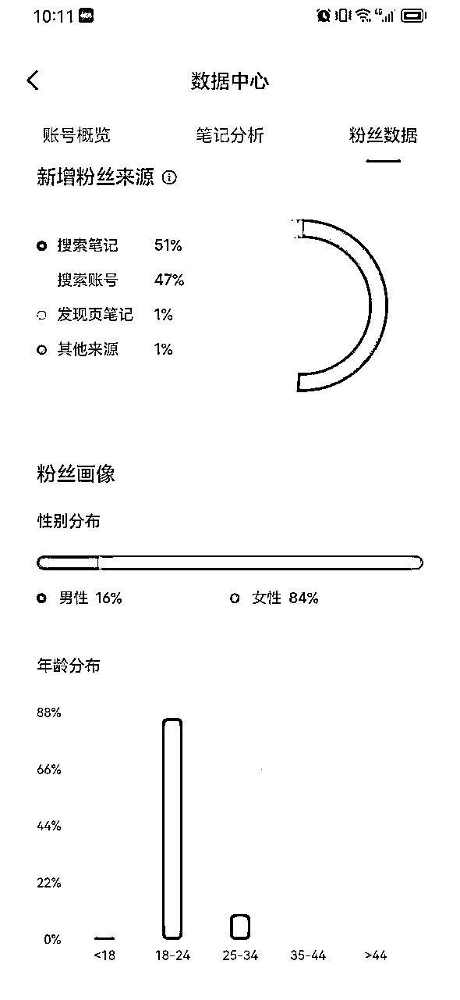

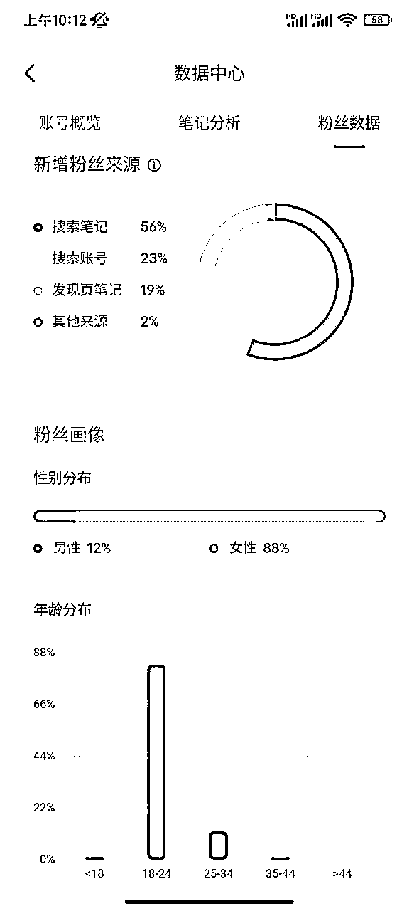

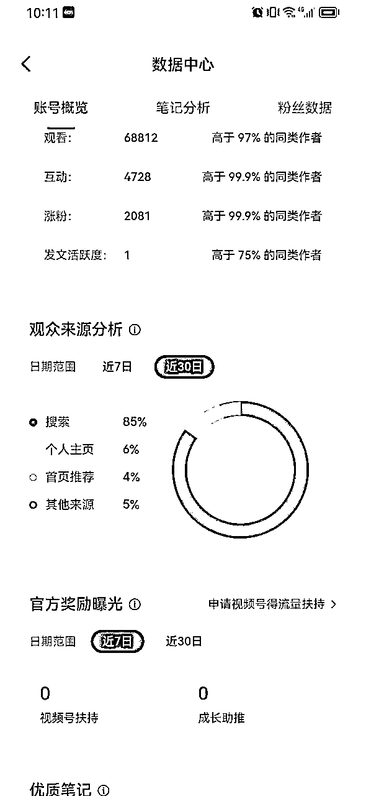

通过这四个方法结合，在上次航海中，我新弄的一个号，10 篇笔记中：

评论 400 以上的有 5 篇，其中 1500 评论的 1 篇，5000 评论的 1 篇。

这些帖子靠搜索流量，目前数据依然在涨。

内容来源：《小红书新手资料引流，涨粉的细节分享》

## 4.3 如何提升内容创作效率

### 4.3.1 定期系统总结梳理 @子渝

在自媒体上为了能有持续，干货性的内容输出，一方面要持续总结自己的知识体系，做持续输出，另一方面必须得边输入边输出。建议做个自己的素材库，方便快速调取。

### 4.3.2 持续从优秀对标里汲取高点，获取灵感@子渝

平台里的内容确实很多，做的好的牛人也很多。对于刚入局新手来说，唯有多学习，多琢磨，多对标优秀的人，学以致用地提高自己。

每天可以抽时间去浏览所在领域相关的专业内容，看看别人在说什么、想什么，找灵感，记录整理。提醒自己后续来完成。

内容来源：《中年宝妈“996”下班后当职场博主 聊聊我小红书从 0-1 到变现的过程》

### 4.3.3 制作可批量制作内容的模板 @梨云

一个优秀的内容制作模板，不仅可以帮助我们批量生产内容，同样也能够帮助我们获取非常不错的数据。圈友 @梨云 独创了一接着发挥自己平面设计专业的优势，原创了一套模板，具体思路如下。

接着发挥自己平面设计专业的优势，原创了一套模板，具体思路如下。

模板构成的要素无非就几个，每一个都进行迭代即可：

1）配色

选择了森系绿（因为太多人一看到这个配色排版就想起我，我立马取了梨云绿抢占心智），搭配阳光的暖黄和纯白色，给人一种温馨而岁月静好的感觉。

2）封面

选择简单粗暴的大字报排版，以两行字的形式突出标题重点，目的是为了更加聚焦关键词，让用户一目了然我这篇笔记要讲什么，从而快速做出点击选择。

3）内页

取消之前对标博主封面 + 文案排版的形式，改成全图流。

因为靠文字排版，结构感还是差了一点，容易视觉疲劳，而全图流还可以改变字体颜色、加贴纸图案，有很大的操作空间。

我采用大标题、导语、小标题、内容、底部标题的排版。

大标题：可以是对本页内容的大概括，给读者预判信息，知道这一页讲什么，也可以每一页都统一，目的是埋关键词，提高检索权重，它也是重要的广告位，写品牌名字的地方。

导语：铺垫作用，写下出这篇笔记的原因，承担一部分共鸣作用，同时也可以利用导语进行行为设计，比如我会说“宝子投稿”来暗示大家积极在评论区投稿，用留言数拉动曝光增长。

小标题：是对内容的概括，用四个字压缩一句话，减轻读者阅读负担。

内容：一般不差过 3 行，要做轻内容，提升阅读愉悦感，在行文表达时，我会用上小红书平台女生们都喜欢的爆款流行语、最近火热的梗，让内容显得灵动活泼，大家都爱看。

底部标题：这是一个非常重要的细节，也是我实践中摸索出来的，很多人模仿我，就忽略了这一点。它的作用是以游戏化口吻引导对方翻页，减少读者因为对本页不感兴趣而退出阅读。

形式是借鉴游戏中的指令性表达，句式为：开始 + 动词、马上 + 动词。

这个技巧特别好用，给人一种想要不停往下翻的冲动，只要内容没问题，阅读时长有了，赞藏评的概率也会大大提升。

这一顿操作之后，我就开始发笔记，结果第一篇，就是破千的爆款。

然后一发不可收拾，每一篇都是爆款。

为了乘胜追击这爆款来带了蝴蝶效应，我开始日更，日更了 50 天，涨到 10 万粉之后，才开始隔日更新，现在已经 17 了。

内容来源：《小红书三个月涨粉 17w，变现 10w+，我做对什么？》

### 4.3.4 对流程进行 SOP 化

如果你想效率更高一些，其中很多环节其实都可以做 SOP 流程化，压低时间成本，拿拍摄和写内容举例。

我一般会在周六日把下一周要发布的素材全部准备好，拍摄如果找模特去拍，最好是在同城找，提前把拍摄注意事项和案例整理好发给模特，免得拍一堆废片浪费时间。

另外完全没必要找专业模特去拍，也没必要后期处理照片，这不是拍淘宝主图详情页。小红书无论是平台还是用户，都更喜欢

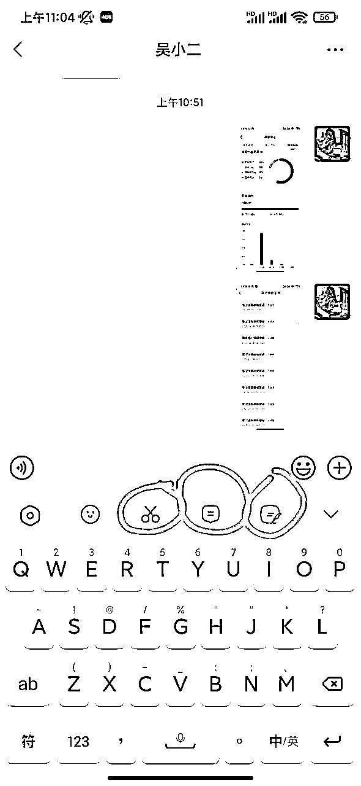

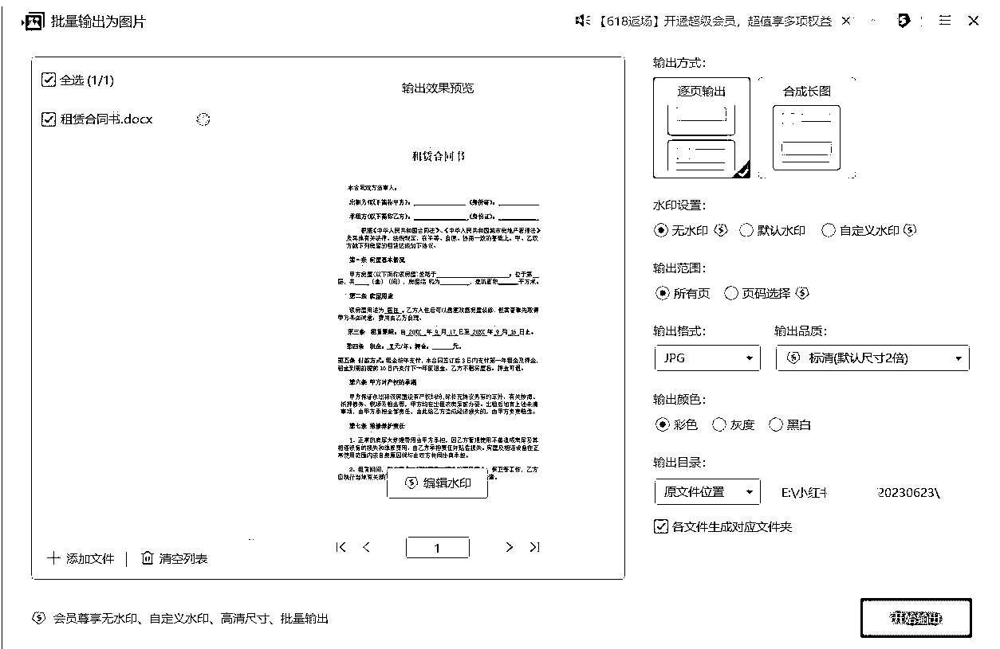

第三个：影刀全自动回复

如果说面两个是减轻手工压力，那么这个就是必杀技了，完全解放双手。影刀的使用方法，生财有相关帖子，或者也可以去官网看教程。(https://wx.zsxq.com/dweb2/index/topic_detail/415411288552588)

在设置影刀之后，连回复图片的这个步骤也省去了，只用把手机插上 USB ，开启调试模式，所有消息都自动回复。

在引流阶段，或者说变现不理想的情况下，谁的时间成本和人力成本低，谁就坚持的时间长。

可以先通过这个工具生成文案，然后再添加、修改我们想要的内容即可，这样可以增加爆文笔记概率，节约很多时间，降低运营成本。

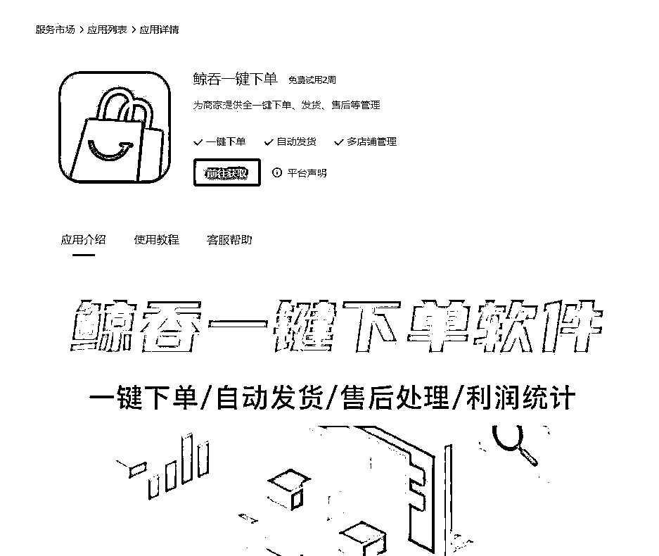

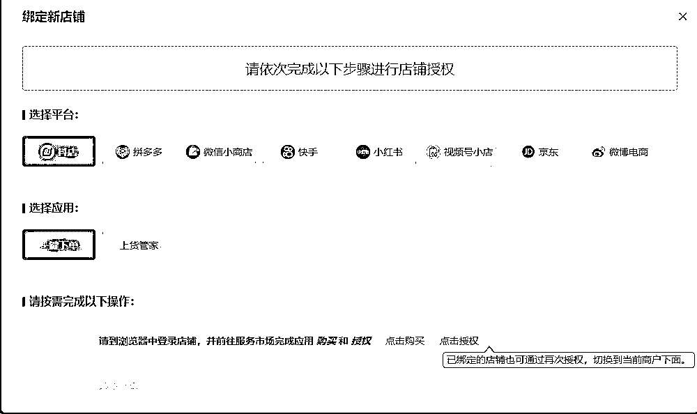

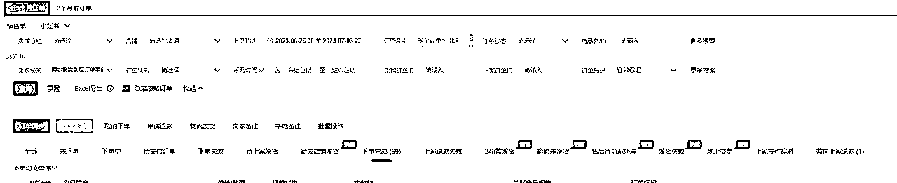

内容来源：《小红书如何”开源节流”运营变现》

选修篇：小红书的引流&变现

💡

章节概要

当我们完成项目最小 MVP，完成小红书起号后，就可以尝试看看选修篇的内容，开启引流和变现了

无论是想要进一步放大项目，还是挖掘更多玩法，都可以重点阅读本章节：

✅小红书的变现方式

✅科学完成小红书引流

✅如何实现私域变现

✅小红书热门赛道详细案例

现在，快来发掘项目的更多可能性~

# 五、持续优化账号&内容

## 5.1 持续优化完善个人定位

做定位，从来都不是一步到位。

V 先生说过一句话：“定位是 1 ，其他的事情都是后面的 0 。瞎写也有复利，但写一段时间，你会发现难赚钱，慢慢就没有信心继续写了。”

所以，做小红书核心一定要做一个赚钱的账号， 否则，大概率你会半途而废。而做一个账号最重要的前提，是你要做一个赚钱的定位，一个赚钱的定位就决定了这个账号变现能力强弱。

在前期，40% 的精力要放在定位上，其次才是选题、内容、引流。

要做一个赚钱的小红书账号，你就要明确这 2 个核心原则：1、痛点 >> 痒点

1、痛点 >> 痒点

在有多种定位选项的时候，能选择解决痛点需求，就不要选择解决痒点需求。因为大多数人，在痛点的消费上是毫不手软的，但是在痒点的消费上是“唯唯诺诺”的。

比如职场领域，大学生群体最痛的点是什么，如何快速找到好的工作？找到工作是一个核心需求，但里面包含太多的细分需求，比如简历优化、面试指导、入职体检、能力培训等等。

相对于体检、培训，大学生是更愿意为简历优化和面试指导去付费的。在众多需求中，我们要专注里面用户更愿意付费的痛点需求，吃透它就可以，与用户建立信任感最快，离钱最近。

2、帮助别人赚钱 >> 帮助别人成长

每个成年人进入社会后，就不再是个学生了，单纯的学习成长的重要性会降低，赚钱成为了成年人最重要的事情。如果你靠技能赚到钱、做项目赚到钱，做自媒体变现等赚钱相关经历，最好的定位选择帮助别人赚钱，而不是帮助别人成长。

在定位时最好明确这两个核心原则，尽量选择痛点 >> 痒点，赚钱 >> 成长，如果脱离基本原则，就不能击中用户最痛的点和需求，那和用户建立信任缓慢，变现起来路径比较长。

注：以上两条原则，针对的是新人，而非领域专家。任何一个领域，只要你成为了专家，那都是不愁赚钱的。

如图，这是我搜索减脂，出来的结果，一个月 5.98 万笔记，妥妥的红海。【图有点糊，大家主要看字就行】

## 5.2 更多挖掘选题方法

### 5.2.1 从热门笔记中挖掘

切换不同的产品细分关键词搜索，搜索结果里的【综合和最热前 100 名】有很多值得参考的题目。

能成为爆款的笔记，抛开玄学爆款，大多数都是同时得到平台和用户认可的内容。 他们的选题角度会很有参考价值。

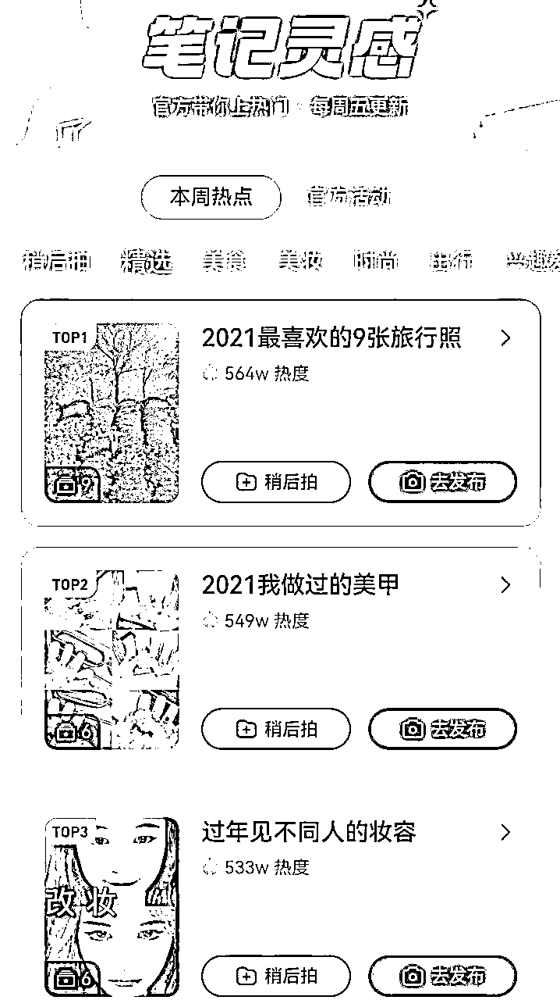

打开路径：「我」板块左上角的三条线 → 创作中心 → 下滑后即可看到「笔记灵感」

内容来源：《初阶 | 小红书-爆款笔记｜航海实战手册》

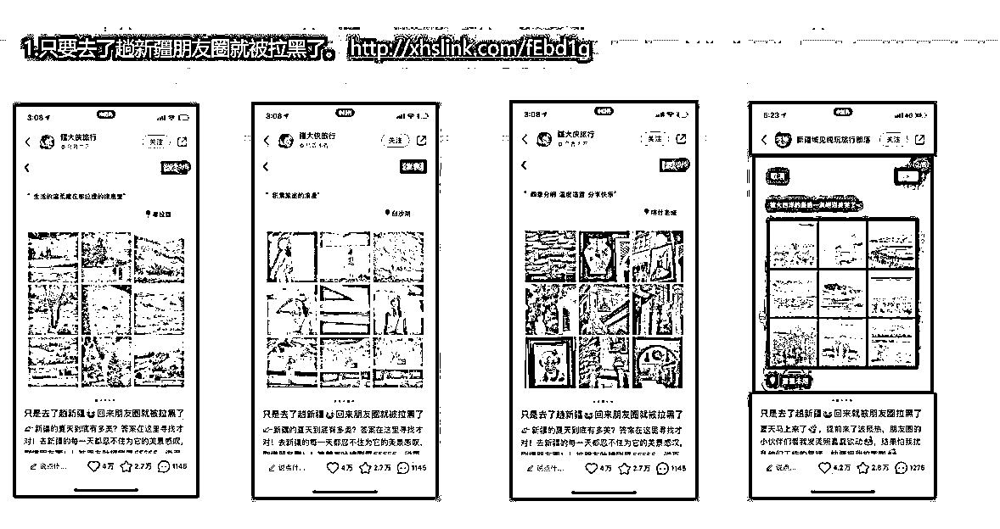

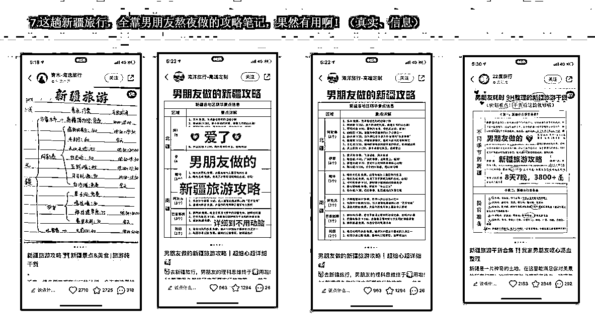

由于是根据已有的爆款内容来确定选题，所以有时是需要我们适当放弃自己的特色和想法，很多时候，你忙了一下午的原创，可能抵不上一个火过的爆款再发一次。

所以制定爆款选题的藏宝图，把火过的内容、容易引流的内容排着顺序发：

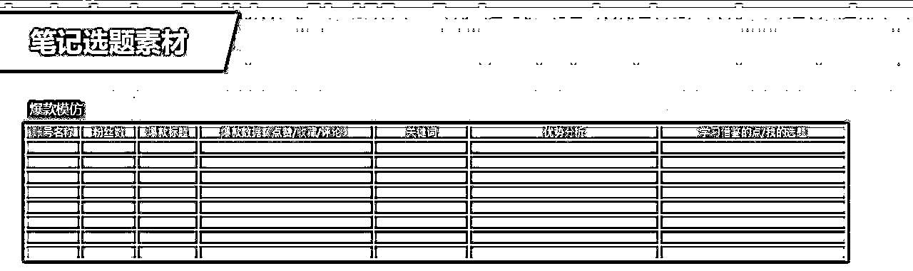

内容来源：《小红书 3 天新号粉丝破千的运营方法论》

内容来源：《小红书 3 天新号粉丝破千的运营方法论》

对于一些小众领域，会出现一种情况：就是该领域下火过的内容，由于关注的人不多，笔记的数据也不会很高，这个时候怎么判断是否可以作为自己的选题呢？

圈友@杨星城 提供了一种方法，以下是他的原文：

找到你的对标账号，然后看他们做什么选题是爆款的，就往这个方向去创作新内容。

那什么才是爆款呢？难道千赞万赞就是吗？

不一定，如果一个账号 60 万粉丝，他一篇笔记千赞以上，其实都不叫爆款。我觉得大家可以通过以下这几个角度做定义爆款：

1）点赞数比粉丝数要多的

2）找 3 万粉丝以下有千赞的作品

3）万赞以上发布时间在 30 天内的

也可以做一下选题的计划：

找到 3～5 个对标号，粉丝数都在 3～5 万以下的，然后每个号找出 3～5 个爆款选题，这样你就差不多有 10～20 个题目了。

内容来源：《小红书日引流 200+，简单粗暴！从博主玩法迭代矩阵玩法 2.0 版》

### 5.2.5 结合自身经验做干货分享 @子渝

笔记内容也可以从自己，或者身边人的经历切入，尤其是从新手走到老鸟的亲身经验，会显得更加真实、接地气，用户不会有被老师教学的感觉。

通过测试，小红书用户也确实更喜欢故事经历、案例类型的笔记，爆的概率也更高。

比如：XXX 同学用我教的方法成功找到月薪 3 万的运营工作

比如：互联网大厂运营工作 10 年，分享我的职场 XXX 或求职 XXX 经验。

这种也很适合留钩子，会吸引到精准咨询。

这些方法大家都可以实际测试下。平时多研究爆款笔记，自己写了笔记也要记得做下数据统计，复盘角度是否有问题，时间长了你的选题触觉会越来越好。

内容来源：《中年宝妈“996”下班后当职场博主 聊聊我小红书从 0-1 到变现的过程》

### 5.2.6 重复做爆款选题 @杨星城

每个平台都有自己不同的规则，而小红书对于内容的重合和查重还是比较低的。所以，可以通过各大平台或论坛、找到你所在的垂直领域，再找找优质内容或爆款内容，组合一下，就成了一篇“新”内容。

注意：本方法仅适用于矩阵账号，对于单个账号并不合适。

大概操作方式为：确定了要写的选题关键词后，去 XX 搜，如果是高赞视频的话，就用视频转换为文字工具，有了文字后，按照自己的大白话修修改改。

而这个 XX，包括但不限于：

抖音

小红书

B 站

知乎

5118 百度

百度

微信

必应

垂直领域的网站/论坛

.....

有了这个思路，你根本不愁写什么内容，甚至，你找大学生实习生帮你写内容，就算他不是这个专业领域，同样也能产出内容。

写完一篇文章后，难道就只能发一次笔记吗？显然不是。

要记住，小红书对笔记的重合和查重还不是很严，这个是重点。所以，当写完一篇笔记后，还可以通过不同形式的小红书封面风格来套进去。

而如果这篇笔记爆了，意味着选题和内容都是不错的，那我们就可以再采取不同的「展现风格」发一次，大概率笔记还会再爆一次。

爆款是可以重复的，重复做爆款！

而什么叫不同的「展现风格」呢？

所以很多时候，我们的爆款内容是重复加工的段落组合，把原本三四篇文章拼拼改改变成 10 多篇笔记，依旧是有流量，不会违规。

再次强调，并不是说在一个号上经常换封面风格，而是一篇内容换不同的风格发到不同的号上。有时候这个号没流量，另外一个号就有了。

内容来源：《小红书日引流 200+，简单粗暴！从博主玩法迭代矩阵玩法 2.0 版》

## 5.3 丰富内容类型

### 5.3.1 常见的六种笔记类型

平台里爆款笔记类型五花八门，新手可能会看得眼花缭乱，无从下手。这里，我帮大家总结了最适合新手上手、起号阶段最易这是小红书里最容易起量的笔记类型，主要特点是，数量多而全、「怼量」，记得在首图上突出这一点，标题多用数字冲击，用户会爱看。

这是小红书里最容易起量的笔记类型，主要特点是，数量多而全、「怼量」，记得在首图上突出这一点，标题多用数字冲击，用户会爱看。

合集笔记一般这么写：将同样风格特点、功效功能、针对人群、场景的物品放在一起推荐。每类产品都要展示和总结描述它的特点风格、使用体验。

首图特点：多个物品摆在一起实拍，或者拼图，每个物品标记下名称或价格，图片核心在于凸显“多”。

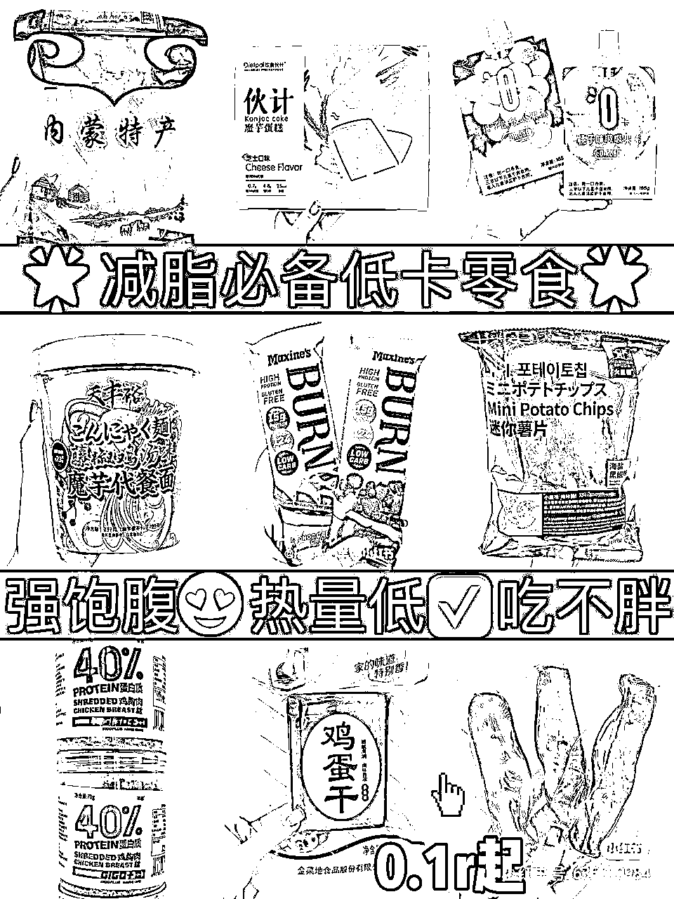

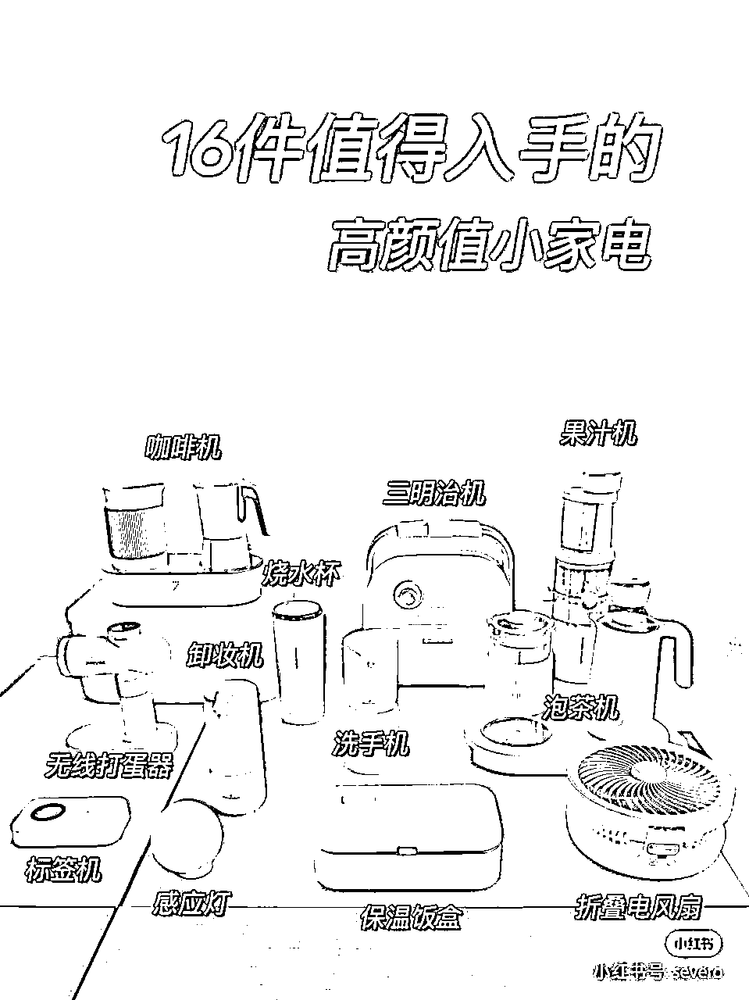

跟合集有点相似点，但合集笔记一般倾向于全部都推荐，而测评类笔记一般会有“红黑榜”或星级评分，对产品好坏进行区分。

跟合集有点相似点，但合集笔记一般倾向于全部都推荐，而测评类笔记一般会有“红黑榜”或星级评分，对产品好坏进行区分。

笔记内容一般包含 3 个部分：

场景引入——每个产品的体验描述——总结产品红黑榜/适用人群分类/不同维度的星级评分

首图特点：红黑榜对比类首图；或合集类首图上添加标识区分不同产品的评分或适用人群。


对标笔记：

《成都重庆攻略❗红黑榜教你避雷👭旅游必备》

《【豆浆粉测评】大户人家系列第十三期》

## 3\. 科普类笔记

难度：2 颗星

适用人群：适用于全部类目；

特别提醒，好物带货 IP 不能全部都铺新手科普，还是要以种草推荐为主。

科普不是指一大堆难懂的课本术语堆砌，也不是枯燥的百度科普。

小红书用户喜欢的科普笔记，你可以理解为是新手必须懂的知识点整理，这类笔记可分成多篇喂给用户食用，做得轻量直观；首图特点：一张图汇总全部知识解析，或者体现出密密麻麻的知识点清单。

首图特点：一张图汇总全部知识解析，或者体现出密密麻麻的知识点清单。


对标笔记：

《学茶一定要懂得这 20 个词语💦提升饮茶境界🍵》

《一张图让你看懂各大滋补品的段位‼️》

## 4\. 避坑类笔记

首图特点：纯色图/实拍图/网图都可以，图上要加标题花字突出主题。

首图特点：纯色图/实拍图/网图都可以，图上要加标题花字突出主题。


对标笔记：

《装修合同避坑指南❗看清装修公司套路省几万》

《避坑！这些野鸡设计比赛别再参加了！》

首图特点：展示全部教程步骤或部分步骤图

首图特点：展示全部教程步骤或部分步骤图


对标笔记：

《一周备菜 | 备菜流程和小工具 都在这里‼️》

《骨灰级装修流程攻略✨照着装修不踩坑✔️》

攻略类笔记一般要从多个维度去总结，每个维度都清晰、详细描述具体怎么操作和对应的注意事项，体现的干货信息点越多越全越好。因为要全面，所以制作起来比较耗费时间，但做好了出爆款的概率很高。

攻略类笔记一般要从多个维度去总结，每个维度都清晰、详细描述具体怎么操作和对应的注意事项，体现的干货信息点越多越全越好。因为要全面，所以制作起来比较耗费时间，但做好了出爆款的概率很高。

首图特点：呈现部分攻略信息，用小标题花字标记所涉及的每个维度。常用【建议收藏】【最强攻略】【最全攻略】【必看】等文案花字吸引用户点击。


对标笔记：

《必看❗️北京环球影城攻略*干货+隐藏玩法》

《二手 iPad 选购攻略🔥超详细指南及验货攻略》

## 7\. 注意事项总结

上述六种笔记类型里：

合集、测评笔记常涉及好物、好地方，直接种草的属性更强，也更容易实现变现；

科普、教程、避坑笔记更多偏向专业知识的传播，不一定能直接带货，但能体现 IP 专业度，也有助于带来用户转化；

攻略类笔记则是种草带货和传播知识属性都有。

虽然上述 6 种笔记类型比较通用，带货和知识 IP 都可做，但不同类型 IP 的内容规划倾向不一样。

带货 IP 可以合集、测评和攻略等带有强种草属性的笔记为主，知识笔记为辅；

知识 IP 可以科普、教程、避坑和攻略等知识笔记为主，合集、测评种草为辅。

特别注意的是，数据好的笔记不一定就能带来变现，要看你的账号类型。

做精准引流的 IP（有自己产品和服务的），只要笔记能体现出产品的好或者服务的专业度，就算互动量不好、不涨粉，也可以直接带来不错的变现。

纯博主 IP，靠广告变现的，那你必须要维护好每篇笔记的互动数据，会直接影响你的广告报价。起号阶段基本有 3-5 篇小爆文，就会有广告 Pr 联系你合作。

内容来源：《初阶 | 小红书-爆款笔记｜航海实战手册》

### 5.3.2 笔记类型规划——三类笔记占比 @陈铭 ivy

💡

小节纲要

等到积累了一定的笔记数据量后，有了一定的小红书爆款笔记。这个时候就需要考虑小红书 IP 账号的笔记类型规划了。

不同内容的笔记，所能达成的效果也是不一样的。简单来说，有的笔记就是为了引爆流量，为自己的账号增加关注度；而有的笔记发出来则是为了引流和转化，根据这一点，我们可以把笔记分为 3 类：

✅引导付费的，不容易爆的笔记✅容易爆，但不容易触发用户付费的笔记

✅容易爆，但不容易触发用户付费的笔记

✅又容易爆，又能导向付费的笔记

日常发布笔记的时候，我们可以有意识地控制不同类型笔记的发布数量，通过控制各类笔记的比例，使其达到最大的引流、转化效果。

## 1.「 40% 的笔记」写直接导向付费的内容

1)直接介绍，我可以提供的服务和内容

同时，这个内容要比同行多，价格还比同行低。是的，就是这么简单直接。

举个例子，卖包子的可以这么写：

标题：老王家包子的价格和介绍

正文：

包子的馅料：豆沙，猪肉，牛肉，胡萝卜

我们的包子都是师傅纯手工制作，皮薄馅多，吃完会让你非常开心而且一口气上六楼一点都不费劲。

买包子送定制环保纸袋，超级时尚！这个同行都没有哦！

再加上一个你的包子 3 元一个，同行包子 10 元 一个的截图，就齐活了，看到这个笔记并且来问的用户，打招呼就是：你好，我想找你买包子。

用户好评+用户使用后效果，尤其是和同行对比

发用户好评的时候最好讲一个跌宕起伏的故事，先是在同行那里被坑，然后找到了我们，买到了好吃的包子。人类的天性就是喜欢看故事嘛。

## 2\. 「 40% 的笔记」写容易爆，但不容易触发用户付费的内容

这类笔记的作用是，引爆流量，把另外的 60% 笔记带火，同时让小红书官方认为，我的号不是一个只会卖货的营销号，我还是在给这个平台的用户提供价值。

2）专业领域的内容

也就是我手把手教你做包子呀，面粉要怎么混合，揉面要怎么揉等等。这样的干货类内容发布以后，得到的点赞和收藏会比较多，几乎没有评论。看这类攻略的人，大概率都是想自己做包子，而不是找我们买包子。

3）免费送资料


如果是卖知识付费的产品，用我图片中的这种笔记去做引流，效果就非常非常好，很容易爆。

虽然看到这种笔记，找过来的用户，大部分是拿个资料就走了，很难转化付费，但只要数量堆上去了，总有一些付费的。而且这种类型笔记是最容易火的，可以带火其他笔记。

4）蹭热点新闻，同时跟自己的业务挂钩

比如前段时间的谷爱凌，橘墩墩，刘畊宏等等，直接在小红书上搜就很多。当你在很短的时间内，看到平台上很多人都在说同一件事，那就直接跟上。

## 3\. 「 20% 的笔记」写又容易爆，又能导向付费的内容

这个笔记非常小众，这类的笔记也是最难写的，但效果非常好，我给大家举个例子。

笔记主要内容：内容来源：《粉丝 3000 月营收 20 万，小红书低粉高变现的蓝海攻略分享》

内容来源：《粉丝 3000 月营收 20 万，小红书低粉高变现的蓝海攻略分享》

# 六、探索小红书变现 @谢无敌

根据 QuestMobile 2020 年的数据，小红书平均带货转化率为 21.4%，而抖音、快手和微博的转化率分别为 8.1%、2.7% 和 9.1%。

正是基于平台里有一群喜欢“买买买”的用户，以及天然的“种草”社区属性，小红书的带货转化率比很多公域平台都要强：


而这一点意味着，商家爱在这里引流、投放，吸引精准客户；博主（即便是素人博主）也有更多机会变现。

根据销售属性不同，小红书变现方式大致可以分为以下两大类：

一类是卖东西，自己有可销售的产品、货源或服务，包括实物产品和虚拟产品，比如资料、课程等等。

简单来说就是，博主本人有商品可以卖。这种类型的小红书账号，我们一般叫做商家博主。

另一类是卖时间，自己没有商品，想通过小红书增加收入。

通常是把小红书当做副业去做，当然也有全职做的，比如一些宝妈，通过接广告或者卖别人的产品变现，我们称之为纯博主。

那接下来，我们就从这两大类展开，分别讲一讲都有什么样的变现渠道。

## 6.1 商家博主类变现方式

小红书虽然以种草属性走入大众视野，但一直以来，它都在不断尝试，打造从内容到变现的营销闭环。毕竟，谁也不希望“肥水外流”。

企业专业号还可以直接关联线下门店和地址。


电商精品卖货模式 @木子蟹

电商精品卖货模式 @木子蟹

有无货源都可以玩，没有基础也可以尝试做。有电商基础，有些选品经验，懂得什么是爆款，红海产品更好。前期不出单投资相对少，周转资金准备 1-2W，不然笔记爆了没钱发货也很难受。

无货源卖家可以开薯店，直接小红书文案挂店铺链接成交，然后找 1688 商家进行签订代发合同，到小红书备案。这样基本不用怕内容枯竭，找其他平台产品评论区的内容，组合或直接用软件生成，我自己测试的三个号 15 天肯定有一个号起来

有货源能自己发货更好，有货源的卖家要明白一点：要通过小红书种草，然后引流到其他平台（淘宝，多多，京东…）这样成交很方便，也弥补了刷单的费用

这种引流，通常会有 60% 的流失率，但客户粘性普遍较高（现在这样做的人少，所以大有机会），有货源能自己发货，还能引流微信做私域营销，未来的流量越来越贵了，也要注意布局。

平台发现用户的店铺存在无货源代拍行为，根据《关于无货源代拍的专项治理公告》进行处置，故笔记申诉不通过。若对此违规判定有异议，可向平台发起申诉。

申诉方式：发送申诉邮件至 mri_appeal@xiaohongshu.com

邮件内容包含【店铺 ID、店铺名称，并提交相应举证材料】，详情：小红书商家课堂内容来源：《小红书如何”开源节流”运营变现》

内容来源：《小红书如何”开源节流”运营变现》

无货源内容拓展 @表弟

无货源各个平台到现在也无法完全禁止，大家做到以下几点，可以最大程度避免发生无货源的现象

远离 PDD，实在找不到货可以找 PDD 老板谈代发。

尽量选择 1688 专业代发平台。

不要大批量上货，这也是一个稽查的方向。

尽量选品的时候在 1688 对接好货源，尽量不要先上品后找货。

出现面单/短信/好评卡等无货源导致的投诉，能用钱解决的不要吝啬。

其中第四点至关重要，也是无货源与代发的区别。

我的淘宝店一直都是先找货源后上架，从来没有出现过 48 分和无货源。无货源玩家都是先大量铺货，出单后再找货，找不到下架，一次两次平台/消费者不会找你麻烦次数多了可能会判断无货源。

架，一次两次平台/消费者不会找你麻烦次数多了可能会判断无货源。

如果实在是这个品太好了，目前没有货源，可以预售 15 天，给厂家留足够的时间出货，也降低自己的风险。基本没有中国制作十五天造不出来的品，所以只要产品大爆，实在不行自己联系工厂做也可以的。

注：上述方法无法解决根本问题，如果被投诉为什么其他平台发送的短信，就会被打上标签，然后帐号被封

内容来源：《小红书店铺逆向思维选品及爆款笔记制作》

### 6.1.2 广告投放

品牌博主可以在小红书专属的投放平台——聚光平台，进行广告投放。

目前有 4 个模式，普通中小品牌方比较适合投产品种草和客资收集。

但是，只有企业专业号有这个功能，而且比较烧钱，有钱可以任性投，预算少的商家不建议考虑。

### 6.1.3 达人合作

除了自己开店、投放广告，企业专业号还可以通过找其他博主合作，扩大销售渠道和品牌影响力。

蒲公英平台（https://pgy.xiaohongshu.com/）就是小红书官方认可的合作平台。

里面有四大核心营销功能：

寻找博主：商家可自行挑选博主，发起合作。因为粉丝＞5000 的博主才能入驻，所以质量相对有保障，且商家可查看博主的信用、评分情况。

寻找主播：商家可选择有直播权限的博主，进行直播带货合作。

项目招募：商家通过招募寻找博主合作，每个月最多发起 10 次。

好物体验：商家免费送自己的产品给博主，博主试用后产出试用笔记。

但是蒲公英平台会双向收取商家和博主各 10%的费用，为了达成合作，有的商家会帮博主掏这部分费用，或者返一部分钱给博主。

### 6.1.4 引流变现

虽然官方平台的合作方式更加安全，笔记还能投放效果广告等，但是对于很多中小商家来说，平台费用毕竟也是一笔费用，而且操作流程相对繁琐。

所以很多商家更愿意把用户引流到私域去转化。但是小红书对导流审核非常严格，所以这种方式可以说是在夹缝中求生存，需要有比较高的引流技巧。

### 6.1.5 找博主分销合作

商家博主可以寻找一些优质的博主，进行深度合作，比如分销。

商家博主可以寻找一些优质的博主，进行深度合作，比如分销。

### 6.1.6 直播带货模式 @木子蟹

有直播带货经验的圈友，可以根据小红书客户画像和货源优势进行选品，带货直播，话术剧本跟抖音直播带货差不多

在开播前几个小时发布一篇预告直播笔记，写一些比较有诱惑性商品价格进行开播时间预告

如果有条件的话，进行投薯条来增加流量，使到时候直播间人气更加聚集，得到更好流量变现转化。

内容来源：《小红书如何”开源节流”运营变现》

### 6.1.7 电商铺货邀约达人带货模式 @木子蟹

以小红书店铺为铺货平台，做像淘宝一样的货架电商模式，从多个渠道邀约达人帮忙带货，找适合做自己商品的达人进行商谈分佣合作。

（这里做一个解释：货架电商，也就是搜索电商，主打的是“人找货”，用户相对精准，且产品对他们来说是刚需。)


内容来源：《小红书如何”开源节流”运营变现》

## 6.2 纯博主类变现方式

小红书对素人博主还是十分友好的，也因此吸引了越来越多的人来做小红书。但是没有货源、没有产品的博主，怎么才能承接住流量，实现流量变现？

在说变现之前，我们先来了解一下小红书博主的等级划分，根据粉丝数量多少，小红书博主大致可以分为五个等级：

素人博主：粉丝小于 5 千；

初级达人：粉丝 5 千到 5 万；

腰部达人：粉丝 5 万到 50 万；不同等级的博主，接广的价位也不同：

不同等级的博主，接广的价位也不同：

（蒲公英报价截图，供参考）

### 6.2.1 软广变现（无费）

有些商家预算不足，或者所售产品本身价值不是很高，就会和博主采用无费置换形式进行合作。

商家免费给博主提供产品或服务，让博主发体验笔记进行推广，除此之外不再产生其他额外费用。

比如出版社免费送书给博主，博主发读后感或者书单推荐类笔记；商家给探店博主免费提供吃喝等。适合前期没什么粉丝的时候做。

### 6.2.2 软广变现（有费）

粉丝达到一定数量后，就会有商家私下联系你，让你发布软广笔记，并给予相应的报酬。

其中有费软广的合作形式包括：有费置换、有费寄拍、有费探店参展等。

行业不同，接广门槛也不一而足，有的行业，50 个粉丝就能接到广告合作，有的行业，可能需要 1W 以上粉丝。

但是粉丝数量越多，报价越高，一般广告报价为粉丝数量的 10%-20%，与你账号的近期活动量、垂直情况、品牌契合度、粉丝粘性等都有关系。

粘性等都有关系。

### 6.2.3 通告平台/微信通告群寻求合作

相比于前面两种被动等待式接广，这种就属于主动出击型。

微信小程序里，有很多通告类平台，PR 和中介会在上面发布一些合作招募，寻找博主合作，例如螃蟹通告、萌通告、布偶通告、试盒等。

除此之外，可以在小红书上搜索“通告”或者“ pr ”等字眼，有意识的去加一些 pr 的微信通告群，pr 一旦有通告都会发在群里。

注意：以上三种方式，都属于非正规的合作方式，不被小红书平台允许。再加上合作方鱼龙混杂，质量无法保证，所以既有违规的风险，又有交易的风险，大家要注意甄别。

### 6.2.4 成为品牌合作人 @大芝

正规的合作方式，就是入驻蒲公英平台，成为品牌合作人，入驻门槛是完成专业个人号认证，并且粉丝 1000 以上。

1） 入驻蒲公英平台

目前小红书也在大力支持低粉博主变现


正常来说合作流程见下图：

因为是官方合作渠道，所以足够安全保险，缺点是需要扣除 10% 的平台费，且入驻有门槛。

2）定制合作/招募合作

都是一口价广告，广告报价是你粉丝数量的 10%。一千粉丝，就是 100 块一口价。

3）共创合作和新芽合作

对低粉博主更有优势的是共创合作和新芽合作：共创合作能拿到更多的钱，新芽合作能拿到更多流量。

共创合作除了一口价以外，视频互动数据好，还可以拿到更多广告提成。

共创广告提交笔记时间和统计提成的时间是不同的。

我第一条共创广告计算提成时间截止到 3 月 10 日。

我错以为笔记发布时间也是 3 月 10 之前。但实际笔记提交时间是 3 月 2 日截至。时间记错了，导致广告关联失败。

后来我把这篇笔记的广告部分删掉发布，结果数据跑得比关联了的那篇还要好，错失了 2000 块的广告费，损失惨重。

新芽合作，除了一口价以外，还会获得额外的流量推广，增加曝光度。好处不言而喻。

新芽合作的广告很多，报名也很容易通过，所以大家报名的话注意排期。我刚开始不懂，一口气报了太多，集中通过了 5 个，档期有点排不开了。


内容来源：《低粉变现+打造爆款视频的秘籍》

### 6.2.6 好物体验

个人主页左上角，点开后可以看到有个“好物推荐”，申请后如果被选中，只需要写一篇试用笔记就能免费获得该商品。

适用于几百到几千的小粉丝量博主，如果你的账号整体调性和产品匹配度高，就更容易被选中，虽然不是直接的变现，但也算是“媷羊毛”了。

### 6.2.7 知识变现

这种变现方式主要是针对知识类博主，一般需要有自己成型的课程产品，通过开通专栏变现。

比如 PPT 课程、写作课程、瑜伽课程、育儿课程等等，通常来说，需要粉丝达到 1W 以上才能开通，几千粉也可以尝试申请，也有概率能通过。

开通之后，会在个人主页显示专栏入口。

### 6.2.8 带货变现（直播带货或小清单带货）

小红书带货主要包括直播带货或小清单带货，卖别人的产品赚取佣金。需要完成专业号认证，并且粉丝达到 1000 以上才能开通。

只需要跟商家谈好对应的带货佣金，领取免费样品，等样品到了进行拍摄、拆箱、测试、写好笔记，坐等笔记爆文分佣就行，建议用多账户进行矩阵起号来带货，可以获得更多的佣金。

内容来源：《小红书如何”开源节流”运营变现》

### 6.2.9 小红书店铺变现

小红书实施“号店一体化”之后，0 粉就可以开通小红书店铺了。但目前，个人店铺对于类目的要求比较高，博主在申请的时候需

### 6.2.10 引流分销变现

其实纯博主也可以尝试去选品，并且找一些不错的商家来进行合作。

比如说母婴博主，看好了一款奶瓶不错，就可以与卖奶瓶的商家谈分销合作。

谈好合作之后，母婴博主可以通过做优质的种草内容来吸引用户，一旦笔记爆了之后，大概率会有很多用户在笔记下留言问怎么买。

这时候博主就可以尝试把这些用户引流到自己或商家的私域，进行转化。

### 6.2.11 做探店达人或旅行达人变现 @木子蟹

通过下线探店或旅行分享体验，为实体商家进行引流，做同城化精准流量推送，为商家带来流量，从而进行流量变现。

那问题来了，这些素材从哪里来？

这个问题就很简单解决，打开 boss 直聘、实习僧、青团社，去针对大学生发布校内线上兼职，在上面咱们可以根据学历、专业，去筛选摄影专业的大学生

业，去筛选摄影专业的大学生

找有一定审美基础和设计能力的，稍微培训下就可以用。进行现场拍摄探店，这样的素材就有了，然后再跟进自己客户需求，来进行写笔记打卡变现。

内容来源：《小红书如何”开源节流”运营变现》

以上，就是小红书目前常见的 18 种变现方式。无论是哪一种变现方式，都需要用内容打底，真诚的分享+有价值的内容，才能打动用户，从而愿意为你买单。

需要注意的：部分带货变现方式需要满足平台指定要求，比如品牌合作权限需要粉丝达到 1K 才可以申请。知识付费变现需要你有产品、分销货源或者服务。

## 6.3 问题一：涨粉慢、广告佣金低，怎么办？

接广告的佣金取决于：互动量和涨粉量，而涨粉和广告佣金并不一定挂钩，主要还是看互动情况。

同时，涨粉量是和内容挂钩的，所以如果目前佣金较低的话，最好还是先专注做内容，靠做好内容把互动数据和粉丝量做起来。

来。

也可以引流私域变现，但这需要做垂直赛道的产品，比如电器、香氛等细分产品，做垂直种草内容。

## 6.4 问题二：缺少合作商家，怎么办？

做博主的话前期都是置换比较多，可能会有少量的广告费。

建议前期的话如果遇到一些不错的置换合作，是可以尝试接的，这样也可以锻炼对接、合作的能力，积累经验。

所以一开始的话不要抱着一下就能赚很多钱的期待，先定一个小目标：达到 5000 粉丝，5000 粉后就可以入驻小红书官方的蒲公英平台，上面会有比较好的资源。

内容来源：《初阶 | 小红书-爆款笔记｜航海实战手册》

# 七、科学完成小红书引流

💡

章节纲要

小红书的众多变现方式中，引流私域的玩法不需要多高的粉丝数，甚至是多么亮眼的笔记数据，只要吸引到精准的用户即可。

即可。

在第一篇笔记就可以开始布局私域引流，正反馈周期非常短，算是最适合新手入局小红书后的变现方式，所以这里重点介绍如何引流私域。

为了帮助你更好的学会如何科学引流，我们在星球的精华帖里摘录了十二种玩法。

✅如果你想要免费引流，可以选择玩法一 ～ 玩法八，不过有些方法是存在一定风险的

✅如果你想要更安全的引流，愿意付出一定的成本，可以开通企业号，这样会更安全

✅不管你选择了哪一种玩法，都需要了解小红书引流的风险点，建议你在选择了具体的引流玩法后，认真看一下注意事项。

做项目最需要的就是正反馈，在小红书上面引流到一个精准粉丝就是一个非常好的正反馈，快去试试吧。

## 7.1 小红书引流的方法有哪些

没有绝对安全的引流办法，只有相对安全的引流办法。大家可以依据自身情况，选择自己的引流玩法。

### 7.1.1 玩法一：图片手写微信号引流 @劲猫

目前粉丝群是最安全的方法，一个号可以创建 5 个粉丝群，设置成在主页展示，粉丝点击进入主页就可以看到，如果没有粉丝群的可以让有粉丝群的账号帮忙建，然后把你拉进去，创建人再退出来，你就会自动变成群主。

目前粉丝群是最安全的方法，一个号可以创建 5 个粉丝群，设置成在主页展示，粉丝点击进入主页就可以看到，如果没有粉丝群的可以让有粉丝群的账号帮忙建，然后把你拉进去，创建人再退出来，你就会自动变成群主。

至于群名，可以是资料群，成长群等有一些诱饵性质的，让用户想加群。加群之后，可操作的地方就太多了，群公告，群内消息，都可以用来做引流。

建群步骤


对新成员展示历史消息一定要打开，无论什么时候入群的朋友，都能看到以往的广告信息。

对新成员展示历史消息一定要打开，无论什么时候入群的朋友，都能看到以往的广告信息。

建好群后，就可以把粉丝群的入群码，发布在评论区里。然后把进群链接置顶（评论区超过 50 个评论就有这功能），这样用户看到后就可能会加入群聊。


需要注意的是，入群码有时效性为 7 天。

另外还有一个引导进群的方式：在笔记中可以插入小红书群。

不过这个功能还处于内测阶段，不是所有账号都有。可以通过数量博概率，就是多注册几个小红书账号，多发优质内容，总有粉丝进群后，发布一条群公告即可，比如我们这样发布的：

粉丝进群后，发布一条群公告即可，比如我们这样发布的：


考虑到用户不方便复制，可以在群公告说明情况信息，然后单独发送微信号。

如果有新进群的粉丝留言提问，及时回复即可

每天发布一次群公告就行，太多了容易导致违规，由于之前设置了 新用户进群展示历史信息，所以不用担心他们看不到你的广每天发送一次群公告，提醒群成员添加你的微信号，最安全的玩法还是用助理号来操作，设置群管理员即可。

每天发送一次群公告，提醒群成员添加你的微信号，最安全的玩法还是用助理号来操作，设置群管理员即可。

每天在群里发一遍微信号，单独发出来，方便用户复制粘贴。

重复以上 3 个动作，我的测试结果，添加率能达到 40%，前期稍微辛苦一点，账号起来后，群公告一次设置好，群聊展示到主页后，后期完全可以不用管的，粉丝自动进群，自动看到广告，添加你的微信。

群引流方式三：广告笔记导流

还有一种导流方式，就是推送广告笔记，比如我们这样的：


注意事项

群聊名称尽量委婉一点群公告里发了微信号的话，一次设置好，今后尽量别修改，减少犯错率

群公告里发了微信号的话，一次设置好，今后尽量别修改，减少犯错率

每次拉群，间隔 10 分钟操作一次，否则提示操作频繁

如果群被投诉，第一时间选择解散本群

内容来源：《新手做小红书打卡，一周涨粉 5.2 万，变现 6000+，引流私域 1500 人，简单可复制》《小红书引流，一天 300 人加微信，实操分享》

### 7.1.3 玩法三：个人简介中里面留自己的微信号 @杨飞


我们测试过，刚注册的新号是无法直接放联系方式的，需要注册有一段时间的老号才能这样操作。

一定要使用谐音字：V、/、徽、威、崴，这些字眼大家都是秒懂的。

小号的名称可以是：小助理、XX 助理号、XX 唯一助理，总是小号和你有关，想要和你产生链接，小号找答案。

分享 2 个具有代表性的，比如这位博主，直接把小号名称取为：这里领取资料。


粉丝一看便心领神会，潜在客户点击之后，跳转进入【这里领取资料】红薯号，完成私域导流只需两步：

先把此号的个性签名改为：资料看下方作品自行领取↓↓↓

再发布一条作品，使用单图形式，封面图上留下微信号


个性签名中直截了当表明有 XX 书籍可以赠送，而且还免费，获取的方式 @ 取资料小助理。

个性签名中直截了当表明有 XX 书籍可以赠送，而且还免费，获取的方式 @ 取资料小助理。

这种方法导流效果真好，而且过滤后的粉丝超级精准。需要注意的是，小号不要发多条笔记，发得越多犯错的几率就越大，最好是只发一条带有微信号的笔记即可。


如果你团队是矩阵操作小红书引流，可以多准备几个小号，我们目前的配置是：5 个发笔记的账号对应一个小号。

大小号配合，大号在笔记/评论区中 @ 小号，给小号导流，同时小号也要多互动，可以多给大号评论，或者帮大号回复。

需要注意的是，微信等词汇采用谐音字，小号只发一条广告笔记，一机一卡一号操作。

如果流量比较大，就要尽可能多放几个微信号，不然很容易添加频繁。

还有小号引流贴要注意同行举报，如果举报的话，帖子会被屏蔽掉，要把下面的文字重新修改，再发出去就可以了。

个人微信容易添加频繁，所以也可以在图文第二张图放了公众号名字的图片，提醒如果微信不能加，可以通过公众号加。

内容来源：《新手做小红书打卡，一周涨粉 5.2 万，变现 6000+，引流私域 1500 人，简单可复制》《小红书引流，一天 300 人加微信，实操分享》

### 7.1.5 玩法五：置顶笔记 @谢无敌、@蓝子鱼

发布超过 20 条笔记后就可以进行笔记置顶了，为大家展示 3 种置顶笔记的模式：

第一种：暗戳戳的故事名片引流法。

向别人介绍你是干嘛的，有什么服务，擅长什么，但是笔记内容里不引导私信，也不留微信号，通过个人经历和人格魅力、优秀案例来吸引用户主动私信。

第二种：就属于明朗朗的放置微信号或者引流信息到置顶笔记里。

这种引流笔记，被举报的风险比较大。新号和权重低的账号，不建议采用这种玩法，很容易被举报且举报成功。


内容来源：《初阶 | 小红书-爆款笔记｜航海实战手册》 《新手做小红书打卡，一周涨粉 5.2 万，变现 6000+，引流私域 1500 人，简单可复制》

### 7.1.6 玩法六：评论区小剧场引流法和图片引流法

1）小剧场引流不要集中安排小号评论，不然会看着很假，也会有数据异常的违规风险

不要集中安排小号评论，不然会看着很假，也会有数据异常的违规风险

安排的评论区小剧场话术要经常有变化，不然看着特别像水军

此方法相对来说安全～

2）评论区图片引流@Sanuk 小伞

小红书评论区可以发图片了，可以在求推荐产品的帖子下，评论图片吸引流量，比如评论区展示某个产品图，然后水军评论一波蹲链接。

内容来源：《初阶 | 小红书-爆款笔记｜航海实战手册》《#风向标# 小红书评论区可以发图片了》注意事项：升级为视频号才能创建合集。可以把合集名称改为微信引导。

注意事项：升级为视频号才能创建合集。可以把合集名称改为微信引导。

风险：整体风险偏低。


内容来源：《初阶 | 小红书-爆款笔记｜航海实战手册》

### 7.1.8 玩法八：通过瞬间引导用户查看收藏 @杨飞

这样的导流方式非常安全，隐蔽性极强，用户需要进入你的账号主页才能看到广告信息，虽说有流失，但安全系数挺高的。

直接开门见山，告诉你看收藏：


hi 我是 xxx 呀

hi 我是 xxx 呀

想一起交流学习的话

收藏里的传送门找我


可以说做得是真含蓄，隐蔽性太强了，如果用户不点击进入瞬间页面，都无法看到这句话。

我们来看看她的【收藏】栏的广告引导：


用户看到微信号，需要经过 3 个步骤：

步骤 1：进入你的账号主页

步骤 2：点击你的瞬间内容

步骤 3：点击你的收藏

内容来源：《小红书引流，一天 300 人加微信，实操分享》

### 7.1.9 玩法九：标记引流法 @杨飞 @蓝子鱼

小红书最多能配 9 张图，建议文章内容不要超过 7 张，第一张是封面，最后一张图中可以写明关注你有什么好处，你做过什么牛的事情，你现在做什么等等。

还有要在这里采用标记的方法，把你自己的账号标记上去，这样点击到主页会更方便，触达主页的机率至少提升一倍，触达主页以后才更有可能会关注你，标记时搜索自己的账号名称进行标记。


如果你想稳扎稳打的来做，可以使用【标记】这个小技巧，先来看看【标记】长什么样，如下图：


用户看到这一页内容的时候，点击【取资料小助理】，即可跳转进入取资料小助理账号界面。

优势：

站内跳转

导流安全

实操后没有一个账号被封禁，说明这种方法还是比较安全的，如果你也想这样操作，记得先搞个小号。

首先完善账号信息

小号的头像，可以和大号使用一样的，统一化能增强信任度。


②引导用户进入群聊


③引导用户看瞬间，利用瞬间打卡的形式配合导流


我们目前采取的方式是，引导用户看笔记内容，如图：


这个得根据你的引流诱饵来进行设计，虚拟产品是成本最低的，10G 资料包、一个软件安装包、一张代金券，都是足够具有吸引力的。

账号信息完善好，并根据引导的提示做好内容展示，今后在发布作品的时候，合理利用【标记】功能即可。

如果你的每一篇笔记都要使用【标记】功能，建议设计一张图出来，每次发笔记都能使用，挺方便的。

这是我们团队目前使用的一个固定模板：


点击【标记】，点击对应的小号，拖动到箭头所指方向即可。

内容来源：《新手做小红书打卡，一周涨粉 5.2 万，变现 6000+，引流私域 1500 人，简单可复制》《小红书引流，一天 300 人加微信，实操分享》

### 7.1.10 玩法十：直播引流 @劲猫

这个引流方法算是比较安全的，具体的操作方式就是，建一个小红书小号，在首页发布一篇带有自己微信号的笔记，然后在直播的时候，小号在直播间发弹幕。接着本人在直播间说“想要学习的小伙伴可以看 XXX（也就是小号的名字）”

这个方法效果还可以，一场直播下来，场观 20 的情况下，引流 10 人左右没问题。

内容来源：《自媒体新手做小红书 3 个月，从 0 涨粉 8000 粉，变现 5 万》

### 7.1.11 玩法十一：企业号矩阵铺内容 @杨星城

如果是以引流为目的，更好的方式是矩阵批量铺内容，做废一个号无所谓，你要的目的是「导流到微信」，而不是站内比较好看的粉丝量。

个人号需要养号，引流也容易踩红线，而企业号是给平台 600 元的认证费，相对来说会比较安全。

相当于你给平台钱，平台睁一只眼闭一只眼吧。

也说明你这个号本身就是企业性质（商业）为主，而不是纯分享的干货博主用爱发电。

很多新手或自由职业者没有营业执照，很简单，办法总比困难多。

去淘宝搜“个体户营业执照办理”，个人营业执照 30～46 元搞定，办海南和自己所在地不一样都行无所谓，海南目前是最便宜的。第二天就可以拿证，就可以开干！

一个营业执照可以认证 3 个企业号，个人可以办理很多张营业执照，后期可以矩阵来做号。

圈友会问，这么粗暴，会违规吗？

根据实操经验来看，一个号回 300～500 多私信，还未出现过违规情况，500 以上就有风险，提醒过一次。大多数的情况是，笔记爆了，笔记的评论区太多回 “1” 的被系统检测出来后，就开始停流量了。

所以大家大胆去做，你一天回 100～200 多个关注，都是没问题的。话术和图片，可以多几组发不同的，避免系统违规识别。

内容来源：《小红书日引流 200+，简单粗暴！从博主玩法迭代矩阵玩法 2.0 版》承接的渠道准备好之后，要准备引流图。这里引流图的意思是，用户看了图片之后就知道要怎么找到你。

承接的渠道准备好之后，要准备引流图。这里引流图的意思是，用户看了图片之后就知道要怎么找到你。

几个目前比较流行的玩法：

AI 光影图留微信

AI 将二维码制作成画，系统难以识别

引流流程图，将如何找到你，制作成步骤图，注意把敏感字涂鸦掉

注意：1 和 2 适合会 Stable Diffusion 的人，如果会的可以去研究下，如果不会，就使用第三种，全行业通用，几乎所有赛道都能用，哪怕引流去淘宝、闲鱼，都可以用这个方式，逻辑是一样的，把去哪里搜索、怎么搜索制作成步骤图，发给用户。

图 1 光影字，图 2 二维码，图 3 引流流程图


## 7.2 小红书引流有哪些需要注意的

💡

小节纲要

这部分的内容会是一个很强的加分项，可能引流上还会遇到很多的问题，比如账号被封、流量爆了怎么更好的做分流...

这个阶段的内容是动态的，如果遇到这类的问题，可以在群里及时互动求助，一起积累更多的注意点。

### 7.2.1 笔记里或评论区中不能出现明确的引流话术

比如：请联系我、到我店里看看、来找我买、可以帮你代购、招代理、加我 V 等

### 7.2.2 笔记里不能放网址链接、二维码，这种会直接被限流


### 7.2.3 图片不能有其他平台的水印或营销话术水印

### 7.2.4 个人号进行超出规定范围的抽奖活动或其他利益诱导活动

抽奖权限开通：个人和企业粉丝都要达到 1000 才能开通。

每月可发起次数：个人号 1 次/月；企业号 3 次/月。

内容来源：《初阶 | 小红书-爆款笔记｜航海实战手册》

### 7.2.5 注意及时回复私信 @杨星城

小红书不像微信，微信天天会打开。小红书可能是用户无聊或者有需求刷到，等他们下次打开就不知道何时了，所以如果回复不够及时的话，通常就会遗漏掉很多引流的机会。

不过通常来说，一篇笔记爆了，手动回复可能回不过来，能做出流量但又承接不住，这比没做出流量还更心痛。所以，这种情况就需要用自动化工具来协助，不用时时刻刻盯着，也节省更多时间。

内容来源：《小红书日引流 200+，简单粗暴！从博主玩法迭代矩阵玩法 2.0 版》

# 八、如何完成私域变现

💡

章节纲要

用户引流到私域以后，我们离变现就又进了一步。不过大家千万不要懈怠，临门前的一脚尤为重要。微信承接用户的形式很多，不同产品也有不同的路径，本版块中主要为大家展示了朋友圈、视频号、社群、 1V1 咨询等承接方式。

对于做 IP 来说，以上都是比较常见的私域变现玩法。

## 8.1 玩法一：朋友圈 @劲猫 @杉木

朋友圈打造是私域产品销售很重要的一环。用户通过小红书加上微信后，最先去看的就是朋友圈，所以，朋友圈展示出来的内容是十分关键的。

这样的规划不仅能让别人知道自己能够提供的服务，也能让别人看到我的价值。从小红书进入微信的人看到这些内容后，信任感的建立就会比较容易：


不要像微商一样单纯进行产品堆砌，朋友圈包含一些个人的日常，可以让你的朋友圈更有血肉和温度。

同时，还要有用户思维，要懂你的用户爱听什么、爱看什么

比如：如果你的客户是年轻人居多，一些有意思的表情包、网络梗之类的就可以迅速拉近距离。

内容来源：《自媒体新手做小红书 3 个月，从 0 涨粉 8000 粉，变现 5 万》 《我是如何通过小红书，两个月带货营收 30 万＋》

## 8.2 玩法二：视频号 @杨星城

视频号作为一个新兴的短视频平台，目前热度非常高，我们也可以抓住这一风口，在小红书引流后，通过视频号社群及视频号直播进行变现。圈友 @杨星城 在这一方面有着不错的经验，大家可以参考一下他方式：

直播进行变现。圈友 @杨星城 在这一方面有着不错的经验，大家可以参考一下他方式：

流量来了，就要靠后端怎么去接住。这里为大家分享一种方式是：通过视频号社群+视频号直播来变现，私域+公开课形式来成交。

这里有个核心的公式是：你做的任何一个运营动作，都是为了下一个运营动作准备。

1）发资料，先进群

先感受一下，实际的交流方式：

微信私信：

同学你好呀，加的人有点多，为了有更好的 xxxx 服务，了解一下：

1、你是看哪篇笔记来的（可以的话截图，发对应资料，每个人要的资料不一样）

2、你多大啦？

3、你的职业是？

4、你有什么记忆难题，想我们怎么帮到你？

后期会根据年龄和 xxx 难题建一个群，方便大家更好的对学习交流。

——————————好的呀，关于 xxx 资料我们放在学习群里啦，回复“1”我拉你进群后看群公告哈～

好的呀，关于 xxx 资料我们放在学习群里啦，回复“1”我拉你进群后看群公告哈～

后期我们会有 xxxx 教练和大家直播讲解如何提 xxxx 哦！一节课就让你的 xxxxx 提高 5 到 10 倍～

群里都是一群热爱学习的小伙伴，进群可以和大家打打招呼哦～

如果 xxxxxx，就回“1”我拉你进 xxxxxx 群，资料都在群里，咱们群里见哈～

————————

同学，你可以点击链接进群领取哈，资料放在群公告那里哦

链接：xxxxxxxxxx（群邀请）


但是，我们也不能让用户拿了资料就跑了，所以要设置一个“场景”来触达用户。因为既然用户愿意来加微信拿资料，代表还是有潜在的需求意向的。

但是，我们也不能让用户拿了资料就跑了，所以要设置一个“场景”来触达用户。因为既然用户愿意来加微信拿资料，代表还是有潜在的需求意向的。

如果人数多的情况下，后续的直播就可以采取 1～2 天开一次的频率，如果人数少的情况下，就可以采取 3～4 天开一场直播的频率。

2）关于工具

对于在微信回复消息这种重复的工作，我们最好直接交给工具。

可以去淘宝搜“微猫”，168 月/终身，一个微信的群控软件，模拟真人操作，固定好话术模板，这方面直接省去一个客服助理的工资。


再者，如果平时睡觉比较早，但用户中夜猫子又比较多，很多时候凌晨都有人加微信，怎么办呢？

这种情况下，可以用腾讯云的服务器系统，把微猫软件登录在服务器系统上，这样就算电脑关机了微信一样在接待。

这个原理是，在云盘上有一台电脑，而这个云盘服务器不会关机，一直在线。选择最便宜的服务器就可以了，就只是用来登录微猫设置下就可以了。

3）群预热

还是前面说的：你做的任何一个运营动作，都是为了下一个运营动作准备。

预热是为了用户来收看直播，直播则是我们的交易场景。一定要有交易场景，也就是触达用户解决他们实际的需求。

把产品介绍和领取的资料用飞书文档整理好，然后放到【群公告】置顶，这样每次新人进来为了拿资料，都要打开飞书文档。

而飞书文档里给用户的资料是放到最后面的，所以前面一大堆都是产品介绍和一些更干货的知识内容。

用户要拿资料，就必须经过“产品介绍+干货”的内容讲解，这方面会下意识让用户知道：

我们是做什么的？

我们能帮你解决什么问题？

我们能达到什么效果？

当然，只有这步还不够，因为用户并不会很仔细地阅读飞书内容，所以需要再次引导。可以用红包来炸群提醒，把飞书的资料内容再依次发到群里。

4）提高到场率的小技巧

【福利诱惑】：

通知 8 点开课，现场会直接赠送一波福利

中间老师也随机赠送 xxx 礼物

听到最后，会赠送价值 xxx 元的 xxxx 礼物

【再次确认】：

入群的人用微猫打标签，提醒晚上 8 点来听直播课

临近 8 点开播，用微信自带群发助手提醒，再次通知已经开播，请进入视频号学习

【现场提醒】：晚上 8 点开播，主讲老师在 7 点 57 分赠送一波福利，领取福利的方式是截图直播间发到群里。然后群里就炸了，潜水的人看到群里这么热闹，也会进群看看。

晚上 8 点开播，主讲老师在 7 点 57 分赠送一波福利，领取福利的方式是截图直播间发到群里。然后群里就炸了，潜水的人看到群里这么热闹，也会进群看看。

直播间老师会讲三个方法，每次讲方法之前把话术发到群里“老师正在讲 xxx 内容，这个内容适用于 xxx”，在群里做提醒，并且发朋友圈，对这个方法感兴趣的同学又会重新进直播间。

总之，这个步骤的主要目的是提高到场率，只要用户能到场，我们后面的成交率都还算不错。

5）直播售卖

如果之前没讲过直播课，可以去看之前大航海教直播的视频资料，讲的很全面。

一开始直播磕磕碰碰很正常，关键还是要真诚+直播展示的方法有用，用户觉得有帮助就会购买你的产品。

直播可以采用 1 小时干货+半小时卖货 的形式，和抖音的自然推流可能不一样，因为我这边做的是私域流量来成交，更像是以前线下会销的模式。

和大家分享一句话：

前期所有的工作准备都是为了最后成交的 10 分钟，但用户最后决定是否埋单，不是因为你成交卖产品的那 10 分钟，而是你前


基本海外的主要支付账户都有，通过这个支付宝中转站可以直接到账人民币。

7）后续跟单直播后回访：

直播后回访：

把 “听完感觉怎么样？”改成 “听完后有哪些不懂的吗？”，会让用户更加舒服。

另外，直播间如果有布置课后作业，也可以拿些小号引导发作业出来，因为有些同学不想第一个发言，需要有人带头引导。

作业可以多写一些好评之类的话语，对一些犹豫不决的用户起到很关键的影响。

有个有趣的现象是，只要带头发的是「好评为主」的感想作业，后面的真实用户也会陆陆续续跟着发好评，感谢课程感谢老师之类的内容。

后面多种草朋友圈，多发学员效果和后续的作业情况，慢慢养熟跟进。

有很多用户第一次听直播不买单的，后面经过一段时间朋友圈的转换，再次来直播间再购买的。

8）低转高训练营

直播间卖正式课 1280～2480 元的课程卖不动的时候，以及后续跟单也比较吃力的情况下，我们做了两轮低价课程，5 天 99 元训练营，把之前没成交的，有意向的，都统统拉进训练营里。

训练营的氛围打卡都要设计好，让用户感觉到 99 元有 999 元的超值服务，目前测试了 2 轮，低转高的成交率在 15%～20%，不算太理想，但有这波动作就能转换之前没付费的用户。

用户数量多了情况下，训练营的成绩也可以经常晒单发朋友圈，包括作为小红书公域流量笔记的内容，也是一种素材提供的方式。

总体来说，后端变现的主要方式就是通过私域的社群+视频号直播+朋友圈转换的方式来促单。

有直播间这样的一个场景，会让用户更有信任感，以及直播间是讲干货技能，可以很好的解答大家的问题。

在后端所做的所有动作都是为了漏斗的转换率会更高，直指最终的到场率，也就是后续的成交转换率和金额。

内容来源：《小红书日引流 200+，简单粗暴！从博主玩法迭代矩阵玩法 2.0 版》

## 8.3 玩法三：社群

社群的具体玩法也有很多，可以根据不同的目标人群建立不同费用和功能的社群。下方为大家分享一下圈友 @蓝子鱼 对于社群的设计方式，以下是她的文章内容，大家可以进行参考学习：

### 8.3.1 初级打卡类社群 @蓝子鱼

免费群

小红书加过来不想付费，想参加打卡的先进这个免费群。

小程序打卡群

可以采用小程序：鹅打卡，这个工具是可以免费使用的。在上面创建打卡，每天更新一篇文稿，打卡 30 天收费 9.9 元，目前累计报名已经超过一百人。

内容来源：《新手做小红书打卡，一周涨粉 5.2 万，变现 6000+，引流私域 1500 人，简单可复制》

### 8.3.2 训练营 @蓝子鱼

因为我之前在演讲机构上班三年，我对整个培训的体系和内容非常的熟悉，所以我就选择这个来变现。

亦仁分享过：想验证一个产品能不能卖出去？先试一下把简单介绍写出来，看有没有人买，我简单把内容用文字写出来，然后就开始卖，结果当天就卖出去 4 个，我觉得这是个课程是有市场需求的。

其中有一个会员想要面试幼儿园教师，说面试非常紧张，她交钱以后，我立马微信语音跟她沟通教她方法，一方面是为了验证我的方法有没有用，第二方面是为了后面积累案例。

训练营有 14 节的高情商沟通音频，内容根据学员痛点，整理出来标题，然后通过我之前的知识整理出来框架，在通过书籍和一些文章整理详细内容。

如果自己声音比较好听的可以直接录，不然可以找一些配音的平台，直接把文字输进去，然后会生成音频出来，大大节省时间。

内容来源：《新手做小红书打卡，一周涨粉 5.2 万，变现 6000+，引流私域 1500 人，简单可复制》

### 8.3.3 知识星球 @蓝子鱼

我会每天在知识星球更新演讲，沟通相关的内容，发到群里给他们进行学习。

内容来源：《新手做小红书打卡，一周涨粉 5.2 万，变现 6000+，引流私域 1500 人，简单可复制》

## 8.4 玩法四：1V1 陪跑服务 @劲猫

如果你本身在某个领域做出过一定成绩，可以给到新手玩家一些指导意见，帮助他们成长的话，也可以尝试进行 1V1 的陪跑服务。并且，如果可以跑通整个流程，并且能够印证自己的方法论确实有效的话，后期也可以考虑做课程变现。

陪跑最开始的价格是 999 元，180 天陪跑，目的就是帮助学员跑出一个能够成功变现的账号。

具体的权益和细则几乎没有，课程也没有，我用的是笨方法，先给学员做初步规划，然后做账号装修，做每一篇笔记的选题和修改。几乎可以说，我在帮他们做号。

这样的做法非常辛苦，但效果也很明显，我的学员开始一个个出成绩，有减肥学员两个月涨粉 1 万的，有育儿学员 1 个月涨粉 6000，变现小 1 万的，有同城摄影服务学员，业绩 20 万的。

这些案例让我对做小红书越来越有信心，因为它证明了，我做小红书的逻辑是对的。

于是，我开始整理自己的经验以及带学员的经验，花两个月的时间，做出了一门课程。

有了课程之后，我的陪跑价格也水涨船高，目前涨到了 3899 元。

就这样，账号诊断+课程与陪跑，让我在 3 个月的时间里，从 0 赚到 5 万元。

内容来源：《自媒体新手做小红书 3 个月，从 0 涨粉 8000 粉，变现 5 万》

## 8.5 有哪些提升转化的技巧

💡

章节纲要

如果说前面的私域玩法是地基，这块的内容就是加速器。既然是加速器，就应该是在前面地基夯实了的挤出来，探索些隐秘的玩法。

✅如果准备打造真人 IP 类账号，那么一定要开始关注 IP 人设的建立；

✅如果初步的引流转化阶段已经稳定，可以着手积累用户案例，提升新客户的信任度；

✅如果是高客单的转化，一定要开始提前布局小红书店铺，承接更多的流量渠道。

加分阶段，赢的是细节和加分项。

### 8.5.1 技巧一：常立人设 @绅沐 、@包小滚

通常来说，我们之所以会关注一个博主，除了他写的东西对我们有用以外，一定也是因为他的人设比较吸引人，比如她长得很好看、学习很认真努力、价值观和我们相似等等。

所以，作为一个真人博主，我们需要和那些复制粘贴的营销号区，让用户感受到我们是活生生的，离他们很近的人。

做小红书真人 IP 号一定要建立好个人形象，弱化营销，认真做好“生活分享”、“经验分享”、“知识分享”，也就是实实在在地写原创优质内容。尤其在早期，不能动辄就推荐产品，否则很容易被平台认为你是营销号，得不到推荐，没有流量。

内容来源：《如何低成本通过小红书精准获客》 《新人做小红书 IP 自媒体的梳理总结》

### 8.5.2 技巧二：积累用户案例 @蓝子鱼

一些成功的服务案例、用户好评等，对于消除新客户的鼓励有着非常大的帮助。


当然了，营销的学问很多，不要太过于迷恋某个话术技巧，因为我们面对的不只有一个人，而每个人的情况都不一样，灵活应对就好。营销技巧都抵不过真诚二字。

内容来源：《我是如何通过小红书，两个月带货营收 30 万＋》

# 九、【新增】小红书热门赛道详细案例

💡

章节纲要

本章节，我们为大家整理了 5 个小红书不同赛道的 IP 打造案例，包括：

✅ 小红书美妆号（ 2 个）

✅ 小红书宝妈号（ 1 个）

✅ 小红书职场号（ 2 个）

✅ 小红书成长号（ 1 个）

✅ 小红书宠物号（ 2 个）

✅ 小红书家居号（ 1 个）


#### 9.1.1.1 赛道简介

1）从小红书平台来看

从小红书平台来看，消费者画像本就以女性群体为主，主打懂生活，爱分享。


次赛道：科技数码/游戏/出行

次赛道：科技数码/游戏/出行


2）从平台的流量构成来看

从平台的流量构成来看，小红书流量分布并不复杂，主要集中在关注页、发现页、搜索页三个板块。

① 关注页——流量占比 10%

小红书最左侧就是关注的页面，只要用户关注了你的笔记就会通过这个页面直接浏览到你的笔记。流量占比最低，且不影响流量层级的数据结果，所以有用但不多。

② 搜索页——流量占比 10%-20%

流量增长最快的的板块，有非常高占比的用户打开小红书直接进行搜索，把小红书当成搜索引擎用。虽然搜索页的流量数据并不能影响笔记的流量层级测试，但搜索页的流量非常长尾，只要关键词配置得当，可以在非常长的周期获得最精准的搜索流量。

不能影响笔记的流量层级测试，但搜索页的流量非常长尾，只要关键词配置得当，可以在非常长的周期获得最精准的搜索流量。

这里要特别注意，影响搜索机制的两大核心就是关键词和权重。

【关键词】分为主关键词、细分关键词、品牌词、产品词、需求词、场景词、行业词、人群词、地域词 9 项。

以美妆类目下细分赛道——防晒霜举例：

①主关键词：防晒霜

②细分关键词：宝宝防晒霜、油性肌肤防晒霜

③品牌词：具体品牌名

④产品词：品牌+主关键词/品牌+细分关键词

⑤需求词：怎么选、怎么挑、测评、推荐、效果、怎么样

⑥场景词：户外防晒、日常防晒、海边防晒

⑦行业词：美妆护肤

⑧人群词：学生党、办公党、男性防晒、婴儿防晒、孕妈防晒

⑨地域词：三亚防晒

【权重】包括发布笔记账号的权重、评论点赞用户的账号权重，简单说权重越高排名越高。

③ 发现页——流量占比 70%-80%

发现页是笔记的主要流量来源，也是流量层级测试的主阵地，一篇笔记能获得多大量级的曝光，就看笔记在发现页的用户反馈测试了。

【分发机制】——即内容标签匹配

什么是内容标签？一篇笔记发布以后，会被系统拆分成 N 个标签，然后去推送给最近有同样内容喜好的用户。

内容侧，一篇笔记不管是图片还是文案，会被系统按照标签去区别和理解；用户侧，用户最近的阅读喜欢也是会被系统按照标签进行分类和匹配；本质上，是一种内容标签对用户标签的匹配。

笔记推送给用户后，根据用户的一系列交互行为，给笔记打上内部分数，以决定是否要继续推给其他更多用户。

粉丝的交互行为间接反映了笔记的内容质量，即便是粉丝数不多的达人，在得分优质的前提下，笔记也会被系统推荐给更多粉丝，形成“阶梯式”算法推荐

得分高的笔记，还会进一步得到来自小红书站内搜索，以及百度搜索等流量的加持，这类流量的持续性很强，笔记具有很强的长尾效应，可实现发了几年都还能保持点赞以及评论的增长。

千粉报价基本是 500-1500 之间，万粉在 1000-10000 之间（小红书博主报价其实跟粉丝量级的关系并不大，主要还是以内容流量为主，流量好的账号报价更高）。


② 个人经验

虽然很多人可能会觉得这个赛道（护肤/美妆）内卷的厉害，头部大 v 特别多，是厮杀惨重的“红海”赛道，但是我想说的是，我们要做的事，一定要离钱近。

举个例子，我更开始做 ip 的时候，做个一个纯手绘账号，虽然起号特别快，但是面临的问题也很艰巨，就是变现难。单从接广告变现这个层面来说，要么就是文具领域的品牌本就不多，且爱白嫖（置换），做到 3 万粉丝的时候，变现最大的成就是置换了 1 个手写板，市场价 1500 左右。果断放弃。但是护肤/美妆类账号，做到 5k 粉丝的时候，已经可以接广告，如果我勤快一些，月入上万都是可以的。

#### 9.1.1.2 操作指南美妆/护肤赛道的内容主要分 4 种：专家型，成长型，资料型，好物推荐型（先看自己有什么，能做什么）

美妆/护肤赛道的内容主要分 4 种：专家型，成长型，资料型，好物推荐型（先看自己有什么，能做什么）

1）专家型内容

硬性要求：在某一个领域里有一定知识积累，很高的学习能力，筛选辨别信息真伪的能力

软性要求：很好的抗压性（流量从来都是双刃剑，当你输出的某个观点被抨击的时候，如何正向应对）

优点：流量很大，涨粉较快

缺点：不好持续更新，对于专业度要求较高

变现方式：接广告（报备为主），专家型账号由于内容输出过于专业，更容易引发敏感词

下面是实操方法——

名称：

常规取名套路：带有领域关键词（从搜索流量机制来说，更容易搜索位前置）。例如：xx 教护肤，护肤学长（学姐）xxx，xx 硬核护肤，xx 理性护肤，爱护肤的 xxx 或 xxx 爱护肤，护肤狂人 xxx，xx 的护肤日常

取名思路：

学历：医学生 xxx，xx 博士，化学系 xxx，清华护肤学长 xxx

头衔/职业：配方师 xxx，xxx 护肤品研发，xx 医生，皮肤管理 xx 老师，

简介：

模版：学历/头衔介绍+个人特色（一句关注你的理由）+联系方式（邮箱）

简介案例参考：


头像：

可以体现专业度的真人头像背景图：

背景图：

可以辅佐真实性的图（比如：学院图，实验室的图···）

头像+背景图案例参考：


2）成长型内容

硬性要求：愿意展现真实自我

软性要求：很好的抗压性（流量从来都是双刃剑，当你输出的某个观点被抨击的时候，如何正向应对）

优点：适合所有人做，尤其是寻求改变，觉得自己不够“完美”的人

缺点：需要直面自己的不足变现方式：接广告（软植入为主）

变现方式：接广告（软植入为主）

下面是实操方法——

打造成长型账号的所有标签都要围绕个人特色展开！！

名称：

常规取名套路：更需要突出你的个人特色

取名思路：

身份标签：xx 同学，时尚奶奶 xxx，贫穷学生 xxx

赛道标签：xx 要减肥，xx 改造日记，xx 变形记，xx 在行动，xx 在线听劝，xxx 听劝版，xx 要换头

特色标签：方圆脸 xxx，干敏皮 xxx，

简介：

我是谁，我的目标，我已经做了什么，拿到了什么结果背景图：

背景图：

体现个人特色的图片 / 听劝或励志型文案


笔记类型：

封面：before after 的对比图 +文字：改造第 n 天

笔记标题：xx+养成/挑战+第几天+变化情况

话题：

#听劝改造 #小艾同学 #素人改造


3）资料型内容

硬性要求：归纳整理能力，做图的能力，优化关键词的能力（主打搜索型流量）

软性要求：持续学习能力

优点：持续输出不难，很容易导流到私域

缺点：出圈比较难

变现方式：引导私域变现+接广告常规取名套路：带有领域关键词（从搜索流量机制来说，更容易搜索位前置）

常规取名套路：带有领域关键词（从搜索流量机制来说，更容易搜索位前置）

例如：xx 护肤笔记，xx 成分说，护肤实验室 xx，xx 护肤方案，xx 护肤课代表

简介：

模版：资料主要方向+关注你的理由+联系方式或私信引导

头像：

可以是认真学习的样子/可以是书本/可以是展现资料的图

背景图：

体现专业，合集类，引导关注的内容。

案例参考：


4）好物推荐型内容硬性要求：热爱买买买，喜欢分享，会拍照

硬性要求：热爱买买买，喜欢分享，会拍照

软性要求：愿意出镜更佳

优点：制作笔记不难，完成起来比较容易，接广告很容易（也很容易置换产品）

缺点：出圈非常难！！赛道很卷！！！

变现方式：接广告（报备+非报备）

下面是实操方法——

名称：

个性化昵称（越有记忆点越好）

简介：


封面图：产品图+场景

笔记标题：关键词（搜索流量）+主题

头图封面参考：


封面图：产品图+文案关键词+特点+（加产品效果）

封面图：产品图+文案关键词+特点+（加产品效果）

笔记标题：关键词（搜索流量）+主题

头图封面参考：


封面图：引发恐慌的局部问题

笔记标题：关键词（搜索流量）+主题参考：

参考：


手绘+护肤/美妆参考：

参考：


DIY 改造产品外观（手绘/贴钻等）

参考：


plog（给你的内容里留出广告位）

plog（给你的内容里留出广告位）

参考：（左上角都是护肤类产品）


### 9.1.2 护肤号案例 @蓝衣

#### 9.1.2.1 赛道简介

美妆赛道，确切的说这里分享的是护肤赛道，美妆赛道范围比较大，护肤属于它的一个分支。

护肤赛道主要指分享护肤及护肤品相关的内容，有图文形式和视频形式可以选择。

图文形式制作简单，但报价总体来说也低于视频形式，如果不抵触可以优先选择视频形式。图文与视频的具体区别参考下图：


为什么护肤赛道是热门的？

一方面，最近几年随着国货护肤品的崛起，各商家为了增加品牌曝光，会有很大的宣传需求，需要有 kol 来为自己的品牌或产品背书/宣传，以增加大众的曝光度与认可度。

在现代社会，酒香也怕巷子深，所以广告宣传非常重要，而新品牌与护肤品的更新又是层出不穷，所以在小红书平台很是热门，属于是钱多的赛道。

另一方面，现在我们社会经济发展比较好，大家会更注重外在美与皮肤的养护，对护肤的需求在不断增加，但很多人并不懂到底如何护肤以及如何选护肤品，所以对护肤博主就应运而生。

#### 9.1.2.2 为什么选择美妆赛道

首先，这个赛道很适合女生做（也适合用心的男生），因为女生更注重皮肤的保养；其次，对于医学人来说，在护肤领域耕耘属于是降维打击，护肤知识比医学知识简单很多，做起来会更加得心应手。

我最初在这个赛道坐属于是误打误撞运气好，后来又不断加深自己这方面的专业知识，然后就做的越来越进步。这里就建议大


这个赛道没什么门槛，如果说非要门槛，那就是不断学习护肤知识与坚持下去。


做此赛道有什么操作方法？

1）有一个小红书账号


1）接广告

1）接广告

这个是最常见的变现方式，也是相对简单的一种变现方式。

就是品牌方过来找你进行护肤品的合作，①如果粉丝少的话，可能没有稿费，只赠送产品；如果粉丝有大几千，品牌方不仅赠送产品，还会给稿费，稿费一般是粉丝量的 1/10，比如粉丝是 10000，稿费则是 10000*1/10=1000，不过这个是一般情况，有些账号做得好是要比这个报价要高的。

接广告的收入变现天花板挺高的，一年几万几十万几百万都可以。

合作方式主要通过小红书平台邀约，也可以通过邮箱接受合作，这些都需要加到微信上详细聊细节，加上微信后以后也可以重复合作。


2）引流到私域卖护肤相关的产品


## 9.2 小红书宝妈赛道 @Ariel

小红书的用户群，恰好是跟我一样的 20-40 一二线城市女性，有一定的审美要求，有一定的学习能力，有一定的学习需求，还有一定的消费水平，所以非常符合母婴赛道的用户画像。我在刷小红书的时候，关注了很多母婴账号，各种细分赛道可以满足我很多的育儿需求。

而后来我起号的时候选择的方向，跟我自己的经历有关（母婴知识-孕期控糖），恰好是平台缺少的部分，于是发了几篇帖子就有小爆款出现，直到现在这几篇帖子也都一直有流量。

我的优势：母婴第一手经验，热爱学习，喜欢分享，还有多年的英语教学经验。选择赛道的时候，刚开始想怎样能够把自己的的优势结合起来，所以咨询过老师，她给我的建议是可以先用最贴近自己的母婴赛道开始，然后慢慢转型，可以后期转做英语启蒙。

启蒙。

刚开始时间比较充足，持续输出还可以坚持，账号的数据看起来也是不错的，大概 500 粉左右就有广告开始来找了，半年的时间，接了不少广告，从小几百到最大的两千多块的婴儿车都有。

### 9.2.1 赛道介绍

宝妈赛道可以分成几个大类：知识科普、母婴日常、好物分享。

知识科普

难度：五星（门槛高，需要投入大量时间制作笔记）

必备条件：强大的知识储备，特别高的学习能力，信息检索能力，个人 IP

其他条件：会蹭热点

优点：流量大，涨粉快


母婴日常

难度：三星（门槛低，但需要投入大量时间制作笔记）

必备条件：宝宝比较可爱或者有特色，有强大的包装能力

其他条件：能手绘，会拍摄

优点：有特色的话涨粉快，有流量，能接广

缺点：视频拍摄剪辑费时间，没有特色的宝宝不容易


好物分享

好物分享

难度：两星（门槛低，不需要太多时间，适合新手入门）

必备条件：热爱买买买和分享，会拍照

其他条件：能够发掘实用的好物

优点：制作笔记很快，不需要花费大量时间，可以带货，容易接广

缺点：赛道有点卷……不好破圈


### 9.2.3 账号实操

1）账号装修

账号定位：母婴赛道用真人 IP 更容易引起共鸣

昵称：大家都是宝宝名字+妈妈，比如 XX 妈妈，或者直接用宝宝名字小红书封面简直不能再重要！新手起号可以多试一些爆款，1 比 1 模仿爆款封面，包括字体，配色构图等等。后期要形成 IP，还是要用属于自己的能让人一眼识别出来的封面。

小红书封面简直不能再重要！新手起号可以多试一些爆款，1 比 1 模仿爆款封面，包括字体，配色构图等等。后期要形成 IP，还是要用属于自己的能让人一眼识别出来的封面。


③ 内容

内容图片相比封面不是特别重要，但是有统一的自己的模板能够省很多时间，直接套用就好。像黄油相机就能储存自己的模板，这样出图很快，可以节省宝妈们的时间。

最直接的就是 PR 找上门，注意私信，刚开始是置换，粉丝量上去之后会有笔记佣金。


# 1000 分之后可以开通蒲公英，开始官方接广（手册里有详细的内容，这里不赘述）

知识类的母婴博主，比如幼儿英语启蒙，可以直播卖课，培训营，卖绘本；好物类和日常类母婴博主可以直播带货，或者开通小红书店铺卖货。

## 9.3 小红书职场赛道

### 9.3.1 职场号案例

① @子渝先别急着喷，我不是指全部成长号，毕竟做得好的大有人在。我这里指的是整个账号只发一些鸡汤式内容的成长号，比如下面这种就很典型：

先别急着喷，我不是指全部成长号，毕竟做得好的大有人在。我这里指的是整个账号只发一些鸡汤式内容的成长号，比如下面这种就很典型：


接广告呢，接不到啥大单子，因为产品可植入的空间偏低、接到的广告单价也不高。比如一些 app 推广，万粉不到的话只有百来块推广费，就没啥意思了（当然不是每个博主都这样）。

带货呢？光发这些自律鸡汤，很难带货。除非你经常发真实场景的内容，涉及到学习或工作场景的物品，都是可以接到广告和带货的。

付费咨询，如果有自己的专业优势或可提供的价值点，或许还能吸引到低价咨询。

如果你是这种类型，建议你现在就开始优化方向，也就是优化变现模式。不然肯定会为变现差而犯愁。

要么就是走生活方式+个人成长方向，多真人出镜或场景出镜，多发一些能植入带货产品的笔记，能接到较多高单价广告，比如我有看到专门做桌面好物分享+学习成长的；


要么就是聚焦于提供某种价值，比如求职咨询、转行咨询、技能服务、写作成长等等，变现转化比较容易，比如我选的运营求职转型。

我之前对标的职场博主，她就是靠做求职转行面试咨询服务为变现的。而我也有很多线上线下分享的经验，因此我选择了职场求职咨询、运营能力提升方向来经营。

在我看来小红书里的职场博主还是比较好入手的赛道。

首先小红书的 2 亿用户群中，有 72%是 90 后，绝大部分已经进入了职场的范畴，除了吃吃喝喝，旅游购物，也会考虑求职实习、职业发展等。因此需求非常巨大。

另外小红书除了视频以外，短图文、长图文等形式都对于分享实用技能，职场法则，沟通技巧等内容都非常友好。你不必一定非要有一个很好的背景、灯光等才能做一个账号。


因此可以看到职场博主是一个用职场作为主要环境，但实际上可以分享于此相关的任何内容，只要你分享的内容对其他人是有用，有帮助即可。

相对于美妆和穿搭博主，如果没有自己产品的情况下，初期需要自购商品拍摄。职场博主主要是内容输出，因此耗费金钱成本几乎为 0。但是确实会花费较高的时间成本。因为基本上每天都需要输入信息，进行信息的编辑和整理，再进行输出。我一般每天都会花费 1 个小时左右。

#### 9.3.1.2 账号实操

对于我们这种有本职工作、又需要带孩子、还得兼顾账号的人来说，确实非常吃力。因此这就要求我们有一套快速整理、编辑和输出的 SOP。

最好是按照专栏分类整理，比如我的库会把运营内容按照【运营技能提升】【求职面试】【加薪晋升】等专栏归类整理。


3）对于火过的内容想办法换各种角度来创作，降低每次创新的压力比如书单、网站、app 等各种清单，尽量做得比别人齐全或推荐别人不知道的内容。建议直接做图文，比视频省事，图文时间基本就是花在整理上。前期设计首图也费了一些时间。

比如书单、网站、app 等各种清单，尽量做得比别人齐全或推荐别人不知道的内容。建议直接做图文，比视频省事，图文时间基本就是花在整理上。前期设计首图也费了一些时间。

这种很适合留钩子引流。


2）尽量结合自身经验来做干货分享，不要干巴巴科普，教科书一样

每个视频，每个图文都从自己的经历或者身边的经历切入，尤其是从新手走到老鸟的亲身经验，会显得更加真实、接地气，用我目前账号写这个话题的内容还不多，后面打算做一个系列来分享薪资、内幕

我目前账号写这个话题的内容还不多，后面打算做一个系列来分享薪资、内幕


标红 = 离钱近

我在选择小红书创作方向时根据自己的经验找了一圈，发现离钱近的方向里面，最适合自己的就是职场方向，原因有两点：

1）我担任过业务面试官；

2）曾半年跳槽四家公司，亲身经历并通过了大小规模企业的面试流程；

如花爷所说，做 IP 的关键是找到自己的 “势能差”，这个世界永远是 90 分的人教 80 分的人，80 分的人教 70 分的人，70 分的人去教不及格的人。因此专业有专业的做法，新手有新手的做法。

我写一篇笔记的时间大概是 45-60min，主要耗时在选题和内容编写上，起号早期可写的选题比较多，加上可以在笔记里留钩子引导读者留言提问，在航海实战笔记中也有不少选题挖掘技巧，至少跑通帐号闭环是不成问题的。


至于做号的门槛，由于职场方向本身也有很多细分领域，比如求职技巧、职场成长、工作技能……而求职也能继续细分为校招、社招……社招按岗位可分为程序员、产品、运营……

因此没有什么通用的标准界定你是否适合做这个领域，建议从最重要的变现方式上入手，先确定你能够提供变现产品的目标客群，再基于此确定笔记方向，而不是发现自己有能写的内容就开始奋笔疾书，到后面发现流量来了无法转化变现。

#### 9.3.2.3 哪些人适合做职场号

在最初设计帐号的闭环时，我所设想的变现方式是：

1）通过单次付费咨询跑通交付；

2）积攒足够多的用户后组建社群/星球；

3）通过训练营课程的方式实现社群变现。

现在回过头看会发现自己设计的变现链条太长了，在做号期间只跑通了第一步，有近十个用户付费购买了咨询服务，并顺利取得心仪 offer，证明我的求职经验是切实有效的，但由于我主业工作进行了一轮调岗，导致笔记创作的时间不稳定，也缺少持续输出的动力，逐渐就放弃做号了。

因此我会建议具备以下条件的朋友，可以考虑尝试做小红书职场号：

1）每天有固定空闲时间（1-2h）可用于副业探索；

2）具备某类职场经验，如求职面试、人际关系处理、专业技能等；

3）已具有成型的课程产品（文字或视频），或具备足够的课程开发时间与精力投入；

另外有一些待验证的变现思路，可供大家参考：其实职场号很适合做个人 IP，前期的变现能力可能不像美妆、家居、母婴类博主那么强，但只要能长期经营下来，变现方式还是很多的，详细可参考上方 @子渝 的职场号案例分享贴。

其实职场号很适合做个人 IP，前期的变现能力可能不像美妆、家居、母婴类博主那么强，但只要能长期经营下来，变现方式还是很多的，详细可参考上方 @子渝 的职场号案例分享贴。


数据来源：国泰君安行业景气度观察系列报告


数据来源：教育部


其次，近两年较为严峻的就业环境也为做职场类帐号提供一定利好，今年应届毕业人数创历史新高，同时面对宏观经济环境下行，多数企业选择减缓人员招聘甚至有所缩减，对于应届生群体的就业压力非常大，因此学生群体会更愿意参与求职与专业技能的培训，以扩大自己的竞争优势。

## 9.4 小红书成长号赛道 @圣矾

决定做小红书成长类的时候，是 3 月初，考研没上岸，也没有合适的工作可以做，也没有什么稳定的收入，就想着可不可以找点花费时间少的副业做一做。七七八八搜了很多，偶然刷小红书的看到一个账号，发现她发布的笔记全是干货，中间还穿插了广告，内容也都是些可以复制的，不需要我拍视频，也不需要我去写大量的文案，那就做呗，一做就做到现在，最开始做了 10 个账号，忙不过来（后来就工作了），后来减到 7 个账号，单月变现 5000+。

本身小红书也是一个安利科普类平台，使用小红书的大部分也都是女性，不管做哪一类都要让他们有点开你的笔记看的欲望。

### 9.4.1 赛道数据

成长号赛道目前是比较容易出数据的，下面以我自己为例来跟大家拆解一下。

我先是试用了一个账号，这个账号数据好一点后立马加了其他账号。起一个账号用了 10 天时间，养号三天，发到第七篇笔记的时候获赞 1000+，算是一个小的突破。

发到第 10 篇的时候就有替换文案类的广告主来找我，报价 100，替换我一篇 600 赞的笔记。在发布到第 16 篇笔记的时候，7


目前，我单账号一条广告均价 120+，每月可达到 1000+的收益。

### 9.4.2 实操流程

1）注册账号

头像、昵称一次性设置好。（设置为女性相关，比如什么七七、小鱼爱分享...，头像尽量选择一些美女头像，女生看着也会舒服一点。)

选好推荐领域：读书、教育、摄影、明星等（需要跟目标用户群体相关，这样的话平台会对账号进行分类，平台就知道我们的账号是哪一类的了）。

用新号，可以把之前的账号注销掉再注册，不要用以前的老号，影响很大，很可能你发布几十篇笔记都没有进展（我拿了 10 个号去测试，新老各 5 个，新号会比老号的数据起步快）。

一机一号，如果不用手机号注册可能会出现后期发不了笔记的情况。

2）养号方式

为什么要养号？我试过不养号然后去发笔记，数据起来的很慢，周期很长。如果是这样，不如前期拿出几天来去养一养。

每个账号养 3-5 天，每天利用碎片化时间（七七八八加起来一个小时）去刷同行的内容（做什么类型的账号就刷什么类型的笔记）

养号是整个流程最重要的，我试过不养号去发笔记，周期很长，基本上要一个月内阅读才会有所突破。

在养号过程中关注一下小红书官方平台的账号：创作者小助手、小红书成长助手、美妆薯、校园薯等。

养号逻辑 @彭清

点赞：点赞自己帐号方向一致的内容，方便系统识别标签，触发平台推荐机制收藏：收藏同行爆款内容，引流效果不错的选题文案，方便整理出来用 Excel 做内容库

收藏：收藏同行爆款内容，引流效果不错的选题文案，方便整理出来用 Excel 做内容库

关注：关注关键词热门笔记下的作者，方便整理出来作为对标账号，并参考规划自己的账号定位

拆解：拆解并学习模仿同行业务路径

第 4 点「学习模仿」的具体做法：

完整的走一遍对标帐号的业务流程，比如在评论区问“求分享”、看同行回复话术；

如果同行回复的是“打个招呼”，那我们就按他说的去打个招呼，看同行私信话术；

如果同行私信回的是“看我头像、看简介”，那我们就点进主页看一下，看他们的引流路径，等等。

内容来源：《入职小红书运营，2 个月升主管：我是怎么靠生财做到的》

3）内容来源

短视频渠道：抖音、快手

论坛渠道：知乎、百度、微博

图文渠道：小红书、头条号、百家号


4）如何选择封面、底图

微博搜：壁纸

网站搜：壁纸

可以选择一些纯色壁纸（不要太亮的颜色），美女壁纸也可以，很多同行也有用。

5）作图软件

美图秀秀：可以用来拼图、制作图片。

黄油相机（我最常用的软件）

找到一篇高赞笔记，保存到相册。发给自己的微信小号-长按图片-提取文字-打开黄油相机-加字-复制-修改字体-保存。

创客贴（有模板可以直接套用）

给大家演示一下平时我是怎么做图的。


7）内容发布时间

早上、中午、晚上、凌晨，没有硬性要求，是自己实测的结果，我一般都是在下午五点左右发，有两天在晚上十点左右发的，数据明显上不去。

定好一个时间发布，以后就尽量就在这个时间左右发布。

8）细分领域

女性成长、学习、心理学、人生规划、情绪、电影、书单。

目的：引起 20 多岁女性、大学生的共鸣，使用小红书平台的大部分都是女性，就是去揣摩这类群体的心理，吸引他们的眼球。也试过专门写给宝妈群体的笔记，但是效果很差，80%的宝妈希望看到的笔记都是跟孩子有关的。

9）什么样的选题才能火？

① 受众广

选题要兼顾所在领域大部人的需求，太冷门的也有爆的可能性，但是不稳定，不如选一些受众广的。

比如：女生如何提升自己的格局？、女生如何变得优秀？...

② 情感共鸣

选题直接戳到了用户痛点、困惑、关心、需要、了解...

选题观点与用户个人立场一致。

③ 无脑型

如果自己实在是有选择强迫症的话，那么就直接搬运知乎高赞回答里面的内容。

10）每天占用的时间

最开始制作一个笔记需要 20 分钟，熟练以后只需要 5 分钟。我是在前一天晚上睡觉前刷刷小红书，找一找同行高赞笔记，为明天的笔记做准备。

天的笔记做准备。

11）发布笔记事项

每天发布 1-2 篇笔记即可，发的太多容易被小红书平台判定为营销号。

小红书一次性可以发 9 张图片，根据内容制作图片即可，没有规定一定是 3 张、6 张、9 张，选择好图片后可在首页对内容添加标签（根据内容去加，譬如心理学，就加心理学标签...），点击下一步，根据封面填写对应的标题，我很少写正文，都是@一下小红书官方账号（养号时关注的官方账号）。一定要选"参加话题"，跟笔记的曝光有很大的影响，譬如标题是"女生如何变得优秀？"，可选择"女生"、"我是女生"的话题，选择关注人数越多的越好。

广告主私信时可直接回复微信号，怕不安全的是可以做成图片发给广告主。

账号被限流时就去养号或者放三天再发，不要蹭热点。

我的七个账号，四个账号都是连的同一个无线，目前没有任何影响。

### 9.4.3 变现方式

1）接替换文案类的广告 1）被同行举报

1）被同行举报

具体是这样：有人看到我的内容跟其他同行一样，对比一下时间，同行比我先发，于是把我举报了。

小红书给出的结果是：这篇笔记不再给予曝光，对其他笔记没有影响。

被举报后可进行申诉，但是没什么效果。我最严重的的时候，被同行连续举报 5 篇笔记，举报我的人还特地私信告诉我一声：举报了。


2）账号限流问题

2）账号限流问题

5.27-6.3 外出断更，回来再发笔记，发现被限流了，连续几天的笔记都是几个赞、十几个赞，本以为这个账号已经废了，重新养号几天后慢慢的数据又开始上来了。

处理方法：

重新养号 5-7 天，再发内容。

放一段时间再养号。

没有流量时的错误示范：

不要分享给自己的朋友让他们帮你点赞。

不要直接保存同行的图片裁剪一下直接发。

3）结语

通过小伙伴们做的效果来看，小红书项目比较适合女孩子做，因为参加这个项目的学员中女孩成功的概率高达 90%，而男生成功率很低。

其实就是女生比男生更加注重细节和坚持，大多数男学员不喜欢做这种文字作图类的项目，反观做其他的比较偏技术的项目更适合。

小红书项目需要注重很多的细节，并且要坚持做。

内容来源：小红书成长类账号从 0 到 1 保姆级教程（带视频）

## 9.5 小红书宠物赛道

### 9.5.1 宠物号案例 ① @虾饼

#### 9.5.1.1 赛道简介

宠物行业近年来发展趋势向好。比起生娃，现代年轻人更偏爱养育成本低而精神陪伴价值高的宠物，将它们看做是家庭成员的一部分，愿意为它们付出精力和金钱。

但实际上我选择这个赛道偶然性是比较多的，我没有像其他人一样用很科学的方式去调研去分析，仅仅是从我个人长处出发。我是一名铲屎官，特别特别爱我的毛孩子，有事没事就要逛论坛取经，学习科学养育的知识，淘车价好物，我还很热衷于把我那么我的优势就是：有知识储备（量多量少不要紧）+热爱分享。所以我决定大类上选择宠物，细分赛道上选择做科普。误打误撞，这个赛道恰恰是最适合新人入场的赛道之一。

那么我的优势就是：有知识储备（量多量少不要紧）+热爱分享。所以我决定大类上选择宠物，细分赛道上选择做科普。误打误撞，这个赛道恰恰是最适合新人入场的赛道之一。

先说一下我起号的情况：2021.10 开始利用通勤时间发简单科普笔记+萌宠日常，但发现科普笔记流量更好，通过蹭爆款标题一个月积累了近千粉丝。零零碎碎地接广，一个品报价小几百。2022.2 用了一个爆款模板一周时间涨粉 3W，广告邀约不断，报价四位数。


宠物赛道大致可以细分为：萌宠、吃播、科普。

萌宠 难度：5 星

必备条件：宠物有特色或号主有较强的包装能力

其他条件：会讲故事、会拍摄剪辑

优点：流量大，出大 V 概率高缺点：泛粉多，用户画像不够精准，报价较低

缺点：泛粉多，用户画像不够精准，报价较低

吃播 难度：3 星

必备条件：宠物干饭能干得很香或号主场景布置能力较高

其他条件：简单的拍摄剪辑

优点：流量中等，出片比萌宠难度低

缺点：同萌宠

科普 难度：2 星

必备条件：宠物知识储备

其他条件：简单的拍摄剪辑或文案排版优点：制作简单几乎无成本，能批量生产，用户画像精准，报价较高

优点：制作简单几乎无成本，能批量生产，用户画像精准，报价较高

缺点：流量较少，很难出大 V

因为科普类可量产的特点，成为了许多机构和品牌做号的切入点。

新手入场宠物赛道我会建议从科普入手，先暴力起号，再看是要做同类型矩阵号去引流卖货，还是要精耕内容转型更有深度的科普博主。

#### 9.5.1.2 实操流程

1） 账号装修

账号定位：科普类使用真人的 IP 价值更高，用宠物做 IP 需要结合萌宠内容一起做效果才好

昵称：最好带上关键词方便被搜到，如：XX 养猫、铲屎官 XX、XX 说宠物

头像：用真人照更容易拉近和用户之间的距离，形象更丰满

2）内容来源


好会养猫一女的 200 元搞定日常消耗品

（同时参考了选题、标题、封面）

笔记要注意内容分配，一开始可以设定 30%引流内容（蹭热点、蹭爆款模板）+70%体现账号价值的内容。这个 70%里面留有产品植入位置，为后续接广打基础，同时也要注意账号调性，如果只发 PDD 平价养猫这种选题的笔记，接到高端产品的几率会较低。

② 定封面

小红书瀑布流的推送形式让封面变得极为重要，用户第一眼看到的就是封面，想要笔记脱颖而出，封面就得足够吸睛。但是不建议所有笔记封面都复刻爆款的，这样很累（我目前就陷入了这样的怪圈），而且没有明显的个人标识，还是得定下一个足够有个人特点的封面模板。


统一的花字，封面均为人像


统一花字、封面、视频特效，但这位博主也是经历了很长时间的蛰伏才找到自己的爆款方向


统一花字，封面均为多物品摆拍

③ 定图片内容

内容跟封面有共通之处，但是没有封面要求那么严格，只需琢磨出你自己一套模板即可，不用模仿爆款。但也还是要注意可读性。


笔记科普部分

模板可拆解为：底图、标题、段落、配图，这些都是可以用固定的字体配色和排版的


笔记推广部分（宠物与产品的合影）

拍摄模板可拆解为：宠物与产品的合影、产品细节图、宠物试吃图；

推广部分的文案模板：大标题、小标题、卖点详解等的字体配色和排版


笔记推广部分（产品细节图）


笔记推广部分（宠物试吃


小红书-我-左上角三条杠-创作中心

创作中心下滑-内容合作-进去后有开通指引

使用第三方通告平台（注意甄别），如螃蟹通告、布偶通告（均为小程序），这些平台里会有新媒体群入群引导，多加，也多跟其他人互换群资源，能接触到很多通告信息。遇到心仪的品牌也可以去私信求合作。

2）推广合作流程

① 合作形式

合作的形式分为报备笔记和非报备笔记。报备笔记就是前面提到过的官方认可的品牌合作，是要被收取“保护费”的；非报备就是咱们私底下合作，悄咪咪打暗广。

非报备又可以分为单品跟合集，单品就是一篇笔记里只能含这个品的广告；合集就是同时有好多个品给你广告费来出现在你这篇笔记中。单品里面还有个概念叫做伪合集，就是一篇笔记里看似出现了很多个产品，但真正给广告费的只有一家，这种就是在最大程度上避免被判定为私自推广。

跟 PR 聊的时候还得聊清楚以下几个问题：档期：就是你出初稿、终稿、以及最后发布的日期

档期：就是你出初稿、终稿、以及最后发布的日期

授权：是能否授权给品牌方在其他平台上发布，是否免费，授权周期多长。尾部博主一般是免费授权，周期一般在三个月到半年。

笔记发布后的保留周期：一般是一年或永久

排竞：在你发布这篇笔记的前几天到后几天，不能再发布该品牌方的竞品的相关笔记

活动出席：美妆和穿搭类的品牌可能会邀请达人出席他们的产品发布会之类的

② 如何报价

推广分为两大类，无费和有费。无费推广就是置换，把东西送给你你帮忙出一篇笔记，跟小红书的好物体验是差不多的；有费就是会给你一定数额的报酬，大原则上报价一般是按粉丝量的 10%～20%，具体可以看你账号的情况，如果这段时间流量很好，账号定位又跟品牌契合度很高，那就可以再往上报。

还有就是看你是否注重长期合作。一种情况是你笔记报价相对较高，但是出来的效果不好，人家可能就不会考虑二次合作了；另一种情况是比如原价是 2000 一篇，按他们的预算可能一个月只够找你合作一次，如果能谈到 1500 一篇 ，或许他们一个月内就会找你合作两次。

再者你要看是跟品牌直接对接，还是跟机构对接。机构的话一般会找你要返点。返点就是你收了推广费之后返一部分给机构。

返点在 20%左右比较合理，那种 35%以上我觉得有点离谱。

图文报价一般会低一些，大概是视频报价的 60%～70%。但如果你本身就偏向于图文类的博主，那么你的图文报价是和可以视频报价相当的。

报备笔记报价，要高于非报备，因为你不仅要被品牌收取服务费，还要接受品牌更严格的审核，可能需要你更高度的配合，如果到手比非报备低的话就太亏了。

有一点很重要，一定要记得跟 PR 讲！就是你现在给的这个价格是几月份的价格，是不是一定要在当月发布稿子，如果延迟到下一个月份发布，你是不是要涨价。（保价的概念）

然后就是修改次数啦，特别是视频的，脚本接受几次修改，后期接受几次修改，大改的话是否要加钱。

有一些合作不是按固定价格来结算的，可能是按周期内的互动量阶梯式付费，比如 7 天内到达 100 赞就多少钱，到达 1000 赞就多少钱。也有的是按带货佣金给的，给你的一个基础费用之后，你能帮忙带多少货就额外给你多少钱，或者没有基础费用，按纯佣计算。

在寄样品上面有两个概念需要了解：寄拍和送拍。寄拍主要用于单价较高的产品，你拍完照片后是要寄回去还给品牌的；送拍就是东西完全送给你了。

③ 结款

最后就是结款了，要问清楚是否需要发票。跟机构对接他们会帮你开票，不用担心。跟品牌对接可能要你提供替票或者是上诺诺网代开发票，替票就是你去外面消费，然后要求开发票，用的是合作公司的抬头，再把发票给他们拿去报销；代开发票可以上某宝搜发票管家 里面有个代开的选项，是诺诺网提供的服务，选择一个税点低的城市，开票给品牌方。

还要问清楚的是结款周期，是发布后就打款，还是要等多久才能打款。

结款方式是直接打到你私人账户上，还是要注册类似人力家这种第三方平台，这种平台是会帮你交税和解决品牌的发票问题的，很省心。

现在也不止接推广的变现方式，发笔记带商品链接也是可以挣佣金的，类似抖音的小黄车，>1000 粉后可开通。此外还可以开个小红书店铺，自己给自己带货，无粉丝要求，找得到货源即可。

### 9.5.2 宠物号案例 ② @阿伟

我们的 IP 叫做@花花与三猫 CatLive，主要是以 5 只猫咪和主人的养宠日常内容为主的短视频自媒体，也会发布一些图文类作品。我们是老宠物自媒体 IP 了，从 2017 年就开始发布作品了，全网粉丝有 2000 万，小红书是我们比较晚分发的一个渠道，目前有 23 万粉丝。

品。我们是老宠物自媒体 IP 了，从 2017 年就开始发布作品了，全网粉丝有 2000 万，小红书是我们比较晚分发的一个渠道，目前有 23 万粉丝。


一开始小红书的运营并不太顺利，后面在平台的邀请下入驻，开始专门的运营。虽然小红书可能粉丝体量上，比其他平台的体量要少一些，但是目前整个商业价值更为凸显。相比现在一些做萌宠的小伙伴，可能在内容上，我们已经没有玩儿那么新了。更多给大家分享 6 年以来的一些经验，希望对大家有用！

#### 9.5.2.1 赛道简介

宠物赛道本身是一个大赛道，首先是养宠人数逐年攀升，一个社会文明程度越高和城市化越快，养宠的人数会越多。艾媒咨询调查显示，在中国宠物人群饲养宠物观念调查中，将宠物视为孩子的养宠人群最多，占 55.0%，其次为将宠物看成亲人，占 27.8%，即近八成用户视宠物为孩子与亲人，只有 1.0%的养宠人群将宠物认作功能性动物。养宠人数和养宠消费市场都是逐年攀升的。所以在一般情况下，养宠人都把宠物作为一种精神寄托，会在力所能及的范围内给它们最好的待遇。

宠物赛道不足的地方是，宠物赛道和汽车、美妆、3c 等广告投放大区不一样，纯宠物品牌广告的投放比较少，而且价格低，并且很多产品都需要反复做背调避免品牌质量导致的翻车问题。

宠物赛道的商业价值，目前集中在其背靠的垂直消费领域，宠物最多的是猫狗，然后也有很多小赛道，异宠、小宠、水族等等也是“闷声发小财”的赛道，因为具备一定的养宠技术壁垒，所以不为人知的情况比较常见。基于这些赛道，在这两年，大部分宠物账号除非是流量和视频质量，已经超脱了这个品类的天花板，能接到全品类的广告以外，基本上盈利比较好的，还是在带货上面。

也是“闷声发小财”的赛道，因为具备一定的养宠技术壁垒，所以不为人知的情况比较常见。基于这些赛道，在这两年，大部分宠物账号除非是流量和视频质量，已经超脱了这个品类的天花板，能接到全品类的广告以外，基本上盈利比较好的，还是在带货上面。

所以总结一下：

宠物行业是宠物行业，宠物行业赚钱不一定宠物赛道赚钱，不管你的泛流量娱乐宠物内容，比如说剧情猫咪，还是垂直宠物赛道，比如说养鱼技巧分享。宠物赛道基本上是需要准备好自己未来私域、带货和背靠的行业的。

基于上面的情况，你可能需要一定的养宠经验或者宠物市场背景，才能在带货选品的时候比较好上手，以及能输出一些养宠知识帮助到你的客户。

不管是做什么领域，都要基于“爱一行干一行”，发自内心的热爱，以及在这个事业上面具有使命感能让你走的更久。宠物赛道等于是半个母婴赛道，对产品质量还是需要比较严格的，不要想着去糊弄你的观众和客户。

小红书是为数不多现在品牌广告和带货广告还比较多的平台。足以体现出小红书在这方面的商业价值。基于小红书今年在电商和团购上面的发力，我觉得小红书是一个值得一做或者分发的平台。当然更多还是考虑还是，平台流量转化成宠物垂直消费私域流量的结果。

#### 9.5.2.2 入局建议 1）小红书宠物号适合哪些人？

1）小红书宠物号适合哪些人？

比较适合下列人群：

最适合已经有宠物以及喜欢研究养宠技巧、宠物产品的发烧友；

背靠宠物行业，有行业（货、繁育、技术等）资源的；

有内容创作能力的

当然你觉得你很喜欢，上面三样东西，你都可以慢慢去培养。

2）小红书宠物号需要多少资金投入？

养宠费用：相比一些虚拟项目，如果自己要生产宠物内容，那自己多半是有养宠消费需求的。

场地费用：如果要养宠就需要场地，基础的房租肯定是需要的，而且需要的面积比较大一些。可能还需要堆一些货和道具什么的，当然这方面你可以慢慢升级。

时间投入：养宠肯定是需要时间陪伴的，尤其是多宠物家庭，人养宠可能就会越养越多，越多的话精力也会花的比较多，地方也需要比较大。

3）其它要注意的事项

第一，宠物内容有一个比较大的问题，就是除了狗，大多数宠物只能在室内，所以基本上人比较难走开。比较适合宅男宅女。

第二，就是每个人养宠的精力是有限的，我们听说过有 MCN 公司去复制美妆博主的，但是没有听说过有专门的 MCN 公司去复制萌宠博主的，最多就是签约。原因除了因为宠物博主不如美妆博主在品牌广告上面稳定，更有商业价值以外，那么其实美妆内容，你可以靠“装”装出来一个大 V，但是宠物你是无法沟通的，大多数时候是靠自然表现，主人和宠物之间的爱，那种和谐和美好传递，这种是比较难复制的。

第三，宠物和人一样，有些人适合做网红，适合出内容，不怕镜头，有表达欲；宠物也一样，宠物的性格是形形色色的，一千只猫，有一千种性格。有些宠物是天然具备成为网红的，有些可能没有那个“运气”，当然“主人”作为内容创作者本身也比较重要。

所以我更希望是一个生产宠物内容是一种自然表达的结果，也就是一个已经养宠了的养宠人，并且自己的宠物适合内容创作的情况下或者宠物行业相关人士去入局，那么成功的概率会更高。如果一个纯新手，并不热爱宠物，不爱它们的话，然后为了赚钱就去养宠物来做内容，内容做不好就想遗弃宠物，那么其实是不适合这个赛道的。因为那些长期在宠物赛道赚到钱的，比如


和小红书的其他热门赛道相比，我们的粉丝不算多，笔记数据也没有特别亮眼，但是每天都有人询单，累计变现已经超过 2000w+。


2022 年上半年，品牌投放数量共计 1.5 万个；占比前三是护肤、母婴育儿、美食饮品类。预估总投放金额为 25 亿。其中家居家装赛道的投放占比为 6.89%，位列第 6 名。


参考蝉小红数据，家居家装这一大赛道的细分赛道主要有六大类，分别是：

家居装饰

装修

家居用品

家用电器

家具居家经验

居家经验

下面给大家提供每个细分赛道的优质博主案例，供大家参考（含变现方式）：

细分赛道

博主昵称

博主链接

变现方式

优秀点学习

家居装饰

夏洛特花园

https://www.xiaohongshu.com/user/profile/5e5c5ddf0000000001004464?xhsshare=WeixinSession&appuid=611337c9000000000101734a&apptime=1683526069

小红书店铺首图调性统一，小红书内循环变现做的比较好

首图调性统一，小红书内循环变现做的比较好

装修

远方邵年（自装日记）

https://www.xiaohongshu.com/user/profile/60053a66000000000100b146

接广变现

作为用户，分享装修知识，信任感比较强；这一类家居博主，普适性比较强，如果有装修的小伙伴，可以考虑当这类博主

家居用品

🍓喜欢吃草莓的小 Kitty🍓

https://www.xiaohongshu.com/user/profile/598bb29e6f02d66c43ac3c17

接广变现

垂类 IP，只做和 hello kitty 相关的产品种草

的产品种草

家用电器

我叫荷包蛋噢

https://www.xiaohongshu.com/user/profile/5b953f8711be1009a7b7b559?xhsshare=CopyLink&appuid=611337c9000000000101734a&apptime=1683527021

接广变现

专注于做垂类赛道-咖啡机推荐，主页很有调性，有生活方式氛围感

家具

凡屋家具

https://www.xiaohongshu.com/user/profile/5e4decf20000000001008ca9

小红书引流给淘宝线上店铺虽然是企业号，但是营销感比较弱，主页包装的比较亲民

虽然是企业号，但是营销感比较弱，主页包装的比较亲民

居家经验

小米的配画分享

https://www.xiaohongshu.com/user/profile/63222048000000002303dd80?xhsshare=WeixinSession&appuid=611337c9000000000101734a&apptime=1683526190

私域引流

内容制作形式统一，比较方便上手。

### 9.6.2 案例拆解

今天给大家拆解一篇家居博主的爆款，这位博主的定位是房子改造，1.9w 粉丝的账号，篇篇都是爆款，快看看这篇爆文拆解有没有给你灵感吧～


2）笔记链接

👉https://www.xiaohongshu.com/discovery/item/6364f5fb0000000009004420?xhsshare=CopyLink

3）标题拆解

标题👉【我妈说我家是整个村最时髦的家哈哈哈哈哈…】

标题和首图形成了反差对比，首图非常凌乱，标题正好相反，引发用户好奇心：怎么个时髦法子？究竟能有多时髦？

标题公式【我妈说××（场景化描述）】，美食博主经常使用，比如：我妈让我直接去楼下摆摊、我妈说这玩意儿太好吃了！可能是用的人太多了，而且有标题党嫌疑，评论区有的人会暗讽。

但目前用在其他赛道，效果还不错。

图片 2-9：


全方位多角度展示改造后的效果。包括卧室、学习区、卫生间等。

整体非常有氛围感，凌乱中不失精致，让人感受到“这是一个家”，而不是为了拍图片凹出来的“小红书出租屋”网图感。


细心的朋友一定发现了，改造后的图片要么有暖光灯、要么有阳光，看起来非常温馨。想让图片有氛围感，暖色光是最好的滤镜。

细心的朋友一定发现了，改造后的图片要么有暖光灯、要么有阳光，看起来非常温馨。想让图片有氛围感，暖色光是最好的滤镜。

5）文本拆解


6）补充说明

家居搞造型内容，前后的对比要足够突出，后面尽量多一点场景和角度的拍摄，用户会更有获得感。

场景延伸性非常强，这也意味着该账号的变现能力非常强，从改造使用的工具到，从地板到墙纸，从地毯到窗帘，可以打广告的场景实在是太太太太多了！

7）相似案例参考

✅租到丑房子不要怕，改造一下就好啦！！

👉https://www.xiaohongshu.com/discovery/item/6378be0c000000000b029e22

✅我估计是刚改造完却惨遭退租第一人😭👉https://www.xiaohongshu.com/discovery/item/6363996b0000000009006438

👉https://www.xiaohongshu.com/discovery/item/6363996b0000000009006438

✅7㎡仓库秒变卧室～全自动布置改造，get！

👉https://www.xiaohongshu.com/discovery/item/63777d2d0000000024021045

