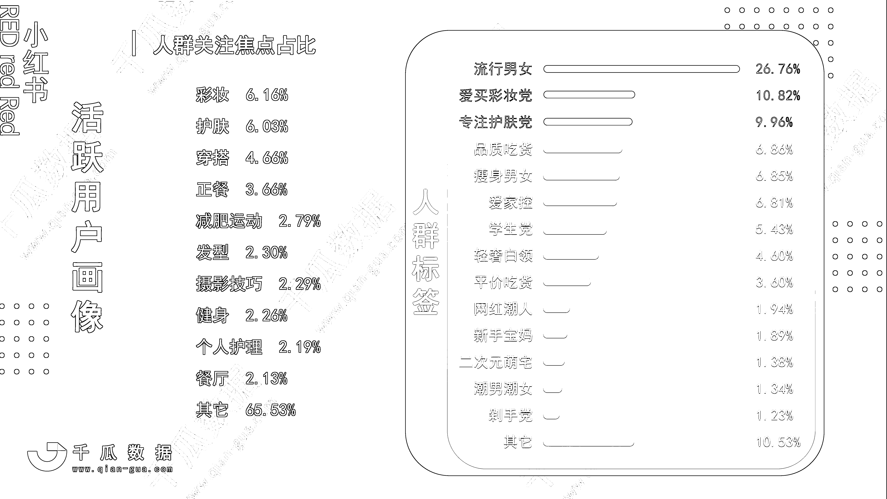

# 1.2 热门类目

从用户需求来看，关注焦点排在前三的依然是彩妆、护肤、穿搭。但追求品质生活的都市精英们，正在衍生越来越多的需求。除了美妆穿搭，不做黄脸婆做辣妈，追求生活仪式感，培养多个兴趣爱好，打造自律又治愈的人生......其实也是他们的日常。

小红书的内容板块也随着用户需求迭代，越来越多元，覆盖到衣食住行玩学习等多个方面。如今，家居家装、母婴、美食、运动健身、知识学习、旅游出行、绘画摄影手工、萌宠.....这些都是新兴热门板块，流量并不少。