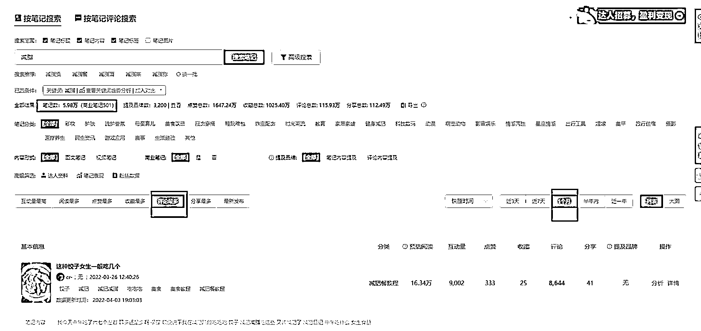

# 小节纲要

和其他平台一样，小红书的各个赛道也有红海、蓝海之分。一些经过验证、离钱比较近的赛道，比如：护肤、穿搭等，是竞争较为激烈的。
而在我们创作小红书账号时，除了加入其中，在一片红海中努力分得一杯羹外，也可以另辟蹊径，通过筛选蓝海赛道来赚取第一桶金。
下面，为大家分享一个找蓝海赛道的方法：

上淘宝买一个 48 块钱一天的千瓜豪华版，根据想要做的领域关键词去搜索笔记，再看近一个月的笔记数量。

如图，这是我搜索减脂，出来的结果，一个月 5.98 万笔记，妥妥的红海。【图有点糊，大家主要看字就行】

这是换了另一个搜索词，近一个月的笔记才 9 条，这海蓝得不能再蓝。

会去搜索框里搜名词的，肯定是精准用户，试想一下：搜出来 9 条笔记，如果有 4-7 条都是我们写的，这转化率是不是很香呢～

以上就是找蓝海的办法，有点笨办法，需要自己一个个去搜关键词。

在小红书做账号，选定某一个领域，是做长期的事情，因此就需要自己在这个领域有前置的积累，才能去做到长期输出，所以大家可以搜索一下自己感兴趣 / 之前有相关经验的领域，去看看是不是蓝海。

内容来源：《粉丝 3000 月营收 20 万，小红书低粉高变现的蓝海攻略分享》

