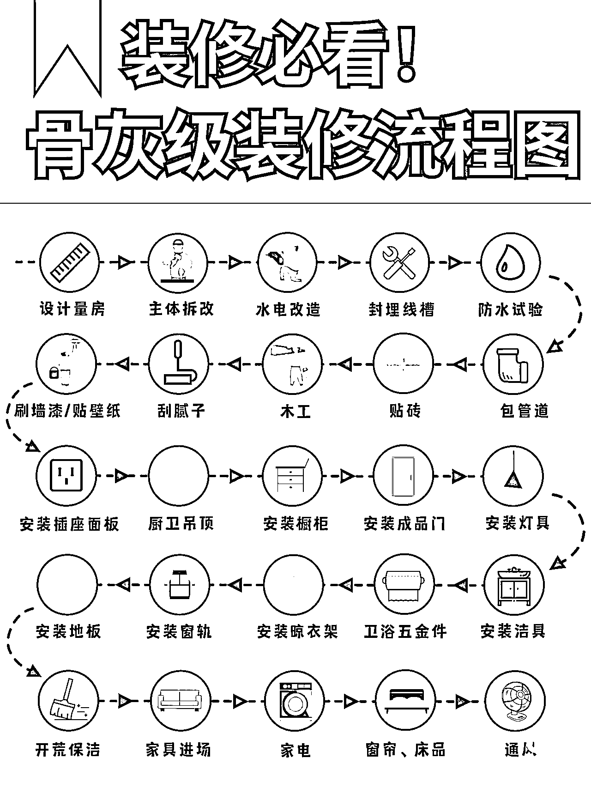

# 3.2.2.5 教程类笔记

•难度：3 颗星

•适用人群：适用于全部类目，带货和知识 IP 均可在教程中软植入产品或服务。

教程类笔记一般指 XX 步完成 XX 事情的流程指南，内容核心是体现出“步骤”，标识清楚多少步、每步分别要做什么。可以纯文字描述；也可图片或视频展示每个步骤+描述，后者的难度在于每个步骤都要拍摄记录。

•首图特点：展示全部教程步骤或部分步骤图

•对标笔记：

[《一周备菜 | 备菜流程和小工具 都在这里‼️》](https://www.xiaohongshu.com/discovery/item/600587da000000000101f09b?xhsshare=WeixinSession&appuid=60059a990000000001006ec4&apptime=1642416734)

[《骨灰级装修流程攻略✨照着装修不踩坑✔️》](https://www.xiaohongshu.com/discovery/item/61792df4000000000102f9b9?xhsshare=WeixinSession&appuid=60059a990000000001006ec4&apptime=1642416666)