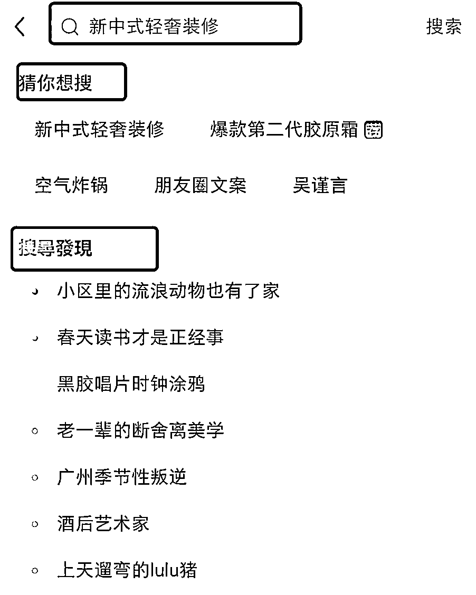

# 3.3.2 从搜索栏的关键词中挖掘

1）搜索栏下拉关键词

比如搜“新中式”，搜索栏会自动下拉很多个关联词，比如新中式别墅、新中式卧室等等。

这些下拉关联词的排序不仅仅是根据笔记数量来排序的哦， 还会根据用户主动搜索频率和系统推荐热度来进行综合排序。

排在前面的词语都是有一定热度的，适合作为选题角度切入和笔记的核心关键词。

2）搜索后展示的默认词、猜你想搜、搜索发现

你搜索过后，重新打开搜索栏会有三个地方出现关键词

•搜索栏：比如之前搜索“新中式装修”，再点一下搜索栏会出现一个默认的关键词“新中式轻奢装修”

•猜你想搜：这里会展示你经常搜索或关注的关键词以及关联词

•搜索发现：最近平台搜索次数最多的热词，有时候可以通过这些词蹭热点

3）搜索结果中的关键词标签和相关搜索

当你搜索某个关键词，搜索结果页面会出现一行关联标签来对搜索结果进行分类。 此外，下拉还会发现一个“相关搜索”，会出现 4-5 个搜索词的关联词。你可以从中选几个前排词语组合来做选题切入点。

注意：不是所有的关键词都有关键词标签和相关搜索，只有一些主关键词才有。

