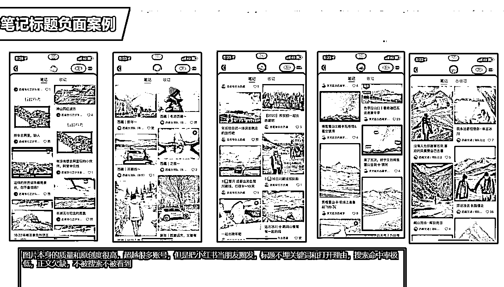

# 3.5.1 常见的爆款标题类型 @许义

小红书账号标题是 20 个字，最好的方法是结合大关键词+小关键词，或者罗列出所在领域中，关键词排名前 10 的爆款标题记录提取，然后组合成新的标题。

这一步很重要，由于小红书的流量主要靠搜索，而搜索结果里要想出现我们的笔记，就需要内容和搜索词关联，标题对搜索词的权重占比很大。

再或者，可以将「推荐、知识、分享、如何、搭配、新手、怎么做、必备、教程、技巧、步骤」等关键词灵活组合使用。

又或者数字型标题：善于用数字，如「 2 个方法、10 大、4 个要点」，比如：来新疆旅游必打卡的 3 个地方，取标题的讨论和公众号、知乎方法差不多。

结合以上方法，以旅游攻略类笔记为例，标题可以取成：

•新疆必玩景点•新疆旅行人均 5K 12 日游的游玩攻略•去了趟新疆回来朋友圈被拉黑了•刚从新疆回来总结的 33 个闭坑建议•来新疆旅游，这 20 件事千万不能做•2022 新疆赏花攻略•毕业旅行/情侣旅行，去新疆玩嗨了 ：8 天 9 晚毕业旅行•在线回答新疆旅游问题•这趟新疆旅行，全靠男朋友熬夜做的攻略笔记（真实笔记本）•来新疆旅游必须知道的 10 件事

这个旅游攻略类的笔记标题可以这么写，其他类型和内容的笔记，把关键词替换一下，也都可以这样取标题。

这里再给出一些负面的案例看一下，都是内容很好，标题没有打开理由，也就是内容的好用户看不到：

内容来源：《小红书 3 天新号粉丝破千的运营方法论》

