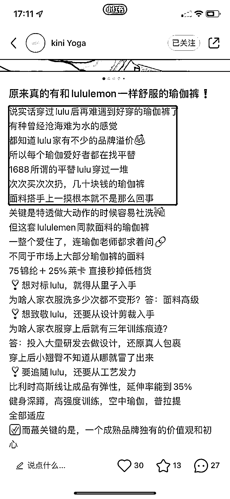

# 3.6.5 其他的一些内容格式参考

1、黄金圈内容法则 @杨星城

黄金圈三点法则：

•why：为什么？是什么？

•what：有什么用？（有什么好处）：

•how：应该如何做？

举个例子：

主题：拖延症
why：为什么你做事总是拖拖拉拉？痛点描述：明明有个很重要的任务要做，但总想最后一刻才去做。感觉自己很颓，很没用
what：拖延症是什么？现象表述：拖延症的表现有 1...2...3....心理学解释：“延迟折扣”：对于未来的奖励，人们更倾向于现在想要获取到的。
how：如何戒掉呢？方法论：1、xxxx2、xxxxx3、xxxx

注意：

•正文的内容分段要用「。」来分段，不能用空格，用空格会被隐藏

•正文多用表情包，让格式看起来有小红书风

•正文字数最好写满，扣除标题和标签，其实也就 800 个字左右

内容来源：《小红书日引流 200+，简单粗暴！从博主玩法迭代矩阵玩法 2.0 版》

2、对标赚钱笔记内容制作笔记 @杉木

企业号的文案是比较灵活的，可以直接写产品，也可以从创始人的身份，写自己的创业心得，从故事引出产品，我建议大家可以多试试后者，文案中除产品介绍外，加上自己的价值观分享，对行业的思考，或者与客户的趣事，客户的真实反馈等。

注意：

企业号是不可以用第一人称“我”的口吻去写产品使用感受的，否则平台会给笔记限流。

下面是我总结的一些图文制作小 tips：

内容这块核心还是对标赚钱笔记写，这也是为啥我在找对标赚钱笔记花了如此多笔墨，因为这真的很重要。

这里分享一个我认为最能调动人情绪的，最容易产生询单的：故事体文案。

爱听故事是人的天性，尤其是在女性用户比例如此高的小红书平台，故事是调动你文案情绪的催化剂，一个好的故事可以既能引发讨论吸引流量，又能对你新人吸引精准流量导向付费。

下面这几个点，是我总结出来的一些高询单内容的秘密，另外整理了几套内容模板供各位参考。

一切都要围绕：让用户感觉到你是为他好，替他考虑，牵着用户的情绪走，再强调一遍：感觉很重要！！

1）说出用户最深的痛或喜

比如这个行业市场价格不透明，比如某知名品牌溢价太多，很多人消费不起，我这是厂家直销，同质量的东西。

再比如我从某厂辞职创业，某厂剥削严重，出来独立创业巴拉巴拉。当然也可以说“喜”也就是大家都认可的观点。

写这些是为了引发强烈共鸣，一般放在开头，你要让用户读完后有：的确如此！那就达到目的了，这样你就和看客统一“战线”了，咱们是一伙的，下面我再说啥都是为了你好，形成了基础信任。

市场调查其实就是为了做这一层铺垫，抓住用户真正的痛点：

比如：

2）顾客证言：客服和顾客的趣事对话

这个故事最好一波三折，用对话式让情景再现，可以从中穿插客户对于产品的好评反馈。

PS：挑选出顾客证言并不难，关键是证言是否击中用户核心需求。

3）写自己的价值观

可以提出一条脍炙人口且表明你产品价值观的 slogan，聊初心。

并在不同内容中反复提及（注意 slogan 别整的跟大牌一样喊口号，像什么 just do it ，来点实际的）

4）写销量。

利⽤⼈们的从众⼼理，明示或暗示产品「畅销」，不但能激发购买欲望，还能赢得读者信任。

有基础销量的直接写卖了多少，没有的就写高回购率，卖的快，注意要量化到具体的数据。

5）语言上：多用小排比，押韵的手法。

小学语文这里就用起来了，我们都知道排比句的作用就是：情绪递进，而且文案会有一种和谐节奏美，情绪递进，读起来更丝滑一些，尤其是在小红书这样的短文案中效果奇好：

举例：

6）用沟通的口吻而不是你自说自话，单向表达

情绪得让读者感受到，才是成功的，别把自己写嗨了别人看完一脸懵逼，哪来的感觉？

虽然不能用第一人称（消费者角度）直接描写产品，但是在写这类内容的时候，还是要以一个具体的人，比如公司客服，创始人的角度去写。

7）真诚，要贯穿你文案内容的每一个字词。

真诚的文案是是能感受出来的，你不需要多么华丽的辞藻，但是一定要走心，不要死套模板。

8）找到合适的机会介绍你的产品，引导下单

企业号是可以直截了当，不拐弯抹角的直接写产品和服务的，但是你要确保你的产品相对于同行，要么价格更低，要么东西更多，要么比市场的之外有其他额外的服务。

如果没有明显的差异化，还是建议从故事角度切入：

再来说下排版，这也很重要。再好的内容阅读体验差，别人都读不下去，效果肯定不好。

排版要干净利索，善用小表情符号，多用短句代替长句，整个文案写完后自己再读一遍。

逻辑要顺，阅读体验流畅。切忌大量文字堆砌，我一般都是一个句子一行，文案字数不宜过长。

展现类笔记可以无文案，或 100 字左右的短文案介绍产品卖点。

故事类笔记文案字数建议控制在 600 字左右。

内容来源：《我是如何通过小红书，两个月带货营收 30 万＋》

4、结构化内容 @梨云

我采用大标题、导语、小标题、内容、底部标题的排版。

大标题：可以是对本页内容的大概括，给读者预判信息，知道这一页讲什么，也可以每一页都统一，目的是埋关键词，提高检索权重，它也是重要的广告位，写品牌名字的地方。

导语：铺垫作用，写下出这篇笔记的原因，承担一部分共鸣作用，同时也可以利用导语进行行为设计，比如我会说“宝子投稿”来暗示大家积极在评论区投稿，用留言数拉动曝光增长。

小标题：是对内容的概括，用四个字压缩一句话，减轻读者阅读负担。

内容：一般不差过 3 行，要做轻内容，提升阅读愉悦感，在行文表达时，我会用上小红书平台女生们都喜欢的爆款流行语、最近火热的梗，让内容显得灵动活泼，大家都爱看。

底部标题：这是一个非常重要的细节，也是我实践中摸索出来的，很多人模仿我，就忽略了这一点。它的作用是以游戏化口吻引导对方翻页，减少读者因为对本页不感兴趣而退出阅读。

形式是借鉴游戏中的指令性表达，句式为：开始+动词、马上+动词。

这个技巧特别好用，给人一种想要不停往下翻的冲动，只要内容没问题，阅读时长有了，赞藏评的概率也会大大提升。

这一顿操作之后，我就开始发笔记，结果第一篇，就是破千的爆款。

内容来源：《小红书三个月涨粉 17w，变现 10w+，我做对什么？》

