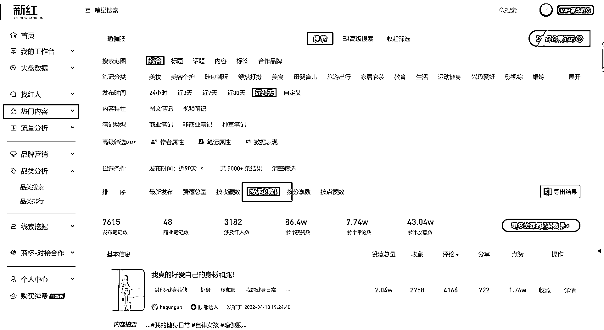
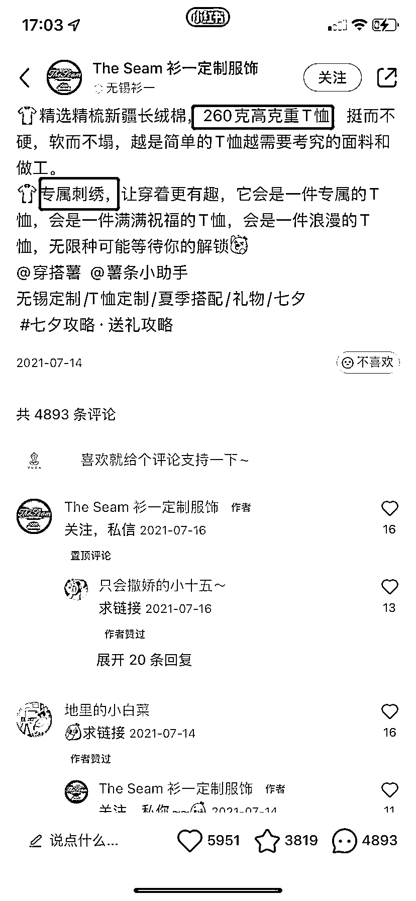

# 4.2.2.2 如何挖掘出这类笔记？

第一个评判标准是：赞评比（赞同数：评论数），一般找比例接近 1：1，甚至于 1：2 的笔记，总之就是评论数越多越好。

而且评论内容能够直接表明购买意向的内容，这种笔记，大家可以先用最笨的方法去找，看你要做领域内容的大量笔记，然后不断挖掘，这个过程值得我们花时间。

而在找这种笔记的过程中，也能够逐渐感知到要做的产品的卖点，从而对内容方向更有把控，还可能会有很多意外发现。

在寻找过程中，除了要把这些笔记搜集下来外，也最好点开主页看下账号的其他内容，一般一个账号不会只有一篇笔记数据好，通常都还会有别的类似内容。

而在寻找过程中，如果发现某个账号中，几乎篇篇笔记的数据都非常好，那么恭喜你发现了宝藏。后续可以把这个账号的全部内容认真搜集下来，这个可以借助工具或者第三方平台来进行操作，如：蝉妈妈，新红。

以新红举例：

在热门内容选项键入所在类目的关键词，然后按评论数排序。

不要按照赞藏数，赞藏只是糖衣炮弹，对于带货笔记来说没有参考意义，而评论数据可以，找那些评论多，且直接问产品链接的笔记。

借助数据工具找到真正的热度词，在文案中植入，增加内容的搜索曝光。

说白了就是蹭热度，主动搜索的用户会高频次地使用小红书的搜索功能，特别是在品牌集中增加营销、投放或是有新产品发布等较大事件时，小红书内关于该品牌的搜索量会明显上升。

“大家在把小红书当搜索引擎用”，这是众多小红书用户的心声。

我们要做的就是借力，比如之前瑜伽服品牌 lululemon 热度很高，甚至于 lululemon 这个关键词的热度，要高于瑜伽服这个品类词，那就可以在文案中多次植入。

找到这类笔记后，可以全部搜集下来，分析他们的文案，除了发现这些笔记展示到的核心需求外，主要体会高询单内容的情绪价值。

一切要以实际笔记的反馈为主，而不是直觉，凡是评论区一堆人在问链接问怎么买的，那一定在内容中涉及到目标客户最关心的点。

凡是评论区七嘴八舌的，就算再高赞，也是瞎热闹罢了，切记：

找到能赚钱的笔记，而非看热闹的终极目标不是出爆款，而是精准客户我做小红书是为了赚钱的，而不是为了高赞内容

也可以把这个当成一个选品标准，比如这个 T 恤这个品类，属于红海市场，竞争很激烈了，但是我们看到这篇笔记有 4000 多个精准询单，完美符合我们要找的高质内容笔记：

通过分析他的文案和产品，可以得到结论：之所以有如此大的询单量，就是因为这个衣服——高克重、专属定制的卖点。

说明市场急切渴望一款这样的 T 恤，所以也可以在找这类笔记的时候，发现一些值得做的产品。

除此之外，也要考虑内容制作成本，矩阵做号的要量化好每篇内容的生产成本，对成本有个清晰的概念，其实我们在找赚钱笔记的时候，也是在对比成本。

专业的布景、玩味的文案、讲究的图片构图，一定对应高成本。

但高成本一定对应高询单么？未必！刚才我举的瑜伽裤就是鲜明案例（我的内容成本是不到 20 块钱一篇）。

我们不论在小红书还是抖音，都能看到很多低成本高产出的经典案例，内容营销的魅力就在于此。

内容来源：《我是如何通过小红书，两个月带货营收 30 万＋》

