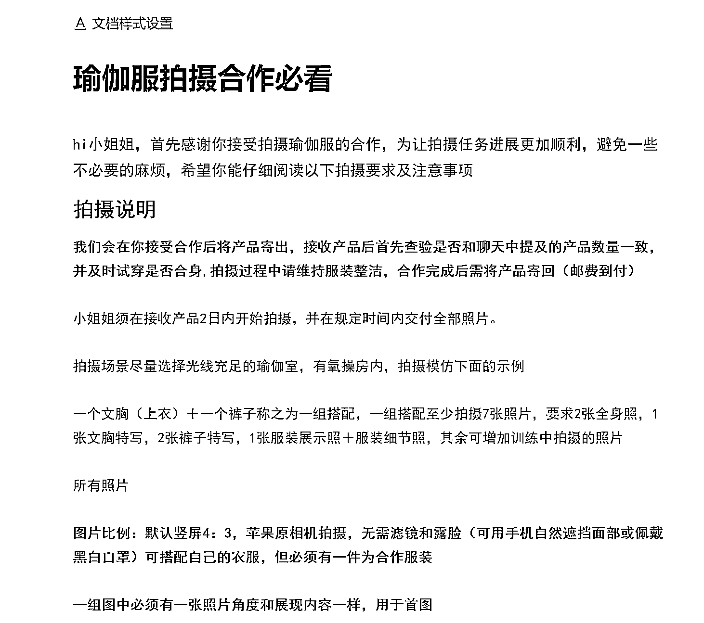

# 4.3.4 对流程进行 SOP 化

如果你想效率更高一些，其中很多环节其实都可以做 SOP 流程化，压低时间成本，拿拍摄和写内容举例。

我一般会在周六日把下一周要发布的素材全部准备好，拍摄如果找模特去拍，最好是在同城找，提前把拍摄注意事项和案例整理好发给模特，免得拍一堆废片浪费时间。

另外完全没必要找专业模特去拍，也没必要后期处理照片，这不是拍淘宝主图详情页。小红书无论是平台还是用户，都更喜欢真实分享，效果反而更好：

内容来源：《我是如何通过小红书，两个月带货营收 30 万＋》

