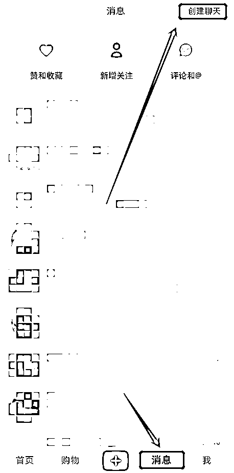
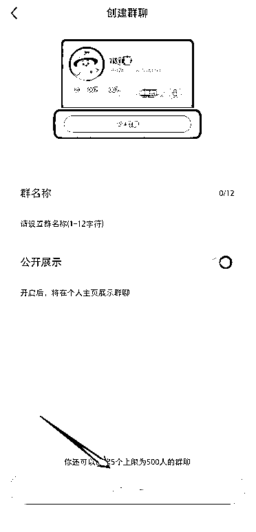
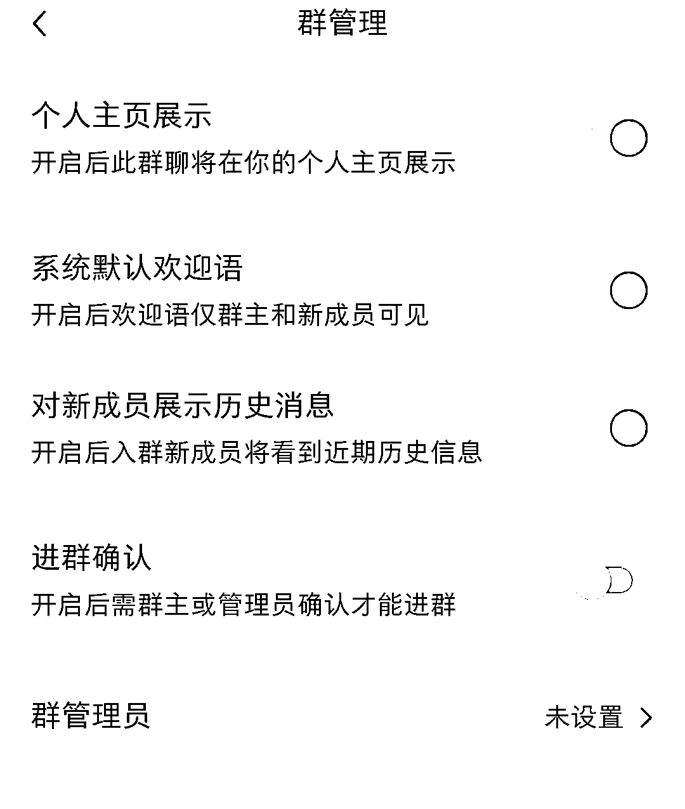
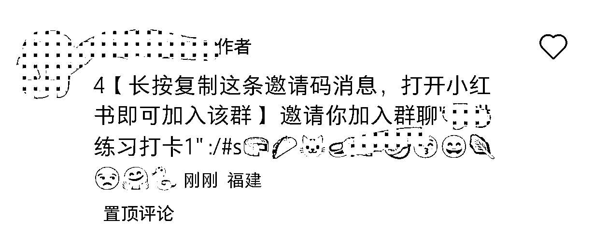
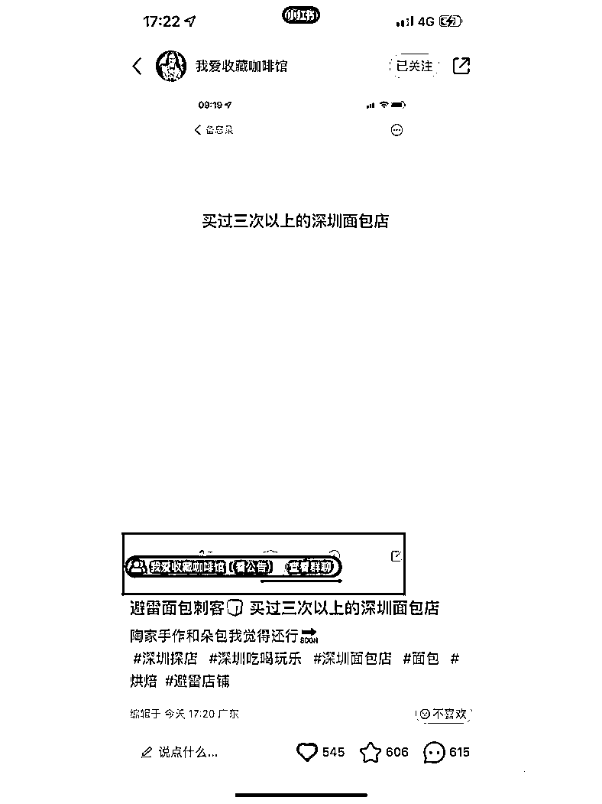
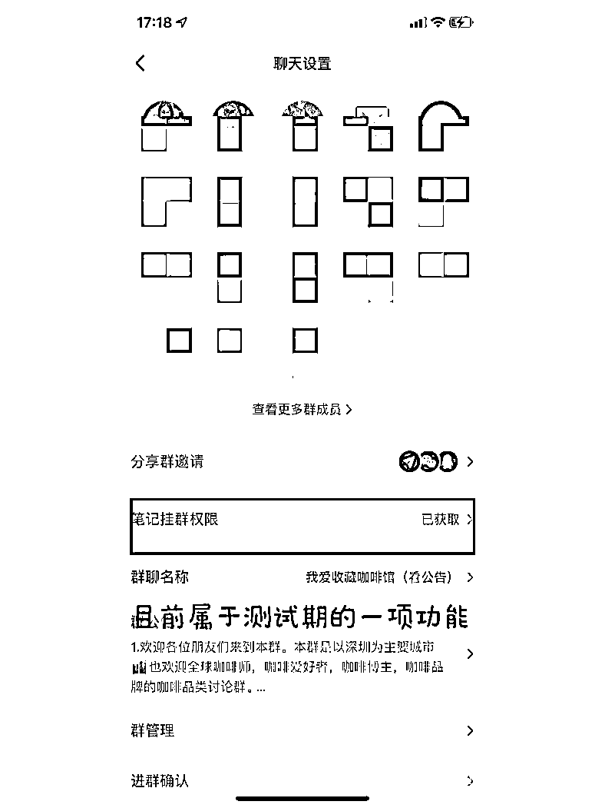
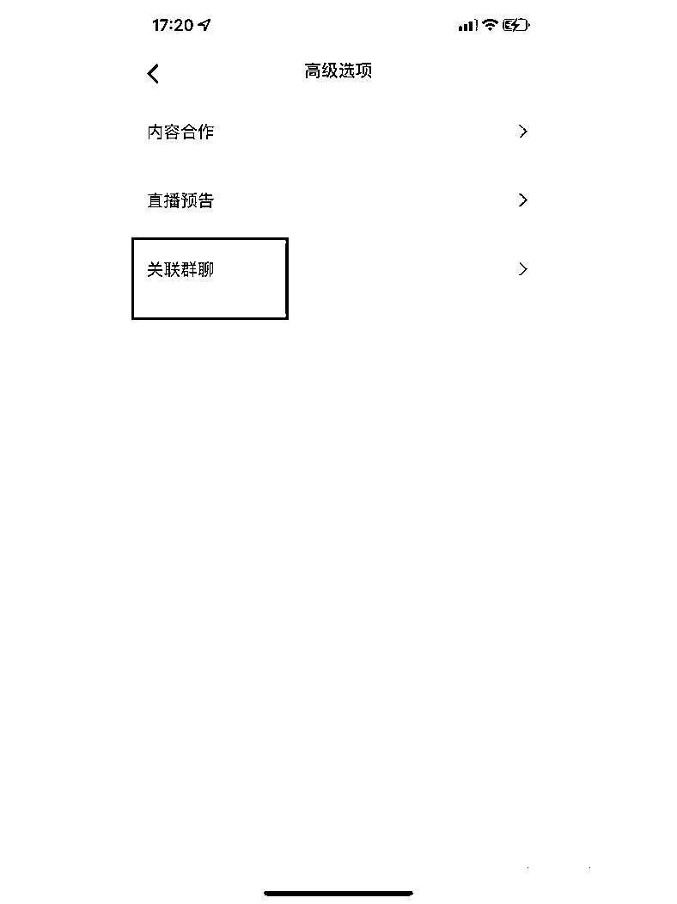

# 5.1.2 玩法二：创建粉丝群引流 @蓝子鱼 @阿丰

目前粉丝群是最安全的方法，一个号可以创建 5 个粉丝群，设置成在主页展示，粉丝点击进入主页就可以看到，如果没有粉丝群的可以让有粉丝群的账号帮忙建，然后把你拉进去，创建人再退出来，你就会自动变成群主。

至于群名，可以是资料群，成长群等有一些诱饵性质的，让用户想加群。加群之后，可操作的地方就太多了，群公告，群内消息，都可以用来做引流。

建群步骤

在群管理中，设置成自动通过，后续用小号在群里发想要打卡和领取资料，+薇：XX，这样就可以引流到微信号。

群设置：

个人主页展示一定要打开，这样才能显示到你的账号主页面上，凡是用户点击头像进入你的主页，都能看到。

对新成员展示历史消息一定要打开，无论什么时候入群的朋友，都能看到以往的广告信息。

系统默认欢迎语，记得关闭，不然每次有粉丝进群，系统都要发送欢迎语，不仅对粉丝造成骚扰，还刷屏遮挡了重要的广告信息。

建好群后，就可以把粉丝群的入群码，发布在评论区里。然后把进群链接置顶（评论区超过 50 个评论就有这功能），这样用户看到后就可能会加入群聊。

需要注意的是，入群码有时效性为 7 天。

另外还有一个引导进群的方式：在笔记中可以插入小红书群。

不过这个功能还处于内测阶段，不是所有账号都有。可以通过数量博概率，就是多注册几个小红书账号，多发优质内容，总有一定可能被内测到。

操作方式如下：

群引流方式一：群公告维护

粉丝进群后，发布一条群公告即可，比如我们这样发布的：

考虑到用户不方便复制，可以在群公告说明情况信息，然后单独发送微信号。

如果有新进群的粉丝留言提问，及时回复即可

每天发布一次群公告就行，太多了容易导致违规，由于之前设置了 新用户进群展示历史信息，所以不用担心他们看不到你的广告信息的。

群引流方式二：群聊消息导流

每天发送一次群公告，提醒群成员添加你的微信号，最安全的玩法还是用助理号来操作，设置群管理员即可。

每天在群里发一遍微信号，单独发出来，方便用户复制粘贴。

重复以上 3 个动作，我的测试结果，添加率能达到 40%，前期稍微辛苦一点，账号起来后，群公告一次设置好，群聊展示到主页后，后期完全可以不用管的，粉丝自动进群，自动看到广告，添加你的微信。

群引流方式三：广告笔记导流

还有一种导流方式，就是推送广告笔记，比如我们这样的：

注意事项

•群聊名称尽量委婉一点

•群公告里发了微信号的话，一次设置好，今后尽量别修改，减少犯错率

•每次拉群，间隔 10 分钟操作一次，否则提示操作频繁

•如果群被投诉，第一时间选择解散本群

内容来源：《新手做小红书打卡，一周涨粉 5.2 万，变现 6000+，引流私域 1500 人，简单可复制》《小红书引流，一天 300 人加微信，实操分享》

