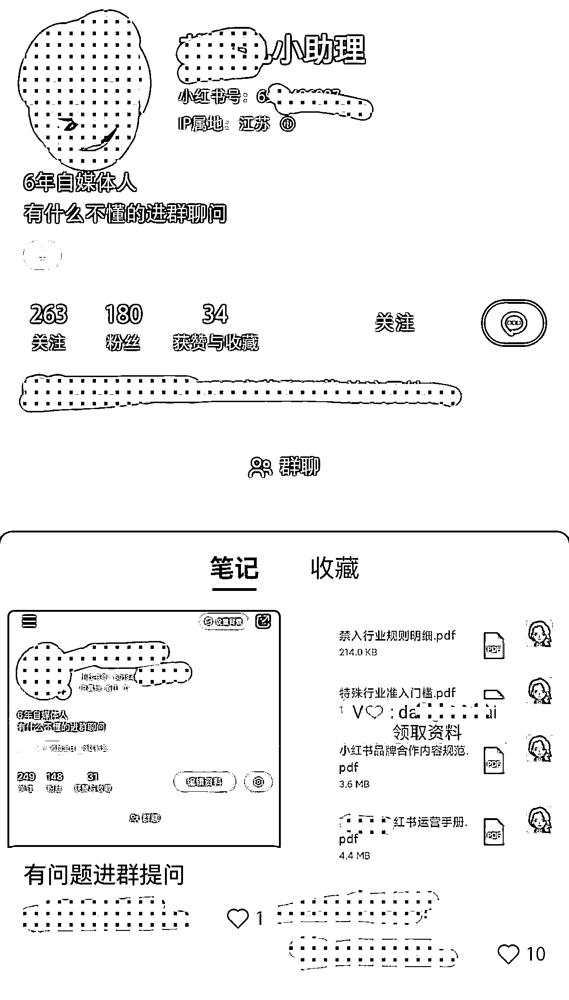
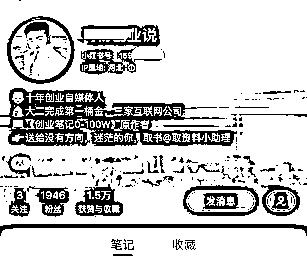

# 5.1.4 方法四：通过小号引流 @蓝子鱼、@杨飞

如果有小号的话，也可以在主页个人简介 @自己的小号，但是这方法新人不建议一上来就直接弄，很容易被清空，建议一千粉丝以后，并且认证成为专业号。

然后在小号主页发一篇文章，把你的微信号展示出来。

小号的名称可以是：小助理、XX 助理号、XX 唯一助理，总是小号和你有关，想要和你产生链接，小号找答案。

分享 2 个具有代表性的，比如这位博主，直接把小号名称取为：这里领取资料。

粉丝一看便心领神会，潜在客户点击之后，跳转进入【这里领取资料】红薯号，完成私域导流只需两步：

先把此号的个性签名改为：资料看下方作品自行领取↓↓↓

再发布一条作品，使用单图形式，封面图上留下微信号

还有这位博主直接把小号名称取为：取资料小助手

个性签名中直截了当表明有 XX 书籍可以赠送，而且还免费，获取的方式 @ 取资料小助理。

这种方法导流效果真好，而且过滤后的粉丝超级精准。需要注意的是，小号不要发多条笔记，发得越多犯错的几率就越大，最好是只发一条带有微信号的笔记即可。

如果你团队是矩阵操作小红书引流，可以多准备几个小号，我们目前的配置是：5 个发笔记的账号对应一个小号。

大小号配合，大号在笔记/评论区中 @ 小号，给小号导流，同时小号也要多互动，可以多给大号评论，或者帮大号回复。

需要注意的是，微信等词汇采用谐音字，小号只发一条广告笔记，一机一卡一号操作。

如果流量比较大，就要尽可能多放几个微信号，不然很容易添加频繁。

还有小号引流贴要注意同行举报，如果举报的话，帖子会被屏蔽掉，要把下面的文字重新修改，再发出去就可以了。

个人微信容易添加频繁，所以也可以在图文第二张图放了公众号名字的图片，提醒如果微信不能加，可以通过公众号加。

在公众号中设置自动回复个微二维码，不过这个二维码也要经常换，不然也可能添加频繁。

内容来源：《新手做小红书打卡，一周涨粉 5.2 万，变现 6000+，引流私域 1500 人，简单可复制》《小红书引流，一天 300 人加微信，实操分享》

