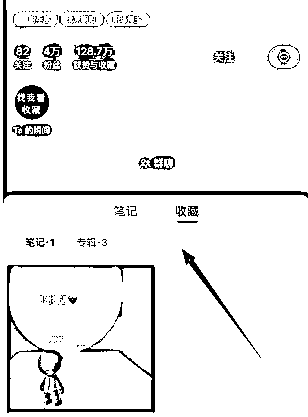

# 5.1.8 玩法八：通过瞬间引导用户查看收藏 @杨飞

这样的导流方式非常安全，隐蔽性极强，用户需要进入你的账号主页才能看到广告信息，虽说有流失，但安全系数挺高的。

直接开门见山，告诉你看收藏：

加粉率不是很高，因为用户并不知道找你有什么好处可拿？也就是说没有足够的诱饵给到他，所以流失比较严重，唯一的好处就是添加到微信的客户都 100% 精准！

采用这样方法引导用户看【收藏】，提高加粉率，减少流失率唯一的办法就是在瞬间页面放出足够多的诱饵，比如下图：

这种玩法也是需要提前收藏一条广告信息，仅此一条，方便用户查看！

再用美图秀秀就能制作，采用打卡的形式先发布（收藏）这张图，审核通过并未提示违规后再发下一张图。

相比这种通过瞬间页面引导用户看收藏，还有一种更加安全的，则需要用户点击进入瞬间内容，才能看到引导信息

这是点击进入瞬间看到的信息：

hi 我是 xxx 呀

想一起交流学习的话

收藏里的传送门找我

可以说做得是真含蓄，隐蔽性太强了，如果用户不点击进入瞬间页面，都无法看到这句话。

我们来看看她的【收藏】栏的广告引导：

用户看到微信号，需要经过 3 个步骤：

•步骤 1：进入你的账号主页

•步骤 2：点击你的瞬间内容

•步骤 3：点击你的收藏

内容来源：《小红书引流，一天 300 人加微信，实操分享》

