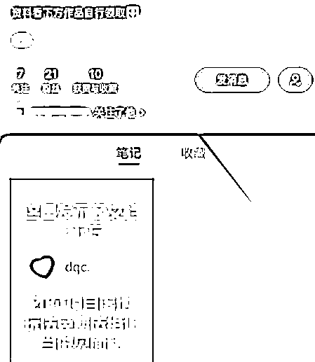
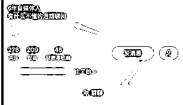
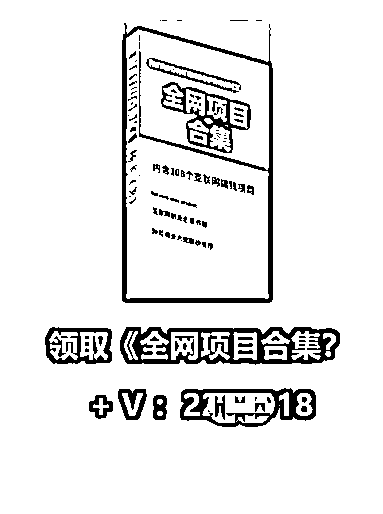

# 5.1.9 玩法九：标记引流法 @杨飞 @蓝子鱼

小红书最多能配 9 张图，建议文章内容不要超过 7 张，第一张是封面，最后一张图中可以写明关注你有什么好处，你做过什么牛的事情，你现在做什么等等。

还有要在这里采用标记的方法，把你自己的账号标记上去，这样点击到主页会更方便，触达主页的机率至少提升一倍，触达主页以后才更有可能会关注你，标记时搜索自己的账号名称进行标记。

如果你想稳扎稳打的来做，可以使用【标记】这个小技巧，先来看看【标记】长什么样，如下图：

用户看到这一页内容的时候，点击【取资料小助理】，即可跳转进入取资料小助理账号界面。

优势：

站内跳转

导流安全

实操后没有一个账号被封禁，说明这种方法还是比较安全的，如果你也想这样操作，记得先搞个小号。

首先完善账号信息

小号的头像，可以和大号使用一样的，统一化能增强信任度。

小号的名称，最好是直接简单点，比如你做装修的，你设计的引流诱饵是：添加就送设计图，那就可以直接把小号的名称取为：获取装修设计图、免费设计装修效果图、XX 设计总监。

如果你是做网创行业，诱饵是赠送各种副业项目，小号的名称取为：领副业项目、无偿领取 XXX。

总之，用户一眼就能分辨出你这个账号是干嘛的。

小号的简介，这里是至关重要的，因为感兴趣的用户通过【标记】点击进来，就能看到，常规的设置有 3 种。

①引导用户看下方笔记

②引导用户进入群聊

③引导用户看瞬间，利用瞬间打卡的形式配合导流

我们目前采取的方式是，引导用户看笔记内容，如图：

这个号发一条置顶笔记，尽量只发一张图，而且在图片上留下微信号。

如果你赠送给粉丝的诱饵能够具体化是最好的，比如赠送的手册，简单设计后就成这样的了：

这个得根据你的引流诱饵来进行设计，虚拟产品是成本最低的，10G 资料包、一个软件安装包、一张代金券，都是足够具有吸引力的。

账号信息完善好，并根据引导的提示做好内容展示，今后在发布作品的时候，合理利用【标记】功能即可。

如果你的每一篇笔记都要使用【标记】功能，建议设计一张图出来，每次发笔记都能使用，挺方便的。

这是我们团队目前使用的一个固定模板：

点击【标记】，点击对应的小号，拖动到箭头所指方向即可。

内容来源：《新手做小红书打卡，一周涨粉 5.2 万，变现 6000+，引流私域 1500 人，简单可复制》《小红书引流，一天 300 人加微信，实操分享》

