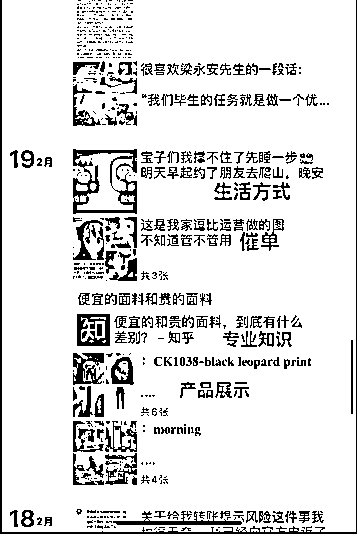

# 6.1 玩法一：朋友圈 @劲猫 @杉木

朋友圈打造是私域产品销售很重要的一环。用户通过小红书加上微信后，最先去看的就是朋友圈，所以，朋友圈展示出来的内容是十分关键的。

通常来说，一天可能需要发 5 条左右的朋友圈，发布规律可以是：小红书干货 1 条，日常生活 2 条，案例反馈 2 条。

这样的规划不仅能让别人知道自己能够提供的服务，也能让别人看到我的价值。从小红书进入微信的人看到这些内容后，信任感的建立就会比较容易：

不要像微商一样单纯进行产品堆砌，朋友圈包含一些个人的日常，可以让你的朋友圈更有血肉和温度。

同时，还要有用户思维，要懂你的用户爱听什么、爱看什么

比如：如果你的客户是年轻人居多，一些有意思的表情包、网络梗之类的就可以迅速拉近距离。

内容来源：《自媒体新手做小红书 3 个月，从 0 涨粉 8000 粉，变现 5 万》 《我是如何通过小红书，两个月带货营收 30 万＋》

