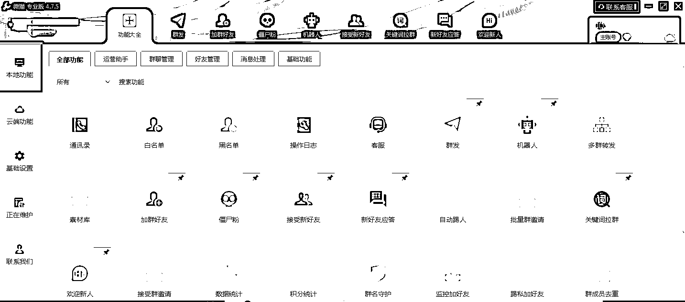
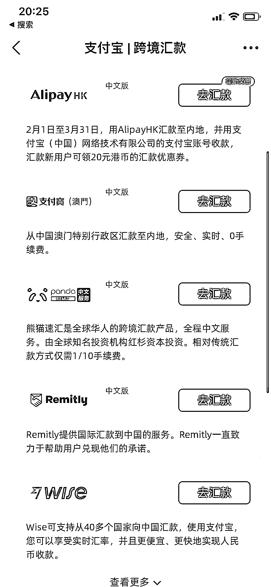

# 6.2 玩法二：视频号 @杨星城

视频号作为一个新兴的短视频平台，目前热度非常高，我们也可以抓住这一风口，在小红书引流后，通过视频号社群及视频号直播进行变现。圈友 @杨星城 在这一方面有着不错的经验，大家可以参考一下他方式：

流量来了，就要靠后端怎么去接住。这里为大家分享一种方式是：通过视频号社群+视频号直播来变现，私域+公开课形式来成交。

这里有个核心的公式是：你做的任何一个运营动作，都是为了下一个运营动作准备。

1）发资料，先进群

先感受一下，实际的交流方式：

微信私信：同学你好呀，加的人有点多，为了有更好的 xxxx 服务，了解一下：1、你是看哪篇笔记来的（可以的话截图，发对应资料，每个人要的资料不一样）2、你多大啦？3、你的职业是？4、你有什么记忆难题，想我们怎么帮到你？
后期会根据年龄和 xxx 难题建一个群，方便大家更好的对学习交流。
——————————
好的呀，关于 xxx 资料我们放在学习群里啦，回复“1”我拉你进群后看群公告哈～
后期我们会有 xxxx 教练和大家直播讲解如何提 xxxx 哦！一节课就让你的 xxxxx 提高 5 到 10 倍～
群里都是一群热爱学习的小伙伴，进群可以和大家打打招呼哦～
如果 xxxxxx，就回“1”我拉你进 xxxxxx 群，资料都在群里，咱们群里见哈～
————————
同学，你可以点击链接进群领取哈，资料放在群公告那里哦
链接：xxxxxxxxxx（群邀请）

这是大多数用户加过来的实际聊天记录。

因为加的人太多了，没办法做一对一沟通，而且大多数人都是为了拿资料过来的，交流太多最后不买单的就很耗时间成本。

但是，我们也不能让用户拿了资料就跑了，所以要设置一个“场景”来触达用户。因为既然用户愿意来加微信拿资料，代表还是有潜在的需求意向的。

如果人数多的情况下，后续的直播就可以采取 1～2 天开一次的频率，如果人数少的情况下，就可以采取 3～4 天开一场直播的频率。

2）关于工具

对于在微信回复消息这种重复的工作，我们最好直接交给工具。

可以去淘宝搜“微猫”，168 月/终身，一个微信的群控软件，模拟真人操作，固定好话术模板，这方面直接省去一个客服助理的工资。

再者，如果平时睡觉比较早，但用户中夜猫子又比较多，很多时候凌晨都有人加微信，怎么办呢？

这种情况下，可以用腾讯云的服务器系统，把微猫软件登录在服务器系统上，这样就算电脑关机了微信一样在接待。

这个原理是，在云盘上有一台电脑，而这个云盘服务器不会关机，一直在线。选择最便宜的服务器就可以了，就只是用来登录微猫设置下就可以了。

3）群预热

还是前面说的：你做的任何一个运营动作，都是为了下一个运营动作准备。

预热是为了用户来收看直播，直播则是我们的交易场景。一定要有交易场景，也就是触达用户解决他们实际的需求。

把产品介绍和领取的资料用飞书文档整理好，然后放到【群公告】置顶，这样每次新人进来为了拿资料，都要打开飞书文档。

而飞书文档里给用户的资料是放到最后面的，所以前面一大堆都是产品介绍和一些更干货的知识内容。

用户要拿资料，就必须经过“产品介绍+干货”的内容讲解，这方面会下意识让用户知道：

我们是做什么的？我们能帮你解决什么问题？我们能达到什么效果？

当然，只有这步还不够，因为用户并不会很仔细地阅读飞书内容，所以需要再次引导。可以用红包来炸群提醒，把飞书的资料内容再依次发到群里。

4）提高到场率的小技巧

【福利诱惑】：

•通知 8 点开课，现场会直接赠送一波福利

•中间老师也随机赠送 xxx 礼物

•听到最后，会赠送价值 xxx 元的 xxxx 礼物

【再次确认】：

•入群的人用微猫打标签，提醒晚上 8 点来听直播课

•临近 8 点开播，用微信自带群发助手提醒，再次通知已经开播，请进入视频号学习

【现场提醒】：

•晚上 8 点开播，主讲老师在 7 点 57 分赠送一波福利，领取福利的方式是截图直播间发到群里。然后群里就炸了，潜水的人看到群里这么热闹，也会进群看看。

•直播间老师会讲三个方法，每次讲方法之前把话术发到群里“老师正在讲 xxx 内容，这个内容适用于 xxx”，在群里做提醒，并且发朋友圈，对这个方法感兴趣的同学又会重新进直播间。

总之，这个步骤的主要目的是提高到场率，只要用户能到场，我们后面的成交率都还算不错。

5）直播售卖

如果之前没讲过直播课，可以去看之前大航海教直播的视频资料，讲的很全面。

一开始直播磕磕碰碰很正常，关键还是要真诚+直播展示的方法有用，用户觉得有帮助就会购买你的产品。

直播可以采用 1 小时干货+半小时卖货 的形式，和抖音的自然推流可能不一样，因为我这边做的是私域流量来成交，更像是以前线下会销的模式。

和大家分享一句话：

前期所有的工作准备都是为了最后成交的 10 分钟，但用户最后决定是否埋单，不是因为你成交卖产品的那 10 分钟，而是你前期的所有准备。

所以，你可以多直播多露脸，多展示你的产品，只要有用户在，就有成交的机会。至于成交的话术有多动人动听，那都不是最重要的了，最重要还是把前期的工作做好先。

6）付款方式推荐

•开通小商店，视频号直接付款

•用户如果要使用支付宝，可以私聊发他们

特别注意：小红书海外用户特别多，微信和支付宝都付款不了，遇到这种情况，可以通过以下方式解决：

打开“支付宝”——“转账”——“跨境汇款”——“汇入中国”——“我是收款人”——“分享给汇款人”——把图片发给学员，就可以了。

基本海外的主要支付账户都有，通过这个支付宝中转站可以直接到账人民币。

7）后续跟单

直播后回访：

把 “听完感觉怎么样？”改成 “听完后有哪些不懂的吗？”，会让用户更加舒服。

另外，直播间如果有布置课后作业，也可以拿些小号引导发作业出来，因为有些同学不想第一个发言，需要有人带头引导。

作业可以多写一些好评之类的话语，对一些犹豫不决的用户起到很关键的影响。

有个有趣的现象是，只要带头发的是「好评为主」的感想作业，后面的真实用户也会陆陆续续跟着发好评，感谢课程感谢老师之类的内容。

后面多种草朋友圈，多发学员效果和后续的作业情况，慢慢养熟跟进。

有很多用户第一次听直播不买单的，后面经过一段时间朋友圈的转换，再次来直播间再购买的。

8）低转高训练营

直播间卖正式课 1280～2480 元的课程卖不动的时候，以及后续跟单也比较吃力的情况下，我们做了两轮低价课程，5 天 99 元训练营，把之前没成交的，有意向的，都统统拉进训练营里。

训练营的氛围打卡都要设计好，让用户感觉到 99 元有 999 元的超值服务，目前测试了 2 轮，低转高的成交率在 15%～20%，不算太理想，但有这波动作就能转换之前没付费的用户。

用户数量多了情况下，训练营的成绩也可以经常晒单发朋友圈，包括作为小红书公域流量笔记的内容，也是一种素材提供的方式。

总体来说，后端变现的主要方式就是通过私域的社群+视频号直播+朋友圈转换的方式来促单。

有直播间这样的一个场景，会让用户更有信任感，以及直播间是讲干货技能，可以很好的解答大家的问题。

在后端所做的所有动作都是为了漏斗的转换率会更高，直指最终的到场率，也就是后续的成交转换率和金额。

内容来源：《小红书日引流 200+，简单粗暴！从博主玩法迭代矩阵玩法 2.0 版》

