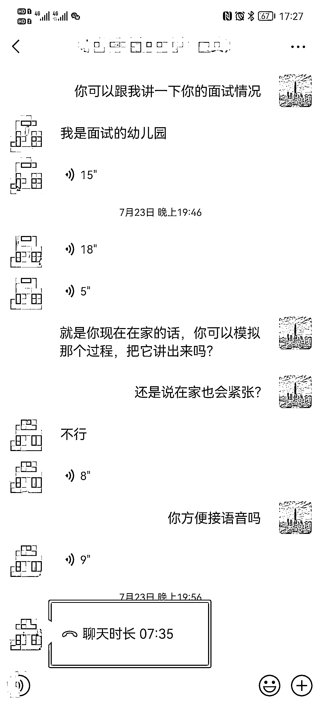
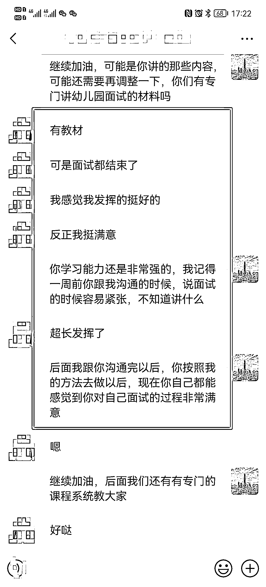

# 7.2 技巧二：积累用户案例 @蓝子鱼

一些成功的服务案例、用户好评等，对于消除新客户的鼓励有着非常大的帮助。

在平时与顾客沟通的过程中，可以有意识地将某些聊天内容截图保存下来，尤其是能反映你的耐心帮助，或是用过产品或课程后产生了良好效果的内容，这些都是非常好的用户案例，可以分发在朋友圈或其他平台上：

除了日常聊天外，也可以和用户约定一下，在使用产品或学习完课程后写一个总结或反馈，这样也可以积累案例，用来后面做宣传。

内容来源：《新手做小红书打卡，一周涨粉 5.2 万，变现 6000+，引流私域 1500 人，简单可复制》

