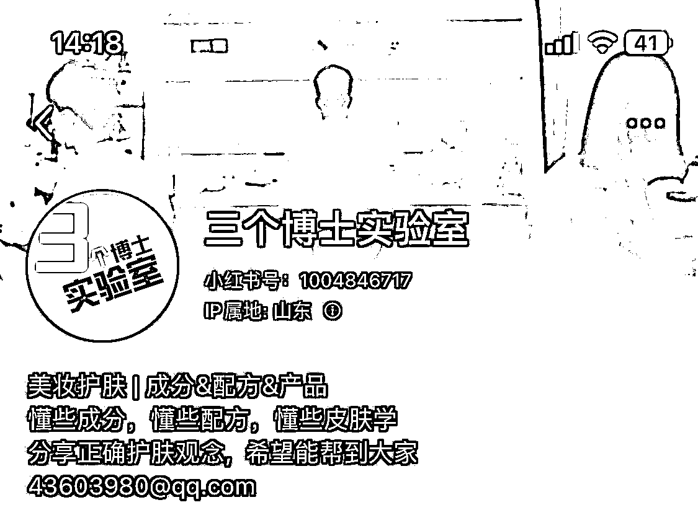
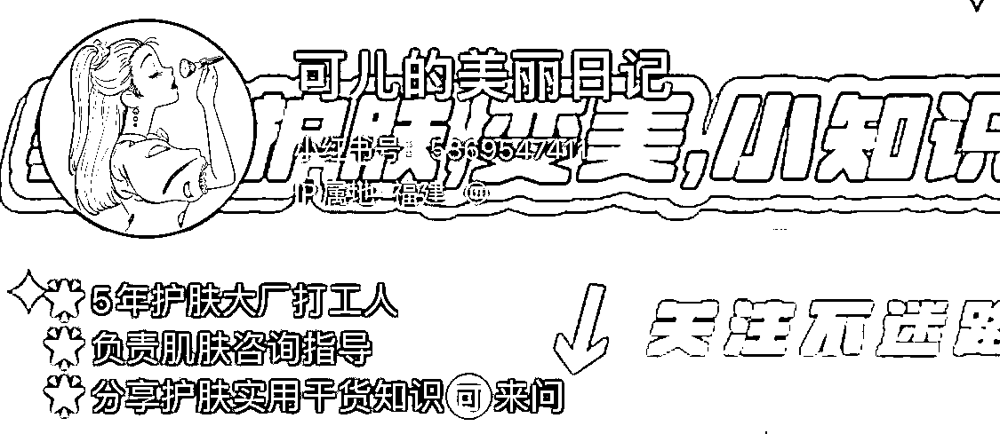
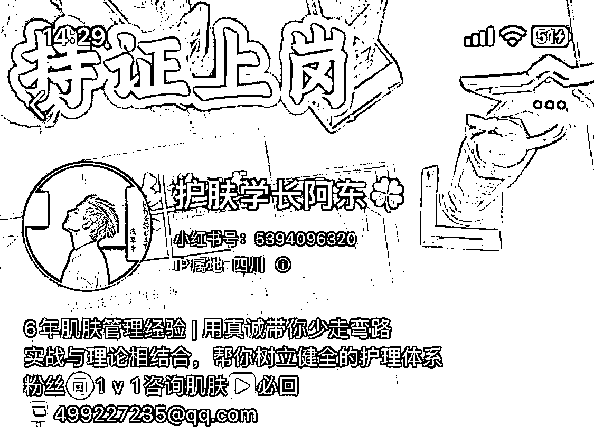
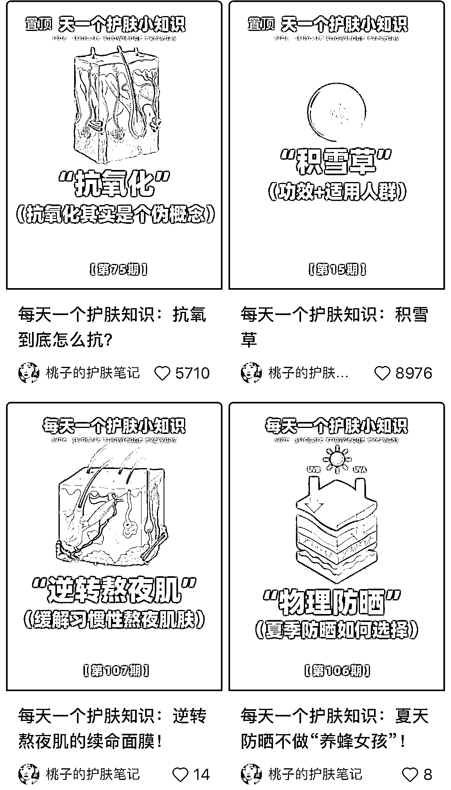

# 3）资料型内容

•硬性要求：归纳整理能力，做图的能力，优化关键词的能力（主打搜索型流量）•软性要求：持续学习能力•优点：持续输出不难，很容易导流到私域•缺点：出圈比较难•变现方式：引导私域变现+接广告

下面是实操方法——

•名称：

常规取名套路：带有领域关键词（从搜索流量机制来说，更容易搜索位前置）

例如：xx 护肤笔记，xx 成分说，护肤实验室 xx，xx 护肤方案，xx 护肤课代表

•简介：

模版：资料主要方向+关注你的理由+联系方式或私信引导

•头像：

可以是认真学习的样子/可以是书本/可以是展现资料的图

•背景图：

体现专业，合集类，引导关注的内容。

案例参考：

•笔记类型：

封面：主题+图示+关键词

笔记标题：护肤知识+关键词（搜索流量）+主题

笔记内容：成分科普 / 解决某个问题 / 网红言论 / 合集

头图封面参考：

