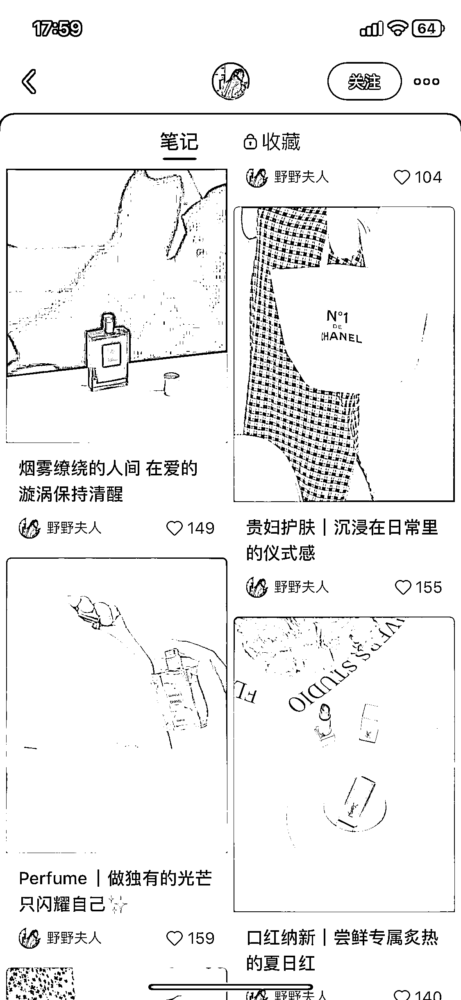
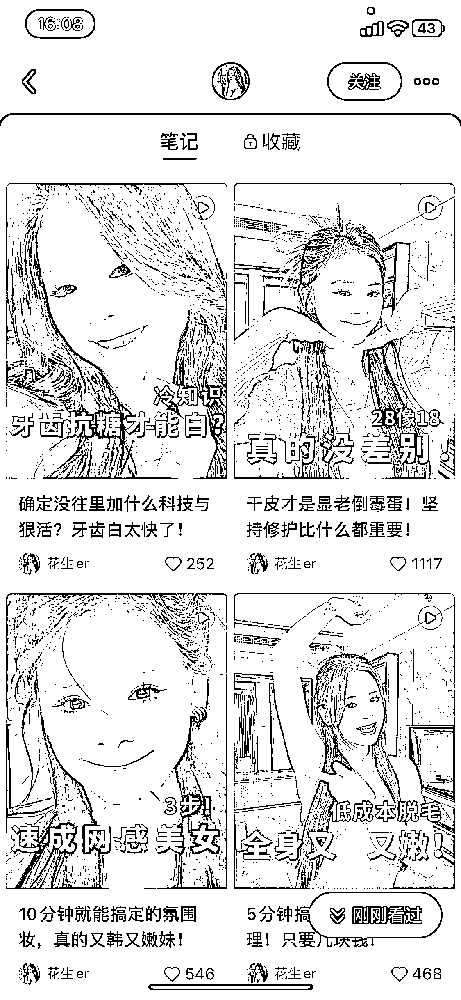
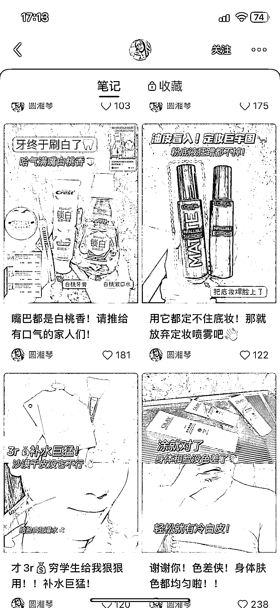
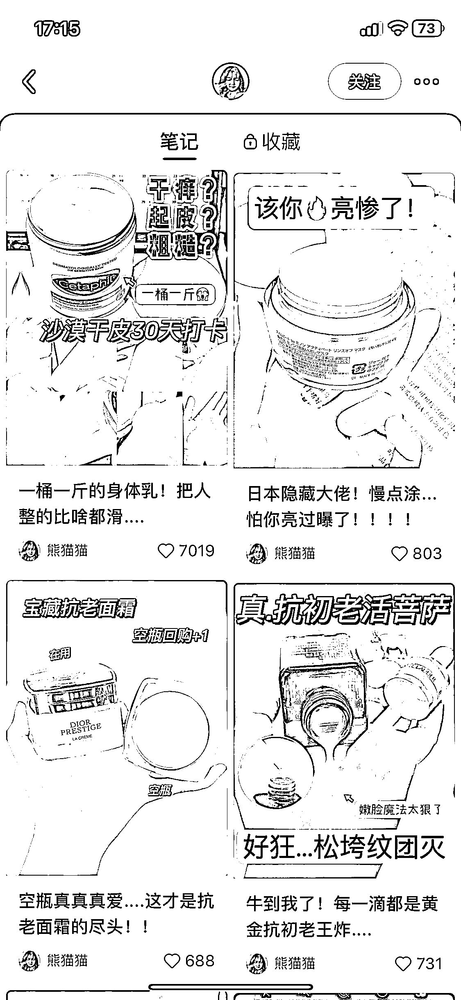
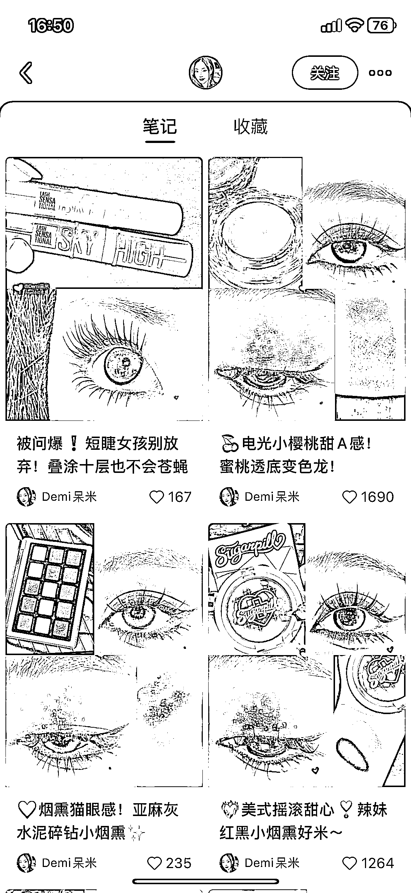
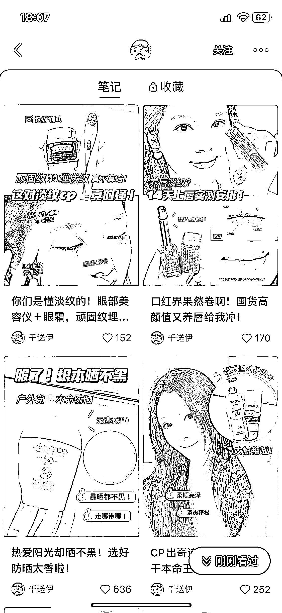
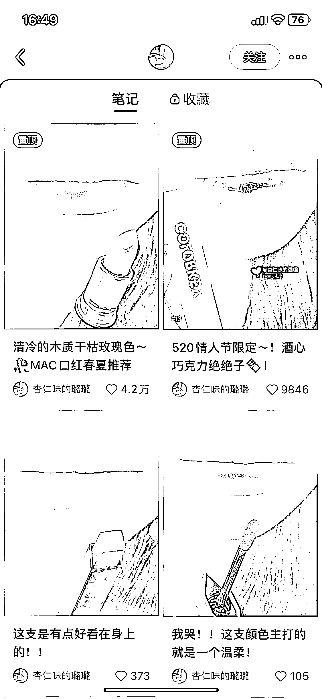
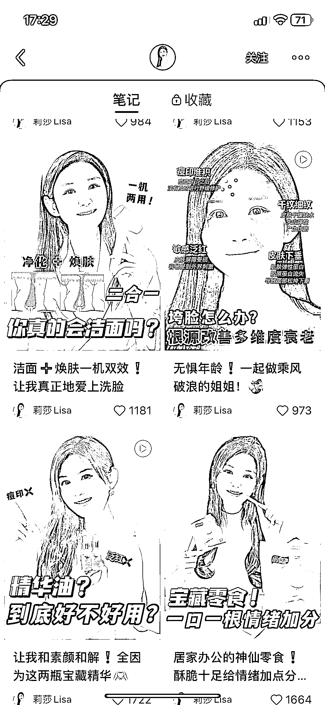
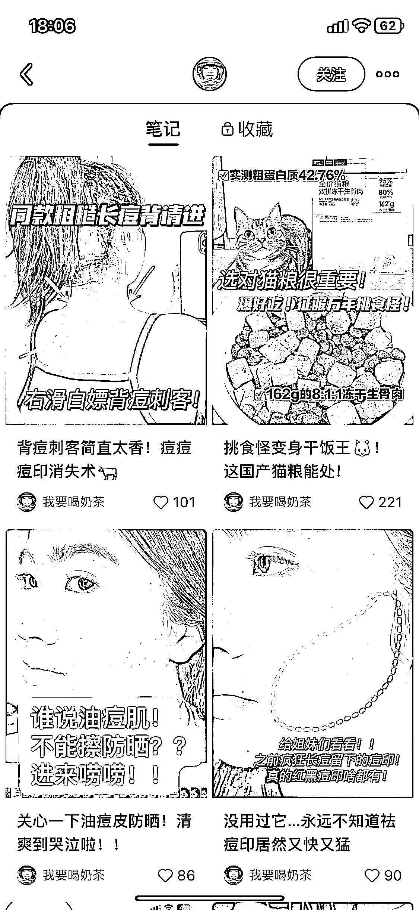

# 4）好物推荐型内容

•硬性要求：热爱买买买，喜欢分享，会拍照•软性要求：愿意出镜更佳•优点：制作笔记不难，完成起来比较容易，接广告很容易（也很容易置换产品）•缺点：出圈非常难！！赛道很卷！！！•变现方式：接广告（报备+非报备）

下面是实操方法——

•名称：

个性化昵称（越有记忆点越好）

•简介：

自己的个人情况（干敏肌/混油/手残党/学生）+准备分享什么好物+联系方式

•头像：

真人头像为佳

案例参考：

•封面图：产品图+场景

笔记标题：关键词（搜索流量）+主题

头图封面参考：

•封面图：效果（成品）展示/步骤图

笔记标题：关键词（搜索流量）+主题

头图封面参考：

•封面图：产品图+文案关键词+特点+（加产品效果）

笔记标题：关键词（搜索流量）+主题

头图封面参考：

•封面图：产品+局部效果展示

笔记标题：关键词（搜索流量）+主题

头图封面参考：

•封面图：真人出镜+手持产品+花字标题

笔记标题：关键词（搜索流量）+主题

头图封面参考：

•封面图：引发恐慌的局部问题

笔记标题：关键词（搜索流量）+主题

头图封面参考：

