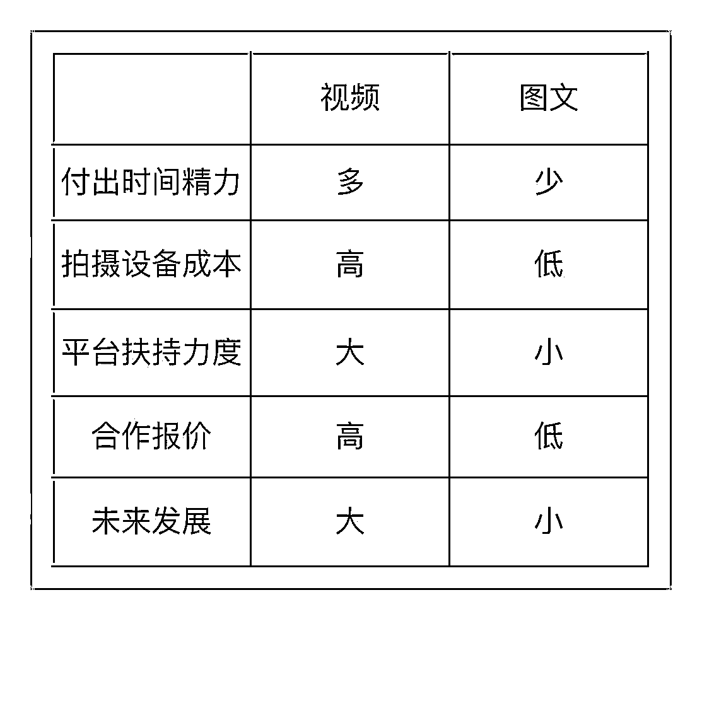

# 8.1.2.1 赛道简介

美妆赛道，确切的说这里分享的是护肤赛道，美妆赛道范围比较大，护肤属于它的一个分支。

护肤赛道主要指分享护肤及护肤品相关的内容，有图文形式和视频形式可以选择。

图文形式制作简单，但报价总体来说也低于视频形式，如果不抵触可以优先选择视频形式。图文与视频的具体区别参考下图：

为什么护肤赛道是热门的？

一方面，最近几年随着国货护肤品的崛起，各商家为了增加品牌曝光，会有很大的宣传需求，需要有 kol 来为自己的品牌或产品背书/宣传，以增加大众的曝光度与认可度。

在现代社会，酒香也怕巷子深，所以广告宣传非常重要，而新品牌与护肤品的更新又是层出不穷，所以在小红书平台很是热门，属于是钱多的赛道。

另一方面，现在我们社会经济发展比较好，大家会更注重外在美与皮肤的养护，对护肤的需求在不断增加，但很多人并不懂到底如何护肤以及如何选护肤品，所以对护肤博主就应运而生。