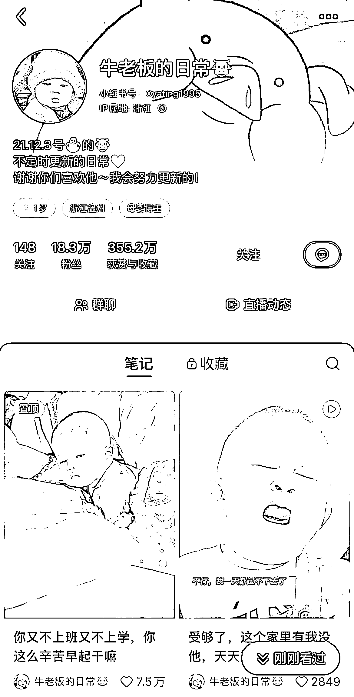
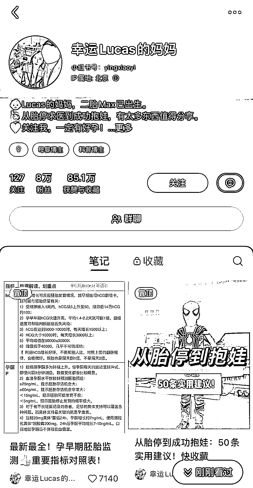
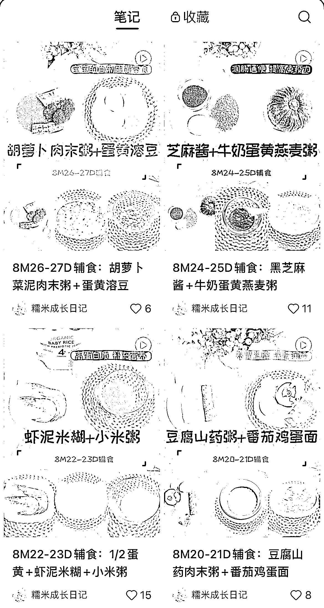

# 8.2.3 账号实操

1）账号装修

账号定位：母婴赛道用真人 IP 更容易引起共鸣

昵称：大家都是宝宝名字+妈妈，比如 XX 妈妈，或者直接用宝宝名字

头像：真人头像或者和宝宝的合照

2）内容创作

① 选题

宝妈们可以按照自己的经验，先拟一个能够输出的列表，然后根据手册中的搜爆款的方式，找对标账号+爆款笔记，根据自己的内容储备套爆款制作笔记。

② 封面

小红书封面简直不能再重要！新手起号可以多试一些爆款，1 比 1 模仿爆款封面，包括字体，配色构图等等。后期要形成 IP，还是要用属于自己的能让人一眼识别出来的封面。

③ 内容

内容图片相比封面不是特别重要，但是有统一的自己的模板能够省很多时间，直接套用就好。像黄油相机就能储存自己的模板，这样出图很快，可以节省宝妈们的时间。

内容文案更不怎么重要了。大家按手册处理即可。