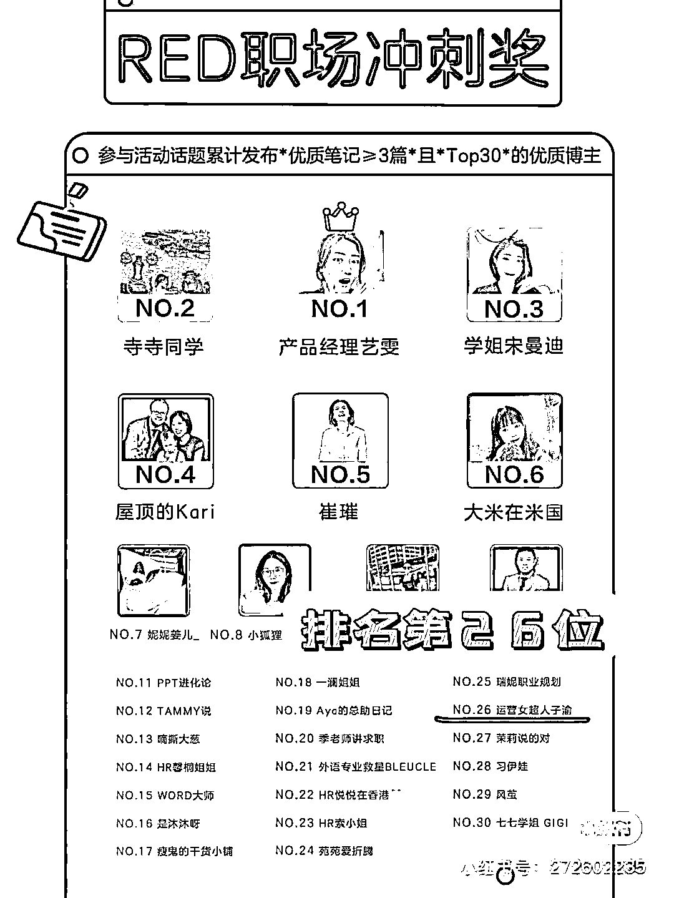
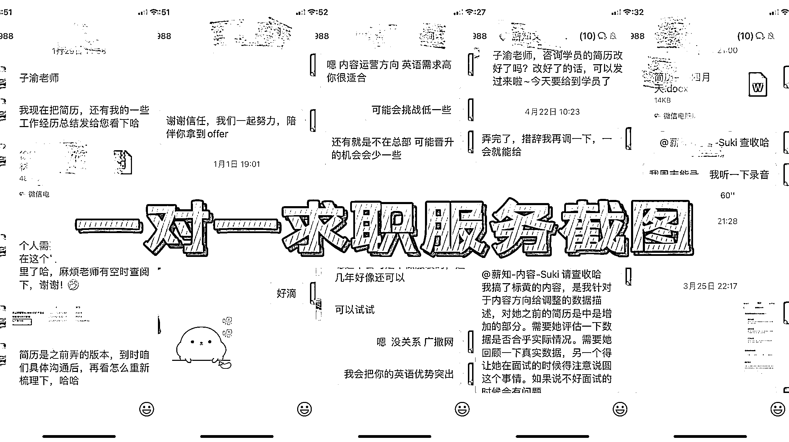
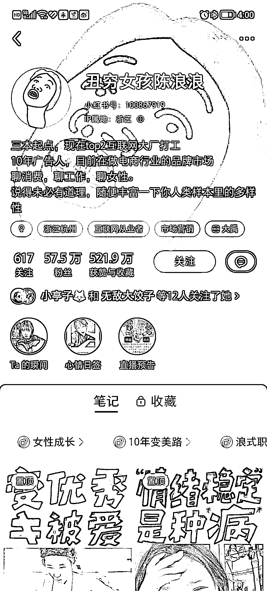

# 8.3.1.1 赛道介绍

在职场赛带中很多人都会选择做成长号，因为这个赛道，对颜值、技能和资源要求都不高；笔记还动不动就是笔记千赞万赞，制作起来相对不难，很好上手。

但问题就在于，这些笔记它没啥差异化啊，人设优势也不是那么明显，而且！没钱途没钱途没钱途。

先别急着喷，我不是指全部成长号，毕竟做得好的大有人在。我这里指的是整个账号只发一些鸡汤式内容的成长号，比如下面这种就很典型：

接广告呢，接不到啥大单子，因为产品可植入的空间偏低、接到的广告单价也不高。比如一些 app 推广，万粉不到的话只有百来块推广费，就没啥意思了（当然不是每个博主都这样）。

带货呢？光发这些自律鸡汤，很难带货。除非你经常发真实场景的内容，涉及到学习或工作场景的物品，都是可以接到广告和带货的。

付费咨询，如果有自己的专业优势或可提供的价值点，或许还能吸引到低价咨询。

如果你是这种类型，建议你现在就开始优化方向，也就是优化变现模式。不然肯定会为变现差而犯愁。

做职场博主，我调研下来主要有两个大方向比较有“钱途”：

要么就是走生活方式+个人成长方向，多真人出镜或场景出镜，多发一些能植入带货产品的笔记，能接到较多高单价广告，比如我有看到专门做桌面好物分享+学习成长的；

要么就是聚焦于提供某种价值，比如求职咨询、转行咨询、技能服务、写作成长等等，变现转化比较容易，比如我选的运营求职转型。

我之前对标的职场博主，她就是靠做求职转行面试咨询服务为变现的。而我也有很多线上线下分享的经验，因此我选择了职场求职咨询、运营能力提升方向来经营。

在我看来小红书里的职场博主还是比较好入手的赛道。

首先小红书的 2 亿用户群中，有 72%是 90 后，绝大部分已经进入了职场的范畴，除了吃吃喝喝，旅游购物，也会考虑求职实习、职业发展等。因此需求非常巨大。

另外小红书除了视频以外，短图文、长图文等形式都对于分享实用技能，职场法则，沟通技巧等内容都非常友好。你不必一定非要有一个很好的背景、灯光等才能做一个账号。

最重要的是职场博主的变现对于粉丝数量没有那么高的要求。相较于美妆、穿搭赛带粉丝基数较小的博主很难接到广告，但对于职场博主而言在最主要的收入来源于咨询收入。只要能持续输出观点和职场干货，并获得粉丝的认可后，通常也会通过付费咨询的方式进行变现，咨询内容包括但不限于修改简历、应试策略培训、制定职场发展策略等职场内容。

我经过学习和自己摸索，也终于在今年初突破了 1W 粉丝的大关。在做账号期间我接到了几十个企业推广，1 个出版社合作和 1 次媒体采访邀约，每个月都有几单到十几单收费咨询指导多名同学入门运营。还研发了自己的职场课程，准备全面推广。

这个赛道对博主背景的包容度很高，一般都是有职业背景的博主进行分享。但是大家也不要以为只有是专家才可以分享。只要能针对某一个领域有见解，有方法的都可以进行分享。

例如我就关注了，由本职工作是 HR 的，来分享如何求职和修改简历，就显得权威感很足：

但同时也有分享专业成长经验的，例如：市场营销是干什么的，如何进入市场营销这一行。对于你选择行业，岗位，提前知道真实的工作内容都有很好的借鉴意义。

再也有不那么卷的分享，仅仅是分享在职场的工作体验，如何面对打工的日常的博主。让还没有进入职场的弟弟妹妹们能更早的体会真实的职场日常，做好从学生到职场人的角色切换。都是可以做的方向。

因此可以看到职场博主是一个用职场作为主要环境，但实际上可以分享于此相关的任何内容，只要你分享的内容对其他人是有用，有帮助即可。

相对于美妆和穿搭博主，如果没有自己产品的情况下，初期需要自购商品拍摄。职场博主主要是内容输出，因此耗费金钱成本几乎为 0。但是确实会花费较高的时间成本。因为基本上每天都需要输入信息，进行信息的编辑和整理，再进行输出。我一般每天都会花费 1 个小时左右。