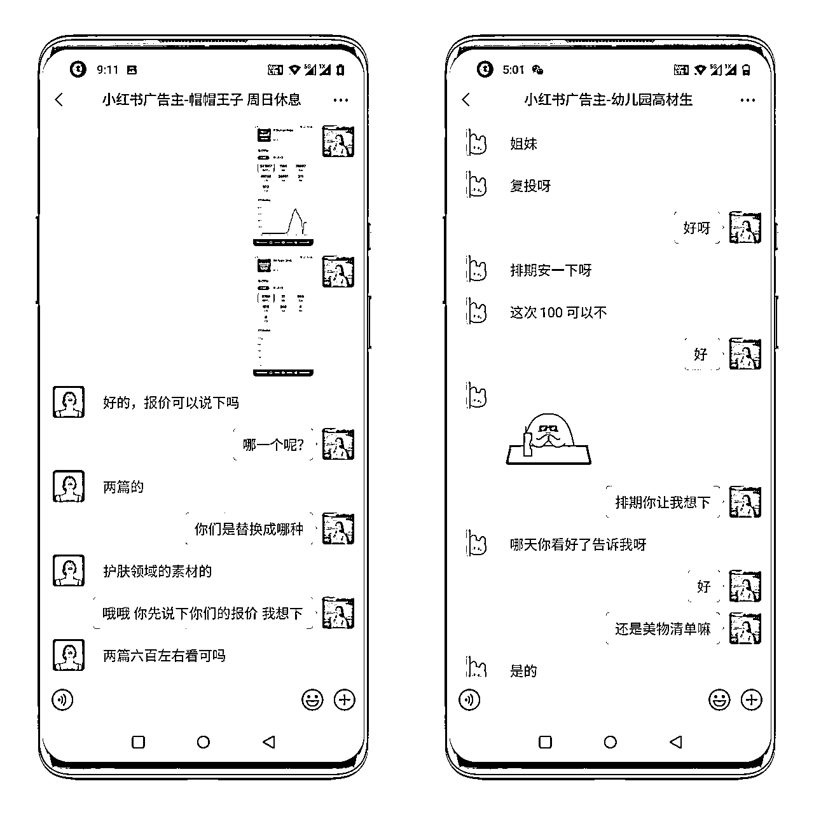

# 8.4.1 赛道数据

成长号赛道目前是比较容易出数据的，下面以我自己为例来跟大家拆解一下。

我先是试用了一个账号，这个账号数据好一点后立马加了其他账号。起一个账号用了 10 天时间，养号三天，发到第七篇笔记的时候获赞 1000+，算是一个小的突破。

发到第 10 篇的时候就有替换文案类的广告主来找我，报价 100，替换我一篇 600 赞的笔记。在发布到第 16 篇笔记的时候，7 天内实现了 9w 阅读，获赞 8w。截止目前为止，单篇笔记最高阅读 46w，获赞 6.4w。

目前，我单账号一条广告均价 120+，每月可达到 1000+的收益。