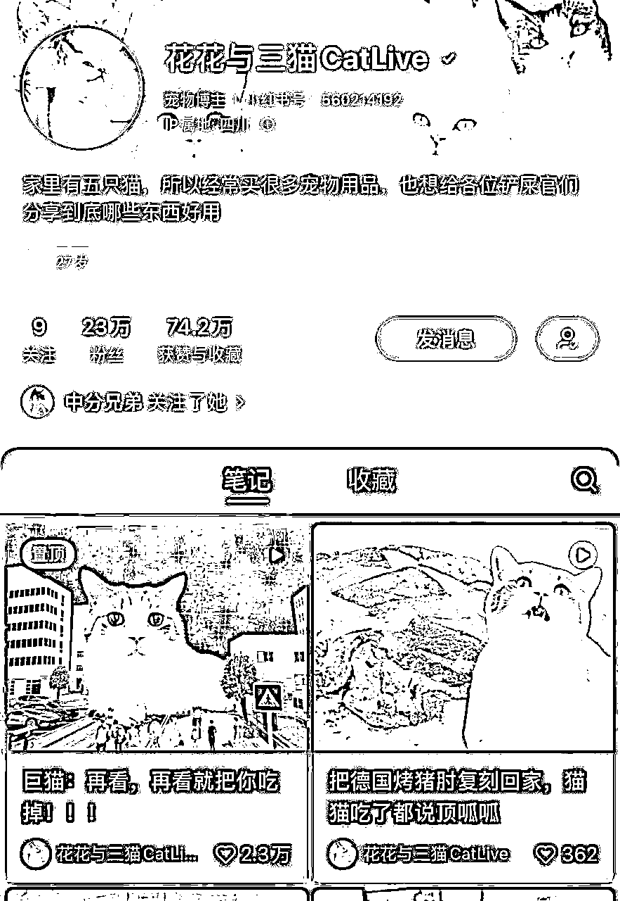

# 8.5.2 宠物号案例 ② @阿伟

我们的 IP 叫做@花花与三猫 CatLive，主要是以 5 只猫咪和主人的养宠日常内容为主的短视频自媒体，也会发布一些图文类作品。我们是老宠物自媒体 IP 了，从 2017 年就开始发布作品了，全网粉丝有 2000 万，小红书是我们比较晚分发的一个渠道，目前有 23 万粉丝。

一开始小红书的运营并不太顺利，后面在平台的邀请下入驻，开始专门的运营。虽然小红书可能粉丝体量上，比其他平台的体量要少一些，但是目前整个商业价值更为凸显。相比现在一些做萌宠的小伙伴，可能在内容上，我们已经没有玩儿那么新了。更多给大家分享 6 年以来的一些经验，希望对大家有用！