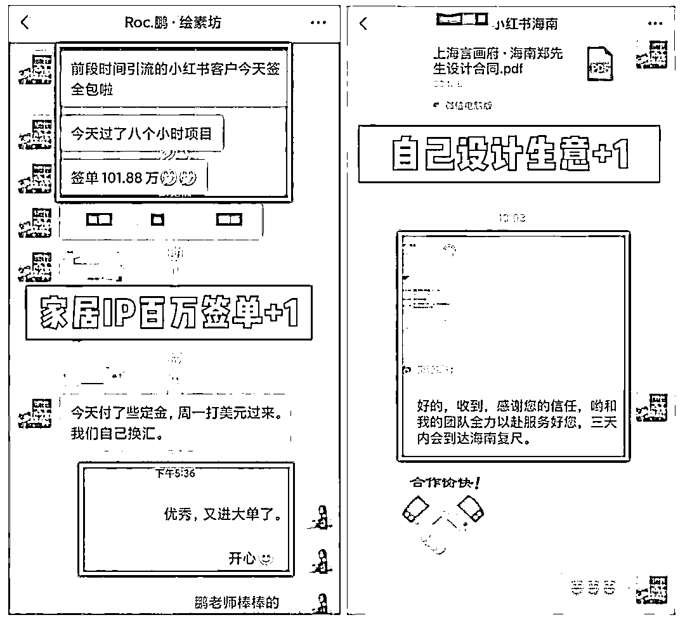

# 8.6 小红书家居赛道 @谢无敌

hello～ 大家好，我是你的老朋友谢无敌～小红书 MCN 闪亮猫传媒创始人～

刚认识我的朋友，可能只知道我在做小红书知识付费业务，其中【谢无敌的红书宝】是知识星球里头部的小红书社群。但其实我的另外一个身份，是在陆家嘴经营着 1600 平米的东方风格设计公司，旗下设计师若干名，家居博主账号数量也不少。

目前我自营设计公司-【言画府空间设计】的 80%流量是来源于小红书和抖音等平台。在我们众多家居账号中，排在第一位的就是我们旗下的鹏老师 IP，虽然粉丝只有 3w，但已经是东方风格设计领域里的头部 IP。

和小红书的其他热门赛道相比，我们的粉丝不算多，笔记数据也没有特别亮眼，但是每天都有人询单，累计变现已经超过 2000w+。

