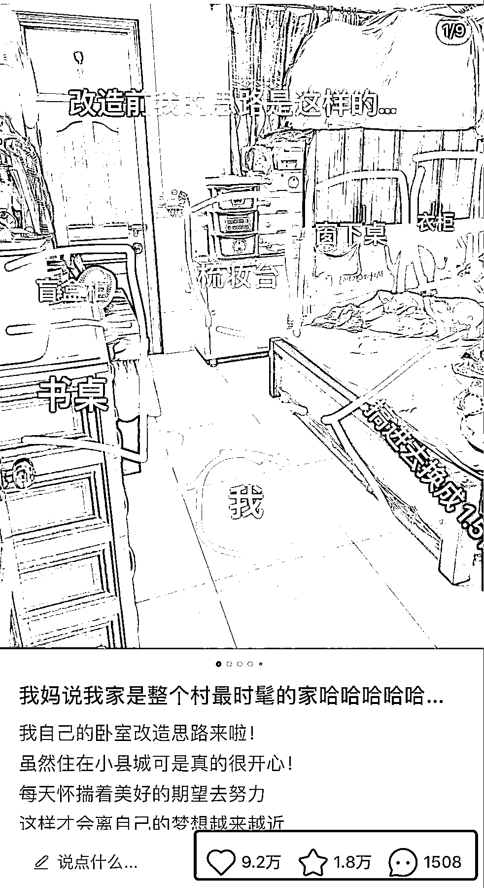
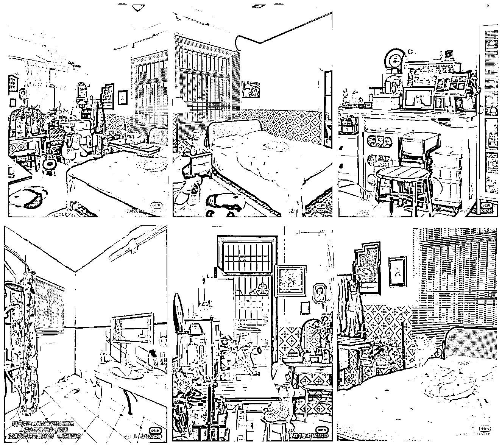
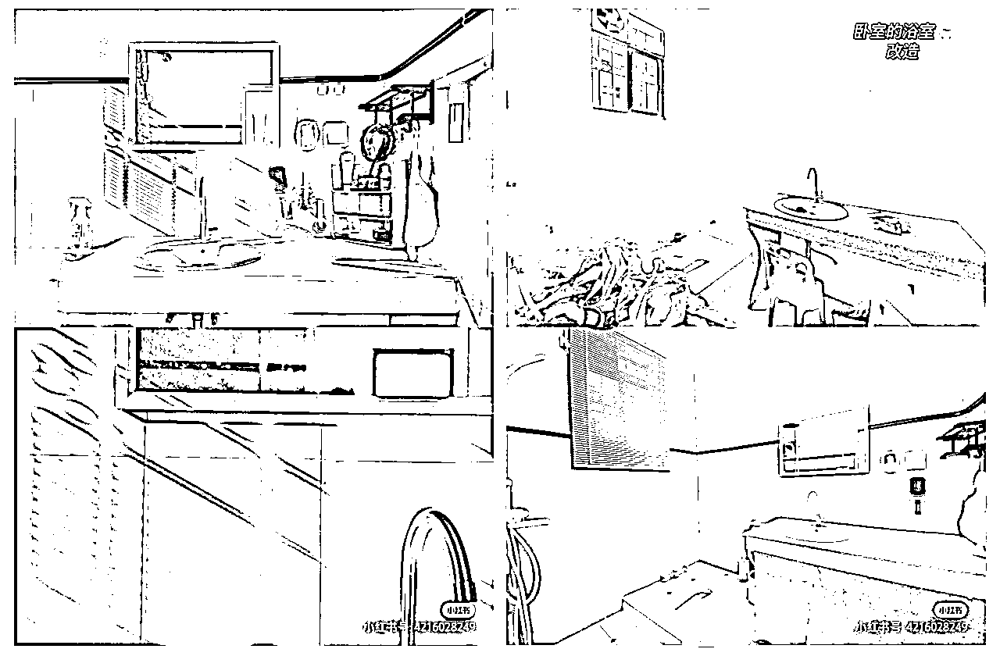
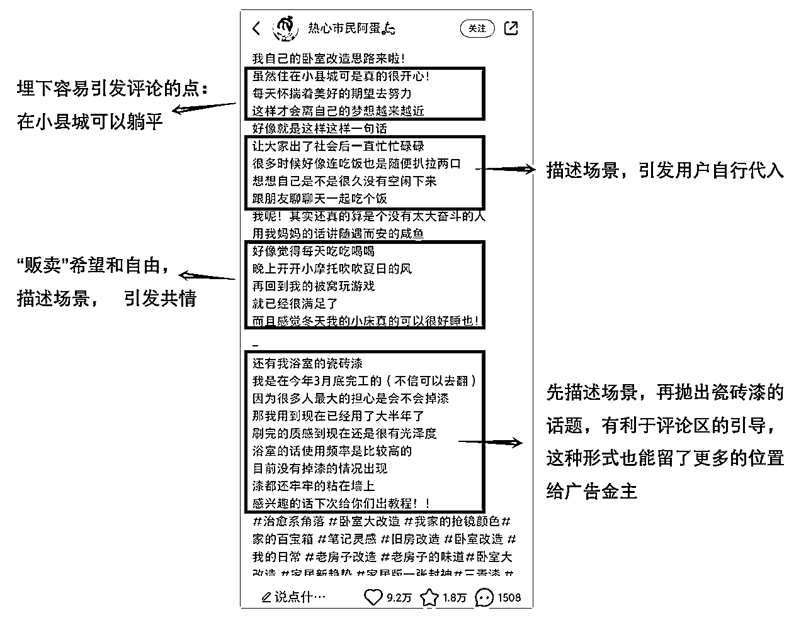

# 8.6.2 案例拆解

今天给大家拆解一篇家居博主的爆款，这位博主的定位是房子改造，1.9w 粉丝的账号，篇篇都是爆款，快看看这篇爆文拆解有没有给你灵感吧～

1）笔记数据

2）笔记链接

👉[`www.xiaohongshu.com/discovery/item/6364f5fb0000000009004420?xhsshare=CopyLink`](https://www.xiaohongshu.com/discovery/item/6364f5fb0000000009004420?xhsshare=CopyLink)

3）标题拆解

标题👉【我妈说我家是整个村最时髦的家哈哈哈哈哈…】

标题和首图形成了反差对比，首图非常凌乱，标题正好相反，引发用户好奇心：怎么个时髦法子？究竟能有多时髦？

标题公式【我妈说××（场景化描述）】，美食博主经常使用，比如：我妈让我直接去楼下摆摊、我妈说这玩意儿太好吃了！可能是用的人太多了，而且有标题党嫌疑，评论区有的人会暗讽。

但目前用在其他赛道，效果还不错。

4）图片拆解

首图：

•灵魂画手的简笔画看起来非常有实操性，乱七八糟中又不失条理，还带点可爱和真实；

•结合标题的“最时髦”，产生强烈对比，激发好奇心；

•中间还画了个小人儿，使整个画面变得更丰富，而且也让用户有了代入感。

图片 2-9：

全方位多角度展示改造后的效果。包括卧室、学习区、卫生间等。

整体非常有氛围感，凌乱中不失精致，让人感受到“这是一个家”，而不是为了拍图片凹出来的“小红书出租屋”网图感。

细心的朋友一定发现了，改造后的图片要么有暖光灯、要么有阳光，看起来非常温馨。想让图片有氛围感，暖色光是最好的滤镜。

5）文本拆解

6）补充说明

家居搞造型内容，前后的对比要足够突出，后面尽量多一点场景和角度的拍摄，用户会更有获得感。

场景延伸性非常强，这也意味着该账号的变现能力非常强，从改造使用的工具到，从地板到墙纸，从地毯到窗帘，可以打广告的场景实在是太太太太多了！

7）相似案例参考

✅租到丑房子不要怕，改造一下就好啦！！

👉[`www.xiaohongshu.com/discovery/item/6378be0c000000000b029e22`](https://www.xiaohongshu.com/discovery/item/6378be0c000000000b029e22)

✅我估计是刚改造完却惨遭退租第一人😭

👉[`www.xiaohongshu.com/discovery/item/6363996b0000000009006438`](https://www.xiaohongshu.com/discovery/item/6363996b0000000009006438)

✅7㎡仓库秒变卧室～全自动布置改造，get！

👉[`www.xiaohongshu.com/discovery/item/63777d2d0000000024021045`](https://www.xiaohongshu.com/discovery/item/63777d2d0000000024021045)

