# 线下流量服务商 202308

> 来源：[`remhu1p2pr.feishu.cn/docx/ErBjduNuCorKBBxrDm3c6fAPn0e`](https://remhu1p2pr.feishu.cn/docx/ErBjduNuCorKBBxrDm3c6fAPn0e)

# 线下流量服务商

出品时间：2023 年 8 月 24 日

手册使用说明：本文旨在向你展示一个项目的更多可能性，帮助你更好地理解和实操。

建议：如果需要快速定位到精确内容，可以使用快捷键 Ctrl + F/command + F 的形式，搜索「关键字/词」，查找你想要的内容。

写在前面

💡Hi,

欢迎大家来到 8 月航海｜线下流量服务商｜实战手册，相信在接下来的日子里，我们将在这里见面很多次。

随着抖音、小红书、大众点评等平台的发展，如何利用线上的流量给自己的门店做转化成为各商家老板都很关注的问题。根据《 2022 年抖音生活服务数据报告》，抖音本土商家总量超过 100 万家，年 GMV 约 7700 亿元，增长约 30 倍，可见实体存在着深藏不露的经营魅力。而现在很多实体商家并不知道该如何获取更多流量，如果你能够抓住流量密码，和实体商家合作引流，将是一个不错的生意。

本手册整体是根据一个线下流量服务商完成一次合作需要的步骤和能力展开的，你可以根据自己的实际需求选择性阅读。

第一章：我们会讲讲什么是线下流量费服务商，当下这个行业有什么样的机会？帮你建立起一个对该行业整体的了解；

第二章：想从事着这个行业，引流能力是必备，因此这里我们罗列了当前常见的一些引流方法，并且辅以案例，看看大家是怎么做的；第三章、第四章：我们在掌握引流方法之后，就要开始找第一个商家，并且和商家达成合作，完成一次完整的引流活动，希望这两章可以给你一些经验参考。

第五章：当我们成功跑通线下流量服务商这个项目之后，如果你决定通过这个项目赚到更多钱，可以看到这章列举了一些可考虑的拓展方向帮你放大生意；第六章：整理了 13 个常见行业的案例，帮助大家更好地理解。

除了玩法拆解，我们还在最后一节整理了门店私域运营团队的搭建方式，如果有商家可以持续做引流，那么我们也可以帮商家完成团队的搭建，这也是一个延伸业务的方向。

另外要跟大家提前告知的是，目前的航海手册，是收集了在生财有术星球收集该领域的精华、干货帖，通过拆分重组，最终形成我们的实战手册。

所以你在阅读的过程中，可能会有一定的拼凑感，但不影响内容完整度，也请大家理解。

而我们这么做的目的，就是为了能够给大家展示出这个项目中更多的可能性。希望大家通过阅读不同圈友们的经验后，能够从更多维度、更多人的视角中了解线下实体引流，从而更清晰地看到一次引流活动在筹备到落地过程中的各种路径及玩法。

当然，限于篇幅，部分玩法并不会在手册中详细展开。希望你能在手册中看到更多新颖玩法，也希望你能保持好奇，去对应的原文帖子里寻找答案，这也是我们在每一小节中都给出「内容来源」的原因之一。

手册怎么用？

前文有提到，手册的内容是按照引流到交付的执行步骤展开编写的：

如果你第一次尝试引流，建议你按照手册的顺序来一步步执行，里面有很多玩法可供选择

如果你已经对引流有了一定的了解，可以根据自己的需求，跳跃性阅读，找到适合自己的玩法当然了，我们更建议你能够将所有内容都看一遍，毕竟很多玩法都是通用且可以互相借鉴的，条条大路通罗马，希望你能在适合你的路上成功打通更多的引流路径，获得更多的精准用户。

手册中，我们大多摘录了重点内容，帮助大家过滤不重要的信息，与此同时我们也为大家备注了内容的「内容来源」链接，大家可以点击跳转至原帖中寻找答案。

除了上述内容外，还有个核心就是多提问，多交流，在这里没办法满足你的地方，多问问，我们会一起找到关于难题更多的解法。

希望大家可以在这次航行里收获成果外，结识一群战友。

以下内容由生财有术联合圈友制作而成，仅供航海船员以及生财有术星球圈友学习使用。

同时也欢迎圈友们在实践过程中持续反馈，和我们共同完善，可以联系鱼丸（yuwan387）提供修改建议～

## 一、什么是线下流量服务商 @孙策、@宗霖

💡

章节概要在这一章节中，我们先来大致的了解一些线下流量服务商的项目。

线下流量服务商与各种实体店，无论是瑜伽馆、口腔医疗、医美还是餐饮，都有合作的可能。它们运用经验丰富的流量策略，通过为实体门店提供新媒体运营、活动策划、营销引流等服务，线下流量服务商正逐渐成为线下商业的强有力的合作伙伴。

它的收益模型也非常清晰，主要来源于与商家的服务费和佣金。尤其是 CPS 和 CPA 两种模式，使得收益和实际效果紧密相连，保证双方的利益都能得到实现。

这里我们将深入探讨线下流量服务商的角色、功能和价值。让我们一起走进这个融合线上线下的新商业模式，了解它为现代商业带来的一些突破性变化。

## 1.1 线下流量服务商是做什么的？

线下流量服务商其实属于代运营服务的一种，它不单单只是做线下流量，而是帮助线下商业，通过线上线下多种形式，做流量增长，达到转化变现的目的。

比如与瑜伽实体门店、少儿培训、口腔、医美、餐饮等等个体或者连锁的实体店合作，用成熟的流量打法帮助商家扩大进店流量，提高转化率。如果这个商家品牌比较成熟，我们还可以拓展出更多业务，系统的商业流程升级就是拓展业务之一。

线下流量服务商的主要业务范围：为实体门店 / 商家提供新媒体运营、活动策划、营销引流、销售线索提供、销售转化等服务。

线下流量服务商的主要营收来源以收取和商家合作服务费和佣金为主，主要有 CPS 和 CPA 两种：

CPS：英文全称 Cost Per Sales，按照实际销量来计算分成佣金。通常会用到基础费用+ CPS 的形式，我们也可以在前期为了更容易达成合作，不要基础费用，只要 CPS 产生的佣金。

CPA：CPA 是指按效果付费的模式。只要将用户引流到店，推广人员就能拿到相应的返佣，不要求一定有产生付费行为，这种出现在医美类的行业。

## 1.2 线下流量服务商当下的机会

### 1.2.1 市场需求量大

只要有平台就有代运营需求，包括行业专业平台（汽车之家、美团）和全类目的公域平台（抖音、小红书）。

线下商业目前是非常需要数字化的阶段，线上的高速发展与线下的缓慢发展形成了巨大落差，但是这些老板们对这些新渠道的运营大多是一知半解的，又不得不做，所以市场需求是很旺盛的。

而线下商业的优势在于有成熟的产品、成熟的团队、成熟的商业模式，所以如果能够用更效率的流量方式、变现方式做运营，将会拿到更大的结果。

### 1.2.2 创业风险较低

线下流量服务商属于低成本低风险的创业模式，一人一台手机即可启动，纯是个人技能变现的方式，即使失败也不会有什么损失。

### 1.2.3 目前竞争难度较小

我们先了解一下目前市面上主要的代运营服务商：

平台区域代理商，比如美团、大众点评

抖音本地生活服务商联联周边游 、千千惠、旅划算等本地生活服务商

某些行业会有专业的第三方服务平台，比如：汽车类的汽车之家、懂车帝等给 4S 店提供线索；

装修类的土巴兔、齐家网和区域平台等给装修公司提供线索；

医美类的新氧、美呗等给医美机构导流抽佣和提供线索。

以上这些大都是行业内大中型商家会开通的合作渠道之一。

但目前的这些大的平台代理商情况是这样的：

所以我们作为个人或工作室来做这个业务的话，可以从美团、抖音、小红书、微信裂变等的单个平台先切入给商家提供专属定制运营方案，提供一定的效果保证，是很容易谈下合作的。

### 1.2.4 业务长期可做，成长空间大

线上的商业极度内卷，线下的市场相对来说竞争小，而且线下市场的体量大且长期，我们可以判断出，即使是一位新人入行，也可以有足够的时间从第一家合作的门店开始，逐渐打磨团队，打磨业务，将线下流量服务慢慢做成自己的主营生意。

# 二、线下流量服务商的业务逻辑

在这一节里，我们将一起了解想要跑通线下流量服务商这个项目，都需要经历哪些环节。

而手册本身也是依据做成这个项目的步骤来展开的，因此也来一起讲讲这个手册如何使用。

第一步：掌握至少一个引流的专业能力。

具备引流能力是做该项目的必要前提，因此你将在 三、线下流量服务商的核心引流技巧 中看到各种引流的具体方法，这将影响着你后续能够完成怎样的引流服务。

第二步：通过线上线下的方式找商家谈合作。

在我们有能力做这个引流服务之后，就可以开始通过线上搜寻或线下拜访的形式，找到有可能需要我们的引流服务的商家了。因此在 四、线下流量服务商如何找到合适的商家 这个章节将向你展现从找到商家到达成合作的整个流程。

合作的内容，可能是一个为期两周裂变活动，也可能是为期一年的抖音账号代运营，具体要根据你所具备的引流能力和商家的要求对齐。

第三步：和合作商家敲定引流方案，并开始执行。

和商家达成合作之后，我们将正式进入到为商家引流的环节。具体将在 五、线下流量服务商如何做好交付 展开说明。大致来讲我们需要经历这些部分：

首先要进一步了解商家的真实现状和问题，挖掘到商家的真实需求，并和商家敲定合作目标根据商家的情况、产品、可调用资源等因素，制定详细完整的引流方案

执行引流方案，注意需要及时记录数据和调整，有问题随时和商家沟通第四步：当前业务跑通后，开始放大生意。并且整理合作案例，为后续的合作做准备。

当完成了这次引流合作之后，我们就已经初步跑通了整个项目流程啦！

不过，线下流量服务商的生意空间是非常大的，如果你有意向在这个领域深耕下去，建议你看看 六、线下流量服务商如何放大生意 。通过找到更多商家，和放大服务范围来扩大自己的业务。

相信你已经大致了解成长为一个线下流量服务商的大致路线了。接下来我们就正式出发吧！

# 三、线下流量服务商的核心引流技巧

💡

章节概要

在当前的市场环境下，抖音官方正在大力发展下沉市场。然而，许多商家并不擅长在线运营，他们对如何有效地利用这些平台进行营销和推广缺乏足够的知识和经验。因此，他们非常需要找到专业的合作伙伴，来帮助他们进行有效的在线推广和代运营。

除了抖音，我们还能看到小红书、视频号也在布局本地生活，大众点评和美团依旧是消费者最常用的本地生活平台，还有很多本土的活动平台，本节将以这四个方向进行具体讲解：✅ 内容平台引流：抖音、小红书等平台，另外快手、视频号也同样可做；

✅ 团购平台引流：大众点评/美团等；

✅ 同城流量：本地生活公众号、本地同城活动平台等；

✅ 线下渠道：海报张贴、异业合作、地推、分销代理等；✅ 微信裂变：通过以上流量和自身已有用户流量，拓展更多新流量。

需要注意的是，不同的渠道，引流的诱饵可能是不同的，要基于每个渠道的用户不同的特性进行钩子的设计。

引流的方式多种多样，建议你根据实际情况选择，多种引流方法进行组合，找到适合自己合作门店的引流方案并实施。

如果你还有其他不错的引流方法，欢迎分享。

## 3.1 如何在内容平台引流

💡小节概要

你将通过本节熟知内容平台的主要引流方法。

在这节开始讲内容平台引流之前，我们希望你可以知道实体店做这类平台的通用逻辑是怎么样的。所以 3.1.1 将会以抖音为例，从平台流量、打标签、如何将产品的广告内容化，如何快速堆量四个点来讲一讲，实体商家的抖音应该怎么做。

当然这个逻辑，也适用于小红书、快手、视频号等平台，你可以根据自己要做的平台进行理解和调整。

接下来会从自己做账号和找平台达人合作两个方面，来具体讲讲在抖音和小红书如何进行引流，现在就让我们开始吧。

### 3.1.1 内容平台引流逻辑 @董十一

抖音其实是渠道和内容。

（1）渠道：无论你做的是什么生意，你想要的无非是通过渠道带来客户，以前发传单，现在通过视频和直播发传单，抖音/小红书/快手/视频号只是获客的渠道而已，没有什么秘密。

（2）内容：在抖音这些新媒体渠道上，你需要通过内容也就是视频/直播来获取客户。

在抖音这个渠道上通过做内容的方式让流量变成客户，这句话就是实体店做抖音的一切。

所以实体店做抖音的第一步：以终为始。

实体店做成抖音的有效路径主要有两个：

（1）持续拍出能够带来客户的短视频

（2）持续做出能够带来客户的直播投放和爆款不过是在有效的基础上做的增量，任何事情的第一步都是先完成闭环，在抖音上的闭环就等于从流量到成交。接下来就从流量开始，帮大家划重点。

#### 3.1.1.1 流量

很多实体店老板都会有个疑惑：为什么我的内容没有人下单？

因为你的内容没有让流量产生为你下单的想法，所以实体店做抖音的一步，不是先做流量，而是从成交出发做流量。

你要让你的流量看到你视频/直播之后，会买你的窗帘，水果，烧烤，家具，而不是纠结流量本身的大小和互动，对实体店来说，最没用的东西，就是所谓的数据推流。

当然，我们并不是不做流量，只是爆款和热门永远不是实体老板应该追寻的东西。为了流量去做的流量得到的就是流量，为了成交去做流量，得到的才是成交。

而抖音的去中心化算法决定了不管你是谁，你的视频除了因为粉丝给的基础流量之外，所有的竞争都是公平的。你要默认流量和粉丝今天会看你，明天不会，所以实体店做抖音的核心是：让流量和成交同时发生。

也就是让用户看到我们的视频和直播的这一刻就成交。

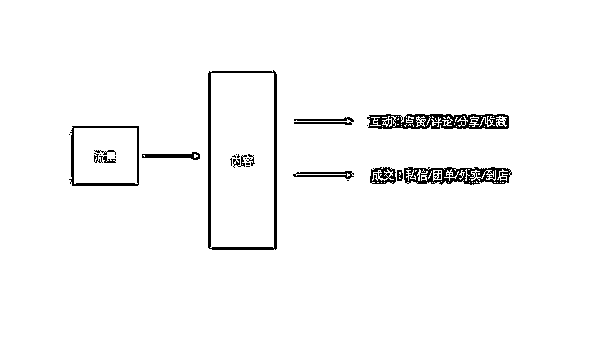

总结一下，我们的目的是为了获取客户，所以从成交出发做流量，流量属于平台，所以让流量和成交同时发生。

#### 3.1.1.2 打标签

开头的标签打的越好，流量越大，客户越精准。只有这一批附近有需求的人，才是你真正需要的流量，不去管流量的大小，而是通过流量找到属于你的目标客户。

那么究竟怎么做才能让流量变成客户？我们先来第一步，让你从 0 到 1 学会拍出一条能够带来客户的短视频。

假如我们在某个地方开了一家童装店，万事俱备只需要客户，我们注册了抖音/快手/视频号，摩拳擦掌准备大干一场，这个店的短视频怎么做呢？

首先，让我们回到商业的本质，做生意无非就是交易，不断的交易造就了市场。我们先来看看童装交易是怎么发生的？

今天有 1000 个流量经过店铺，进来了 100 个想买童装的人，最终成交了 10 个。

找到更多的目标客户，成交更多的目标客户，就是交易的核心，那么做抖音成交无非是通过内容：（1）找到同城的目标客户

（2）转化找到的同城客户

第一步：通过内容做流量找到属于自己的同城目标客户，而不是纠结流量本身的大小。

那么究竟什么是内容：一条 20 秒的短视频，分成几个段落，声音+文字配上一段画面组成的。

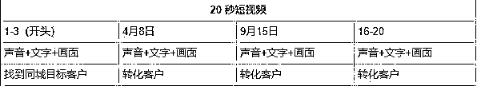

如果在临汾卖童装，那么一条 20 秒的短视频开头应该是这样：我在临汾（地方）卖了十多年的童装（行业）。

我们只需要在短视频的开头用上地域+行业的关键词，不断的造句，配上画面就是短视频的前几秒。

然后我们把一条 20 秒的短视频分成 4 个几秒钟，1-3s，4-9s，10-15s，16-20s，那么前 3 秒的核心目的只有一个，帮我们找到临汾会买童装的人，而不是把流量做大。所以短视频开头都这么说：

很多临汾的姐妹刷到我的视频来找我买衣服；

为什么我在临汾开的这家童装店每天有那么多客户；因为价格的问题 90%临汾的姐妹们不去商场更愿意来我这样的街边店买衣服；

是谁说在临汾找不到一家性价比高的童装店的；

所有的开头本质上都是为了让抖音给这条视频临汾的童装客户，让临汾的童装客户刷到这条视频，而且停留。

我们也可以看到，截图中文字没有提到地址，是因为视频的左下角 POI 地址带了，所以打标签你可以是用文字，也可以是技术和画面。

底层只有一个：让你们家附近会买单的人刷到你并且留下来。

#### 3.1.1.3 广告内容化

做抖音的目的是成交，成交的核心是给目标客户打产品的广告，让他看到购买的理由。

第一步：产品广告化

一位宝妈最终买下一款童装的原因，可能是看到这个童装“性价比高、品质好、服务好，实在，口碑好”。因此我们这一步需要做的是把产品变成广告，就是找到视频中提到的引流到店产品的卖点并总结出来。比如“性价比高、品质好、服务好，实在，口碑好”。

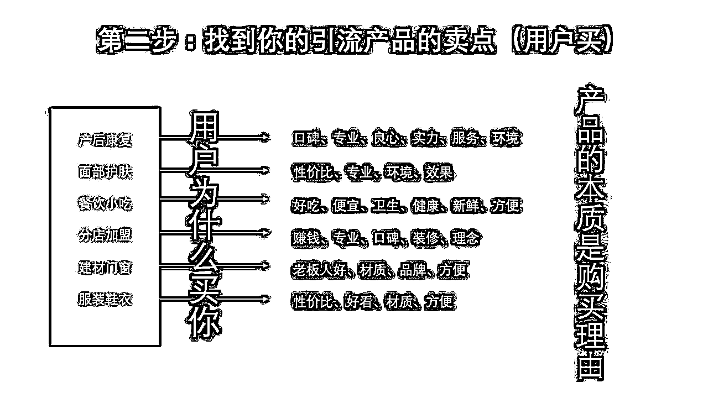

第二步：广告内容化

但如果是直接和用户说我们的产品“性价比高、品质好、服务好，实在，口碑好”，其实并不能很好的吸引到用户。

抖音和用户喜欢的是内容，但是内容本身带来的是流量，广告才会带来成交，我们就需要用做内容的方式去打广告：打广告 = 我们家口碑好

把广告变成内容 = 来我们家买过童装的姐妹都变成了老朋友，还会推荐新朋友来买。两句话，就是你的 1-3 秒的开头之后的 4-7 秒，再配上画面，就是短视频的一个段落，接下来，你只需要把其他广告变成内容。

口碑好：来我们家买过童装的基本都会成为老客户，还会推荐朋友来买

品质好：今天又一个老客户说，来我们家买的童装穿了很久和新的一样，孩子穿上不愿意脱下来

性价比高：商场买的上千块的和我们的原料其实差不多，给你对比看一下

实在：我们实体卖童装做的都是回头客生意，孩子穿着舒服，价格合适，下次就还会再来买接下来，我们把标签和广告放在一起，就变成了一条完整的视频，它既能带来目标客户，又能转化目标客户。所以一条视频就变成了：

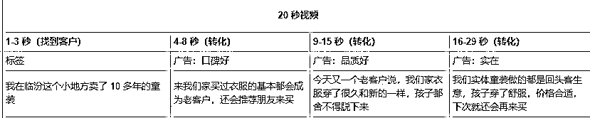

广告带来成交，内容带来流量。有人看的同时有人买。我们再总结下：

（1）别去在意流量的大小，要从流量里面找到足够多的目标客户

（2）通过地域+行业标签找到目标客户

（3）把产品变成广告再把广告变成内容转化目标客户怎么让更多人目标用户看到你的视频并且成交呢？

在有效的基础上堆数量大力出奇迹这句话不是空谈，但是前提是内容素材是精准有效的。就像做投放一样，素材不行，投放技巧再好，投再多钱都没有用。

#### 3.1.1.4 制作模板快速堆量

对于一个实体店来说，能够一周拍几条视频已经很难了，怎么还能做到大力出奇迹呢？这时候就要用上模板了。

接着上面的表格，当我拍出一条有效的内容之后，我需要堆数量来提升做成的概率，100 条视频，需要 100 个开头文案，这也太难了，但如果是这么做：

“我在临汾卖了 10 多年的童装”，抽取这句话里面的地域关键词：临汾；行业关键词：童装。我们其他视频的开头可以这么说：

这两天很多临汾的宝妈通过抖音来我们家买童装；

上个月这款童装我们在临汾的小店卖了上百件；这两天来我们临汾店给孩子买这款衣服的都要排队了；

然后把这些标签，写到一个表格里，形成标签库：

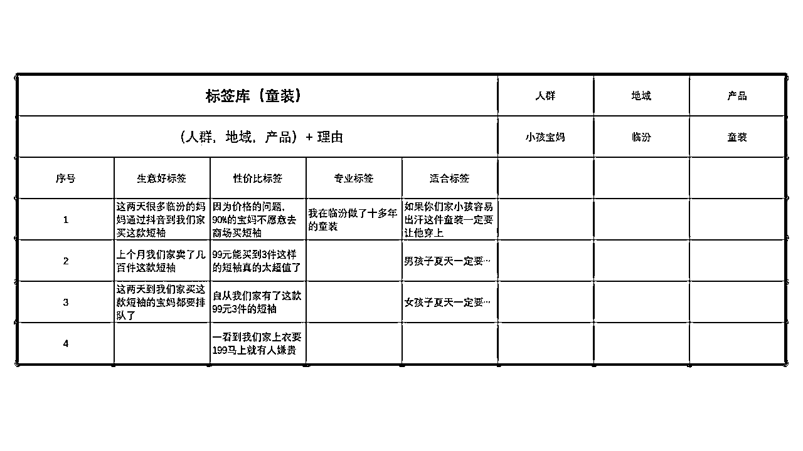

以上是一个开头的标签库，我们再按照同样的方式做一个购买理由库：

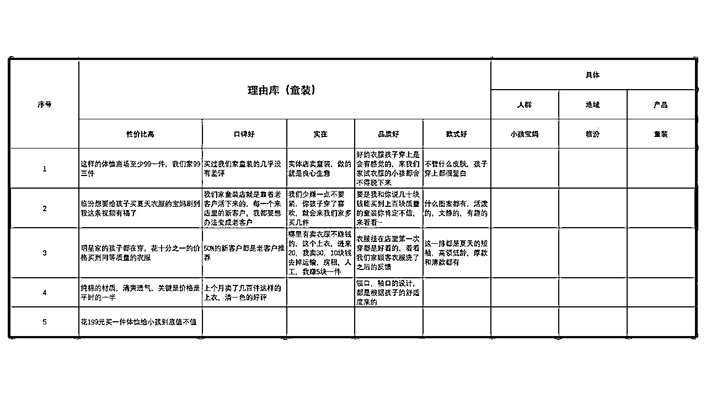

把标签和理由，组合在一起：

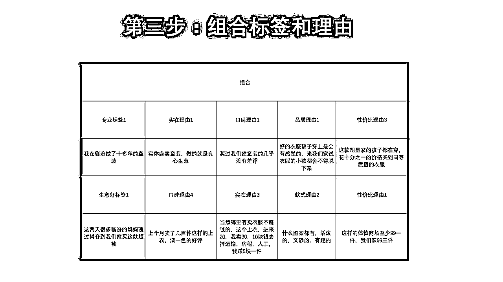

当我们拍视频的时候，只需要从里面提取几句话，比如：

标签 1 + 实在理由 1+口碑理由 1+品质理由 1 我在临汾做了十多年的童装（打标签找到临汾附近想买童装的人），其实实体店卖童装，做的就是良心生意（实在），买过我们家童装的几乎没有差评（口碑好），好的衣服孩子穿上是会有感觉的，来我们家试衣服的小孩都舍不得脱下来（品质好）。

把这条视频稍微改一下字，翻拍 10 遍，就是 10 条视频，再排列组合一下：

1+1+1+1 = 1 条视频翻拍 10 遍 = 10 条短视频 1+2+1+1 = 1 条视频翻拍 10 遍 = 10 条短视频

2+1+1+1 = 1 条视频翻拍 10 遍 = 10 条短视频

........

所以我们想拍一条带来客户的短视频，只需要简单的从库里面拿出东西来组合，标签库 + 理由库，形成了无数条能够带来客户的短视频。

接着就开始运营账号，有了内容，其他的就是技巧方面的事儿。

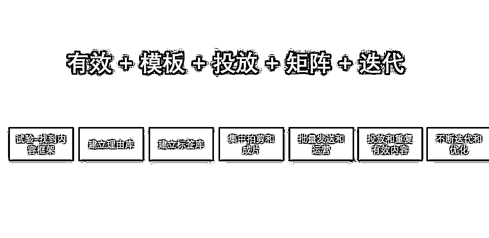

内容来源：《为什么实体店做抖音这么简单？》

#### 3.1.1.5 不同市场和平台的分析 @不语

市场分析

一线城市：过于内卷，大品牌已有稳定固定合作，小品牌已被多次收割，新入场不建议做；二线城市： 潜力犹存，老板多数都被收割过，但是老板还是需要有效的线上推广及营销。专业水平到位的话市场重新可以重新开发一遍。

三四线城市：亟待开发，市场偏向空白，已经有人在做，但是专业程度肯定很低，而且多数肯定没法做到有效交付，市场很大。

平台分析抖音

在一线和二线城市，抖音受欢迎程度极高。这些城市的居民通常更加关注潮流和娱乐，抖音以其丰富的内容和创新的功能吸引了大量用户。抖音的短视频和直播内容也吸引了众多年轻人和商业品牌。

在三线和四线城市，抖音也很受欢迎，但可能略逊于一线和二线城市。然而，随着智能手机的普及和互联网的发展，抖音在这些地区的用户群也在增长。

快手

快手在一线和二线城市的受欢迎程度较高，但可能不及抖音。快手以更接地气的内容和对普通用户的吸引力而闻名。

在三线和四线城市，快手非常受欢迎。这些地区的用户通常更喜欢快手上的生活和娱乐内容，因为它们更贴近他们的生活。

小红书

小红书在一线和二线城市非常受欢迎，特别是在女性用户和时尚爱好者中。小红书是一个以生活方式、美容和时尚为主题的社交电商平台，因此在追求时尚和品质生活的一线和二线城市用户中受欢迎。

在三线和四线城市，小红书的受欢迎程度可能较低。然而，随着消费水平的提高和对品质生活的追求，小红书在这些地区的潜力也在增加。

适用方案

总的来说，建议主做市场放在二三四线城市。

抖音在一线和二线城市的受欢迎程度最高，而快手在三线和四线城市非常受欢迎。小红书主要针对对时尚和生活方式感兴趣的用户，因此在一线和二线城市具有较高的受欢迎程度。

二线城市建议高粉达人：低粉达人：素人=2：3：5，以抖音+小红书为主推平台（大众点评和快手同步）

二四线城市建议低粉达人：素人=5：5，以快手+抖音+小红书为主推平台（大众点评同步）

具体方案以实际情况而定。

内容来源：《探店 15 天 门店由亏损到日利润 6000+，浅谈 3 年探店心得》

### 3.1.2 如何在抖音做号引流

💡

小节概要如今线下实体商家的成本结构，可能会发生变化。以前一个线下门店，房租成本大概会占到 20% 到 30%。现在可以把房租降到 10%，然后可以把省出来的 10% 用在抖音同城号的建设或者营销上，这样能获得更多的客户。连锁品牌尤其是加盟品牌，应该是同城号里最大的红利受益者。

在这一小节，我们分三个部分来聊聊抖音同城号如何做：✅第一部分：先说明抖音本地生活是什么？为什么要做抖音本地生活？

✅第二部分：讲讲如何在抖音认领门店，以及通过在短视频带定位、同城、直播等页面显示自己的门店链接；

✅第三部分：通过几个抖音同城号的案例，展示是如何做内容的；

✅第四部分：整理了做抖音同城号的六个注意事项帮你闭坑，以及几个建议入局方式。

即使不自己做内容，入驻抖音本地生活后，也可以让达人通过分佣的形式帮门店宣传。所以现在就开始在抖音认领门店吧。

3.1.2.抖音本地生活，里面一共包含 3 个词语，即“抖音”、“本地”、“生活”。

“抖音”代表平台，当然也可以替换为小红书、快手、视频号等。“本地”代表区域，与之对应的是“异地”、“海外”等。“生活”代表类目，与之相对的可以有“职场”、“教育”等其他方向。

因而，抖音本地生活可以理解为“用户在抖音平台下单生活消费类产品或服务，并在本地实体商家方的协同下完成核销”的一种商业活动。更直白的去理解抖音本地生活，就是短视频版本的美团点评，将本地吃喝玩乐商家的产品或服务，以团购和代金券的方式在抖音上售卖，利用兴趣推荐算法信息流实现销售。

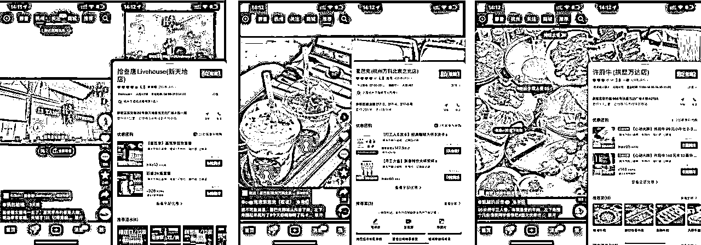

本地生活的发展路径是伴随互联网平台的进化完成的，早期的信息平台代表 58 同城，到美团点评的图文推荐类，再到抖音、快手、小红书等短视频兴趣推荐类，到现阶段甚至支付宝、地图等 App 都不愿放过这块生意。

本地抖音、快手、小红书、京东、支付宝都在发力。那么，兵家必争之地，平台必争之地，作为店铺主，自然要作为我们的必答题，且要争取拿高分。

2022 年开始起势的这一轮抖音本地生活相较上一轮主要有以下几个改变，决定了本地生活必须做、值得做、且要下大力气做：

（1）

，在原有广告投放思路的曝光量数据之上提供了成交层面的清晰数据，在此基础上便可直观衡量和改良投放 roi 。在有意识做系统性优化的前提下，前置入局的玩家是必然能享受到流量红利的。

（2）团购达人在若干城市内测了 0 粉开通，其他城市也只需要 1000 粉即可开通，门槛极低。成为团购达人便可在任务广场获取本地生活带货链接赚取带货佣金，并可以在同城达人群或商单群接收相关任务获取剪辑发布佣金。

本地生活的本质是“品带人”，电商带货的本质是“人带品”，一个好的品，即使视频质量一般，也同样能带来极好的销售分佣，极大的促进了素人 up 主的带货热情。

内容来源：《为什么说抖音本地生活是道必须拿高分的必答题？》

#### 3.1.2.2 抖音本地生活怎么给线下引流？ @宋威

首先，休闲娱乐等，但具体还是看平台的审核为准。

第一步：在本地经营生活服务的单点实体商家，并且公司或者门店主体没有在抖音企业号开通团购功能，就在抖音来客 APP 申请入驻并认领门店。

第二打开抖音来客官网：https://life.douyin.com/，或者手机下载抖音来客 APP 。注册之后登录，查看入驻所需材料，准备好材料和信息，点击入驻抖音门店，认领门店，搜索到要认领的门店，确认好门店信息。

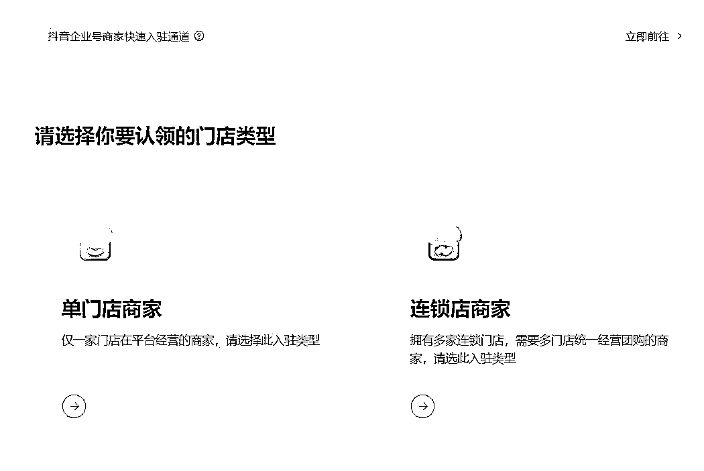

选择门店后，进入提交资质的页面，按照页面提示经常资料还有信息的审核上传即可。需要的材料有：企业法人营业执照，《公第三步：认领门店之后，绑定收款账户，绑定抖音号，创建团购商品。

商家在抖音认领自己门店后创建团餐链接，这个步骤就和你入驻美团一样，用户在抖音可以直接购买商家设置的团餐，购买后获取一个二维码，和美团点评一样用户凭借购买的券码然后到店核销消费用餐。

而怎么让用户可以看到和购买你上架的团餐呢？ 目前抖音有四个流量入口：

第一个：发作品带门店 POI 定位流量

也就这个是目前百分之九十的商家重点流量来源版块和重点要操作运营的版块，因为上手简单易操作，目目前本地团购达人规模非常大，可以满足市场推广需求。目前来说这个版块占比我总 GMV 的 40% 左右。

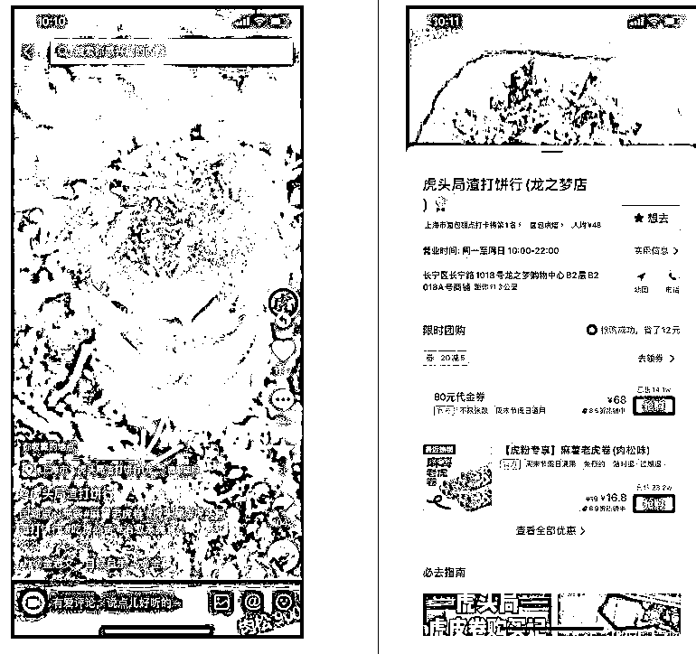

第二个：商家主页 + 搜索流量

也就是品牌自身声量和粉丝或者线下门店带来的流量，有人通过抖音主动搜索品牌号或者线下门店引导到主页购买抖音套餐，然后

所以如果你是加盟商或者特许经营，可以拿到品牌授权书去认证账号，借助官方的影响力或者搜索流量。举例：某品牌抖音排名，一个体户，全国排名第三。

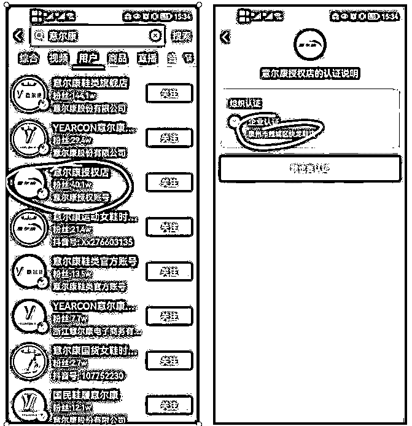

第三个：直播间挂本地团购小房子流量 （小程序是小雪花）

也就是通过本地直播带来的流量，这个包含两个版块，一个是品牌自播，一个是达人直播，也是一个需要商家强运营的版块，直播和短视频端相比就是门槛相对较高，对商家能力的要求也高于制作短视频内容，且目前市面上本地直播达人太少太少，官方的头部达人也就不到 5 个，还全部集中在北京地区，其余城市都是刚刚起步。但是这个版块潜力巨大，目前我达人直播和品牌自播都在进行，占比我总 GMV 的 54% 了。

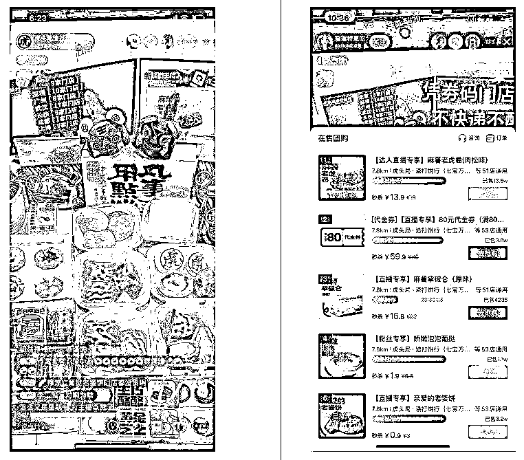

第四个：抖音本地同城页流量

也就是抖音平台同城生态自带的流量，这个页面其实就等同于美团点评了，用户想要吃什么，会习惯去逛美团点评找，抖音如果生只是流量一直也不大，现在同城页面下又在内测学习商城等子页面，流量更小了，概括来说这个版块等用户养成习惯后会有潜力，但是现在可以忽略不计，总体我 GMV 占比也就 1% 最多了。

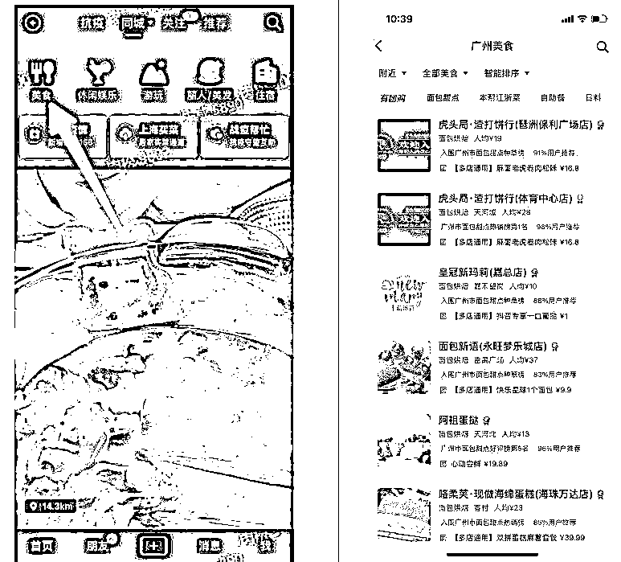

内容来源：《虎头局抖音本地生活从 0 到 1 半年做到 3000 万 GMV 实操分享》

#### 3.1.2.3 抖音同城号如何做内容 @西撒、@乔合

我们的做法是直接把开店的过程拍下来，将开店的日常记录做成一个系列。这个号从选址就开始拍摄，把门店装修过程一步步的记录下来，搭配轻松诙谐的聊天文案。

在这家店还没开业的时候，就已经做了 20 多万的同城曝光量。这波流量带来的直接效果，就是到装修完毕开始试业的时候，第二天就已经开始排长龙了。而且这个账号到今天为止，也只投了几百块钱的 Dou+ 费用而已。

我们来捋一下底层逻辑。做同城餐饮门店号，用户画像的范围会比较广，并不需要像其他行业账号得做很精细的定位和用户画像分析。同城的好处就在于，我们门店做的是周边几公里的生意，我们追求的是能否在周边几公里内持续的曝光，让周边的人知道有这样一家门店存在，有这么一个老板在开一家这样的门店，然后在这个过程当中去吸引他们到店体验消费。

在内容制作上，我们一开始就没考虑天天拍美食，这种视频找一些素人矩阵探店去打爆就行了。我们希望这个账号是有记忆性的，做成同城的小 IP 。经过测试，确实是可以通过这种开店日常把流量做起来。

做同城流量不需要追求那种全国大热门，能够有小几万的本地播放量，时不时上个小热门破下圈，就足以给整个门店的生意带来极大的帮助。目前这个门店在我们当地，一直是人气榜的第一名。

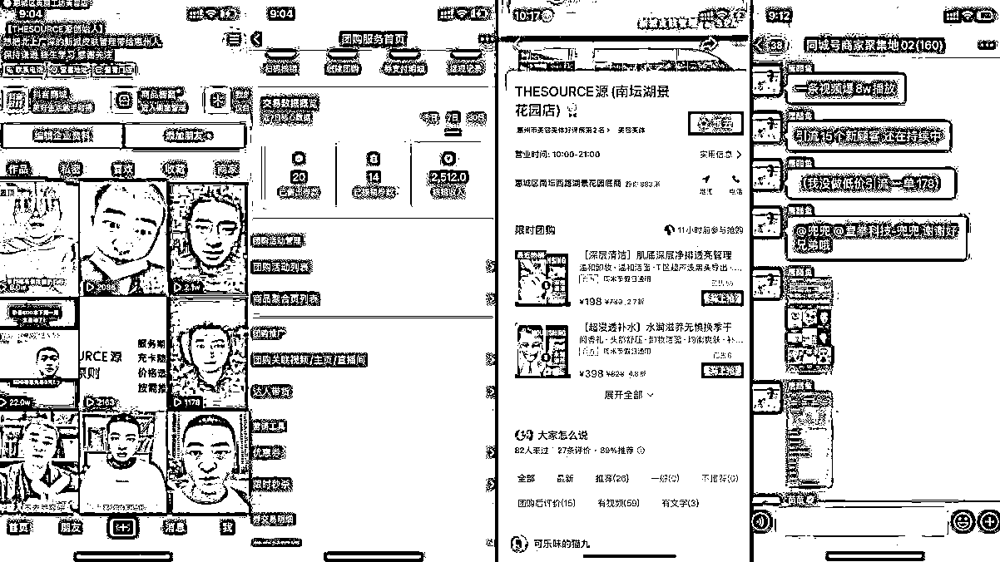

这位圈友自身的表现力很不错，也放得开。我们给他的脚本优化后，拍出来的视频跑了 8W 的同城曝光量，因为有上架团购产品，卖出 20 多单。后续又再爆了一条 20W 播放的视频，基本上周边 10 公里的用户都覆盖了，到现在还在持续的为他门店带来优质客源，同时也做到了本地美容美体榜第一。

3\. 电子烟门店同城号

最便宜的流量当然就是短视频，我不需要引到私域去，我只需要店铺在同城的曝光度。让大家知道我有这个店，我这个店在哪里，我这个店卖什么的，我这个店开业有什么活动就足够了。

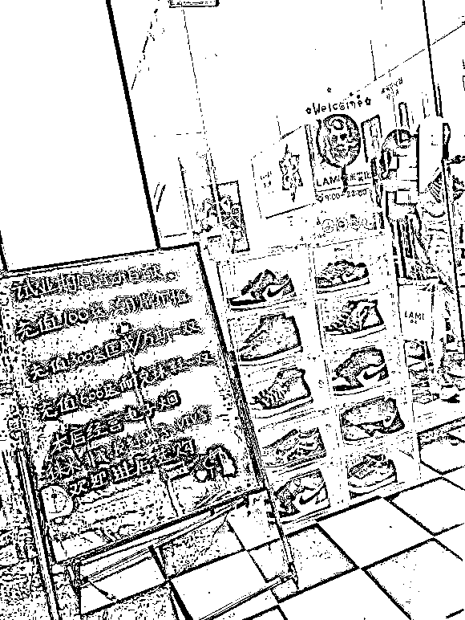

我就把这个牌子放在店门口，拍个视频直接投豆荚加门店定位就行了，两个视频 500 块钱！总共 1000 块钱投放附近 30 公里的，本地 48 万的曝光率，让本地人对你这个新店有了第一印象：做活动、划算 、什么电子烟都卖的。（抖音号封了现在找不到截图了）

开业活动

充 100 块钱送潮牌 T 恤

充 300 送匡威万斯

充 600 送 AJ ～懂的都懂成本没多少，T 恤去广州批发 8 - 12 块钱，鞋子找莆田便宜的很，反正又不是卖，单纯送没人会计较你真假。

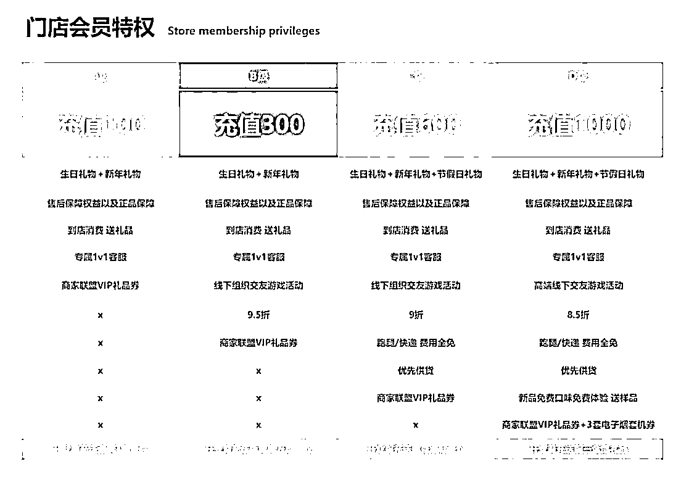

五月底试业弄的充值活动，开业前两天陆陆续续来了几批人，后面就很多人充值了觉得很划算，互相推荐形成了口碑传播，包括我们后面还陆续拍了几十条视频宣传这个活动，每条都投了 100 块钱流量，人气一下子就起来啦。

在营销上，这家店选择了「排队」的经典打法。短视频的拍摄极其简单，视频画面传递一个关键信息——这家大排档“天天排队爆满”，文案上用创业第 XX 天加一句走心文案做标准化输出。门店开店的时候，邀请所有的亲朋好友到店免费吃，从各个角度拍完视频，经过简单的剪辑后用这些人的抖音号发上去，通投 100 元 DOU+ ，效果后就后面继续追加。

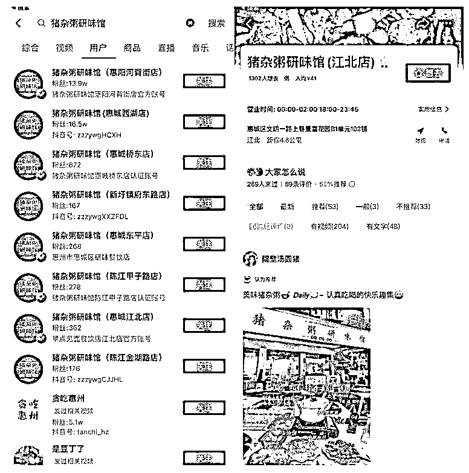

5、小吃摊位同城号为了能不断优化视频的数据，我也专门对标了一些同城热门的视频。最近地摊比较火，所以我就拆解了烟火气小吃的拍法。

我发布的视频，主要有两种：

1、卡点类型的视频。偏向于特写， 3:4 竖屏。

2、剧情类型视频。拍摄方法为：刚开始移动的镜头 → 然后跟老板的对话 → 再拍摄制作的过程（剧情类的视频是全屏的）

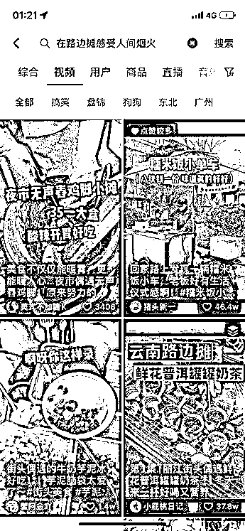

在发布视频的时候，一定要加上定位，标签带上本地城市名，以及“xx（城市名）探店”。用来做同城流量。

标题文案也可以蹭一下热度，比如：偶遇 xx 夜市的 xxx，也太好吃了吧！

对于视频内的文案结构，可以刷小红书爆款，把文案相应的修改一下，或者是有什么直接能套用。所用到的文案尽量是以顾客的角度，来对其他人进行分享的感觉，比如：文案一：

别问了！！！真的在 xx （城市）！！！

在隔壁买蛋糕才发现！！！

这不是我在 xx （城市）吃的！！xxx（店名）吗 😭

之前在 xx（城市）吃过一次 一直心心念念这个 xx（品类）

品类很多样 zui 爱 xxx（产品名称）

还有 QQ 弹弹的外皮+甜甜的芯超级绝

（上面这行介绍产品）

手上拿一个吃再打包几个回家幸福感爆棚了

真的很爱一切糯唧唧的东西呜呜呜建议晚点去 晚上才开摊人还不多！

不过我们只买到几个 😭我后面的都没买到

文案二：

想安利给全世界的 xx（店名）

偶然间在超市看到的觉得颜值很好看就买来尝尝

吃到嘴里真的惊艳到了

红豆肉松蛋黄的红豆味很浓郁，夹杂着肉松的香味，中间还有整颗蛋黄🥚，吃到嘴里嘎嘎香的，口感非常好

（上面这段介绍产品）

姐妹们快冲 这味道组合在一起真绝了，期待新的口味哦～

视频发布后，还有一个动作就是：在评论区留言，写上店铺名、地址、营业时间等等除了拍视频引流外，我还会在抖音开直播。并且在每次出摊前，我会先更新一条视频，和平时一样的卡点或者是剧情类，靠着视频来给直播间带点人气。

内容来源：《如何看待抖音同城流量的红利？以 3 类门槛低，变现空间高的项目展开讲讲》、《00 后实体店创业者：用互联网思维破局疫情影响》、《我做了哪些操作，摆地摊也可以 60 天营收 20w+》

#### 3.1.2.4 做同城号的六个注意事项 @大芽

注意：只拍一个点，这才能够迅速地抢占用户心智。如果绕来绕去，大家是记不住你的。

2\. 发布前要带 POI 位置信息

一开始做号一定要带地标，如果店铺还没有地址，可以先蹭热点，店铺周边的小区，酒店等都可以挂上。我一开始就是挂上了附近的一个酒店，其实这个酒店离我们店有 500m，但是没有关系。带上地标，才有更精准的本地流量推荐。

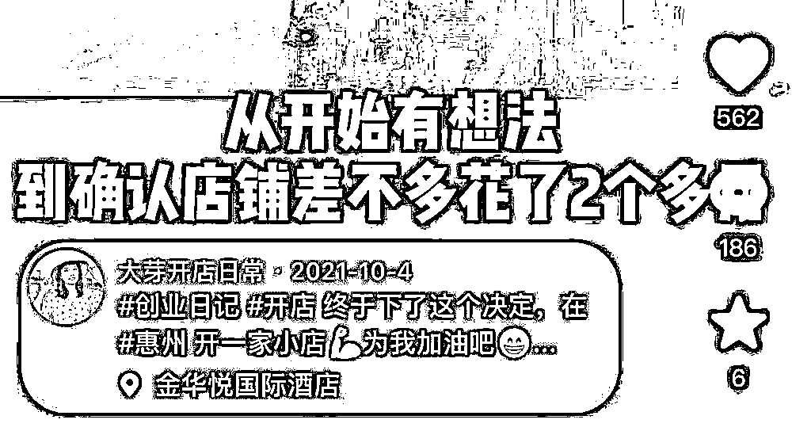

在发第一个视频时，我就是靠这个小技巧，选到了这个在上升期的 BGM，并一直使用着。持续使用某个 BGM，对于用户来说，也可以当成一个记忆点。

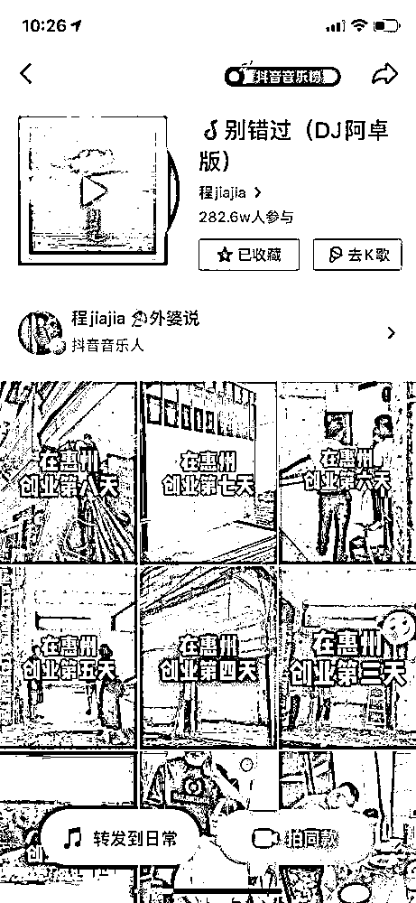

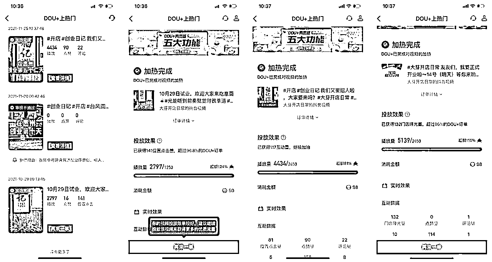

内容来源：《3 公里内最少有 500 人看到，抖音同城号做到热榜第一，132W 播放》

#### 3.1.2.5 入局建议 @曹聪 ᴄᴏʟɪɴ。ᴄʜᴀᴏ @老胡

（1）明确阶段性的战略需求，不同的需求对应不同的战略目标

总体目标：把一家赚钱的店打造成长期持续赚钱的机器，在抖音平台获得长期稳定增长。

要 gmv ：以正价品的成交为主要目标；要品宣：以树立品牌形象和强化用户心智为主；

要引流：以吸引更多客流到店为主。

（2）3 个必备常识

a. 品带人烂的产品设计，商家不赚钱，达人不推荐，用户不买单。

好的产品设计，商家能赚钱，达人爱推荐，用户会买单。

赚钱：算折扣、算毛利、“玩套路”；

流量：有意思、有话题、有真东西；

服务：核销比例、履约能力、复购钩子。

“做生意就是自己算对账，让客户算错账”，利润由此产生，但不要骗人。

b. 控成本

低成本的内容批量生产分发，可以通过员工账号矩阵、顾客账号矩阵、云剪达人矩阵，加上半自动的剪辑分发工具，一定要控制住成本，否则往往虚荣数据很精彩，但一算核销账并不赚钱，虚假繁荣可以忽悠黑盒外面的人，但忽悠不了自己，忽悠不了账面的真实数字。

员工：卖点、培训、激励

顾客：物料、流程、奖励动作：话题、模版、文案

至少店主和员工的账号要成为团购达人，为门店进行视频分发和带货，高效获取达人资源及低成本剪辑分发短视频的解决方案后续会再分享，一条短视频从拍摄、剪辑到分发的成本控制在个位数时，投放效益跑正的概率便大大增加。

c. 做直播

直播不费劲，别给自己加戏，别表演退堂鼓，没人看。实体门店就是天然的直播间，信任感建立的最佳途径。

增加一个或多个日不落线上销售渠道，何乐不为。前面说过，本地生活是平台战略，必然会有 Poi 倒流的倾斜，多入口流量汇总，不要白不要。

Poi 倒流，本地连锁效率最高，多入口流量汇总，不是连锁怎么办？有招，看下方（4）。

（4）超级平台的超级红利，也能被拆解成几个具体的方向入手

抖音本地生活的团购逻辑有很多维度，比如收藏数量、gmv 数据、核销率、视频数量，需要多维度去考虑，需要一一分析拆解逻辑，逐个打破，做好服务，比如精确到一块钱 GMV 对应 100 的热度，然后算清楚之后和商家沟通合作收多少钱，然后帮商家上榜。

另外还有搜索流量。SEO 仍然是目前最容易实现的“广告”，团购是排在页首的黄金选项，不信你搜搜看。

抖音作为搜索平台已经是 “确定性” 明牌，第二大，同城搜索的匹配是高度精准的，本地生活商家序列第一，然后才是商品、直播、短视频、广告。Tag 的匹配度，短视频数据，用户习惯。SEO 词的确定是个学问，生财有开过航海，去看看资料，别自嗨，你的品牌没人搜，产品和场景才有。

还有一个排行榜机会。这个会影响到曝光和流量倾斜，建议好好研究规则。参考点评，一个黑珍珠千万，一个必吃榜百万，抖音的榜单价值绝不弱于这个标准，商家分、Poi 分、产品分，人气、好评、收藏、热销，各有各的办法。

（5）服务商一定要做好矩阵，做矩阵比什么都重要

矩阵分为素人矩阵、koc 矩阵、kol 矩阵，就看你怎么组合。必须做矩阵的一个很重要的原因是，因为抖音的流量底层逻辑有一些变化，二级流量，大概 5000 播放量以内，本地流量是占到 50%～80%了。

但当视频超了 5000 播放量以上之后，占比会越来越小，都是外地的流量，做本地生活一定是要有效的流量本地生活为主，所以要通过做矩阵得到更多的有效曝光，窗口分散。

（6）深耕本地生活细分赛道这个点很关键，可能初期启动会轻松一点，比如我们三个 BD 可以打那么多商家，服务了那么多商家的话，其实一年赚的钱也蛮多的。所以赛道深耕让你冷启动会很快，然后同时成本控制的足够好。

去做第二个赛道会很更快，尤其做电商的话，是很会需要做方法论 sop，所以切入整个大赛道就会轻松很多。

建议大家不要切入一个赛道之后，然后很多朋友给你推业务，后面五花八门的业务都在做，一会做餐饮，一会做足浴，一会做电影票，一会做景区，这可不行，一定要选择一个垂直细分的赛道里面去深耕。

（7）渠道多元化，比如大众点评、美团

要学习别人怎么做全案的，不要把鸡蛋都放在抖音里面，像美团、大众点评逻辑很简单，就是刷刷单供货量就可以实现闭环，可以并入自己的服务里面去，包括小红书做电商的话肯定会比较快，然后还有像那种微信本地公众号和视频号推私域也可以同步做一下，渠道要多元。

包括地推，去年有个 150 万的案子，楚川公司当时一天请 20 个学生，兼职 100 块钱一天，他们就去附近三公里的地铁站发传单，直接地推销售，然后一单给他 20，很多一天赚几百块钱。

还是得要做深做透，这样才有可能帮商家全平台运营，也能收得起钱。现在抖音的生态，比如商家给你 1 万块钱，他会觉得超级多了，但是帮他做全案收 20 万 -30 万，他会很乐意出，他觉得很值，因为你可以深度的服务他。

（8）抱紧官方跟官方要方法论，要资源要案例，但是不要他成为他的狗腿子，要去学会利用他。

（9）多方位变现

其实刚刚有说到像电商品牌的本地化，其实线上卖酒的品牌，比如卖化妆品护肤品这种太多就是愿意贴钱来做这个事情的品牌。

作为服务商就可以薅他们的羊毛，比如给你 100 万的曝光兑现产品或是流量费给我，我帮你铺渠道，获取用户，这种方式是可以多元的。

还比如你拉了一个大的 KA 渠道，像便利店这种，你把一个产品拿到便利店里面去，1000 多个便利店流量入口就超级大，通过你的引流效果是很大的。

其实大家可以多思考，电商里面挖掘到本地生活里面的东西真的很多，比如楚川他们去年收一家精品化妆店服务费是 8 万块钱，在长沙有 6 家店。当时他们帮化妆店上了一个 19 块 9 的化妆服务，外送一个 128 的护肤套装，差不多半个月就帮它卖了 6 万多份，商家说那一单他们赚了不少钱，因为让很多人转化成了私域。

本地生活跟私域结合起来，本地生活跟电商的消费品结合起来，都是有很大机会的。

内容来源：《为什么说抖音本地生活是道必须拿高分的必答题？》、《价值百万的抖音本地生活创业血泪史》

### 3.1.3 如何找抖音达人引流 @蛋解创业 @宋威

💡

小节概要有一种方法比你自己做号还要更高效，但是需要花更多钱，就是找达人。

在这一节，我们会讲讲应该怎么找达人？找哪种达人？如何进行合作？达人怎么拍摄内容？

然后会带你算笔账，通过计算 ROI 放大效果。最后会讲讲团购达人的直播合作。

接下来就一起看看如何进行抖音达人引流吧。

#### 3.1.3.1 关键一：应该怎么找达人？

第一步：找哪种达人

团购达人是有带货等级的，主要看达人的带货等级来评估，不需要去额外因为粉丝量付费。

达人带货分为 1 - 6 级去评估他本地团购的带货能力，这个等级考核指标里面是不看粉丝量的，只看实际效果，所以高粉丝量的达人并不意味着他的作品效果比千粉的达人要好，相反是高粉丝达人的成本要远远高于千粉达人。

也就是说商家在选择 KOL 和 KOC 的时候，不管是大品牌还是小商家我都建议合作达人的时候优先看带货等级而不是粉丝量，优先合作内容优质的 KOC ，投产比更高。

如果看粉丝量：

20 万粉丝以下的达人，你可以海量的去找，只要他不收你坑位费，他可以跟你玩分佣，你就让他去到你店里拍。

20 万以上需要坑位费的达人，你谨慎地去选择。

如果各位老板想找达人可以参考这个顺序：先找那些不要坑位费的；再找那些要坑位费的。建议不要一上来就找那些要坑位费的达人。因为你很可能一步错就步步错，一下就崩了。

什么时候找要坑位费的？当你自己有一定经验了，你再找那些需要坑位费的；在你还不懂的时候，你就找那些可以到这拍免费拍视频的。

达人从哪里来？简单点的操作是直接找服务商，现在每个城市已经有团购达人服务商手上握着很多达人资源了。

如果你不想花太多费用找服务商的话，抖音创作者服务中心有个团购达人，点击进去可以看到每个城市入驻的团购达人和全国达人，你可以选择你所在的城市去挨个私聊就好了，或者谈个达人给他一部分费用让他帮忙招募，成本都能再低一点。

现在抖音商家可以自主创建招募计划，然后还可以设置达人要求，达人可以在自己团购中心的合作广场里看到你创建的招募计划，直接报名联系你们。

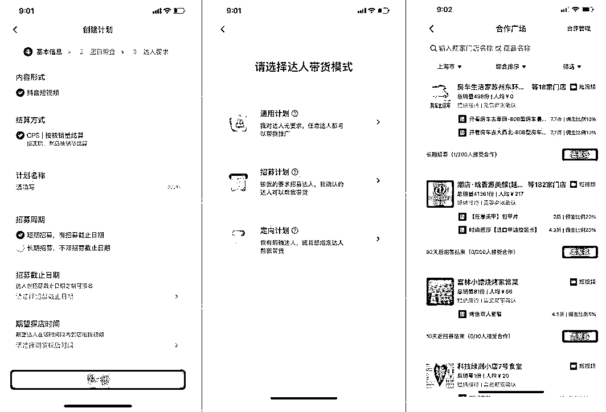

第二步：确认和达人的合作方式

团购达人是有分佣机制的，这样就大大降低一口价成本为效果付费。

所以千万不要只是上架个团购商品就完了，一定要去设置佣金，这样你才能更好的更低成本的去和达人谈合作，你才会有自来水达人帮你免费推广，并不是非要投入很多资金才能做起来这个事的。达人合作市面上目前模式主要有三种：

第三步：达人怎么拍每个达人都要让他突出你那个最核心的亮点，最核心的卖点。

别的不用他拍，就拍那个最核心的，比如你的拿手菜，或者你的金牌服务，或者你店里的一个必须要做的活动。所有达人都放大这个东西。

第四步：投 Dou+

我给大家分享一个我花了几十万投 Dou+ 投出的经验：如果你有 1000 块钱的预算投 Dou+ 的话，你不要一把 All in 进去。最好在同一时间段，同时投 5 笔 200，要比一次性投 1000 元，效果提高 20% 到 30%。

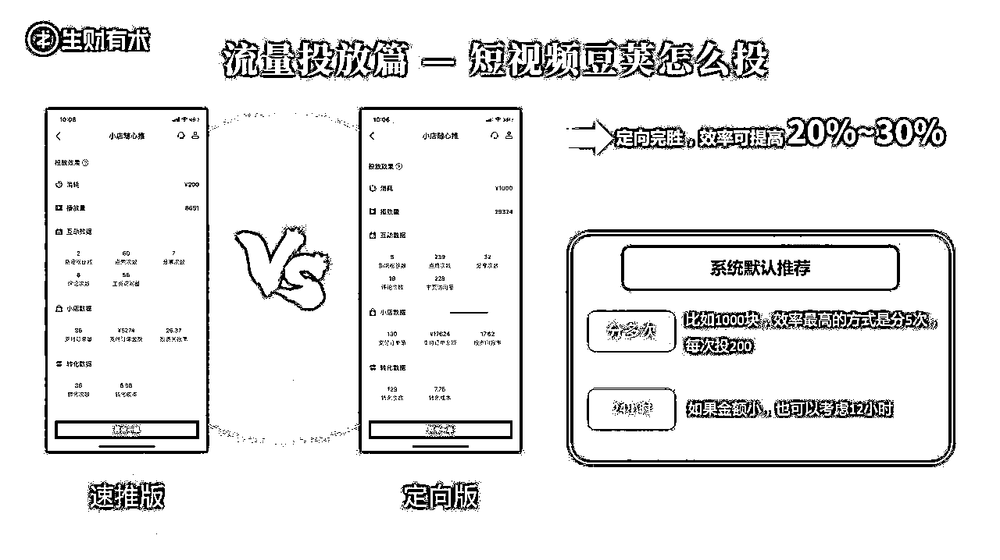

另外提供圈友 @宋威的投流方法供你参考：我一开始和达人合作的方式基本全是第三种置换模式。通过给达人提供 80 元代金券采买产品 + 10% 的分佣比例 + 到达 1 万播放的达人投 100 Dou+，到 5 万播放的时候追投 100 Dou+。这两个 Dou+ 的核心目的是追涨，卡在 1 - 10 万流量吃中间助力上 10 万流量池。

DOU+ 投放有几个选项，直接选择门店点击即可，效果最好，然后范围选择门店 6 公里内，性别和年龄根据自己的用户画像选择就好。这样做的目的是能大大降低推广成本和提高推广效果。

#### 3.1.3.2 关键二：计算 ROI ，不断放大展现效果

找探店达人，他到你店里拍视频仅仅是你万里长征的第一步。接下来要干嘛呢？

去看他发的这条视频到底有多少播放量？

到底有多少人通过这条视频领了店铺优惠券？

到底领了这些优惠券的人有多少人到店内核销？

算出这样的一个比例，也就是我们俗称的转化率。

如果转化率足够高，你的客单价又足够高，你就应该算出 ROI 了。什么叫做 ROI 呢？就是投入产出比。

比如说，今天我卖一个 99 元的套餐就能挣 30 元钱。你找了一个达人去拍了条视频，这个达人给你 5000 播放量，有 300 人领券，其中有 100 人真的到店内核销了，也就是说这条视频转化了 100 人，每个人能挣 30 元，那你挣的是 3000 元。

也就是说你每投 100 元钱的 Dou+ 能换回 3000 元。那最应该干嘛呢？ 应该投 1000 块钱 Dou+ ，换回 3 万，投 1 万块钱 Dou+ ，换回 30 万。这是一个算术题。

所以找达人去你店里，仅仅是你去做同城号万里长征的第一步。如果不关注后续的数据，那就是一个天天被各种白吃白喝的人白嫖的一个老板了，你说对吗？

大家可以看看下面这个图，这个老板怎么说的，他跟这个达人的对话被我截下来了老板说：你这条视频的自然流量，如果停了的话跟我说一下，我帮你投 Dou+ 。

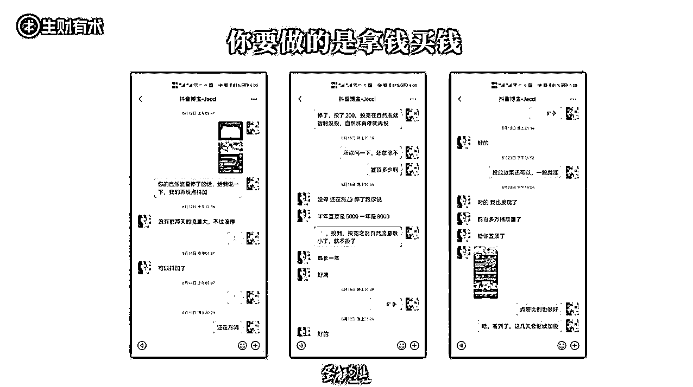

所以说你找一个 500 万粉丝的账号去探店，比如说找 2000 万粉丝的 「大 LOGO」，他探你一回店可能 20 万起步，还不包播放量对不对？ 但是如果他效果不好，你 20 万就白花了。

#### 3.1.3.3 进阶：同城团购达人直播

这个渠道在我看来也是一个巨大的发力点，就和电商商家一样，你可以让全网的达人直播带你的品和达人探店合作一样，还是上面提到的那几种合作模式。

另外就是这个赛道如果想做专场直播的话，感觉更适合连锁品牌，因为门店数量多受众更广，中小商户可能能做的就是各种本地的拼场直播了，这个目前抖音官方会撮合，设置好你给达人准备的直播品上报给官方，官方组局安排本地的一些达人直播。

内容来源：《如何通过抖音同城号，把自己的门店打造成网红店？》、《虎头局抖音本地生活从 0 到 1 半年做到 3000 万 GMV 实操分享》

### 3.1.4 如何在小红书引流

💡

小节概要和抖音平台一样，小红书平台也分为自己做账号以及和达人合作两种方式。有些行业的目标人群，在小红书上更为贴切，比如艺术体验门店、露营、民宿、个护产康等等，那么小红书平台就可以作为主要的发力场。

除了自己做账号和达人合作相关的内容，我们还整理了一些在小红书引流的注意事项，一起来看看吧。

#### 3.1.4.1 如何通过做自有账号引流 @怡伶 78667 @Nico 酱

从去年 10 月运营艺术体验门店到现在，我的小红书个人号也就 700 粉，询单爆发时才 500 粉不到。目前 90% 门店客源都来自于小红书，其中不乏单价 1W+、2W + 的企业单。

我的闭环设计很简单：从小红书等公域引流到私域，客户在微信预约后到线下店后消费成交。小红书客户基本都很精准，来一个成交一个，私域没有过多维护，我甚至连朋友圈都没咋发。

生财里教大家怎么注册账号、定位、设计主页、私域维护的分享已经很多了，我就不班门弄斧。这部分我主要想聊聊我对小红书内容种草引流的思考，有成功经验也有雷区踩坑。

先分享我亲自实战过，非常有效的种草笔记写作经验吧。我把主营业务优化为 Tufting 类目后，主要发了两类引流种草笔记：个人引流名片

案例作品种草笔记

这两种都给我的账号、门店带来了不错的曝光，也吸引到了超多精准成交的目标客户，是高转化种草笔记。实战营同学测试过的，基本都出了效果，适用于很多类目。因此我觉得值得分享下经验。

我的评论区词云图（高频词：预约）：

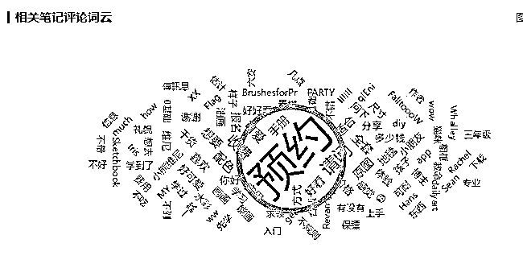

引流方法一：置顶个人引流名片的笔记

置顶个人名片是我写的第一篇 Tufting 笔记，也是询单、客户预约最多的一篇。在小红书里搜索「上海 Tufting」或「Tufting 上海」这篇基本都排在前十名（每个人的搜索呈现结果不一，会有些偏差）。引流名片笔记，是软性植入自家产品或服务的「神器」。那这类笔记怎么写呢？

我分两部分说：「笔记类型」+「写作技巧」。

从笔记类型来看，引流名片主要包含故事经历型、硬广介绍型和伪真实体验型三种。

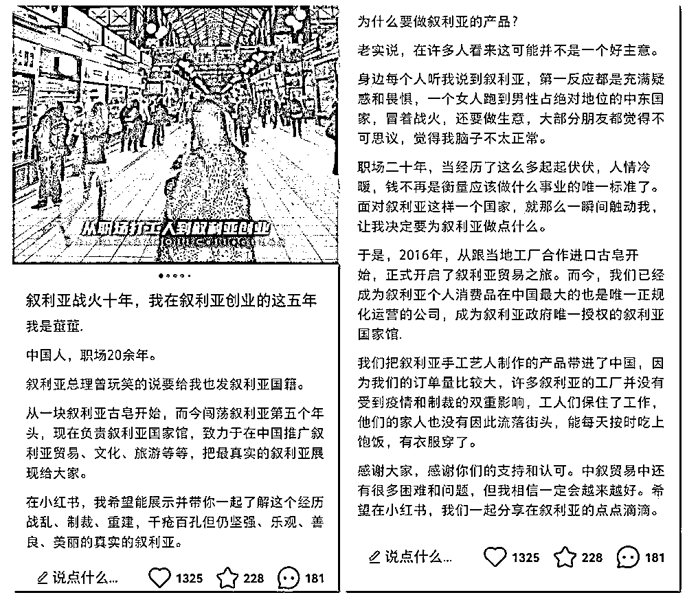

真实体验型：一开始写得比较硬广，后面做了优化调整，模仿常见的探店笔记写了一篇置顶到主页，直接放了门店地址都没被系统判导流违规。如果你也有店，可以试试这种伪探店口吻；如果没有也可以模仿下素人体验口吻，有时候系统还真识别不出来你在打广告，非常好用。

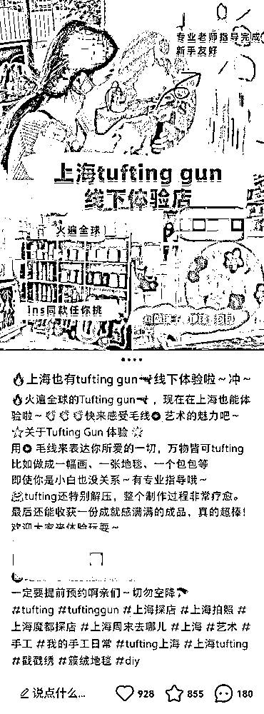

硬广介绍型：简单粗暴介绍自己是谁，提供什么产品服务，什么流程、理念等等，偏硬广一些。这种更适合企业号，个人号写不好的话可能踩雷违规。

这 3 种你们可根据自身情况测试，将笔记一直置顶在主页（发布 20 篇笔记即可解锁置顶功能）。

我这篇笔记的互动数据都源于自然流量，因此下面询单比较多。如果前期互动不够好的话，可以人工控制冷启动，错开布局「怎么联系」「怎么预约」「店在哪」等询单型的评论，会有不错的效果。每个新用户过来第一眼就能看到你的自我介绍和下方评论，有需求自然会来询单。

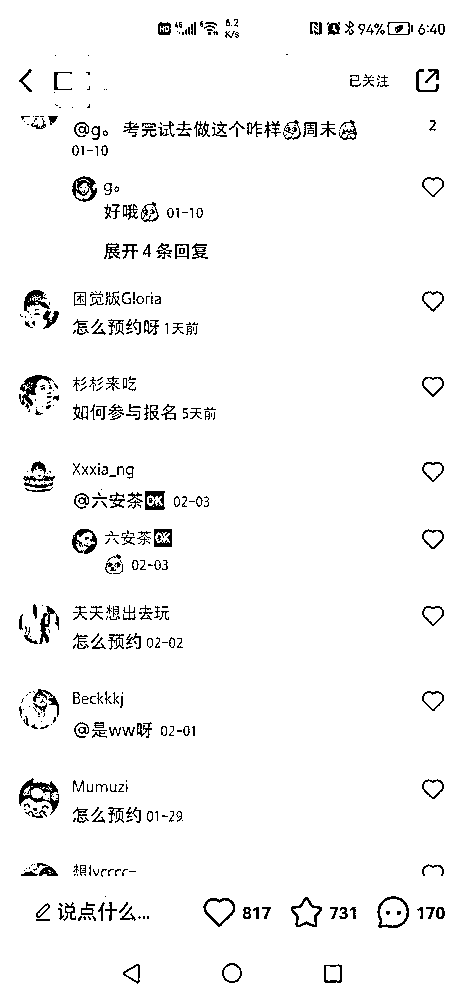

写作技巧方面主要是图片和文字：图片只要跟你的工作、产品或服务有关的就可以，最好能真人出镜，不想露脸就侧脸或者真实场景露出也可以。

文字部分没啥技巧，用大白话就成，就那种我跟你聊天的感觉，越接地气，小红书用户戒备心就越弱，更愿意来询单。

引流方法二：案例作品种草笔记对于定制、客定、设计类商家 IP 来说，少不了要用到客户作品来做种草的。比如我肯定要发客户的 Tufting 成品才能吸引到对这个体验感兴趣的目标人群。

但这里就容易遇到两个问题：很容易把案例作品种草写出干巴巴的硬广，对个人号来说效果不是那么好。

爆款种草笔记大多是素人体验口吻，商家也不好一直说是自己来亲自体验的，角色切换有难度。

调研了比较多做得不错的企业号和商家个人号后，再结合自己实战，我觉得可以这么解决：

第一，大大方方告诉用户你就是老板，从老板的角度描述客户来体验的过程，描述他们的作品；或者打造一个公司 / 工作室里的员工人设也可以。

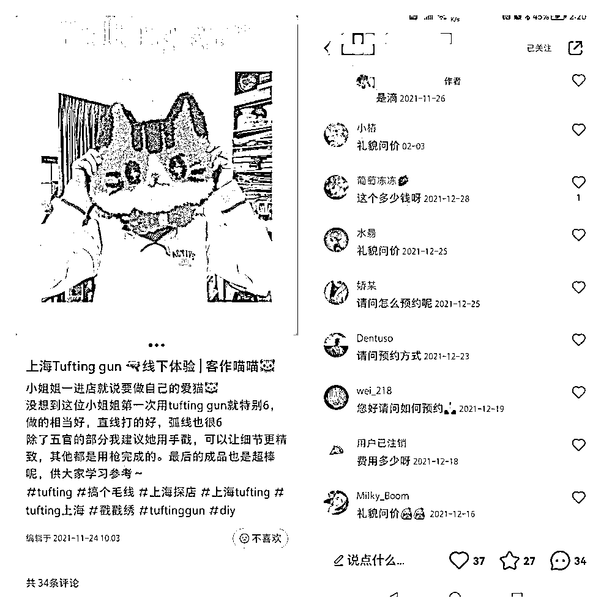

比如小浔溪这篇，就是踢脚线工厂打工妹的角色（又爆又精准的代表）：

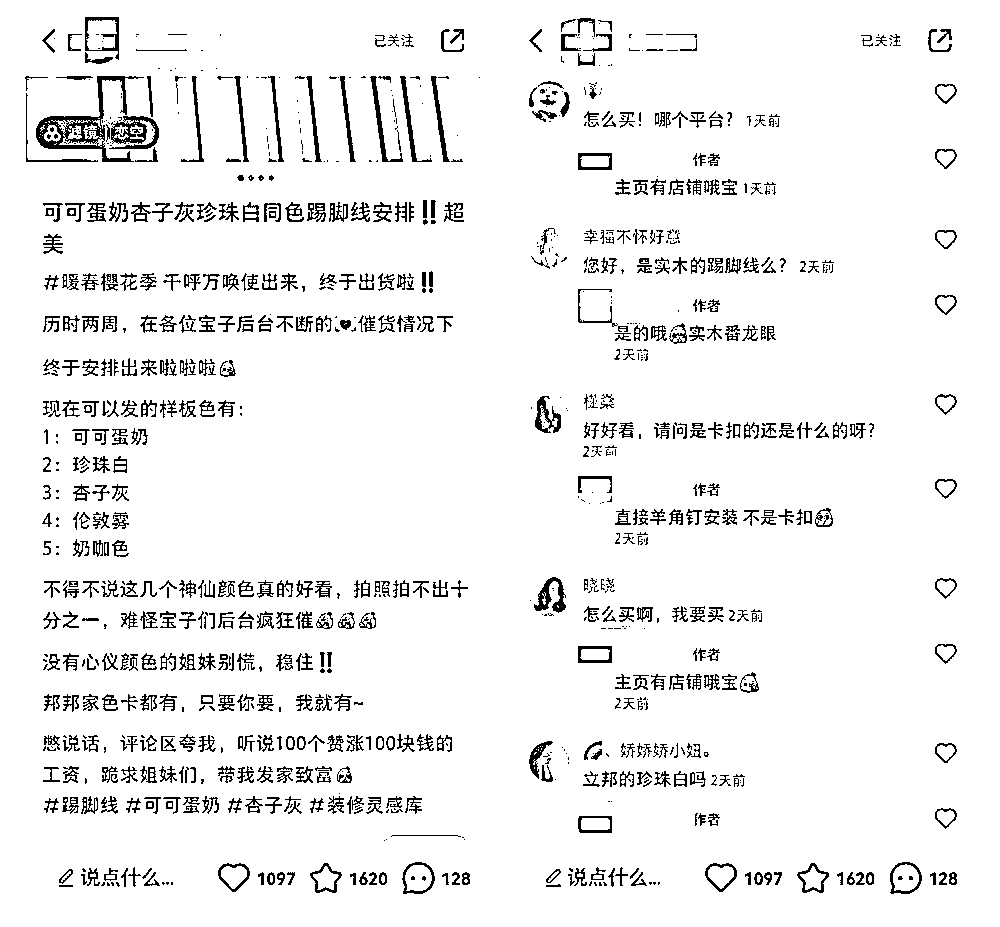

第二，无论是老板还是员工视角，口吻也要聊天式，街坊邻居唠嗑的感觉。文字内容不用太长，语气可以适当俏皮一点。举两个例子给你们感受下：生硬种草：冬日上新 这款实木餐桌真的很值得买买买

聊天种草：客户全家都夸爆的实木餐桌！姐妹们快给我冲！

种草笔记的口吻真的挺重要的，就算明说你是企业、老板，只要够接地气，用户还是不会太反感，反而可能会因为你的「可爱」「真实」「坦率」而种草你家产品。

另外以下几种小红书引流方法也可以参考：引流方法三：利用个性签名引流，在小红书个性签名处留微博进行跳转引流。

引流方法四：评论区剧本式引流，举个例子当时我发布了一条美业门店资料的笔记，我安排了几个小号到评论区回复：求分享，求完整的电子版等类似的话术，造成从众效应。

引流方法五：私信引流自动回复，相同的内容不能超过 3 次，需要提前准备带联系方式的图片。

引流方法六：笔记收藏式引流，用小号发布一些带联系方式的笔记，用大号进行收藏，这样别人在看大号信息时就可以看到联系方式。

引流方法七：小红书名字设置成微信号引流，这是所有方法中效率最高的引流方式，客户咨询时直接回复“看我名字”。

种草笔记的其他注意事项

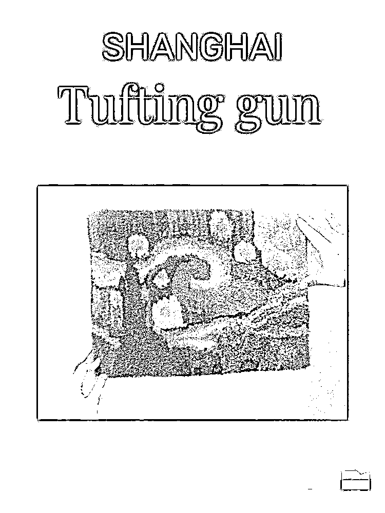

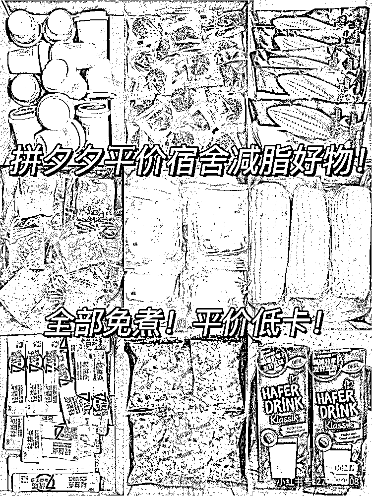

美好精致型（左）接地气型（右）

首图制作推荐美图秀秀、黄油相机，有比较多好看的文字和贴纸。稿定设计也有现场的小红书模板，很适合新手。

首先你要挖掘到自己行业的高流量产品关键词。在小红书搜索关键词如「画画」，看到图中画圈位置出现了很多相关关键词，从中找到适合你的去添加在你日常文案中。继续往下滑，就可以看到这个画圈位置出现了更多细分关键词，也可以参考使用。

在同行对标帐号里收集，他们的爆款文案中有哪些关键词，你也用小本本记下来。

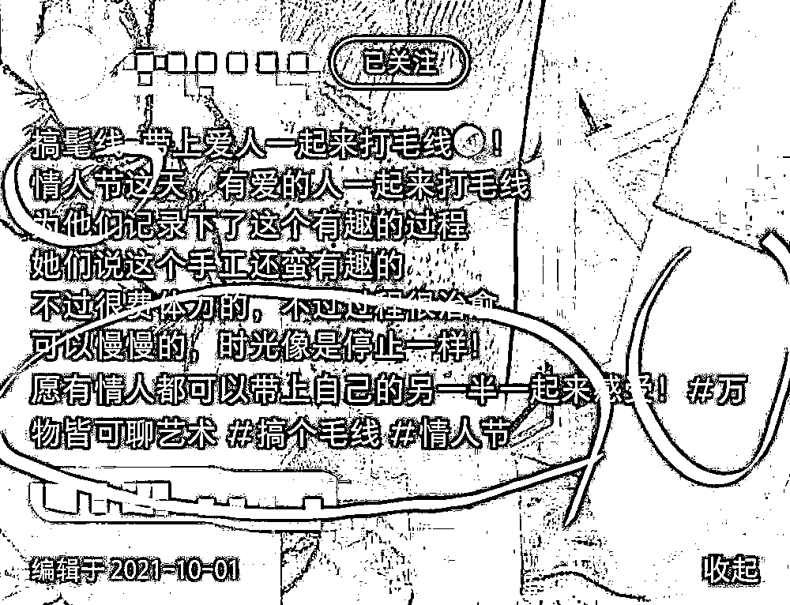

看企业号的关键词投放、买量、搜索情况。这个专属功能还挺好使的，我刚升级了企业号，回头有新的经验总结再分享出来。

收集完就可以开始铺词。我一般会在笔记标题、正文、末尾都打上关键词，尤其是本地关键词（比如上海 Tufting）。

标题中加入“地名＋领域的精准行业关键词”。加入地名的好处，是可以获得到本地的同城流量。本身小红书就是算法的平台，和粉丝体量多少没有多大的关系。只要首图封面做的好，点赞互动数量，有一定的基础。那么当用户在搜索的时候，系统就会通过，搜索的关键词在推荐优质的笔记。

起号阶段最好是泛词 + 精准词组合放。泛词是指更大众一点的热词，比如探店、上海探店、周末探店；而精准词跟你的产品细分词有关，比如 Tufting、上海 Tufting、戳戳绣。

刚开始我就只放精准词，其实流量一般般。但加上泛词的强曝光，整体效果就不一样了。当然，前提还是你的笔记内容要吸引用户。这个玩法用在大众点评上也吃香，如果有在做大众点评的老板，可以把店铺名 + 团购都加上关键词试一试。

另外，圈友 @温州土老板 也在星球里分享了 10 大传统行业在小红书引流获客的模板，包括家政、茶叶、二奢、培训、服装、零食等等领域，感兴趣的话也可以来看看，拓展一下思路：《小红书 10 大行业，引流获客模板》

内容来源：《千粉不到月入 10W ，我如何通过小红书救回濒临倒闭的艺术体验门店？》、《200 家日式皮肤管理加盟店背后，我是怎么把美业生意和互联网运营结合的》

#### 3.1.4.2 与本地达人合作引流 @Mage

我是做轰趴别墅的，会在小红书找本地探店达人置换，免费请他们过来玩，要求就是帮我在小红书发一篇帖子。

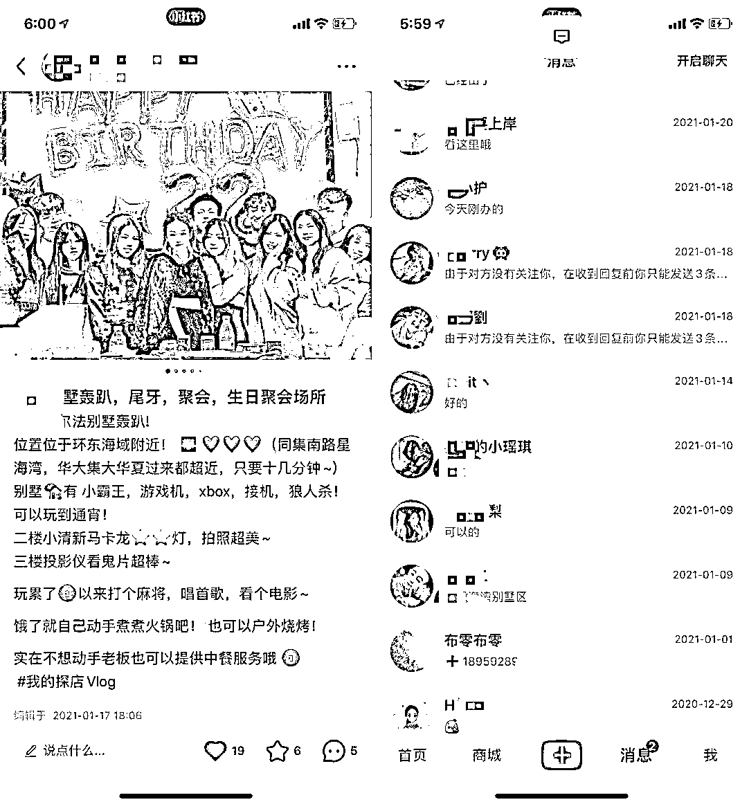

小红书置换的流程

第二，看这个置换的达人发的是否是这个城市相关的吃喝玩乐，如果发的都是美妆 / 护肤类，这种就是泛粉，当地城市的精准粉丝较少。

第三，看这个达人的拍照和文案功底，起码看起来如果我刷到是有兴趣点进去看的，而不是过于随手拍类型。

第四，这是最重要的一步，看粉赞比，一般 5000 粉至少要达到 10W 以上的获赞和收藏，这样的达人就算比较优质（比例大致是「粉丝：获赞与收藏」在 1 : 20 以上）

2\. 接下来就是打招呼的过程。一般我会说：哈喽博主你好，关注你很久了，我这边是位于 XX 地区的 XX 别墅轰趴馆，觉得你在小红书上发表的内容和拍的照片都不错，想诚邀你和你的朋友到我们这边体验一下，不收费～要求就是你帮我们在小红书上写一篇文章帮我家宣传一下哈～～～这样拿着账号批量去和小红书的达人打招呼，在有意向的博主回复之后，就把场地的照片位置和可以体验的时间发过去，再就是加上微信等他们过来探店。一般发 10 个博主会有 3 - 4 个同意，最后会过来的有 1 - 2 个，其他的可能说没时间，或者等下次朋友过生日等。

在达人来到门店的时候，我会做一个横幅，欢迎 XXX 前来探店，成本就是 10 元，虽然是一个简单的操作，但达人到了之后会有完全不一样的感觉，打心里会觉得这个商家很尊重我，我一定要好好帮它拍照宣传一下。

内容来源：《从亏损 8000 到盈收 3W+，轰趴别墅通过精细化运营实现转介绍率 70%》

#### 3.1.4.3 小红书引流注意事项 @怡伶 78667

踩坑一：盲目追逐爆款

初期我做油画体验那会，其实在小红书写了好几篇爆款笔记，都是干货分享为主，比如绘画接单 App 大合集、油画棒选购攻略、绘画教程等等。

互动数据不错，1 篇千赞、1 篇 800 赞。但这类笔记吸引过来的都是白嫖党或者来交流的，都不是来我这消费的，基本没有意

虽然我也能留钩子引流到私域，但很像广撒网，不那么精准，种草转化路径比较长。后面我改成写 Tufting 种草笔记，互动量爆款不多，但询单成单立马激增。

因此，做产品种草的没必要盲目追逐爆款，精准转化更重要。在选题、选笔记类型的时候，就要思考清楚，用户看到这篇笔记后会采取什么操作，来交流还是来询单消费。

踩坑二：缺乏闭环思维

小红书等公域引流只是一种流量获取手段，但能不能成交还是取决于你产品或服务本身的质量。

比如我一开始做的油画体验，早就身处红海，同行恶意低价竞争激烈，而且我也没差异化优势。就算客户通过小红书引流过来，也基本不会成交。当时，我还把重心放在内容优化上，但实际上是整个闭环有问题，尤其是变现端。产品本身不行，内容做得再好也是白费力气。

因此我觉得做任何平台的 IP，都要有闭环思维，在运营过程中审视和优化调整「定位 - 内容 - 引流 - 变现」每个环节。它真的是环环相扣的，错一环满盘皆输。

内容来源：《千粉不到月入 10W ，我如何通过小红书救回濒临倒闭的艺术体验门店？》

## 3.2 如何在团购平台引流

💡

小节概要

无论是平时搜索门店，还是看到视频推荐后找评价，很多用户会到这两个平台上了解商家信息，辅助判断自己要不要去消费。所以不管有没有做抖音、小红书，大众点评和美团这两个本地生活平台，都是大部分实体商家都会选择入驻的。

在这一节我们会根据流程进行讲解：

✅ 平台如何入驻及注意事项

✅ 商家账号如何搭建

✅ 商品团单如何设计✅ 如何通过运营提升权重，拿到金牌，提升店铺星级以及进入榜单

如果你服务的商家还没有入驻大众点评，这节一定要看看。

### 3.2.1 如何入驻团购平台 @封伟-自动化变现 @Mage @芷蓝

美团 / 大众入驻收费是根据所在行业城市来评定的，我当时入驻是 7800 / 年，另外加了 3000 元推广通，就是 10800。推广通就是直通车，在美团上成交也是要抽佣的，一般都是直接引流到微信上进行成交。

大众点评入驻流程：

1、进入大众点评我的页面里；

2、点击 “合作 / 入驻”；

3、选择入驻大众点评形式；

4、再点击 “立即开店”。

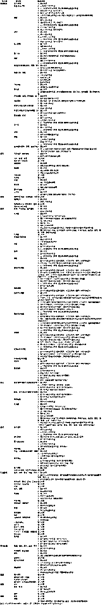

2、有哪些行业不可入驻？

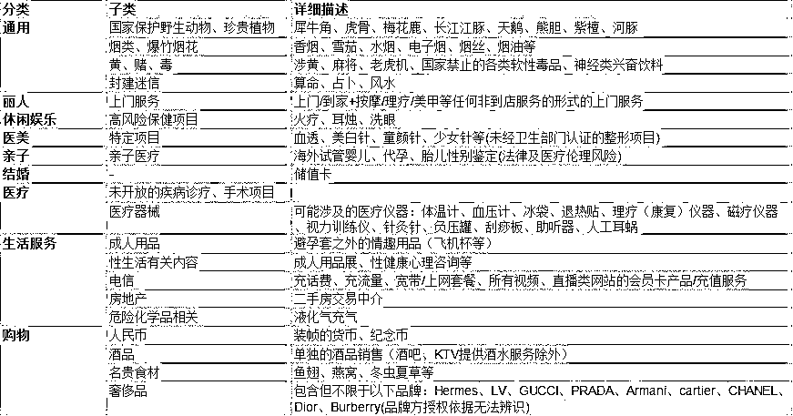

美团 / 大众入驻以后，是可以直接发手机号或微信号引流的，虽然平台会提示不要使用第三方交易，但基本没什么问题。

如果是做民宿，酒店等行业，途家 / 小猪民宿 / 爱彼迎这些平台入驻也很简单，提供租房合同和基本信息就可以，这些平台统一扣点也是 10%，有时候一单 3000 元的单子就要抽 300，还是很多的。

这几个平台是不能发微信和电话号码的，审核比较严格，被查到会进行罚款处理，不管你这一单是否成交都是一次罚款 50，严重的可能会降权，为了规避平台的检测，也试过各种稀奇古怪的方式给客户发联系方式。这一种被查出的概率会比较低：我们地址是在 135 街道 660 路 138 号 XXX，类似这样，把微信 / 电话掺杂在里面，也会检测到，但概率比较低。

除了美团和抖音，说一个免费的，支付宝口碑，好处在于开通后会同步到高德地图，可以在高德上直接付费。类似的还有飞猪同程等也会同步到高德，做酒店住宿的不要放过，其他的业态也可以去高德上搜搜。

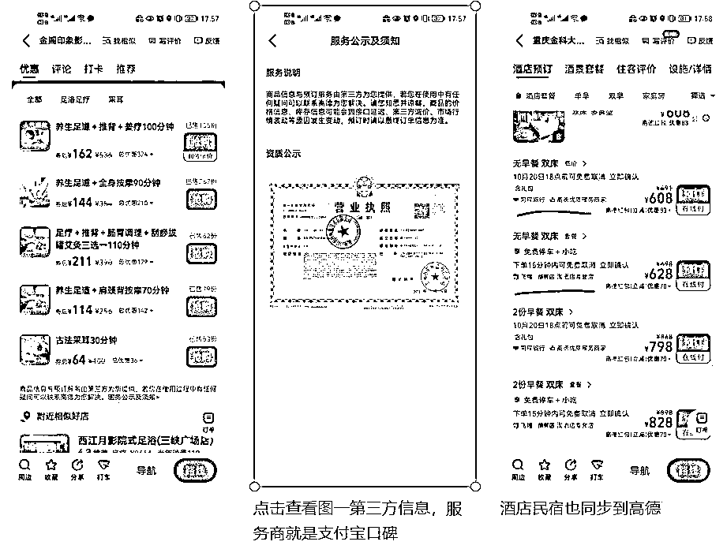

内容来源：《从亏损 8000 到盈收 3W+，轰趴别墅通过精细化运营实现转介绍率 70%》、《实体店如何有效互联网化，90%的老板容易忽略的细节》、《门店私域运营 | 小航海学习手册》

### 3.2.2 如何搭建账号 @米菲

门店基础信息的搭建，包含店铺名称、地址、头图、标签等。

店铺名称大家可以参考这个公式：品牌 / 店面＋产品＋商圈。比如我的店面叫：MY＋空中别墅轰趴馆生日团建聚会＋乐汇城店

这样做的好处是：

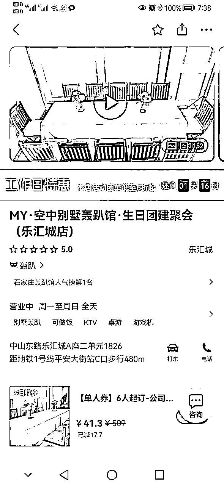

内容来源：《如何让店铺在美团运营上进入榜单、拿到金牌》

### 3.2.3 如何布局平台挂载商品 @米菲 @温州土老板

我们进行团单设计之前，首先要通过美团点评对周边的竞争对手进行分析。

美团的商圈是这样划分的：某城市-某行政区-某商圈。由于我们轰趴品类较小，因此同城的竞对数据都要看，如果只做区域生意，商家数量多的话，可以只选择某个行政区或者某商圈。

我们可以根据销量/人气优先的顺序，挑选 5-10 个竞对。分析竞对有几个维度：

半年的销量里分别是多少？

有销量的团单是什么样的套餐内容？

有没有拿到金银铜牌？

有没有进入榜单？

评价积累有多少？

店铺星级多少？

我们再根据自身情况设置保本团单、限时限量低价团单、主打团单。

另外我们需要站在用户的角度，设计出能让他们接受的价格体系，想办法做到第一次触达。接下来以一个摄影门店为例，分析如何以用户思维进行团单设计：先看他们的设置的价格表：

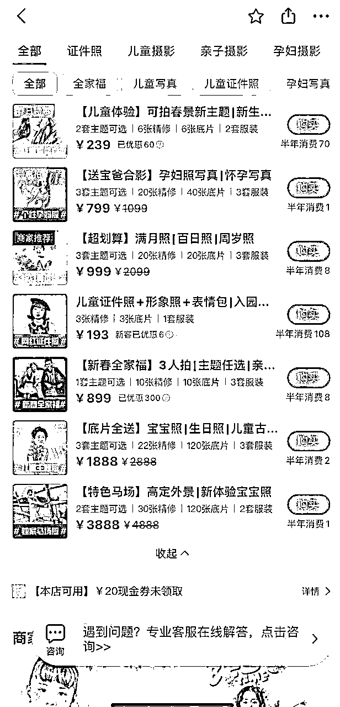

我们来简单分析下他们的价格体系，对于一款产品，多数都是只有 3 层：1\. 引流款【量大，不赚钱】，儿童体验 239 元；儿童证件＋形象照＋表情包 193 元

2\. 利润款【量中，挺赚钱】 ，送宝爸合影 799 元；超划算 999 元；新春全家福 899 元。还有一个不在图片中的额外加照片另付费套餐

3\. 锚点款【量小，很赚钱】，底片全送 1888 元，特色马场 3888 元。

所有正常的商家，在做用户第一次触达的时候，其实基本都是靠的引流款，因为用户没有体验过，哪怕是他真的有消费能力。那么大概率只会先选择引流款和利润款，不会上来就选择锚点款。

然后等到店之后，商家会根据顾客的情况，进行推荐和调整，有部分顾客会从引流款转向利润款，比如替换套餐或者额外加照片。

内容来源：《如何让店铺在美团运营上进入榜单、拿到金牌》、《小红书 300 粉丝的账号，如果让开在郊区，1000 平儿童摄影，爆满？》

### 3.2.4 如何获得更多的平台流量

#### 3.2.4.1 免费玩法 @米菲

玩法一：报名活动

在美团上报名平台的免费活动，获取更多的流量入口。

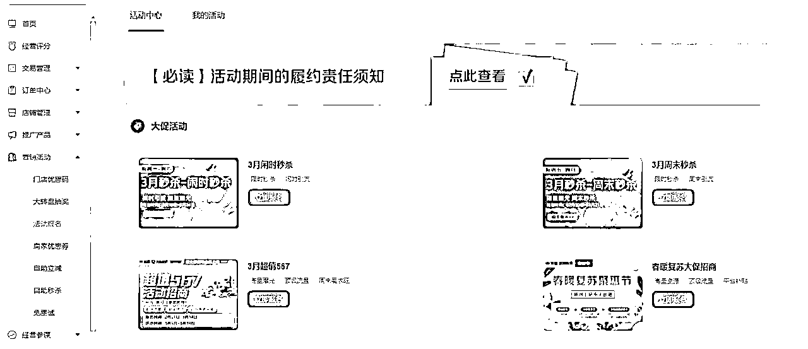

玩法二：发笔记在大众点评发布笔记，可模仿小红书的种草笔记风格，增加曝光量。

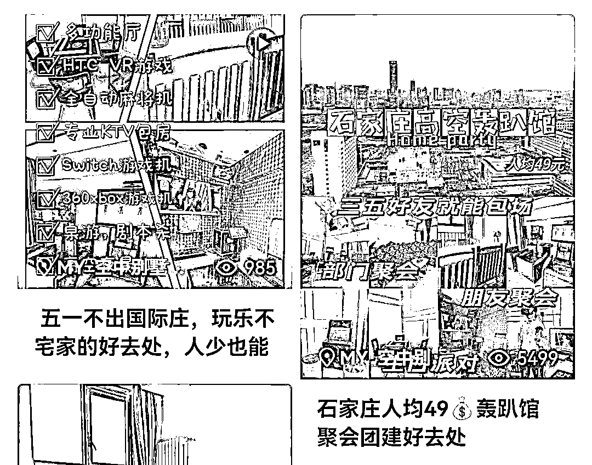

玩法三：封面装修

注重入口图和头图的装修，提升客户兴趣，增加浏览时长。

店铺入口图：展示在店铺列表页，入口图直接影响到进店率。优质的店铺入口图能够吸引用户点击进入店铺。

【品牌店铺】

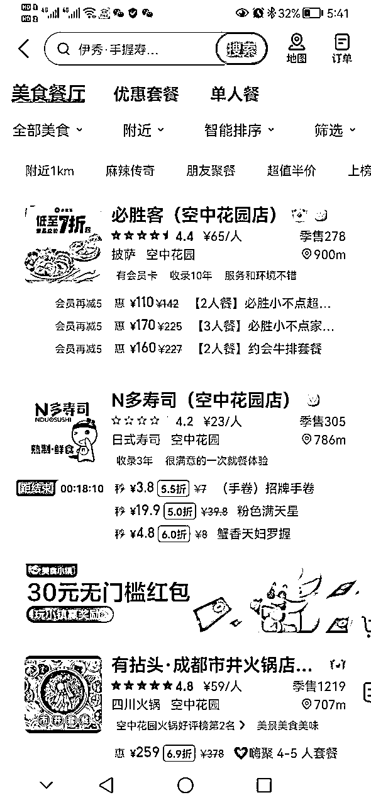

【普通门店】可以用：

1.活动图，例如女神节活动、春季活动，折扣活动等，上图中必胜客低至七折。

店铺头图：头图展示在店铺顶部

客户点击进店之后，第一眼看到的就是店铺的头图，可以放五张

头图可以展示：店铺头图：头图展示在店铺顶部客户点击进店之后，第一眼看到的就是店铺的头图，可以放五张头图可以展示：玩法四：进入榜单排名

进入榜单排名后，自然流量会更多一些，大家看到门店的几率会更大。

进入榜单排名的一个免费的方式是：鼓励进店用户打卡，收藏店铺。可以收藏赠礼，收藏店铺给予优惠等来引导收藏。

还可以在用户体验的过程中，观察或者询问客户满意度。如果客户满意度高，可以采取美团点评下单并核销，并引导客户给予真实评价（注意：不可以直接要好评）

这两个动作将会影响商家在人气榜和热销榜的排名，排名更高，自然流量的分配相应的也会更多。

内容来源：《如何让店铺在美团运营上进入榜单、拿到金牌》

#### 3.2.4.2 付费玩法 @hp @米菲

关于线上门店的运营策略我们理解的其实很简单，无非以下几个点：

1、提高门店的曝光人数；2、提高曝光到点击的点击率；

3、提高点击后用户的意向率。

每个点再去做细致的延伸，从而知道我们具体该优化店铺的哪一个小版块。后面我们再根据每一个小版块看看如何来进行提升。

想要提升曝光人数，首先要知道门店具体会在哪些地方进行露出，从而根据不同的展示位置进行相应的调整。

第一步：了解展位的分类

1、搜索展位

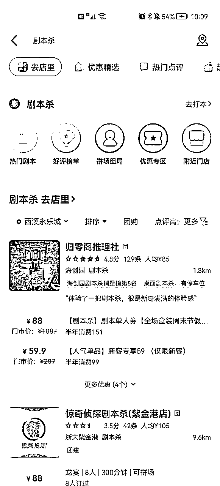

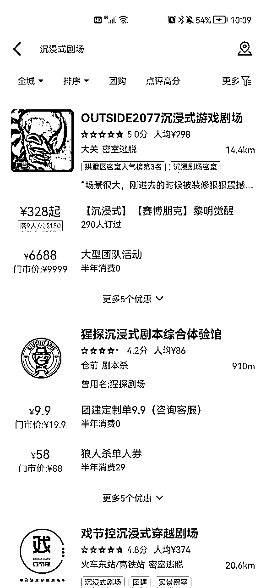

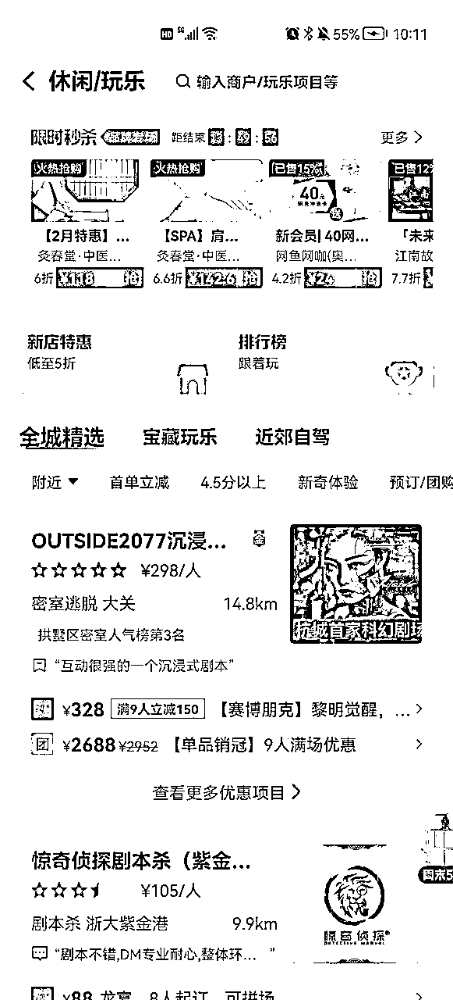

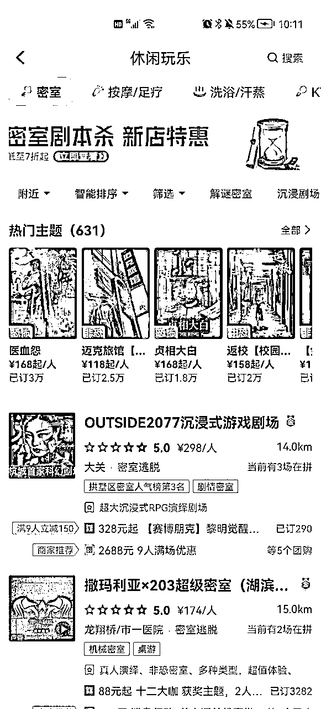

看到这里其实已经有一个基础感知了：

1、关键词的布局很重要，行业相关关键词一定要多方位布局（店名、团购套餐名称、评论热词等）

2、持续积累门店数据（评价数、星级、销量，是否有金银牌等）

3、最快且新店一定要做的方式——投放广告积累门店数据会在后面进行详细解读，这里主要先说一下投放广告。

第二步：了解如何有效开投放美团普通门店用的上的广告主要分 2 个，具体怎么去跟踪才能保证我们投放的效率和收益最大化呢？

1、推广通（搜索流量，用户目的性标签较强，后续转化率高）

2、智选展位（信息流流量，标签用户曝光，更多造势需要，图用户后期很长线的转化）

推广通投放技巧

首先要知道，推广通是按点击付费的，如果你的点击率太低，就算给钱，美团也不会给你分配流量。

逻辑其实很好理解，A 的点击率 10%，一次点击 2 块，给他 1000 次曝光，美团可以收到 200 块；B 的点击率 2%，一次点击 5 块，给他 1000 次曝光，美团可以收到 100 块，所以即使你的出价远高于同行，你也拿不到流量（此处暂不考虑其他店铺权重影响）

所以投放的头图选择就显得至关重要。品牌影响力很大的，你可以选择品牌 logo；如果影响力一般，可以把门店比较有特色的东西传递给用户，促使他进行点击。

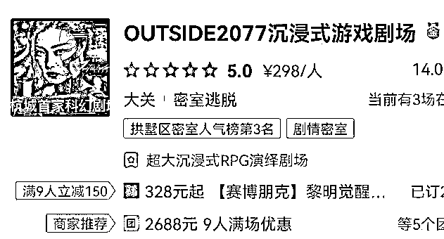

比如我们店相较于其他比如主打民国风、主打古风的店铺，我们的剧本类似其实会相对偏小众一点，属于赛博朋克未来主题，那么我们核心需要的人群肯定是对未来科技、赛博朋克氛围更感兴趣的用户。

所以在头图方面我们强调了科技感（文字+科技感人物图片），团购名称加上【赛博朋克】，同时在门店自荐版块提醒用户，我们是超大的沉浸式 RPG，强调优势大（之前为了更加强调，还用了 1600㎡这样的数字）

当然，是不是这一张图就一定最合适，当然不是，所有的素材投放前都是自嗨，只有数据跑出来才能真正决定是否要持续投放。所以我们其实是不断不停测试各种我们认为可能用户感兴趣的头图。

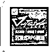

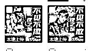

然后就是出价，千万不要出低于第 7 位以后的价格，用户看到你之前已经看到了非常多表现优异的店铺了，为什么他需要选择你呢？？

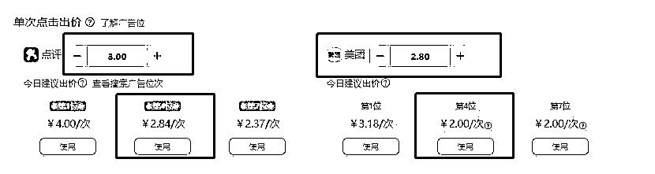

所以选择高于第 4 位是很有必要的，当然不一定需要冲第一位。同时你所出的价格并不代表实际真实每次点击的价格，可能会因为各种情况实际支出更低一点，所以不用特别纠结，只要持续跟踪好数据转化就好了。

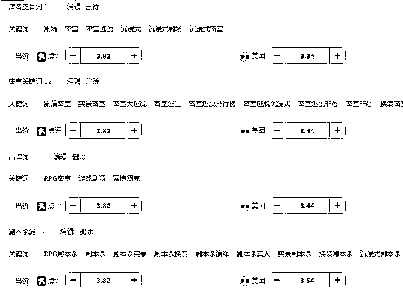

除去基础价格之外，就是关键词出价，关键词的价格一般会高于基础价很多，这里切记的是不同类型的关键词一定要分组进行设置，因为相对应类型关键词的转化率其实是不一样的，我们可以针对后期数据，针对转化率高的关键词出更高的价格，提高曝光量。

多观察数据多做分析，得出不同词下 1 块钱可以买多少商户浏览量、查看评论数等等，用表格记录下来，对后续持续降低成本有很重要的帮助。

更多设置这里建议关闭其他曝光机会，其他机会指在非美团大众的平台露出，这种流量转化率一般很低很低。

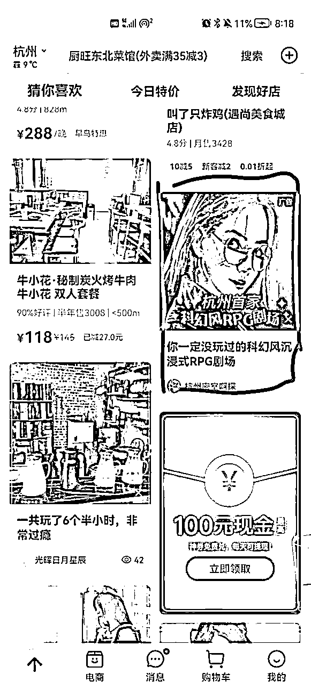

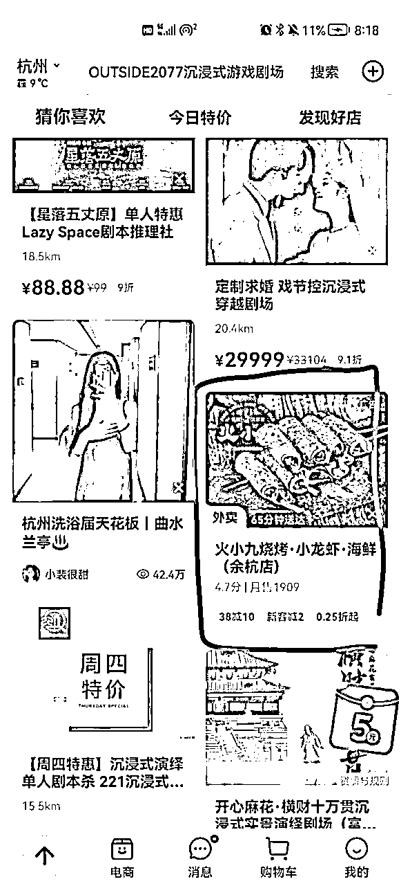

从展位的位置来看，信息流类的广告只有当你的门店满足以下 2 种情况才需要投智选

1、冲动消费的套餐（类似于目前抖音团购比较火的各种）

2、需要打造品牌影响力智选属于信息流广告，他的价格并不低，基本一个点击也是需要 1-2 块钱，相对于目的性极其明确的搜索流量来说，这里的广告就显得鸡肋了很多。所以如果你没有能够特别拿的出手的引流爆款，其实不建议开智选。

智选相对于推广通来说，可以限制的用户属性会相对更多一些，一方面也是帮助我们更好的找到目标用户。

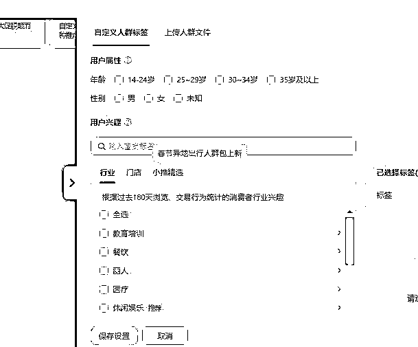

根据投放内容不同，所展示的落地页的多变性也很多。

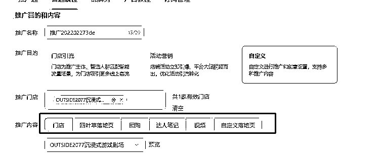

和推广通类似，头图的创意也就显得尤为重要，当然这里因为是信息流的展位，创意的可操作空间也更丰富，同时对门店本身也提高了要求，毕竟你需要不停的测试性价比最高的创意，而且当一个创意慢慢没有流量之后，还需要测试出新的可以继续跑的创意。

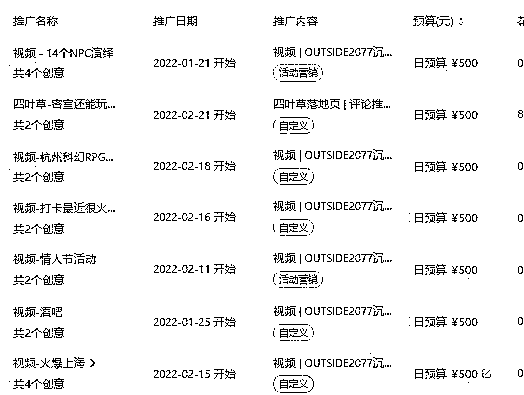

通过我们持续的优化，目前曝光量已经做到同行均值的 2 倍了，但是离同行第一还是有很大差距，这个差距不是用钱就可以解决的，需要我们在后续转化上继续持续做积累。

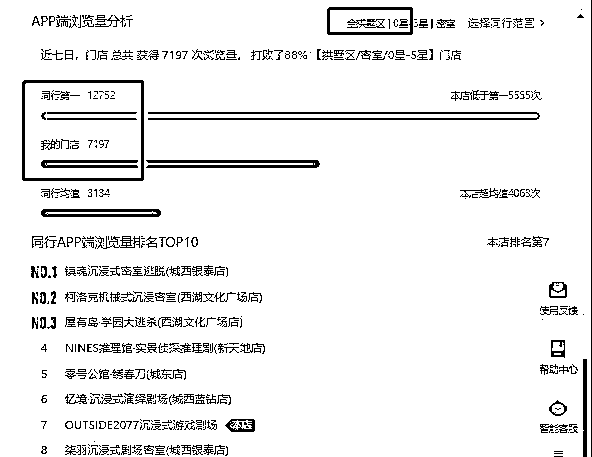

第三步：提高曝光到点击的点击率

要优化点击率，首先得搞清楚用户看到门店的同时会看到那些内容。根据位置的不同，门店列表页主要分为以下 2 种展示形式。

单图模式：

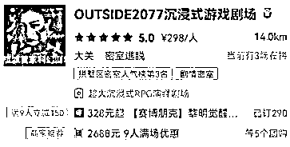

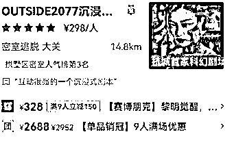

多图模式：

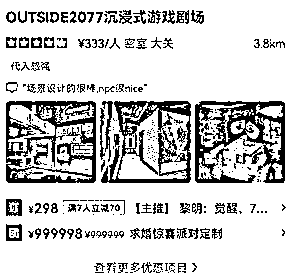

单图的部分是门店的门店图，三图的部分是门店头图的前三张。

了解了主要呈现方式，就可以得出以下几块影响用户点击的点：

1、门店星级

2、门店是否有金牌银牌铜牌

3、门店自荐语

4、系统爬取标签 5、团购名称及价格

6、距离

7、客单价

8、销量关于上述几点我们可以去优化的主要是 1-5。

1、门店星级

门店的星级仅和优质点评数挂钩，5 星好评+系统判定的优质评论对分数影响很大。所以很多代运营公司其实有很大一部分的工作是在做评论。

这里注意，一定要用户是有同类型门店搜索记录，再到门店完成交易，到门店进行核销。否则当你的点评数较多时，会触发风控，反倒有负面影响。

我们目前因为有很多达人玩家，所以达人都会要求让他们进行线上拍单并完成点评。所以门店星级分数上升的很快。

另外，引导用户在大众点评上打卡，也是一个做评论提高星级的方法。

大家都知道，引导要好评是违规的，但是打卡收藏不违规，因此我们会看到现在有很多商家都在做类似的打卡活动。打卡收藏多了，星级提升，就会被认为门店质量高。

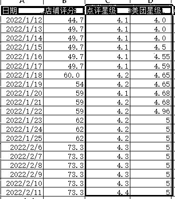

2、门店是否有金牌银牌铜牌

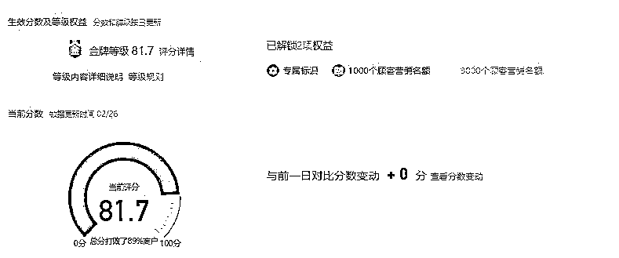

金银铜的等级其实很简单，只要你按后台要求把该设置的部分都设置好，你就可以得到最最最基础的 50 分。

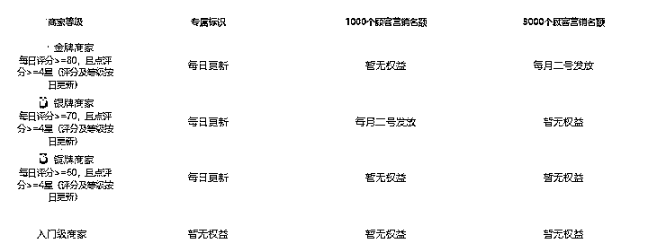

核心需求去重的是流量/交易表现这里，这里主要和交易额、门店访客数挂钩，所以你肯定马上就发现了，用户一定要线上交易，不要为了 20%的服务费转线下，其实意义不大，有时候该交的保护费还是要交的，否则平台如何判断你是优质商户并持续给你流量呢。

同时只要你一直稳定在开推广，访客部分做到 +10 分是非常容易的，所以银牌难度不大，金牌方面可能需要智选也帮忙做一下助攻。

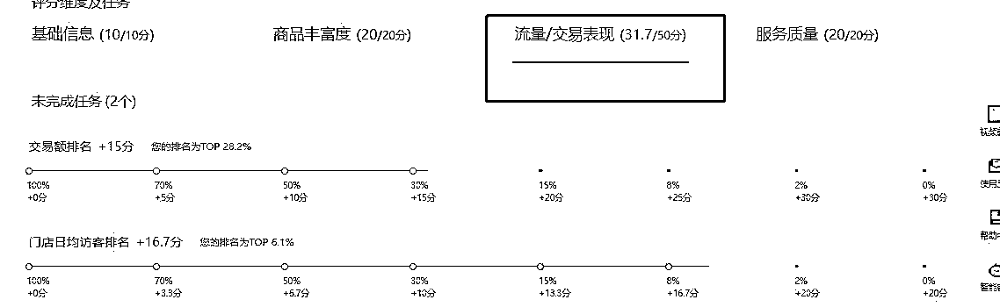

3、门店自荐语

没什么花头，找到编辑的位置，把你认为比较好的卖点写上去就行了。

4、系统爬取标签

这里其实比较难控制，当然也不是完全控制不了，如果你能够控制比较多的评论内容，那么高频出现的词汇就会被系统抓取并做好标签，显示在门店店面下面。

5、团购名称及价格名称方面【全国金奖】，【杭州首发】，【招牌】等等词汇，虽然看起来相貌平平，但是一定会给用户一点潜移默化的心理暗示，相信我，虽然王婆卖瓜自卖自夸，但是这里还是有点用的。

6、是否进入榜单美团侧休闲娱乐的榜单分为「销量榜」和「人气榜」。

销量榜是按过去 180 天商户销量排序，销量高就可以进入榜单，不涉及评价等其他条件。所以，销量榜是可以快速通过人工干预进入榜单的。

在团单设计上，可以通过增加低价团单，来冲销量。下面为大家展示两个案例：

【案例 1】增加特价饮料兑换团单，并制作醒目的 kt 版 粘在冰箱门上，鼓励用户购买，每个账号限购 3 瓶

【案例 2】设置单人体验活动，活动可以作为临时性的，等进入销量榜可以根据自身情况考虑是否下架

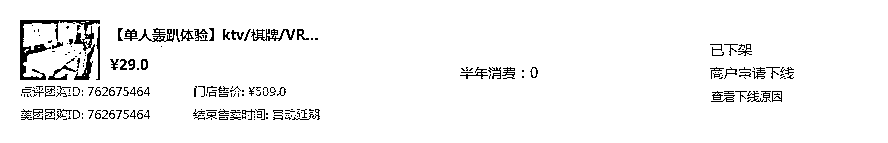

人气榜是按过去 7 天商户的人气来进行排序的，提升人气榜排名的方法，可以参考拿金牌的方法。

第四步：提高点击后用户的意向率

最后就是重中之重的部分了，曝光靠投放，点击靠头图，这些部分都是相对来说可操作范围不是特别高的部分，而真正点击后如何让用户成交，才是真正一个门店优化最最核心的部分。

用户真正关心的点其实很简单，环境如何、剧本类型是否喜欢、用户评价、在自己预期的时间段是否有已经在拼的场次（拼车）/在自己预期的时间段是否有空置的场次（车头）。

但是环境、剧本、用户评价这些基础的信息大家都做的还不错的时候（做的太差的早就被淘汰了），亮点的呈现就显得尤为重要。

漂亮的装修、不错的演绎、用户一致的好评，打开美团，前 10 家店基本上你看下来都是这样，这些点不会是我选择你的原因，如果没有只是我筛选掉你的原因。

所以在基础建设都已经做好初步完善后，最最最重要的是提炼差异点、亮点并在你的装修的各处进行强引导和曝光。

门店内的详情页描述、门店照片布置、优质评论的布局，如果只是好看，看起来不错，那么你的门店也就只是过了第一关，成为了用户备选池中的一个。真正让他做出决策完成交易的点，才是我们在页面设计中需要不停传达的东西。

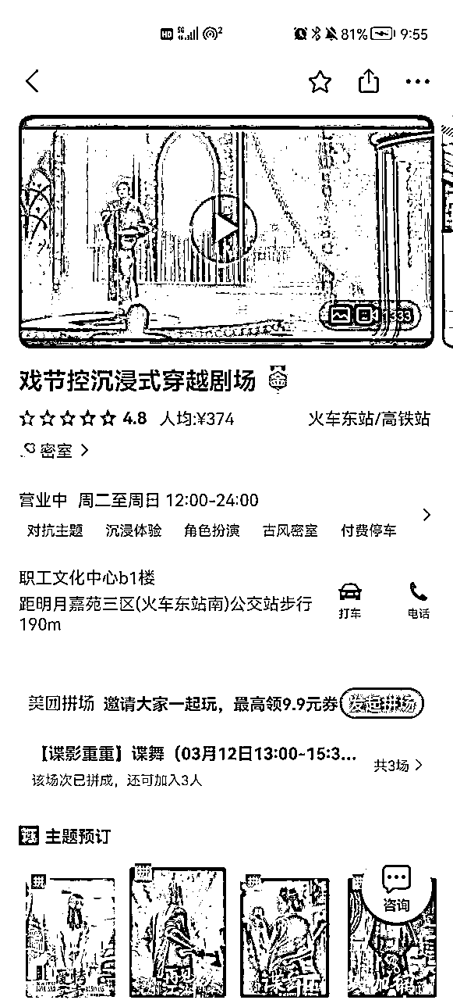

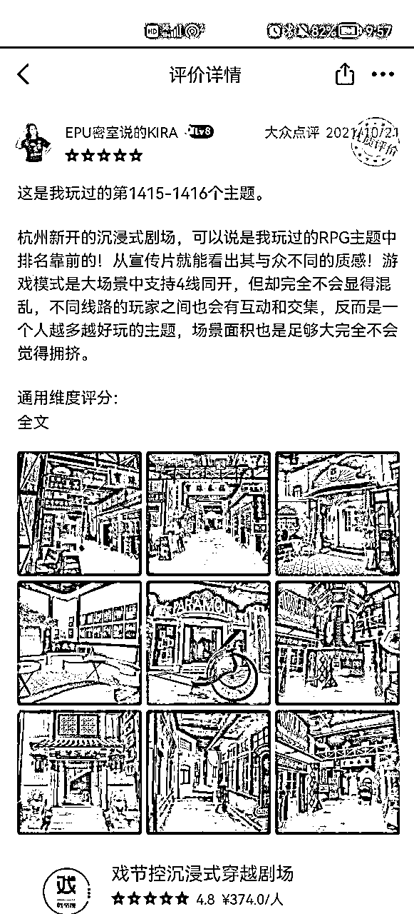

另外，圈友 @缄默 也分享了几个在大众点评上新入驻后的一般做法的要点：《大众点评与新店一般做法的简单说明》，希望可以给你一些另外的启发。

内容来源：《如何让店铺在美团运营上进入榜单、拿到金牌》、《线下门店联合经营日记（二）——美团店铺运营》

### 3.2.5 避坑点 @怡伶 78667

避坑点 1：产品套餐设置不吸引，一来就烧钱

刚开始上架的都是油画体验类产品套餐，初期访客量真心惨淡，每天只有 30-40。急病乱投医，当时我就听了大众工作人员的推荐充值开了推广通。

平均每小时烧掉不少钱，一共花了一万多，但转化率几乎都是 0，要么就是非精准用户，要么就是对我店铺产品不感兴趣。

现在自己回看，在产品套餐不吸引、店铺初期评分低的时候，烧多少钱都没用。大众它是一个帮助大家找到好吃好喝好玩好去处的平台，还提供各种优惠套餐和活动价格。大众用户主要看谁价格更低、哪家店用户好评多。

如果你上架的产品或套餐不吸引，无论做什么运营手段都可能没啥客户。

避坑点 2：重视用户好评差评的评价维护

刚才我也提到了大众用户做消费决策前会看这店评分高不高。

我一开始没怎么管这事，因为基本都在私域或到店成交，平时客户来消费也没有让他们在大众写点评的习惯。

但随着生意越来越火爆，我好多同行都来恶意做差评，大众平台还帮我拦截过几次。可评分还是明显下滑，这有点影响我店铺的形象，因此我接下来会采取运营手段做优化调整。

避坑点 3：图片过于精致反而劝退客户

小红书对艺术类的精致程度要求比较高，所以图片一定要高颜值。但大众需要的是更真实的用户体验封面，过于精致美好，别人会觉得是广告。因此，发大众的图片尽量不要修，保留真实感，文案要再软一点、更客观一些，就会有机会爆。

内容来源：《千粉不到月入 10W ，我如何通过小红书救回濒临倒闭的艺术体验门店？》

## 3.3 如何获取同城流量

### 3.3.1 如何获取线上同城流量

💡

小节概要线下门店的消费受到地域限制，主要的流量来源还是在周边或者本地，因此同城的群、活动平台等，其实可以更聚焦同城流量，都是很好的引流渠道。

这一节我们整理了常见的同城流量获取方式：✅ 客户朋友圈：从老用户的朋友圈寻找新用户

✅ 本地生活群：一般是企微群、QQ 群、豆瓣群组等，比如快递群、团购群、连锁店的群等等

✅ 本地公众号：类似杭州美食、联联周边游杭州站等

✅ 同城活动平台，比如豆瓣、QQ、本地生活团购平台等等你可以根据自己的需要，找合适的同城平台进行引流。

#### 3.3.1.1 引导客户发朋友圈 @Mage @乔合

其实很多方式获客后，最终都可以引导转发朋友圈，这也是我认为比较好的一种宣传方式，但如果强行要求客户转发，其实他们会比较抗拒。

一般会有两种情况：第一种，客户预订的时候要优惠，那这个时候就会事先谈好，比如所有人转发朋友圈 12 小时且不屏蔽就给与优惠打折，这种最直接也最省事。

第二种，我会给每场来玩的客户拍短视频记录，在最后带上我的宣传二维码。

根据运营下来的整体数据显示：

平台上的用户忠诚度不高，他们选择性比较多，私域的效果是最好的，平均复购率可达到 10 - 15%，我这里指的是二次复购，部分客人很喜欢我们的风格，自己来过 3 次以上的也有。

另外也可以找网红来店里打卡，让她们发朋友圈加定位。

内容来源：《从亏损 8000 到盈收 3W+，轰趴别墅通过精细化运营实现转介绍率 70%》、《00 后实体店创业者：用互联网思维破局疫情影响》

#### 3.3.1.2 进本地生活群宣传 @封伟-自动化变现 @乔合 @尹基跃

最多的就是企微群、QQ 群、豆瓣群组了，找到进去引流。重点说下开放式的同城微信群，可以直接找到并 100% 进群。

常见的有：银行（如招商银行）、出行平台（如高德、滴滴）、连锁门店（如瑞幸、唯品会）、本地生活（如罗森、哈罗）、商超（如沃尔玛、永辉）商场公众号、社区团购（如美团）、快递驿站、餐厅点餐码（有些会设置关注进群）、业主群等，找到符合你用户画像的社群。

如何一个码加多个群：企微群大部分用的是活码，你用多个号多次扫码会扫出不同的当地群出来，这样获得的群数量远远大于二维码数量

举例：滴滴同城群、瑞幸同城群、永辉同城群。

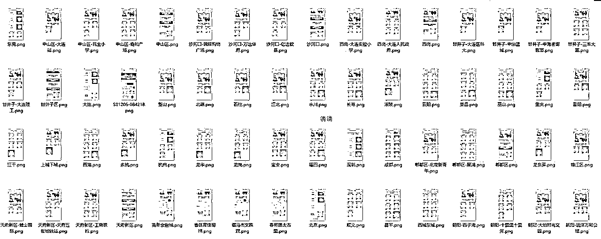

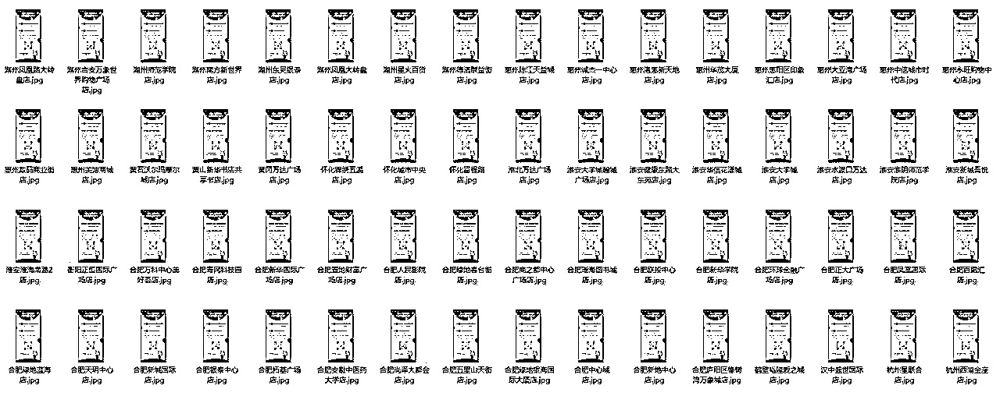

如果你的目标用户是一些年轻人，可以到本地圈子的一些年轻人的酒吧群、密室群、剧本杀群等等做了活动宣传，达到了覆盖性传播的效果。

这些群怎么进去？把本地的这些店全部玩一遍，本地玩密室和剧本杀的那些店主都会拉你进去的（打广告记得发完直接发个红包）

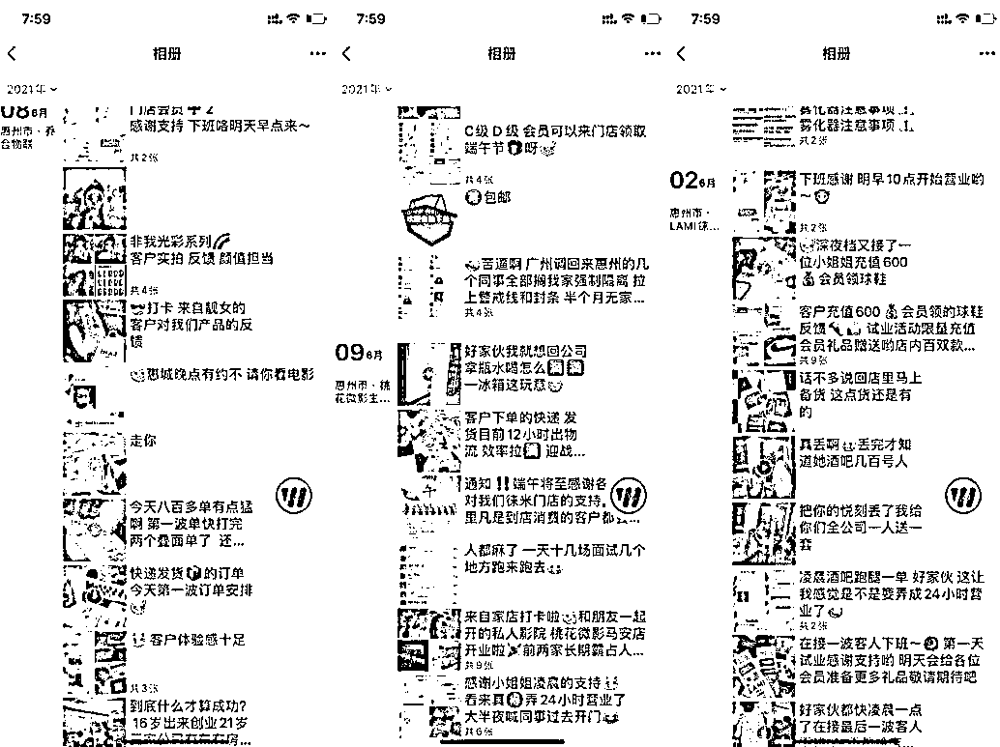

具体如何找到更多的群，以及入群后如何混群和引流，可以参考下方圈友 @尹基跃分享的《同城进群 SOP》和他在小航海时分享的《搭建门店流量池与快闪发售模式》。

同城进群 sop 2.0.pdf

内容来源：《实体店如何有效互联网化，90%的老板容易忽略的细节》、《00 后实体店创业者：用互联网思维破局疫情影响》

#### 3.3.1.3 投放本地公众号 @芷蓝

如果你是一个新店，可以利用这种方法来做冷启动。方法很简单，拿我自己的舞蹈室举例子，比如我在望京开的这家店，你就可以在微信公众号里搜索【望京】，找到几家本地的自媒体，然后看下他们每篇文章的阅读率，如果平均能在 3000 - 5000 以上，就说明粉丝质量还可以。

然后设置一个新店活动，比如说开业大礼包，199 元 = 10 节课＋新人大礼包（水杯，舞蹈鞋，速干毛巾等）。

注意事项：如果是新店启动，我不建议加入裂变机制，很有可能给你招来一批羊毛党。你需要的是快速积累第一批学员的上课素材和成功案例，然后发到大众点评上去，所以用户精准度和质量很重要。

什么是精准用户？就是那些想学习跳舞，而不是为了过来拿礼品的人。所以，千万不要搞免费领取这个玩法，一定要付费。

推广费用要看头条还是次条了，像我自己这种舞蹈室，推一次头条大概在 4500 元左右。在公众号投放的过程中，有几个需要注意的地方：

① 在和本地媒体的沟通过程中，最好要问一下之前是否为相同定位的商家做过推广？以及效果如何？最好能有数据展示，比如达到率或者后台的转化率发给你看一下。

② 和媒体方要一下公众号后台的用户画像分析，根据性别、地域等标签，判断是否适合自己的行业。

③ 投放时间尽量选择周二到周四的晚上 8 点 - 10 点 这个时间段，保证最大几率触达用户。

内容来源： 《门店私域运营 | 小航海学习手册》

#### 3.3.1.4 同城活动平台引流 @封伟-自动化变现

内容来源：《实体店如何有效互联网化，90%的老板容易忽略的细节》

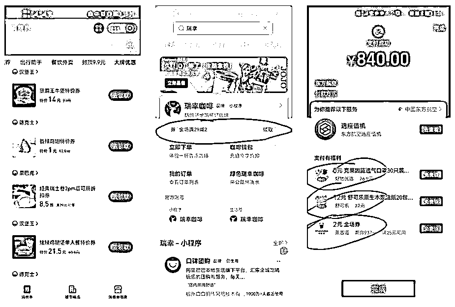

内容来源：《实体店如何有效互联网化，90%的老板容易忽略的细节》

### 3.3.2 如何获取线下同城流量

💡

小节概要

大部分的实体店的主要流量来源，还是周围的 3 - 5 公里，这部分用户可以更容易进入到店体验和消费的环节。因此做好线下引流还是非常重要的。

线下的引流方式主要有：

✅线下海报张贴

✅和其他商家异业合作

✅发传单✅找代理分销

接下来一起看看这几种方式要如何操作吧。

#### 3.3.2.1 线下制作海报张贴 @Mage

在距离周边 0 - 8 公里的写字楼楼下 / 高校张贴海报，一般和老板谈的是 100 - 150 元 / 3 个月，好的位置一周被动添加 3 - 5 个人，会主动扫码添加的用户，意向度也是比较高的。然后根据添加的客户位置进行优化，好的位置继续续费。

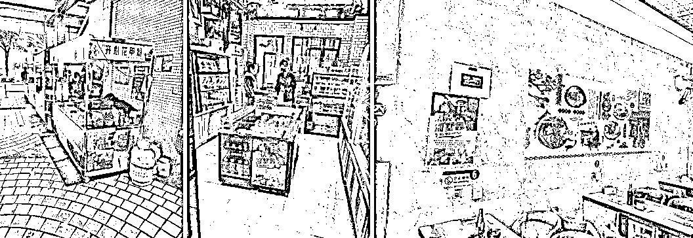

内容来源：《从亏损 8000 到盈收 3W+，轰趴别墅通过精细化运营实现转介绍率 70%》

#### 3.3.2.2 和其他商家联盟合作 @芷蓝 @乔合 @尹基跃

联盟合作分同业联盟和异业联盟两种。

异业联盟合作

联合不同业态的商家设计一张权益卡，这个卡对外销售金额是 98 元/张，可以包含比如洗车店的几次免费洗车、家政公司的几次免费擦玻璃、餐饮门店的折扣、教培的体验课等，加起来价值大几千，所有给到优惠的门店都会给他导流。

要参加这种异业合作的商家要先付费 5000 元采购权益卡（商家有优惠，可以给到 120 张卡）他只要推出去这个卡就能够把钱赚回来，这样所有的商家就都有推广的动力。

好处是，能够在一个城市快速引爆全城，不好的地方是需要联合足够多的商家才能够跑这类活动。

同业联盟合作

同业联盟卡主要是针对教培行业的，教培行业不同的品牌进行联合，比如篮球、油画、音乐等不同的细分品类各自出一个引流套餐课程。

比如一共是联合了 20 家机构，这个联盟卡对外售价是 298 元/张，可以任选 5 个机构的课程，这样的话家长就能够以最低成本来试错，给孩子多报名几家课程。

在找商家的时候，直接去大众点评上以位置信息为基础搜索就可以，当然合作一定要找业务上没有冲突，但消费人群又一致的商家去谈。

在寻找商家以及和商家沟通的过程中，有以下几点需要注意：

① 你需要在大众点评上查看该商家的星级，以及最近半年内的产品销售量来判断该商家的客流量。

② 一定要选择消费用户画像一致，但产品服务不同的商家，比如我的舞蹈室消费者是 20-35 岁之间的女性，这些女性也有美甲美睫、咖啡西点的消费需求。

③ 在第一次和商家沟通时，一定要说明自己的工作室就在附近，最好能邀请商家过来查看，如有必要，可以赠送自己的服务或者产品给商家，保证合作的顺利达成。

如果没有找到这么多个商家一起合作，另外还有两种合作方式可以选择：

合作方式一：互换商品体验券具体方法有 2 种，一个互换你们的商品体验券，然后放在自己的门店里，只要客户消费，就搭赠一张。这种方法的好处就是简单，不过没有办法监督和捆绑利益。

合作方式二：固定合作伙伴还有一种方法，是找到 2 - 3 家固定的合作伙伴，然后去制作一张类似于【29.9 元 = 美甲一次＋中国舞体验课一次＋xxx】这样的通券，用户会觉得更有价值感。

电子烟门店和酒吧异业合作的案例 @乔合：跑通了模式、有了收益直接放大操作，一开始我们合作了几家酒吧，他们也需要你这里的年轻人客户，也是一种资源互换，酒吧一般给我们的都是酒水卡，你自己出开台费就可以去玩了。

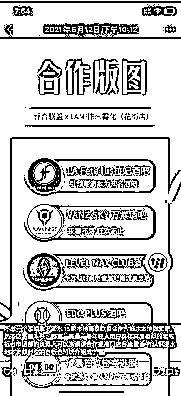

渐渐的发现这些酒吧给的流量远远不够，为了谈了更多的商家，我每天挨个在地图上搜那些剧本杀、奶茶店、密室的电话，加他们客服和他们聊。

大部分实体店老板没有互联网思维的，就知道开店、上美团、上团购等流量来，我们发现后考虑到既然小店不行，我们就去找大店合作，越大越好，因为这种公司有互联网和互利思维，你稍微一说他就懂，合作的成交率就更高！

经历两个月的跑线下市场，我们合作了店铺 60 多家 + 20 多个地摊 ，那些地摊的就不用让他们给你优惠券了，你直接给他们礼品券，让他们直接帮你派发，你只需要送他几套电子烟即可。

老板直接发个朋友圈：来喝奶茶送电子烟，也算是在帮他维护客户了，而且不用他出成本。这样他卖一杯奶茶出去送客户一张电子烟礼品券，客户拿着礼品券就可以到我们店铺领一套电子烟。（切记不能收这些摊主成为你代理，不然没利润。)

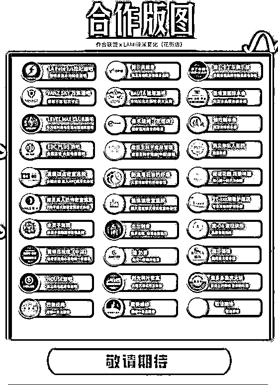

内容来源：《00 后实体店创业者：用互联网思维破局疫情影响》、《门店私域运营 | 小航海学习手册》

#### 3.3.2.3 地推 / 发传单 @芷蓝

很多做线下门店的朋友都问我：发传单还管用吗？我的回答是：管用，但是看你能坚持多长时间，以及谁来发！

首先，我可以肯定的一件事，投资自己的品牌资产，做这事是绝对不会亏的。

在你的门店附近，每天固定时间，固定地点地去发传单，一遍一遍的向经过你门店的人说出你的品牌名称，这是在建立品牌和潜在客户之间的链接，以及影响这些潜在客户的心智。

线下发传单推广的好处就是，你可以在对话的 1 - 5 秒内，完全占有用户的注意力，这个是线上信息流推广不能比的。

发传单，不一定要让用户马上进店消费，而是要让用户在有需求的时候，想起他的工作地点附近，或者说住宅附近，有这么一家可以消费的店。

所以说，只要你能坚持的发，只要是你自己或者信的过的员工发，只要在发的时候不停的跟对方说你们的店铺名称和位置，一定有效果。

关于门店传单的制作预计方法地点，给大家一些小建议。

① 传单不是产品 / 服务手册，不要做三折页，一张即可，尽量减少用户获取信息的成本，哪怕是一个打开三折页的动作。

② 传单上的字体要大，不要觉得这样很 Low，最好能让用户拿到的第一秒就看到你的产品与服务，用户拿到传单后，很有可能只看一眼就扔掉，这一眼能看到多少信息，就看你的字体有多大。

③ 一张传单上只需要 3 个基础元素即可，促销信息（价格）、品牌名称以地址即可，别的都没必要放，我们的目的是让用户到店，不是让用户深度了解你的产品和服务。

④ 制作传单直接选择淘宝即可，最好选择一个要模仿的素材，发给设计师简单修改即可印制。

⑤ 发传单的地址有 3 个选择，一个是以你店铺为中心，半径 500 米的范围内；一个是所处城市的商业中心；一个是模板人群经常出没的地方，比如学校门口等。

⑥ 在发传单的时，直接说促销信息＋地址，是最好的方法，比如我自己在发传单时直接说 “ 19.9 元体验中国舞，就在金街大厦 11 层，今天晚上来试试？”

这里需要注意，最好能给路过的人一个明确的行动指令，比如“今晚 8 点半过来体验一下？”

内容来源： 《门店私域运营 | 小航海学习手册》

#### 3.3.2.4 分销 / 代理合作 @Mage @尹基跃

① 校园代理合作

当时通过海报张贴，在附近的一个高校内招聘到了一名代理，恰巧这个代理在校内也有一些资源，仅仅那一两个月前后，就陆续推了 10 个订单。高校资源是可以积累的，一届带一届，所以不要小看校园资源。

薪酬模式有两种：

第一种是给他底价，他自己报价。

第二种是固定 10% 提成。

② 团长代理合作

除了找高校代理，还可以找专门的代理商、团长、个人分销商等合作，聊好合作模式、时间和薪酬计算方式即可。

比如每个城市都有很多社区团购的团长，你可以通过美团优选或者多多买菜 APP 根据定位找到附近的提货点，可以直接在线下谈合作。

比如我们合作的一个口腔医院，设计了一个 68 元的套餐包，找到团长来进行团购合作，给到团长一单 40 元，一个小区的团长就成单了接近 200 单，后端转化效果非常好。这个引流模式的核心是找到这些团长，其次是设计一个引流套餐包，给到团长足够的利润。

内容来源：《从亏损 8000 到盈收 3W+，轰趴别墅通过精细化运营实现转介绍率 70%》、《如何通过这 20 种实操引流方法裂变用户？》

#### 3.3.2.5 线下门店用户导入@尹基跃 @佳佳

先将现有门店用户导入到个人号上面，导入方式主要有：

通常老顾客或者回头客对门店品牌、产品有基础信任，或是相信店长及店员的人品。这部分用户在导入私域时的难度较低。在具体运营上，我们更多会以朋友圈宣发、1v1 私聊关怀等常规形式触达用户、引导入群，强化用户的品牌与产品认知，提供更多高附加值服务，吸引他们二次到店或带新用户到店。

另外，由于线下门店本身的社交特性，老客户转介绍推荐的流量也是非常大的。他们都有潜在的消费需求，但对门店与品牌本身的认知还比较弱，通常抱着相信朋友、来试试看的心理。这类用户导入私域后，有较高的概率发展为深度用户，成为新一波的种子流量。

内容来源：《饮品店私域流量构建的几点建议》、《以多个店铺为例，分享通过输出内容在线上多平台获得流量，搭建自己的私域流量池、线下运营从人货场分析冲出重围的线下店铺》

## 3.4 如何做流量裂变

💡

小节概要

除了各公域平台，另一个比较重要的引流场景，就是在微信中裂变。一方面微信社交性强，对于身边朋友的链接更紧密，微信上也会以群、公众号的形式聚集一群有相同点的人，引流范围更精准；另一方面微信的用户目前已超过 12 亿，大多用户都在使用微信，可以很好的帮助我们沉淀私域流量。

因此我们整理了比较主流的微信系主流方式供你参考，主要为这几个步骤：

✅ 如何设计裂变引流品✅ 如何确定裂变玩法

✅ 如何制作裂变海报

✅ 如何完成一次裂变宣传

另外，裂变不仅可以作为单独的一个活动，也可以作为以上引流方式后再次扩大流量的方法，每个门店都可以做私域和裂变引流的玩法。

如果你是一个新入行的服务商，还没积累很多的案例，也不确定自己是否可以接长期的引流合作，不妨先从一次短期的裂变活动开始增加自己的引流手感。

具体如何实施，我们一起继续往下了解。

### 3.4.1 裂变引流品设计 @孙策

在裂变引流玩法中，钩子诱饵就是支点，支点的选择可以决定你撬动多大的流量。钩子诱饵足够好，才能撬动更多人。选择适当的引流产品需要根据业务特点、目标受众、预算和长期战略进行综合考虑，我们可以从以下这些角度来考虑一个产品是否适合拿来引流：目标受众：商家希望吸引哪类用户？他们的习惯、偏好和需求是什么？选择的引流产品应当符合商家的目标受众的特点。

成本效益：考虑到成本和预期的回报，哪种引流产品最具成本效益？对于有限预算的小商家，可能需要寻找低成本但效果良好的引流方式。

品牌一致性：选择的引流产品是否与商家的品牌形象、调性和价值观保持一致？

易用性和灵活性：引流产品是否容易使用？是否可以根据你的需求进行调整和优化？

可度量性：你能否轻松地跟踪和衡量该产品的效果？有效的数据分析可以帮助你理解哪些策略有效，哪些需要调整。

持续性和可持续发展：某些引流方法可能会在短时间内带来大量流量，但可能不是长期可持续的。思考商家的长期目标，并选择能够带来持续增长的引流产品。

风险和隐私考虑：确保选择的引流产品遵循相关的法律和隐私政策。避免使用可能损害品牌声誉的方法。

用户体验：从用户的角度考虑，引流产品是否为他们提供了良好的体验？对用户体验的考虑可以提高转化率和用户留存。

评价和推荐：查找其他业务或同行对于引流产品的评价和推荐，了解其实际效果。

就目前常见的裂变方式来说，裂变所用的引流品主要分两种：1\. 实体店本身的产品做拆分

这种引流品主要从门店本身的利润品或服务中，抽取出普适性强、成本低的一部分来吸引用户。

比如瑜伽门店，可以用体验课的形式吸引更多人，美容口腔等门店，可以考虑用一些仪器类，服务类等成本低的产品，用超值低价的形式吸引更多人。

这种方式适用于店铺老用户以及稍微了解产品的新用户。

老用户熟悉实体店的产品能了解本身的价值，所以可以考虑通过组团、邀请来获取更多某个产品优惠的促销裂变。以教培举例，正常价格单节课 100 元，我们要进行组团裂变活动的话可以这么设置：一个人买，50 元一节课，

组成两人团，40 元一节课，

组成三人团，30 元一节课，

对于老用户来讲，如果认可产品，且产品能给老用户优惠，就更愿意去推广新客户。

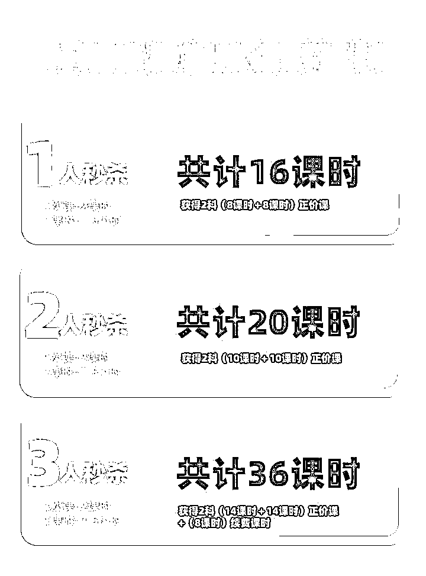

稍微了解一点产品的新用户，一般来说对于这类产品是有一定兴趣的，如果能够引导他们到店，转化率相对来说也会更高一些。所以除了老用户介绍，我们还可以拆分出一个小的产品模块来作为体验产品，用非常优惠的价格来吸引他们到店体验，借机转化到利润品。

关于这类引流品的成本，因为都会尽量找自身产品内成本低的部分来引流，一次体验课，一次洗牙服务等等其实成本都不高，所以我们算下来不亏就可以。

2\. 根据用户画像采购其他礼品

如果产品本身的优惠没有那么吸引人，或者是我们想吸引的目标用户还没有那么了解产品，那么还可以通过礼品采购来增加活动的吸引程度。

礼品的选择要有价值杠杆的产品，即价格低价值高，成本 50 可以当做对外 100 的价值来用。另外还要符合目标用户的需求，

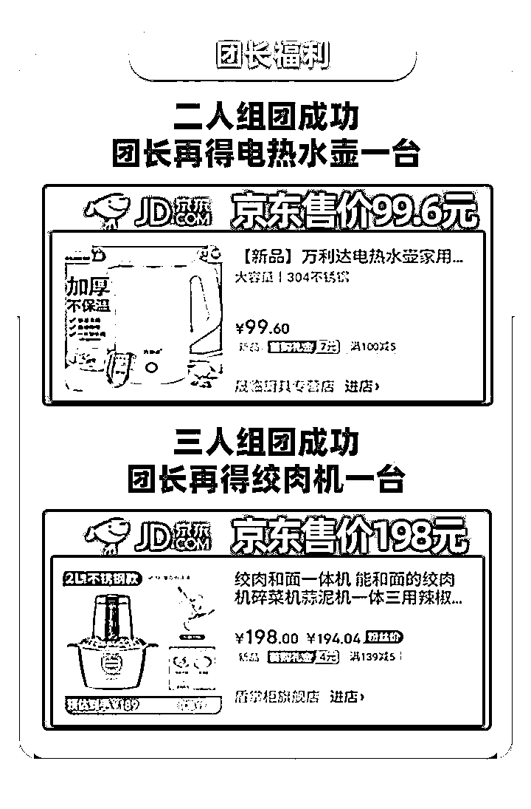

选择合适的引流产品需要进行深入的研究和考虑。建议你在决策前先进行小规模的测试，然后根据结果和反馈进行调整，确保你的投资能够得到最大的回报。

### 3.4.2 裂变引流玩法

#### 3.4.2.1 裂变玩法概述 @Nico 酱

对应门店的转介绍环节，激发用户进行口碑传播。我们可以参照常用的 9 种裂变玩法，分别是：任务裂变、分销裂变、打卡裂变、测试裂变、红包裂变、文章裂变、解锁裂变、助力裂变、砍价裂变。

任务裂变：这种是最常见的裂变玩法，是让用户完成任务然后领取优惠的形式。一般来说用户需要转发自己的专属海报，例如邀请 X 个好友助力可以获得奖品，大多通过第三方工具实现。

分销裂变：通过设置一定的分销提成或者分销奖励，形成一定的分销机制，然后引导尽可能多的用户，帮助你去卖产品或服务。

打卡裂变：通过让用户参与打卡活动，在朋友圈晒出打卡成就，从而实现裂变拉新。比如教育培训行业会推出打卡 0 元购的方式，以刺激用户按时打卡转发分享。

测试裂变：这种裂变的好处在于可以转化精准用户群。例如一个时尚达人的身份测试活动，用户 A 可以转发给用户 B ，用户在完成测试后，用户 A 和 B 均可获得一定福利。

红包裂变：红包裂变是指让用户给他的好友发福利，例如瑞幸咖啡在购买后可以发红包，外卖在点单后也可以发红包。

文章裂变：这一类裂变是指文章阅读一部分或者视频观看一部分后提示需要转发给好友或朋友圈才可继续观看。

解锁裂变：解锁裂变是指用户通过集卡、集碎片等方式可以解锁权益，例如支付宝的五福红包。

助力裂变：指通过好友助力可以获得更多福利，例如每日默认 1 次抽奖，当用户转发给好友，并且好友关注后，该用户可以额外获得抽奖资格。

砍价裂变：同样适用于售卖商品的场景，通过好友砍价获得优惠。

总结成公式的话也就是：裂变 = 种子用户 + 奖品 + 海报 + 分享流程，通过设计活动进行传播裂变。例如美业门店用户邀请 X 个好友助力可以获得奖品。

内容来源：《200 家日式皮肤管理加盟店背后，我是怎么把美业生意和互联网运营结合的》

#### 3.4.2.2 裂变活动的步骤参考 @尹基跃

第一步：店内裂变海报设计。海报上面二维码放门店个人号；

第二步：裂变福利设计。转发店内海报马上享受 5 折优惠，或再赠送一杯（一杯饮料的成本引导转发一次朋友圈，成本很低了）；第三步：话术设计。海报与转发文案获取的方式可以是添加门店个人号回复关键词获取，准备好裂变话术；

第四步：流程布置。善用一些社群工具辅助，提高活动的进行流畅度和效率。

这样就搭建起来了一个小的裂变循环。

内容来源：《饮品店私域流量构建的几点建议》

#### 3.4.2.3 一张合格的裂变海报应该怎么做？@芷蓝

制作裂变海报运用的是 AITDA 这个成交模型。从我们看到商品，到最后去付款，这就是成交的整个流程，这个流程分为 5 个步骤，也就是经典的 AITDA 模型。

他们分别是：抓住注意力（Attention）→激发兴趣（Interest）→建立信任（Trust）→刺激欲望（Desire）→催促行动（Action）

接下来，我会以我自己舞蹈室之前做的一个《15 天线下减脂训练营》的海报案例，给大家展示具体的操作方法。

那么，对于一张营销海报来说，主标题就是抓住用户注意力最好的素材，这有点像新媒体文章的标题党，区别在于标题党的文章无法为用户提供和标题相符的价值，而我们的海报要为用户提供解释标题的内容。

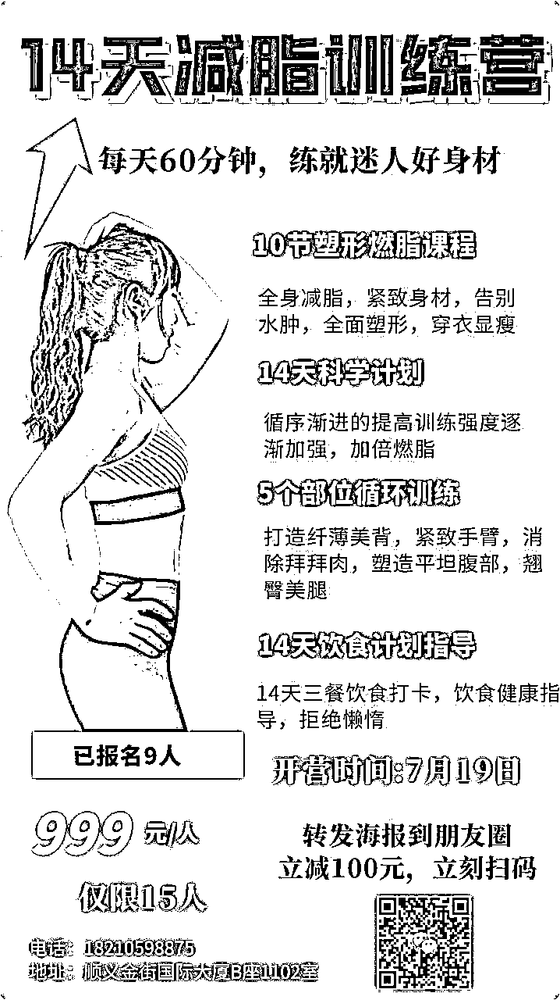

我的海报标题用了 “14 天减脂训练营” 这样的一个标题，通过给出具体的时间暗示，让用户联想到自己可以在 14 天内就获得减脂的效果。

这里，芷蓝给大家分享 4 个标题模板，无论你的门店属于行业，都可以使用。

① 冥想 5 分钟等于熟睡 1 小时（用数字的强烈对比来抓住注意力）

② 如何在家练出好身材？（设置操作门槛更低，获得价值更高的的场景）

③ 怎样用普通手机拍出专业级照片？（同样也是对比法）

④ 免费收听茶艺入门。（免费 2 个字总能吸引到人）

如果没有这个副标题，用户很可能觉得就是一个标题党，然后退出自己的注意力。

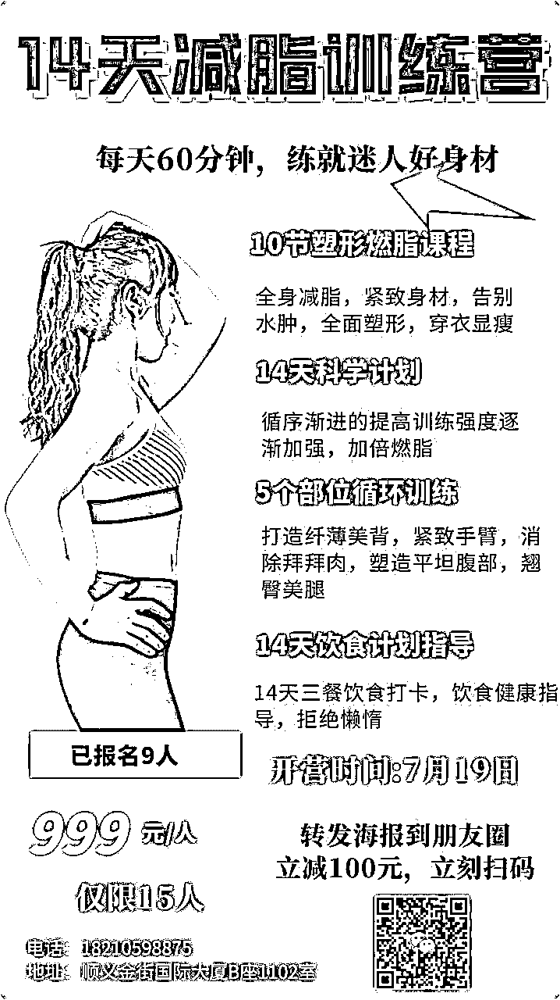

比如我的这张海报副标题是 “每天 60 分钟，练就迷人好身材” ，既对主标题有了一个具体的解释，又能让用户觉得只需要每天付出 60 分钟，就能得到一个自己想要的好结果。

这里列举几个副标题，大家可以参考一下。

主标题 1：冥想 5 分钟等于熟睡 1 小时

副标题 1：1 小时学会轻松冥想术主标题 2：如何在家练出好身材？

副标题 2：不去健身房，不请私教的健身方法

主标题 3：怎样用普通手机拍出专业级照片？

副标题 3：3 节课教你学会 18 个实用手机拍照技巧主标题 4：免费收听茶艺入门

副标题 4：1 小时让你从喝茶到懂茶

3\. 有效背书建立用户信任信任是用户采取下一步行动的基础，否则就算你的主标题＋副标题说的再诱人也没用。怎么建立信任呢？这时候就需要用上 2 个核心要素：权威＋从众。

① 权威比如你的海报上的老师很厉害，得到过 xxx 奖项，专利和技术等等，另外也可以通过侧面提现，比如找同领域大家都知道的 KOL 联袂推荐，这些都是常见的提现权威的做法。

② 从众

假如你现在去商场吃饭，时间充裕的情况下，有 2 家产品在你面前，一家十分冷清，一家十分热闹，你会选择哪家消费呢？一定是去哪家热闹的吃对吧，这个就是从众效应。

从众效应具体在海报上怎么体现呢？我们可以把这次报名的人数打上去，数字越大，越能引发从众效果，比如你的海报加上 “ 99 名小仙女已经报名学习” ，就可以有一定的刺激效果。

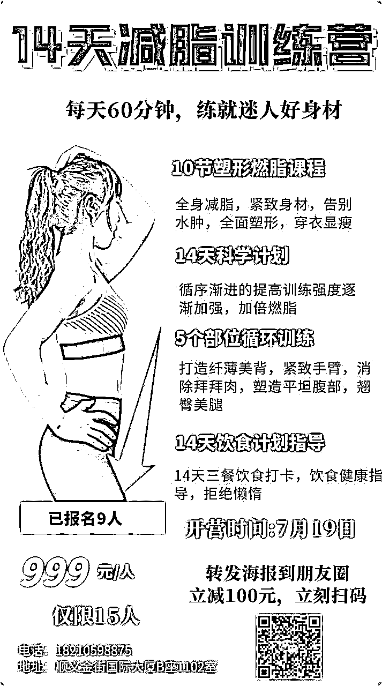

同样，大家可以看下我的海报，当初因为我请的老师并没有很出名，只是一个健身房的教练，所以就在下方加上了“已报名 9 人”作为一个从众元素展示出来。

权威＋从众，单独使用可以，如果一起使用效果会更好。

比如，我的这张海报右侧，给出了一些减脂用户平时非常在意的细节，有了这个具体的刺激，他们报名的冲动会变得更强烈。

芷蓝再给出一些其它的文案模板，大家可以模仿。

① 一节课掌握中国舞的 4 大基本手势

② 3 小时学会吉他的 5 种基础和旋

③ 19.9 元 6 个老婆饼带回家

一般来说，用户能感受到的确切收益都是在时间和数量这两个维度上，一个是我很快就能得到什么，一个是我花很少的钱能得到很多的东西。

所以，你的海报中最重要的元素就是：二维码很多人海报做的挺好，最后用户看完也觉得不错，有想购买或者报名的想法，但是最后居然没留二维码，还要去问发海报的人到哪报名，这就是一张裂变海报最大的失误。

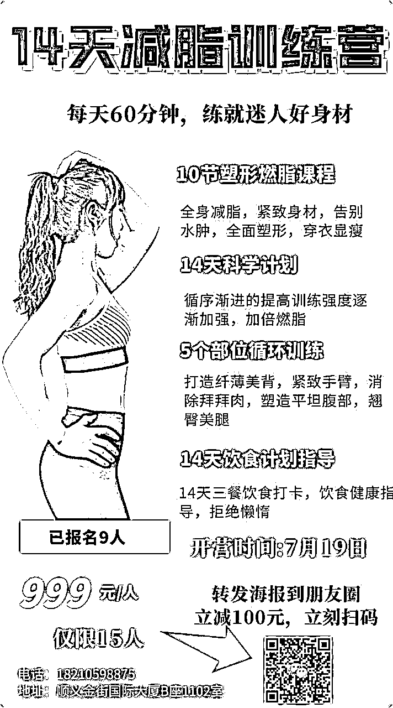

就像我的这张海报，如果不加二维码，你看完觉得挺好，但是不知道该怎么报名啊，哪怕你是去微信上问我，就多出这一个路径，也会流失掉一部分用户。

最后给大家总结一下，一张合格的裂变海报需要具备一下几个基础元素：① 抓住用户注意力的主标题，字体要大，颜色要显眼。

② 能够解释主标题＋让用户产生兴趣的副标题。

③ 通过权威＋从众心理建立和用户之间的信任纽带。

④ 继续刺激用户购买的价值收益细节。

⑤ 催促用户行动的一个二维码。

优惠信息、门店信息、门店个人号活码、门店地址等都是必备内容，且需要配备相应的推荐话术。

内容来源： 《门店私域运营 | 小航海学习手册》

#### 3.4.2.4 裂变宣传的流程 @孙策

微信裂变的方案，通常可以遵从浪潮式发售的策略，执行流程包括：造势、预售、发售和追售这四个步骤，尽可能放大一场裂变活动的势能。

造势和预售造势的目的：收集市场对产品的接受程度，吸引用户的好奇心，通过这种方式憋单来实现短期集中爆发带动更多新客户。

造势的方式：通过利用现有的流量池，广泛地对外发布活动预告，引导潜在客户加入活动群，提前对外宣传正在筹备这场活动。以下是可以参考的预热维度：1\. 朋友圈预热：通过连续的动态，为用户普及此次活动的背景及目的，以及裂变品的独特卖点和功能，确保在正式活动开始前，用户已经对它有了初步的了解。

执行浪潮式发售时，除了上述步骤外，还要确保与目标客户建立真实的关系，真正理解他们的需求，并提供高价值的内容来满足这些需求。

## 3.5 拓展：其他引流方式

### 3.5.1 视频号裂变玩法 @阿 may

视频号裂变玩法，做一个《我的十年》，让老客户点赞 + 评论，写得好还可以分享。

操作注意细节：视频号的裂变那就是用户点赞即可，所以，让老客户在视频号上写评论 + 点赞，就是用户帮你裂变了。视频做得好，还可以引发客户帮你分享，一样可以带来客户流量。

内容来源：《美业获客 8 大有效玩法》

### 3.5.2 地图引流 @封伟-自动化变现

💡

小节概要地图是一个大家不太注意的引流方式，但是这个细节也会影响用户的选择。一方面方便用户寻找，另一方面在地图上也会有一些用户评价可以供用户参考。

我们整理了一些可收录地图的平台以及收录步骤，你可以根据自己的需要进行申请。

#### 3.5.2.1 可收录地图平台

常见平台：百度地图（百度地图 app 标注）、腾讯地图（腾讯位置服务公众号）、高德地图（高德 app 标注），一般申请这 3 个够用了

全网平台：包括高德地图 + 百度地图 + 腾讯地图 + 微信位置 + 苹果地图 + 朋友圈位置 + 企业微信位置 + QQ 地图+ QQ 空间 + TM + 滴滴出行 + 闲鱼 + 西瓜 App + 携程旅游 + 高铁管家 + 花小猪打车 + 货拉拉 + 陌陌 + 哈喽出行 + 饿了么 + 快手 + 微博 + 小红书 + 大众点评 + 曹操专车 + 快狗打车 + 哈罗顺风车 + 58 同城 + T3 出行 + 凯立德 + 阿里巴巴，抖音位置（有行业限制，部分行业不收录）

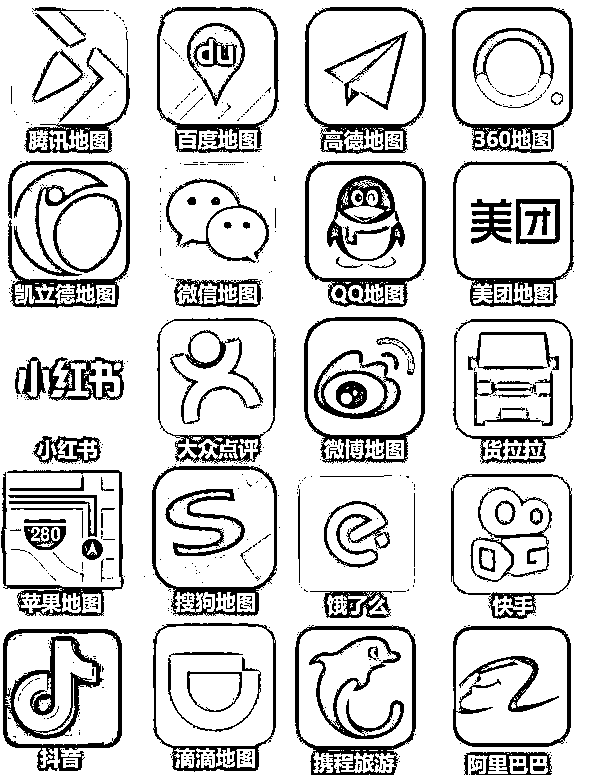

#### 3.5.2.2 地图收录步骤

提前准备资料到对应平台，提交申请即可

①门头照片左中右 3 个角度各 1 张

②标注名称【名称和门头名称尽量一致】

③详细文字地址【 XX 省（市）XX 区（县）XX 街 XX 号】④营业电话 / 联系手机

⑤具体位置

自己动手即可，只要资料准确，工作日当天就能下来。

内容来源：《实体店如何有效互联网化，90%的老板容易忽略的细节》

### 3.5.3 多平台组合引流 @缄默

💡

小节概要

我们在实际的引流过程中，往往不止做一个渠道的引流，而是多管齐下，比如这里讲到的大众点评 + 小红书 + 公众号引流。

具体如何结合各种渠道达到引流目标，需要你根据自己的实际情况进行设计，这里提供其中一种参考。

引流渠道大家无非觉得是电视广告，公众号投放，大众点评，小红书，电梯电视广告，但是这里面比较有效果和性价比较好的是大众点评和小红书一体的宣传。电视广告，公众号投放只能占到到店率的很小一部分，一般多见于运用在网红餐饮，医美这些门店类型。

大众点评，可以说是门店线上引流必做的一个板块，但是大家会忽略他的维护问题，因为团购什么的会收取 6 到 12 个点的服务费，但是我们不一定要做团购，只做（口碑评价），那么重点就是积累点评。

一般来说这种在二三线城市做量搞知名度很轻松。还有一边也是套餐，就是小红书种草，利用大规模水军账号去铺笔记，并且把其中一两篇刷赞刷评论做排名，跟大众点评是同时运行操作的。

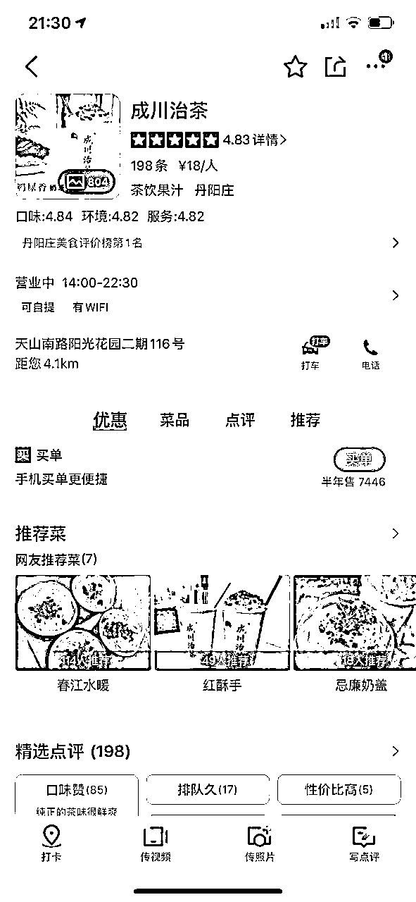

一般大众点评刷评论都会一半以上是 v5 等级，评论有首页流量扶持，10% 是 v8 等级账号评价，打分都在 4.5 或 5 分，视频 150 字以上，自顶自评。

小红书上也是一样，大规模铺笔记，一般是 60 到 90 篇，水一些数据，制造种草假象，让用户有种“网红必打卡”错觉，跟风发布打卡笔记，借机将某几位用户的真实笔记数据水上去就可以了。

后期再借助地区公众号做个推广，网红店就打造成功了，线下门店在线上最具性价比的入口 90% 以上都是这么操作。

内容来源：《门店的一些引流套路》

# 四、线下流量服务商如何找到合适的商家

💡章节概要

做线下流量服务的第一步，就是找到合作商家，并且尝试达成合作意向。

我们所面对的每一个实体商家，都似乎是一个独特的个体，但通过深入的分析，我们能够明白，无论是小吃店还是高端酒店，他们都有其固有的运营模式和特点。

在本章中，我们详细解析了如何将商家分类，以及不同商家的特点和需求。这种分类不仅能帮助我们更准确地为他们提供服务，更能深入地理解他们背后的业务逻辑和盈利模型。

而在接下来的部分，我们还将探讨如何快速找到潜在的合作商家，以及与商家如何达成合作。

无论你是新入行的线下流量服务商，还是已经有一定经验的从业者，相信本章的内容都能为你带来新的启示和思考。

## 4.1 商家有哪几种 @宗霖

线下流量服务商为实体商家提供服务时，根据商家的特点，可以将其分为低客单高频和高客单低频两类。这种分类方式有助于更准确地理解不同类型商家的引流需求。

### 4.1.1 低客单高频商家

此类商家的交易额相对较低，但交易频次较高。具体包括：

餐饮门店：如快餐店、咖啡馆、甜品店等。

景区门票：如主题公园、博物馆、自然景观等。

酒店民宿：包括城市酒店、度假胜地、乡村民宿等。

休闲娱乐：如电影院、KTV、体验馆等。

这些以“吃喝玩乐”为主的商家，因客单价低且成交容易，复购频次也高，通常选择 CPS 方式与服务商合作。服务商为其引入客流，商家则为每笔交易支付一定比例的佣金。若服务商提供的是长期的账号运营，费用可能包括基础服务费和 CPS 佣金两部分。

### 4.1.2 高客单低频商家

此类商家的交易额高，但交易频次较低。具体包括：

装修公司：提供家装、办公装修、景观设计等服务。

医美机构：如整形、皮肤管理、激光去痣等。

口腔/植发医院：提供牙齿矫正、种植、植发等服务。

房产中介：买卖、租赁房产。

新车/二手/名车馆：车辆购买与置换。

会展招募：组织或参与各类展会。

招商加盟：寻找合作伙伴或投资者。

金融贷款：提供各类贷款服务。

对于这类商家，因其成交周期长且难以准确掌握真实交易数据，服务商通常建议使用 CPA 方式进行合作，即为每获取的有效线索支付一定费用。当然，也有选择 CPS 方式的，但由于成交验证难度较大，CPA 方式更为推荐。

## 4.2 如何快速找到潜在商家 @宗霖 @不语

寻找并与潜在商家建立合作关系是每一个线下流量服务商的第一步，目前我们常用的有这四种方法和商家建联：

优先找周边自己熟悉的商家：基于双方之前的互动和信任，如果你和商家相互有一定的了解和熟悉，可能他们会更愿意与你合作或给你一个合作的机会。

朋友转介绍：与区域内的商家建立友好关系至关重要。通常，只需要向几位朋友咨询，他们便可能帮忙介绍认识某个商店的内部员工或管理者。一旦与这些内部人员建立联系，就可以逐渐找到决策者或负责人。

参加行业展会：密切关注即将举办的各种行业展会。主动报名并参观展会，这样可以收集到众多潜在合作商家的联系方式，如微信和名片。收集到信息后，安排时间进行上门拜访，与他们建立合作关系。

搜集信息后陌拜：可以在各大行业平台、抖音、美团等渠道搜集商家信息。在上门拜访之前，建议对商家进行深入了解并准备合作方案。上门时，通过前台尝试与负责人或决策者建立联系。

有商家信息了，那么我们如何在无法直接接触到老板时建立联系呢？可以有以下几种方式：企查查工具：可以使用“企查查”这样的在线工具查找老板或决策者的联系方式。

合作财税公司：财税公司通常与多家商家建立有合作关系，可以考虑通过他们作为中介与老板建立联系。

与店铺管理层沟通：如果直接与老板联系困难，可以考虑首先与店铺的店长或其他管理人员沟通。他们往往具有一定的决策权，并可以推荐与老板建立联系的途径。

商场招商推荐：与商场的招商部门建立良好关系。他们可能会推荐潜在的合作商家，并帮助我们与决策者建立联系。

内容来源：《探店 15 天，门店由亏损到日利润 6000+，浅谈 3 年探店心得》

## 4.3 如何与商家达成合作 @宗霖、@不语、@hp

想要和商家顺利的达成合作，在拜访前我们就需要进行充分的准备，有针对性的了解和准备，即商家有什么困扰，我们可以解决他们的困扰，且我们很专业。如果能够把这些点展现出来，将会大大增加这次合作沟通的达成可能性。

### 4.3.1 拜访沟通前期如何准备

在展示中，我们要确保数据和案例真实且有说服力。（如果没有太多过往合作案例，可以先放自己之前做对应平台的一些成果，主要展示自己的专业度）

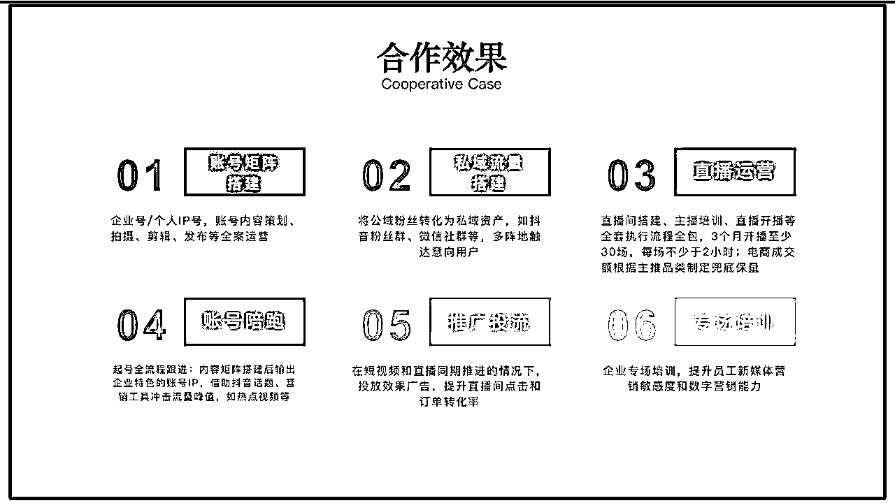

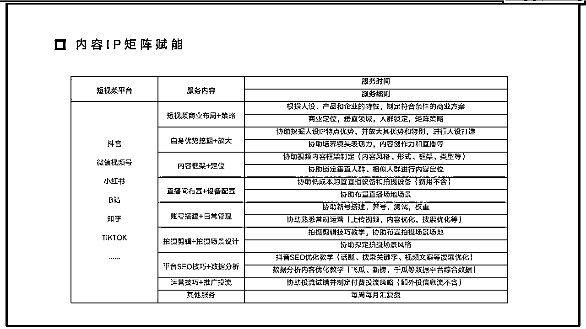

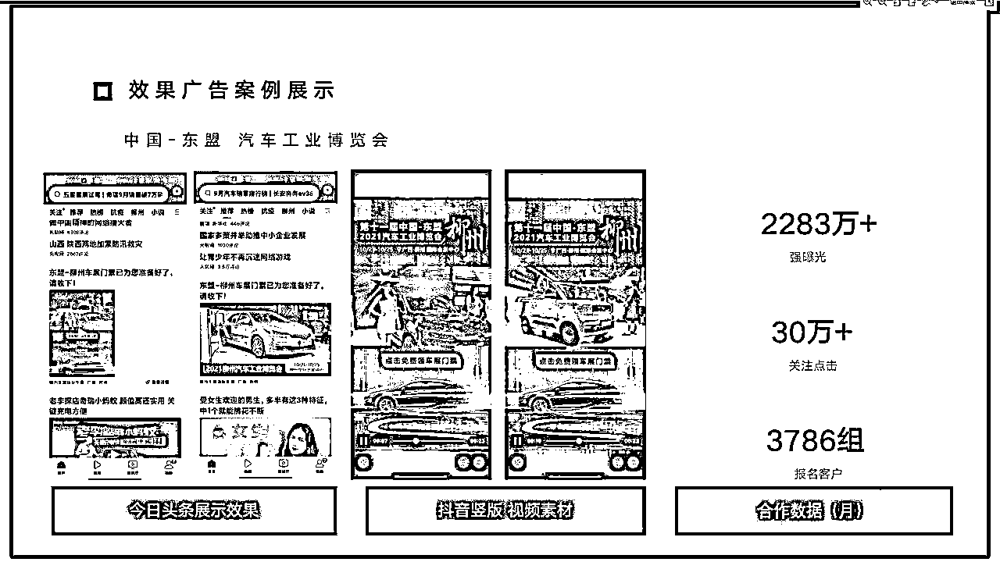

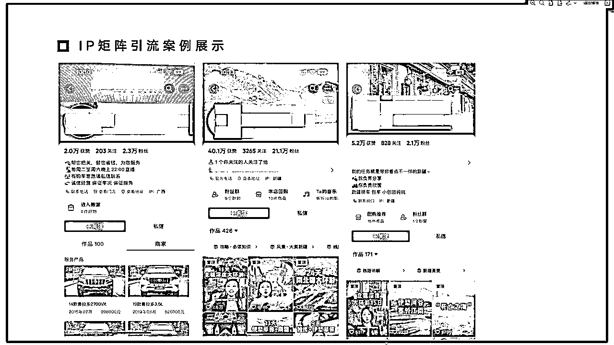

以下话术供你参考：

xx 总，您好。我是 xx

某某推荐了您的微信/电话给我，我是做流量运营的，之前某某店的运营就是我做的。想跟您约个时间过去拜访您，探讨线上流量运营板块，互相认识下。

### 4.3.2 如何和店家沟通达成合作

具体的合作沟通，是以达成合作为目标的，因此这个环节包含这两个重要的方面：商家需求是否能够满足；服务商的合作需求是否能够满足。

比如围绕商家门店的线上经营情况，问问以下信息：美团抖音目前是否有在做？

已经在做的话，做得如何？目前店里有多少人在做这个事情？

做不太好主要是什么原因呢？

您觉得抖音要不要做呢？

……

主要沟通信息为和合作息息相关的内容。最好去拜访前提前准备好一版问题，这样可以有效提问，把控沟通的节奏。

另外在交流的过程中，建议逐个插入去问，不要把问题一起全抛完，商家回答的压力会比较大，也不知道从何讲起，可能比较难了解细致。

在这个中间，建议不要打断商家的表达，不去臆断商家想法，我们可以在他讲完后，进行重点归纳，重复确认。

在沟通过程中还有个小 Tips，就是及时给商家一些肯定的反馈，对他的一些想法思路做出肯定。但是赞美要时机自然而及时，赞美内容具体到点，用词贴切符合实际。，否则太过生硬会显得不真诚，反而不如直接聊来的好。

然后，根据商家的需求展现我们可以满足的一些服务，主要强调的是诚意和专业对比。我们需要给商家展示自己的专业性，帮助他们理解所要做的推广的规则，以及与其他同行业服务提供商的区别。重要的是强调与商家建立长期、互惠的合作关系，而不仅仅是短期的服务交易。

2\. 确定服务周期

推荐选择较长的服务周期，这有助于你和商家更好地适应合作，特别是在初期的冷启动阶段。

比如：抖音、小红书、大众点评、美团等平台的运营服务期为半年至一年；一次微信裂变活动的服务周期可能在一个月到三个月。

3\. 确定合作模式

合作模式分有服务费＋佣金和纯佣金两种。建议在初始阶段采用服务费+佣金的合作模式。服务费可以按一次性支付也可以按月支付，有了服务费更好的度过自己没有收入的阶段，心态也不会这么慌张。这不仅能保证初期的收入，还可以使合作更加稳定。

需要注意的是，在初期一定是要和老板确认好未来的分佣方式，否则后续会比较难办。我们是在考察门店并试运营合作半个月后，与老板正式确定的合作方案。

我们的服务费为整个门店交易额的 30%，营销方面费用由我们承担，且如果门店日均营业额低于 5000，则我们不参与分佣。理论上一家门店的合理营销费用应该在总收入的 10-15%左右，所以我们这样的设计实际上可以理解为我们的毛利是门店交易额的 15-20%，当然如果我们营销能力足够强，这个比例是会上升的，反之亦然。

在整个过程中，我们都需要和商家进行真诚沟通。其实这并不只是一次性引流合作，我们的目标不仅仅是提供服务，更是建立一个长期、互惠互利的合作关系。因此，我们需要尽我们所能，让商家明白我们是他们的合作伙伴，而不仅仅是一个提供服务的机构。

内容来源：《探店 15 天，门店由亏损到日利润 6000+，浅谈 3 年探店心得》、《线下门店联合经营日记（二）——美团店铺运营》

# 五、线下流量服务商如何做好交付 @孙策 @宗霖 @hp

💡

章节概要当和商家达成了合作之后，我们即将进入正式的交付啦。一般来说我们需要经过这几个步骤：

✅ 商家现状调研：这一步可以帮助我们准确的定位到商家的痛点和期待，制定更有效的营销策略

✅ 引流目标确定：和商家确定明确的引流目标，可以帮助我们做出更✅ 引流方案的设计：我们接下来怎么实施，主要就在这个环节展现了，方案如果清晰具体，是非常有助于顺利推进合作的

✅ 到店成交：我们都说引流的最终目标是成交，这一步如果打磨好，获得比之前更好的成交结果，那可以说明这是非常棒的一次引流活动了

✅ 数据记录：每一个细节，每一个数据，每一个反馈，都是我们决策的重要参考如果你已经拿到了一份合作，接下来就开始进入正式的交付阶段吧！

## 5.1 梳理商家现状

现状梳理总的来说有三步：

第一步：在各平台上先对商家运营现状有一个基础了解；

第二步：找身边的朋友特别是去消费过的了解一下他们的服务流程等；

第三步：直接和商家沟通。在交流时一定要多问他问题，可以提前设计一下问题。

这里和我们前期调研时的观察维度没有太大区别，但是我们可以通过和商家的直接沟通，了解到最真实的数据以及一些内部数据。调研时可以包含但不限于以下维度：产品和人群调研

深入的了解产品和用户，可以帮助我们更顺利的做好营销活动设计。

商家业绩调研

通过这三个点基本能判定出，现有资源能够支持实现多少成交额。

举个裂变引流的例子：瑜伽店在籍学员 1000 人，如果有 200 个铁杆粉丝愿意支持商家且愿意推荐周边朋友，我们推出 199 元瑜伽课包，200 人愿意购买，且一个人愿意推荐 2 个，这就是 200x2=400 个，200+400=600 个，我们可以推断卖出 600 个体验课包。

商家团队调研这块我们可以主要调研两个方面：

这一步调研，可以帮助我们定位到一些目前的运营卡点，另外也会影响我们的引流活动可以做的多大，可以调动多少人力投入进去，是辅助判断我们引流目标的一个维度。

你也可以参考圈友 @hp 的一些信息收集维度：

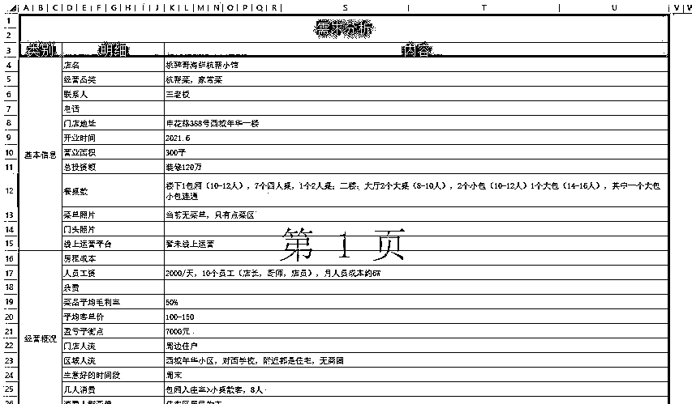

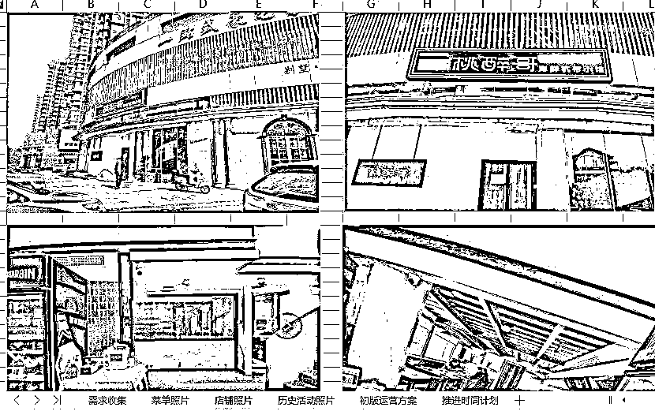

内容来源：《线下门店联合经营日记（二）——美团店铺运营》

## 5.2 与商家对齐服务目标

在与商家的深入沟通后，我们已获得了有关客单价、转化率、团队规模等关键信息，这为我们制定准确的引流目标提供了重要参考。基于这些信息，我们建议确定以下两个主要目标：1\. 商家的目标

引流客户数量：期望通过营销策略为商家带来多少新的进店客户。

转化率：进店客户中有多少最终完成正价产品的购买。

客单价区间：划分高、中、低三个客单价档次，各个档次的产品各转化了多少。

举例说明：我们期望带来 1000 个新的进店客户，其中有 20%的转化率，即 200 人完成购买。平均客单价为 3000 元，预估整个活动可为商家带来 60 万元的销售额。

裂变效果：引流品的传播效果，即有多少新客户因为老客户的推荐而产生购买。

举例说明：我们有 1000 人的私域客户群体。其中，500 位老客户购买了引流品，并成功推荐给了 700 名新客户。假设每个引流品定价为 199 元，且和商家明确沟通确定，引流品所产生的营收全部算做我们的，那么 700 个新客户的购买可为我们带来 14 万元的收入。

在明确了这两个目标后，我们可以逐步倒推策略，确保在各个环节的执行上都与这两个目标保持一致。

引流目标需要根据该商家在区域的品牌影响力、门店人员数量和销售能力、对本次合作的重视配合程度、提供的营销投入成本以及对自己的引流能力综合判断，不可过分承诺目标。

所以和商家老板及时沟通至关重要。我们需要明确他们在整个合作过程中需要提供的支持，以及双方共同的预期目标，确保双方都能从中获益。

## 5.3 设计适配商家的引流方案

在当前竞争激烈的市场环境中，成功地吸引并留住用户对于任何企业来说都是至关重要的。为此，策划一场有针对性的引流活动是非常必要的。

所以当我们了解清楚背景和本次引流的目的、目标之后，就可以进入详细的方案制定环节了。确定一个详细的方案，可以帮助我们和商家确认好活动每个环节的支持和预期，也方便我们后续有序推进引流的进行。

一个方案会包含这几个部分：背景和目标

根据与商家的沟通，总结并明确双方的期待和目标。在前两节我们已经进行了确认，这里直接以文字方式将和商家的沟通情况总结输出即可。

引流方式概述

我们需要再展开讲自己的方案时，先用简洁明了的文字说明本次方案的主要引流方法，具体的引流方式可以参考 章节三 进行确定。

这里整理了一些常见行业的引流方式供你参考，你可以根据自己的情况选择做一个或多个引流方法的方案：

首先是【低客单高频】的行业，目前比较推荐抖音同城+大众点评 / 美团的方式，比如：

餐饮门店：这类门店基本都已经申请了大众点评/美团，我们还可以尝试“抖音蓝 V 号 + 达人探店引流”的模式，如果我们有自己的达人资源渠道，我们可以和商家申请推广资金，我们来赚取邀请达人的中介费。

休闲娱乐：可以尝试 “抖音同城 IP 打造 + 美团代运营”的服务，这个行业的美团运营目前还没有那么卷，我们可以尝试做投放，是比较容易做出成果的。另外小红书推出了本地生活，虽然目前还不是非常完善，但是最近的活动“小红书的 100 家探店计划”可以考虑参与，小红书的人群和这个行业还是比较契合的。

酒店民宿门票：也是“抖音同城+美团”的方式，但这里需要注意的是，旅行社一类在抖音同城入驻，是需要缴纳 10w 保证金报白的。

然后是【高客单低频】的行业：

装修公司：这个行业，优先推荐做抖音+小红书。有两种号可以做：一种是设计师的个人 IP 号：内容打造会更个人化一些，包括设计想法、理念等的讲解；

另外一种是商家的蓝 V 号，这个方式做营销相对来说阻力没那么大，且有一个抖音企业线索版的后台，可以联系到所有咨询客资，方便我们跟进。这类账号的短视频内容，主要是做一些公司接手过的成功案例分享。另外我们注意到目前已经有大型的商家在做信息流投放了，但是目前还没有做的非常厉害的公司，目前来说机会空间还是比较大的。

医美机构、口腔/植发医院：这几类如果想在抖音同城入驻，也是需要缴纳 10w 保证金报白的。所以目前基本是比较大型的商家有入驻，对于中小型门店，如果能够有这个资金报白，是一个不小的流量池曝光，另外也可以帮这些中小型门店做美团代运营，帮他们拉高评分，增加线索。

房产中介：目前这个行业建议优先做抖音 IP 同城。近期相信大家都刷到过抖音上有人在代看房、探房这种号，一般房产中介的抖音运营会有短视频和直播两种，短视频内容方向主要实地看房，直播时会以一个地图为聊整个区域的房源情况。

新车/二手/名车馆：这个行业，目前比较推荐做抖音直播，不过在做抖音直播的车馆目前也越来越多了，竞争相对来说可能会大一些，但是机会还是很大的。我们可以通过抖音短视频起号，再用直播做转化。另外也可以尝试在小红书上发布短视频，开拓小红书平台上的流量。

以上的行业都可以针对老用户或者意向新用户做私域的沉淀，做裂变活动，带动来更多的可转化新流量。如果你是初入行的新手，不放先尝试做一次短期的裂变活动，来提升自己的手感，积累一些成绩。

成交环节实际的合作过程中，我们不仅仅做到引流这一步就够了。商家需要引流服务的最终需求其实是成交，而我们和商家的合作，也很有可能是以成交为结果去衡量我们的实际的合作。因此如果我们的合作中有成交相关的目标，这一步的设计和优化也是不可或缺的。

想搞定成交，我们就要先分析成交失败的原因。价格贵？持续拖着？挑各种小毛病？你肯定碰见过不少，但总结一下就会发现，其实客户最关心的问题只有以下这 3 个：

对于低客单价高频的行业来说，我们只需要在线上显示自己的活动，并且设置限时的条件，给用户以紧迫感，不需要人为强跟进。

对于高客单价低频的行业来说，我们可能会经过邀约、探需求、到店谈判成交等环节。线下店的成交模式与直播间在逻辑上相似，基于“人、货、场”的原则。即：针对特定的客户群体（人），选择合适的产品（货）并在特定的环境或场合中进行推广（场）。这三者的结合是确保交易成功的关键。

通过之前的引流，我们已经有了客户群体，也已经有了自己的产品，接下来就是这个转化的“场”，需要打造了。

线下店的转化场通常可以分为两种模式：

集中式的优势在于快速转化大批客户，而一对一的优势在于可以深入沟通，更有可能达成高价值的交易。

为了进一步促进交易，我们可以利用以下策略：

阶梯价格策略：制造稀缺感是促进销售的有效手段。我们可以为前几位购买的客户提供特别优惠的价格，随着人数的增加，优惠逐渐减少。例如，前 10 人享受 9 折，接下来的 20-40 人享受 9.5 折。

礼品阶梯策略：礼品具有巨大的杠杆作用。我们可以为不同价位的购买提供不同价值的礼品。例如，消费满 100 元的客户可以选择价值 10 元的礼品，消费满 500 元的客户可以选择价值 50 元的礼品。所有礼品都展示出来，以消费金额划分，先到先得，让客户感受到紧迫感。

气氛打造：为了进一步促进交易，店内的布置和氛围可以更加活跃、热烈。每当有新的客户报名或完成购买，可以拉响礼花或播放欢快的音乐，增强活动的节奏感，使其他客户产生跟随购买的冲动。

另外，关于朋友圈剧本、社群快闪、1 对 1 私聊等成交的方法的具体实施步骤，也在门店运营小航海的手册中的 3\. 门店成交杀手锏 进行了详细的展开说明，你可以通过这一节参考适合自己的成交方法。

另外圈友 @尹基跃还和大家分享了浪潮式发售，你可以点击这场直播回放查看：《搭建门店流量池与快闪发售模式@尹基跃》

引流过程中的推进成功的引流活动不仅仅是关于策略的制定，更重要的是策略的执行。这一步将会帮助我们在引流过程中确保每个环节的有序推进。

在方案的这部分内容中，我们将需要把接下来要做的事项以及要完成的阶段性目标，按照时间顺序列出来，可以参考圈友 @hp 的表格展现形式：

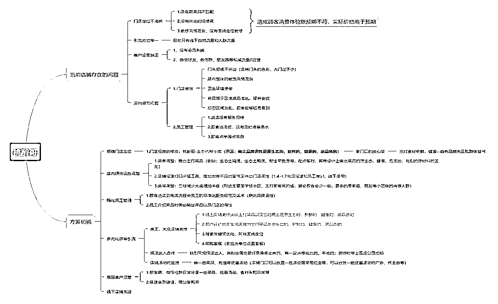

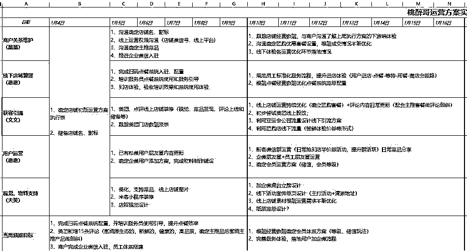

本次活动成本预算在制定引流方案时，明确预算是非常重要的。了解并预测成本可以帮助你制定更为明智的决策，并确保在资源分配上获得最佳回报率。

在这里，我们需要计算礼品、引流品、付费推广等显性成本；也需要考虑人员投入时间、人员培训等隐形成本。

本次活动可能的风险以及预案

提前预警一些风险可以帮助我们在活动中随时保持警惕，在真的碰到该情况时更快的做出应对。虽然不能规避所有风险，但是更充分的准备可以大大增加活动推进的顺利程度。这个部分有则写在方案中，没有的话可不写。

当方案完成后，我们就可以根据方案进行执行了，期间要注意记录数据和异常值，随时调整变化，积极和商家老板沟通，为顺利完成此次引流目标而努力。

内容来源：《线下门店联合经营日记（二）——美团店铺运营》、 《门店私域运营 | 小航海学习手册》

## 5.4 做好数据记录与分析

我们可以提前明确关注哪些数据，一方面可以在执行时随时监测调整，另一方面也可以作为我们后续案例复盘和展示的依据。

根据活动和行业特点，我们通常需要记录的部分数据有：

高客单低频行业：除了下表里呈现的维度之外，还可以有线索成交率、到店成交率等数据维度，通过这些数据我们可以分析出来引流素材是否合适，销售转化能力如何等等。

低客单高频行业：如果你是在抖音或者美团上设计了团单引流，那么我们可以从这些后台看到以下相关的数据。

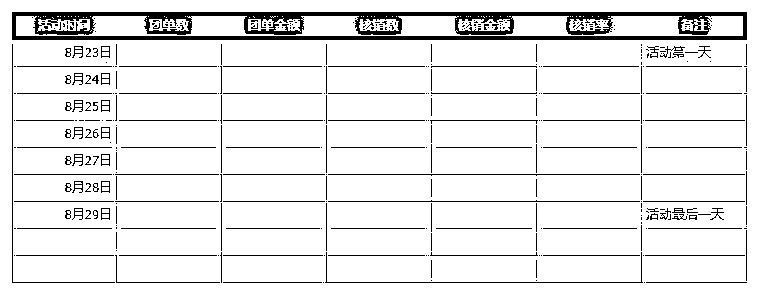

微信裂变：主要有以下几个数据维度需要关注。

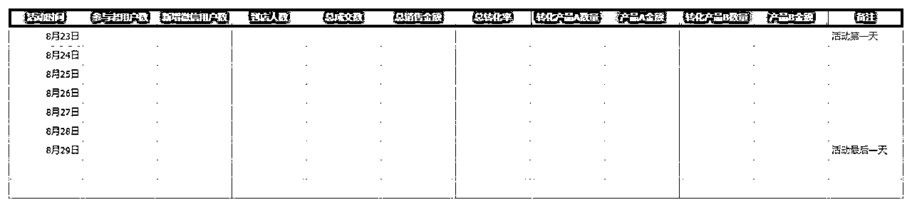

当然，每个引流渠道、每家店所需关注的数据维度不同，除了以上这些数据维度之外，你还需要根据实际情况进行增减，比如产品的平均客单价、视频播放、点赞数量、赞评比等等。

## 六、线下流量服务商如何放大生意 @孙策、@宗霖

💡

章节概要

在商业的大棋盘上，扩大客源是任何企业和工作室向前走的基石。特别是在当下的数字化时代，渠道的丰富和业务的多样化让我们有更多的可能性和选择空间。

本章节将为您揭示如何通过多渠道策略来扩大您的客源，带您探索从熟悉的线下 BD 到线上 IP 建设，再到电话销售等各种方式扩大客源。另外还提供了如何穿越地域的界限，将成功案例和经验复制到更多的区域和市场中的思路。

接下来请紧随步伐，探寻更多的商业机会，释放您的潜能，期待你拿到更大的成果！

## 6.1 扩大客源，提升商家数量

我们可以通过扩大地域范围搜寻更多需要流量服务的商家，以此来接更多的业务，获得更多的营收。

多找几个同类商家：完整的做完一家店铺的探店及代运营之后，梳理一套完整的 SOP，可以套在任何实体店铺上使用。这时可以开始组建工作室型的团队，后期自己抓大方向战略，剩下的执行可以交给其他工作人员做，多个店铺可以同时展开，一份时间卖出多份价格。在同城再多找几个同类型的商家，几家同时收费运营。

跨区域经营：在某个平台的某个类目拿到了结果有成功案例，可以梳理一套自己的方法论，对其他区域招募合伙人，拿这套成功方案到更多区域再做一遍。

找更多客源的方式有这三种，我们可根据自己的资源和能力来选择合适的方式来选择放大的方式：1\. 更多的线下 BD

线下 BD 就是上门推广自己的服务，我们要找到自己的优势，切入点只能是本地化，面聊的沟通效率高于电话高于微信，因此，我们可以不断的跟老板进行面聊沟通，这是极高的优势。这个和 3.3 和商家达成合作 中的建联方式是类似的。

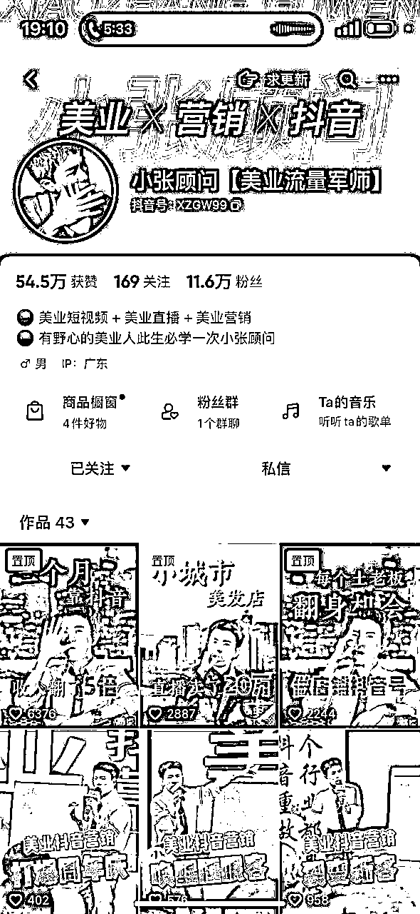

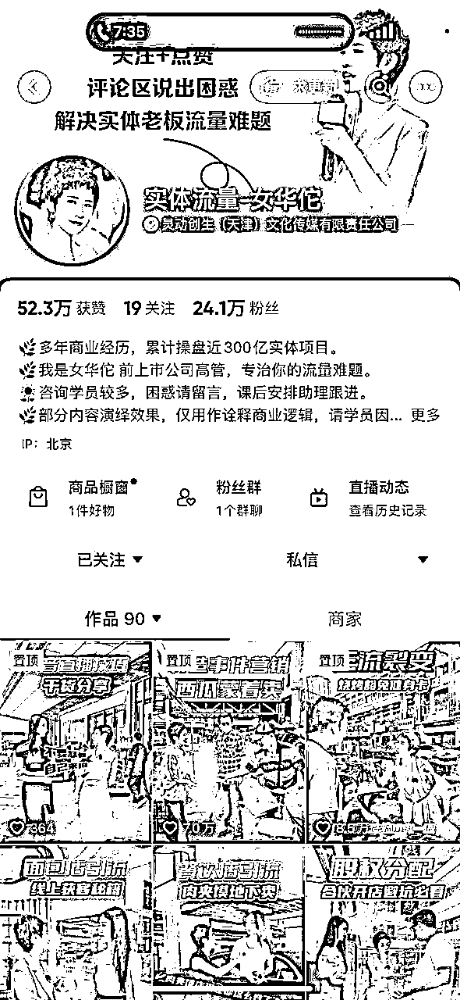

3\. 电话销售

如果感觉线下 BD 的效率不够高，可以考虑电话销售的方式来快速初步沟通商家意向，然后再约线下面聊或直接电话推送服务。

但是电话销售的难度比线下 BD 面聊的难度要更大，如果要做，我们将会面对不断的话术迭代，销售团队的打磨和考核等工作。

## 6.2 提高能力，增加可以服务的商家类型

当做好当下单次的引流活动的业务后，我们也已经积累的一定的精准客源，这时候可以观察他们更多的需求，考虑往杠杆更大的商业服务上发展，比如品牌咨询、私域体系搭建、公域流量获取的搭建、加盟等，这些业务难度更高但是能拿到更大的结果。

以下是几种可能的扩大方式，期待可以带给你更多的思路。

和同一家店进行更多的服务类别合作：尤其新店开业，第一波线上推广以后做完可以延伸出很多项目，比如说美团大众点评代运营，店铺装修，甚至店铺主账号运营，直播挂链接。探店其实也是第一步，后面可以延伸出很多产出利润的点，包括探店的利润也很高。

做培训：整理出一套方法论，做成课程，做知识付费。

和商家联合运营：合作运营的效果比较不错，可以跟商家谈技术入股或商家出资成立新公司占股。

自营门店：拿成功案例和运营数据，跟身边有钱的朋友聊，拉投资成立一家同样的店，运营自己的门店。

# 七、十大线下实体行业引流案例

💡

小节概要

到这里，相信大家对于线下实体引流的流程已经有了一定了解，为了帮助大家更好地代入理解，我们搜集了星球上实体店引流的实操案例，为大家献上菜品丰富的案例大餐。

分别涉及以下赛道：

✅餐饮行业

✅休闲娱乐行业

✅个护产康行业✅珠宝行业

✅学习培训行业

✅商超行业

✅……

每个案例都很有自己的特色，认真看完，相信会有不少收获。航行期间，我们还会邀请更多正在实操的老师来分享经验，如果你有更多的引流经验，欢迎和大家一起交流分享。

## 7.1 餐饮行业

关键词：到店需求、转介绍、品牌口碑效应、KOL 筛选 @椰子青青

餐饮需要的是运营人员有极强的营销意识的，因为餐饮大多数属于客户数量多但服务较重的项目。以下我以一个连锁餐饮的门店私域搭建方案为例展示私域方案的方法和思路。

搭建框架：模拟用户进入私域的路径，搭建私域。通过入店的流程、接触点，再到与店员的接触点，用户产生的行为及结果，我们通过这样的模拟，就可能很快的做出一份社群的门店方案，思路如下：

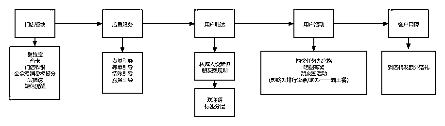

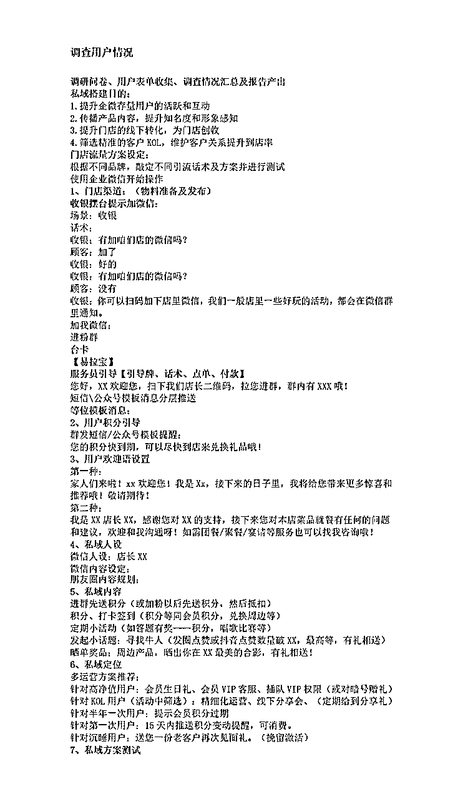

注意：餐饮拓客注重引流诱饵选择，运营注重用户的长期维护和到店。

整体思路中，标注好方案的节点、时间、人员安排、统筹、执行，即可形成相应的项目管理图。在搭建的过程中，同时注意要有闭环意识，比如我在做方案的时候，会从引流，承接人设、私域内容、话术、私域定位来确定方案，并且需要做 AB 测试，及时关注数据变化，进行分析来调整方案。

没有谁的方案是一次性过掉的，所以总会有调整优化的空间，有些方案在这里行得通，但是换一个时间、换一个人甚至换一个条件，都有可能产生不同的效果。 作为操盘者和项目参与者，预期好这样的心态，随时改进和迭代就好，也是互联网人必须具备的心理素质要求。

内容来源：《不同行业私域如何搭建社群体系及运营团队》

【案例一】私房烘焙店 @沙拉开店之前我做了 3 年的私房烘焙，有一个 150 人的种子客户群，客户在群里用小程序群接龙下单购买面包。疫情封城期间，大家的注意力都在线上，我开始做了一些拓展用户的动作：

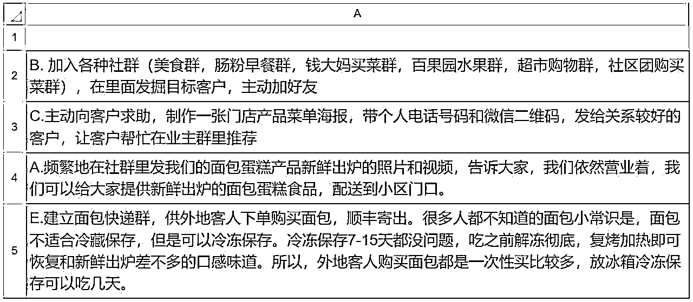

由于我们的面包产品确实好吃，疫情期间有很多顾客自发的帮我转介绍，邀请人进群里来。每一个转介绍面包给朋友，邀请朋友入群的人，我都会把他们的名字登记好，送上一份面包大礼包。我会严格把控产品质量关，让足够好，好到顾客转介绍，这个名单会持续的新增。

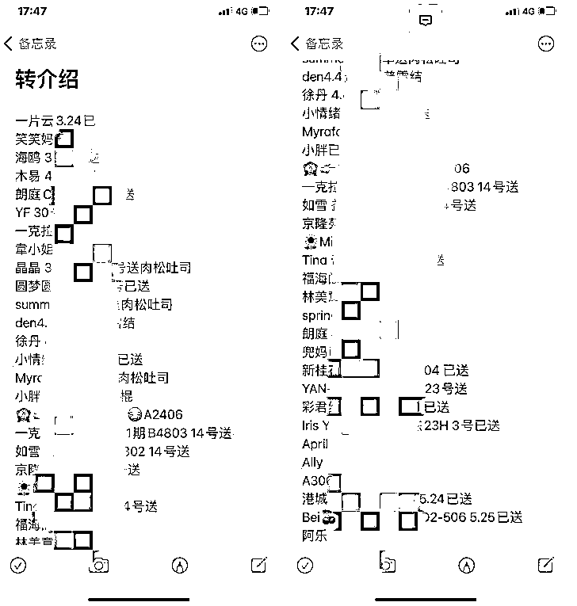

通过转介绍，我们的社群也从 1 个变成了 5 个，订单从每天 10 几单变成了 60 - 70 单，线上营收从每天 200 多到每天 3000 多。相比线下 20 左右的客单价，线上顾客客单价在 40 - 50 之间，更加优质。

在拓展线上客户时也有几个小技巧：A. 发掘美食群主，主动赠送面包蛋糕，协商在她的美食群里发布我们的面包蛋糕接龙活动。

B. 发掘客户里的超级链接者，她们通常是那种情商高，人缘好，人脉广的宝妈。我的顾客社群，就有一个这样的邻居宝妈，介绍了比较多的熟人进来购买产品。

C. 发掘懂得欣赏面包，会摄影摆拍，有生活仪式感和格调的美食达人顾客，他们通常会主动在群里发出精致的面包蛋糕食用美图，这会调动其他顾客的兴趣和购买。

朋友圈的运营我自己的朋友圈内容输出分为几类：

专业内容：和烘焙相关的知识，资讯，自己的观点和思考，帮助面包学员解决问题的成功案例生活内容：亲子阅读，育儿趣事

个人成长：运动打卡，读书心得笔记，冥想练习分享，和高能量圈子朋友的互动，展示自己的自信，坚韧，勇气，真诚，用心，努力等正能量的内容。

好评案例：顾客的面包蛋糕好评截图（征得顾客同意后隐藏头像和昵称发朋友圈），顾客购买面包蛋糕的小故事

和顾客的朋友圈互动：主动给顾客朋友圈点赞；发表真心实意的评论和夸赞。

顾客分类打标签我会给每一个顾客打标签，标签内容写在微信好友备注上：

顾客的名字

居住地址

几个小孩爱吃什么类型的面包

其他的喜好和特征等信息

对每一个顾客情况的熟悉，能够让我们和顾客建立更好的关系，提供更适合他们的服务。

内容来源：《深圳疫情封城期间，我如何通过私域运营，让实体面包店扭亏为盈》

【案例二】椰子鸡火锅店 @不语 1\. 项目概况

整个项目周期半个月时间：

6 月 1 日开张营业，但是因为新店铺以及位置问题。每日单店营业额 3000 元左右

6 月 5 日合作

6 月 6 日开始安排达人到店推广，小红书是主体，抖音和大众点评属于附赠项目

6 月 15 日商家排行迎泽区第一，太原市第四 （大众点评榜单）增加了更多的曝光，目前每日单店营业额超过 10000 元

6 月 21 日完成整个探店活动。

推广方案目前市场上比较常见的平台几乎都是在抖音上拍摄视频，但是我通过全平台，一鱼多吃的方式，全方位铺设实体店铺。

这样做的好处是：可以让大家在短时间内通过各种平台，各种形式看到这个店铺的存在。不管是什么爱好的人都可以通过自己常用的平台来了解到。

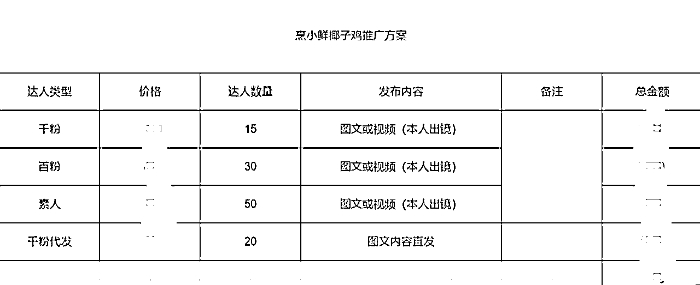

另外，我主要把推广平台放在小红书也有一些原因。我们常见的都是一些所谓博主去探店推广，价格高，推广效果差（因为老百姓对所谓博主的信任度非常低）。我的想法是低粉博主+素人铺量推广。主要原因是以下 4 点：

小红书笔记内容正常的话。素人或者小号发布的内容很容易爆小红书平台现在流量很好

平台用户对所谓探店美食博主没有信任度，反而素人发布的内容可信度会更高一点，人们更认可结合这三点，我这边的探店推广思路就变成了用素人+低粉博主进行推广。

优点：

利润高，基本不存在固定成本，只需要置换即可方法对了很好找。素人资源手里只要有了以后可以很快的开展项目

素人不会像所谓博主，难约难联系，服从安排。

缺点：素人图片或者文案可能做的不会那么好，但是主打的是一个真实。如果老板对文案有要求，可以尝试用 ChatGPT 产出内容。

利润率百分之八十，到店三次。主打的就是一个短平快！（一次性探店的利润是 6000+，更多的利润在于后期的长线代运营服务，把一家店做起来之后，就可以实现被动收入）

内容来源：《探店 15 天 门店由亏损到日利润 6000+，浅谈 3 年探店心得》

## 7.2 休闲娱乐行业

【案例三】轰趴别墅@Mage

轰趴也有大中小类型，所以客群定位也会不同，不同的客群定位所对应的流量来源也会有所不同，主要分为以下几种，公司部门团建 / 家庭朋友聚会 / 学生部门聚会 / 节假日游客。针对不同的客群制定不同的推广方案，雨露均沾 。

公司部门团建主要是 hr 或老板来找场地，当时进了一些 hr 招聘群还有场地周边一些办公楼的物业群，偶尔在群里发发广告配合红包。

家庭聚会没找到很好的切入方式，主要还是靠团购平台和转介绍。

针对游客主要入驻了市面上的平台并且多开房源增加曝光，学生在校内设置了代理和部门进行合作。

利用多种渠道获取流量，利用细节做好存量和复购，到目前接近 2 / 3 左右的订单是来源于微信转介绍。

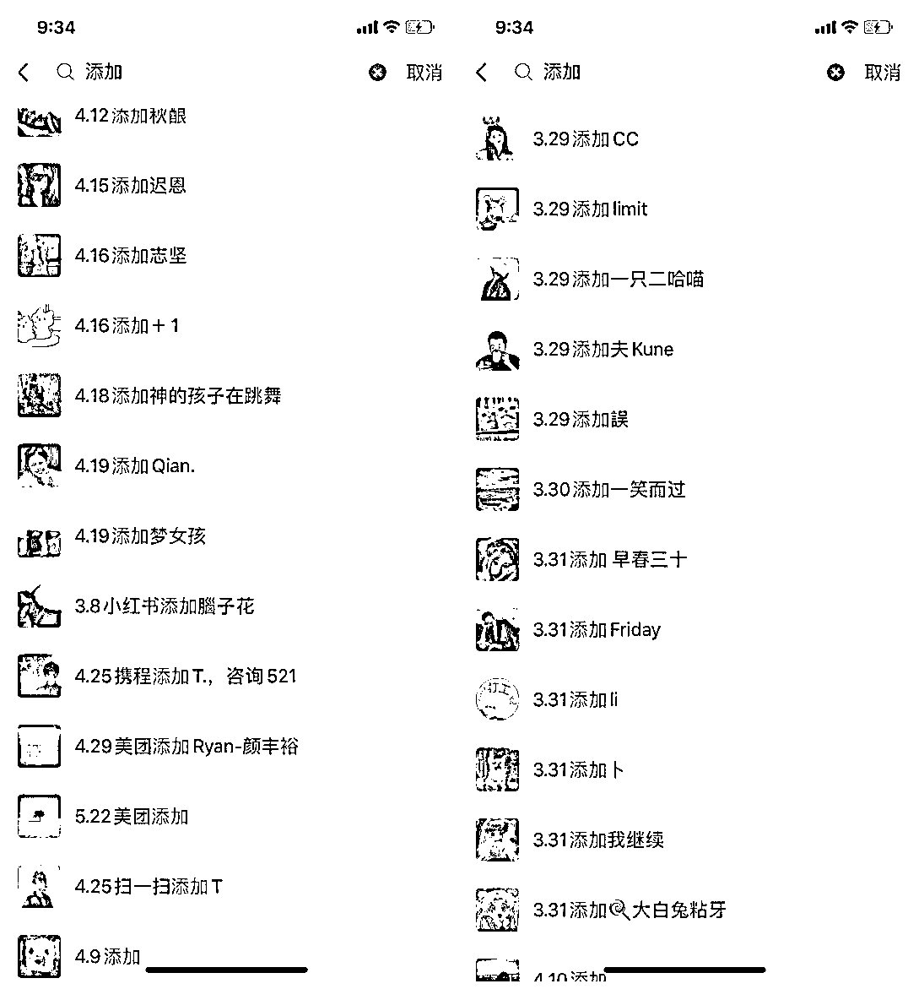

另外轰趴属于服务行业，挣的也是服务的钱，除了传统的场地预订之外，还有提供订餐服务。像这样一份套餐，利润就有 15% - 20% 左右，有时候一场场地费可能才两千多，但是客人在别墅让我提供预订 + 酒水消费可以达到一千多的利润。

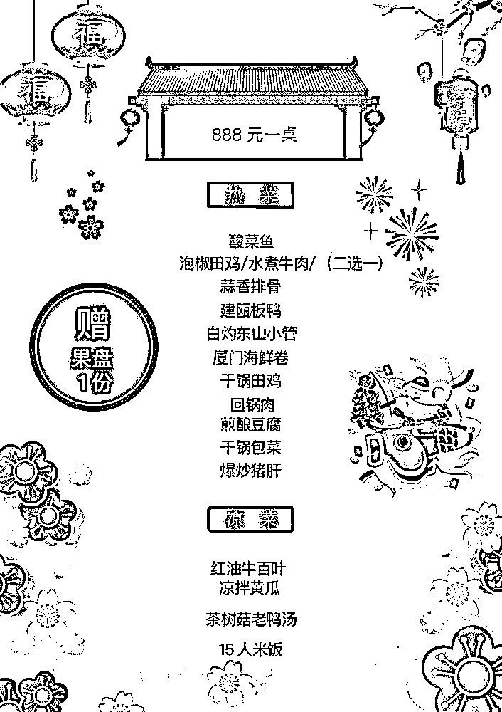

后续能提供的服务取决于你对客户了解的情况，例如今天是什么类型的聚会，有没有准备食材酒水，没有就可以推荐自己的套餐和酒水。

还有就是同行互相推荐和布置场地，比如我这边周六场地已经布置好了，现在客户又急需周六想订，这时候可以把客户推荐给同行，一般有 10% - 15% 的返佣。

内容来源：《从亏损 8000 到盈收 3W+，轰趴别墅通过精细化运营实现转介绍率 70%》

【案例四】儿童卡丁车@后山人 1\. 为什么选择儿童卡丁车这条赛道？卡丁车大家都不陌生，很多朋友都开过。但是目前这个行业额现状是：成人卡丁车场馆占地面积巨大，房租高车辆贵，除了少数一二线城市，大部分的成人卡丁车场馆都很难盈利。

经过前期的调研，我们发现在儿童卡丁车是个细分领域，暂时没有行业寡头，几家规模大一些入场早一些的公司，基本没有自己生产产品的能力，车辆设备全部找的代工厂加工，整体运营水平也不强。但市场需求却是肉眼可见的存在，可以称得上是一片蓝海地带。

内容来源：《从 0 开始打造一家盈利的儿童卡丁车门店》

## 7.3 个护产康行业 @椰子青青

关键词：客单高、充值升单、导购激励和培训、用户转介绍裂变。

短期的拓客活动方案展示如下，大多数的高客单门店经常有拓客的需求，利用社群邀请、任务宝、分享卡等形式进行拓客非常有效。因此，有很多公司会专门以拓客为业务点进行合作。

这种门店因为客单较高，需要及时的动员导购来进行销售，对店内服务人员的激励必不可少，这样后期升单的空间和效果特别好。（谁用谁知道）但是门店导购一般文化水平有限，活动方案也需要先进行培训告知操作方法。

门店的拓客利用就是人性，贪婪、虚荣、炫耀等情绪去做分享和裂变的转介绍，因此，在做方案的时候尽量多考虑人性，多考虑人的心态，并设身处地想一想如果是自己会不会有兴趣参加，如果能打通这个关键节点，方案一般不会太差。

拓客方案最重要的就是如何利用好现有门店的资源（如没有会进行地推、线上投放等形式获取流量），进行用户的二次分享裂

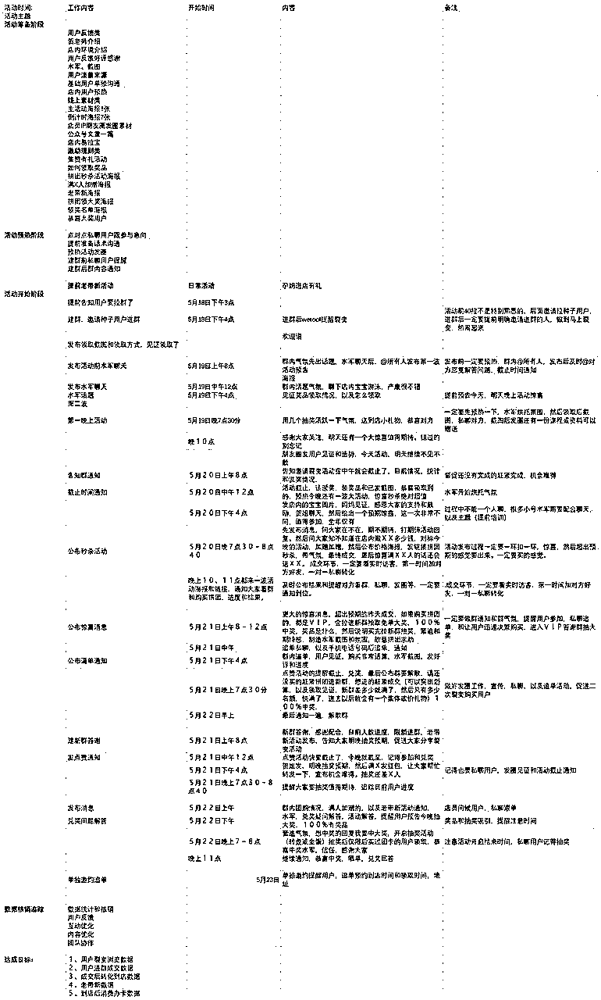

长期的产康社群需要利用 IP 人设着重搭建，着重服务和态度，人性化顾问。因此，在做社群的时候一定要注意利用好每次和客户接触的机会，并且给客户打好标签。做框架方案的时候就需要把这些注意点写明，这样的方案才是完整的。

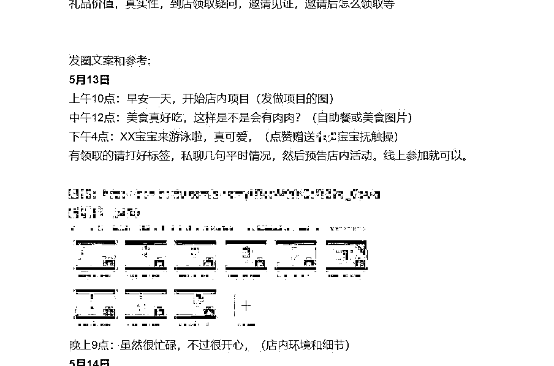

内容来源：《不同行业私域如何搭建社群体系及运营团队》

## 7.4 珠宝丽人行业

【案例五】DR 珠宝@李宏

从渠道上讲，这个品牌做到了完完全全的互联网化。无论是品牌传播，还是营销推广都走纯线上。在微博，公众号，小红书，B 站上玩的不亦乐乎。

DR 多年前从微博起家，当时珠宝业都在砸钱疯狂开线下店铺，DR 就已经把钱全部投到买热搜上了，在微博的平台上做足了一生只爱一人的话题营销。官微上有大量的质疑和反对，但话题的争议性正是品牌营销需要的，因为只有争议才有热度。所以无论你如何说，说什么观点，官微都坚持自己的理念。

而且很难得的一点是，官微都在逐一的回复粉丝的留言，和粉丝互动。互动可以让用户觉得品牌不再是一个冷冰冰的形象，不再是墙上的一块广告布，而是随时 @你，叮咚你的一个大朋友。这样品牌逐步建立起了自己和用户之间的交流机制，让珠宝这种本来就是做情感的行业，逐步的在你的用户心中有了温度。

其他互联网平台崛起之后，DR 开始在小红书种草自己的理念。推广时刻意弱化产品，强化一生只爱一人的理念，将自己这个忠贞不渝的理念种草给用户。

比如小红书的用户能写出这样的体验：“我才 23 岁，就已经收到了男友送我的 DR 钻戒，我问他是知道是什么意思吗，他结结巴巴的说这表示只能和我一个人过一辈子，一辈子宠着她”，还有类似“拒绝男友表白的第二天，我收下了 DR 钻戒，他说你先留着，这是我的承诺，就是认定要和你过一生，永不分离”。

这分明是锁定了女生的心啊！搞定了全世界最难揣测的东西，变成最懂女人心的品牌，销售就成了水到渠成的事情。

而在抖音和 B 站，它成了翻版的农夫山泉。DR 采取了第三方视角，拍一对年迈的夫妻，在白发苍苍，病魔缠身的时候仍然不离不弃，在病床前手牵着手紧紧握在一起，回想当年青春时期立下的誓言，要白头偕老。

找一个素人 20 多的男孩子出镜，拍云南深山里耄耋老人挨着坟居住，因为生活拮据，没有送爱人其他东西，只修了百年之后的居所，要葬在一起，DR 为了鉴证这段爱情，为老人戴上了象征一生的婚戒。再配上文案 “你敢不敢牵了一个人的手，一辈子都不放开”。这类视频的目的只有一个：我们不生产钻戒，我们只是爱情的搬运工。

理念是需要落地的，也是需要眼看得到，手摸得到，用户感受的到。让用户莅临线下店铺，是品牌和产品最好的体验呈现方式。

那么线下体验的核心点是什么呢？仪式感。

和情感挂钩，不能吃不能喝的东西，更要突出仪式感，仔细想想追女孩的时候，送花送巧克力，当众表白等等，为的是什么，就是要烘托气氛，让她沉浸式体验你对她的好。所以 DR 线下店铺的设计，一切围绕着仪式感来进行。

男生来到店铺取戒指时候，要和女生一起，还需要携带身份证原件，销售顾问在系统核查过身份证信息后，会使用区块链技术打印一张永久信息留存表，让用户签字。还要双方签署真爱宣言，一个很大很厚的册子，双方签字摁手印，店里配置了拍立得相机现场拍照，把照片装裱到册子中，要求双方发朋友圈向世界宣布两个人的爱情。

最后销售顾问在征得用户同意后，会采访两个人的相识相爱过程，写成粉丝故事，上传到官网中。公司后台选取经历独特的故事，对用户进行多次采访，撰写成普通人的爱情故事，打造成文案，拍成 vlog ，发布到各大互联网平台上，让粉丝看到真实的自己。最终使用仪式感形成了整个链条的闭环，打通了线上线下，达到新零售的终极目标。

内容来源：《珠宝行业如何用互联网思维建构自己的轻资产企业》

【案例六】美业店家 @陳大妹 May

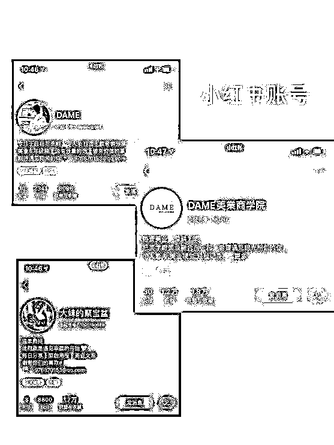

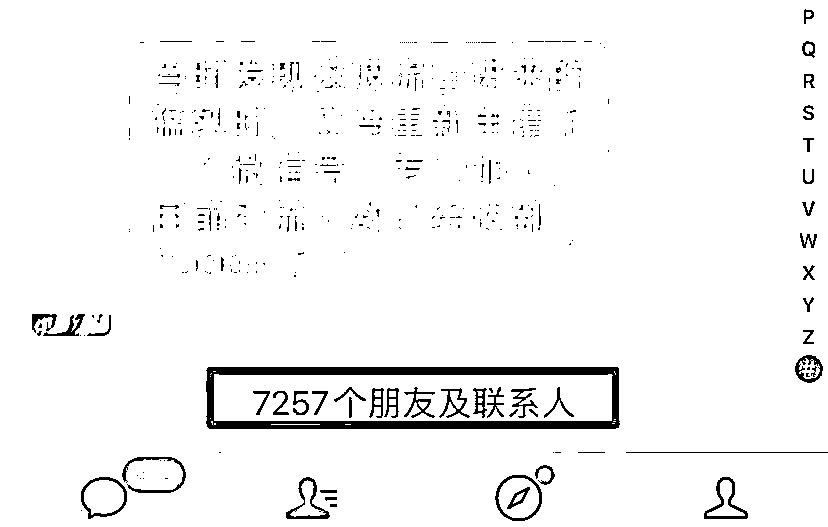

美业海报在小红书上开始有词条了，也加入了很多竞争者，这是我开始就预料到的，这么大的蛋糕我一个人肯定是吃不完的，而应对这种局面我也提前做好了准备，就是我一个人的力量是有限的，我每天再花更多的精力去经营更多的小红书账号，也是不可能抗衡整个竞争圈。

所以通过素材库加入我们护肤品牌的团队成员及我们自身品牌优秀的代理们，我发起了联名推广素材库的提议，号召大家一起去小红书做自己的引流，而此时我们的素材库已经累积了上千张精美海报，并且除了我之外，也有很多的团队成员在里面发布自己做的海报，所以这个素材库已经趋于成熟。

通过筛选，我授权给一些优秀的代理去售卖素材库的权利，那么在这样的背景下，整个美业海报圈里面就有很多人在同时售卖我们的素材库，而他们获得了素材库的提成之外也获得了自己的流量，并且我们也进入了抖音圈。

内容来源：《通过在小红书输出美业素材精准引流，售卖素材库+加盟+建立会员机制实现变现》

## 7.5 B 端

【案例七】自动化设备 @Roy 在做抖音之前，我们仍然依靠传统的电销模式，由于接电话的不一定能拍板，所以大部分时间成本都花费在沟通上了。与此同时，在拜访客户的时候他们获得信息的方式还处于转介绍等手段，效率很低。

原来的整体业务是电销 + 拜访 + 客户来工厂参观考察 + 项目沟通，一个项目下来时间过程 3 个月到半年都是正常的。所以我们急需新的手段和营销方案来提高效率。

为什么可以做抖音？

抖音就像一个物理世界，我们是其中的一个原子。我们不断输出内容、投流，就是给原子增加能量，让它更加频繁地运动，就会增加找到客户的可能性。

3\. 行业时机

目前制造企业人工是一个非常大的问题，所以制造业都是缺人的一个状态。国家也在鼓励智能制造，一些项目是有补贴的。制造业的内卷已经让行业头部企业使用大规模的机器来生产降低成本了，如果后面的企业不跟上，差距就会越拉越大。

该如何做抖音？

另外，这里还有一篇圈友 @封伟-自动化变现分享的食材批发行业私域模型案例，主要包括线上线下引流、提升购买体验和服务价值、联合分销、快闪活动等实操细节，因篇幅较长手册中就不完整展示，你可以点击链接了解：《疫情逆增长，我找到了可复制的食材批发行业私域打法》

内容来源：《通过打造细分行业的短视频 IP，引流精准粉丝到私域成交，实现变现 3000W》

## 7.6 学习培训

【案例八】书画机构 @孙策

通过这样的方式，裂变了 4000 人左右的微信群，95% 以上的都是宝妈，也就是说沉淀了将近 4000 多个家庭，但领取礼品有一个要求，需要登记手机号、姓名信息，也就是说一个礼品，不仅完成了微信个人号沉淀、也获得了一个家长的信息。

动作 2 ：推送活动链接到这 1000 个同城群，前一阶段已经沉淀了一波宝妈流量，因此我们需要推送我们的活动，完成一波的活动的曝光，推送活动要进行持续的推送，不用担心被 t 的问题。

对于抖音常态化的输出是没问题的，打造 IP 也是没问题的，但是如果一个实体门店没有成熟的抖音，我们是无法借助他引爆同城流量的，我们可以利用涓涓细流汇聚成大江大河，

前面讲到送了大量的小凳子以及保温包，进群的宝妈要到店领礼品，因此，我们可以利用抖音爆店码，让所有的宝妈进行抖音视频的分发，1000 个宝妈来领礼品，就有 1000 多个视频分发出去。

1000 多个宝妈的抖音相对来说权重会高那么一些，看视频的也是身边朋友圈多，1000 多条素人视频发出去了，这个位置就加热了，如果再提升一下，还可以找 V3 - V4 的博主过来再加热一下，再挂上引流的团购品，基础团购品，刷刷，短时间内的会在本地形成一定的流量基础。

课时福利：全场可以立减 500 - 3000 元，就是为了在现场进行高价的转化；礼品福利：礼品也是送的价值比较高的康巴赫锅、骑行拉杆箱等；

裂变方面设置 2 人团，拉一个人支付 66 元，得几节课以及礼品，通过让老用户购买 66 元定金卡，再通过去裂变的方式，完成私域流量的裂变。

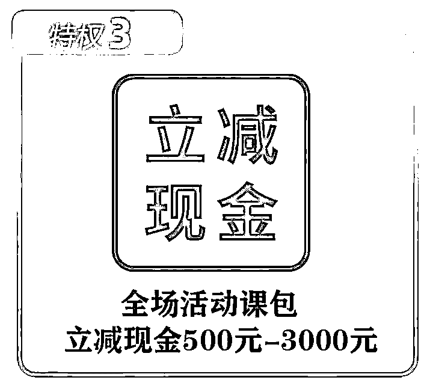

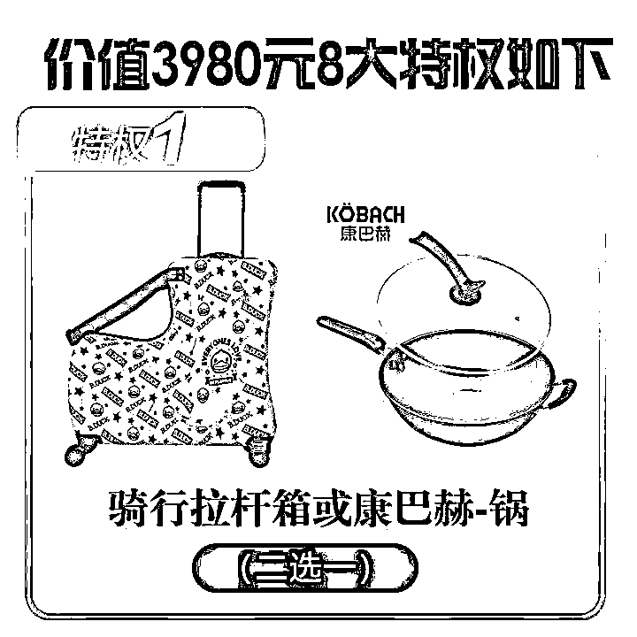

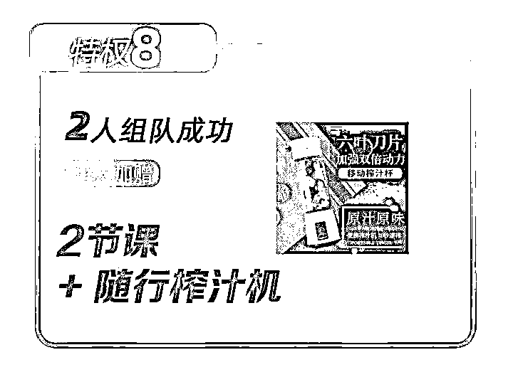

前面讲了我们有 4000 多位宝妈进群，1000 多名宝妈加微信，符合领礼品的到店领礼品，因此可以做这几个动作：1、在群内我们要进行售卖 66 元定金卡，再让购买定金卡的去做裂变；

2、新添加微信的进行售卖 66 元定金卡，再让购买定金卡的去做裂变；

3、到店领小凳子的售卖 66 元定金卡，再让购买定金卡的去做裂变。

3\. 转化到店流量

我们通过公域流量的同城群流量以及抖音流量，还有自有的私域流量以及私域流量的裂变，带动了 66 元定金卡销售，定金卡的数量在 624 张，接下来就是把 624 张卡转化掉，把到店流量转化掉。

这时候，门店要进行造节促销：

在现场氛围方面，现场要制作的相对来说，要有节日的气氛；在成单速度方面，要设计紧迫的支付速度，用老用户带动新用户，所以设计群接龙，也就是说，只要成单的就进行群接龙，然后相互影响；

方案方面，要设计阶梯成交方案，价格阶梯、礼品阶梯，提前买的客户，优先选择礼品、享受更低的价格，通过这样的方式最终，通过这三步走，转化了 160 万，整个周期 20 多天，其实这套方案比较适合瑜伽呀、水育呀、教培呀、医美呀，复制这套逻辑，做个几十万问题不大。

内容来源：《20 天帮助实体书画门店收款 160 万》

【案例九】自习室 @王燕楠

我第一个店从开始筹备到开始营业一共只花了 15 天。这 15 天包含项目调研，选址，定位，装修，上平台一系列操作，好不容易把所有会员都开排了，第一个月就有点掉以轻心了。几乎什么都没做。然后就是全月营收 4200 元。

当时引流也比较迷茫，今天在抖音上拍个视频，明天在小红书上扔几张照片。遍地开花，就跟小老鼠挖钻石一样，东搞搞，西搞搞。我的建议是握紧拳头集中发力在一个点，集中一个渠道，然后做出点成绩，我前期就集中在美团和大众点评上。

实体店引流小技巧：

这个时候肯定又有人说，拒绝的人太多了，我想说的是拒绝才是常态，别人不帮你，不配合你，不怨别人，是你自己黏的不够狠。

2\. 大众点评可以不买东西也能写好评，可以线下引导客户在大众点评上打卡写好评，送日卡之类的，这个需要一对一的去邀请。

我采用的就是人海战术，录一个操作小视频，然后给自己身边 7-8 个关系好的朋友说，一人分配 5 个任务。只需要 1 周，店铺分数就上来了。后边其他的客户看到你这么多的评论就会跟风来店里。

当你把美团和大众点评用人为方法把销量和排名还有好评做到前面的时候，你就可以开始尝试一些其他的平台。

小红书里点【附近】这个选项，每天抽点时间浏览一下，看到那些分享备考的，学习的，直接就给他点赞+走心评论+鼓励，形成常态化。你的小红书名字就可以依然是店的名字，小红书资料不能留联系方式，但是可以把主页的背景图片做成联系方式留下来。

4\. 抖音同城流量现在也不错，也可以试试，刚开始想拍抖音的时候，思想压力特别大，总想把抖音拍的高大上一点。结果就是迟迟没有动手。当时涛哥给我发了一篇他写的文章，如何拍短视频，我就简单粗暴的拍起来了。

后来我在抖音上刷到了同城其他自习室的抖音号，就有点着急了。他的抖音号点赞和评论都挺多的，我的斗志就一下被激发了。换了一个思路，既然对方在抖音上这么下力气花了大价钱，那我就把他抖音下边所有评论的询问地址和价格的客户全部都点赞一下。

我的抖音号就是我自习室的名字，首页就有我的联系方式还有相关内容。大多数客户抖音都没有很多人给他们点赞，你一点赞他们就立刻会点进你主页看一下。你再私信一下，就能导流过来一部分自己的精准客户。（此招很管用，除了会让你的竞品吐血和记恨你，其他的没毛病）

内容来源：《谁说实体一定困难，半年内连开四家店，店店盈利的一些心得》

## 7.7 商超行业

关键词：客单低，利用门店导购，注重导购赋能、宣传效应。

在搭建方案的第一步，我会先做一个思路导图，来梳理清楚方案的框架思路，一般会按照基础流量的运营、用户运营、活动运营、平台支持等内容做一个闭环导图，通过以下这个图我们可以看到方案的雏形，有了这个框架图，做方案也就是优化流程和内容即可。

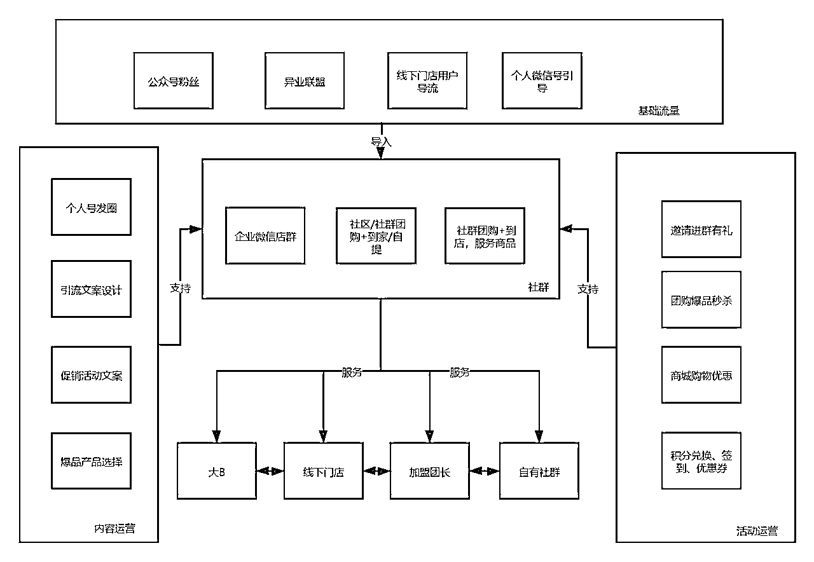

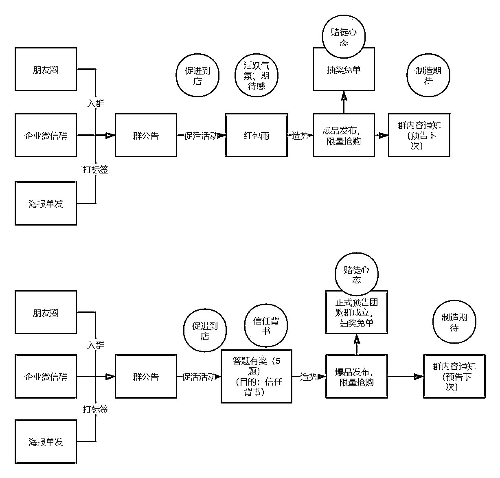

将活动的进入路径如餐饮门店项目一样进行解析，利用用户进入的触点和路径设计好两套不同的方案以供测试或讨论。通过以上的方案设定，我撰写了如下的活动整体方案。

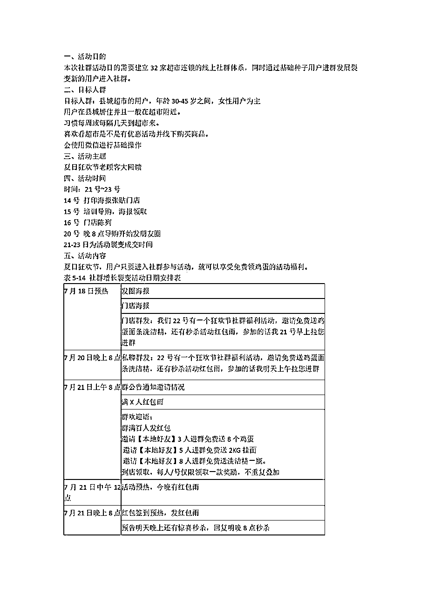

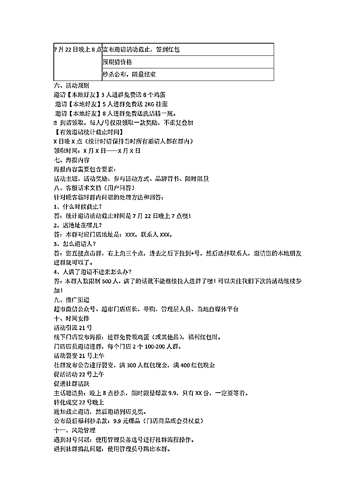

整体方案中包括了细节的比如：邀请话术、邀请时间、活动节点、培训计划、风控计划等，以上方案经过二次讨论和确认就可以进入到执行的项目甘特图中了。

内容来源：《不同行业私域如何搭建社群体系及运营团队》

【案例十】临期食品门店 @Bester

开业前三天到一周可以在店铺周围大量发放传单吸引到店，条件允许的情况下可以用大喇叭循环播放话术，如：xx 店开业，全场 3 折，30 元带走一大包；xx 店开业，xx 产品原价 xx 元，现价仅需 xx 元（大家都知道的产品，价格极低）等。

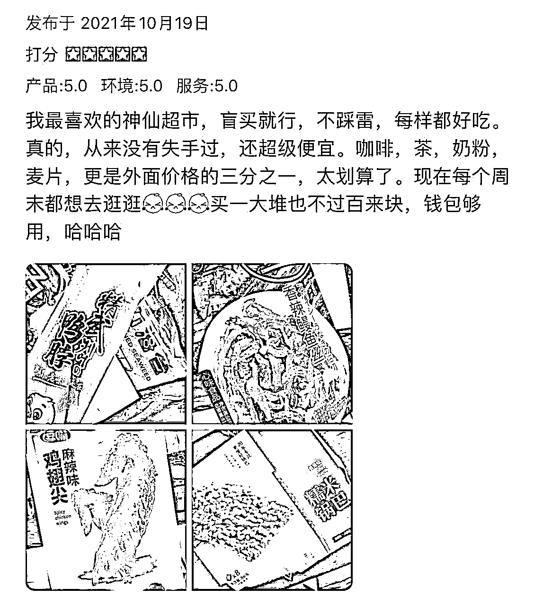

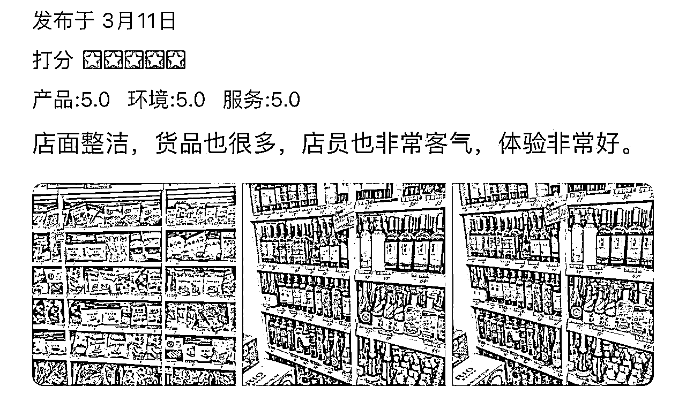

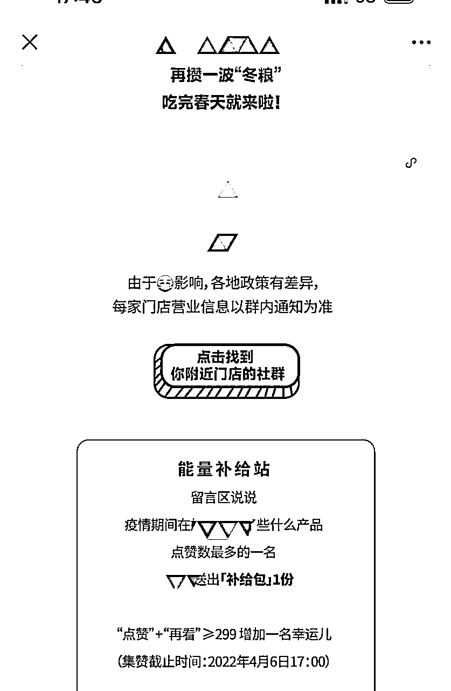

3\. 门店引流私域

引流私域有几个好处：

产品种草与宣发活动营销触达

短保产品预售提高周转率，减轻库存压力

4\. 会员体系会员可以选择做月费、年费或者永久会员，一定要付费，付费可以提高会员粘性，人都是有损失厌恶心理的。

办会员卡时的会员福利一定要够丰厚，比如会员永久 95 折、88 折，首次办卡送 50 元无门槛代金券，会员永久享受 xx 服务等，反正写的越有价值越好。

也可以不定期准备下会员小惊喜，刺激一下。整体的会员体系不用做太复杂，积分体系视情况可加可不加，折扣等福利足够了。

做好员工培训，尤其是服务这块，不要和顾客争辩，无论对错，有则改之无则加勉。

如果要做私域和会员，收银员工培训和激励体系也要规划好，确保每一个结账顾客都会被“推销”到，以便引流到私域或会员体系、会员群。

内容来源：《临期食品店玩法：多 SKU+高坪效》

## 7.8 民宿酒店行业

【案例十一】抖音账号：抖宿@大江💡

民宿相对来说，引流见效较慢，复购低频，很多人都是做探店为主，所以这里会基于一个民宿探店号的案例，来帮你了解民宿酒店如果找达人合作的话是什么样的。

不过想和你说明的是，达人流量成本比较高，而且如果民宿没有特色和亮点，达人没能带来精准流量，那么这次合作就没有太多效果。所以我们在给民宿打造特色的同时，还是要把私域和个人 IP 做起来，建立自己的流量池。

像@抖宿，它的视频就是一个大自然的搬运工，把你带入到大自然的环境中，它把酒店和大自然的风景融为一体，展现出来，另一个有意思的点，这类视频往往少不了美女，美女映入大自然的美景中，美女 + 美景，让人无限向往。

正因为要体现大自然的风景，所以视频都是选的旅游地，这个在视频的合集里就可以看到。总之，视频从几个方面会让你有一种想去看看，想去住住，想去体验大自然的感觉或冲动。

民宿自己的抖音账号也可以参考此类内容产出视频。

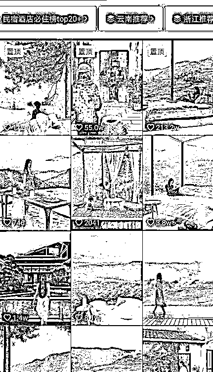

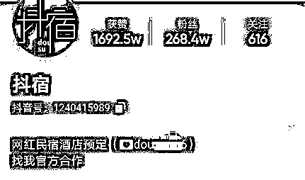

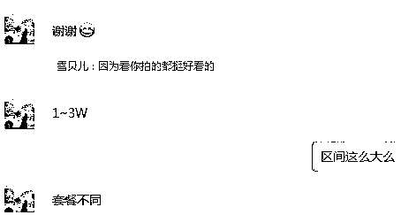

视频团购分佣

抖音视频里面挂了团购小程序链接，有成交就有分佣，卖得越多，赚得越多。

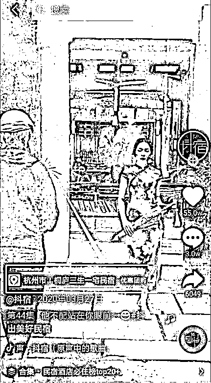

微信朋友圈成交分佣投放达人的微信朋友圈，朋友圈发民宿的信息，后面带团购链接，客户下单完成订单后进行分佣。

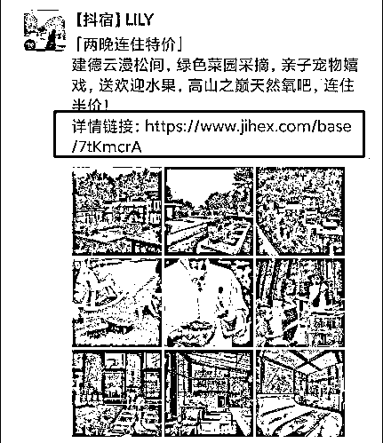

内容来源：《民宿酒店探店号，怎么做？》

## 7.9 大健康行业

【案例十二】线下大健康门店 @李雪梅

于是，我便组织公司所有销售人员，各自拉个群，把客户全部拉进群里面。

由于考虑到有些客户年纪大了，用的是老人机，所以规定进群率不得低于他们手上客户的 80%，由公司出人出力出钱给他们维护客户，这样一来绝大部分员工是愿意的。

我们有 60+ 员工，但是新员工手上没多少客户，就让他们先积累客户，等到了 30 个以上再拉群，于是便拉了 41 个群，后来慢慢新增到了 60 多个。我们做益生菌活动，就是靠这 41 个群做起来的。

由于对客户不了解，对他们的消费习惯、喜好和家庭成员等各方面的不了解，我发布了一条通知，每人每天至少录入五户相关客户的资料进 CRM 系统，里面包括客户家庭成员情况，客户喜好，客户的职业，客户平时的消费习惯，客户脾气、客户习惯接听电话的时间等等一些细节性的东西，要求必须补充完整。

2\. 启动阶段和预热阶段

我们一共整理了 41 个群，差不多 8000+ 人，我们进群的客户全是消费过高端产品的客户（我们产品分为普通和高端两种，有一般的绿色有机食品，也有保健品），也就是这部分客户全部消费过保健品。

所以进群的人，最低消费也是在 6000 以上的，当然，这只是保健品的费用，加上零售的，最低的消费基本在 1W 以上，所以进群这部分客户就是属于我们的 VIP 客户。

没有消费高端产品的客户，我们又拉了另外的群，慢慢每天在里面植入，每天更新不同的内容，慢慢帮助市场部攻单，之后升级为 VIP 客户。

进群这帮人，对于我们的产品至少有个基础的了解。

通过 CRM，我把去年没有买过益生菌的客户调取出来，把买过益生菌很多年，客户反馈很好的那部分也调取出来。

先是把买过益生菌且反馈很好，很愿意作为我们分享嘉宾的客户筛选出来，作为种子客户。

我们当时有五个地方开有分店，于是我们便建立了五个群，每个地区一个群，由于第一次做，不敢拉太多群，也不敢有大动作，先小试一波。

每个地区负责人把员工拉进群后，再由员工把一部分种子客户以及一些 CRM 里面筛选过购买了高端产品但是还未尝试过益生菌的部分客户拉进群，这样五个群的准备环节就一切就绪了。

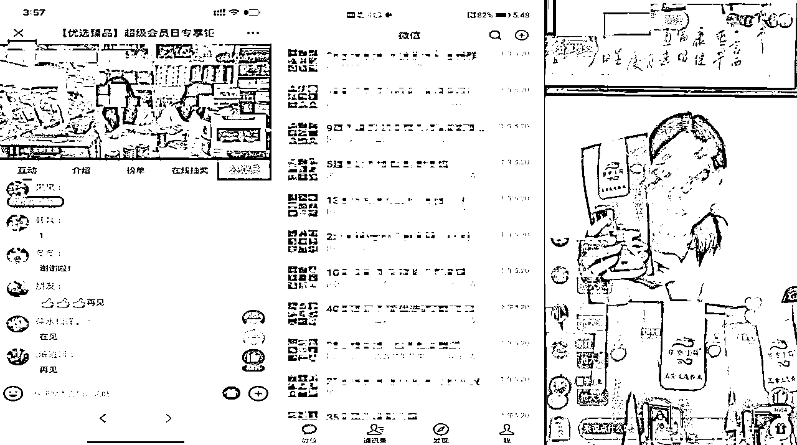

3\. 如何引流及裂变？

我们当时选了一个群管理助手，好像叫火把助手，五元一天一个群，其实很不划算，主要是功能不太齐全，还随时闪退，不过第一次用也就硬着头皮克服了各种困难去使用了。于是便有了第一条群规则：凡是进群的人，每邀请一个当地的客户进群，便可获得门店 10 元代金券一张，一次可使用一张，邀请越多，获得的代金券越多。

这样一来，我们的群很快就满员了。而且群内基本都是当地的居民，便于我们之后邀请到线下做活动，而且线下有门店，这部分客户获得的代金券直接可以到门店进行消费，便于提高可信度以及回暖一波线下门店空无一人的状况。她们也同样可以参与这波活动，所以第一天晚上八点左右，群就满了。

在考虑要不要继续开新群的时候，我们及时叫停，因为第一次做，一切要在自己能掌握的范围内进行，于是我们五个群满员了就没有再进行新的拓展了。

值得一提的是，这波代金券也促进了线下的消费，我们线下门店终于感觉像疫情之前一样了，开始热闹了起来，每天都有很多客户来领取代金券并且进行消费。对于老客户是一个很好的维护，对于新客户，让我们有了接触之后，更加了解新客户的基本情况。

在第二天，我们在群里开始红包轰炸，其实吃咱们产品的这帮客户，大多是四十岁以上的老年人，她们的空余时间很多，抢红包不是为了抢多少，只是为了消磨时间和图个热闹，我们先是群内造势，先让各个店的负责人在群里发表一下之前准备好的感谢词和一些疫情当下我们应该要如何保护好自己的感言，发表完之后，便发红包。

当然，我们发红包也是有讲究的，每天早上九点一波，十点一波，下午两点一波，三点一波，晚上十点睡觉前来一波，发完后就不准任何人在群里发消息了，这样的话培养客户线上的习惯，也让她们学会在线上也要准时，只有准时，才能抢到大红包，才能不会错过每一项福利。

发红包第一天（线上操作第二天），我们有 10 个店的负责人都发表了感言，一个店的负责人发 10 个红包，所以当天一个群内的红包是 100 个，加上小助手预热和关灯红包，一共 106 红包，客户抢的很开心很快乐，第三天还没到点，就准时蹲守了。

第三天，我们依然是发红包，发礼品，礼品领取方式是自己到线下门店领取，第三天发的红包都比较大，然后发完红包后会在群内随机抽取幸运客户，送出门店的特色食品（比如木耳、东北大米、粉丝、豆浆等门店销量好反馈好的食品，我们设置的抽奖助手有一半的人都会中奖，中奖几率还是蛮高的）参与度特别高，不管是客户还是员工都异常兴奋。

到了下午五点，我们便引出我们的主角，讲益生菌课程的老师，于是小助理便出来宣讲接下来三天的听课规则和奖励了：这三天好好听讲，认真做好笔记的人，在群内晒笔记的照片，由工作人员检查后便可获得豆浆一包，听课时间，每天早上九点到十点，下午两点到三点（因为她们要做笔记，所以整场下来，每个人在群里的时间消费一天在三到四小时左右）。

第四天，课程开始了，课程开始和结束都会有红包开路。

出乎意料的是，这些客户做笔记异常认真，而且写了满满的几页纸，再加上一些客户晒笔记在群里，获得豆浆一包后，不想动笔那部分客户也开始被激励了，有些客户晚上十一二点还在补笔记。三天的课程每天晒笔记得到的礼品都不一样，客户热情度就很高，又可以学到东西，还可以领取到各种礼品，所以基本进群的每一个人都在认真听课。

然后课程的第二天，也就是整个环节第五天，我们开始回到正题，开始植入讲解相关产品，课程第三天，也就是整个环节第六天，开始宣讲咱们产品优势和在国内获得的专利，以及哪些人在用我们这款产品，于是便在群内放购买政策了，现在有意向报名的人，还可继续免费获得三天益生菌的试饮装，而且还可获得买一赠一的机会，不过现货不多，需要在群里打出「我报名」三个字。结果，就爆了，基本都报名了，少数没报名的人看着这么火爆也开始报名了。

5\. 线下成交

于是我们便邀请，第二天来店里面领取，等到员工通知了再来，因为害怕一次性来了招待不了，体验感差，所以让他们分批次来，而且这么多人，疫情之下，更是要注意，所以就分批次去到门店了解，并且兑换这几天听课的礼品。

当天，也就是第七天，下单客户总市场就 400 家左右，整场业绩在 240 万左右，其实后续几天都在持续出单中，大概也有一百多万的回款。

所以整场下来，其实 400W 销量是有的，而且对于那些没出单的客户，来线下兑换礼品的时候，我们的销售人员继续跟进，继续维持关系，最后即使没下单益生菌，也会让他慢慢信任我们，购买了其他产品。

当然，过程中，以及售后客户关系的维护都很重要，所以我们的客户粘性很高，粘性高到一个什么地步呢，但凡我要上新品，客户一定会购买！很多客户家里甚至摆满了一面墙，都是我们的产品。所以我们产品的回购率在 80% 以上，满意度在 98% 以上。

内容来源：《以大健康线下门店为例，从快速梳理客户、获得第一批客户、裂变到客户成交这 4 点详述线下门店获得自己第二增长曲线的方法论》

## 7.10 摄影行业

【案例十三】儿童摄影门店 @文文 Part1：前期准备【确定价格 / 产品 / 活动噱头】

首先在活动发起之前，我们对目标客户及现有客户基础进行了一个系统的分析。这家门店本身的客户基数一般，都零散的分布在各个员工的微信号上，并没有进行系统的管理和标签分组等。

所以我们筛选之后判定：一部分老顾客都是已经可以重复唤醒进行再次激活产生复购的，同时，只要设置好强裂变机制，就可以实现 1:2 甚至 1:3 的客户转介绍。

所以，我们这次的活动目标就非常清晰，通过一场线上活动，整理并激活微信上所有的用户，实现重新复购及新客户的裂变成交。建立在这个基础之上，我们开始制定活动方案，因为此次的目标在于引流锁客，进店拍摄完毕之后才会进行二次转化和成交。

所以此次的活动内容设置主体为体验拍摄的引流套餐，我们推出了几个爆款主题，同步筛选出了一些市面上较为新颖的产品，以“新品发布会”形式为活动噱头。同时，朋友圈开始进行全面而广泛的造势，进行预热铺垫等，唤醒客户关注度。

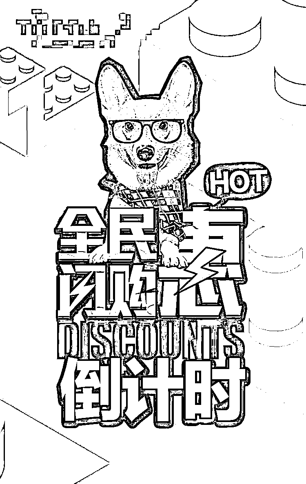

Part2：前期准备【发起快闪群 激活客户 完成新粉丝积累】因为店内微信号没有进行系统化的整理和维护，所以活动启动前的第一步，那就是先来唤醒用户的关注度，再通过福利引导吸引一批新粉丝，所以我们发起了一个为期 2 天的快闪群。

顾客进群之后即可免费领取 99 元的宝宝最美证件照拍摄，同时，邀请 5 位本地宝妈进群还额外加赠网红泡泡机一个。这步举动有三个意义：因为店内微信号没有进行系统化的整理和维护，所以活动启动前的第一步，那就是先来唤醒用户的关注度，再通过福利引导吸引一批新粉丝，所以我们发起了一个为期 2 天的快闪群。顾客进群之后即可免费领取 99 元的宝宝最美证件照拍摄，同时，邀请 5 位本地宝妈进群还额外加赠网红泡泡机一个。这步举动有三个意义：搭建社群第一步：发朋友圈造势，点对点邀约种子客户进群，设置每 1 个员工创建一个福利群（根据微信粉丝数量为标准），同时控制群内种子客户人数在 70-100 之间，方便留有余地让种子客户邀约新粉丝进群。

同时，设置好快闪群的配套三件套：群名/群公告/群欢迎语等，在此基础之上创建了 17 个社群，同时在 48 小时之内完成种子

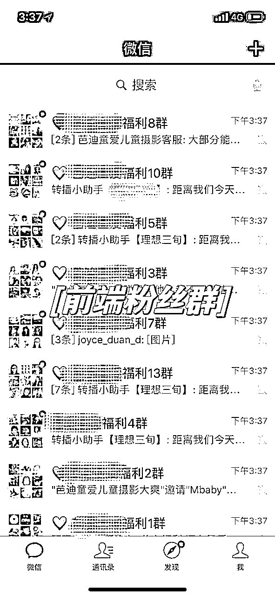

Part3：正式发售【群内首批成交客户】

前端粉丝福利群创建好之后，进入到了第二天晚上的销售时间，由工作人员统一在群内进行转播，为大家公布此次活动的优惠政策及福利内容，同时告知大家规定时间到店内领取礼品。

福利公布完之后，直接放出此次成交价格及活动内容吸引顾客参加，在这个过程之中，每个群内都提前埋伏的有水军，方便在社群发售的时候进行互动，从而促进群内快速成交。

为了保证当天群内的客户快速决断，我们还设置了一款引导顾客快速下单的福利礼品，当天晚上前 300 名付款成功的顾客，可以额外加赠安抚大象一个。

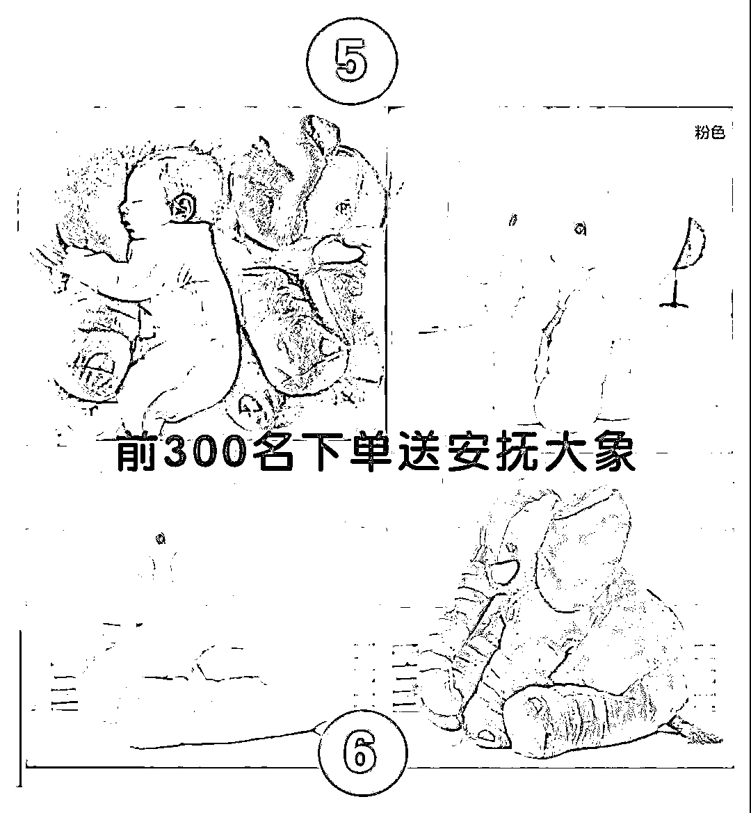

其实这个礼品的成本核算本身就在套餐里面，发售当晚抛出是为了利用顾客厌恶损失的心理，从而实现快速成交。

与此同时，所有人的朋友圈同步做好客户见证和顾客订单截图及好评，再次炒热一波儿，激活那些还在观望或者没有来得及进群的顾客的关注度。群内也同步采用订单顾客群接龙的方式，引导更多的用户参与进来。

Part4：客户裂变【拼团 团购 拼多多】首批顾客成交完成之后，接下来最重要的就是怎么实现快速裂变，毕竟，这才是作为门店老板最想要的核心。

我们设置的第一个裂变方式是以团购模式作为发起。为了方便顾客快速成团，所以设置了三个阶梯式的团购内容及对应的不同的奖励机制。团购的人数越多，对应的奖励机制也就越丰富。（对于宝妈群体来讲，2、3、5 人成团是我们测试出来最容易完

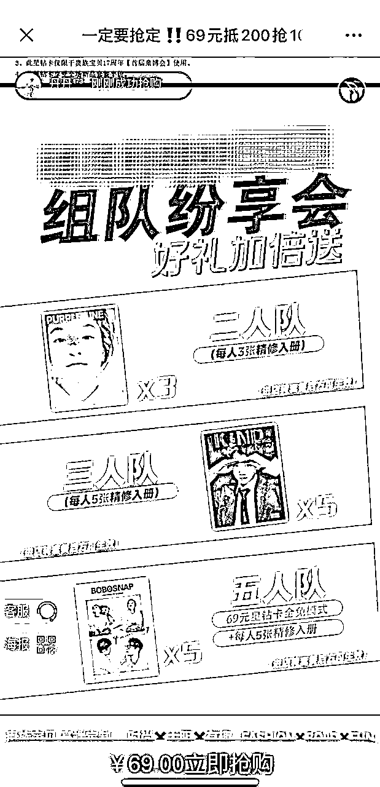

同时，活动报名是以 h5 链接的形式进行呈现，顾客打开链接输入信息可以直接进行付款购买，我们会引导顾客直接分享活动链接给好友，邀请订单，拼团成功后，客服也会第一时间告知顾客，同时激励顾客冲刺下面人数更多的团购福利。

如果没有用 h5 链接，而是采用微信红包进行直接收款的话，那一定要主要做好客资统计和客户信息登记。同时，要求客户把客服微信推送给一起拼团购买的用户，我们在微信端同时做好备注和标签登记。

上述不管哪种方式，都是在通过给予用户团购福利的形式，完成客户裂变的过程。

Part5：客户裂变【分享朋友圈】

除了引导团购之外，第二个裂变方式，设置的是以分享朋友圈，提升曝光量为核心的任务设置。顾客只需要配上我们发给他的

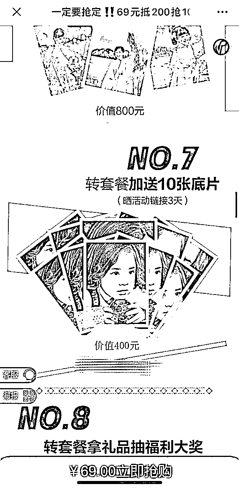

这一步操作还是很简单的，但因为是顾客后期到店之后兑换领取的，所以顾客不会删掉或者屏蔽这条朋友圈，而且赠送门槛是

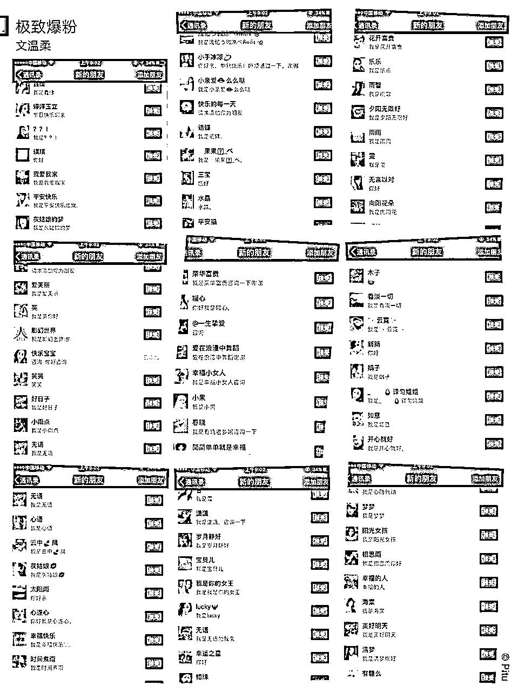

因为这两步裂变机制的设定，实现了我们此次活动 70%的新客占比，给予介绍人与被介绍人同等的福利与内容，在此过程中一定记得及时做好客户提醒和监督，我们是每天晚上都会提醒客户，记得转发朋友圈，记得推荐身边想要一起拼团的小姐妹，大家快来一起领取福利等。

Part6：活动倒计时【倒计时促单】

在活动进入第 6.7 天的时候，已经基本算是进入了尾声，这个时候，我们就需要给顾客营造一种紧迫感。开始采用每天定时发放 700 个名额的形式，抢完即止，朋友圈同步进行名额倒计时的推送。

对于已经成交的顾客，进行最后一轮提醒，邀请顾客尽快组团成功，否则活动一旦结束还未成团的顾客就没办法领取福利了。基本这个时候，很多在观望或者犹豫的顾客都会下单进行购买了。

Part7：活动复盘【客资统计 邀约进店】活动的最后一步，就是做好客资统计与归纳，毕竟一次引流活动不是目的，把这些用户做好客户分类从而实现长久的转化和成交才是真理。标签/备注/分组/客户来源等进行细致的划分之后，进入邀约顾客进店的环节。

最后，给大家看下最终的成果展示：

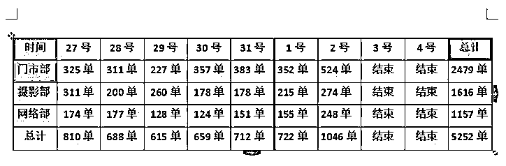

原定于 9 天完成的目标，我们用了 7 天时间成功突破了 5000 单，最终完成了 5252 单～

内容来源：《活动复盘：7 天线上活动，为儿童摄影门店拓客引流 5000+》

## 7.11 附：案例拆解方法 @Nico 酱

💡小节概要

上面我们提供了一些行业案例供你参考，不过每家实体门店的情况不同，还是要根据自己的情况来进行引流方案的设计，可能上面没有非常适合你的案例，所以在这一小节，我们附上了圈友 @Nico 酱的拆解案例的方法。

任何你认为做得好的，值得学习的行业案例都可以进行拆解。然后结合自己的行业拆完后抽取可以复用的玩法直接用，形成正反馈。

接下来我们就来看一下如何拆解一个行业案例吧！

如何快速确定案例拆解对象？

第一步：参考 APP 排行榜单，找排行在前的实体门店进行拆解第二步：朋友圈、社群、广告，身边的朋友愿意推荐分享的，每一个让你有点击欲望的都值得被拆。

第三步：定向搜索某个行业或者某个运营目的的活动，有针对性地去拆。

第四步：看别人拆解过的案例，每个人看到的都是不一样的，从不同的角度再拆一遍。

我会去深扒他们背后的运营套路，拆解每一个环节的设计逻辑，看有没有可以学习的地方。我自己一般会按照五个步骤做拆解。

第一步：我会写上这个案例的具体流程是怎么样的？把自己站在一个体验者的角度，梳理这个案例的基本流程，然后拆解它的运营目的。

第二步：我会思考这个案例会有什么亮点和不足。

第三步：我会思考这个案例的亮点有哪一些是我可以复制到我这个行业的？我应该怎么结合自己的行业做调整？

第四步：我会思考这个案例的不足如果是我去设计的话应该怎么做优化。

第五步：我会思考这个案例可以给到我什么启发。

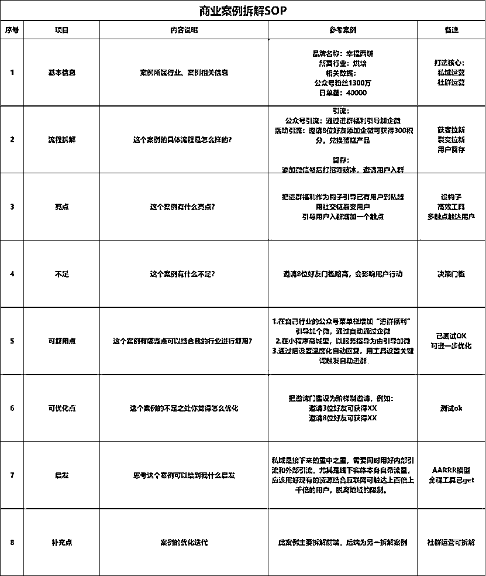

平时看到好的案例我会用印象笔记的剪藏功能进行收集，然后去拆解，也方便后期查找。

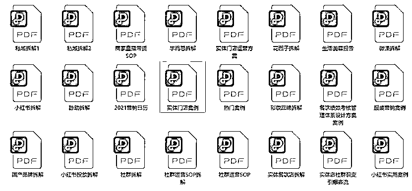

拿百草园的案例举例，我这里简单拆解这个案例的亮点和可复用的地方。

从今年初到 8 月份近 5000 家门店百草园已经导流企微社群用户 410 万人，平均每个门店组建的社群人数近千人，流量进群后，月消费提升 7 倍。

亮点 1 ：开店前通过线下门店触达了精准用户

亮点 2 ：打造了真实场景为消费者创造了购买理由

亮点 3 ：营造推动客户购买的决策氛围结合美业门店做复用的话，新店装修期间，在门口摆一个小桌子送美妆蛋、女孩子喜欢的可爱玩偶等等，而获取这些小礼品的条件只有一个，就是进群。

进群后店主会每天在群里分享新店装修进度、自己的心情等等，持续在群里分享专业的护肤干货并进行互动答疑，然后她用打造真实的消费场景这个方法在群里做新店特惠限量接龙秒杀，拿面膜、项目等等做活动，把他们的图片、使用场景、效果对比、别人的反馈等发群里参与接龙，满足一定条件下甚至可以享受免单。

在开店之前组建社群，用这种方式不止解决了开业前没收入的问题，还解决了新店开业没人到店的问题。

再拿我前几天通过大众店铺排行榜过去的粤菜举例，一到店我就看到了写着「收藏+打卡送一份南瓜沙」的台卡，在点餐的时候服务员自然而然地进行引导。

当时我就想：

为什么要引导收藏 + 打卡？因为可以提升店铺权重。

为什么要提高店铺权重？因为可以提升排行，增加店铺曝光率。

为什么要提高店铺曝光量？因为想要有更多的用户进店。

为什么是点餐的时候引导？为什么是穿着典雅的服务员小姐姐来引导？引导的时候用了什么话术？那么是不是美业门店也能通过收藏 + 打卡送某个增值项目或者特惠充值优惠等进行运用呢？

用 5W2H 和 5WHY 不断深入分析。

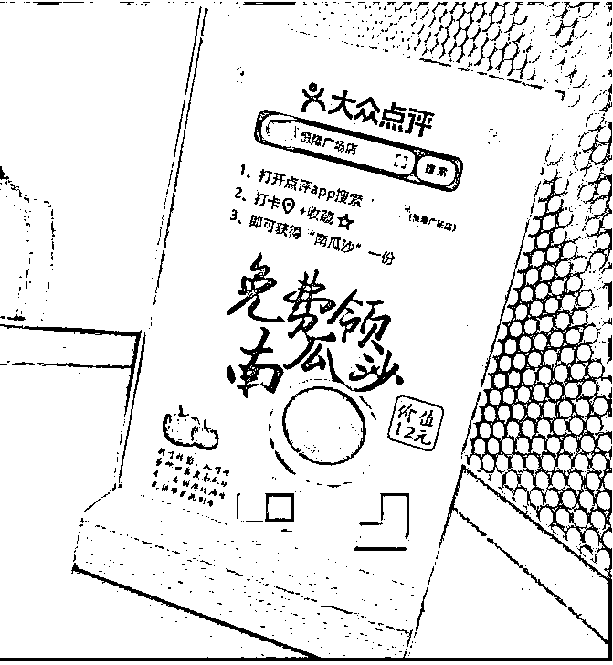

这是一个特别简单的例子，效果也显而易见，但实际在运用的美业门店是特别少的。

所以，当门店在选择和互联网的结合方向时，我认为可以从商业案例拆解做起，边学边用，搭建自己的案例拆解框架，思考背后的商业模式和设计逻辑。

内容来源：《200 家日式皮肤管理加盟店背后，我是怎么把美业生意和互联网运营结合的》

