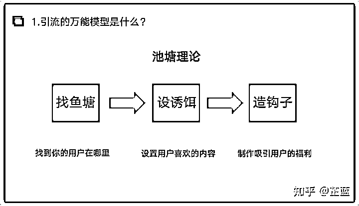
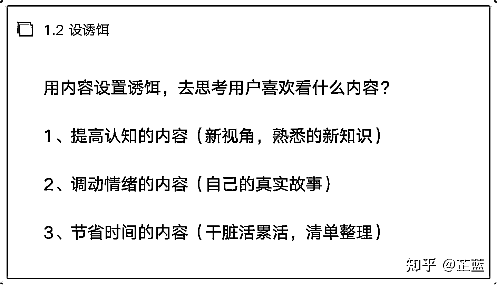
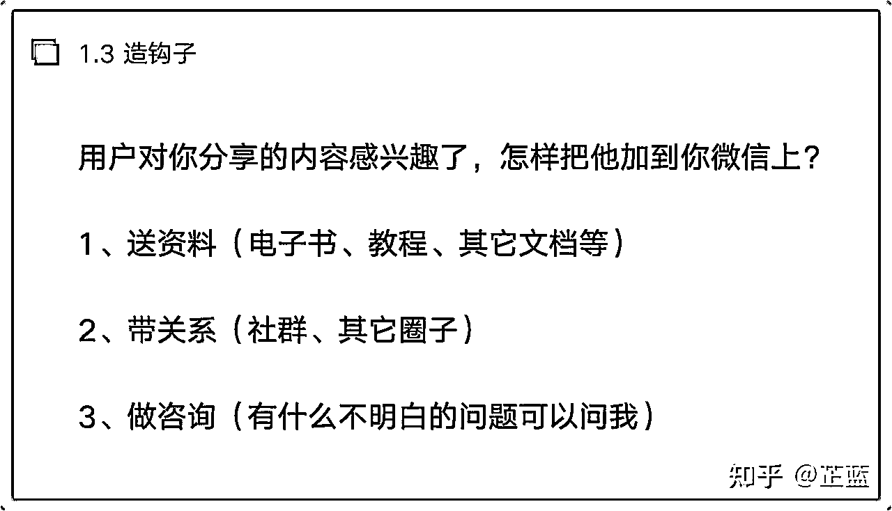

# 1.3.1 引流

通过内容＋渠道（抖音、知乎、小红书等自媒体平台）的方式，把公域流量拿到私域。

这里要给大家分享一个引流的万能模型：池塘理论

第一步：找鱼塘，就是去定位目标用户在哪里？

举例子：比如你是做减脂产品的，能通过出售（减脂产品）满足（减脂困难、减脂反弹）这类人的（科学安全减脂）的需求。

那么，通过定位确定了目标用户的画像之后，我们就要去找这类人在哪呢？想一想，那些反复减脂不成功，或者一开始就要科学减脂的人会做什么呢？会去什么平台呢？

① keep（去购买减脂课程，去社群看别人怎么减脂）。

② 知识付费圈子，找存在感，找同频人。（千聊、荔枝等）。

③ 线下健身房。

池塘找到了，下一步干什么？我们要混进去，然后用内容去吸引他们。

问题来了，什么内容会吸引到用户？

第二步：设诱饵，让你的内容能够吸引用户

① 提高认知（比如很多人不知道，其实做无氧训练是可以帮助减脂的，肌肉可以增加人体的代谢水平，帮助你更快的消耗掉脂肪）。

② 调动情绪（写自己的故事，自己之前多胖，后来通过健身房＋健康饮食的解决方案，一番周折，中间还反弹了，但是继续调整方案，最终瘦下来，身边的人对我有了新的看法，以前老公不爱看我，现在主动给我买衣服之类的）。

总之，故事要有曲折性，要设置一些心魔，比如放弃了，后来因为什么事情，又拾起来了。你写的越心酸，越能调动人的情绪。

③ 节省时间（这个好理解，我把知乎上所有关于兼职的帖子都看了一遍，总结出 xxx 个高赞回答送给你。想要的朋友圈加我微信吧）。

以上就是【设诱饵】让用户注意到你。

第三步：造钩子，你需要把用户钓到自己的流量池里去

拿什么钓？芷蓝给大家总结了 3 种我自己常用的方法：

① 添加我的微信，回复关键词 “ xx ” 获取文中资料。

② 如果你对 xxx 感兴趣，欢迎来我们群里坐坐，这里有 2000 个同频好友等你交流哦。

③ 添加我，免费赠送 15 分钟咨询，只要是关于 xxx 问题的，都可以问我。

一般来说，让用户感兴趣的，也就是这 3 点了。

说白了就是：我送你点东西，我带你一起玩，我给你些建议。以上就是引流的完整逻辑，无论你引什么流，引流什么，引流到什么地方，都是这个玩法。

大家心里先有个谱，这样未来遇到问题，也可以科学地去思考。其实，引流这件事，技巧都是辅助，优质的内容产出才是主攻。

你看那些网上的教程，教你各种引流技巧，其实大多数都没意义，也许你用一些小心机，把用户引流至私域，但用户发现你原来就这么点墨水，很快就会离开。而且，你把心思放都放在引流技巧上，一定会减少内容产出的频率。无论是在网上，更新频率是用户记住你的唯一方法，剩下的都白扯。

所以，大家不要本末倒置，这也是很多人私信问我到底怎么引流，我的回答都是好好写东西，技巧知道就行。