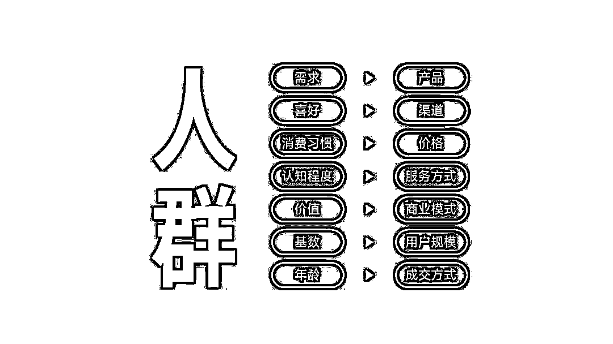

# 2.1.2 第二步：找鱼儿

鱼塘里可能有鲤鱼、草鱼、鲢鱼各种鱼类，同样的在一个平台里活跃用户有不同年龄层，不同年龄层关注的内容和喜欢的东西也不一样。

所以我们公式里的为 XXX 人群，就是确定目标人群画像。

年龄：少儿、大学生、25-35 岁、35-45 岁...

职业：学生、白领、蓝领、宝妈、店家...

收入：低收入、中产阶层、有钱人...

地域：同城、同省、其它城市...

性别：男、女

根据你的服务人群属性，来确定你的引流内容和引流钩子，吸引来越精准的客户人群，成交转化率越高。